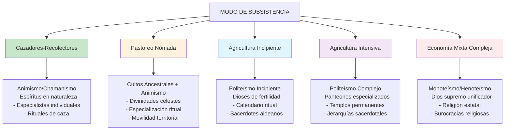
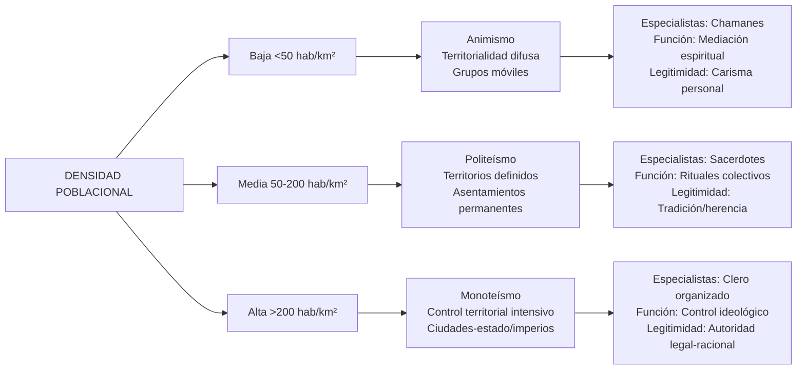
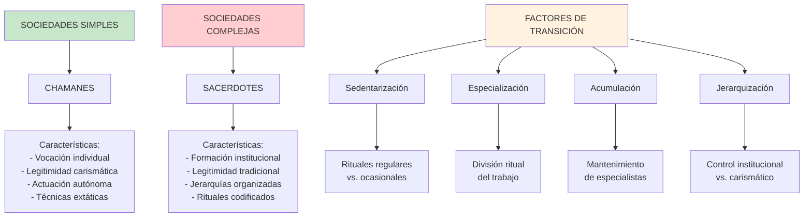
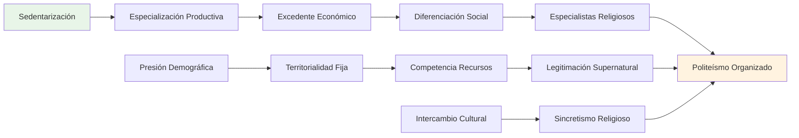
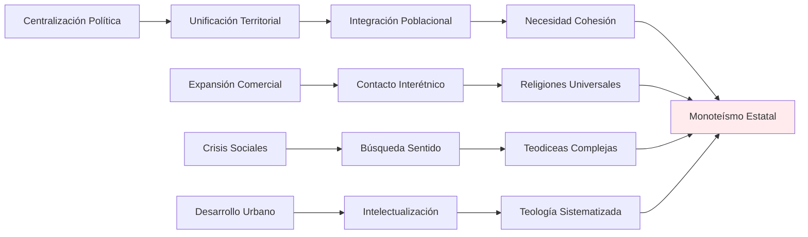

# Variables y Causas Estructurales de la Transición Religiosa: Del Animismo al Monoteísmo

## Introducción: Marco Analítico Estructural

Este documento analiza las variables sociales, económicas, políticas y ecológicas que determinan las transiciones religiosas, utilizando un enfoque estructural-funcional para identificar patrones causales específicos. Nos centramos en las condiciones materiales y organizacionales que favorecen distintos sistemas religiosos.

## Análisis de Variables Estructurales (ACH - Análisis de Correspondencias Históricas)

### Variable 1: MODO DE SUBSISTENCIA

### Variable 2: ORGANIZACIÓN SOCIAL Y JERARQUIZACIÓN

| Tipo de Sociedad | Estratificación | Tipo Religioso Dominante | Especialistas Religiosos | Control Social |
|------------------|-----------------|--------------------------|-------------------------|----------------|
| **Banda** | Igualitaria | Animismo/Chamanismo | Chamanes individuales | Horizontal |
| **Tribu** | Segmentaria | Cultos ancestrales + Animismo | Ancianos + Chamanes | Por edad/linaje |
| **Jefatura** | Rango/Estatus | Politeísmo temprano | Jefes-sacerdotes | Centralización incipiente |
| **Estado Temprano** | Clases sociales | Politeísmo complejo | Sacerdocio profesional | Coerción institucional |
| **Imperio** | Castas/Estamentos | Monoteísmo/Cultos imperiales | Burocracias religiosas | Control ideológico total |

### Variable 3: DENSIDAD POBLACIONAL Y COMPLEJIDAD TERRITORIAL

## Factores Causales Específicos por Transición

### 1. DE ANIMISMO A POLITEÍSMO

#### Causas Estructurales Primarias:
- **Sedentarización**: Transición de cazadores-recolectores a agricultores
- **Especialización productiva**: División del trabajo más compleja
- **Acumulación de excedentes**: Capacidad de mantener especialistas religiosos
- **Territorialidad fija**: Necesidad de legitimizar control de recursos

#### Mecanismos de Transformación:
1. **Fragmentación espiritual**: Los espíritus naturales se especializan por función
2. **Antropomorfización**: Los espíritus adquieren características humanas más definidas
3. **Jerarquización divina**: Aparición de dioses "mayores" y "menores"
4. **Institucionalización ritual**: Desarrollo de templos y cultos regulares

#### Variables Intervinientes:
- **Presión demográfica**: Mayor población requiere organización más compleja
- **Contacto intercultural**: Intercambio de ideas religiosas
- **Desarrollo tecnológico**: Herramientas que permiten arquitectura monumental
- **Diferenciación social**: Emergence de élites que patronan cultos

### 2. DE POLITEÍSMO A MONOTEÍSMO

#### Causas Estructurales Primarias:
- **Centralización política**: Formación de estados unificados
- **Integración territorial**: Control de poblaciones heterogéneas
- **Competencia interestatal**: Necesidad de cohesión interna
- **Urbanización avanzada**: Concentración poblacional en ciudades

#### Mecanismos de Transformación:
1. **Sincretismo forzado**: Fusión de panteones locales bajo deidad suprema
2. **Legitimación política**: El monarca como representante divino
3. **Universalización**: Extensión del culto a todos los súbditos
4. **Racionalización teológica**: Desarrollo de doctrinas coherentes

#### Variables Intervinientes:
- **Expansión comercial**: Necesidad de sistemas religiosos portables
- **Contacto con otros imperios**: Competencia ideológica
- **Desarrollo filosófico**: Escuelas de pensamiento abstracto
- **Crisis sociales**: Guerras, epidemias que requieren respuestas unificadas

## El Rol Específico de los Chamanes en las Transiciones

### Características Estructurales del Chamanismo

El chamán es presente principalmente en las sociedades cazadoras y recolectoras y actúa como especialista religioso individual con las siguientes características:

#### Función Social:
- **Mediación espiritual**: Entre mundo natural y sobrenatural
- **Sanación**: Tratamiento de enfermedades físicas y espirituales
- **Adivinación**: Predicción y orientación para decisiones grupales
- **Ritual**: Conducción de ceremonias estacionales y de paso

#### Legitimidad:
- **Vocación personal**: Tras una iniciación (y una vocación previa) domina a los espíritus
- **Eficacia terapéutica**: Resultados en sanación y resolución de problemas
- **Conocimiento especializado**: Dominío de técnicas extáticas y herbolaria
- **Control comunitario**: La sociedad espera esto de él y le expresa sus quejas, al tiempo que ejerce su control sobre él

### Transición: De Chamanes a Sacerdotes

## Análisis Estructural por Tipos de Sociedades

### Sociedades Guerreras y Religión

#### Sociedades Guerreras Nómadas:
- **Tipo religioso**: Cultos marciales + chamanismo
- **Deidades dominantes**: Dioses de la guerra y el cielo
- **Especialistas**: Chamanes-guerreros, oráculos de batalla
- **Función social**: Legitimación de conquista, cohesión del grupo guerrero
- **Ejemplos**: Mongoles, hunos, pueblos germánicos tempranos

#### Sociedades Guerreras Sedentarias:
- **Tipo religioso**: Politeísmo militar + cultos estatales
- **Deidades dominantes**: Panteones con dioses guerreros prominentes
- **Especialistas**: Sacerdotes-soldados, augures militares
- **Función social**: Justificación de expansión, ritual previo a batallas
- **Ejemplos**: Roma, Esparta, Aztecas

### Sociedades Pastorales y Transición Monoteísta

#### Variables Específicas:
- **Movilidad territorial**: Favorece dioses "portables" vs. templos fijos
- **Estructura patriarcal**: Dios padre/pastor como modelo
- **Organización tribal**: Dios de la alianza/pacto tribal
- **Interacción con sedentarios**: Sincretismo y diferenciación

#### Proceso Causal:
1. **Unificación tribal**: Un dios para múltiples clanes
2. **Contacto urbano**: Adopción de elementos teológicos complejos
3. **Crisis identitaria**: Diferenciación frente a politeístas
4. **Codificación**: Desarrollo de textos sagrados portables

### Sociedades Agrícolas y Politeísmo

#### Determinantes Ecológicos:
- **Ciclos estacionales**: Dioses del tiempo y fertilidad
- **Diversificación productiva**: Especialización divina por función
- **Riesgo climático**: Rituales propiciatorios múltiples
- **Territorialidad**: Dioses locales vs. regionales

#### Estructura Social Correspondiente:
- **Calendario ritual**: Ceremonias agrícolas regulares
- **Sacerdocio estacional**: Especialistas por temporadas
- **Jerarquías divinas**: Reflejo de estratificación social
- **Intercambio ritual**: Ferias y festivales intercomunitarios

## Tabla Comparativa: Variables Estructurales y Sistemas Religiosos

| Variable | Animismo/Chamanismo | Politeísmo | Monoteísmo |
|----------|---------------------|------------|------------|
| **Subsistencia** | Caza-recolección | Agricultura/pastoreo | Economía diversificada |
| **Población** | <100 individuos | 100-10,000 | >10,000 |
| **Territorio** | Nómada/seminómada | Sedentario local | Multiregional |
| **Estratificación** | Igualitaria | Rangos/clases incipientes | Castas/estamentos |
| **Especialización** | Mínima | Moderada | Alta |
| **Poder político** | Liderazgo situacional | Jefaturas/cacicazgos | Estados centralizados |
| **Control social** | Reciprocidad | Redistribución | Coerción institucional |
| **Tecnología** | Simple | Intermedia | Avanzada |
| **Escritura** | Ausente | Incipiente | Desarrollada |
| **Intercambio** | Local/ocasional | Regional/regular | Interregional/continuo |

## Modelos Causales: Análisis de Senderos

### Modelo 1: Transición Animismo → Politeísmo

### Modelo 2: Transición Politeísmo → Monoteísmo

## Excepciones y Casos Desviantes

### Sociedades que Mantienen Sistemas "Arcaicos"

#### Factores de Persistencia:
1. **Aislamiento geográfico**: Ausencia de presión externa
2. **Adaptación ecológica**: Sistema religioso óptimo para el entorno
3. **Resistencia cultural**: Rechazo activo a cambios externos
4. **Funcionalidad social**: El sistema satisface necesidades locales

#### Ejemplos:
- **Aborígenes australianos**: Mantenimiento del Dreamtime
- **Pueblo Inuit**: Chamanismo ártico adaptado
- **Amazonia**: Sistemas chamánicos complejos
- **Siberia**: Chamanismo túrquico-mongol

### Reversiones Históricas

#### Casos de "Re-paganización":
1. **Crisis de legitimidad**: Colapso de sistemas monoteístas
2. **Revitalización étnica**: Movimientos de resistencia cultural
3. **Sincretismo popular**: Supervivencia de prácticas ancestrales
4. **Neo-chamanismo**: Recuperación moderna de tradiciones

## Factores Temporales y Velocidad de Cambio

### Variables que Aceleran la Transición:
- **Conquista militar**: Imposición rápida de nuevos sistemas
- **Catástrofes naturales**: Crisis que demandan nuevas explicaciones
- **Innovaciones tecnológicas**: Cambios en modos de producción
- **Líderes carismáticos**: Profetas y reformadores religiosos

### Variables que Retardan la Transición:
- **Tradición oral fuerte**: Transmisión cultural conservadora
- **Sistemas de parentesco**: Estructuras sociales resistentes
- **Adaptación ecológica**: Funcionalidad del sistema existente
- **Fragmentación política**: Ausencia de centralización

## Análisis de Correspondencias: Casos Etnográficos

### Región Andina:
- **Inca**: Politeísmo complejo → Henoteísmo (Inti como supremo)
- **Pueblos amazónicos**: Mantenimiento chamánico
- **Período colonial**: Sincretismo católico-andino
- **Contemporáneo**: Revitalización de cultos ancestrales

### África Subsahariana:
- **Yoruba**: Politeísmo complejo con Olodumare supremo
- **Pueblos nilóticos**: Transición pastoreo-agricultura
- **Período colonial**: Cristianización e islamización
- **Contemporáneo**: Religiones africanas independientes

### Eurasia Esteparia:
- **Pueblos túrquicos**: Chamanismo → Islam
- **Mongolia**: Chamanismo → Budismo → Socialismo → Revitalización
- **Siberia**: Persistencia chamánica bajo presión rusa/soviética

## Conclusiones: Patrones Causales Identificados

### Determinantes Primarios:
1. **Modo de subsistencia**: Variable más predictiva del tipo religioso
2. **Organización social**: Correlación fuerte entre jerarquización y monoteísmo
3. **Densidad poblacional**: Umbral crítico para transiciones religiosas
4. **Integración territorial**: Factor decisivo para monoteísmos exitosos

### Mecanismos de Transición:
1. **Especialización progresiva**: De chamanes individuales a burocracias religiosas
2. **Centralización institucional**: Concentración del poder religioso
3. **Universalización simbólica**: Extensión de cultos particulares
4. **Legitimación política**: Uso de religión para control social

### Variables Intervinientes:
1. **Contacto cultural**: Acelerador de sincretismo y cambio
2. **Crisis sociales**: Catalizadores de transformación religiosa
3. **Desarrollos tecnológicos**: Facilitadores de nuevas formas organizativas
4. **Liderazgo carismático**: Factor de innovación y reforma

La evidencia sugiere que las transiciones religiosas no siguen un patrón evolutivo unilineal, sino que responden a configuraciones específicas de variables estructurales. El análisis causal revela que los sistemas religiosos son adaptaciones funcionales a condiciones socioambientales particulares, lo que explica tanto las transiciones como las persistencias y reversiones observadas en el registro etnográfico e histórico.