# Las Ramas de la Antropología: Historia, Escuelas Críticas y Alternativas, y Máximos Representantes (desde sus orígenes hasta 2026)

La antropología —del griego *anthropos* (ser humano) y *logos* (estudio o tratado)— es la disciplina que se propuso, desde el siglo XIX, estudiar al ser humano en su totalidad: como organismo biológico, como productor de cultura, como hablante de lenguas y como constructor de historia material. Esa ambición totalizadora es lo que la distingue de disciplinas vecinas que recortan su objeto a un solo plano de la experiencia humana.

Pero la antropología nació también manchada por su origen: fue, durante buena parte de su historia, una ciencia al servicio del colonialismo, que clasificó pueblos, midió cráneos y jerarquizó "civilizaciones" desde una posición de poder imperial. Gran parte de su historia interna del último medio siglo —y es el eje que vertebra este documento— es la historia de sus propias autocríticas: quién tiene autoridad para hablar de quién, qué se pierde cuando el "objeto de estudio" no tiene voz propia en el texto, y qué pasa cuando son los propios pueblos estudiados quienes toman la pluma. Este documento no solo mapea las ramas técnicas de la disciplina, sino que dedica un espacio explícito a las corrientes marxistas, anarquistas, poscoloniales, decoloniales, afrocaribeñas e indígenas que cuestionaron —desde dentro y desde fuera— el propio proyecto antropológico.

## Diagrama del árbol disciplinar

```mermaid
graph TD
    A["ANTROPOLOGÍA<br/>(disciplina madre, s. XIX)"]

    A --> B["Antropología Física / Biológica<br/>(1859 en adelante)"]
    A --> C["Antropología Cultural / Social<br/>(finales s. XIX)"]
    A --> D["Arqueología<br/>(rama material)"]
    A --> E["Antropología Lingüística<br/>(principios s. XX)"]
    A --> I["Antropologías Críticas, Decoloniales<br/>y de los Pueblos Originarios<br/>(1950s-2026, transversal)"]

    B --> B1["Primatología"]
    B --> B2["Paleoantropología"]
    B --> B3["Antropología Forense"]
    B --> B4["Genética de poblaciones humanas"]
    B --> B5["Antropología Multiespecies<br/>(2010s-2026)"]

    C --> C1["Antropología Económica"]
    C --> C1b["Neoevolucionismo<br/>White, Service (1950s-60s)"]
    C --> C1c["Don Melanesio<br/>Wagner, Strathern"]
    C --> C1d["Materialismo Cultural<br/>Marvin Harris"]
    C --> C2["Antropología Política"]
    C --> C2m["Escuela de Manchester<br/>(1950s-60s)"]
    C --> C2d["Antropología del Estado<br/>Gupta, Foucault"]
    C --> C2b["Barth: Transaccionalismo<br/>y Fronteras Étnicas (1969)"]
    C --> C2c["Etnografía Soviética<br/>concepto de Etnos"]
    C --> C3["Antropología de la Religión"]
    C --> C3b["Chamanismo Circumpolar<br/>Siberia"]
    C --> C4["Antropología del Parentesco"]
    C --> C4b["Dumont: Jerarquía<br/>Homo Hierarchicus (1966)"]
    C --> C5["Antropología Simbólica e Interpretativa<br/>(1960s-70s)"]
    C --> C5b["Antropología de la Performance<br/>Schechner, Goffman"]
    C --> C6["Antropología Médica<br/>(1950s en adelante)"]
    C --> C7["Antropología Urbana<br/>(1930s Escuela de Chicago)"]
    C --> C8["Antropología Ambiental / Ecológica<br/>(1950s-60s)"]
    C --> C9["Antropología Visual<br/>(1920s-40s)"]
    C --> C10["Antropología Feminista y de Género<br/>(1970s)"]
    C --> C10q["Antropología Queer<br/>(1980s-90s)"]
    C --> C11["Antropología Cognitiva<br/>(1950s-60s)"]
    C --> C11p["Antropología Psicológica<br/>Cultura y Personalidad (1930s-50s)"]
    C --> C12["Antropología Posmoderna / Reflexiva<br/>(1980s)"]
    C --> C13["Antropología Multiespecies / Ontológica<br/>(2000s-2026)"]
    C --> C14["Antropología del Desarrollo<br/>(1950s-60s)"]
    C --> C15["Antropología Jurídica<br/>(1920s en adelante)"]
    C --> C16["Antropología del Cuerpo y las Emociones<br/>(1980s)"]
    C --> C17["Antropología de la Alimentación<br/>(1980s)"]
    C --> C18["Antropología de la Migración y las Diásporas<br/>(1990s)"]
    C --> C19["Antropología Histórica<br/>(1970s-80s)"]
    C --> C20["Antropología de la Ciencia y la Tecnología<br/>(1980s, STS)"]
    C --> C21["Antropología del Arte<br/>(1990s)"]
    C --> C22["Antropología de la Educación<br/>(1970s)"]
    C --> C23["Antropología de la Infancia<br/>(1990s-2000s)"]
    C --> C24["Antropología del Turismo<br/>(1970s-80s)"]

    D --> D1["Arqueología Procesual<br/>(1960s)"]
    D --> D2["Arqueología Posprocesual<br/>(1980s)"]
    D --> D2b["Arqueología Feminista<br/>Conkey, Gero"]
    D --> D3["Bioarqueología"]
    D --> D4["Arqueología Subacuática"]
    D --> D5["Etnoarqueología"]

    E --> E1["Sociolingüística"]
    E --> E2["Etnografía del Habla"]
    E --> E3["Antropología Lingüística Cognitiva"]

    I --> I1["Antropología Marxista y<br/>Economía Política"]
    I --> I2["Antropología Anarquista<br/>y Antiestatista"]
    I --> I3["Antropología Poscolonial<br/>y Decolonial"]
    I --> I4["Antropología desde los<br/>Pueblos Originarios (voz propia)"]
    I --> I5["Antropología Afrocaribeña<br/>y Latinoamericana Crítica"]
    I --> I7["Giro Pluriversal /<br/>Cosmopolítica (2010s-2026)"]

    C6 --> F1["Antropología Aplicada<br/>(1940s en adelante)"]
    C7 --> F1
    C14 --> F1
    C11 --> G1["Antropología Cognitiva Evolutiva"]
    C12 --> H1["Antropología Digital / Ciberantropología<br/>(1990s-2000s)"]
    H1 --> H2["Antropología de la IA y de las Plataformas<br/>(2010s-2026)"]
    C8 --> H3["Antropología del Antropoceno<br/>(2010s-2026)"]
    I3 --> H3
    I7 --> C13

    style A fill:#4a5568,color:#fff,stroke:#2d3748,stroke-width:2px
    style B fill:#2b6cb0,color:#fff
    style C fill:#2f855a,color:#fff
    style D fill:#c05621,color:#fff
    style E fill:#805ad5,color:#fff
    style I fill:#b83280,color:#fff
```

---

## Los orígenes de la disciplina: entre la Ilustración, el colonialismo y sus rivales olvidados

Antes de dividirse en ramas, la antropología surgió del cruce entre la filosofía natural ilustrada, el colonialismo europeo y el evolucionismo científico del siglo XIX. **Edward Burnett Tylor** (*Primitive Culture*, 1871) ofreció la primera definición moderna de "cultura", y **Lewis Henry Morgan** (*Ancient Society*, 1877) propuso una escala evolutiva de "salvajismo, barbarie y civilización" que sentó las bases de un evolucionismo unilineal hoy considerado etnocéntrico. Paralelamente, *El origen de las especies* (1859) de **Charles Darwin** abrió el campo biológico, y expediciones como la del Estrecho de Torres (1898), liderada por **Alfred Cort Haddon**, profesionalizaron el trabajo de campo.

Lo que casi nunca se cuenta es que el evolucionismo unilineal no fue derrotado solo por Boas: tuvo un rival casi olvidado, el **difusionismo**. La escuela británica de **W. H. R. Rivers** y **Grafton Elliot Smith** sostuvo que los rasgos culturales complejos no se inventaban de forma independiente en cada sociedad, sino que se difundían desde un puñado de centros originarios (Elliot Smith llegó a defender que toda la civilización derivaba del antiguo Egipto, una tesis hoy insostenible). En el mundo germano-austríaco, la escuela de los **Kulturkreise** ("círculos culturales"), con **Fritz Graebner** y el padre **Wilhelm Schmidt**, intentó reconstruir mapas históricos de difusión cultural con una rigidez metodológica que terminó por desacreditar el enfoque. El difusionismo perdió la partida frente al particularismo histórico de Boas y al funcionalismo británico, pero su intuición de fondo —que las culturas no son islas aisladas sino nodos en redes de contacto— reaparece hoy, transformada, en la antropología de la globalización y en la arqueología de redes de intercambio.

---

## 1. Antropología Física o Biológica

La antropología física estudia al ser humano como organismo: su anatomía, su variabilidad, su evolución y su adaptación a distintos ambientes. Nace ligada a la craneometría y a clasificaciones raciales hoy desacreditadas, pero se transforma radicalmente a mediados del siglo XX cuando abandona el tipologismo racial y adopta la genética de poblaciones y la teoría sintética de la evolución.

**Charles Darwin** proporcionó el fundamento explicativo sin el cual la antropología biológica no podría existir como ciencia. **Sherwood Washburn** lideró en los años 50 la "nueva antropología física", desplazando el foco de la clasificación racial hacia procesos evolutivos y comportamiento primate comparado. Ese desplazamiento no fue automático: el antropólogo británico-estadounidense **Ashley Montagu**, discípulo de Boas, había atacado ya en *Man's Most Dangerous Myth: The Fallacy of Race* (1942) los fundamentos mismos del concepto biológico de "raza", argumentando que las categorías raciales usadas hasta entonces no correspondían a unidades genéticas discretas y coherentes sino a construcciones sociales proyectadas sobre una variación biológica humana en realidad continua y gradual; su trabajo, publicado en plena Segunda Guerra Mundial, fue decisivo para que la propia antropología física se distanciara del tipologismo racial que la había fundado un siglo antes. **Louis** y **Mary Leakey** transformaron el conocimiento sobre los orígenes humanos en Olduvai; su hijo **Richard Leakey** continuó en Turkana. **Donald Johanson** descubrió en 1974 el esqueleto de "Lucy". **Svante Pääbo**, Nobel 2022, secuenció el genoma neandertal completo y fundó la paleogenómica; **David Reich** continúa esa línea reconstruyendo migraciones humanas a partir de ADN antiguo.

### 1.1 Primatología
**Jane Goodall** documentó en Gombe el uso de herramientas por chimpancés. **Dian Fossey** hizo lo propio con gorilas de montaña en Ruanda, y **Frans de Waal** desarrolló una obra extensa sobre empatía y política en primates.

### 1.2 Paleoantropología
**Raymond Dart** descubrió el "Niño de Taung" (*Australopithecus africanus*) en 1924, el primer fósil que situó los orígenes humanos en África y no en Europa o Asia como se asumía entonces, contra la resistencia inicial de buena parte del establishment científico británico. **Tim White** codescubrió "Ardi" (*Ardipithecus ramidus*), un fósil de 4,4 millones de años que obligó a revisar el modelo clásico de evolución del bipedismo. El paleoantropólogo francés **Yves Coppens** fue codescubridor, junto a Johanson, del esqueleto de "Lucy" en 1974, y desarrolló posteriormente la hipótesis del "East Side Story", según la cual la formación del Gran Valle del Rift en África oriental habría separado climáticamente a las poblaciones de simios, empujando a las que quedaron en sabana abierta hacia el bipedismo —una hipótesis influyente aunque hoy matizada por hallazgos posteriores en zonas más boscosas.

### 1.3 Antropología Forense
**Clyde Snow** fue pionero al identificar víctimas de violaciones de derechos humanos con el Equipo Argentino de Antropología Forense (EAAF) tras la dictadura militar argentina. **Clea Koff** documentó ese trabajo en contextos de genocidio como Ruanda y la antigua Yugoslavia. **William Bass**, fundador de la llamada "Body Farm" de la Universidad de Tennessee —una instalación al aire libre donde se estudia científicamente la descomposición de cadáveres humanos en distintas condiciones—, estableció buena parte de los métodos hoy estándar para estimar el tiempo transcurrido desde la muerte, un aporte tan importante para la investigación criminal como para la propia disciplina académica.

### 1.4 Genética de Poblaciones Humanas
**Luigi Luca Cavalli-Sforza** fue pionero en cartografiar la variación genética humana a escala mundial (*The History and Geography of Human Genes*, 1994), correlacionando árboles genéticos con árboles lingüísticos para reconstruir migraciones antiguas. **Rebecca Cann**, junto a Allan Wilson, propuso en 1987 la hipótesis de la "Eva mitocondrial": a partir del ADN mitocondrial (heredado solo por línea materna) de poblaciones actuales de todo el mundo, calcularon que todos los humanos vivos descienden de una única mujer que habría vivido en África hace unos 200.000 años, un hallazgo que dio apoyo genético decisivo al modelo "Out of Africa" frente a las teorías multirregionales de origen humano. Ese trabajo, junto al de Pääbo y Reich, ha convertido el ADN antiguo en fuente primaria comparable al registro fósil.

### 1.5 Antropología Multiespecies (biológica)
Converge desde 2010 con la rama cultural homónima (sección 2.13) para estudiar la coevolución biológica entre humanos, animales domesticados, microbiomas y patógenos. **Agustín Fuentes** combina primatología y teoría cultural para repensar la "naturaleza humana" como resultado de relaciones multiespecie, cuestionando la separación tajante entre lo "biológico" y lo "cultural" incluso dentro de su propia subdisciplina de origen. **Barbara King**, primatóloga especializada en cognición y comunicación animal, ha estudiado el duelo y el comportamiento de apego en primates y otros mamíferos no humanos para argumentar que ciertas capacidades emocionales atribuidas exclusivamente a los humanos —el duelo por la muerte de un semejante, en particular— tienen una base biológica compartida mucho más amplia de lo que se asumía.

---

## 2. Antropología Cultural o Social

Es la rama más extensa de la disciplina. Se consolidó a finales del XIX y principios del XX en dos tradiciones nacionales: la "antropología cultural" estadounidense y la "antropología social" británica.

**Franz Boas** rompió con el evolucionismo unilineal al proponer el **relativismo cultural** y el **particularismo histórico**. Formó en Columbia a **Alfred Kroeber**, **Ruth Benedict** y **Margaret Mead** —y también, aunque menos citada en los manuales convencionales, a **Zora Neale Hurston**, novelista y folclorista afroamericana que documentó etnográficamente el vudú y las tradiciones orales de comunidades negras en el sur de Estados Unidos, Jamaica y Haití (*Tell My Horse*, 1938), una de las primeras miradas "desde dentro" sobre religiosidad afrodiaspórica caribeña. Conviene no imaginar la "escuela boasiana" como un bloque homogéneo: sus discípulos más cercanos discreparon entre sí casi tanto como discreparon con el evolucionismo que combatían juntos. **Alfred Kroeber** se resistió durante años a la idea de una relación fuerte entre lengua y pensamiento que su compañero **Edward Sapir** sí defendía, y desarrolló en cambio el concepto de patrones culturales de larga duración casi autónomos del individuo ("superorgánico"), una postura que el propio Boas encontraba excesivamente determinista. **Ruth Benedict**, por su parte, se distanció del enfoque más técnico y comparativo de Kroeber para acercarse a una lectura casi estética de las culturas como "configuraciones" de personalidad (ver 2.11p), lo que a su vez irritó a antropólogos más empiristas de la generación siguiente. Esas tensiones internas —entre lingüística, psicología y comparación cultural de gran escala— son las que terminaron por dar origen a subcampos separados como la antropología lingüística (sección 4) y la psicológica (2.11p).

En el Reino Unido, **Bronisław Malinowski** fundó la **observación participante** en las Trobriand y desarrolló el **funcionalismo**. **Alfred Radcliffe-Brown** propuso el **estructural-funcionalismo**. **Claude Lévi-Strauss** importó el estructuralismo lingüístico al estudio del mito y el parentesco. En los 70, **Clifford Geertz** desplazó el foco hacia la interpretación simbólica con la "descripción densa".

### 2.1 Antropología Económica
**Marcel Mauss** sentó las bases con *Ensayo sobre el don* (1925). **Karl Polanyi** distinguió economías "incrustadas" en relaciones sociales de la economía de mercado "desincrustada". **Marshall Sahlins** cuestionó la escasez permanente del cazador-recolector con la "sociedad opulenta original". El debate formalistas/sustantivistas marcó buena parte del siglo XX. Décadas después, **Annette Weiner** revisó de raíz la lectura clásica del don: a partir de su trabajo en las islas Trobriand —el mismo terreno de Malinowski— mostró que Mauss se había concentrado en lo que circula (los regalos que se dan) y había pasado por alto lo que las sociedades deliberadamente *no* intercambian: objetos sagrados, títulos y tejidos ceremoniales que sus poseedores retienen precisamente para no perder identidad y estatus. Su concepto de "posesiones inalienables" (*Inalienable Possessions*, 1992) es hoy lectura obligada junto al propio Mauss, y tiene además una lectura feminista implícita: buena parte de esas posesiones retenidas, en su material trobriandés, están en manos de mujeres, un dato que la lectura masculina clásica del intercambio ceremonial había dejado en segundo plano.

### 2.1b El neoevolucionismo: banda, tribu, jefatura, Estado
Tras el descrédito del evolucionismo unilineal decimonónico de Tylor y Morgan, la antropología estadounidense de posguerra rescató, de forma mucho más cauta, la pregunta por el cambio a largo plazo. **Leslie White** insistió en que el nivel de "desarrollo cultural" de una sociedad podía medirse por su capacidad de captar energía del entorno (agricultura, combustibles), una tesis materialista que chocó con el particularismo boasiano dominante en su época. Su discípulo **Elman Service** sistematizó en *Primitive Social Organization* (1962) la tipología política que —guste o no— sigue siendo el vocabulario de facto de buena parte de la disciplina hasta hoy: banda, tribu, jefatura (*chiefdom*) y Estado, como niveles crecientes de centralización política y desigualdad. Es precisamente este esquema, presentado durante décadas como una secuencia casi natural, el que Graeber y Wengrow atacan directamente en *El amanecer de todo* (sección 6.1): su argumento no es que la tipología esté mal descrita, sino que trata como "evolución" lineal lo que la evidencia arqueológica muestra como una enorme variedad de trayectorias posibles, incluyendo sociedades que oscilaban estacionalmente entre formas más y menos jerárquicas.

### 2.1c El don melanesio: Wagner y la invención de la cultura
Melanesia —Papúa Nueva Guinea y las islas vecinas— se convirtió, a partir de los años 70, en un terreno etnográfico tan influyente para la teoría antropológica como lo habían sido antes las Trobriand de Malinowski. **Roy Wagner**, en *The Invention of Culture* (1975), planteó una tesis deliberadamente provocadora: la propia noción de "cultura" como sistema ya dado que los individuos simplemente heredan y reproducen es, en sí misma, un artefacto conceptual occidental; en la práctica etnográfica melanesia, sostuvo Wagner, las personas están constantemente "inventando" cultura de manera improvisada en cada interacción, más que ejecutando un guion preexistente. Esta idea preparó el terreno para **Marilyn Strathern** (ya mencionada en 2.10), quien en *The Gender of the Gift* (1988) llevó más lejos la ruptura: argumentó que categorías tan básicas para la antropología occidental como "individuo" o "sociedad" simplemente no aplican bien a la persona melanesia, entendida como "dividuo" —un compuesto de relaciones y sustancias intercambiadas con otros (dones, tierra, sustancia corporal) más que una unidad autónoma y cerrada. El llamado "don melanesio" se convirtió así en un caso límite constante contra el que se ponen a prueba las categorías supuestamente universales heredadas de Mauss.

### 2.1d El materialismo cultural: Marvin Harris
Paralelo pero independiente tanto del marxismo estructural francés (sección 6.2) como del neoevolucionismo de White y Service, **Marvin Harris** desarrolló desde los años 60-70 el **materialismo cultural**, una escuela explícitamente estadounidense que explica las instituciones culturales —incluidas las que parecen puramente simbólicas o religiosas— como adaptaciones a condiciones materiales concretas: tecnología, ambiente, demografía y modos de producción y reproducción. Su ejemplo más citado, en *Vacas, cerdos, guerras y brujas* (1974), es la prohibición hindú de comer carne de vaca: frente a las lecturas puramente religiosas o simbólicas del tabú, Harris argumentó que las vacas vivas son, en el contexto agrario indio, un recurso económico mucho más valioso —tracción animal, leche, estiércol como combustible— que la misma vaca convertida en carne una sola vez, por lo que el tabú religioso funcionaría, en la práctica, como un mecanismo ecológico-económico de conservación de un recurso escaso disfrazado de mandato sagrado. El enfoque fue duramente criticado por antropólogos simbólicos e interpretativos (entre ellos, indirectamente, el propio Geertz) por reducir sistemas religiosos complejos a un cálculo de costes y beneficios, pero Harris divulgó la disciplina fuera de la academia como pocos antropólogos de su generación.

### 2.2 Antropología Política
**Edward Evans-Pritchard**, en *Los Nuer* (1940), describió un sistema político "acéfalo". Junto a él, **Meyer Fortes** coeditó el volumen fundacional *African Political Systems* (1940), que estableció durante décadas la distinción clásica entre sociedades "con Estado" centralizado y sociedades organizadas por linajes segmentarios sin autoridad política única —un marco que la crítica de Mafeje (sección 6.3) cuestionaría después por su tendencia a tratar esas categorías como rasgos "naturales" africanos más que como simplificaciones útiles para la administración colonial indirecta. **Pierre Clastres**, en *La sociedad contra el Estado* (1974), argumentó que muchas sociedades amazónicas desarrollaron mecanismos activos para impedir la concentración del poder. **Georges Balandier** trabajó la política en contexto colonial y poscolonial africano.

### 2.2m La Escuela de Manchester
Frente al equilibrio estático del estructural-funcionalismo, **Max Gluckman** y sus discípulos en la Universidad de Manchester (años 50-60) desarrollaron el "método del caso extendido", que sigue conflictos y disputas concretas a lo largo del tiempo para mostrar cómo el orden social se produce y renegocia constantemente, no como un sistema armónico dado de antemano. **Victor Turner** se formó en este ambiente antes de volcarse al estudio del ritual, y **J. Clyde Mitchell** aplicó el enfoque al análisis de redes sociales urbanas en la Rhodesia colonial. La escuela fue pionera en estudiar el cambio social, la urbanización africana y el propio colonialismo como objeto de análisis, no como telón de fondo invisible.

### 2.2d La antropología del Estado moderno
Toda la antropología política clásica reseñada hasta aquí —Evans-Pritchard, Fortes, Clastres— se preguntó sobre todo por sociedades *sin* Estado centralizado o que lo rechazaban activamente. Una corriente más reciente invirtió la pregunta y convirtió al propio Estado moderno, con su burocracia, sus papeles y sus rituales administrativos, en objeto de trabajo de campo etnográfico, en lugar de tratarlo como un dato de fondo evidente. Esta línea recoge la noción de "gubernamentalidad" del filósofo **Michel Foucault** —la idea de que el poder estatal moderno no actúa solo por represión sino, sobre todo, produciendo sujetos que se autorregulan según categorías y estadísticas estatales— y la lleva al trabajo de campo concreto. **Akhil Gupta**, en *Red Tape* (2012), hizo etnografía dentro de oficinas de gobierno local en el norte de India para mostrar cómo la corrupción burocrática cotidiana no es una anomalía del Estado sino, paradójicamente, una de las formas ordinarias en que el Estado se hace presente y tangible para los pobres rurales. Junto a **James Ferguson** (ya mencionado en desarrollo, 2.14), Gupta coeditó *The Anthropology of the State: A Reader* (2006), texto de referencia que consolidó el campo. Esta rama dialoga directamente con el trabajo de **Aihwa Ong** sobre regímenes de ciudadanía flexible (sección 2.18) y con la crítica de James C. Scott a la "mirada del Estado" (sección 6.1): todas comparten la premisa de que el Estado no es un actor unificado y racional desde arriba, sino algo que se produce, se negocia y a veces se falsifica en interacciones burocráticas muy concretas y cotidianas.

### 2.2b Fredrik Barth y la teoría transaccionalista de la etnicidad
El antropólogo noruego **Fredrik Barth** representa una de las ausencias más notables si se piensa la política y la identidad juntas, porque su influencia rivaliza con la de Geertz. Frente a la idea, dominante hasta los años 60, de que las etnias son bloques culturales cerrados definidos por un contenido interno fijo (lengua, costumbres, territorio), Barth propuso en *Ethnic Groups and Boundaries* (1969) invertir la pregunta: lo interesante no es qué hay "dentro" de un grupo étnico, sino cómo se mantiene activamente la *frontera* que lo separa de otros grupos, incluso cuando personas, bienes e ideas cruzan constantemente esa frontera. La etnicidad, para Barth, no es una esencia heredada sino el resultado de transacciones sociales continuas en las que los individuos negocian, estratégicamente, a qué categoría pertenecer según el contexto. Este "transaccionalismo" —el estudio de la vida social como una serie de elecciones racionales e intercambios calculados por actores individuales, y no solo como efecto de estructuras o normas culturales heredadas— fue también el marco con el que Barth abordó anteriormente la política tribal en Swat (Pakistán, 1959), y marcó a toda una generación de estudios sobre nacionalismo, fronteras y conflicto identitario que siguen activos en 2026.

### 2.2c Etnografía soviética: el concepto de *etnos*
Fuera del eje anglo-francés que domina el resto de este documento se desarrolló, en paralelo y casi sin diálogo con él durante décadas, una tradición etnográfica soviética con su propio vocabulario teórico. El antropólogo ruso **Yulian Bromley**, director del Instituto de Etnografía de la Academia de Ciencias soviética en los años 60-80, sistematizó el concepto de ***etnos***: a diferencia del transaccionalismo de Barth, que ve la etnicidad como frontera negociada y situacional, la escuela soviética tendió a tratar el *etnos* como una entidad histórica relativamente objetiva y estable —definida por lengua, territorio, cultura material y "conciencia de sí" compartidas— cuya evolución podía clasificarse en estadios (tribu, nacionalidad, nación) dentro de un marco explícitamente marxista-leninista sobre el desarrollo de los pueblos. La etnografía soviética produjo, bajo ese marco, un volumen enorme de documentación de primera mano sobre los pueblos de Siberia, el Cáucaso y Asia Central que Occidente apenas conoció hasta después de 1991, y que hoy se revisa críticamente por su función política de ordenar administrativamente a las nacionalidades dentro de la URSS, pero que sigue siendo una fuente etnográfica de referencia para esas regiones.

### 2.3 Antropología de la Religión
**Émile Durkheim** vinculó lo sagrado con la cohesión social. **Victor Turner** desarrolló "liminalidad" y "communitas". **Mary Douglas** analizó pureza e impureza como clasificadoras sociales. **Edward Evans-Pritchard** aportó su estudio sobre la brujería azande.

### 2.3b Chamanismo circumpolar: Siberia y las tierras árticas
Aunque la palabra "chamán" se ha vuelto de uso libre en contextos new age muy alejados de su origen, procede concretamente del tungú-manchú de Siberia, y su estudio etnográfico serio nace de esa región. La antropóloga francesa **Roberte Hamayon** (*La chasse à l'âme*, 1990), especialista en los pueblos buriatos de Siberia, criticó con dureza los usos occidentales genéricos del término "chamanismo", insistiendo en devolverlo a su contexto concreto: entre los cazadores siberianos tradicionales, el ritual chamánico está íntimamente ligado a la negociación con los "dueños" espirituales de los animales de caza, una lógica muy distinta de la búsqueda new age de "expansión de la conciencia" con la que suele confundirse en Occidente. La antropóloga británica **Piers Vitebsky** (*The Reindeer People*, 2005) documentó de forma extensa la vida de los evenki, pastores de renos siberianos, y el modo en que su relación chamánica con el paisaje ha sido transformada primero por el colectivismo soviético y después por el poscomunismo y la extracción de recursos. Ambos trabajos son un contrapunto etnográficamente riguroso —y explícitamente crítico— frente a la difusión popular y descontextualizada del "chamanismo" como categoría espiritual genérica.

### 2.4 Antropología del Parentesco
**Lewis Henry Morgan** inició el estudio sistemático de terminologías de parentesco. **Lévi-Strauss** propuso la teoría de la alianza. **David Schneider** cuestionó la universalidad de la biología como base del parentesco.

### 2.4b Louis Dumont y la jerarquía como sistema de valor
Discípulo indirecto de Mauss y figura central de la antropología francesa junto a Lévi-Strauss, **Louis Dumont** dedicó su obra principal, *Homo Hierarchicus* (1966), al sistema de castas de la India. Su tesis central, incómoda para el igualitarismo moderno, es que la jerarquía no es simplemente "desigualdad" en el sentido occidental, sino un principio de organización social distinto y coherente en sí mismo, basado en la oposición ritual entre lo puro y lo impuro, que ordena a la sociedad como un todo jerarquizado de partes interdependientes —en contraste radical con el "individualismo" moderno occidental, que Dumont analizó como una construcción histórica igualmente particular y no como el estado "normal" de toda sociedad humana. La obra fue muy discutida por antropólogos indios posteriores, que le reprocharon idealizar el sistema de castas al describirlo casi exclusivamente desde su lógica ritual brahmánica, sin suficiente atención a la violencia material que ese mismo sistema ejerce sobre las castas inferiores y los dalits.

### 2.5 Antropología Simbólica e Interpretativa
**Clifford Geertz**, **Victor Turner** y **David Schneider** son sus figuras centrales. **Marshall Sahlins** vinculó estructura simbólica e historia.

### 2.5b Antropología de la performance
Rama próxima a la simbólica que trata rituales, ceremonias y actos comunicativos no como textos que se leen sino como acciones que se ejecutan ante un público, con su propia eficacia. **Victor Turner**, en la última etapa de su obra, colaboró directamente con el director teatral **Richard Schechner** para desarrollar los "estudios de performance" como campo interdisciplinar entre antropología y teatro, sosteniendo que el ritual y el teatro comparten una estructura profunda de transformación pública del participante. El sociólogo canadiense **Erving Goffman**, aunque nunca se definió como antropólogo, es una referencia casi ineludible en este terreno por su análisis de la vida social cotidiana como una sucesión de actuaciones ante distintas audiencias (*La presentación de la persona en la vida cotidiana*, 1959): su vocabulario de "escenario", "bambalinas" y "gestión de la impresión" ha sido adoptado libremente por buena parte de la antropología simbólica y de la performance posterior, incluso cuando su análisis original se pensó para la sociedad urbana norteamericana y no para contextos rituales no occidentales.

### 2.6 Antropología Médica
**Arthur Kleinman** distinguió "disease" de "illness". **Paul Farmer** desarrolló el concepto de "violencia estructural" en Haití. **Margaret Lock** estudió comparativamente la construcción cultural de la menopausia y la muerte cerebral.

### 2.7 Antropología Urbana
**Ulf Hannerz** sistematizó el campo y propuso la "ecúmene global". **Robert Park** y **Louis Wirth**, de la Escuela de Chicago, son precursores directos. Décadas más tarde, el antropólogo francés **Marc Augé** acuñó en *Los no lugares: espacios del anonimato* (1992) el concepto de "no lugar" para describir espacios de tránsito característicos de lo que llamó "sobremodernidad" —aeropuertos, autopistas, cadenas hoteleras, supermercados— en los que, a diferencia del "lugar antropológico" clásico (cargado de historia, relación e identidad compartida), las personas circulan de forma anónima e intercambiable, identificadas solo por contratos, tarjetas y pantallas. La idea se ha vuelto un lugar común fuera de la propia disciplina, aplicada libremente a centros comerciales o a la experiencia digital, a veces perdiendo la precisión etnográfica original de Augé.

### 2.8 Antropología Ambiental o Ecológica
**Julian Steward** propuso la "ecología cultural" en los años 50, sosteniendo que el ambiente condiciona ciertos rasgos de la organización social sin caer en un determinismo estricto, y desarrolló la noción de "evolución multilineal" para dar cuenta de trayectorias adaptativas distintas según el entorno, en lugar de una única secuencia evolutiva universal. **Roy Rappaport**, en *Cerdos para los antepasados* (1968), mostró cómo el ritual entre los tsembaga de Nueva Guinea regula el equilibrio entre población humana, cerdos y recursos disponibles, dándole al ritual una función ecológica medible además de simbólica. **Andrew Vayda**, colaborador cercano de Rappaport, desarrolló junto a él el enfoque de "ecología cultural procesual", centrado en cómo poblaciones humanas concretas responden a perturbaciones ambientales concretas, en lugar de asumir sistemas ecológicos en equilibrio permanente.

### 2.9 Antropología Visual
**Margaret Mead** y **Gregory Bateson** fueron pioneros con su proyecto fotográfico y fílmico en Bali en los años 30 y 40, documentando sistemáticamente el lenguaje corporal y la crianza infantil balinesa como forma de argumentar sobre la construcción cultural de la personalidad. **Jean Rouch**, en Francia, desarrolló el "cine etnográfico" y la "etnoficción" —un método que involucraba activamente a los sujetos filmados en la puesta en escena de su propia vida social—, influyendo en el cinéma vérité. **John Marshall** documentó durante décadas a los !Kung del Kalahari. **Karl Heider** sistematizó los principios metodológicos del cine etnográfico (*Ethnographic Film*, 1976), estableciendo criterios como la "totalidad corporal" (no fragmentar el cuerpo filmado) que siguen debatiéndose. **Faye Ginsburg** ha estudiado, más recientemente, los "medios indígenas": cómo pueblos originarios de Australia y otras regiones se han apropiado de la cámara para producir sus propias narrativas audiovisuales en lugar de ser solo objeto de la mirada del etnógrafo, invirtiendo la relación clásica de poder de la antropología visual.

### 2.10 Antropología Feminista y de Género
**Michelle Rosaldo** y **Louise Lamphere** editaron *Woman, Culture, and Society* (1974). **Sherry Ortner** analizó la asociación mujer-naturaleza/hombre-cultura. **Marilyn Strathern** reformuló el género desde la etnografía melanesia. **Gayle Rubin** introdujo el "sistema sexo/género". Una corriente menos citada, la **antropología feminista marxista**, cuestionó desde dentro el propio relato del origen de la desigualdad de género: **Eleanor Leacock** revisó el *Origen de la familia* de Engels a la luz de la etnografía de cazadores-recolectores montagnais-naskapi, argumentando que la subordinación femenina no es universal sino un producto histórico ligado a la expansión del capitalismo mercantil y colonial, y **Karen Sacks** extendió esa crítica materialista al análisis comparado de sociedades africanas.

### 2.10q Antropología Queer
Emergida a partir de los 80-90 en diálogo crítico con la antropología feminista, cuestiona la heteronormatividad implícita en categorías clásicas de parentesco y sexualidad. **Esther Newton** (*Mother Camp*, 1972) hizo una de las primeras etnografías sobre cultura *drag* en Estados Unidos. **Gayle Rubin**, además de su trabajo sobre el sistema sexo/género, es referencia fundacional también aquí con su ensayo "Thinking Sex" (1984). **Kath Weston** (*Families We Choose*, 1991) estudió el parentesco elegido en comunidades LGBTQ+ estadounidenses, desafiando la centralidad de la biología y el matrimonio heterosexual en la teoría del parentesco clásica de Lévi-Strauss y Schneider.

### 2.11 Antropología Cognitiva
**Roy D'Andrade** sistematizó el campo. **Dan Sperber** propuso la "epidemiología de las representaciones". Una corriente posterior y más polémica, a veces llamada cognitiva "dura" por su cercanía a la psicología evolutiva, trató la religión misma como objeto de explicación cognitiva: **Pascal Boyer** (*Religion Explained*, 2001) y **Scott Atran** (*In Gods We Trust*, 2002) argumentaron, de forma independiente, que las creencias religiosas no son un sistema cultural arbitrario que haya que interpretar simbólicamente (como haría Geertz) sino, en gran medida, un subproducto casi inevitable de arquitecturas cognitivas humanas universales —en particular, de mecanismos mentales especializados en detectar "agentes" con intenciones (útiles para detectar depredadores) que se disparan también ante entidades invisibles. Esta línea ha sido recibida con recelo por buena parte de la antropología social clásica, que la acusa de reintroducir por la puerta trasera un universalismo psicológico que ignora la especificidad histórica y cultural de cada tradición religiosa concreta.

### 2.11p Antropología Psicológica: Cultura y Personalidad
Escuela pionera de los años 30-50, estrechamente ligada a Boas, que buscó entender cómo cada cultura moldea patrones de personalidad característicos entre sus miembros. **Ruth Benedict** (*Patterns of Culture*, 1934) comparó configuraciones culturales "apolíneas" y "dionisíacas". **Margaret Mead** (*Coming of Age in Samoa*, 1928) usó el contraste con Samoa para cuestionar la inevitabilidad biológica de la crisis adolescente occidental, un estudio luego intensamente debatido y criticado por **Derek Freeman** en los años 80. **Abram Kardiner**, psicoanalista, desarrolló con Ralph Linton el concepto de "personalidad básica" compartida por los miembros de una cultura. La escuela decayó por su tendencia a generalizar en exceso, pero sentó las bases de la posterior antropología cognitiva y psicológica contemporánea.

### 2.12 Antropología Posmoderna o Reflexiva
El volumen *Writing Culture* (1986), editado por **James Clifford** y **George Marcus**, cuestionó la autoridad narrativa del etnógrafo y analizó la etnografía como género retórico atravesado por el poder colonial.

### 2.13 Antropología Multiespecies y Ontológica
**Eduardo Viveiros de Castro** desarrolló el "perspectivismo amerindio". **Anna Tsing** estudió el comercio del hongo matsutake. **Donna Haraway** propuso "naturocultura" y "parentela" más allá de lo humano. **Tim Ingold** desarrolló una antropología ecológica centrada en el habitar.

### 2.14 Antropología del Desarrollo
**Arturo Escobar** (*La invención del Tercer Mundo*, 1995) analizó el "desarrollo" como discurso de poder. **James Ferguson** mostró cómo los proyectos de desarrollo despolitizan problemas profundamente políticos.

### 2.15 Antropología Jurídica
Raíces en **Bronisław Malinowski** sobre el derecho trobriandés, con desarrollos en **Sally Falk Moore** y **Laura Nader**, pionera del "estudiar hacia arriba" (aplicar la mirada etnográfica a las élites).

### 2.16 Antropología del Cuerpo y las Emociones
**Thomas Csordas** propuso la "corporeidad". **Nancy Scheper-Hughes** estudió el duelo materno en la pobreza extrema brasileña. **Catherine Lutz** mostró la especificidad cultural de categorías emocionales aparentemente universales.

### 2.17 Antropología de la Alimentación
**Sidney Mintz**, en *Sweetness and Power* (1985), trazó la historia del azúcar y su entrelazamiento con la esclavitud colonial caribeña y el capitalismo mundial —un trabajo que es, a la vez, pieza fundacional de la antropología económica, de la alimentación y de la antropología histórica del Caribe (ver sección 6). **Jack Goody** analizó la cocina como marcador de jerarquía social.

### 2.18 Antropología de la Migración y las Diásporas
**Nina Glick Schiller** desarrolló el "transnacionalismo". **Aihwa Ong** analizó cómo las élites transnacionales chinas navegan regímenes de ciudadanía.

### 2.19 Antropología Histórica
**Eric Wolf**, en *Europa y la gente sin historia* (1982), reconstruyó cómo pueblos "sin escritura" estuvieron profundamente integrados en los circuitos globales del capitalismo desde el siglo XVI —una obra que es también, de facto, la gran síntesis de la **antropología marxista** de posguerra (ver sección 6). **Marshall Sahlins** trabajó la muerte del capitán Cook como "estructura de la coyuntura", en *Islands of History* (1985): propuso que los hawaianos habían interpretado la llegada de Cook a través de sus propias categorías mitológicas, confundiéndolo ritualmente con el dios Lono, lo que explicaría tanto los honores que recibió a su llegada como su asesinato semanas después, cuando ese encaje mítico se rompió. El antropólogo esrilanqués **Gananath Obeyesekere** respondió con dureza en *The Apotheosis of Captain Cook* (1992), acusando a Sahlins de reproducir, sin quererlo, el mismo mito europeo del "nativo crédulo" que toma a cualquier explorador blanco por un dios —un prejuicio colonial de larga data— y de proyectar sobre los hawaianos un tipo de pensamiento mítico-simbólico que, según Obeyesekere, encaja mejor con las propias categorías intelectuales occidentales sobre "lo primitivo" que con la racionalidad práctica real de los isleños. El debate, que se extendió durante años en artículos cruzados, se ha vuelto un caso de estudio obligado sobre los límites de la interpretación etnohistórica: ¿hasta qué punto puede un antropólogo reconstruir con certeza "cómo pensaban" los actores de un encuentro documentado casi enteramente desde fuentes europeas?

### 2.20 Antropología de la Ciencia y la Tecnología
**Bruno Latour** y Steve Woolgar escribieron *La vida en el laboratorio* (1979). **Emily Martin** analizó metáforas de género en la descripción biomédica.

### 2.21 Antropología del Arte
**Alfred Gell**, en *Art and Agency* (1998), propuso una teoría del arte centrada en la agencia de los objetos.

### 2.22 Antropología de la Educación
**John Ogbu** desarrolló la teoría de las "minorías involuntarias".

### 2.23 Antropología de la Infancia
**David Lancy** sistematizó comparativamente las variaciones culturales en crianza y trabajo infantil.

### 2.24 Antropología del Turismo
**Dean MacCannell** analizó la búsqueda turística de "autenticidad".

---

## 3. Arqueología

La arqueología estudia las sociedades del pasado a través de su cultura material. **Vere Gordon Childe** propuso "revolución neolítica" y "revolución urbana". **Lewis Binford** lideró en los 60 la **arqueología procesual**, de método hipotético-deductivo. En los 80, **Ian Hodder** encabezó la reacción **posprocesual**, que recuperó el significado y el contexto histórico particular. **Kathleen Kenyon** excavó Jericó.

### 3.1 Arqueología Procesual
**Kent Flannery**, especializado en orígenes de la agricultura en Mesoamérica, y **William Rathje**, fundador de la "arqueología de la basura".

### 3.2 Arqueología Posprocesual
**Michael Shanks** y **Christopher Tilley** desarrollaron una arqueología influida por la teoría social crítica y la fenomenología del paisaje.

### 3.2b Arqueología Feminista
Surgida en los años 80-90 al calor de la crítica posprocesual al "observador neutral", cuestionó un sesgo muy concreto y muy extendido en la reconstrucción arqueológica clásica: la tendencia a asumir automáticamente que herramientas de caza, armas o innovaciones tecnológicas "importantes" en yacimientos prehistóricos pertenecían a hombres, mientras que actividades como la recolección, el procesado de alimentos o el tejido —a menudo invisibles en el registro material— se asignaban sin evidencia directa a mujeres, cuando no se ignoraban directamente. **Margaret Conkey** y **Joan Gero**, coeditoras del volumen fundacional *Engendering Archaeology* (1991), sistematizaron esta crítica y desarrollaron metodologías para inferir la división sexual del trabajo a partir de evidencia material sin dar por supuestas las categorías de género de la sociedad occidental contemporánea del propio investigador.

### 3.3 Bioarqueología
**Jane Buikstra** acuñó el propio término "bioarqueología" a finales de los 70 y estableció buena parte de su metodología estándar para el análisis sistemático de restos óseos en contexto arqueológico, más allá de la descripción anatómica aislada. **Clark Spencer Larsen**, autor del manual de referencia del campo (*Bioarchaeology: Interpreting Behavior from the Human Skeleton*, 1997), sistematizó los indicadores óseos de dieta, actividad física repetitiva y estrés nutricional que permiten reconstruir la vida cotidiana de poblaciones sin registro escrito. **Debra Martin** ha aplicado la bioarqueología específicamente al estudio de la violencia interpersonal y de guerra en el pasado, desarrollando criterios para distinguir traumatismos accidentales de violencia intencional en el hueso.

### 3.4 Arqueología Subacuática
**George Bass**, padre del campo, tras sus excavaciones pioneras de naufragios en el Mediterráneo oriental en los años 60, entre ellos el pecio de Uluburun (Turquía), uno de los cargamentos comerciales de la Edad del Bronce mejor documentados jamás recuperados. **Anna Marguerite McCann** dirigió excavaciones subacuáticas pioneras en puertos romanos como Cosa (Italia), aplicando por primera vez de forma sistemática la estratigrafía terrestre a contextos portuarios sumergidos. **Filipe Castro**, especializado en arqueología naval ibérica, ha reconstruido técnicas de construcción de barcos de la época de los grandes descubrimientos a partir de restos de naufragios portugueses y españoles, un terreno con conexiones directas al comercio colonial atlántico y caribeño.

### 3.5 Etnoarqueología
**Lewis Binford** también fue pionero aquí, entre los inuit y nunamiut de Alaska, documentando cómo la organización de un campamento de caza vivo se traduce en los patrones de dispersión de huesos y herramientas que después encontraría un arqueólogo. **Carol Kramer** aplicó el método a comunidades agrícolas contemporáneas del sur de Asia (*Ethnoarchaeology*, 1979), texto de referencia que ayudó a consolidar el campo como subdisciplina propia. **Nicholas David**, trabajando entre los mafa de Camerún, mostró cómo un mismo tipo de vasija cerámica puede tener usos y significados sociales completamente distintos según el contexto doméstico, una advertencia constante contra las interpretaciones arqueológicas del tipo "forma implica función".

---

## 4. Antropología Lingüística

Estudia el lenguaje como práctica social situada. **Franz Boas** impulsó la documentación de lenguas nativas norteamericanas. **Edward Sapir** y **Benjamin Lee Whorf** formularon la hipótesis de la relatividad lingüística. **Dell Hymes** fundó la **etnografía del habla**. **William Labov** desarrolló métodos cuantitativos de variación sociolingüística. **Elinor Ochs** estudió la socialización lingüística infantil.

### 4.1 Sociolingüística
Labov como referencia central, junto a **John Gumperz**.

### 4.2 Etnografía del Habla
Hymes y Gumperz desarrollaron el modelo "SPEAKING".

### 4.3 Antropología Lingüística Cognitiva
**John Lucy** ha sido figura central en el debate contemporáneo sobre la hipótesis Sapir-Whorf.

---

## 5. Antropología Aplicada

Orientación transversal que usa el conocimiento antropológico para intervenir en problemas concretos. **Sol Tax** acuñó en los años 40 la "antropología acción". **Paul Farmer** es referente de la antropología aplicada a la salud global. **Genevieve Bell** aplicó la etnografía al diseño tecnológico corporativo en Intel. En una línea más militante y menos citada en manuales anglófonos, el sociólogo colombiano **Orlando Fals Borda** desarrolló desde los años 70 la **Investigación-Acción Participativa (IAP)**, un método que disuelve la separación entre investigador e investigado y convierte a las comunidades campesinas y afrodescendientes en coautoras del conocimiento producido sobre ellas mismas —una de las propuestas metodológicas más radicales para descolonizar la relación de poder inherente al trabajo de campo clásico.

---

## 6. Autores transversales de gran influencia

### 6.1 La crítica anarquista y antiestatista
**David Graeber**, en *Debt: The First 5,000 Years* (2011), argumentó que el dinero surgió de relaciones de deuda, no del trueque; en *Bullshit Jobs* (2018) analizó el trabajo socialmente inútil. Junto a **David Wengrow**, publicó *El amanecer de todo* (2021), que cuestiona el relato evolutivo estándar mostrando una variabilidad política mucho mayor en el pasado de la que se asume. **James C. Scott**, en *Los dominados y el arte de la resistencia* (1985), acuñó la "resistencia cotidiana"; en *Seeing Like a State* (1998) analizó los fracasos de la planificación estatal; en *The Art of Not Being Governed* (2009) estudió las tierras altas del sudeste asiático (Zomia) como espacio poblado por comunidades que huyeron activamente del control estatal. Ambos beben directamente de **Pierre Clastres** y su tesis de que ciertas sociedades amazónicas organizaron su vida política precisamente para impedir la formación del Estado. Menos conocido pero fundacional para esta línea es el sociólogo canadiense **Harold Barclay** (*People Without Government*, 1982), una de las primeras síntesis etnográficas explícitamente anarquistas sobre sociedades acéfalas.

### 6.2 Antropología marxista y economía política
El marxismo antropológico floreció sobre todo en Francia en los años 60-70. **Maurice Godelier** analizó los "modos de producción" en sociedades no capitalistas y las bases materiales del poder simbólico (*La production des Grands Hommes*, 1982, sobre Nueva Guinea). **Claude Meillassoux** estudió el papel de la reproducción y el parentesco en sociedades de linaje africanas y su artificial "conservación" bajo el colonialismo francés como reserva de mano de obra barata. **Eric Wolf**, ya mencionado, aplicó una síntesis marxista a la historia global del capitalismo y sus periferias. **Eleanor Leacock** (ver 2.10) llevó el marxismo a la crítica feminista del origen de la desigualdad de género. Esta corriente compartió con el estructuralismo el interés por sistemas subyacentes, pero insistió en anclarlos en relaciones materiales de producción y explotación, no solo en estructuras mentales.

### 6.3 Antropología poscolonial y decolonial
**Talal Asad** editó *Anthropology and the Colonial Encounter* (1973), texto fundacional que obligó a la disciplina a reconocer su complicidad histórica con el proyecto imperial; en *Genealogies of Religion* (1993) mostró que "religión" es en sí misma una categoría históricamente producida por el pensamiento europeo moderno. Fuera ya de la antropología estricta pero decisivos para su autocrítica: el psiquiatra martiniqués **Frantz Fanon** (*Los condenados de la tierra*, 1961) analizó la violencia psicológica del colonialismo y la deshumanización racial; el crítico literario palestino **Edward Said** (*Orientalismo*, 1978) mostró cómo el saber académico occidental sobre "Oriente" fue inseparable del dominio colonial sobre él, una crítica que golpeó de lleno a la propia autoridad etnográfica; y la teórica india **Gayatri Chakravorty Spivak**, con su ensayo "¿Puede hablar el subalterno?" (1988), cuestionó si el discurso académico —incluido el antropológico— puede realmente dar voz a quienes habla, o si termina hablando en su lugar. **Lila Abu-Lughod** (*Do Muslim Women Need Saving?*, 2013) y **Saba Mahmood** (*Politics of Piety*, 2005) llevaron esta crítica al feminismo aplicado al mundo islámico, cuestionando las narrativas occidentales de "salvación". Más allá del terreno explícitamente feminista, el antropólogo británico **Michael Gilsenan** contribuyó a fundar una etnografía seria del islam cotidiano en Oriente Medio contemporáneo, alejada tanto del orientalismo clásico como de las lecturas puramente teológicas: en *Recognizing Islam* (1982) y en su etnografía sobre un pueblo del norte del Líbano (*Lords of the Lebanese Marches*, 1996) mostró cómo la autoridad religiosa, la violencia local y el honor masculino se entrelazan en la vida social concreta de comunidades rurales libanesas, con una atención al detalle narrativo poco habitual en la antropología política más abstracta de la época.

La crítica más contundente a la antropología como disciplina colonial, sin embargo, vino de africanos formados dentro de la propia disciplina y no solo de teóricos literarios. El antropólogo sudafricano **Archie Mafeje**, exiliado durante el apartheid, publicó en 1971 el ensayo "The Ideology of 'Tribalism'", donde argumentó que el propio concepto de "tribu" —central en toda la etnografía africanista clásica, incluida la de Evans-Pritchard y Gluckman— no describía una realidad precolonial sino que había sido en gran medida *construido* por la administración colonial como herramienta de gobierno indirecto, y que la antropología académica lo había adoptado acríticamente como si fuera un dato neutro. Mafeje llegó a proponer que los africanos dejaran de ser "objeto" de la antropología y reclamaran el derecho a producir su propio conocimiento sobre sí mismos fuera del marco disciplinar heredado del colonialismo. En una línea próxima pero desde Francia, el antropólogo **Jean-Loup Amselle** (*Logiques métisses*, 1990) llevó esa crítica un paso más allá al argumentar que ni siquiera las identidades étnicas "precoloniales" que los propios africanos reivindican hoy como auténticas son anteriores al contacto colonial: para Amselle, prácticamente todas las etnias africanas conocidas son en alguna medida productos híbridos, "mestizos", formados en la larga interacción entre poblaciones, imperios precoloniales y administración europea —una tesis que incomoda tanto al africanismo colonial clásico como a ciertos nacionalismos étnicos poscoloniales que se apoyan en la idea de una pureza cultural anterior al contacto.

### 6.4 Antropología desde los pueblos originarios
Una crítica distinta, y más incómoda para la disciplina, vino de dentro de los propios pueblos estudiados. El teólogo y activista lakota **Vine Deloria Jr.**, en *Custer Died for Your Sins* (1969), atacó frontalmente a los antropólogos como una casta que se lucraba académicamente estudiando a los pueblos indígenas norteamericanos sin rendirles cuentas ni beneficiarlos, acuñando la sátira de que cada reserva "tiene su propio antropólogo, como tener mascotas". Esa crítica obligó a repensar el consentimiento, la autoría compartida y la restitución del conocimiento. Décadas más tarde, la académica maorí **Linda Tuhiwai Smith** (*Decolonizing Methodologies*, 1999) sistematizó esa crítica en un marco metodológico completo: argumentó que la propia "investigación" es, para los pueblos indígenas, una palabra cargada de la memoria del colonialismo, y propuso protocolos de investigación controlados por las comunidades indígenas mismas, no por la academia occidental. En el ámbito mexicano, **Guillermo Bonfil Batalla** (*México profundo: una civilización negada*, 1987) distinguió entre el "México imaginario" de las élites occidentalizadas y el "México profundo" de raíz mesoamericana persistente, negado y explotado por el primero pero nunca extinguido.

### 6.5 Antropología afrocaribeña y latinoamericana crítica
Especialmente relevante para el estudio del Caribe colonial. El etnólogo cubano **Fernando Ortiz** acuñó en *Contrapunteo cubano del tabaco y el azúcar* (1940) el concepto de **transculturación**, con el que reemplazó la idea unidireccional de "aculturación" (una cultura dominante que simplemente absorbe a otra) por un proceso de pérdida, selección y creación cultural mutua entre africanos, europeos e indígenas en el crisol colonial caribeño —un concepto que sigue siendo la referencia obligada para pensar el sincretismo religioso y cultural antillano. El antropólogo estadounidense **Melville Herskovits** (*The Myth of the Negro Past*, 1941) refutó la tesis de que la esclavitud había borrado por completo las culturas africanas en América, documentando "africanismos" persistentes en religión, música y parentesco a lo largo de la diáspora negra, desde Haití hasta Surinam. El historiador y antropólogo haitiano **Michel-Rolph Trouillot**, en *Silencing the Past* (1995), analizó cómo el poder determina qué acontecimientos históricos se recuerdan y cuáles se silencian, usando la Revolución Haitiana —un acontecimiento que la historiografía occidental encontró literalmente "impensable" en su momento— como caso central. En el plano de la etnografía militante afroamericana, además de Zora Neale Hurston (sección 2), la bailarina y antropóloga **Katherine Dunham** investigó el vudú haitiano en los años 30 y lo tradujo en un lenguaje coreográfico que llevó la investigación etnográfica caribeña a los escenarios internacionales. El sociólogo mexicano **Rodolfo Stavenhagen** trabajó el "colonialismo interno" como marco para entender la persistencia de la desigualdad étnica dentro de estados latinoamericanos formalmente descolonizados.

### 6.6 Giro pluriversal y cosmopolítica
Extensión más reciente del giro ontológico (sección 2.13), centrada explícitamente en la política. **Philippe Descola**, discípulo de Lévi-Strauss, propuso en *Más allá de naturaleza y cultura* (2005) cuatro grandes "ontologías" (animismo, totemismo, analogismo y naturalismo), situando al naturalismo occidental como una más entre varias, no como posición "correcta" por defecto. La antropóloga peruano-estadounidense **Marisol de la Cadena** (*Earth Beings*, 2015) estudió cómo, en los Andes, montañas como el Ausangate son interlocutores políticos activos —"seres-tierra"— cuya agencia entra en conflicto directo con proyectos extractivos estatales, un caso límite que fuerza a repensar qué cuenta como "actor político". **Mario Blaser** desarrolló junto a ella el concepto de "pluriverso": la idea de que no hay un único mundo con múltiples culturas interpretándolo, sino múltiples mundos (ontologías) reales que chocan entre sí, muchas veces de forma violenta, en los llamados "conflictos ontológicos" sobre territorio y recursos. **Arturo Escobar**, ya mencionado en desarrollo (2.14), giró en su obra más reciente (*Sentipensar con la Tierra*, 2014; *Designs for the Pluriverse*, 2018) hacia este mismo terreno, proponiendo el "diseño ontológico" como herramienta para imaginar futuros poscapitalistas ligados a las cosmovisiones de los pueblos originarios latinoamericanos.

### 6.7 Otros autores transversales
**Arjun Appadurai**, referencia de la antropología de la globalización, propuso pensar los flujos culturales globales mediante distintos "paisajes" (*Modernity at Large*, 1996). **Veena Das** y **Didier Fassin** son referencias de la "antropología moral" y de la violencia: Das sobre India (*Life and Words*, 2007), Fassin sobre humanitarismo y castigo (*Humanitarian Reason*, 2011). **Michael Taussig** desarrolló una antropología de la magia y el terror colonial en la Amazonía colombiana (*Shamanism, Colonialism, and the Wild Man*, 1987).

*Nota sobre disciplinas afines*: conviene distinguir a estos antropólogos de figuras muy citadas pero formadas en otras disciplinas, como el geógrafo marxista **David Harvey** (*A Brief History of Neoliberalism*, 2005) o el sociólogo **Bruno Latour**.

---

## 7. Ramas emergentes del siglo XXI (hacia 2026)

### 7.1 Antropología Digital, Ciberantropología y de la IA
**Daniel Miller** lideró "Why We Post" (2012-2018). **Tom Boellstorff** hizo etnografía dentro de Second Life. **Gabriella Coleman** estudió las culturas hacker y Anonymous. Hacia 2020-2026, la rama se expandió hacia comunidades de IA generativa y el "ghost work" del etiquetado de datos, con **Mary L. Gray** como referencia central.

### 7.2 Antropología del Antropoceno
**Anna Tsing**, **Donna Haraway** y **Bruno Latour** son referencias centrales; hacia 2026 el campo se ha consolidado con investigación sobre desplazamiento climático, extractivismo y transiciones energéticas, en diálogo directo con la cosmopolítica de De la Cadena y Blaser (sección 6.6): buena parte del debate contemporáneo sobre el Antropoceno pregunta, precisamente, si ese diagnóstico universalista ("la humanidad como fuerza geológica") no repite el mismo borrado de las ontologías indígenas que hace tiempo denuncian esas corrientes.

---

## Perspectiva de conjunto hacia 2026

Hacia 2026 conviven, sin sustituirse del todo, capas históricas muy distintas: el evolucionismo decimonónico y su rival olvidado, el difusionismo; el neoevolucionismo de posguerra de White y Service, cuyo esquema banda-tribu-jefatura-Estado sigue siendo el vocabulario implícito que Graeber y Wengrow impugnan medio siglo después, junto al materialismo cultural de Marvin Harris como su rival estadounidense más pragmático; el particularismo boasiano —con sus propias fracturas internas entre Kroeber, Sapir y Benedict, y con la demolición interna del concepto de raza que emprendió Ashley Montagu ya en 1942— y el funcionalismo británico, con Fortes y Evans-Pritchard fijando el vocabulario clásico de la política africana; el estructuralismo, la antropología interpretativa, su extensión hacia la performance con Schechner y Goffman, y la jerarquía como sistema de valor de Dumont; el don melanesio de Wagner y Strathern, que puso a prueba las categorías mismas de persona e individuo; la Escuela de Manchester, el marxismo francés y la antropología del Estado moderno de Gupta y Ferguson, que politizaron el análisis social frente al equilibrio funcionalista y frente a la idea de un Estado como actor racional unificado; la etnografía soviética y su concepto alternativo de *etnos*; el transaccionalismo de Barth; la revisión de Weiner al propio Mauss, y la revisión feminista de Conkey y Gero a la arqueología; los no-lugares de Augé, la etnografía rigurosa del islam cotidiano de Gilsenan, y la antropología cognitiva "dura" de Boyer y Atran; el chamanismo circumpolar de Hamayon y Vitebsky, que devuelve el término "chamán" a su contexto siberiano concreto frente a su uso genérico occidental; la crítica reflexiva y posmoderna de los 80, con su propio eco en la disputa Sahlins-Obeyesekere; y, muy especialmente, el largo ciclo de autocríticas que arranca con la crítica indígena de Vine Deloria Jr., la crítica africana de Archie Mafeje y Jean-Loup Amselle al propio concepto de "tribu", y la crítica poscolonial de Talal Asad y Edward Said en los 70, pasa por la Investigación-Acción Participativa de Fals Borda, la transculturación de Fernando Ortiz y las metodologías decoloniales de Linda Tuhiwai Smith, y desemboca en el giro ontológico y pluriversal actual de Descola, Viveiros de Castro, De la Cadena y Blaser. La antropología física, por su parte, ha sido profundamente renovada por la paleogenómica.

Lo que une a casi todas estas corrientes críticas —marxistas, anarquistas, poscoloniales, indígenas, afrocaribeñas y pluriversales— es una misma pregunta de fondo, formulada de maneras distintas: ¿quién tiene autoridad para narrar la vida de un pueblo, y qué se pierde —qué mundo entero se pierde— cuando esa narración se hace desde fuera, en los términos de una sola civilización que se presenta a sí misma como la medida universal de todas las demás?

---

*Documento de referencia general con fines expositivos; no pretende ser exhaustivo. Cada rama, escuela y autor mencionado corresponde a debates internos, tradiciones nacionales y controversias mucho más extensas de lo que aquí se puede desarrollar.*
