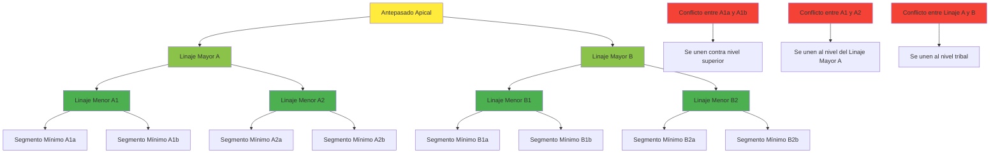
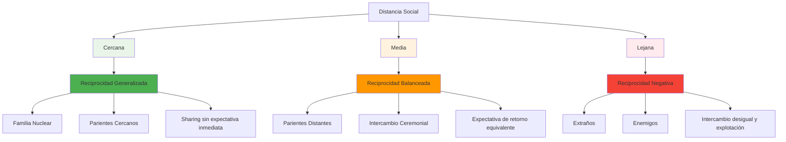
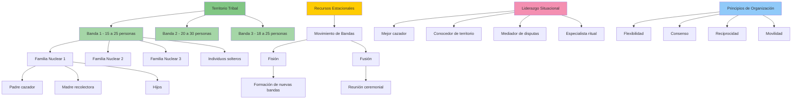
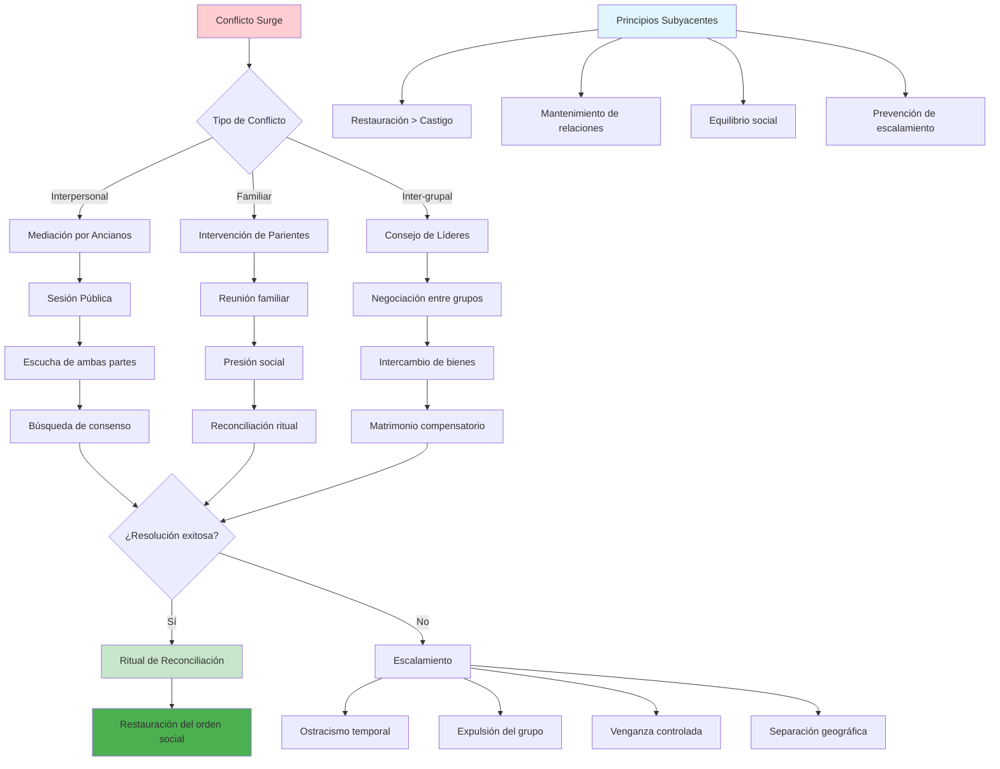

# Antropología de las Sociedades Igualitarias sin Estado

## Introducción

Las sociedades igualitarias sin estado han sido objeto de estudio antropológico durante más de un siglo, representando formas alternativas de organización social que desafían las concepciones occidentales sobre jerarquía, poder y gobierno. Estas sociedades, caracterizadas por la ausencia de instituciones estatales centralizadas y por mecanismos de distribución equitativa de recursos y poder, ofrecen perspectivas valiosas sobre la diversidad de la experiencia humana.

## Marco Teórico y Autores Fundamentales

### Pioneros de los Estudios sobre Sociedades Acéfalas

**Lewis Henry Morgan (1818-1881)** estableció las bases para el estudio de las sociedades sin estado con su obra "Ancient Society" (1877), donde propuso una clasificación evolutiva que incluía las sociedades "gentilicias" basadas en parentesco.

**Émile Durkheim (1858-1917)** en "De la división del trabajo social" (1893) distinguió entre solidaridad mecánica y orgánica, siendo la primera característica de sociedades simples y igualitarias.

### La Escuela Funcionalista Británica

**Bronisław Malinowski (1884-1942)** en sus estudios de las Islas Trobriand demostró cómo sociedades sin instituciones estatales mantienen orden social a través de reciprocidad y intercambio ceremonial.

**A.R. Radcliffe-Brown (1881-1955)** desarrolló el concepto de "sistemas políticos acéfalos" en su trabajo sobre sociedades africanas, enfocándose en cómo se mantiene el orden sin autoridad central.

**Edward Evans-Pritchard (1902-1973)** realizó estudios fundamentales sobre los Nuer de Sudán, mostrando cómo los sistemas de linajes segmentarios funcionan como mecanismos de organización política sin estado.

### Antropólogos Contemporáneos

**Marshall Sahlins (1930-2021)** revolucionó el campo con "Stone Age Economics" (1972), donde argumentó que las sociedades cazadoras-recolectoras eran "sociedades de la abundancia original".

**Richard Lee (1937-)** con sus estudios de los !Kung San del Kalahari, proporcionó evidencia etnográfica detallada sobre sociedades igualitarias de cazadores-recolectores.

**Eleanor Leacock (1922-1987)** desafió las interpretaciones androcéntricas de las sociedades igualitarias, destacando la importancia del género en estas organizaciones sociales.

**Pierre Clastres (1934-1977)** en "La sociedad contra el Estado" (1974) argumentó que muchas sociedades indígenas desarrollaron mecanismos activos para prevenir la formación del estado.

**James C. Scott (1936-)** en "Against the Grain" (2017) exploró cómo las primeras sociedades resistieron la formación estatal y mantuvieron formas igualitarias de vida.

## Sociedades Igualitarias sin Estado: Casos Etnográficos

### África

#### Los Nuer de Sudán del Sur
- **Ubicación**: Región del Alto Nilo, Sudán del Sur
- **Organización**: Sistema de linajes segmentarios patrilineales
- **Economía**: Pastoreo de ganado vacuno con agricultura complementaria
- **Resolución de conflictos**: Mediación a través de "hombres piel de leopardo" (especialistas rituales)
- **Estudio clave**: Evans-Pritchard, "The Nuer" (1940)

#### Los Tiv de Nigeria
- **Ubicación**: Valle del río Benue, Nigeria central
- **Organización**: Sistema genealógico segmentario bilateral
- **Economía**: Agricultura de subsistencia con intercambio ceremonial
- **Características**: Ausencia de jefes permanentes, liderazgo situacional
- **Estudio clave**: Laura Bohannan, "Return to Laughter" (1954)

#### Los Hadza de Tanzania
- **Ubicación**: Norte de Tanzania, cerca del lago Eyasi
- **Organización**: Bandas flexibles de cazadores-recolectores
- **Economía**: Caza, recolección y miel silvestre
- **Características**: Extrema igualitarismo, movilidad constante
- **Estudio clave**: Frank Marlowe, "The Hadza" (2010)

### América

#### Los Yanomami de la Amazonía
- **Ubicación**: Frontera Venezuela-Brasil
- **Organización**: Aldeas autónomas con liderazgo carismático temporal
- **Economía**: Horticultura de tala y quema, caza y recolección
- **Características**: Reciprocidad generalizada, warfare ritualizada
- **Estudio clave**: Napoleon Chagnon, "Yanomamö" (1968); Jacques Lizot estudios posteriores

#### Los Inuit del Ártico
- **Ubicación**: Ártico canadiense, Groenlandia, Alaska
- **Organización**: Grupos familiares extensos estacionales
- **Economía**: Caza marina y terrestre especializada
- **Características**: Liderazgo basado en habilidades, decisiones por consenso
- **Estudio clave**: Franz Boas, "The Central Eskimo" (1888)

#### Los !Kung San del Kalahari
- **Ubicación**: Desierto del Kalahari (Botswana, Namibia)
- **Organización**: Bandas nómadas con territorialidad flexible
- **Economía**: Caza y recolección especializada
- **Características**: Igualitarismo extremo, sharing networks
- **Estudio clave**: Richard Lee, "The !Kung San" (1979)

### Oceanía

#### Los Aborigenes Australianos (diversos grupos)
- **Ubicación**: Todo el continente australiano
- **Organización**: Sistemas totémicos complejos, territorialidad espiritual
- **Economía**: Caza, recolección y manejo del paisaje
- **Características**: Dreamtime, iniciaciones por edad, reciprocidad
- **Estudios clave**: A.P. Elkin, "The Australian Aborigines" (1943)

#### Los Trobriandeses de Papúa Nueva Guinea
- **Ubicación**: Islas Trobriand, Papúa Nueva Guinea
- **Organización**: Clanes matrilineales con big men situacionales
- **Economía**: Horticultura del ñame, pesca, intercambio Kula
- **Características**: Autoridad temporal, redistribución ceremonial
- **Estudio clave**: Bronisław Malinowski, "Argonauts of the Western Pacific" (1922)

### Asia

#### Los Semai de Malasia
- **Ubicación**: Península de Malasia
- **Organización**: Comunidades aldeanas con liderazgo mínimo
- **Economía**: Horticultura de tala y quema, recolección
- **Características**: Ideología de no-violencia, consenso en decisiones
- **Estudio clave**: Robert Dentan, "The Semai" (1968)

## Características Generales de las Sociedades Igualitarias

### Organización Social
- **Parentesco**: Base de la organización social y política
- **Reciprocidad**: Mecanismo fundamental de distribución
- **Consenso**: Toma de decisiones colectiva
- **Liderazgo situacional**: Autoridad temporal basada en habilidades específicas

### Economía
- **Modo de subsistencia**: Caza-recolección, pastoreo, horticultura simple
- **Propiedad**: Conceptos limitados de propiedad privada
- **Redistribución**: Mecanismos que previenen la acumulación
- **Reciprocidad**: Intercambio balanceado y generalizado

### Resolución de Conflictos
- **Mediación**: Terceras partes neutrales
- **Compensación**: Pagos por daños
- **Ostracismo**: Exclusión temporal o permanente
- **Rituales**: Ceremonias de reconciliación

### Ideología
- **Igualitarismo**: Valores que promueven la igualdad
- **Cosmología**: Sistemas de creencias que legitiman la organización social
- **Resistencia**: Mecanismos culturales que previenen la jerarquización

## Debates Teóricos Contemporáneos

### El Debate sobre el "Igualitarismo Original"
Autores como Marshall Sahlins y Richard Lee han argumentado que las sociedades de cazadores-recolectores representan la condición humana original, mientras que críticos como Steven Pinker cuestionan esta visión romántica.

### Género e Igualitarismo
Eleanor Leacock y otros han señalado que muchos estudios clásicos ignoraron las relaciones de género, argumentando que las sociedades pre-estatales tendían hacia mayor igualdad de género.

### La Crítica Poscolonial
Antropólogos contemporáneos han cuestionado las representaciones occidentales de las sociedades "primitivas", enfatizando la agencia y sofisticación de estos sistemas sociales.

### Ecología Política
Estudios recientes examinan cómo las presiones ambientales y la colonización han afectado estas sociedades, cuestionando la sustentabilidad de los modelos igualitarios.

## Metodologías de Estudio

### Trabajo de Campo Etnográfico
La observación participante sigue siendo el método principal, aunque enfrenta desafíos éticos y prácticos en el mundo contemporáneo.

### Estudios Comparativos
El Human Relations Area Files (HRAF) permite comparaciones sistemáticas entre sociedades.

### Arqueología Experimental
Estudios que intentan reconstruir patrones de vida de sociedades prehistóricas igualitarias.

### Análisis de Redes Sociales
Nuevos métodos para mapear relaciones de parentesco, intercambio y alianza.

## Diagramas

### Estructura general de las sociedades igualitarias y sus componentes

```mermaid
graph TD
    A[Sociedad Igualitaria sin Estado] --> B[Organización Social]
    A --> C[Sistema Económico]
    A --> D[Resolución de Conflictos]
    A --> E[Liderazgo]
    
    B --> B1[Parentesco]
    B --> B2[Clanes/Linajes]
    B --> B3[Bandas Flexibles]
    
    B1 --> B1a[Patrilineal]
    B1 --> B1b[Matrilineal]
    B1 --> B1c[Bilateral]
    
    C --> C1[Subsistencia]
    C --> C2[Distribución]
    C --> C3[Intercambio]
    
    C1 --> C1a[Caza-Recolección]
    C1 --> C1b[Horticultura]
    C1 --> C1c[Pastoreo]
    
    C2 --> C2a[Reciprocidad Generalizada]
    C2 --> C2b[Sharing Networks]
    C2 --> C2c[Redistribución Ceremonial]
    
    C3 --> C3a[Kula Ring]
    C3 --> C3b[Potlatch]
    C3 --> C3c[Hxaro]
    
    D --> D1[Mediación]
    D --> D2[Compensación]
    D --> D3[Ostracismo]
    D --> D4[Rituales Reconciliación]
    
    E --> E1[Big Men]
    E --> E2[Ancianos]
    E --> E3[Especialistas Rituales]
    E --> E4[Líderes Situacionales]
    
    style A fill:#e1f5fe
    style B fill:#f3e5f5
    style C fill:#e8f5e8
    style D fill:#fff3e0
    style E fill:#fce4ec
```

### Sistema de linajes segmentarios usando el ejemplo de los Nuer

### Tipos de reciprocidad según el modelo de Marshall Sahlins

### Organización de bandas de cazadores-recolectores

### Mecanismos de resolución de conflictos sin instituciones estatales

## Relevancia Contemporánea

### Movimientos Sociales
Las sociedades igualitarias proporcionan modelos alternativos para movimientos que buscan formas más equitativas de organización.

### Sostenibilidad Ambiental
Muchas de estas sociedades desarrollaron prácticas sostenibles que son relevantes para los desafíos ambientales actuales.

### Crítica al Capitalismo
Autores como David Graeber han usado estos estudios para cuestionar la inevitabilidad del capitalismo y la desigualdad.

### Derechos Indígenas
El reconocimiento de estas formas de organización es central para los movimientos de derechos indígenas globales.

## Conclusiones

Las sociedades igualitarias sin estado demuestran que la jerarquía y la desigualdad no son inevitables en la organización humana. Estos estudios han enriquecido nuestra comprensión de la diversidad cultural y han proporcionado perspectivas críticas sobre las sociedades contemporáneas. Sin embargo, es importante evitar tanto la romantización como la demonización de estos sistemas, reconociendo su complejidad y los desafíos que enfrentan en el mundo moderno.

La antropología de las sociedades igualitarias continúa evolucionando, incorporando nuevas perspectivas teóricas y metodológicas mientras mantiene su relevancia para los debates contemporáneos sobre justicia social, sostenibilidad y organización política.

## Referencias Bibliográficas

### Obras Clásicas
- Boas, F. (1888). *The Central Eskimo*. Washington: Bureau of American Ethnology.
- Durkheim, E. (1893). *De la division du travail social*. París: Félix Alcan.
- Evans-Pritchard, E.E. (1940). *The Nuer*. Oxford: Oxford University Press.
- Fortes, M. & Evans-Pritchard, E.E. (Eds.). (1940). *African Political Systems*. Oxford: Oxford University Press.
- Malinowski, B. (1922). *Argonauts of the Western Pacific*. Londres: Routledge.
- Morgan, L.H. (1877). *Ancient Society*. Nueva York: Henry Holt.

### Obras Contemporáneas Fundamentales
- Clastres, P. (1974). *La société contre l'État*. París: Éditions de Minuit.
- Lee, R.B. (1979). *The !Kung San: Men, Women and Work in a Foraging Society*. Cambridge: Cambridge University Press.
- Lee, R.B. & DeVore, I. (Eds.). (1968). *Man the Hunter*. Chicago: Aldine.
- Leacock, E.B. (1981). *Myths of Male Dominance*. Nueva York: Monthly Review Press.
- Sahlins, M. (1972). *Stone Age Economics*. Chicago: University of Chicago Press.
- Scott, J.C. (2017). *Against the Grain*. New Haven: Yale University Press.

### Estudios Etnográficos Específicos
- Bohannan, L. (1954). *Return to Laughter*. Nueva York: Harper & Brothers.
- Chagnon, N. (1968). *Yanomamö: The Fierce People*. Nueva York: Holt, Rinehart & Winston.
- Dentan, R.K. (1968). *The Semai: A Nonviolent People of Malaya*. Nueva York: Holt, Rinehart & Winston.
- Elkin, A.P. (1943). *The Australian Aborigines*. Sydney: Angus & Robertson.
- Marlowe, F. (2010). *The Hadza: Hunter-Gatherers of Tanzania*. Berkeley: University of California Press.

### Obras Teóricas Recientes
- Graeber, D. (2001). *Toward an Anthropological Theory of Value*. Nueva York: Palgrave Macmillan.
- Graeber, D. & Wengrow, D. (2021). *The Dawn of Everything*. Nueva York: Farrar, Straus & Giroux.
- Kelly, R.L. (2013). *The Lifeways of Hunter-Gatherers*. Cambridge: Cambridge University Press.
- Woodburn, J. (1982). "Egalitarian Societies". *Man*, 17(3), 431-451.
