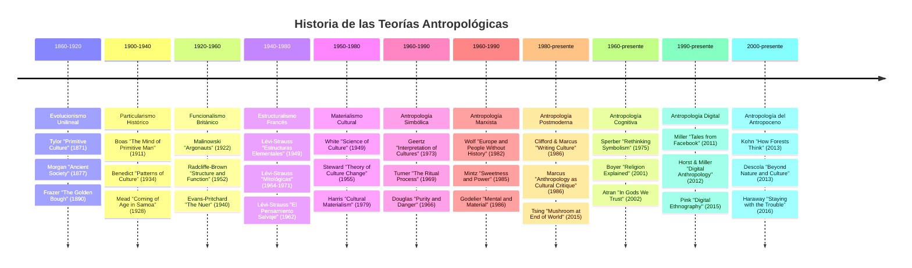
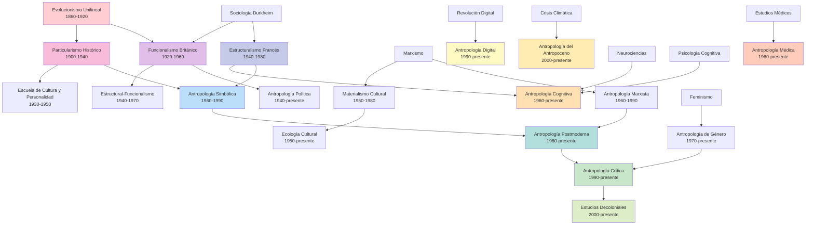
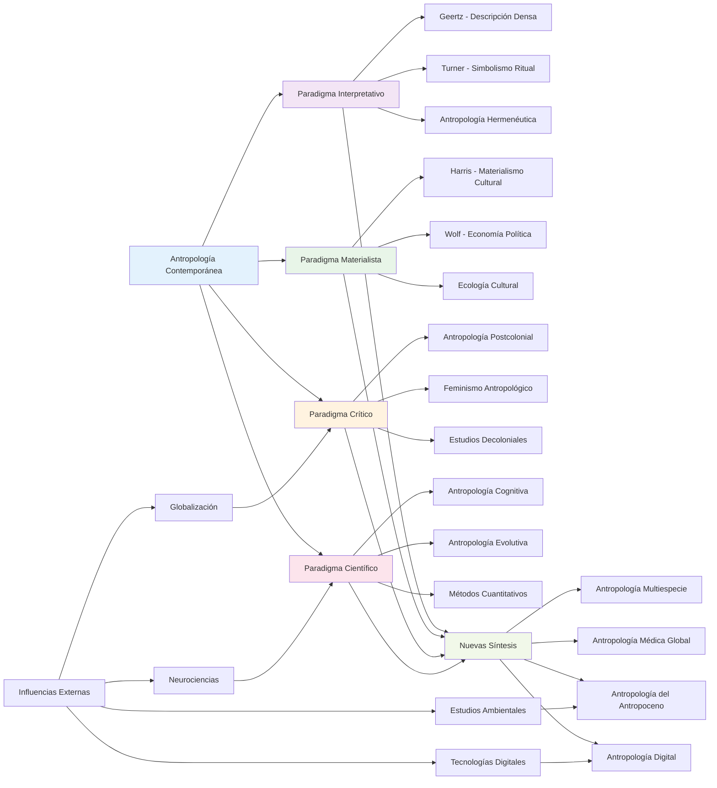
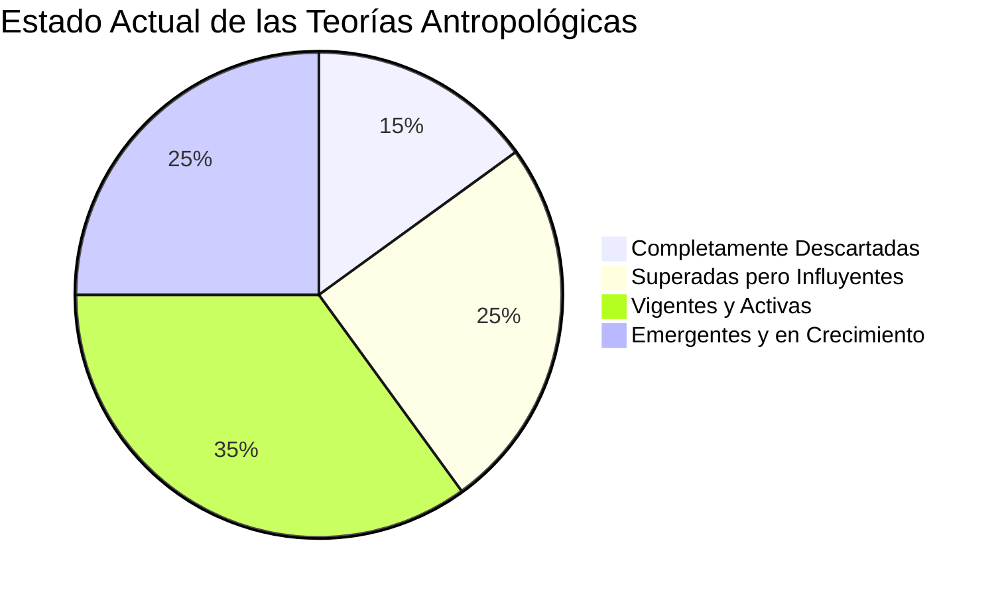
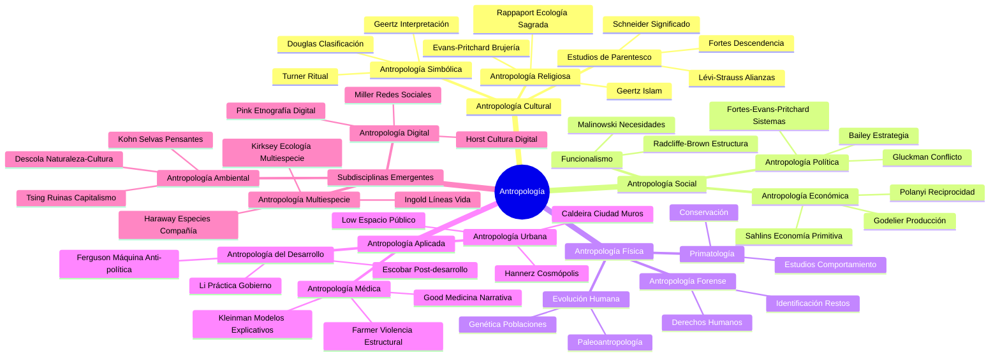

# Historia y Teorías de la Antropología: Escuelas, Representantes y Evolución

## Introducción

La antropología como disciplina científica ha evolucionado considerablemente desde sus inicios en el siglo XIX. Este documento presenta un recorrido cronológico por las principales escuelas teóricas, sus máximos representantes, obras clave y el estado actual de estas corrientes de pensamiento.

## I. Evolucionismo Unilineal (1860-1920)

### Contexto Histórico
Surgió en la segunda mitad del siglo XIX, influenciado por las ideas de Darwin y el positivismo. Se desarrolló durante el período colonial europeo.

### Postulados Principales
- La humanidad evoluciona en etapas unilineales desde el "salvajismo" hasta la "civilización"
- Las sociedades contemporáneas "primitivas" representan estadios evolutivos anteriores
- Progreso inevitable hacia formas "superiores" de organización social

### Principales Representantes

#### Edward Burnett Tylor (1832-1917)
- **Obra clave**: "Primitive Culture" (1871)
- **Contribución**: Definición clásica de cultura, teoría animista de la religión
- **Conceptos**: Supervivencias culturales, animismo

#### Lewis Henry Morgan (1818-1881)
- **Obra clave**: "Ancient Society" (1877)
- **Contribución**: Esquema evolutivo tripartito (salvajismo, barbarie, civilización)
- **Conceptos**: Sistemas de parentesco, evolución de la familia

#### James George Frazer (1854-1941)
- **Obra clave**: "The Golden Bough" (1890)
- **Contribución**: Estudio comparativo de mitos y religiones
- **Conceptos**: Magia simpática, rey-sacerdote

#### Herbert Spencer (1820-1903)
- **Obra clave**: "Principles of Sociology" (1876-1896)
- **Contribución**: Darwinismo social, organicismo social
- **Conceptos**: Supervivencia del más apto, evolución social

### Estado Actual
**Descartado** debido a:
- Etnocentrismo europeo evidente
- Falta de base empírica sólida
- Visión lineal y determinista incorrecta
- Justificación del colonialismo

Sin embargo, algunos conceptos como la definición de cultura de Tylor siguen siendo influyentes.

---

## II. Particularismo Histórico (1900-1940)

### Contexto Histórico
Reacción contra el evolucionismo, desarrollado principalmente en Estados Unidos bajo la influencia de Franz Boas.

### Postulados Principales
- Cada cultura es única y debe estudiarse en su contexto específico
- Rechazo a las generalizaciones universales
- Énfasis en la recolección de datos etnográficos precisos
- Relativismo cultural

### Principal Representante

#### Franz Boas (1858-1942)
- **Obras clave**: "The Mind of Primitive Man" (1911), "Race, Language and Culture" (1940)
- **Contribución**: Padre de la antropología americana, metodología etnográfica rigurosa
- **Conceptos**: Relativismo cultural, determinismo cultural

### Discípulos de Boas

#### Alfred Louis Kroeber (1876-1960)
- **Obra clave**: "Anthropology" (1923)
- **Contribución**: Concepto de superorgánico, patrones culturales

#### Ruth Benedict (1887-1948)
- **Obra clave**: "Patterns of Culture" (1934)
- **Contribución**: Configuraciones culturales, personalidad cultural

#### Margaret Mead (1901-1978)
- **Obra clave**: "Coming of Age in Samoa" (1928)
- **Contribución**: Antropología de la infancia y adolescencia

### Estado Actual
**Parcialmente vigente**: Sus métodos etnográficos y relativismo cultural siguen siendo fundamentales, aunque se critica su resistencia a la teorización.

---

## III. Funcionalismo Británico (1920-1960)

### Contexto Histórico
Desarrollado en Gran Bretaña durante el período de entreguerras, influenciado por la sociología de Durkheim.

### Postulados Principales
- La cultura como sistema integrado donde cada elemento tiene una función
- Énfasis en la observación participante
- Estudio de sociedades como totalidades orgánicas

### Principales Representantes

#### Bronisław Malinowski (1884-1942)
- **Obras clave**: "Argonauts of the Western Pacific" (1922), "The Sexual Life of Savages" (1929)
- **Contribución**: Metodología de observación participante, funcionalismo psicobiológico
- **Conceptos**: Necesidades básicas, función, observación participante

#### A.R. Radcliffe-Brown (1881-1955)
- **Obras clave**: "The Andaman Islanders" (1922), "Structure and Function in Primitive Society" (1952)
- **Contribución**: Funcionalismo estructural, método comparativo
- **Conceptos**: Estructura social, función social

### Discípulos y Continuadores

#### Edward Evans-Pritchard (1902-1973)
- **Obras clave**: "The Nuer" (1940), "Witchcraft, Oracles and Magic among the Azande" (1937)
- **Contribución**: Antropología política, sistemas de creencias

#### Meyer Fortes (1906-1983)
- **Obra clave**: "The Dynamics of Clanship among the Tallensi" (1945)
- **Contribución**: Sistemas de parentesco, ciclos de desarrollo

#### Max Gluckman (1911-1975)
- **Obra clave**: "Custom and Conflict in Africa" (1956)
- **Contribución**: Antropología del conflicto, Escuela de Manchester

### Estado Actual
**Superado pero influyente**: Criticado por su vision estática y colonial, pero sus métodos etnográficos y conceptos funcionales siguen siendo relevantes.

---

## IV. Estructuralismo Francés (1940-1980)

### Contexto Histórico
Desarrollado en Francia, influenciado por la lingüística estructural de Saussure y la sociología de Durkheim y Mauss.

### Postulados Principales
- Las culturas se organizan según estructuras subyacentes inconscientes
- Los sistemas simbólicos siguen lógicas universales
- Análisis de oposiciones binarias y transformaciones

### Principal Representante

#### Claude Lévi-Strauss (1908-2009)
- **Obras clave**: "Las estructuras elementales del parentesco" (1949), "Mitológicas" (1964-1971), "El pensamiento salvaje" (1962)
- **Contribución**: Análisis estructural de mitos, sistemas de parentesco, clasificaciones
- **Conceptos**: Estructura, transformación, pensamiento salvaje, intercambio

### Precursores

#### Marcel Mauss (1872-1950)
- **Obra clave**: "Ensayo sobre el don" (1925)
- **Contribución**: Teoría del intercambio, hecho social total

#### Émile Durkheim (1858-1917)
- **Obras clave**: "Las formas elementales de la vida religiosa" (1912)
- **Contribución**: Funciones sociales de la religión, representaciones colectivas

### Estado Actual
**Parcialmente vigente**: Influyente en antropología simbólica y cognitiva, aunque criticado por su formalismo excesivo y universalismo.

---

## V. Antropología Simbólica e Interpretativa (1960-1990)

### Contexto Histórico
Desarrollada principalmente en Estados Unidos, reacción contra el funcionalismo y estructuralismo.

### Postulados Principales
- La cultura como sistema de símbolos y significados
- Interpretación densa de las culturas
- Énfasis en la hermenéutica y la comprensión

### Principal Representante

#### Clifford Geertz (1926-2006)
- **Obras clave**: "The Interpretation of Cultures" (1973), "Local Knowledge" (1983)
- **Contribución**: Descripción densa, cultura como texto
- **Conceptos**: Descripción densa, interpretación, cultura como web de significados

### Otros Representantes

#### Victor Turner (1920-1983)
- **Obras clave**: "The Forest of Symbols" (1967), "The Ritual Process" (1969)
- **Contribución**: Antropología del ritual, simbolismo
- **Conceptos**: Liminalidad, communitas, símbolo ritual

#### Mary Douglas (1921-2007)
- **Obras clave**: "Purity and Danger" (1966), "Natural Symbols" (1970)
- **Contribución**: Antropología de la clasificación, pureza y contaminación

### Estado Actual
**Vigente**: Sigue siendo influyente, especialmente en estudios culturales y antropología de la religión.

---

## VI. Materialismo Cultural y Ecología Cultural (1950-1980)

### Contexto Histórico
Desarrollado como reacción al idealismo de otras escuelas, enfocándose en factores materiales y ambientales.

### Postulados Principales
- Los factores materiales y tecnológicos determinan la cultura
- Adaptación al ambiente como factor clave
- Énfasis en la demografía, tecnología y economía

### Principales Representantes

#### Julian Steward (1902-1972)
- **Obra clave**: "Theory of Culture Change" (1955)
- **Contribución**: Ecología cultural, evolución multilineal
- **Conceptos**: Core cultural, adaptación

#### Leslie White (1900-1975)
- **Obra clave**: "The Science of Culture" (1949)
- **Contribución**: Evolucionismo neo-energético
- **Conceptos**: Energía cultural, evolución cultural

#### Marvin Harris (1927-2001)
- **Obras clave**: "The Rise of Anthropological Theory" (1968), "Cultural Materialism" (1979)
- **Contribución**: Materialismo cultural, emic/etic
- **Conceptos**: Infraestructura, estructura, superestructura

### Estado Actual
**Parcialmente vigente**: Influyente en antropología económica y ecológica, aunque criticado por su determinismo.

---

## VII. Antropología Marxista y Económica (1960-1990)

### Contexto Histórico
Desarrollo durante los movimientos sociales de los años 60, aplicando conceptos marxistas a la antropología.

### Postulados Principales
- Análisis de las relaciones de producción y poder
- Crítica al colonialismo y capitalismo
- Enfoque en la desigualdad y explotación

### Principales Representantes

#### Eric Wolf (1923-1999)
- **Obras clave**: "Peasants" (1966), "Europe and the People Without History" (1982)
- **Contribución**: Antropología histórica, sistemas mundiales

#### Sidney Mintz (1922-2015)
- **Obra clave**: "Sweetness and Power" (1985)
- **Contribución**: Antropología de la alimentación, capitalismo mundial

#### Maurice Godelier (1934-)
- **Obras clave**: "Rationality and Irrationality in Economics" (1972), "The Mental and the Material" (1986)
- **Contribución**: Antropología económica marxista

### Estado Actual
**Vigente**: Sigue siendo relevante en antropología política y económica, especialmente en estudios sobre globalización.

---

## VIII. Antropología Postmoderna y Crítica (1980-presente)

### Contexto Histórico
Surgió como crítica a la autoridad etnográfica y al colonialismo implícito en la disciplina.

### Postulados Principales
- Cuestionamiento de la autoridad etnográfica
- Reflexividad y autocrítica
- Deconstrucción de conceptos tradicionales
- Énfasis en voces marginadas

### Principales Representantes

#### James Clifford (1945-)
- **Obra clave**: "Writing Culture" (1986, coeditado con George Marcus)
- **Contribución**: Crisis de representación etnográfica

#### George Marcus (1946-)
- **Obra clave**: "Anthropology as Cultural Critique" (1986, con Michael Fischer)
- **Contribución**: Etnografía multisituada

#### Anna Tsing (1952-)
- **Obra clave**: "The Mushroom at the End of the World" (2015)
- **Contribución**: Antropología del Antropoceno

### Estado Actual
**Vigente**: Influyente en debates contemporáneos sobre ética, representación y descolonización.

---

## IX. Antropología Cognitiva (1960-presente)

### Contexto Histórico
Desarrollada bajo la influencia de la revolución cognitiva en psicología y ciencias de la computación.

### Postulados Principales
- Estudio de los procesos mentales universales
- Cognición como base de la cultura
- Métodos experimentales y cuantitativos

### Principales Representantes

#### Dan Sperber (1942-)
- **Obras clave**: "Rethinking Symbolism" (1975), "Relevance" (1986, con Deirdre Wilson)
- **Contribución**: Epidemiología de las representaciones

#### Scott Atran (1952-)
- **Obra clave**: "In Gods We Trust" (2002)
- **Contribución**: Cognición religiosa

#### Pascal Boyer (1960-)
- **Obra clave**: "Religion Explained" (2001)
- **Contribución**: Bases cognitivas de la religión

### Estado Actual
**Vigente y creciente**: Cada vez más influyente, especialmente en estudios de religión, moral y comportamiento.

---

## X. Antropología Médica (1960-presente)

### Contexto Histórico
Desarrollo como subdisciplina especializada en salud, enfermedad y sistemas médicos.

### Postulados Principales
- Estudio cultural de la salud y enfermedad
- Sistemas médicos como fenómenos culturales
- Crítica a la biomedicina occidental

### Principales Representantes

#### Arthur Kleinman (1941-)
- **Obra clave**: "Patients and Healers in the Context of Culture" (1980)
- **Contribución**: Modelos explicativos de enfermedad

#### Byron Good (1944-)
- **Obra clave**: "Medicine, Rationality, and Experience" (1994)
- **Contribución**: Antropología interpretativa de la medicina

#### Nancy Scheper-Hughes (1944-)
- **Obra clave**: "Death Without Weeping" (1992)
- **Contribución**: Antropología crítica de la salud

### Estado Actual
**Vigente y especializada**: Campo en crecimiento, especialmente relevante en salud global.

---

## XI. Antropología Digital y Ciberantropología (1990-presente)

### Contexto Histórico
Surgió con el desarrollo de internet y las tecnologías digitales.

### Postulados Principales
- Estudio de culturas digitales y virtuales
- Impacto de la tecnología en la sociedad
- Nuevos métodos etnográficos digitales

### Principales Representantes

#### Heather Horst (1971-)
- **Obra clave**: "Digital Anthropology" (2012, coeditada con Daniel Miller)
- **Contribución**: Metodología de etnografía digital

#### Daniel Miller (1954-)
- **Obras clave**: "Tales from Facebook" (2011), "How the World Changed Social Media" (2016)
- **Contribución**: Antropología de redes sociales

#### Sarah Pink (1967-)
- **Obra clave**: "Digital Ethnography" (2015)
- **Contribución**: Métodos etnográficos digitales

### Estado Actual
**Vigente y en crecimiento**: Campo emergente cada vez más relevante en la era digital.

---

## XII. Antropología del Antropoceno (2000-presente)

### Contexto Histórico
Desarrollada en respuesta a la crisis climática y ambiental global.

### Postulados Principales
- Estudio de las relaciones humano-naturaleza en la era del cambio climático
- Crítica al dualismo naturaleza/cultura
- Enfoque multiespecie

### Principales Representantes

#### Eduardo Kohn (1968-)
- **Obra clave**: "How Forests Think" (2013)
- **Contribución**: Antropología más allá de lo humano

#### Donna Haraway (1944-)
- **Obra clave**: "Staying with the Trouble" (2016)
- **Contribución**: Antropología multiespecie, Chthuluceno

#### Philippe Descola (1949-)
- **Obra clave**: "Beyond Nature and Culture" (2013)
- **Contribución**: Ontologías relacionales

### Estado Actual
**Vigente y emergente**: Campo en rápido crecimiento, central para debates contemporáneos sobre sostenibilidad.

---

## Síntesis: Estado Actual de las Teorías Antropológicas

### Relaciones e Influencias entre Escuelas Antropológicas

### Estado Actual

```mermaid
flowchart TD
    A[Métodos Antropológicos] --> B[Siglo XIX - Métodos de Gabinete]
    A --> C[Principios XX - Trabajo de Campo]
    A --> D[Mediados XX - Especialización]
    A --> E[Finales XX - Reflexividad]
    A --> F[Siglo XXI - Hibridación]
    
    B --> B1[Método Comparativo]
    B --> B2[Fuentes Secundarias]
    B --> B3[Teoría de Poltrona]
    B --> B4[Evolucionismo]
    
    C --> C1[Observación Participante]
    C --> C2[Estancias Prolongadas]
    C --> C3[Lengua Nativa]
    C --> C4[Holismo Cultural]
    
    D --> D1[Métodos Estructurales]
    D --> D2[Análisis Funcional]
    D --> D3[Estudios de Parentesco]
    D --> D4[Análisis Simbólico]
    
    E --> E1[Autocrítica Disciplinar]
    E --> E2[Polifonía Etnográfica]
    E --> E3[Etnografía Experimental]
    E --> E4[Descolonización]
    
    F --> F1[Etnografía Digital]
    F --> F2[Métodos Mixtos]
    F --> F3[Etnografía Multisituada]
    F --> F4[Big Data Antropológico]
    F --> F5[Colaboración Interdisciplinar]
    
    G[Técnicas Específicas por Período]
    
    G --> G1[1860-1920: Comparación Evolutiva]
    G --> G2[1920-1960: Observación Sistemática]
    G --> G3[1960-1980: Análisis Estructural]
    G --> G4[1980-2000: Interpretación Crítica]
    G --> G5[2000-presente: Métodos Híbridos]
    
    H[Influencias Metodológicas]
    H --> H1[Sociología Durkheim]
    H --> H2[Psicología Gestalt]
    H --> H3[Lingüística Saussure]
    H --> H4[Hermenéutica Gadamer]
    H --> H5[Poststructuralismo]
    
    H1 --> C
    H2 --> D
    H3 --> D1
    H4 --> E
    H5 --> E
    
    I[Innovaciones Contemporáneas]
    I --> I1[Etnografía Virtual]
    I --> I2[Análisis de Redes Sociales]
    I --> I3[Métodos Participativos]
    I --> I4[Etnografía Sensorial]
    I --> I5[Métodos Decoloniales]
    
    style A fill:#e1f5fe
    style B fill:#ffcdd2
    style C fill:#f8bbd9
    style D fill:#e1bee7
    style E fill:#bbdefb
    style F fill:#c8e6c9
    style G fill:#fff9c4
    style H fill:#ffecb3
    style I fill:#dcedc8
```

### Teorías Completamente Descartadas
1. **Evolucionismo Unilineal**: Por etnocentrismo y falta de base empírica
2. **Determinismo Biológico Racial**: Por falsedad científica

### Teorías Superadas pero con Elementos Vigentes
1. **Funcionalismo**: Métodos etnográficos siguen siendo válidos
2. **Estructuralismo**: Análisis simbólico sigue influyendo
3. **Particularismo Histórico**: Relativismo cultural sigue siendo fundamental

### Teorías Vigentes y Activas
1. **Antropología Interpretativa**: Especialmente en estudios culturales
2. **Antropología Marxista**: En estudios de poder y desigualdad
3. **Antropología Cognitiva**: En crecimiento constante
4. **Antropología Médica**: Especializada y relevante
5. **Antropología Digital**: Emergente y en expansión
6. **Antropología del Antropoceno**: Crítica y necesaria

### Tendencias Actuales
- **Interdisciplinariedad**: Colaboración con neurociencias, psicología, biología
- **Reflexividad**: Autocrítica constante de la disciplina
- **Descolonización**: Cuestionamiento de sesgos occidentales
- **Aplicación**: Mayor énfasis en antropología aplicada
- **Digitalización**: Nuevos métodos y objetos de estudio

---

## Obras Fundamentales por Período

### Siglo XIX - Fundación
- Tylor, E.B. (1871). *Primitive Culture*
- Morgan, L.H. (1877). *Ancient Society*
- Frazer, J.G. (1890). *The Golden Bough*

### Principios Siglo XX - Profesionalización
- Boas, F. (1911). *The Mind of Primitive Man*
- Malinowski, B. (1922). *Argonauts of the Western Pacific*
- Radcliffe-Brown, A.R. (1922). *The Andaman Islanders*

### Mediados Siglo XX - Teorización
- Benedict, R. (1934). *Patterns of Culture*
- Evans-Pritchard, E.E. (1940). *The Nuer*
- Lévi-Strauss, C. (1949). *Las estructuras elementales del parentesco*

### Años 60-70 - Diversificación
- Geertz, C. (1973). *The Interpretation of Cultures*
- Turner, V. (1969). *The Ritual Process*
- Harris, M. (1979). *Cultural Materialism*

### Años 80-90 - Crisis y Renovación
- Clifford, J. & Marcus, G. (1986). *Writing Culture*
- Wolf, E. (1982). *Europe and the People Without History*
- Rosaldo, R. (1989). *Culture and Truth*

### Siglo XXI - Nuevos Paradigmas
- Descola, P. (2013). *Beyond Nature and Culture*
- Kohn, E. (2013). *How Forests Think*
- Miller, D. & Horst, H. (2012). *Digital Anthropology*

La antropología contemporánea se caracteriza por su pluralidad teórica y metodológica, manteniendo un diálogo constante entre tradiciones establecidas y nuevos paradigmas emergentes.

## Tendencias Futuras y Desafíos

### Principales Tendencias Emergentes

#### 1. Hibridación Metodológica
- **Métodos mixtos**: Combinación de enfoques cualitativos y cuantitativos
- **Big Data etnográfico**: Uso de datos masivos con interpretación antropológica
- **Etnografía sensorial**: Incorporación de todos los sentidos en la investigación

#### 2. Interdisciplinariedad Creciente
- **Neuroantropología**: Colaboración con neurociencias
- **Antropología y inteligencia artificial**: Estudio de algoritmos como cultura
- **Ciencias ambientales**: Colaboración en estudios del Antropoceno

#### 3. Descolonización de la Disciplina
- **Ontologías indígenas**: Reconocimiento de múltiples formas de conocimiento
- **Metodologías decoloniales**: Nuevas formas de hacer antropología
- **Antropologías del Sur**: Desarrollo de perspectivas no-occidentales

### Desafíos Contemporáneos

#### Desafíos Epistemológicos
- **Crisis de autoridad**: Quien tiene derecho a hablar por quién
- **Relativismo vs. universalismo**: Balance entre diversidad cultural y derechos humanos
- **Ciencia vs. humanidades**: Posición de la antropología en el espectro académico

#### Desafíos Éticos
- **Consentimiento informado**: En investigación digital y con comunidades vulnerables
- **Propiedad intelectual**: Derechos sobre conocimiento tradicional
- **Impacto de la investigación**: Responsabilidad hacia las comunidades estudiadas

#### Desafíos Metodológicos
- **Investigación en crisis**: Pandemias, conflictos, desastres naturales
- **Acceso a campo**: Restricciones políticas y de seguridad
- **Virtualización**: Límites y posibilidades de la etnografía digital

### Áreas de Crecimiento

#### Antropología de la Ciencia y Tecnología
- **Estudios de laboratorio**: Etnografía de la práctica científica
- **Inteligencia artificial**: Antropología de algoritmos y robots
- **Biotecnología**: Estudios de modificación genética y bioética

#### Antropología Planetary
- **Escala planetaria**: Fenómenos que trascienden lo local
- **Sistemas complejos**: Estudio de interconexiones globales
- **Antropología cósmica**: Exploración espacial y astrobiología

#### Antropología Afectiva
- **Emociones y cultura**: Estudios de la dimensión emocional
- **Antropología de los sentimientos**: Amor, miedo, esperanza como objetos de estudio
- **Neurociencias afectivas**: Bases neurológicas de las emociones culturales

## Perspectivas de Síntesis

### Principales Debates y Controversias en la Antropología

```mermaid
graph TD
    A[Grandes Debates Antropológicos] --> B[Debate Evolutivo vs Difusionista]
    A --> C[Debate Funcionalismo vs Historia]
    A --> D[Debate Estructura vs Agencia]
    A --> E[Debate Emic vs Etic]
    A --> F[Crisis de Representación]
    A --> G[Debate Ciencia vs Humanidades]
    
    B --> B1[Tylor vs Boas<br/>1900-1920]
    B --> B2[¿Evolución unilineal<br/>o difusión cultural?]
    B --> B3[Resultado: Victoria<br/>del particularismo]
    
    C --> C1[Malinowski vs<br/>Escuela Histórica<br/>1920-1940]
    C --> C2[¿Función presente<br/>o origen histórico?]
    C --> C3[Resultado: Síntesis<br/>estructural-funcional]
    
    D --> D1[Lévi-Strauss vs<br/>Existencialistas<br/>1950-1970]
    D --> D2[¿Estructuras inconscientes<br/>o acción consciente?]
    D --> D3[Resultado: Antropología<br/>de la práctica Bourdieu]
    
    E --> E1[Harris vs Pike<br/>1960-1980]
    E --> E2[¿Perspectiva del investigador<br/>o del nativo?]
    E --> E3[Resultado: Complementariedad<br/>metodológica]
    
    F --> F1[Clifford & Marcus<br/>1980-1990]
    F --> F2[¿Quién tiene autoridad<br/>para representar al Otro?]
    F --> F3[Resultado: Etnografía<br/>reflexiva y colaborativa]
    
    G --> G1[Debate actual<br/>2000-presente]
    G --> G2[¿Antropología científica<br/>o humanística?]
    G --> G3[Resultado: Pluralismo<br/>metodológico]
    
    H[Controversias Específicas]
    H --> H1[Caso Mead-Freeman<br/>Samoa]
    H --> H2[Debate Chagnon<br/>Yanomami]
    H --> H3[Polémica Tierney<br/>Darkness in El Dorado]
    H --> H4[Debate Cultura<br/>vs Biología]
    
    H1 --> H1a[¿Adolescencia cultural<br/>o universal?]
    H2 --> H2a[¿Violencia innata<br/>o construida?]
    H3 --> H3a[Ética en investigación<br/>con pueblos indígenas]
    H4 --> H4a[Naturaleza vs Crianza<br/>Debate continuo]
    
    I[Debates Contemporáneos]
    I --> I1[Ontological Turn]
    I --> I2[Decolonización]
    I --> I3[Antropoceno]
    I --> I4[Inteligencia Artificial]
    
    I1 --> I1a[¿Múltiples realidades<br/>o una sola naturaleza?]
    I2 --> I2a[¿Cómo descolonizar<br/>la antropología?]
    I3 --> I3a[¿Nuevas relaciones<br/>humano-naturaleza?]
    I4 --> I4a[¿Qué significa<br/>ser humano en era digital?]
    
    style A fill:#e3f2fd
    style B fill:#ffcdd2
    style C fill:#f8bbd9
    style D fill:#e1bee7
    style E fill:#c5cae9
    style F fill:#bbdefb
    style G fill:#b2dfdb
    style H fill:#fff3e0
    style I fill:#c8e6c9
```

La disciplina antropológica continúa evolucionando, manteniéndose fiel a su vocación humanística mientras abraza nuevos métodos y perspectivas teóricas, siempre en diálogo con los desafíos contemporáneos de un mundo en transformación acelerada.
