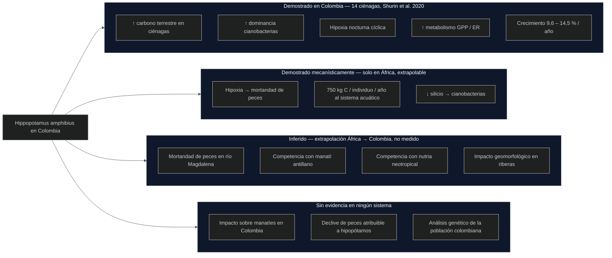

# Biología de invasiones, valores normativos y gestión de megafauna: el caso de *Hippopotamus amphibius* en Colombia

**Documento de síntesis académica interdisciplinaria**  
Versión definitiva · 18 de abril de 2026

---

## Resumen

La biología de invasiones es un campo científico que lleva más de dos décadas acumulando una crítica interna rigurosa y revisada por pares que cuestiona sus fundamentos conceptuales, su metodología y su lenguaje. Este documento integra esa crítica con el análisis empírico detallado del único caso documentado de establecimiento silvestre reproductivo de *Hippopotamus amphibius* fuera de África —la cuenca del río Magdalena, Colombia— para mostrar cómo la separación entre capas empíricas, genéticas, éticas y políticas produce un análisis más robusto que la aplicación directa del marco invasionista. El estado del conocimiento científico disponible distingue con precisión lo que está demostrado en Colombia (alteraciones de química del agua y fitoplancton en lagunas pequeñas; tasa de crecimiento poblacional del 9,6–14,5 % anual), lo que está inferido por extrapolación desde África (mortandad de peces, impacto sobre fauna específica) y lo que permanece sin estudiar (análisis genético de la población, impacto sobre manatí y nutria, efecto geomorfológico en el río Magdalena). La decisión gubernamental de proceder a la eutanasia técnica de ~80 individuos en 2026, con una inversión de 7.200 millones de pesos, mezcla estas capas de forma no transparente. Se propone un marco analítico alternativo basado en impacto funcional demostrado, coste de oportunidad explicitado y separación rigurosa entre argumentos empíricos y normativos.

**Palabras clave:** biología de invasiones; hipopótamos Colombia; gestión de especies exóticas; impacto funcional; ética ambiental; genética de poblaciones; economía ecológica; Magdalena Medio

---

## Abstract

Invasion biology is a scientific field that has accumulated over two decades of rigorous, peer-reviewed internal critique questioning its conceptual foundations, methodology and language. This document integrates that critique with a detailed empirical analysis of the only documented case of wild reproductive establishment of *Hippopotamus amphibius* outside Africa —the Magdalena River basin, Colombia— to show how separating empirical, genetic, ethical and political layers produces a more robust analysis than direct application of the invasionist framework. The available scientific knowledge precisely distinguishes what has been demonstrated in Colombia (alterations in water chemistry and phytoplankton in small lagoons; population growth rate of 9.6–14.5% per year), what has been inferred by extrapolation from Africa (fish kills, impacts on specific fauna) and what remains unstudied (genetic analysis of the population, impact on manatees and otters, geomorphological effects on the Magdalena River). The government's 2026 decision to proceed with the technical euthanasia of ~80 individuals, with an investment of 7.2 billion pesos, conflates these layers in a non-transparent way. An alternative analytical framework based on demonstrated functional impact, explicit opportunity cost and rigorous separation of empirical and normative arguments is proposed.

---

## 1. El caso que ordena el debate

El 13 de abril de 2026, el Ministerio de Ambiente y Desarrollo Sostenible de Colombia publicó un comunicado oficial activando un plan de choque integral para el control de la población de hipopótamos (*Hippopotamus amphibius*) en el Magdalena Medio. La ministra encargada **Irene Vélez Torres** —tercera responsable de la cartera durante la administración Petro, tras Susana Muhamad (agosto 2022–marzo 2025) y Lena Estrada Añokazi (marzo–agosto 2025), ejerciendo el cargo mediante el Decreto 0877 del 5 de agosto de 2025 mientras conserva la dirección general de la ANLA— anunció la eutanasia técnica de aproximadamente 80 ejemplares durante el segundo semestre de 2026, con una inversión de 7.200 millones de pesos para la primera fase.

La población, originada en cuatro individuos introducidos ilegalmente por Pablo Escobar en los años ochenta, se estima hoy entre 160 y 200 individuos. Las proyecciones de los modelos disponibles indican que podría alcanzar los 500 individuos en 2030 y superar los 1.000 en 2035 sin control efectivo (Subalusky et al., 2023; Castelblanco-Martínez et al., 2021; Instituto Humboldt/Minambiente, 2024).[^pva]

[^pva]: Estas proyecciones provienen de modelos de viabilidad poblacional (PVA) cuya sensibilidad paramétrica no ha sido publicada con detalle. El grupo de la Hacienda Nápoles, que representa más del 60% de la población estimada, opera bajo suplementación alimenticia activa que sesga los parámetros de crecimiento del modelo global. Los rangos citados deben interpretarse como escenarios de referencia, no como predicciones con incertidumbre cuantificada. Que estas proyecciones —con sus limitaciones no declaradas— hayan servido de base directa para justificar el presupuesto del plan de choque es, en sí mismo, un ejemplo del problema epistemológico que este documento analiza. Desde 2022 los técnicos recomendaban eliminar al menos 33 individuos por año —cifra nunca alcanzada—, acumulando un rezago significativo. La translocación internacional fracasó tras gestiones con siete países, cada uno por causas específicas: prohibición legal en México, desistimiento logístico en Filipinas, falta de espacio en el Parque de las Leyendas en Perú, espera de respuesta en Ecuador, República Dominicana y Sudáfrica, y una oferta de India pendiente de respuesta gubernamental a la fecha del anuncio.

Este episodio es, a un tiempo, un caso de gestión ambiental concreta y un caso de estudio ejemplar de los problemas epistemológicos, metodológicos y éticos que la biología de invasiones arrastra desde su consolidación como disciplina. Usarlo como hilo conductor permite conectar la crítica abstracta al campo con sus consecuencias reales en política pública, presupuesto estatal y vidas de animales sintientes.

El objetivo de este documento es triple: (1) sistematizar la crítica científica a la biología de invasiones tal como aparece en la literatura revisada por pares, (2) describir con precisión el estado real del conocimiento empírico sobre el caso colombiano —distinguiendo lo demostrado, lo inferido y lo pendiente—, y (3) proponer un marco analítico alternativo que aborde el mismo problema con mayor rigor y menor carga normativa no declarada.

---

## 2. La biología de invasiones como objeto de crítica científica

### 2.1 Genealogía del campo: categorías jurídicas disfrazadas de biológicas

El vocabulario central de la biología de invasiones —*nativo*, *alien*, *invasor*, *naturalizado*— no proviene de la biología. Chew & Hamilton (2011) rastrean su origen hasta los botánicos del siglo XIX, particularmente Hewett C. Watson, quien importó deliberadamente el vocabulario del derecho civil inglés de ciudadanía —*alien*, *naturalised*, *denizen*— para clasificar plantas según su relación con el territorio nacional. Esta no fue una metáfora accidental: fue una transferencia consciente de categorías de pertenencia humana al reino vegetal, motivada por un contexto político-cultural de consolidación del Estado-nación. Chew & Laubichler (2003) documentan la misma operación retórica en su artículo seminal en *Science*: las «enemistades naturales» del campo son construcciones metafóricas que moldean qué preguntas se hacen y qué respuestas se consideran legítimas.

Esta genealogía tiene consecuencias directas sobre el análisis del caso colombiano. Decir que los hipopótamos del Magdalena son «invasores» implica que hay un momento temporal antes del cual su presencia es ilegítima y después del cual la de los animales «nativos» es legítima. Warren (2021) ha desarrollado con rigor filosófico que ese umbral temporal es siempre arbitrario: no hay criterio biológico —ni ecológico, ni evolutivo, ni genético— que lo fije. Es una decisión cultural disfrazada de conclusión científica. Warren propone que el origen biogeográfico debe ceder ante un enfoque pragmático centrado en el comportamiento ecológico real de las especies, posición que recibe respaldo creciente en la literatura contemporánea (Rayne et al., 2025).

Una precisión sobre el alcance de este argumento: el origen histórico de un vocabulario no invalida por sí solo el campo que lo usa —la termodinámica emplea conceptos con genealogía pre-científica sin que eso comprometa su validez. Lo que la genealogía sí revela, y eso es suficiente para el argumento, es que ese vocabulario porta valores de pertenencia y exclusión que no son biológicos, y que esos valores condicionan qué preguntas se formulan y qué respuestas se consideran pertinentes. La crítica, por tanto, se dirige a la agenda de investigación que ese vocabulario construye, no al campo en su totalidad.

### 2.2 Problemas metodológicos estructurales

La crítica conceptual al campo tiene su contraparte metodológica, que es más difícil de rebatir porque no puede responderse con «es ideología»: requiere datos y diseño experimental. Las posiciones críticas al campo cubren un espectro: desde quienes proponen reformar el criterio de gestión sin abandonar la disciplina (Davis et al., 2011; Cassini, 2020) hasta quienes cuestionan su validez científica de raíz (Theodoropoulos, 2003). Este documento adopta la primera posición: la crítica metodológica y conceptual no requiere invalidar el campo para ser operativa, y mezclar ambas posiciones sin distinguirlas debilita el argumento al exponerlo a ser identificado con su versión más extrema. Theodoropoulos (2003) realizó la primera revisión sistemática de la evidencia empírica del campo y concluyó que las hipótesis centrales —que las especies no nativas reducen la biodiversidad y desestabilizan ecosistemas— no están respaldadas de forma consistente por los datos que el propio campo genera. Cassini (2020), en una revisión publicada en *Biological Reviews*, sistematiza cuatro décadas de crítica e identifica tres tipos de sesgos estructurales:

**Sesgo de publicación:** Los estudios que detectan impacto negativo de especies no nativas se financian y publican con más facilidad que los que detectan efectos neutros o positivos. Este sesgo no implica mala fe individual; es el funcionamiento normal de un campo con un marco previo fuertemente consolidado que define qué resultados son «interesantes».

**Generalización de casos extremos:** Las poblaciones insulares con fauna que no tiene historia evolutiva de depredación (Hawaii, Galápagos, islas subantárticas) son los casos donde el impacto de las especies introducidas es más severo y más documentado. El campo ha generalizado esos resultados a ecosistemas continentales, donde la evidencia de impacto es mucho más mixta. Theodoropoulos (2003) y Davis et al. (2011) coinciden en que esa extrapolación carece de justificación metodológica suficiente.

**Ausencia de grupos de control adecuados:** Muchos estudios de impacto de especies introducidas no comparan con el impacto de perturbaciones nativas equivalentes —la ganadería, la deforestación, la pesca intensiva— sobre las mismas variables en los mismos sistemas. Esa asimetría sesga la atribución causal hacia las especies introducidas y aleja el análisis de las causas primarias de la degradación ecosistémica.

Guiaşu & Tindale (2023) han documentado en *Biology & Philosophy* que, cuando los críticos señalan estos problemas, la respuesta del mainstream del campo recurre sistemáticamente al argumento del hombre de paja: equipara la crítica metodológica con «negacionismo de invasoras» —análogo retóricamente al negacionismo climático— sin responder a los argumentos. Frank (2019) distingue con precisión entre el escéptico que niega hechos empíricos y quien expresa un desacuerdo ético o metodológico legítimo; confundir ambas posiciones cierra el debate en lugar de avanzarlo. Simberloff et al. (2024), en un artículo cuyo propio título reconoce la insistencia de la crítica (*Yet another call for the end of invasion biology*), mantienen la posición ortodoxa sin responder a los argumentos de fondo.

### 2.3 El lenguaje bélico como constructor del problema

El lenguaje de la biología de invasiones no describe un problema: lo construye. El vocabulario militar y nativista —invasión, frente, erradicación, especie enemiga, alien— no es un detalle estilístico. Larson (2005) demostró en *Frontiers in Ecology and the Environment* que ese vocabulario hace impensables, por construcción, las soluciones de coexistencia o gestión adaptativa: cuando el problema se enmarca como una guerra, las únicas respuestas legítimas son las militares (erradicar, controlar, combatir). Lower & Campbell (2024) profundizan en este análisis desde la perspectiva retórica, y Subramaniam (2001) rastreó desde principios de siglo la forma en que ese vocabulario ha reforzado históricamente marcos ideológicos sobre la pureza del territorio.

Este efecto del lenguaje es operativo en el caso colombiano. El comunicado ministerial del 13 de abril de 2026 habla de «plan de choque», de «especie exótica invasora» y de «control de la invasión». Esa retórica no es neutral: predetermina qué opciones de gestión aparecen en el menú de decisión y cuáles no. La gestión adaptativa de largo plazo, la coexistencia con monitoreo intensivo o la incorporación de los hipopótamos como elemento de atracción ecoturística controlada no aparecen como opciones centrales del comunicado —no porque sean imposibles, sino porque el lenguaje bélico las hace impensables antes de que se formulen.

### 2.4 La analogía con la migración humana: un uso políticamente peligroso

El problema del lenguaje del campo alcanza su expresión más grave cuando el marco de la «invasión biológica» se extrapola a la migración humana. Más de 60 investigadores de biología y ciencias sociales firmaron en 2025 una crítica conjunta publicada en *Ethnic and Racial Studies*:

> Barbulescu, R., South, J. et al. (2025). *Raising Concerns on the Dangers of Linking Biological Invasions to Human Migration.* **Ethnic and Racial Studies**, 48(13), 2496–2501. DOI: [10.1080/01419870.2025.2527906](https://doi.org/10.1080/01419870.2025.2527906)

El argumento central: aplicar el marco de «invasión biológica» a personas migrantes es conceptualmente incorrecto —los procesos son irreduciblemente distintos— y políticamente peligroso, ya que puede servir para justificar políticas de exclusión. Esta crítica no afecta directamente al caso colombiano, pero delimita el campo de aplicación legítima del marco invasionista: incluso si fuera científicamente sólido para ecosistemas, su uso retórico produce efectos sociales que deben considerarse.

Pereyra et al. (2025) van un paso más allá y critican directamente la retórica que equipara a los seres humanos y las especies que introducen con un «cáncer del planeta Tierra», documentando un sesgo sistemático contra las especies introducidas independiente de la evidencia empírica disponible. Este sesgo, argumentan, produce decisiones de gestión que no están justificadas por los datos sino por un marco valorativo previo.

### 2.5 La propuesta alternativa: impacto funcional demostrado como criterio de gestión

La crítica al marco no es solo destructiva. Davis et al. (2011), en un artículo firmado por 19 ecólogos de primer nivel y publicado en *Nature*, proponen el criterio alternativo que permite mantener toda la capacidad de gestión sin necesidad del vocabulario normativo:

> «Evaluar las consecuencias funcionales de la presencia de un organismo en un ecosistema —su impacto demostrado sobre otros organismos, sobre flujos de energía, sobre servicios ecosistémicos— con independencia de su origen geográfico.»

Este criterio es operativizable, no dependiente de umbrales temporales arbitrarios, y produce decisiones coherentes tanto en casos donde la intervención es necesaria (ecosistemas insulares con extinción documentada) como en casos donde no lo es (ecosistemas continentales con perturbaciones múltiples donde el organismo introducido no es el factor dominante). Hoffmann & Courchamp (2016) argumentan en *NeoBiota* que la distinción entre invasión mediada por humanos y colonización natural es relevante para la gestión pero no necesariamente para la ciencia, que debería centrarse en procesos y mecanismos independientemente del agente dispersor. La réplica de Wilson et al. (2016) en el mismo número defiende que sí existen diferencias de proceso que justifican un campo específico —el debate entre ambos trabajos delimita con precisión en qué sentido la mediación humana importa científicamente y en qué sentido la distinción es principalmente normativa.

Rayne et al. (2025) proponen en *Progress in Environmental Geography* un marco de cuatro registros —natividad, naturalidad, contribuciones ecológicas y relaciones de derecho— que permite tomar decisiones más transparentes y contextualmente informadas, sin pretender que el criterio de origen sea suficiente por sí solo. Guareschi et al. (2024) proponen en *BioScience* una agenda interdisciplinaria que integra ciencias sociales y naturales para abordar la polarización del debate: debates sobre vocabulario, beneficios potenciales de especies no nativas y rewilding son legítimos y no pueden resolverse solo desde la ecología.

---

## 3. Estado del conocimiento empírico: *Hippopotamus amphibius* en Colombia

### 3.1 Contexto histórico y relevancia ecológica del sistema

En 1981, Pablo Escobar importó ilegalmente cuatro hipopótamos (tres hembras y un macho) desde un centro de cría en Dallas, Texas, para su colección privada en la Hacienda Nápoles (Puerto Triunfo, Antioquia). Tras su muerte en 1993, los animales no pudieron ser contenidos por tamaño y comportamiento agresivo, y comenzaron a dispersarse hacia los cuerpos de agua adyacentes y, posteriormente, hacia el río Magdalena. Este evento constituye el **único caso documentado en el mundo de establecimiento de una población silvestre reproductiva de *H. amphibius* fuera de África**, descrito como la introducción de un megavertebrado de mayor tamaño corporal conocida globalmente (Shurin et al., 2020; Castelblanco-Martínez et al., 2021).

La cuenca del río Magdalena, sistema receptor de la población, es el sistema fluvial más importante de Colombia: drena ~257.000 km² (24% del territorio nacional), atraviesa 11 departamentos, sostiene el 70% de la producción agrícola del país y alberga 63 especies de peces nativos en las ciénagas del Magdalena Medio. Es hábitat del manatí antillano (*Trichechus manatus*), la nutria neotropical (*Lontra longicaudis*), el caimán de anteojos (*Caiman crocodilus*), la tortuga de río del Magdalena (*Podocnemis lewyana*) y la tortuga cabeza de sapo de Dahl (*Mesoclemmys dahli*), estas dos últimas en peligro crítico de extinción (Jiménez-Segura et al., 2010, 2016).

### 3.2 Corpus de evidencia revisado por pares (2017–2026)

La literatura científica sobre esta población puede dividirse en tres categorías con distinto estatus epistémico:

**Estudios con datos empíricos recogidos directamente en Colombia:**

| Referencia | Revista | DOI | Tipo de estudio |
|---|---|---|---|
| Shurin et al. (2020) | *Ecology* | [10.1002/ecy.2991](https://doi.org/10.1002/ecy.2991) | Muestreo comparativo de 14 ciénagas en Colombia |
| Subalusky et al. (2023) | *Scientific Reports* | [10.1038/s41598-023-33028-y](https://doi.org/10.1038/s41598-023-33028-y) | Modelado poblacional con datos censales colombianos |
| Castelblanco-Martínez et al. (2021) | *Biological Conservation* | [10.1016/j.biocon.2020.108923](https://doi.org/10.1016/j.biocon.2020.108923) | Análisis de viabilidad poblacional y nicho ecológico |

**Estudios de revisión con datos colombianos indirectos:**

| Referencia | Revista | DOI | Alcance |
|---|---|---|---|
| Subalusky et al. (2021) | *Oryx* | [10.1017/S0030605318001588](https://doi.org/10.1017/S0030605318001588) | Revisión ecológica y socioeconómica |
| Calle & Cadena (2021) | *Frontiers in Ecology and the Environment* | [10.1002/fee.2373](https://doi.org/10.1002/fee.2373) | Política científica y negacionismo |
| Dembitzer (2017) | *Israel Journal of Ecology and Evolution* | [10.1163/22244662-06303002](https://doi.org/10.1163/22244662-06303002) | Argumento de permanencia y rewilding |

**Estudios de mecanismos ecológicos del hipopótamo (Africa, referencia mecanística):**

| Referencia | Revista | DOI | Variable |
|---|---|---|---|
| Subalusky et al. (2015) | *Freshwater Biology* | [10.1111/fwb.12474](https://doi.org/10.1111/fwb.12474) | Carga de C, N, P — «conveyor belt» |
| Dutton et al. (2018) | *Nature Communications* | [10.1038/s41467-018-04391-6](https://doi.org/10.1038/s41467-018-04391-6) | Hipoxia y mortandad de peces |
| Schoelynck et al. (2019) | *Science Advances* | [10.1126/sciadv.aav0395](https://doi.org/10.1126/sciadv.aav0395) | Ciclo del silicio y cianobacterias |
| Voysey et al. (2023) | *Biological Reviews* | [10.1111/brv.12960](https://doi.org/10.1111/brv.12960) | Meta-análisis de ingeniería ecosistémica |
| Dawson et al. (2016) | *Estuarine, Coastal and Shelf Science* | [10.1016/j.ecss.2016.06.011](https://doi.org/10.1016/j.ecss.2016.06.011) | Macroinvertebrados bentónicos |
| Dawson et al. (2020) | *Scientific Reports* | [10.1038/s41598-020-68875-2](https://doi.org/10.1038/s41598-020-68875-2) | Ácidos grasos y redes tróficas |

### 3.3 Qué está demostrado, qué está inferido, qué está pendiente

Esta distinción, sistemáticamente omitida en el debate público colombiano, es el eje epistemológico más importante del análisis:

| Categoría epistémica | Variable | Paper de referencia |
|---|---|---|
| **DEMOSTRADO en Colombia** | Aumento de carbono terrestre en ciénagas con hipopótamos | Shurin et al. (2020) |
| **DEMOSTRADO en Colombia** | Mayor dominancia de cianobacterias en fitoplancton | Shurin et al. (2020) |
| **DEMOSTRADO en Colombia** | Descenso nocturno de OD por debajo del umbral letal para peces (cíclico) | Shurin et al. (2020) |
| **DEMOSTRADO en Colombia** | Mayor metabolismo del ecosistema (GPP, ER) en ciénagas con hipopótamos | Shurin et al. (2020) |
| **DEMOSTRADO en Colombia** | Tasa de crecimiento poblacional 9,6%/año | Subalusky et al. (2023) |
| **DEMOSTRADO en Colombia** | Tasa de crecimiento 14,5%/año (estimación PVA alternativa) | Castelblanco-Martínez et al. (2021) |
| **DEMOSTRADO en Colombia** | Distribución activa en >2.000 km² de la cuenca | Subalusky (2021, 2023) |
| **DEMOSTRADO mecanísticamente (África)** | Hipoxia y mortandad de peces por carga orgánica | Dutton et al. (2018) |
| **DEMOSTRADO mecanísticamente (África)** | 750 kg C/individuo/año transportado al sistema acuático | Subalusky et al. (2015) |
| **DEMOSTRADO mecanísticamente (África)** | Reducción de silicio y reemplazo de diatomeas por cianobacterias | Schoelynck et al. (2019) |
| **INFERIDO** (extrapolación África→Colombia) | Mortandad de peces en el río Magdalena | No medido en Colombia |
| **INFERIDO** (solapamiento espacial) | Competencia con manatí antillano | No cuantificado |
| **INFERIDO** (solapamiento espacial) | Competencia con nutria neotropical | No cuantificado |
| **INFERIDO** (extrapolación) | Impacto geomorfológico en riberas del Magdalena | Observado cualitativamente, sin paper |
| **TEÓRICO** (no medido) | Depresión por endogamia activa | Predicción sin análisis genético |
| **SIN EVIDENCIA en ningún sistema** | Impacto documentado sobre poblaciones de manatí en Colombia | No existe paper |
| **SIN EVIDENCIA en ningún sistema** | Impacto documentado sobre nutrias en Colombia | No existe paper |
| **SIN EVIDENCIA en ningún sistema** | Declive de peces atribuible a hipopótamos en Colombia | No existe paper |
| **SIN EVIDENCIA en ningún sistema** | Análisis genético publicado de la población colombiana | No existe paper |

**Limitación crítica del estudio fundacional (Shurin et al., 2020):** El muestreo se restringió a catorce lagunas pequeñas (*ciénagas*) alrededor de la Hacienda Nápoles en 2017 y 2018. El río Magdalena no fue muestreado. No se detectaron diferencias significativas en zooplancton, macroinvertebrados bentónicos ni en comunidades bacterianas. Los propios autores describen sus hallazgos como «señales tempranas en las fases iniciales de la invasión». La decisión ministerial de 2026 se ejecuta sobre la base de datos generados en ese contexto acotado, extrapolados a una cuenca que no ha sido muestreada con diseño equivalente. La calificación de los propios investigadores —«señales tempranas»— describe una certeza epistémica de orden exploratorio. El plan de choque de 2026 opera con una certeza de orden ejecutivo. Esa brecha no está justificada por la progresión de la evidencia disponible entre 2020 y 2026.

### 3.4 Dinámica poblacional y proyecciones

Los censos disponibles muestran la siguiente trayectoria:

| Año | Número estimado de individuos | Fuente |
|---|---|---|
| 2006 | 16 | CORNARE |
| 2009 | 28 | CORNARE |
| 2014 | 50 | CORNARE |
| 2016 | 60 | CORNARE |
| 2020 | 75 | CORNARE |
| 2022 | ~91 | Subalusky et al. (2023) |
| 2022 | ~169 | Instituto Humboldt/ICN (2024) |
| 2026 | ~200 | Instituto Humboldt/Minambiente (2024) |

La discrepancia entre las estimaciones de 91 y 169 individuos para el mismo año 2022 —publicadas con metodologías de censo distintas y posiblemente con áreas de cobertura distintas— no está resuelta en la literatura revisada por pares disponible, y es en sí misma una brecha de investigación activa.

Las proyecciones bajo escenario sin intervención varían también según fuente y metodología:

| Año | Proyección | Fuente |
|---|---|---|
| 2030 | ~500 individuos | Instituto Humboldt/Minambiente (2024) |
| 2032 | ~230 individuos | Subalusky et al. (2023) |
| 2034 | ~783 individuos | Castelblanco-Martínez et al. (2021) |
| 2035 | ~1.000 individuos | Instituto Humboldt/Minambiente (2024) |
| 2039 | ~1.418 individuos | Castelblanco-Martínez et al. (2021) |

La variación entre proyecciones refleja diferencias reales en los supuestos de los modelos, el período analizado y el método de censo empleado. Ninguna es incorrecta en su contexto metodológico propio. Presentar una sola cifra —como hace sistemáticamente la comunicación ministerial— suprime incertidumbre real.

### 3.5 La endogamia extrema: hechos y límites del argumento

Toda la población colombiana desciende de cuatro individuos fundadores. Las mutaciones fenotípicas visibles —documentadas en mandíbula y hocico— son coherentes con la acumulación de alelos deletéreos en homocigosis que caracteriza a la depresión por endogamia. La ministra encargada Vélez Torres describió este estado como «pobreza genética».

Lo que los datos permiten afirmar con certeza:

- El valor de conservación genética de esta población para la especie *H. amphibius* (catalogada como vulnerable por la UICN) es limitado, precisamente por la baja diversidad del pool genético.
- Una población fundada en cuatro individuos sin incorporación de nuevos genes acumula alelos deletéreos con cada generación (Charlesworth & Charlesworth, 1987; Frankham et al., 2002).

Lo que los datos *no* permiten afirmar:

- No existe ningún análisis molecular publicado de esta población. La depresión por endogamia es, en el estado actual del conocimiento, una predicción teórica, no una medición.
- Las tasas de crecimiento documentadas (9,6–14,5 %/año) no son inconsistentes con endogamia: pueden coexistir con viabilidad demográfica aparente mientras la carga genética deletérea se acumula de forma no visible en las tasas poblacionales.
- No se puede descartar que hubiera incorporaciones génicas desde otros individuos en los primeros años sin análisis molecular del pedigrí.

Este argumento es relevante para evaluar el valor de conservación de la especie a través de esta población. No es, por sí solo, un argumento para la eutanasia de individuos con capacidad documentada de sufrimiento: opera en un plano diferente.

### 3.6 El debate científico activo

**Posición mayoritaria (control urgente):** Representada por Shurin et al. (2020), Subalusky et al. (2021, 2023) y Castelblanco-Martínez et al. (2021). El argumento central es que aunque el daño en fauna no está aún medido, la trayectoria poblacional garantiza que se producirá. La ventana de acción efectiva se cierra con cada año de inacción. Calle & Cadena (2021) añaden que la resistencia social a la gestión constituye «negacionismo científico» que obstaculiza el manejo.

**Posición de permanencia o rewilding** (cuantitativamente minoritaria en la literatura —descripción sociológica del campo, no juicio epistémico; el propio documento ha argumentado que el sesgo de publicación explica qué posiciones aparecen como mayoritarias en este campo)**:** Articulada por Dembitzer (2017), quien argumenta que: (a) los hipopótamos podrían estar cumpliendo el rol ecológico de megaherbívoros del Pleistoceno extintos; (b) los ecosistemas del Magdalena están tan degradados que el impacto incremental de los hipopótamos es marginal respecto a la presión humana; (c) la población podría constituir un refugio ex situ de conservación; y (d) el beneficio del ecoturismo es medible y positivo. La réplica de Calle & Cadena (2021) sostiene que la analogía con el rewilding del Pleistoceno es ecológicamente inválida porque las coevoluciones de *H. amphibius* con la biota africana son específicas y sin equivalente neotropical. Esta réplica tiene fuerza real para las relaciones bióticas específicas —parásitos, depredadores, competidores con historia coevolutiva—, pero es irrelevante para las funciones de ingeniería ecosistémica: la hipoxia por carga orgánica, la modificación de sedimentos y la transferencia de nutrientes dependen de biomasa y comportamiento, no de historia coevolutiva con la biota receptora.

**El punto de máxima tensión:** El desacuerdo central entre ambas posiciones es epistemológico: ¿constituye la ausencia de daño medido en fauna evidencia de ausencia de daño, o solo refleja la insuficiencia de los estudios realizados hasta ahora? La posición de control responde que se trata de lo segundo; la de permanencia responde que la carga de la prueba recae en quienes proponen la erradicación. Este debate no tiene resolución en la literatura disponible porque los estudios necesarios para responderlo no se han realizado (véase sección 3.7).

### 3.7 Brechas críticas de investigación

Las siguientes ausencias son reconocidas explícitamente en los propios papers revisados:

**Brechas señaladas por Subalusky et al. (2021):** ausencia de censo sistemático actualizado; desconocimiento de la distribución exacta del rango; falta de datos sobre parámetros de historia de vida en Colombia (edad de madurez, fecundidad real, mortalidad natural); desconocimiento del coste real de la depresión por endogamia; falta de caracterización de la percepción social de las comunidades ribereñas.

**Brechas señaladas por Shurin et al. (2020):** impacto en el río Magdalena propiamente dicho (no estudiado, solo ciénagas pequeñas); impacto sobre zooplancton, macroinvertebrados y peces (no detectado con la metodología empleada); seguimiento temporal de la progresión de los cambios observados.

**Brechas señaladas por Subalusky et al. (2023):** ausencia de análisis genético de la población colombiana; desconocimiento del coste real de los métodos de control en campo colombiano; falta de modelos que integren estructura espacial, dispersión y heterogeneidad del hábitat.

**Brechas evidentes por omisión en el corpus:** no existe ningún paper con datos sobre impacto en manatíes en Colombia; ningún paper con datos sobre impacto en nutrias; ningún análisis isotópico de la dieta de los hipopótamos colombianos; ningún paper sobre riesgo de transmisión zoonótica (ántrax, leptospirosis, brucelosis) en el contexto colombiano; ningún estudio sobre impacto en vegetación ribereña del Magdalena; ningún análisis de redes tróficas del Magdalena Medio que incluya a los hipopótamos como nodo.

---

## 4. Cinco dimensiones de análisis que el debate público ignora o mezcla

El error central que recorre el debate público colombiano sobre los hipopótamos —y que comparte con el debate general sobre especies introducidas— es mezclar capas analíticas que tienen lógica y actores propios. Separar esas capas no resuelve los desacuerdos, pero sí permite saber de qué tipo son y a quién corresponde resolverlos.

### 4.1 La capa empírica: ¿qué efectos tiene esta población sobre el ecosistema?

Esta pregunta corresponde a la ciencia ecológica y tiene respuesta parcial. Los efectos medidos en Colombia se limitan a cambios en química del agua y fitoplancton en catorce ciénagas pequeñas. Los mecanismos de impacto sobre peces, manatíes, nutrias y geomorfología del Magdalena están demostrados en África y son plausibles en Colombia, pero no han sido medidos aquí. La decisión de gestión no puede basarse en extrapolaciones como si fueran mediciones directas sin explicitar la diferencia.

La cifra que circula en el debate público colombiano de que cada hipopótamo produce «60-80 kg de heces diarias» no aparece en ningún paper científico y excede incluso la ingesta diaria documentada. La cifra correcta de excreción acuática per cápita es ~2 kg/día (Subalusky et al., 2015; Clauss et al., 2004). Este tipo de amplificación numérica en los medios —un factor de 30 a 40 veces sobre el dato real— es sintomático de cómo la narrativa de alarma supera a la evidencia en el espacio público.

### 4.2 La capa genética: ¿es viable a largo plazo esta población?

Responder esta pregunta requiere análisis genético que no existe. La endogamia extrema reduce el valor de conservación de la especie a través de esta población, pero no es argumento suficiente para la eutanasia individual. Tiene consecuencias sobre la política de gestión (no apoya el argumento de «refugio ex situ») sin determinar la decisión ética.

### 4.3 La capa de coste de oportunidad: ¿cómo se priorizan los recursos?

Esta dimensión es sistemáticamente ausente del debate oficial. La pérdida y fragmentación del hábitat es reconocida por la UICN como el primer motor de extinción de especies a nivel global, muy por encima del efecto directo de las especies introducidas (Maxwell et al., 2016). Los 7.200 millones de pesos de la primera fase del plan de eutanasia son recursos públicos que tienen usos alternativos: restauración de conectividad hídrica en el Magdalena Medio, protección de ciénagas del *bocachico* y del manatí, o control efectivo de vectores de nuevas introducciones. El análisis coste-beneficio de la inversión anunciada —comparada con esas alternativas para los mismos objetivos de biodiversidad— no ha sido realizado ni publicado.

Además, la eutanasia de 80 individuos sobre una población con tasa de crecimiento del 9,6% anual reduce la población de ~200 a ~120 individuos; un año después, sin eliminación adicional, la tasa de recuperación devuelve buena parte del número eliminado. La lógica de la inversión única sin programa sostenido tiene rendimientos decrecientes estructurales.

### 4.4 La capa ética: ¿debemos eliminar, controlar o proteger a estos animales?

Esta capa corresponde a la ética ambiental y a la sociedad, no a la ciencia sola. *Hippopotamus amphibius* es un mamífero social con sistema nervioso central complejo y capacidad documentada de sufrimiento integrado. La Declaración de Cambridge sobre la Consciencia (Low et al., 2012) incluye a los mamíferos no humanos sin excepción. Los estudios conductuales en África documentan reconocimiento individual, lazos afilitativos, comportamiento maternal elaborado y respuestas a situaciones novedosas coherentes con ansiedad aguda.

La pregunta ética no es si los hipopótamos son «invasores» —eso es irrelevante para su capacidad de sufrimiento— sino si la justificación ecológica de la eutanasia es suficiente para superar la obligación de minimizar ese sufrimiento. Esta pregunta no tiene respuesta científica: es ética, y debe ser tratada como tal. Su respuesta afirmativa o negativa no valida ni invalida los datos empíricos; opera en un plano diferente.

Hay preguntas adicionales que la ciencia no puede responder sola: ¿tiene algún valor moral un individuo que ha nacido y se ha adaptado a un ecosistema, independientemente de su origen? ¿Tiene el Estado el derecho a matar animales sintientes para restaurar una condición ecológica que es en sí misma una construcción cultural? Estas preguntas no son anticientíficas: son el territorio propio de la ética ambiental.

### 4.5 La capa política: ¿quién decide y cómo?

El comunicado ministerial menciona que las comunidades de Doradal (Antioquia) rechazan el plan de eutanasia por el valor turístico y emocional de los hipopótamos. La senadora Esmeralda Hernández cuestionó sus implicaciones éticas y sociales. El tratamiento oficial de esas posiciones como «obstáculos a la gestión experta» —el mismo movimiento que Calle & Cadena (2021) codifican como «negacionismo»— supone una jerarquía entre tipos de conocimiento y de legitimidad que tiene consecuencias políticas reales.

Las comunidades ribereñas del Magdalena han desarrollado durante décadas un conocimiento local sobre el comportamiento, los movimientos y la coexistencia con los hipopótamos que no está capturado en ningún paper científico. El conocimiento ecológico local (LEK, *local ecological knowledge*) es reconocido por la UICN y por la Convención sobre Diversidad Biológica como fuente de información complementaria al conocimiento institucional, no como obstáculo a él. Incluirlo en la toma de decisiones no es populismo: es epistemología aplicada.

Una segunda dimensión ausente del debate oficial: los marcos conceptuales que estructuran la decisión —las directrices UICN, los estándares del CDB, la propia categoría de «especie exótica invasora»— fueron desarrollados mayoritariamente en contextos institucionales del Norte Global y codifican una noción de «estado ecológico de referencia» que rara vez se interroga cuando se aplica a sistemas tropicales con historias coloniales específicas. Qué ecosistema del Magdalena se está intentando restaurar, para quién y desde qué marco de legitimidad son preguntas que la decisión técnica presupone pero no responde. La exclusión del conocimiento ecológico local no es solo un déficit de fuentes de información: es un efecto de qué marcos conceptuales se consideran legítimos para formular el problema.

---

## 5. El caso colombiano analizado sin el marco invasionista

### 5.1 Descripción funcional del fenómeno

Una población de megaherbívoros semi-acuáticos de 160–200 individuos, descendiente de cuatro fundadores con evidencia fenotípica de endogamia, ocupa más de 2.000 km² de la cuenca del río Magdalena. Su dinámica poblacional muestra tasas de crecimiento del 9,6–14,5% anual sin factores de mortalidad efectivos, lo que proyecta una multiplicación por cinco a diez de la población en la próxima década.

Estos animales transfieren carbono y nutrientes del sistema terrestre al acuático a razón de aproximadamente 750 kg de materia seca por individuo por año (Subalusky et al., 2015), produciendo cambios medidos en la química del agua y en la estructura del fitoplancton en ciénagas pequeñas. Los mecanismos de hipoxia por carga orgánica, la reducción del silicio disponible para las diatomeas y la modificación geomorfológica de riberas —demostrados experimentalmente en el río Mara, Kenya— son plausibles en Colombia pero no han sido medidos en el Magdalena.

Aplicando el criterio de impacto funcional demostrado con independencia del origen (Davis et al., 2011): la evidencia disponible justifica intervención de gestión en las ciénagas del entorno de la Hacienda Nápoles, donde el impacto está medido directamente. No justifica, por sí sola, una intervención a escala de cuenca, cuyo estado no ha sido evaluado con metodología equivalente. El mismo criterio opera también como principio de proporcionalidad: una intervención sobre 80 individuos distribuidos en 2.000 km² de cuenca no está calibrada con un impacto demostrado en 14 ciénagas pequeñas.

### 5.2 El análisis desde la limnología funcional

Desde la limnología, lo que los hipopótamos producen en las ciénagas es funcionalmente análogo a un proceso bien conocido: **eutrofización heterotrófica con hipoxia nocturna** inducida por entrada masiva de materia orgánica alóctona. Este proceso tiene consecuencias negativas para la biodiversidad acuática cuando supera ciertos umbrales. El umbral crítico no ha sido calculado para el Magdalena Medio.

La pregunta de gestión limnológicamente correcta no es «¿son invasores?» sino: «¿cuál es el contribuyente marginal más relevante a la degradación de las ciénagas del Magdalena?» Si la respuesta —como ocurre en sistemas fluviales tropicales sometidos a agricultura intensiva y deforestación (Carpenter et al., 1998)— es que los hipopótamos son un factor adicional sobre un sistema ya comprometido, entonces la eutanasia sin atacar las causas primarias de degradación es un esfuerzo con coste de oportunidad real, sin resolver el problema de fondo.

Crítica específica a la extrapolación África→Colombia: el río Mara es un sistema subtropical semiárido con régimen hidrológico, temperatura del agua y comunidades bacterianas degradadoras distintas al Magdalena neotropical. La velocidad y magnitud de la hipoxia dependen de esas variables. La validez de la extrapolación depende de al menos tres parámetros del sistema receptor que no han sido medidos en el Magdalena: (1) el tiempo de residencia hidráulica de las ciénagas en diferentes regímenes hidrológicos, factor determinante de la velocidad de acumulación de materia orgánica alóctona; (2) la tasa de renovación de oxígeno disuelto bajo carga máxima, que en el Mara determinó el umbral de hipoxia letal para peces; y (3) la composición y biomasa de la comunidad bacteriana degradadora, cuya eficiencia varía con temperatura y pH. Sin esas tres mediciones de referencia, la extrapolación no puede ser validada ni refutada. El riesgo es genuinamente indeterminado, pero el protocolo de medición para resolverlo es conocido, factible y debería ser el primer producto del monitoreo previsto en la propuesta operativa (§6).

### 5.3 El análisis desde la genética de poblaciones

Una población fundada por cuatro individuos tiene, desde el primer día, una heterocigosidad inicial extremadamente reducida. Sin incorporación de nuevos genes, cada generación acumula alelos deletéreos en homocigosis, reduciendo la variabilidad del complejo mayor de histocompatibilidad (MHC) y aumentando la vulnerabilidad homogénea a patógenos (Frankel & Soulé, 1981; Frankham et al., 2002).

El valor de conservación genética de esta población para *H. amphibius* como especie es objetivamente bajo. Sin embargo, ese argumento tiene un límite preciso: los individuos de la población actual no son responsables de las circunstancias de su introducción ni de su historia de cría consanguínea. Su eliminación requiere una justificación independiente de esa historia.

Si Colombia decide la permanencia, la genética de poblaciones ofrece una agenda técnica específica: análisis de heterocigosidad real mediante secuenciación de microsatélites o SNPs, estimación de la carga deletérea acumulada, y evaluación del potencial de enriquecimiento genético mediante incorporación de individuos de mayor diversidad genética. Si Colombia decide la eutanasia, la genética recomienda que el análisis molecular se realice antes, no después, para documentar el estado genético de la única población silvestre de esta especie fuera de África.

### 5.4 El análisis desde la paleobiología y la escala temporal larga

Los ecosistemas del Magdalena Medio evolucionaron durante decenas de millones de años con presión de megaherbívoros. La fauna del Pleistoceno neotropical incluía megaherbívoros de gran porte con hábitos riparios, como *Toxodon platensis* (notoungulado de hasta 2.800 kg, cuyos restos en asociación con vegetación palustre sugieren —sin establecer definitivamente— hábitos semi-acuáticos) y mastodontes de hasta 4.000 kg, extintos hace aproximadamente 10.000–12.000 años en el proceso de extinción megafaunal del Pleistoceno-Holoceno en el que la expansión humana tuvo un papel determinante (Koch & Barnosky, 2006; Barnosky et al., 2016).

La hipótesis del rewilding funcional —que los hipopótamos colombianos podrían estar ocupando un nicho ecológico vacante desde esa extinción— no ha sido evaluada con metodología paleontológica comparativa. La réplica de Calle & Cadena (2021) tiene fuerza para las relaciones coevolutivas específicas (parásitos, depredadores), pero es menos contundente para las funciones de ingeniería ecosistémica, cuyo impacto físico-químico no depende de historia coevolutiva sino de biomasa y comportamiento.

Esta distinción es relevante para el alcance del argumento de escala temporal: para funciones de ingeniería ecosistémica —flujo de nutrientes, geomorfología de riberas, turbidez— diez mil años sin el actor funcional no eliminan la capacidad del sistema de responder a ese tipo de perturbación. Para relaciones bióticas específicas —parásitos coevolucionados, depredadores especializados, mutualistas obligados— el mismo período puede ser suficiente para que los vínculos funcionales se rompan irreversiblemente. El argumento del nicho vacante es más sólido para el primer tipo de interacción; la crítica de Calle & Cadena (2021) aplica principalmente al segundo.

Diez milenios son, en tiempo paleontológico, un período de transición. Llamar «nativa» a una biota que lleva ese período sin uno de sus componentes funcionales principales proyecta una escala temporal humana sobre un proceso evolutivo. Nótese además que el argumento corre en dos direcciones simétricas: diez mil años sin megaherbívoros podría significar que el ecosistema ha ocupado ese nicho funcional con otras estrategias —o que el nicho permanece vacante y el sistema aún no ha alcanzado un nuevo equilibrio. La evidencia paleontológica disponible no permite distinguir entre ambas opciones. Lo que sí permite afirmar es que el presupuesto subyacente al marco invasionista —que existe un estado ecológico de referencia previo a la perturbación humana al que sea posible y deseable retornar— carece de fundamento en escalas temporales evolutivas. El marco invasionista, anclado en décadas, no tiene herramientas conceptuales para incorporar esta asimetría.

### 5.5 El análisis desde el bienestar animal

*H. amphibius* satisface los criterios de consciencia establecidos en la Declaración de Cambridge (Low et al., 2012): sistema nervioso central complejo, reconocimiento individual documentado, comportamiento social elaborado con lazos afilitativos y comportamiento maternal prolongado. Su capacidad de sufrimiento es independiente de su origen geográfico.

Cualquier programa de eutanasia de 80 individuos en una especie socialmente organizada requiere un protocolo de bienestar animal que responda: ¿cuál es el método de eutanasia técnica previsto y qué garantías ofrece de minimizar el dolor y el estrés? ¿Qué efectos tiene la eliminación de individuos adultos sobre los grupos sociales supervivientes? ¿Existe un protocolo de seguimiento conductual post-intervención?

El criterio de bienestar animal, si se aplica con consistencia, exige protocolos equivalentes para cualquier gestión letal de vertebrados con sistema nervioso central complejo, independientemente de su origen biogeográfico. Que en la práctica estos protocolos sean más frecuentemente invocados para especies carismáticas o no nativas que para ungulados nativos manejados por sobreabundancia —ciervos, jabalíes, cormoranes— no es una razón para no aplicarlos aquí: es una señal de inconsistencia del sistema normativo vigente que el argumento expuesto contribuye a corregir, no a perpetuar. La exigencia de un protocolo de bienestar para los hipopótamos colombianos es coherente solo si se acepta que la misma exigencia aplica a toda gestión letal de fauna vertebrada con capacidad de sufrimiento demostrada.

Estos requerimientos son los estándares internacionales reconocidos por las directrices de la IUCN SSC para el manejo de animales salvajes. Su ausencia en los documentos oficiales disponibles no invalida la decisión de gestión, pero sí señala una laguna procedimental en su implementación.

### 5.6 El análisis desde la economía ecológica

La inversión de 7.200 millones de pesos en la primera fase del plan tiene un coste de oportunidad real que no aparece en el comunicado ministerial. Maxwell et al. (2016) documentan que la pérdida de hábitat es el primer motor de extinción de especies globalmente; la fragmentación de la cuenca del Magdalena —deforestación, desconexión de ciénagas, pesca intensiva, agricultura sin gestión de escorrentía— es la amenaza primaria para la biodiversidad de ese sistema.

La eutanasia de 80 individuos sobre una población con tasa de crecimiento del 9,6% anual requiere repetición anual indefinida para mantener la población controlada. El coste por individuo en la primera fase (~90 millones de pesos) es, sin contexto comparativo, una cifra difícil de evaluar. La comparación relevante —cuántos kilómetros de ribera del Magdalena podrían restaurarse, o cuántas ciénagas reconectarse al río, con ese presupuesto— puede aproximarse: los 7.200 millones de pesos de la primera fase equivalen, según referencias de proyectos de restauración de ronda hídrica en la cuenca del Magdalena Medio, a aproximadamente 300–400 km de restauración riparia con siembra de vegetación nativa a costos medios documentados en proyectos del Fondo Adaptación. Esa superficie restaurada reduciría la carga de sedimentos y nutrientes de fuentes agrícolas difusas, el primer motor de degradación de ciénagas según los datos disponibles. La comparación no establece que una opción sea mejor que la otra —los objetivos son parcialmente distintos—, sino que la decisión sin esa comparación no puede ser evaluada como política pública coherente con sus propios objetivos de biodiversidad. *Nota: esta estimación de orden de magnitud requiere verificación con datos actualizados de costos unitarios de restauración antes de citarse en contextos formales.*

El valor económico del ecoturismo que los hipopótamos generan para las comunidades de Doradal no es capturado en ningún análisis coste-beneficio oficial. Su ausencia sesga la decisión al comparar un coste medido (la gestión) contra un beneficio no medido (el turismo local y el valor de existencia para la comunidad).

### 5.7 El análisis desde la sociología de la ciencia

La escala de la respuesta institucional —plan de choque, cuatro corporaciones regionales, 7.200 millones, comunicado ministerial— no es proporcional solo a los datos empíricos disponibles (efectos en catorce ciénagas pequeñas). Es también proporcional a la narrativa de alarma construida sobre los hipopótamos de Escobar en los medios colombianos desde mediados de los 2010.

La cifra de «60-80 kg de heces diarias» —que no aparece en ningún paper y excede la ingesta diaria documentada— circuló ampliamente en medios colombianos y en debates de gestión, multiplicando el dato real por un factor de 30 a 40. Este fenómeno de amplificación de cifras es característico de la construcción mediática de crisis ambientales (Subramaniam, 2001; Lower & Campbell, 2024) y no puede separarse del análisis de la decisión de gestión: la urgencia percibida que respaldó el plan de choque fue formada, al menos parcialmente, por datos incorrectos ampliamente circulados.

Calle & Cadena (2021) etiquetan la resistencia social como «negacionismo científico». Este movimiento retórico —equiparar la discrepancia ética y valorativa con la negación de hechos— es exactamente el que Guiaşu & Tindale (2023) han documentado como estrategia recurrente del mainstream de la biología de invasiones para desacreditar a sus críticos sin responder a sus argumentos. El uso de la analogía con el negacionismo climático en un contexto donde los datos empíricos son parciales y las decisiones son genuinamente éticas es epistémicamente ilegítimo.

Un segundo patrón, complementario al anterior, emerge cuando se examina la dinámica del debate público especializado en torno a este caso: la polarización descrita por Guareschi et al. (2024) persiste incluso cuando el interlocutor crítico ha accedido a la misma literatura revisada por pares que el especialista institucional. El fenómeno es sociológicamente significativo porque elimina la variable más frecuentemente invocada para explicar el desacuerdo —la asimetría de información— y expone la asimetría subyacente de legitimidad epistémica: quién tiene autoridad reconocida para argumentar, con independencia de lo que haya leído.

Este patrón permite también identificar con precisión dos errores simétricos que el debate sobre los hipopótamos colombianos reproduce con notable regularidad. El primero es el del mainstream del campo: ante preguntas metodológicamente legítimas —ausencia de estudios BACI sobre fauna íctica en el Magdalena, imposibilidad de extrapolar parámetros fisiológicos obtenidos en condiciones de cautividad a poblaciones silvestres, uso del principio de precaución como sustituto de evidencia empírica en lugar de como complemento— la respuesta consiste en remitir a la autoridad institucional o a materiales de divulgación en lugar de atender los argumentos. Este movimiento, que Frank (2019) distingue con precisión del desacuerdo empírico genuino, cierra el debate sin avanzarlo. El segundo error es el simétrico: la crítica metodológica legítima —que exige datos de impacto funcional demostrado sobre fauna y flora, no solo alteraciones fisicoquímicas en ciénagas pequeñas— se desliza hacia la invalidación global del campo como pseudociencia, repitiendo exactamente la estructura lógica que se critica: sustituir el argumento por la etiqueta. Pereyra et al. (2025) y Frank (2019) coinciden en que ese deslizamiento no está justificado por la crítica disponible, que cuestiona supuestos normativos y sesgos metodológicos estructurales sin negar que existen efectos funcionales reales documentados.

Lo que el debate sobre los hipopótamos colombianos evidencia, en definitiva, es que la polarización que Guareschi et al. (2024) identifican como el principal obstáculo para una agenda científica interdisciplinaria no es resoluble únicamente mediante mayor producción de datos: requiere también un acuerdo previo sobre qué tipo de argumentos —empíricos, normativos, metodológicos— corresponde a cada capa del problema, y quién tiene legitimidad para formularlos.

---

## 6. El argumento completo: coherencia interna y propuesta operativa

El conjunto de este análisis permite construir un argumento que es:

- Coherente con la evidencia empírica disponible sin presentar como hechos lo que son inferencias
- Crítico del marco invasionista sin negar que existen efectos funcionales reales
- Capaz de justificar intervención de gestión sin recurrir a categorías de origen
- Transparente sobre sus supuestos normativos en lugar de presentarlos como conclusiones científicas

**Bloque 1 — El diagnóstico correcto del conocimiento disponible**

Los hipopótamos del Magdalena producen cambios funcionales medidos en ciénagas pequeñas —enriquecimiento orgánico, hipoxia nocturna cíclica, dominancia de cianobacterias— que son consistentes con los mecanismos demostrados experimentalmente en África. La magnitud de esos efectos en el río Magdalena no ha sido medida. La trayectoria poblacional garantiza que la perturbación funcional crecerá si no hay control efectivo. La población tiene baja diversidad genética que reduce su valor para la conservación de la especie pero no es argumento suficiente, por sí solo, para la eliminación de individuos.

**Bloque 2 — El criterio de intervención sin vocabulario normativo**

La intervención se justifica no porque los hipopótamos sean «invasores» sino porque: (a) la perturbación funcional del sistema acuático es real y progresiva; (b) la trayectoria poblacional sin control produce una carga de materia orgánica que superará la capacidad de amortiguación del sistema antes de que la investigación necesaria esté disponible; (c) la ventana de acción efectiva tiene coste creciente con el tiempo. Este es el argumento correcto del mainstream del campo, separado del lenguaje normativo que lo acompaña habitualmente.

**Bloque 3 — Lo que la intervención no puede ser**

La eutanasia de una primera fase sin: análisis genético previo, protocolo de bienestar animal publicado, análisis de coste de oportunidad frente a alternativas de restauración de hábitat, y mecanismo de incorporación del conocimiento local de las comunidades ribereñas, no cumple con los estándares de una política pública de gestión ambiental de calidad científica. No porque la eutanasia sea éticamente inaceptable, sino porque la decisión sin esos elementos no puede ser evaluada ni comparada con alternativas.

**Bloque 4 — La propuesta operativa**

Una gestión coherente con el estado real del conocimiento y con los estándares internacionales tendría los siguientes componentes secuenciales:

1. **Análisis genético de urgencia** de la población (microsatélites o SNPs) antes de iniciar la eutanasia, para documentar el estado genético único de esta población.
2. **Diseño y publicación del protocolo de bienestar animal** para los procedimientos de captura, esterilización y eutanasia.
3. **Monitoreo de calidad del agua en el río Magdalena** (serie temporal con sensores continuos de OD, nutrientes y clorofila-a) en sitios con y sin hipopótamos, duración mínima de tres ciclos hidrológicos.
4. **Estudio BACI de impacto sobre peces nativos** con especies diana *bocachico* (*Prochilodus magdalenae*), bagre rayado (*Pseudoplatystoma magdaleniatum*) y nicuro (*Pimelodus blochii*).
5. **Análisis de coste-efectividad comparativo** de la eutanasia frente a restauración de hábitat, para los mismos objetivos de biodiversidad y el mismo horizonte temporal.
6. **Protocolo de participación de comunidades ribereñas** en el diseño de la estrategia, con incorporación formal del conocimiento ecológico local.
7. **Gestión adaptativa de la población** —combinando esterilización, eutanasia selectiva y monitoreo— con revisión anual basada en datos, en lugar de programa de eliminación con cifra fija desacoplada del monitoreo ecosistémico.

Una precisión sobre la secuencia: estos siete componentes no son condiciones previas que deban cumplirse antes de iniciar cualquier intervención. Los pasos 1 y 2 (análisis genético y protocolo de bienestar) pueden y deben ejecutarse en paralelo a la eutanasia ya decidida, no como requisitos que la paralicen. El paso 3 (monitoreo del Magdalena) debería iniciar simultáneamente y actuar como mecanismo de calibración: si al cabo de dos ciclos hidrológicos el monitoreo no detecta impacto medible en el cauce principal, la escala de intervención debería recalibrarse a la baja. Si lo detecta, la urgencia de los pasos 4–6 se eleva. Este es el significado operativo de gestión adaptativa: no la parálisis por análisis, sino la acción con mecanismos de corrección explícitos.

---

## 7. Conclusiones

El debate sobre los hipopótamos colombianos es, en el fondo, un debate sobre cómo se produce conocimiento científico relevante para políticas públicas y quién tiene autoridad para decidir qué importa en él. Las conclusiones de este documento son:

**1.** El marco conceptual de la biología de invasiones incorpora valores normativos no declarados —origen geográfico como variable moral, vocabulario bélico como constructor del problema, generalización de casos extremos insulares a ecosistemas continentales— que distorsionan la agenda de investigación y la comunicación pública. Esto es una crítica científica legítima con respaldo revisado por pares (Davis et al., 2011; Cassini, 2020; Warren, 2021; Guiaşu & Tindale, 2023), no negacionismo.

**2.** La evidencia empírica sobre el caso colombiano es sólida en lo que mide (efectos en ciénagas pequeñas; trayectoria poblacional) y honesta sobre lo que no mide (impacto en el río Magdalena; efecto sobre fauna específica; estado genético real). La decisión de eutanasia mezcla estas categorías de forma no transparente.

**3.** La endogamia extrema modifica el balance del análisis —debilitando el argumento de conservación ex situ— pero opera en un plano diferente al argumento ético sobre el valor moral de individuos sintientes. Ambos argumentos deben mantenerse separados.

**4.** La inversión de 7.200 millones de pesos tiene un coste de oportunidad real que no ha sido cuantificado frente a alternativas de restauración de hábitat. La lógica de la eutanasia puntual sin programa sostenido tiene rendimientos decrecientes estructurales dado la tasa de crecimiento de la población.

**5.** La crítica al marco invasionista es perfectamente coherente con la conclusión de que la gestión de esta población específica justifica intervención. La crítica epistemológica no equivale a negar la pertinencia de la gestión, y la gestión no valida retroactivamente el marco conceptual.

**6.** La separación rigurosa entre capas empíricas, genéticas, éticas, económicas y políticas no es solo un ejercicio académico: es el requisito para que una decisión de política pública pueda ser evaluada, comparada con alternativas y ajustada en función de nueva evidencia. Sin esa separación, el debate público oscila entre la alarma y la empatía sin ninguna de las dos posiciones poder aprender de la otra.

---

## Literatura citada

### Crítica a la biología de invasiones

1. **Davis, M.A. et al. (2011).** Don't judge species on their origins. *Nature*, 474, 153–154.  
   DOI: [10.1038/474153a](https://doi.org/10.1038/474153a)

2. **Simberloff, D. et al. (2011).** Non-natives: 141 scientists object. *Nature*, 475, 36.  
   DOI: [10.1038/475036a](https://doi.org/10.1038/475036a)

3. **Cassini, M.H. (2020).** A review of the critics of invasion biology. *Biological Reviews*, 95, 1467–1478.  
   DOI: [10.1111/brv.12624](https://doi.org/10.1111/brv.12624)

4. **Guiaşu, R.C. & Tindale, C.W. (2023).** Logical fallacies persist in invasion biology and blaming the messengers will not improve accountability in this field: a response to Frank et al. *Biology & Philosophy*, 38, art. 3.  
   DOI: [10.1007/s10539-023-09892-3](https://doi.org/10.1007/s10539-023-09892-3) · Acceso abierto

5. **Frank, D.M. (2019).** Disagreement or denialism? "Invasive species denialism" and ethical disagreement in science. *Synthese*, 198(Suppl 25), 6085–6113.  
   DOI: [10.1007/s11229-019-02259-w](https://doi.org/10.1007/s11229-019-02259-w)

6. **Frank, D.M., Simberloff, D. et al. (2019).** Logical fallacies and reasonable debates in invasion biology: a response to Guiaşu and Tindale. *Biology & Philosophy*, 34, 49.  
   DOI: [10.1007/s10539-019-9704-0](https://doi.org/10.1007/s10539-019-9704-0)

7. **Frank, D.M. (2021).** *Invasion Biology and the Ethics of Biodiversity.* Conferencia, Brown University / Cogut Institute for the Humanities.  
   [YouTube](https://www.youtube.com/watch?v=eXuo2lmeoog)

8. **Simberloff, D. et al. (2024).** Yet another call for the end of invasion biology. *Biological Invasions*, 26, 3975–3978.  
   DOI: [10.1007/s10530-024-03404-4](https://doi.org/10.1007/s10530-024-03404-4)

9. **Pereyra, P.J. et al. (2025).** Human beings and the species they introduce are not a "cancer" of Planet Earth. *BioScience*, 75(5), 351–353.  
   DOI: [10.1093/biosci/biae112](https://doi.org/10.1093/biosci/biae112)

10. **Barbulescu, R., South, J. et al. (2025).** Raising Concerns on the Dangers of Linking Biological Invasions to Human Migration. *Ethnic and Racial Studies*, 48(13), 2496–2501.  
    DOI: [10.1080/01419870.2025.2527906](https://doi.org/10.1080/01419870.2025.2527906) · Acceso abierto

11. **Warren, C.R. (2021).** Beyond 'Native V. Alien': Critiques of the Native/alien Paradigm in the Anthropocene, and Their Implications. *Ethics, Policy & Environment*, 26(2), 287–317.  
    DOI: [10.1080/21550085.2021.1961200](https://doi.org/10.1080/21550085.2021.1961200)

12. **Rayne, A. et al. (2025).** Renegotiating Species Belonging in a Changing World. *Progress in Environmental Geography*, 4(4), 412–435.  
    DOI: [10.1177/27539687251388150](https://doi.org/10.1177/27539687251388150)

13. **Lower, E. & Campbell, T. (2024).** Alien Language: Reflections on the Rhetoric of Invasion Biology. *Oceanography*, 37(1), 68–69.  
    DOI: [10.5670/oceanog.2024.208](https://doi.org/10.5670/oceanog.2024.208)

14. **Subramaniam, B. (2001).** The Aliens Have Landed! Reflections on the Rhetoric of Biological Invasions. *Meridians: Feminism, Race, Transnationalism*, 2(1), 26–40.  
    JSTOR: [40338451](https://www.jstor.org/stable/40338451)

15. **Chew, M.K. & Hamilton, A.L. (2011).** The rise and fall of biotic nativeness: a historical perspective. En Richardson, D.M. (Ed.), *Fifty Years of Invasion Ecology: The Legacy of Charles Elton* (pp. 35–47). Wiley-Blackwell.  
    ISBN: 978-1-4443-3585-9

16. **Chew, M.K. & Laubichler, M.D. (2003).** Natural enemies — metaphors or misconception. *Science*, 301(5629), 52–53.  
    DOI: [10.1126/science.1085274](https://doi.org/10.1126/science.1085274)

17. **Theodoropoulos, D.I. (2003).** *Invasion Biology: Critique of a Pseudoscience.* Avvar Books, Blythe, California.

18. **Larson, B. (2005).** The war of the roses: demilitarizing invasion biology. *Frontiers in Ecology and the Environment*, 3(9), 495–500.  
    DOI: [10.1890/1540-9295(2005)003[0495:TWOTRD]2.0.CO;2](https://doi.org/10.1890/1540-9295(2005)003%5B0495:TWOTRD%5D2.0.CO;2)

19. **Guareschi, S. et al. (2024).** Framing challenges and polarized issues in invasion science: toward an interdisciplinary agenda. *BioScience*, 74(12), 825–839.  
    DOI: [10.1093/biosci/biae084](https://doi.org/10.1093/biosci/biae084) · PMC: [PMC11660934](https://pmc.ncbi.nlm.nih.gov/articles/PMC11660934/)

20. **Hoffmann, B.D. & Courchamp, F. (2016).** Biological invasions and natural colonisations: are they that different? *NeoBiota*, 29, 1–14.  
    DOI: [10.3897/neobiota.29.6959](https://doi.org/10.3897/neobiota.29.6959) · Acceso abierto

21. **Wilson, J.R.U. et al. (2016).** Biological invasions and natural colonisations are different – the need for invasion science. *NeoBiota*, 31, 87–98.  
    DOI: [10.3897/neobiota.31.9185](https://doi.org/10.3897/neobiota.31.9185) · Acceso abierto

22. **Theodoropoulos, D.I. (2003).** *Invasion Biology: Critique of a Pseudoscience.* Avvar Books, Blythe, California.

23. **Marris, E. (2011).** *Rambunctious Garden: Saving Nature in a Post-Wild World.* Bloomsbury.  
    ISBN: 978-1-60819-032-4

24. **Bolotov, I.N. et al. (2024).** An alarming tendency towards freshwater mussel misidentification in scientific works may bias endangered and invasive species management. **Aquatic Conservation: Marine and Freshwater Ecosystems**, 34(1), e4061.  
    DOI: [10.1002/aqc.4061](https://doi.org/10.1002/aqc.4061)

---

### *Hippopotamus amphibius* en Colombia: estudios con datos directos

25. **Shurin, J.B., Aranguren-Riaño, N., Duque Negro, D., Echeverri Lopez, D., Jones, N.T., Laverde-R, O., Neu, A., & Pedroza Ramos, A. (2020).** Ecosystem effects of the world's largest invasive animal. *Ecology*, 101(5), e02991.  
    DOI: [10.1002/ecy.2991](https://doi.org/10.1002/ecy.2991) · PubMed: [31994172](https://pubmed.ncbi.nlm.nih.gov/31994172/)

26. **Subalusky, A.L., Sethi, S.A., Anderson, E.P., Jiménez, G., Echeverri-Lopez, D., García-Restrepo, S., Nova-León, L.J., Reátiga-Parrish, J.F., Post, D.M., & Rojas, A. (2023).** Rapid population growth and high management costs have created a narrow window for control of introduced hippos in Colombia. *Scientific Reports*, 13, 6193.  
    DOI: [10.1038/s41598-023-33028-y](https://doi.org/10.1038/s41598-023-33028-y) · PMC: [PMC10106455](https://pmc.ncbi.nlm.nih.gov/articles/PMC10106455/)

27. **Castelblanco-Martínez, D.N., Moreno-Arias, R.A., Velasco, J.A., Moreno-Bernal, J.W., Restrepo, S., Noguera-Urbano, E.A., Baptiste, M.P., García-Loaiza, L.M., & Jiménez, G. (2021).** A hippo in the room: Predicting the persistence and dispersion of an invasive mega-vertebrate in Colombia, South America. *Biological Conservation*, 253, 108923.  
    DOI: [10.1016/j.biocon.2020.108923](https://doi.org/10.1016/j.biocon.2020.108923)

---

### *Hippopotamus amphibius* en Colombia: revisión con datos indirectos

28. **Subalusky, A.L., Anderson, E.P., Jiménez, G., Post, D.M., Echeverri Lopez, D., García-R., S., Nova León, L.J., Reátiga Parrish, J.F., Rojas, A., Solari, S., & Jiménez-Segura, L.F. (2021).** Potential ecological and socio-economic effects of a novel megaherbivore introduction: the hippopotamus in Colombia. *Oryx*, 55(1), 105–113.  
    DOI: [10.1017/S0030605318001588](https://doi.org/10.1017/S0030605318001588)

29. **Calle, S.R., & Cadena, C.D. (2021).** Science denialism limits management of invasive hippos in Colombia. *Frontiers in Ecology and the Environment*, 19(6), 323–325.  
    DOI: [10.1002/fee.2373](https://doi.org/10.1002/fee.2373)

30. **Dembitzer, J. (2017).** The case for hippos in Colombia. *Israel Journal of Ecology and Evolution*, 63(3-4), 5–8.  
    DOI: [10.1163/22244662-06303002](https://doi.org/10.1163/22244662-06303002)

---

### Mecanismos ecológicos del hipopótamo (estudios en África)

31. **Subalusky, A.L., Dutton, C.L., Rosi-Marshall, E.J., & Post, D.M. (2015).** The hippopotamus conveyor belt: vectors of carbon and nutrients from terrestrial grasslands to aquatic systems in sub-Saharan Africa. *Freshwater Biology*, 60, 512–525.  
    DOI: [10.1111/fwb.12474](https://doi.org/10.1111/fwb.12474)

32. **Dutton, C.L., Subalusky, A.L., Hamilton, S.K., Rosi, E.J., & Post, D.M. (2018).** Organic matter loading by hippopotami causes subsidy overload resulting in downstream hypoxia and fish kills. *Nature Communications*, 9, 1849.  
    DOI: [10.1038/s41467-018-04391-6](https://doi.org/10.1038/s41467-018-04391-6) · PMC: [PMC5956076](https://pmc.ncbi.nlm.nih.gov/articles/PMC5956076/)

33. **Schoelynck, J., Subalusky, A.L., Struyf, E., Dutton, C.L., Unzué-Belmonte, D., Van de Vijver, B., Post, D.M., Rosi, E.J., Meire, P., & Frings, P. (2019).** Hippos (*Hippopotamus amphibius*): The animal silicon pump. *Science Advances*, 5(5), eaav0395.  
    DOI: [10.1126/sciadv.aav0395](https://doi.org/10.1126/sciadv.aav0395) · PubMed: [31049394](https://pubmed.ncbi.nlm.nih.gov/31049394/)

34. **Voysey, M.D., de Bruyn, P.J.N., & Davies, A.B. (2023).** Are hippos Africa's most influential megaherbivore? A review of ecosystem engineering by the semi-aquatic common hippopotamus. *Biological Reviews*, 98(5), 1509–1529.  
    DOI: [10.1111/brv.12960](https://doi.org/10.1111/brv.12960) · PubMed: [37095627](https://pubmed.ncbi.nlm.nih.gov/37095627/)

35. **Dawson, J., Pillay, D., Roberts, P.J., & Perissinotto, R. (2016).** Declines in benthic macroinvertebrate community metrics and microphytobenthic biomass in an estuarine lake following enrichment by hippo dung. *Estuarine, Coastal and Shelf Science*, 180, 91–100.  
    DOI: [10.1016/j.ecss.2016.06.011](https://doi.org/10.1016/j.ecss.2016.06.011)

36. **Dawson, J., Pillay, D., Perissinotto, R., & Richoux, N.B. (2020).** Fatty acid analyses provide novel insights on hippo defecation and consequences for aquatic food webs. *Scientific Reports*, 10, 12039.  
    DOI: [10.1038/s41598-020-68875-2](https://doi.org/10.1038/s41598-020-68875-2)

37. **Clauss, M., Schwarm, A., Ortmann, S., Alber, D., Flach, E.J., Kühne, R., Hummel, J., Streich, W.J., & Hofer, H. (2004).** Intake, ingesta retention, particle size distribution and digestibility in the Hippopotamidae. *Comparative Biochemistry and Physiology, Part A*, 139, 449–459.  
    DOI: [10.1016/j.cbpb.2004.10.002](https://doi.org/10.1016/j.cbpb.2004.10.002) · PubMed: [15596390](https://pubmed.ncbi.nlm.nih.gov/15596390/)

38. **Haddara, M.M., Haberisoni, J.B., Trelles, M., Gohou, J.P., Christella, K., Dominguez, L., & Ali, E. (2020).** Hippopotamus bite morbidity: a report of 11 cases from Burundi. *Oxford Medical Case Reports*, 2020(8), omaa061.  
    DOI: [10.1093/omcr/omaa061](https://doi.org/10.1093/omcr/omaa061) · PMC: [PMC7416829](https://pmc.ncbi.nlm.nih.gov/articles/PMC7416829/)

---

### Genética de la conservación

39. **Frankham, R., Ballou, J.D., & Briscoe, D.A. (2002).** *Introduction to Conservation Genetics.* Cambridge University Press.  
    ISBN: 978-0-521-63985-5

40. **Frankel, O.H. & Soulé, M.E. (1981).** *Conservation and Evolution.* Cambridge University Press.  
    ISBN: 978-0-521-23558-5

41. **Charlesworth, D. & Charlesworth, B. (1987).** Inbreeding depression and its evolutionary consequences. *Annual Review of Ecology and Systematics*, 18, 237–268.  
    DOI: [10.1146/annurev.es.18.110187.001321](https://doi.org/10.1146/annurev.es.18.110187.001321)

42. **Hedrick, P.W. & García-Dorado, A. (2016).** Understanding Inbreeding Depression, Purging, and Genetic Rescue. *Trends in Ecology & Evolution*, 31(12), 940–952.  
    DOI: [10.1016/j.tree.2016.09.005](https://doi.org/10.1016/j.tree.2016.09.005)

---

### Paleontología del Neotrópico y rewilding

43. **Koch, P.L. & Barnosky, A.D. (2006).** Late Quaternary extinctions: state of the debate. *Annual Review of Ecology, Evolution, and Systematics*, 37, 215–250.  
    DOI: [10.1146/annurev.ecolsys.34.011802.132415](https://doi.org/10.1146/annurev.ecolsys.34.011802.132415)

44. **Barnosky, A.D., Koch, P.L., Feranec, R.S., Wing, S.L., & Shabel, A.B. (2004).** Assessing the Causes of Late Pleistocene Extinctions on the Continents. *Science*, 306(5693), 70–75.  
    DOI: [10.1126/science.1101476](https://doi.org/10.1126/science.1101476)

---

### Economía ecológica y política de conservación

45. **Maxwell, S.L., Fuller, R.A., Brooks, T.M., & Watson, J.E.M. (2016).** Biodiversity: The ravages of guns, nets and bulldozers. *Nature*, 536, 143–145.  
    DOI: [10.1038/536143a](https://doi.org/10.1038/536143a)

46. **Carpenter, S.R., Caraco, N.F., Correll, D.L., Howarth, R.W., Sharpley, A.N., & Smith, V.H. (1998).** Nonpoint pollution of surface waters with phosphorus and nitrogen. *Ecological Applications*, 8(3), 559–568.  
    DOI: [10.1890/1051-0761(1998)008[0559:NPOSWW]2.0.CO;2](https://doi.org/10.1890/1051-0761(1998)008%5B0559:NPOSWW%5D2.0.CO;2)

47. **Medel, R., Traveset, A. & Navarro, L. (Eds.) (2024).** *Más allá de la pérdida de especies: interacciones ecológicas en el Antropoceno.* Ediciones Fremen, Santiago de Chile.  
    ISBN: 978-956-6191-13-1. [Acceso institucional](https://rmedel.academicwebsite.com/publications/27814-mas-alla-de-la-perdida-de-especies-interacciones-ecologicas-en-el-antropoceno-2024)

---

### Bienestar animal y etología cognitiva

48. **Low, P. et al. (2012).** *The Cambridge Declaration on Consciousness.* Francis Crick Memorial Conference, Universidad de Cambridge, 7 de julio de 2012.  
    [Texto completo](https://fcmconference.org/img/CambridgeDeclarationOnConsciousness.pdf)

---

*Elaborado el 18 de abril de 2026. Este documento integra y sintetiza los documentos de trabajo previos. No constituye posición institucional de ninguna entidad. Todos los DOIs son verificables en [https://doi.org](https://doi.org). Los artículos en acceso abierto están indicados explícitamente; el resto requiere suscripción institucional o solicitud al autor correspondiente.*
