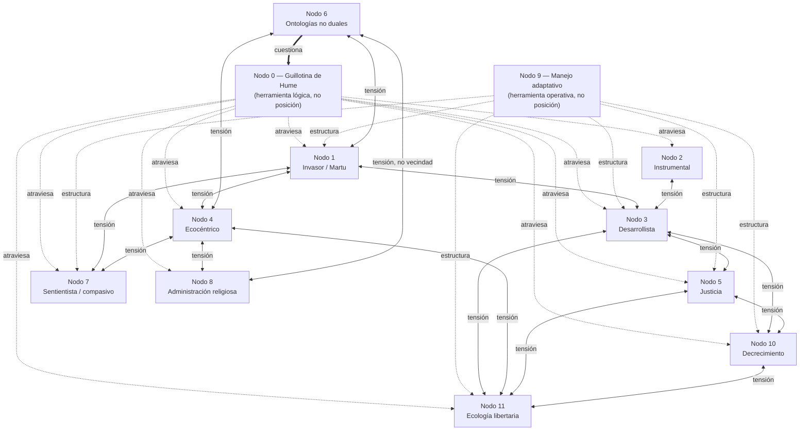

# Mapa de posiciones: conservación, antropocentrismo y la guillotina de Hume

*Documento único — revisa e integra conservacion-sin-infalibilismo.md y su v2, y ahora incorpora el Nodo 11 (ecología libertaria/anarquista). No es una versión nueva apilada sobre las anteriores; las reemplaza.*

Esto no es un ensayo que llega a una conclusión. Es un mapa: cada nodo es una posición real, con su mejor caso, y con la tensión que tiene con los nodos vecinos hecha explícita al final. El desacuerdo entre nodos no se resuelve al cierre — se documenta, porque intentar resolverlo aquí sería fingir un consenso que no existe.

*Líneas punteadas ".atraviesa.": Nodo 0 cruza 1–5, 7, 8, 10 y 11 como herramienta lógica común dentro del marco naturaleza/cultura. Líneas punteadas ".estructura.": Nodo 9 no es una posición de valor — es una postura operativa de segundo orden que estructura cómo se decide bajo incertidumbre en los nodos donde hay manejo activo en juego; se representa distinto de una tensión porque no compite por la misma premisa, la presupone. Líneas dobles: Nodo 6 no está dentro del marco naturaleza/cultura, lo pone en duda desde fuera. Líneas con flecha doble: tensión sin resolver entre posiciones vecinas — la de Nodo 6–Nodo 8 se etiqueta "no vecindad" porque, a diferencia de las demás, no comparten ni siquiera la ontología de fondo (ver Nodo 8).*

## Nota sobre el tipo de afirmación que hace cada nodo

No todos los nodos de este mapa afirman lo mismo, y leerlos como si todos hicieran el mismo tipo de reclamo —una hipótesis contrastable con un dato— sería un error de lectura, no una simplificación inocente. Conviene distinguir cuatro registros distintos antes de entrar en el detalle de cada uno:

- **Evidencia empírica revisable.** Los Nodos 1 y 2 se apoyan en resultados medibles — el historial de manejo del fuego en el caso Martu, el riesgo de *spillover* zoonótico asociado a la conversión de hábitat. Son, en principio, refutables por un dato nuevo: un caso donde el manejo activo empobrezca el sistema, una tecnología que sustituya el servicio ecosistémico sin él.
- **Axioma elegido o autoridad aceptada.** El Nodo 4 declara su premisa como una elección que no pretende derivarse de la evidencia; el Nodo 8 la recibe de una autoridad trascendente aceptada por fe. Ninguno de los dos se abandona por un dato — se abandona por una elección distinta o por una reinterpretación de la autoridad.
- **Descripción antropológica de una ontología.** El Nodo 6 no defiende una tesis normativa contrastable: describe estructuras de pensamiento documentadas etnográficamente (Descola, Viveiros de Castro). La disputa que abre no es empírica, es sobre qué ontología es la correcta o la más completa, una pregunta que la propia antropología filosófica tiene abierta.
- **Tesis estructural sobre causalidad social e histórica.** Los Nodos 3, 5, 10 y 11 no declaran un axioma sobre el valor de la naturaleza ni invocan una autoridad externa: argumentan a partir de qué mecanismo social genera un resultado —quién carga un coste, qué correlación se rompe, qué estructura antecede a las demás—, apoyados en literatura académica y casos documentados. Este tipo de tesis no se salda con un experimento puntual, como sí ocurre en buena medida con el Nodo 1: se sostiene o se debilita con el peso acumulado de evidencia histórica e institucional, y suele admitir una versión fuerte y una débil que no pesan igual (ver Nodo 10).

La columna "qué evidencia cambiaría su posición" de la tabla de cierre existe, en parte, para hacer visible esta diferencia fila por fila — no todas piden el mismo tipo de prueba, y tratarlas como si la pidieran sería atribuirle a un axioma o a una tesis estructural el mismo estatus que a un resultado de campo.

---

## Nodo 0 — La herramienta que genera todo el mapa: la guillotina de Hume

Ningún conjunto de premisas puramente descriptivas ("los ecosistemas cambian, no tienen estado de referencia objetivo") implica lógicamente una conclusión prescriptiva ("por tanto hay que conservarlos" o "por tanto da igual explotarlos"). Es un resultado de forma lógica, no una opinión: la conclusión no puede contener un predicado normativo que no está en ninguna premisa.

Esto no distingue conservación de anti-conservación. Corta a los dos lados por igual. Un argumento desarrollista del tipo "el mercado asigna eficientemente, por tanto hay que dejar que reconfigure el territorio" necesita exactamente la misma premisa oculta (que la eficiencia paretiana es preferible a otros criterios) que un argumento conservacionista del tipo "esta especie desplaza a la fauna nativa, por tanto hay que erradicarla" (que la composición previa es preferible a la posterior). Cada nodo de este mapa tiene, en algún punto, una de estas premisas no derivada de la ciencia. Ninguno se libra.

*Nota sobre el naturalismo ético — una segunda objeción, distinta de la del Nodo 6.* La guillotina de Hume no es indiscutida ni siquiera dentro de la propia tradición filosófica occidental que la formuló. Filósofas como Elizabeth Anscombe y Philippa Foot, y con ella el naturalismo ético contemporáneo, niegan que el hueco entre "es" y "debe" sea categórico: sostienen que ciertos enunciados descriptivos sobre el funcionamiento propio de una forma de vida ya cargan normatividad sin premisa adicional — decir "un lobo cojo es un mal lobo" no es un hecho neutro al que después se le añade un juicio de valor, es una evaluación que se sigue de entender qué es un lobo que funciona bien. Esta objeción es lógicamente distinta de la del Nodo 6: no dice que el hueco es un producto de una ontología particular (naturalista) frente a otras (animista, totémica) — dice que, incluso dentro del marco occidental, el hueco lógico que Hume propone no es tan limpio como se suele asumir. El mapa no puede tratar la guillotina como aceptada salvo por la vía antropológica; también está en disputa por la vía estrictamente analítica, y eso no está resuelto aquí tampoco.

*Nota: esta herramienta se presenta aquí como si cortara desde fuera de cualquier ontología concreta. El Nodo 6 pone en duda justo eso — si es realmente universal o si es, ella misma, un producto de una ontología particular entre varias.*

---

## Nodo 1 — "Invasor": el caso Martu contra la neutralidad de no intervenir

Hay tres antropocentrismos distintos que se confunden bajo esta palabra, y no pesan igual:

**Antropocentrismo de clasificación (inevitable, y aquí sí hay simetría real).** "Rango nativo" requiere elegir una fecha de corte — no hay ninguna que la naturaleza traiga etiquetada. Cualquier corte es una decisión humana, y en esto "invasor" no está más manchado que "especie" o "ecosistema": toda frontera clasificatoria en biología comparte este problema.

**Antropocentrismo léxico-connotativo (evitable, y no es simétrico — la palabra misma no es inocente).** Este es un problema distinto del anterior y no se reduce a él. "Invasor" no es un término neutro al que se le añade un juicio de valor después; importa una metáfora bélica —invasión como incursión hostil de un enemigo— desde la raíz de la palabra, algo que "especie" o "ecosistema" no cargan. No es una lectura forzada: es un desacuerdo activo dentro de la propia biología de invasiones. Simberloff (2013) distingue dos tipos de crítica al campo — la que cuestiona la validez analítica de conceptos como "exótico", "invasor" o "nativo", y la que denuncia directamente el carácter bélico de las metáforas empleadas como una forma de discurso xenófobo. Por esa segunda vía, parte de la disciplina (Colautti y MacIsaac, Larson) ha propuesto adoptar vocabulario más neutro precisamente porque reconoce que el término actual no lo es; autores de humanidades (Coates, Comaroff y Comaroff, Potts, Sagoff) han señalado las resonancias xenófobas y racistas del lenguaje bélico aplicado al movimiento de especies. Vale la pena notar, para no dejar la simetría del mapa coja por el otro lado: el vocabulario economicista del Nodo 3 tiene su propio sesgo léxico del mismo tipo — "recurso natural" ya presupone, en el sustantivo mismo, que la naturaleza existe en función de un uso humano, antes de que empiece cualquier argumento.

**Antropocentrismo evaluativo (evitable, y aquí es donde se cuela el salto de Hume).** Tratar "llegó por vector humano" como sinónimo de "malo" es un salto que no está en los datos. Una especie que expande su rango por un cambio climático natural y desplaza localmente a otras no se llama "invasora" aunque el efecto medido sea idéntico. La diferencia es un juicio de valor añadido en silencio — y la carga léxica del párrafo anterior es, de hecho, uno de los mecanismos por los que ese juicio se cuela sin que nadie tenga que argumentarlo explícitamente.

El caso que ataca de raíz la premisa más cómoda de este nodo —que "dejar que la naturaleza siga su curso sin nosotros" sería la opción neutral— es el manejo del fuego por los Martu en el desierto occidental australiano. El fuego de baja intensidad practicado por generaciones no coexistía con la biodiversidad de la zona: la generaba, produciendo mosaicos de vegetación en distintos estadios sucesionales que sostenían más especies que el desierto resultante. Cuando el manejo humano activo se retiró, entre los años 60 y 80, el sistema no volvió a un estado "más natural" — se empobreció. No hubo ningún punto en el que "quitar al humano del sistema" produjera algo neutral; produjo una configuración distinta, con menos diversidad, gobernada igualmente por una historia de manejo (solo que ausente en vez de presente).

Esto no resuelve qué hacer con una especie introducida por comercio internacional en el siglo XXI. Pero sí elimina una salida fácil: "no intervengamos y dejemos que la naturaleza decida" no es menos una decisión humana sobre el territorio que intervenir activamente.

**Tensión con Nodo 3 (desarrollista):** si ni la no-intervención es neutral, tampoco lo es "dejar que el mercado decida" — es la misma estructura argumental aplicada a otro actor. Nodo 3 tiene que responder a esto, no solo Nodo 2.

---

## Nodo 2 — Conservación instrumental: autointerés humano medible

Esta familia de argumentos no necesita ningún juicio sobre si la naturaleza "debería" estar de otra forma — valora el territorio por lo que sostiene para sociedades humanas concretas, con evidencia medible:

- **Salud (One Health / Planetary Health):** la conversión de hábitat y el comercio de fauna silvestre están asociados a un aumento medible del riesgo de *spillover* zoonótico — SARS, H5N1 y el linaje de coronavirus tras la COVID-19 se citan como casos de estudio dentro de este marco adoptado por la OMS y la FAO. Legislar sobre uso del suelo reduce un riesgo sanitario cuantificable.
- **Resiliencia (Holling):** el argumento no es mantener un estado X, es evitar cambios de régimen — desplazamientos a una configuración cualitativamente distinta, con frecuencia menos productiva o habitable, y difícil de revertir en escalas de tiempo humanas.
- **Servicios ecosistémicos:** polinización, regulación hídrica, control de erosión — valorados como capital del que depende actividad económica concreta.

Esta familia es antropocéntrica sin disimulo — valora la naturaleza en función de lo que aporta a los humanos. No pretende ser otra cosa. Su fuerza es que no necesita el axioma ecocéntrico del Nodo 4; su límite es que si el cálculo cambia (una tecnología que sustituye el servicio, un umbral de riesgo que se acepta), el argumento deja de sostener la conclusión — porque nunca dependió de la naturaleza en sí, dependió del cálculo.

**Tensión con Nodo 3:** ambos nodos son igual de instrumentales-humanos, solo priorizan utilidades humanas distintas (salud/estabilidad a largo plazo vs. ingreso/empleo a corto plazo). Ninguno tiene autoridad "más objetiva" que el otro por ese motivo — la disputa real entre ambos es de horizonte temporal y de a quién se le atribuye el coste, no de cuál es más científico.

---

## Nodo 3 — Desarrollismo/economicismo: el caso que casi nunca se desarrolla con el mismo cuidado

Este nodo se suele presentar en una fila de tabla, como contraste, y rara vez con el mismo desarrollo que los demás. Aquí se le da ese espacio.

El caso más fuerte y mejor documentado es la expansión del cultivo de palma aceitera en Indonesia y Malasia. Es, simultáneamente, una de las causas de deforestación tropical y pérdida de biodiversidad mejor estudiadas del planeta, y una fuente de ingreso que ha sacado de la pobreza a millones de pequeños agricultores — la palma produce más aceite por hectárea que cualquier otro cultivo oleaginoso conocido, lo que significa que sustituirla por alternativas "menos dañinas" con menor rendimiento requeriría más tierra convertida, no menos, para producir la misma cantidad de aceite. El argumento desarrollista aquí no es una abstracción sobre el PIB: es que restringir esta actividad sin ofrecer una alternativa de ingreso equivalente traslada el coste directamente a quienes menos margen tienen para absorberlo — los mismos actores que en el Nodo 5 se identifican como los que cargan injustamente con los costes del cambio ecológico, aparecen aquí como los que cargarían con el coste de *no* poder desarrollarlo.

La premisa normativa que sostiene este nodo — que el ingreso y la reducción de pobreza medible en el corto plazo pesan más que la pérdida de biodiversidad y el riesgo climático a largo plazo — es tan una elección de valor como la premisa ecocéntrica del Nodo 4. No es más "neutral" ni más "realista"; es el marco que resulta invisible como postura porque está incorporado en instituciones, precios de mercado y políticas de desarrollo, no porque tenga menos premisas ocultas que los demás.

**Tensión con Nodo 1:** si "dejar que el mercado decida" tampoco es neutral (ver cierre de Nodo 1), este nodo no puede apoyarse en la idea de que la no-intervención regulatoria es la opción por defecto — tiene que defender explícitamente por qué el ingreso a corto plazo pesa más, no dar por hecho que es el estado natural de las cosas.

**Tensión con Nodo 2:** ambos comparten estructura instrumental; difieren en a quién se le da prioridad temporal y quién asume el riesgo del error si la apuesta falla.

**Tensión con Nodo 10:** el desarrollismo asume que más ingreso sigue siendo deseable sin límite relevante para esta discusión; el decrecimiento, en su versión fuerte, niega exactamente esa premisa por encima de cierto umbral — no es la misma disputa que con el Nodo 5 (ver Nodo 10).

**Tensión con Nodo 11:** de otro orden que la anterior, porque no se libra dentro del mismo terreno institucional. El Nodo 10 acepta el mercado y discute cuánto debería crecer; el Nodo 3 defiende el ingreso a corto plazo operando *dentro* de la propiedad privada, el mercado y el Estado tal como existen hoy. El Nodo 11 no discute cuánto debería producirse dentro de ese marco: sostiene que el marco mismo —la relación de propiedad y la jerarquía administrativa que lo hace funcionar— es lo que genera el coste ecológico que el Nodo 3 después intenta compensar con más ingreso. No es una disputa sobre cuánto pesa el ingreso frente al riesgo (esa es la disputa con el Nodo 5): es una disputa sobre si la estructura donde se plantea el trade-off puede, en principio, producir un resultado que el Nodo 11 esté dispuesto a aceptar como legítimo.

---

## Nodo 4 — Ética ecocéntrica: el único nodo *dentro del marco naturalista* que admite su axioma abiertamente

La ética de la tierra de Leopold, la ecología profunda: los procesos salvajes tienen valor intrínseco, no instrumental. Es la única posición de los Nodos 1 a 5 —es decir, dentro del marco naturaleza/cultura— que no intenta esconder su premisa normativa detrás de un cálculo de autointerés o de evidencia empírica: la declara como axioma elegido.

Su fuerza es la honestidad estructural: no pretende derivarse de la ciencia. Su debilidad, señalada por la antropología (Nodo 1, crítica al wilderness) es que la versión histórica de este axioma — "naturaleza prístina, sin intervención humana"— nació en el siglo XIX en EE. UU. (Muir, Thoreau) borrando sistemáticamente la presencia y el manejo activo de pueblos indígenas de los territorios luego declarados "vírgenes". El propio axioma, en su formulación más común, carga con un sesgo histórico-cultural concreto, no es un punto de partida limpio.

**Tensión con Nodo 1:** el caso Martu es también el contraejemplo más directo contra la versión ingenua de este nodo — si el manejo humano activo generaba más biodiversidad que su ausencia, "proceso salvaje sin humanos" no es la categoría que este nodo necesita para sostenerse; necesitaría reformularse como "proceso no dirigido por lógica de acumulación", que es un axioma distinto y más difícil de defender.

**Tensión con Nodo 11:** ambos rechazan el marco puramente instrumental-humano, pero desde raíces incompatibles. El Nodo 4 declara el valor intrínseco de la naturaleza como axioma autónomo, independiente de cualquier teoría sobre cómo está organizada la sociedad — es compatible, al menos en principio, con cualquier régimen político, incluido uno jerárquico. El Nodo 11 no parte de ningún axioma sobre el valor de la naturaleza en sí: deriva la crisis ecológica de una tesis sobre estructura social, la dominación de la naturaleza como extensión de la dominación entre personas, así que un programa ecocéntrico impuesto por un Estado autoritario sería, leído desde el Nodo 11, un caso más del mismo mecanismo que produce la crisis, no una salida de ella. Los dos nodos pueden proteger el mismo bosque por el mismo motivo aparente sin compartir ni la premisa que los mueve ni lo que cada uno señala como causa de fondo del problema.

---

## Nodo 5 — Justicia: entre humanos, no sobre la naturaleza

Dos variantes que no requieren ningún juicio sobre el ecosistema en sí:

- **Justicia ambiental (distributiva):** quién carga con los costes del cambio ecológico forzado no está distribuido al azar — suele recaer en quien menos lo causó y menos capacidad tiene de adaptarse.
- **Justicia intergeneracional (rawlsiana):** las generaciones futuras no pueden consentir ni negociar las condiciones que heredan; degradar de forma irreversible un recurso impone un coste a alguien sin participación en la decisión.

**Tensión con Nodo 3:** este es el choque más directo del mapa. El Nodo 3 puede señalar, con el mismo tipo de argumento distributivo, que restringir el desarrollo también traslada un coste a quien menos margen tiene — a los pequeños agricultores de palma, no a quien impone la restricción desde fuera. Ambos nodos usan justicia distributiva para llegar a conclusiones opuestas. Esta tensión no tiene resolución dentro del marco de "justicia distributiva" solo — requiere decidir qué distribución de costes actuales se acepta a cambio de qué reducción de riesgo futuro, y esa decisión es, otra vez, normativa.

**Tensión con Nodo 11:** coinciden en el diagnóstico —el coste ecológico se reparte de forma injusta— pero difieren en dónde termina la explicación. El Nodo 5 puede resolverse sin salir de las instituciones existentes: compensación, regulación, transferencias entre quien causa el daño y quien lo sufre. El Nodo 11 no acepta que el reparto injusto sea un desajuste corregible dentro de esas mismas instituciones; lo trata como un efecto esperable de ellas. Un régimen de compensaciones bien diseñado, para el Nodo 5, cuenta como una solución; para el Nodo 11, a lo sumo alivia el síntoma sin tocar lo que lo produce.

---

## Nodo 6 — Ontologías no duales: cuando "naturaleza vs. cultura" no es la pregunta

Todo el mapa hasta aquí —clasificación, evaluación, justicia, axioma ecocéntrico— comparte una pregunta de fondo: dado que hay una naturaleza (el mundo físico, no humano) y una cultura (el mundo de los valores, humano), ¿qué le debemos a la primera? Esa pregunta no es universal. Es, según el antropólogo Philippe Descola, el rasgo distintivo de una entre **cuatro** formas documentadas en que las sociedades humanas han organizado la diferencia entre existentes, clasificadas según si comparten con los humanos la misma fisicalidad, la misma interioridad, ambas o ninguna. El **naturalismo** —la ontología occidental moderna— asigna a humanos y no humanos la misma fisicalidad (todos son materia sujeta a las mismas leyes) pero interioridades distintas: solo los humanos tienen mente, cultura, valores. El **animismo** —presente en numerosas cosmologías amazónicas, circumpolares y de otras regiones— invierte esa distribución: los no humanos (animales, plantas, ríos, montañas) comparten interioridad con los humanos —espíritu, perspectiva, intencionalidad— y difieren solo en el soporte físico. Descola documentó esto de primera mano entre los achuar de la Amazonía ecuatoriana, donde no existía distinción entre humanos y no humanos, y las relaciones interpersonales se extendían a plantas, animales e incluso piedras.

Los otros dos tipos no son menos relevantes para este mapa. El **totemismo** —documentado extensamente en Australia aborigen, el mismo continente del caso Martu del Nodo 1— postula que grupos humanos y no humanos específicos comparten tanto fisicalidad como interioridad por descender de un mismo antepasado o principio común: un clan y su especie totémica no son sujeto y objeto, son parientes con un origen compartido, y el vínculo es entre grupos concretos, no entre "lo humano" y "lo no humano" en general. El **analogismo** —presente en la China imperial, buena parte de Mesoamérica, y las cosmologías correlativas del Renacimiento europeo— parte de la premisa opuesta a la del animismo: ni fisicalidad ni interioridad se comparten, cada existente es singular, pero todos están conectados por una red densa de correspondencias jerárquicas (microcosmos-macrocosmos, elementos, humores) que exige mantener el equilibrio del conjunto, no reconocer un sujeto individual.

Esto no es un matiz menor para el propio Nodo 1: el fuego de manejo Martu, presentado ahí como el caso que desmonta la neutralidad de "no intervenir", probablemente no ocurre dentro de una ontología naturalista ni puramente animista — ocurre, con alta probabilidad, dentro de un marco totémico, donde el vínculo entre el pueblo Martu y las especies del desierto no es el de un gestor humano optimizando un sistema externo, sino el de un pariente manteniendo una relación de parentesco. El Nodo 1 de este mapa analiza el caso *desde* el marco naturalista (evidencia, biodiversidad medida, gestión) mientras el caso mismo probablemente pertenece a otro marco — una asimetría que el propio Nodo 1 no señala sobre sí mismo.

Eduardo Viveiros de Castro fue un paso más allá con el perspectivismo amerindio: donde el pensamiento occidental asume una sola naturaleza objetiva interpretada por muchas culturas subjetivas (multiculturalismo), buena parte de las cosmologías amazónicas asumen lo contrario — una sola cultura, en el sentido de que todos los seres son personas con espíritu y sociabilidad, y muchas naturalezas, porque cada cuerpo ve el mundo desde su propia perspectiva (multinaturalismo). No es una figura retórica: en ese marco, cazar es un encuentro entre personas, no una relación sujeto-objeto entre un humano y un recurso.

Esto tiene un anclaje legal-político actual, no solo etnográfico. Las constituciones de Ecuador (2008) y Bolivia (2009) incorporan a la Pacha Mama como sujeto de derechos — y a diferencia de la vía de "derechos de la naturaleza como herramienta de gobernanza" (útil sin resolver la metafísica, mencionada en la v2 de este documento), el texto ecuatoriano no la trata como ficción legal ni como mecanismo procesal: la declara, en el preámbulo, aquello "de la que somos parte", y el Artículo 71 le reconoce el derecho a que se respete el mantenimiento y regeneración de sus ciclos vitales, estructura, funciones y procesos evolutivos, sin mediarlo por ningún cálculo de utilidad humana.

**Por qué esto no es solo "otro nodo más" con otro axioma para elegir.** Si el propio par naturaleza/cultura —y con él, hecho/valor— es un producto histórico específico del naturalismo occidental y no una estructura universal de la razón, entonces el Nodo 0 puede ser él mismo parte de esa ontología particular, no un instrumento neutral aplicado desde fuera de cualquier ontología. La guillotina de Hume separa limpiamente "es" de "debe" con esa nitidez precisamente porque el naturalismo ya separó de antemano la fisicalidad compartida (el dominio de los hechos) de la interioridad exclusivamente humana (el dominio del valor). En una ontología animista, donde el río tiene interioridad, decir "el río sufre con esta represa" no es un hecho neutro al que después se le añade un juicio de valor — es ya, en sí misma, una afirmación sobre el estado interior de un sujeto, en un marco donde reconocer un sujeto y reconocer que su estado importa pueden no ser dos pasos separables.

**Tensión no resuelta — con Nodo 0.** Cabe una respuesta humeana incluso aquí, y este mapa no la va a zanjar: reconocer que un río tiene interioridad (un "hecho" dentro de esa ontología) no obliga por sí solo a actuar para protegerlo — sigue haciendo falta el paso adicional de que ese estado importa y debe evitarse, que es estructuralmente el mismo salto que exige la guillotina, solo reubicado. Si esto es así, el animismo no escapa a Hume, solo desplaza dónde se esconde la premisa. Si no es así —si en esas ontologías reconocer personeidad y reconocer obligación son, de hecho, el mismo acto— entonces la guillotina de Hume no es una ley universal de la inferencia, es un rasgo local del naturalismo, y ese es un desacuerdo que sigue abierto en la propia antropología filosófica, no algo que este documento pueda resolver. Hay además una segunda objeción a Hume, distinta de esta e interna a la propia tradición occidental — ver Nodo 0, nota sobre el naturalismo ético.

**Tensión con Nodo 1.** Si "especie" —igual que "invasor"— presupone ya la ontología naturalista (clasificar por fisicalidad compartida, no por interioridad), entonces la objeción de que "las palabras no son inocentes" no termina en "invasor". Llega hasta "especie" mismo, que en una ontología animista no sería siquiera la unidad de clasificación relevante: lo relevante sería quién tiene espíritu y quién no, no qué forma física se comparte. En una ontología totémica, "especie" tampoco sería la unidad relevante, pero por otra razón: lo relevante sería qué grupo humano y qué grupo no humano comparten linaje, no qué forma física comparten con otros no humanos sin parentesco declarado.

**Tensión con Nodo 4.** La ética ecocéntrica declara el valor intrínseco de la naturaleza como axioma elegido, pero sigue operando dentro del marco naturalista — sigue habiendo una naturaleza separada a la que se le atribuye valor. El animismo no elige atribuirle valor a la naturaleza: no tiene, para empezar, la categoría "naturaleza" separada de "cultura" a la que atribuírselo. Son dos vías que llegan a conclusiones prácticas parecidas —proteger ríos, bosques, especies— por caminos metafísicamente incompatibles, no complementarios entre sí.

**Tensión con Nodo 8 — y por qué no es una vecindad real.** El Nodo 8 (administración religiosa) podría parecer, a primera vista, otro caso de "ruptura con el naturalismo estricto", pero no lo es del mismo tipo: dentro de la propia tipología de Descola, el catolicismo y el islam de administración son variantes teológicas del **naturalismo**, no del animismo — mantienen la separación entre la interioridad humana (con alma) y la fisicalidad no humana (sin ella), y añaden encima una autoridad trascendente que delega el cuidado. El Nodo 6 disuelve la frontera naturaleza/cultura desde dentro de la relación misma; el Nodo 8 la mantiene intacta y añade un tercer nivel jerárquico por encima de ambas. No son primos cercanos por el hecho de que los dos "no sean instrumentalismo puro" — comparten superficie práctica (proteger la creación / el territorio) sobre estructuras ontológicas casi opuestas.

---

## Nodo 7 — Sentientismo / conservación compasiva: el individuo contra la población

Este nodo no valora especies, ecosistemas ni procesos — valora al animal sintiente concreto, y su sufrimiento importa con independencia de lo que ese sufrimiento aporte o quite a una población, una especie o un humano. Es un debate activo y documentado dentro de la propia biología de la conservación: *compassionate conservation* frente a la conservación consecuencialista dominante (Wallach et al. 2018; la réplica de Oommen et al. y otros defendiendo el manejo letal como herramienta necesaria).

No es reducible a ninguno de los nodos ya descritos. No es el Nodo 4: la ética ecocéntrica valora procesos y totalidades —la especie, el ecosistema, "lo salvaje"— no al individuo; de hecho puede exigir sacrificar individuos por el bien del proceso. No es el Nodo 2: no es instrumental-humano, no le importa lo que el bienestar del animal aporte a ninguna sociedad humana. Es una tercera unidad de valor —el individuo sintiente— que ninguno de los otros nodos toma como referencia.

Choca de frente con el propio Nodo 1. La práctica estándar en manejo de fauna —erradicar una especie introducida para proteger presas nativas— es exactamente lo que esta postura rechaza, incluso en el caso límite: dejar que un depredador introducido extinga localmente a una presa nativa antes que matar individuos del depredador para impedirlo. Donde el Nodo 1 pregunta "¿qué historial de manejo sostiene más biodiversidad?", este nodo pregunta "¿qué le pasa a este animal concreto?" — y son preguntas que pueden apuntar en direcciones opuestas en el mismo caso.

**Tensión con Nodo 1 y con la conservación consecuencialista en general.** El caso Martu (fuego activo, manejo continuo) y el manejo letal de invasores comparten una misma lógica: la intervención sobre individuos o poblaciones se justifica por el resultado agregado sobre el sistema. El Nodo 7 niega que ese agregado tenga autoridad para justificar el sufrimiento o la muerte de un individuo sintiente concreto — es una objeción de principio, no una disputa sobre qué intervención funciona mejor.

**Tensión con Nodo 4.** Ambos nodos rechazan el marco puramente instrumental-humano, pero por razones incompatibles entre sí: el Nodo 4 puede exigir el sacrificio de individuos en nombre del proceso salvaje; el Nodo 7 puede exigir proteger a un individuo aunque eso dañe el proceso. No son aliados naturales dentro del "bando no antropocéntrico" — compiten por cuál es la unidad moral correcta.

**Nota de consistencia interna.** En su versión fuerte —la que efectivamente choca con el Nodo 1 en el caso límite descrito arriba— este nodo no es consecuencialista sobre el sufrimiento agregado: es una posición sobre el *estatus moral* del individuo sintiente, que no se deja anular por el resultado del cálculo. Por eso ninguna cifra de sufrimiento evitado a nivel de población puede, por sí sola, mover esta posición — moverla requeriría un argumento sobre el estatus moral mismo, no un dato de resultado. Esto tiene una consecuencia directa para la tabla de cierre de este mapa.

---

## Nodo 8 — Ética ambiental religiosa: administración delegada, no axioma elegido

Laudato Si' (2015, catolicismo) y el concepto islámico de *khalifa* (administración humana de la creación) junto con *mizan* (equilibrio) no afirman que la naturaleza tenga valor intrínseco por sí misma —eso es el Nodo 4— ni que tenga interioridad o personeidad compartida con lo humano —eso es el Nodo 6. Afirman una tercera estructura lógica: el ser humano tiene un deber de cuidado hacia la creación porque le ha sido *delegado por una autoridad trascendente*. No es un axioma que alguien elige adoptar (Nodo 4) ni una relación de sujeto a sujeto reconocida de forma directa (Nodo 6) — es un mandato de un tercero, con una cadena de autoridad propia: Dios, la creación, el ser humano como administrador con cuentas que rendir.

Esto tiene peso institucional real, no solo doctrinal: el Movimiento Laudato Si' certifica a casi 20.000 líderes ambientales en 140 países, y existen declaraciones islámicas formales sobre cambio climático desde 2015 (la Declaración Islámica sobre el Cambio Climático Global) firmadas por autoridades religiosas de distintos países, con *mizan* como el concepto central que exige no romper el equilibrio establecido en la creación.

**Por qué no colapsa en el Nodo 0 igual que los demás.** La guillotina de Hume sigue aplicando: de "existe un mandato divino de cuidar la creación" no se sigue lógicamente "por tanto debo cuidarla" sin la premisa adicional de que ese mandato obliga. Pero esa premisa no se esconde ni se declara como elección personal (a diferencia del Nodo 4) — se sostiene en una autoridad externa aceptada por fe, lo que la hace inmune a la crítica de "¿por qué elegiste ese axioma y no otro?" del mismo modo en que sí es vulnerable el Nodo 4: no es una elección, es una obediencia.

**Tensión con Nodo 4.** Ambos nodos llegan a conclusiones prácticas parecidas —proteger la creación, no agotar los recursos— pero por estructuras incompatibles: uno declara valor intrínseco como axioma autónomo, el otro lo deriva de una obligación heterónoma hacia una autoridad trascendente. Un mismo llamado a "proteger la naturaleza" significa cosas distintas según de cuál de los dos se sostenga.

**Tensión con Nodo 6 — y por qué no es una vecindad real.** Ambos parecen romper con el naturalismo estricto, pero de formas incompatibles y, de hecho, casi opuestas. Dentro de la propia tipología de Descola (ver Nodo 6), el catolicismo y el islam de administración son variantes teológicas del **naturalismo**, no del animismo: mantienen la separación entre interioridad humana (con alma) y fisicalidad no humana (sin ella), y le añaden encima una autoridad trascendente que delega el cuidado. El Nodo 6 disuelve la frontera naturaleza/cultura desde dentro de la relación misma; el Nodo 8 la mantiene intacta y añade un tercer nivel jerárquico por encima de ambas. Comparten superficie práctica —proteger el territorio, no agotar los recursos— sobre estructuras ontológicas casi opuestas, no complementarias.

---

## Nodo 9 — Manejo adaptativo: herramienta operativa, no posición de valor

Este nodo es de otro tipo que los ocho anteriores, y hay que decirlo con la misma claridad con la que el propio mapa distingue el Nodo 0 de una posición: no es una premisa sobre qué se debe valorar, es una postura de segundo orden sobre *cómo decidir bajo incertidumbre* cuando la evidencia empírica sobre el sistema es incompleta y va a seguir siéndolo. Su principio es simple: estructurar la intervención para poder revertirla, medirla y corregirla, en vez de comprometerse de antemano a un plan fijo basado en un modelo que probablemente esté equivocado en algún punto.

El propio caso Martu (Nodo 1) es, visto desde este ángulo, el mejor ejemplo empírico disponible en este mapa: el mosaico de quemas de baja intensidad no era un plan fijo aplicado una vez, era un ajuste continuo por generaciones en función del resultado observado — más quema aquí si la sucesión avanza demasiado, menos allá si el sustrato no se recupera. Leído solo como argumento normativo (Nodo 1: "la no-intervención tampoco es neutral"), el caso pierde la mitad de lo que enseña; leído también como caso de manejo adaptativo, enseña además que la calidad de una intervención no depende de acertar con el modelo al principio, sino de poder corregirlo sin costos catastróficos mientras se aprende.

**Por qué se representa distinto en el diagrama.** El Nodo 9 no compite por la misma premisa que los Nodos 1-5, 7, 8, 10 o 11 — la presupone y la deja intacta. Alguien del Nodo 3 (desarrollista) y alguien del Nodo 5 (justicia intergeneracional) pueden estar en desacuerdo total sobre qué pesa más, e igual de acuerdo en que, sea cual sea la decisión, debería tomarse de forma reversible y monitoreada en vez de irreversible y ciega. Por esto no se dibuja con flecha de "tensión" — se dibuja "estructura", el mismo tipo de relación no competitiva que Nodo 0 tiene con los nodos de valor, solo que en el plano operativo en vez del lógico.

**Límite del propio nodo.** Esta postura no resuelve ninguna disputa normativa del mapa — solo cambia la forma en que cualquier posición se implementa. Un desarrollista puede aplicar manejo adaptativo a la expansión de la palma aceitera (Nodo 3) igual que un ecocentrista puede aplicarlo a la restauración de un ecosistema (Nodo 4), o una comunidad organizada según el Nodo 11 puede aplicarlo a la gestión de un bosque comunal; el manejo adaptativo no dice cuál de esas metas perseguir, solo cómo perseguir cualquiera de ellas con menos riesgo de error irreversible. Tratarlo como si zanjara alguna de las tensiones normativas del mapa sería un error de categoría, el mismo que cometería tratar al Nodo 0 como si tomara partido entre conservación y desarrollo.

---

## Nodo 10 — Decrecimiento: cuando el propio trade-off ingreso-vs-riesgo es el marco rechazado

Este nodo no es una variante del Nodo 3 con el signo cambiado, ni una repetición del Nodo 5 con otro nombre — aunque a primera vista puede parecerlo. La versión fuerte del decrecimiento (Hickel, Kallis y la literatura de *degrowth* revisada por pares) no dice "el riesgo climático a largo plazo pesa más que el ingreso a corto plazo" — eso ya lo dice el Nodo 5 frente al Nodo 3, dentro del mismo tipo de argumento distributivo. Dice algo distinto: que, por encima de cierto umbral de ingreso ya alcanzado en las economías ricas, el crecimiento del PIB deja de correlacionar con bienestar humano medido (salud, satisfacción vital, tiempo libre) — así que el propio trade-off que Nodo 3 y Nodo 5 dan por hecho, "más ingreso a cambio de más riesgo o viceversa", deja de ser la pregunta correcta en ese tramo. No es una postura sobre cuánto pesa cada lado de la balanza; es el rechazo de que haya una balanza ahí.

Esto tiene peso institucional y académico real: literatura revisada por pares en revistas de ecología política y economía ecológica, y propuestas de política pública en debate activo en la Unión Europea (informes del Parlamento Europeo sobre "post-crecimiento", 2023).

**Debilidad que el propio nodo no puede esconder.** La disciplina económica está genuinamente dividida entre esta versión fuerte (desacople bienestar/PIB como premisa empírica) y una versión más débil, mucho más citada en divulgación, que en la práctica sí es reducible al Nodo 5 ("el riesgo futuro pesa más, así que hay que crecer menos ahora") — y esa versión débil no aporta nada que el mapa no tuviera ya. Cualquier lectura de este nodo tiene que declarar cuál de las dos versiones está en juego, porque tienen fuerza argumental completamente distinta.

**Tensión con Nodo 3.** Directa y sin intermediarios: Nodo 3 defiende el caso más fuerte posible de que el ingreso a corto plazo justifica el coste ecológico (palma aceitera, millones de agricultores sacados de la pobreza); Nodo 10, en su versión fuerte, sostiene que ese mismo ingreso, pasado cierto punto, deja de tener el valor que Nodo 3 le atribuye. No es una disputa sobre cuánto pesa el ingreso — es una disputa sobre si el ingreso adicional sigue pesando lo que Nodo 3 asume que pesa.

**Tensión con Nodo 5.** Más sutil que con Nodo 3: comparten la conclusión práctica (frenar cierta actividad económica) pero no la premisa. Nodo 5 puede aceptar sin contradicción que el ingreso adicional sigue siendo valioso y aun así argumentar que su coste se distribuye injustamente; Nodo 10, en su versión fuerte, ni siquiera necesita el argumento distributivo — le basta con que el ingreso adicional ya no aporte lo que se le atribuye. Confundir ambos nodos hace parecer más sólido al decrecimiento de lo que su versión débil, por sí sola, sostiene.

**Tensión con Nodo 11.** Ambos rechazan el marco convencional, pero desde ejes distintos que conviene no confundir. El Nodo 10 discute una correlación empírica: si el crecimiento del PIB sigue produciendo bienestar por encima de cierto umbral. El Nodo 11 no necesita esa pregunta para sostener su tesis, porque la sitúa un nivel más abajo: para este nodo, ninguna trayectoria del PIB —crezca, se estanque o decrezca— resuelve la crisis ecológica mientras la estructura jerárquica que la genera siga en pie. Un programa de decrecimiento gestionado por un Estado centralizado sería, leído desde el Nodo 11, insuficiente por diseño, no por su resultado sobre el PIB: el mecanismo que este nodo señala como causa —la jerarquía— seguiría operando aunque el indicador agregado bajara. Pueden coincidir en la práctica, en economías más pequeñas y localizadas, sin que sea por el mismo motivo.

---

## Nodo 11 — Ecología libertaria/anarquista: la jerarquía como categoría explicativa

Este nodo no es una variación de matiz sobre el desarrollismo, la justicia distributiva o el decrecimiento — es una tradición con entidad propia, y en varios puntos anterior a los debates que este mapa ya recoge: Élisée Reclus y Piotr Kropotkin escriben sobre la relación entre sociedad y territorio antes de que la cuestión agraria entrara en la agenda de la izquierda marxista clásica.

| Año | Autor | Corriente | Aporte principal |
|---|---|---|---|
| 1899 | Piotr Kropotkin | Anarquista | *Campos, fábricas y talleres* — descentralización productiva e integración agricultura-industria a escala humana; precursor directo del municipalismo y el decrecimiento localista |
| 1902 | Piotr Kropotkin | Anarquista (comunista libertario) | *El apoyo mutuo* — refuta la lectura darwinista-social de la evolución (competencia como único motor) con evidencia de cooperación intraespecífica; base filosófica de buena parte del ecologismo social posterior |
| 1905–1908 | Élisée Reclus | Anarquista (geógrafo) | *L'Homme et la Terre* — pionero de la "geografía social": el ser humano como fuerza geológica/geográfica, no exterior al medio |
| 1962 | Murray Bookchin (bajo pseudónimo Lewis Herber) | Anarquista → deriva luego a "comunalismo" | *Our Synthetic Environment* — publicado meses antes que *Primavera silenciosa* de Carson; primer texto que vincula sistemáticamente contaminación industrial con estructura de poder |
| 1971 | Murray Bookchin | Anarquista | *Post-Scarcity Anarchism* — la abundancia tecnológica hace posible una sociedad sin escasez artificial ni jerarquía; la crisis ecológica es efecto de la jerarquía, no solo del capital |
| 1982 | Murray Bookchin | Anarquista → comunalista | ***The Ecology of Freedom*** (obra mayor) — tesis central de la **ecología social**: la dominación de la naturaleza *deriva* de la dominación del ser humano por el ser humano (jerarquías de género, casta, clase, Estado), no al revés |
| 1990s–2000s | Janet Biehl | Anarquista/comunalista | Sistematización y defensa del "municipalismo libertario" como programa político de la ecología social |

**La categoría central es la jerarquía, no la clase — y de ahí sale una consecuencia práctica, no solo terminológica.** Para Bookchin, abolir el capitalismo sin abolir la jerarquía —por ejemplo, mediante un Estado socialista centralizado— no resuelve la crisis ecológica, porque el mecanismo causal que él propone, la lógica de dominación entre personas de la que la dominación sobre la naturaleza sería una extensión, sigue en pie. Como los Nodos 3, 5 y 10, este nodo no declara un axioma sobre el valor de la naturaleza ni invoca una autoridad externa: es una tesis sobre causalidad social e histórica, del tipo que se evalúa por el peso acumulado de la evidencia institucional (ver la nota sobre estatus epistémico al inicio del documento), no por un solo caso o un solo dato. Y compite directamente por el mismo espacio explicativo que los Nodos 3, 5 y 10 — no los complementa.

**Nota de tránsito ideológico.** Bookchin rompió de forma explícita y documentada con buena parte de la izquierda ecológica de su época, a la que consideraba centrada en la clase hasta el punto de no poder explicar la jerarquía como fenómeno más amplio que la envuelve; en su fase tardía rompió también con el propio movimiento anarquista, del que se distanció por considerarlo sin programa institucional serio, reducido a un estilo de vida individual. Su entrada en la tabla necesita reflejar ese doble tránsito —anarquista → comunalista— y no una etiqueta fija, del mismo modo que el mapa ya hace con otras figuras de trayectoria cambiante.

**Un tercer autor, con un objeto de crítica más amplio.** John Zerzan (anarcoprimitivismo) sostiene que la ruptura decisiva no es el capitalismo —la categoría del Nodo 3— ni la jerarquía en el sentido de Bookchin, sino la agricultura y la civilización simbólica mismas. No es una cuestión de grado dentro de la misma escala ("más" o "menos" de lo mismo que Bookchin): es un cambio de alcance. Cada autor de este bloque sitúa el origen de la dominación un nivel más atrás que el anterior — el capital (fuera de este nodo, en el Nodo 3), la jerarquía entre personas (Bookchin), la agricultura y la civilización simbólica (Zerzan) — y Zerzan marca, dentro de este espectro, el punto en el que la crítica se distancia incluso de Bookchin, que defendía la tecnología y la vida urbana, no su abolición.

**Tensión con Nodo 3.** Ver Nodo 3: el marco donde el Nodo 3 defiende el ingreso a corto plazo —propiedad, mercado, Estado— es, para el Nodo 11, el mecanismo que genera el coste, no un terreno neutral de negociación.

**Tensión con Nodo 4.** Ver Nodo 4: el Nodo 4 declara el valor de la naturaleza como axioma autónomo de cualquier teoría social; el Nodo 11 lo deriva de una tesis sobre estructura social y no necesita ese axioma para sostenerse.

**Tensión con Nodo 5.** Ver Nodo 5: comparten el diagnóstico distributivo, pero el Nodo 5 puede resolverse dentro de las instituciones existentes; el Nodo 11 las trata como la causa, no como un terreno neutral de corrección.

**Tensión con Nodo 10.** Ver Nodo 10: coinciden en rechazar el trade-off convencional, pero por ejes distintos — desacople PIB-bienestar en un caso, jerarquía como mecanismo causal en el otro, independiente de qué haga el indicador agregado.

---

## Cierre: qué queda abierto

Este mapa no tiene un nodo ganador y no lo va a tener — ese era precisamente el punto de no escribir esto como ensayo. Lo que sí se puede decir con precisión:

- Los Nodos 1 a 5, 7, 8, 10 y 11 comparten un marco de fondo (hecho separado de valor, naturaleza separada de cultura) del que ninguno se sale — Nodo 0 los atraviesa a todos por igual *dentro de ese marco*. El Nodo 9 no es parte de ese grupo ni lo cuestiona: es una herramienta operativa que se puede aplicar a cualquiera de ellos sin tomar partido, del mismo modo que Nodo 0 es una herramienta lógica.
- El Nodo 6 no es una posición más dentro del mismo marco: pregunta si el marco mismo es universal. Esto no está resuelto — ver la tensión Nodo 6–Nodo 0 — y no se puede resolver por elección editorial, es un desacuerdo abierto en antropología filosófica. La propia guillotina de Hume, además, no está libre de disputa ni siquiera dentro de la tradición que la formuló — ver la nota sobre naturalismo ético en el Nodo 0, una segunda objeción distinta de la del Nodo 6.
- Entre quienes comparten el marco naturalista, cada nodo funda su premisa de un modo distinto, y vale la pena nombrar los tipos en vez de tratarlos como intercambiables (ver también la nota sobre estatus epistémico al inicio). El Nodo 4 la declara como axioma elegido —la única vía verdaderamente autónoma de este bloque— aunque su formulación histórica más común carga un sesgo que el propio Nodo 1 expone. El Nodo 8 no la elige: la recibe de una autoridad trascendente aceptada por fe. Los Nodos 3, 5, 10 y 11 no declaran un axioma sobre el valor de la naturaleza ni invocan una autoridad externa: argumentan a partir de una tesis sobre estructura social y causalidad histórica, y es entre ellos —más que frente a los Nodos 4, 6 u 8— donde compiten de verdad: el Nodo 3 sitúa la causa en la escasez de alternativas de ingreso, el Nodo 5 en el reparto no consentido del coste, el Nodo 10 en el desacople entre PIB y bienestar, y el Nodo 11 en la jerarquía como estructura que antecede y sostiene a las demás.
- La tensión más real y menos resuelta *dentro* del marco naturalista no es "naturaleza vs. economía" en abstracto — es Nodo 3 vs. Nodo 5: dos usos legítimos y opuestos del mismo argumento distributivo, aplicados a quién carga hoy con el coste de una decisión sobre el futuro. Los Nodos 10 y 11 no son un tercer y un cuarto participante de esa misma disputa: cada uno la desplaza a un terreno distinto. El Nodo 10, en su versión fuerte, niega que el trade-off ingreso-riesgo que Nodo 3 y Nodo 5 dan por hecho siga siendo la pregunta correcta por encima de cierto umbral de ingreso. El Nodo 11 va un nivel más abajo y pregunta si el terreno donde se libra esa disputa —propiedad, mercado, Estado— puede alguna vez producir un reparto que no reproduzca la jerarquía que, para este nodo, es la causa de fondo.
- Hay una segunda línea de fractura, ortogonal a esa: la unidad de valor. Los Nodos 1 a 5 razonan casi siempre en poblaciones, especies o sistemas; el Nodo 7 insiste en el individuo sintiente concreto, y esto lo pone en choque directo con el Nodo 1 y con la conservación consecuencialista en general, no solo con el antropocentrismo. Es una posición sobre estatus moral, no sobre resultado agregado — confundir las dos cosas fue un error que este documento cometía en su versión anterior y que ya está corregido.
- Ese mismo cuidado con las palabras que reveló la carga de "invasor" (Nodo 1) no se detiene ahí: llega hasta "especie", "naturaleza" y "recurso", cada una cargada con supuestos de la ontología naturalista que el Nodo 6 hace visibles — y el propio caso Martu del Nodo 1, con alta probabilidad, pertenece a una ontología distinta (totémica) de la que el Nodo 1 usa para analizarlo.

| Nodo | Premisa de valor central | Qué evidencia cambiaría su posición |
|---|---|---|
| 1 — Invasor / Martu | El historial empírico de una práctica de manejo justifica protegerla, no su "naturalidad" | Evidencia de que el manejo activo, en un caso concreto, empobrece el sistema en vez de sostenerlo |
| 2 — Instrumental | El autointerés humano medible (salud, estabilidad) basta como justificación | Una tecnología o sustituto que iguale el servicio ecosistémico sin el ecosistema |
| 3 — Desarrollista | El ingreso y la reducción de pobreza a corto plazo pesan más que el riesgo a largo plazo | Una alternativa de ingreso equivalente para quien hoy depende de la actividad extractiva |
| 4 — Ecocéntrico | Los procesos salvajes tienen valor intrínseco, elegido como axioma, dentro del marco naturaleza/cultura | Nada — por diseño, no se deriva de evidencia; solo se abandona por elección |
| 5 — Justicia distributiva/intergeneracional | Quien no causó ni consintió el coste no debería cargarlo | Depende de qué distribución de costes se acepte como línea base — disputado internamente |
| 6 — Ontologías no duales | No hay naturaleza separada de cultura a la que atribuir valor — personeidad y obligación pueden ser el mismo acto | No es una posición que "cambie con evidencia" dentro de un marco — cambiaría al adoptar o abandonar la ontología entera, o si se demuestra que oculta la misma premisa humeana bajo otro nombre |
| 7 — Sentientista / compasivo | El sufrimiento de un individuo sintiente concreto importa con independencia de lo que aporte a la población, la especie o el humano | No es evidencia de resultado agregado — es un argumento sobre el estatus moral del individuo sintiente mismo (que ese estatus no sostiene la fuerza normativa que se le atribuye) |
| 8 — Administración religiosa | El cuidado de la creación es un deber delegado por una autoridad trascendente, no una elección ni un rasgo compartido | No es una posición que "cambie con evidencia" — cambiaría al abandonar la autoridad de la que se deriva el mandato, o si se reinterpreta esa autoridad de otro modo |
| 9 — Manejo adaptativo | (no tiene premisa de valor — es una postura operativa sobre cómo decidir bajo incertidumbre, aplicable a cualquier nodo de valor) | No aplica el mismo criterio que los demás — se abandonaría si se demuestra que comprometerse a un plan fijo produce sistemáticamente mejores resultados que corregir sobre la marcha, lo cual no es lo que muestra la evidencia disponible (ver caso Martu, Nodo 1) |
| 10 — Decrecimiento | Por encima de cierto umbral de ingreso, el crecimiento del PIB deja de correlacionar con bienestar humano — el trade-off ingreso-vs-riesgo que asumen los Nodos 3 y 5 deja de ser la pregunta correcta | Evidencia robusta de que el crecimiento del PIB sigue correlacionando con bienestar medido por encima del umbral propuesto — invalidaría específicamente la versión fuerte, no la débil (que ya depende del Nodo 5) |
| 11 — Ecología libertaria/anarquista | La crisis ecológica deriva de la dominación del ser humano por el ser humano (jerarquía), no de la clase ni del capital como categoría autónoma, ni de un axioma sobre el valor de la naturaleza en sí | Evidencia de que abolir la jerarquía social sin transformar las relaciones de producción, o al revés, resuelve por sí sola la crisis ecológica — separaría empíricamente dos causas que este nodo trata como entrelazadas |

---

*Documento único, editado — no reemplazado por versiones futuras. Revisar este archivo directamente, no crear uno nuevo encima.*
