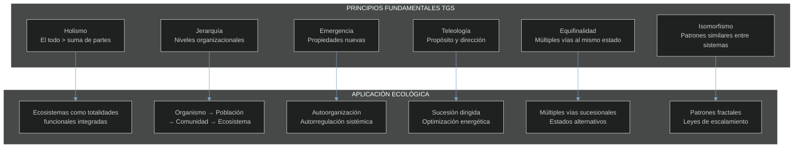
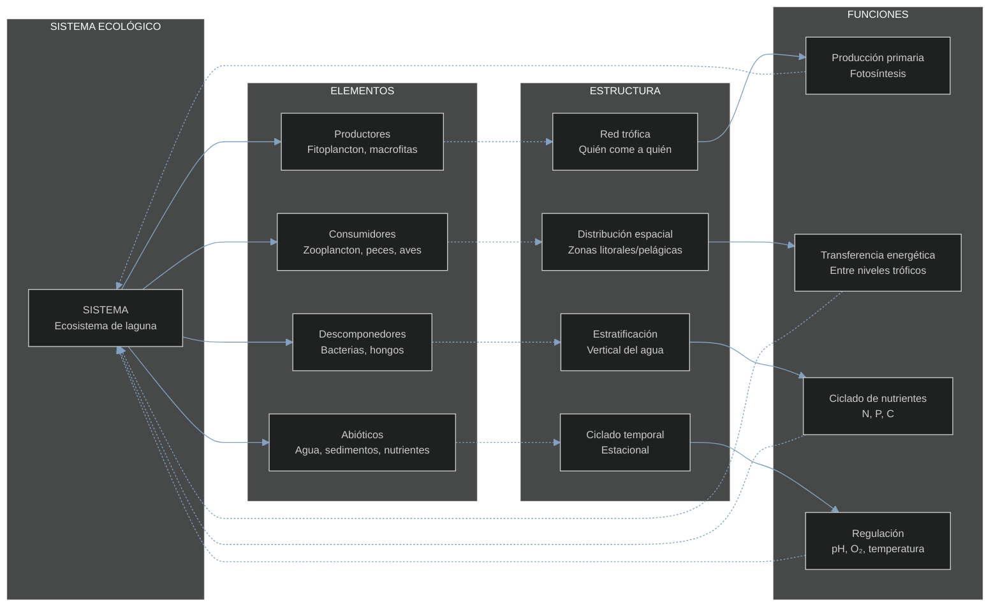
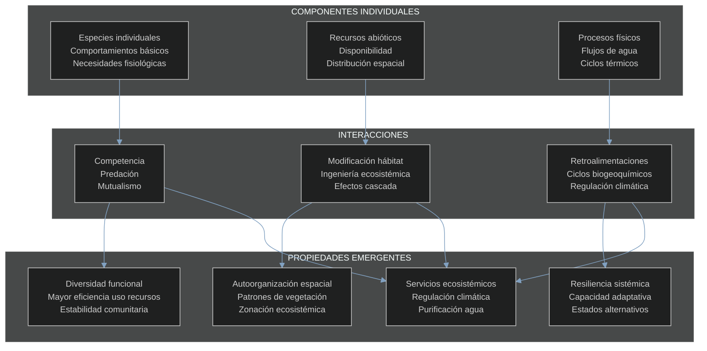
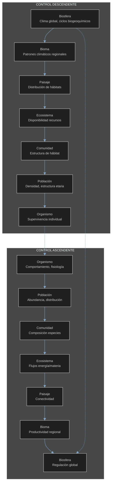
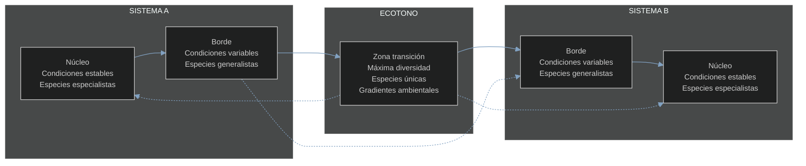
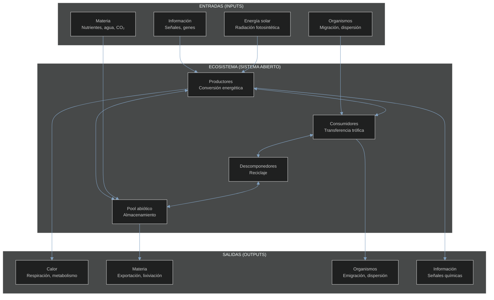
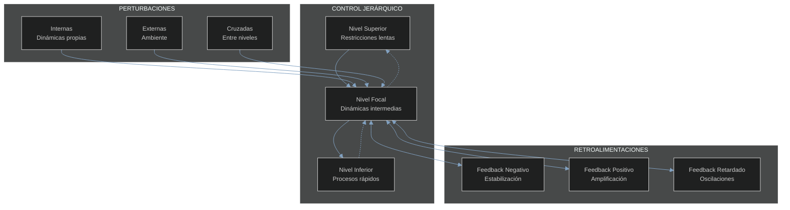

# 1.2 Teoría General de Sistemas Aplicada a la Ecología

## Fundamentos de la Teoría General de Sistemas

La **Teoría General de Sistemas** (TGS), desarrollada por Ludwig von Bertalanffy en los años 1940-1950, proporciona el marco conceptual fundamental para entender sistemas complejos en todas las disciplinas científicas. Su aplicación a la ecología ha revolucionado nuestra comprensión de los fenómenos ecológicos como manifestaciones de sistemas dinámicos interconectados.

### Principios Fundamentales de la TGS



## Conceptos Básicos: Sistema, Elemento, Estructura, Función

### Definiciones Fundamentales

| Concepto | Definición | Ejemplo Ecológico | Propiedades Clave |
|----------|------------|-------------------|-------------------|
| **Sistema** | Conjunto organizado de elementos interrelacionados que funcionan como totalidad | Bosque templado | Límites definidos<br/>Propósito específico<br/>Comportamiento emergente |
| **Elemento** | Componentes individuales del sistema | Especies, individuos, recursos abióticos | Funciones específicas<br/>Interacciones múltiples<br/>Propiedades inherentes |
| **Estructura** | Patrón de organización y relaciones entre elementos | Redes tróficas, distribución espacial | Estabilidad relativa<br/>Jerarquía<br/>Conectividad |
| **Función** | Procesos y actividades que mantienen el sistema | Flujo energético, ciclos de nutrientes | Dinámicas temporales<br/>Eficiencia<br/>Retroalimentación |

### Relaciones Sistema-Elemento-Estructura-Función



## Propiedades Emergentes de los Sistemas

### Características de la Emergencia

Las **propiedades emergentes** son características que surgen de la interacción entre elementos del sistema y que no pueden predecirse estudiando los componentes individualmente. En ecología, estas propiedades son fundamentales para entender el comportamiento de los ecosistemas.

### Tipos de Emergencia en Sistemas Ecológicos

| Tipo de Emergencia | Definición | Ejemplos Ecológicos | Nivel de Complejidad |
|-------------------|------------|---------------------|---------------------|
| **Débil** | Propiedades predecibles desde componentes | Biomasa total de un ecosistema | Aditiva |
| **Fuerte** | Propiedades impredecibles, requieren interacciones | Autoorganización en enjambres | Sinérgica |
| **Radical** | Propiedades que cambian las reglas del sistema | Transiciones de estado ecosistémico | Transformativa |

### Mecanismos de Emergencia

**Fórmula de Emergencia Sistémica**:
```
E = f(C₁, C₂, ..., Cₙ, I₁₂, I₁₃, ..., Iₙₘ)
```
Donde:
- E = propiedad emergente
- C = componentes individuales  
- I = interacciones entre componentes

**Umbral de Emergencia**:
```
E_threshold = Σ(Cᵢ × Iᵢⱼ) > K
```
Donde K es el umbral crítico para la emergencia

### Ejemplos de Propiedades Emergentes



## Jerarquía de Sistemas Ecológicos

### Niveles de Organización Biológica

La jerarquía ecológica representa diferentes niveles de organización, cada uno con propiedades emergentes específicas y escalas espacio-temporales características.

| Nivel | Escala Espacial | Escala Temporal | Propiedades Emergentes | Procesos Dominantes |
|-------|----------------|-----------------|----------------------|-------------------|
| **Moléculas** | nm - μm | ns - ms | Estructura química | Reacciones enzimáticas |
| **Células** | μm - mm | ms - min | Metabolismo | Respiración, fotosíntesis |
| **Organismos** | mm - m | min - años | Comportamiento, fisiología | Crecimiento, reproducción |
| **Poblaciones** | m - km | días - décadas | Dinámicas poblacionales | Natalidad, mortalidad, dispersión |
| **Comunidades** | m - km | años - siglos | Diversidad, estructura trófica | Competencia, predación |
| **Ecosistemas** | km - 10³ km | décadas - milenios | Flujos energía/materia | Productividad, ciclado |
| **Paisajes** | 10² - 10⁴ km | siglos - milenios | Heterogeneidad espacial | Conectividad, fragmentación |
| **Biomas** | 10³ - 10⁵ km | milenios | Adaptaciones climáticas | Evolución, especiación |
| **Biosfera** | Global | Millones años | Regulación planetaria | Ciclos globales, clima |

### Teoría Jerárquica de Sistemas



### Principios Jerárquicos

**Principio de Anidamiento**:
```
Sistema(n) ⊃ Sistema(n-1) ⊃ ... ⊃ Sistema(1)
```

**Ley de Escala de Velocidad**:
```
v = k × M^(-α)
```
Donde: v = velocidad del proceso, M = masa del sistema, α ≈ 0.25

## Límites y Fronteras de Sistemas

### Tipos de Límites Sistémicos

| Tipo de Límite | Características | Ejemplos Ecológicos | Permeabilidad |
|----------------|----------------|---------------------|---------------|
| **Físicos** | Barreras geográficas tangibles | Cordilleras, océanos, ríos | Baja-Media |
| **Ecotónicos** | Zonas de transición gradual | Ecotonos bosque-pradera | Media-Alta |
| **Funcionales** | Definidos por procesos | Cuenca hidrográfica | Variable |
| **Conceptuales** | Definidos por el investigador | Parcelas de estudio | Artificial |
| **Temporales** | Cambios en el tiempo | Estaciones, ciclos | Cíclica |

### Permeabilidad de Fronteras

**Índice de Permeabilidad**:
```
P = (F_entrada + F_salida) / (E_interno)
```
Donde:
- F = flujos a través de la frontera
- E = energía/materia interna del sistema

### Efectos de Borde



**Profundidad del Efecto de Borde**:
```
d = k × √A
```
Donde: d = profundidad, A = área del sistema, k = constante específica del sistema

## Sistemas Abiertos, Cerrados y Aislados

### Clasificación Termodinámica

| Tipo de Sistema | Intercambio de Materia | Intercambio de Energía | Ejemplos Ecológicos | Características |
|----------------|----------------------|----------------------|-------------------|----------------|
| **Aislado** | No | No | Ninguno (teórico) | Entropía máxima<br/>Estado final estático |
| **Cerrado** | No | Sí | Terrario sellado<br/>Ecosistemas en botellas | Entropía aumenta<br/>Estados estacionarios |
| **Abierto** | Sí | Sí | Todos los ecosistemas naturales | Entropía puede disminuir<br/>Estados dinámicos |

### Ecosistemas como Sistemas Abiertos

**Balance de Masa**:
```
dM/dt = I - O - R
```
Donde:
- M = masa del sistema
- I = entradas (inputs)
- O = salidas (outputs)  
- R = reacciones internas

**Balance de Energía**:
```
dE/dt = Ein - Eout - Eresp - Ealmac
```
Donde:
- E = energía del sistema
- Ein = energía entrante (solar, alimento)
- Eout = energía saliente (calor, biomasa)
- Eresp = respiración
- Ealmac = almacenamiento

### Flujos en Sistemas Abiertos



## Teoremas Fundamentales de Sistemas Aplicados a la Ecología

### Teorema de Incompletitud de Gödel en Ecología

Ningún sistema ecológico puede ser completamente descrito desde dentro del propio sistema. Siempre se requiere una perspectiva externa (nivel jerárquico superior) para comprender completamente el sistema.

**Aplicación ecológica**: Una población no puede entenderse completamente sin considerar la comunidad de la cual forma parte.

### Principio de Equifinalidad

**Definición**: Diferentes condiciones iniciales pueden llevar al mismo estado final en sistemas abiertos.

**Fórmula de Equifinalidad**:
```
lim(t→∞) S(x₀,t) = S* ∀x₀ ∈ D
```
Donde S* es el estado final independiente de las condiciones iniciales x₀

**Aplicación ecológica**: Diferentes caminos sucesionales pueden llevar al mismo clímax.

### Principio de Multifinalidad

Estados iniciales similares pueden llevar a estados finales diferentes dependiendo de las condiciones del sistema.

**Aplicación ecológica**: Estados alternativos estables en ecosistemas.

### Ley de Variedad Requerida (Ashby)

**Enunciado**: Solo la variedad puede absorber variedad.

**Aplicación ecológica**: La estabilidad de un ecosistema requiere diversidad funcional proporcional a la variabilidad ambiental.

```
Diversidad_funcional ≥ Variabilidad_ambiental
```

## Retroalimentación y Control en Sistemas Ecológicos

### Tipos de Retroalimentación

| Tipo | Efecto | Estabilidad | Ejemplos Ecológicos |
|------|--------|-------------|-------------------|
| **Negativa** | Reduce desviaciones | Estabilizadora | Control poblacional<br/>Autorregulación |
| **Positiva** | Amplifica desviaciones | Desestabilizadora | Explosiones poblacionales<br/>Eutrofización |
| **Retardada** | Efectos diferidos | Variable | Ciclos predador-presa |

### Ecuaciones de Retroalimentación

**Retroalimentación Negativa**:
```
dx/dt = -kx + f(t)
```

**Retroalimentación Positiva**:
```
dx/dt = +kx + f(t)
```

**Sistema con Retroalimentación Múltiple**:
```
dx/dt = α₁f₁(x) + α₂f₂(x) + ... + αₙfₙ(x)
```

### Modelo Conceptual de Control Sistémico



## Aplicaciones Prácticas de la TGS en Ecología

### Diseño de Estudios Ecológicos Sistémicos

**Principios de Diseño**:

1. **Identificación de límites del sistema**
2. **Definición de niveles jerárquicos relevantes**
3. **Mapeo de flujos de entrada y salida**
4. **Identificación de retroalimentaciones clave**
5. **Análisis de escalas espacio-temporales**

### Aplicaciones en Gestión Ecosistémica

| Aplicación | Principios TGS Utilizados | Herramientas | Resultados |
|------------|---------------------------|--------------|------------|
| **Restauración** | Equifinalidad, emergencia | Modelos de referencia | Estados deseados múltiples |
| **Conservación** | Jerarquía, retroalimentación | Diseño de reservas | Conectividad sistémica |
| **Manejo Adaptativo** | Sistemas abiertos, control | Monitoreo continuo | Gestión flexible |
| **Evaluación Impacto** | Límites, permeabilidad | Análisis multiescala | Efectos sistémicos |

## Ejercicios Prácticos

### Ejercicio 1: Análisis de Sistemas
**Objetivo**: Aplicar conceptos de TGS a un ecosistema local.

**Pasos**:
1. Seleccionar un ecosistema (ej: parque urbano)
2. Identificar elementos, estructura y funciones
3. Definir límites del sistema
4. Mapear entradas y salidas
5. Identificar retroalimentaciones

### Ejercicio 2: Jerarquía de Escalas
**Objetivo**: Analizar un fenómeno ecológico en múltiples escalas.

**Ejemplo**: Decline de polinizadores
- **Organismo**: Fisiología de abejas individuales
- **Población**: Dinámicas de colonias
- **Comunidad**: Redes planta-polinizador
- **Ecosistema**: Servicios de polinización
- **Paisaje**: Fragmentación de hábitat

### Ejercicio 3: Modelado de Retroalimentaciones
**Objetivo**: Construir un modelo conceptual de retroalimentaciones.

**Sistema**: Pastizal con herbívoros
```
Vegetación → Herbívoros → Presión pastoreo → Vegetación
```

## Herramientas Matemáticas y Computacionales

### Software Recomendado

| Herramienta | Aplicación | Ventajas | Limitaciones |
|-------------|------------|----------|--------------|
| **Vensim** | Dinámica de sistemas | Interface intuitiva | Licencia comercial |
| **Stella** | Modelado sistémico | Educativo | Limitado para análisis complejos |
| **R (DiagrammeR)** | Diagramas de sistemas | Gratuito, flexible | Curva de aprendizaje |
| **Python (NetworkX)** | Análisis de redes | Potente, extensible | Requiere programación |

### Fórmulas Clave para Aplicar

**Índice de Conectividad**:
```
C = 2L / (N(N-1))
```
Donde: L = enlaces, N = nodos

**Índice de Modularidad**:
```
Q = (1/2m) Σ(Aᵢⱼ - kᵢkⱼ/2m)δ(cᵢ,cⱼ)
```
Donde: m = total enlaces, A = matriz adyacencia, k = grado

**Entropía del Sistema**:
```
H = -Σ pᵢ log pᵢ
```
Donde: pᵢ = probabilidad del estado i

## Limitaciones y Críticas de la TGS en Ecología

### Limitaciones Teóricas

| Limitación | Descripción | Impacto en Ecología |
|------------|-------------|-------------------|
| **Complejidad excesiva** | Sistemas muy complejos para modelar | Modelos simplificados |
| **Fronteras artificiales** | Límites impuestos por el investigador | Sesgos en el análisis |
| **Escalas temporales** | Procesos en diferentes escalas | Dificultad integración |
| **No linealidad** | Comportamientos impredecibles | Predicción limitada |

### Críticas Metodológicas

**Reduccionismo oculto**: Riesgo de simplificar excesivamente las interacciones complejas.

**Determinismo sistémico**: Tendencia a buscar patrones deterministas en sistemas estocásticos.

**Antropocentrismo**: Imposición de conceptos humanos de "propósito" a sistemas naturales.

## Desarrollos Contemporáneos

### Teoría de Redes Complejas
Aplicación de teoría de grafos y redes complejas para entender conectividad ecosistémica.

### Sistemas Adaptativos Complejos (CAS)
Integración de adaptación, aprendizaje y evolución en el marco sistémico.

### Criticalidad Auto-Organizada (SOC)
Estados críticos que emergen naturalmente en sistemas ecológicos.

### Big Data y Ecoinformática
Uso de grandes volúmenes de datos para entender patrones sistémicos.

## Lecturas Recomendadas

### Textos Fundamentales
- von Bertalanffy, L. (1968). *General System Theory*
- Odum, H.T. (1994). *Ecological and General Systems*
- Kay, J.J. et al. (1999). *Ecosystems as self-organizing systems*

### Aplicaciones Contemporáneas
- Levin, S.A. (1998). *Ecosystems and the biosphere as complex adaptive systems*
- Ulanowicz, R.E. (2009). *A Third Window: Natural Life beyond Newton and Darwin*
- Fath, B.D. (2017). *Systems ecology, energy networks, and a path to sustainability*

### Artículos Clave
- O'Neill, R.V. et al. (1986). A hierarchical concept of ecosystems
- Holling, C.S. (2001). Understanding the complexity of economic, ecological, and social systems
- Levin, S.A. (1992). The problem of pattern and scale in ecology
