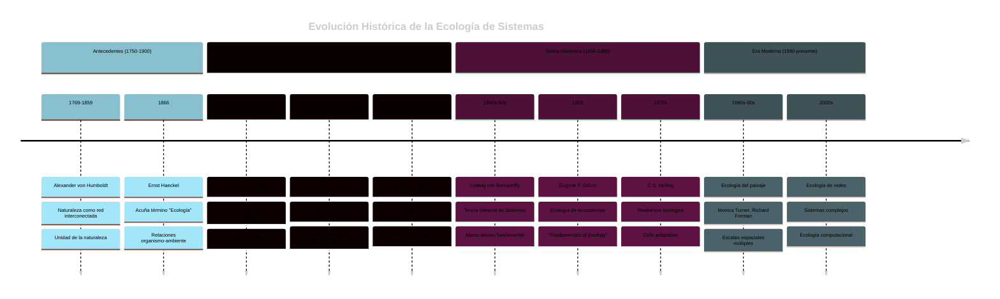
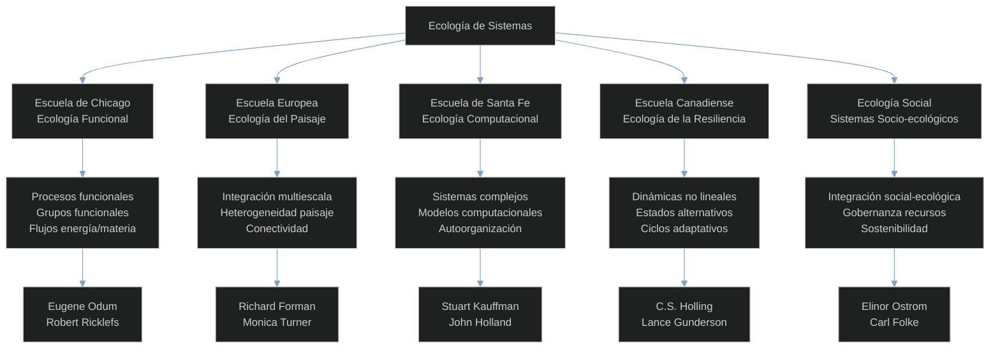
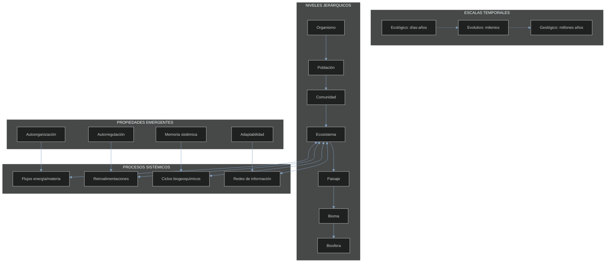

# 1.1 Introducción a la Ecología de Sistemas

## Definición y Alcance

La **ecología de sistemas** es una disciplina científica que estudia los ecosistemas como sistemas complejos, integrados e interconectados, enfocándose en las relaciones, procesos y propiedades emergentes que surgen de las interacciones entre componentes bióticos y abióticos. A diferencia de los enfoques reduccionistas tradicionales, la ecología de sistemas adopta una perspectiva holística que reconoce que "el todo es mayor que la suma de sus partes".

### Características Fundamentales

**Enfoque Holístico**: Los sistemas ecológicos se estudian como totalidades funcionales, donde las propiedades del sistema no pueden entenderse completamente analizando solo sus componentes individuales.

**Interconectividad**: Se reconoce que todos los elementos del sistema están interconectados a través de múltiples niveles de organización, desde moléculas hasta la biosfera.

**Propiedades Emergentes**: Los sistemas ecológicos exhiben características y comportamientos que emergen de las interacciones complejas entre sus componentes y que no están presentes en los elementos individuales.

**Múltiples Escalas**: Los fenómenos ecológicos ocurren simultáneamente en diferentes escalas espaciales y temporales, requiriendo enfoques de análisis multiescala.

### Alcance de Aplicación

La ecología de sistemas se aplica a diversos niveles de organización:

- **Organismos individuales** como sistemas integrados
- **Poblaciones** y sus dinámicas sistémicas
- **Comunidades** como redes de interacciones
- **Ecosistemas** locales y regionales
- **Paisajes** y sus mosaicos de hábitats
- **Biomas** y patrones biogeográficos
- **Biosfera** como sistema global

## Historia y Evolución del Pensamiento Sistémico en Ecología



### Cronología de Desarrollos Clave

| Período | Desarrollos Principales | Conceptos Introducidos | Impacto |
|---------|------------------------|------------------------|---------|
| **1750-1850** | Naturalismo integral | Interconexiones naturales<br/>Geografía de plantas<br/>Climatología | Base conceptual del holismo |
| **1850-1920** | Ecología fundacional | Ecosistema (prototipo)<br/>Sucesión<br/>Comunidades | Unidades de estudio sistémicas |
| **1920-1950** | Cuantificación | Pirámides energéticas<br/>Cadenas tróficas<br/>Productividad | Herramientas de análisis |
| **1950-1970** | Sistematización | Teoría de sistemas<br/>Cibernética ecológica<br/>Homeostasis | Marco teórico consolidado |
| **1970-1990** | Complejidad | Estabilidad vs. complejidad<br/>Caos determinista<br/>Fractales | Dinámicas no lineales |
| **1990-2010** | Integración espacial | Ecología del paisaje<br/>Metapoblaciones<br/>SIG ecológicos | Escalas múltiples |
| **2010-presente** | Era digital | Big data ecológico<br/>IA en ecología<br/>Redes complejas | Nuevas capacidades analíticas |

## Diferencias con la Ecología Tradicional

| Aspecto | Ecología Tradicional (Reduccionista) | Ecología de Sistemas (Holística) |
|---------|--------------------------------------|-----------------------------------|
| **Metodología** | Componentes individuales aislados<br>Análisis causa-efecto lineal<br>Variables controladas<br>Simplificación experimental | Sistemas completos integrados<br>Redes causales complejas<br>Estudios de campo a largo plazo<br>Aceptación de la complejidad |
| **Perspectiva Conceptual** | Especies como unidades independientes<br>Relaciones bidireccionales simples<br>Equilibrio como norma<br>Determinismo ambiental | Redes interconectadas<br>Múltiples retroalimentaciones<br>Dinámicas no lineales<br>Autoorganización y emergencia |
| **Escalas de Estudio** | Escalas específicas<br>Separación de niveles<br>Estudios de corto plazo<br>Espacialmente limitados | Integración multiescala<br>Jerarquías anidadas<br>Procesos de largo plazo<br>Patrones espaciales complejos |
| **Predictibilidad** | Alta (modelos deterministas) | Limitada (sistemas complejos) |
| **Aplicabilidad** | Laboratorio y condiciones controladas | Campo y sistemas reales |

## Paradigmas: Reduccionista vs. Holístico

### Paradigma Reduccionista

**Principios Fundamentales**:
- Los sistemas pueden entenderse descomponiéndolos en partes
- El comportamiento del todo es la suma de las partes
- Causalidad lineal y unidireccional
- Predictibilidad basada en leyes simples

**Aplicación en Ecología**:
- Estudio de especies individuales
- Experimentos controlados de laboratorio
- Modelos matemáticos simples
- Búsqueda de leyes generales

**Ventajas**:
- Precisión metodológica
- Replicabilidad experimental
- Cuantificación exacta
- Desarrollo de teorías específicas

**Limitaciones**:
- Pérdida de propiedades emergentes
- Ignorancia de interacciones complejas
- Resultados poco aplicables a sistemas reales
- Fragmentación del conocimiento

### Paradigma Holístico

**Principios Fundamentales**:
- Los sistemas tienen propiedades emergentes
- El todo es mayor que la suma de las partes
- Causalidad circular y multidireccional
- Complejidad inherente e irreducible

**Aplicación en Ecología**:
- Estudio de ecosistemas completos
- Investigación de campo integrada
- Modelos de sistemas complejos
- Búsqueda de patrones generales

**Ventajas**:
- Comprensión de propiedades emergentes
- Relevancia para sistemas reales
- Integración del conocimiento
- Aplicabilidad práctica

**Limitaciones**:
- Mayor dificultad metodológica
- Menor precisión predictiva
- Complejidad analítica
- Desafíos en la replicación

## Principales Escuelas y Enfoques



### Características Detalladas por Escuela

| Escuela | Enfoque Principal | Metodologías Clave | Aplicaciones | Representantes |
|---------|-------------------|---------------------|--------------|----------------|
| **Chicago** | Procesos funcionales | Análisis de flujos energéticos<br/>Clasificación funcional<br/>Productividad ecosistémica | Gestión de recursos<br/>Agricultura sostenible<br/>Conservación | Eugene Odum<br/>Robert Ricklefs<br/>Peter Vitousek |
| **Europea** | Heterogeneidad espacial | SIG y teledetección<br/>Análisis de paisaje<br/>Modelos espaciales | Planificación territorial<br/>Corredores biológicos<br/>Fragmentación | Richard Forman<br/>Monica Turner<br/>Almo Farina |
| **Santa Fe** | Sistemas complejos | Modelos basados en agentes<br/>Teoría de redes<br/>Simulación computacional | Predicción ecológica<br/>Diseño de experimentos<br/>Teoría ecológica | Stuart Kauffman<br/>John Holland<br/>Simon Levin |
| **Canadiense** | Resiliencia y adaptación | Análisis de escenarios<br/>Modelado dinámico<br/>Gestión adaptativa | Manejo de crisis<br/>Restauración<br/>Cambio climático | C.S. Holling<br/>Lance Gunderson<br/>Brian Walker |
| **Social** | Acoplamiento socio-ecológico | Investigación participativa<br/>Análisis institucional<br/>Métodos mixtos | Política ambiental<br/>Desarrollo sostenible<br/>Gobernanza | Elinor Ostrom<br/>Carl Folke<br/>Fikret Berkes |

## Conceptos Clave para el Desarrollo Posterior

### Ecuaciones Fundamentales de la Ecología de Sistemas

**Ley de Conservación de Masa (Principio de Continuidad)**:
```
∂ρ/∂t + ∇·(ρv) = S
```
Donde: ρ = densidad, v = velocidad, S = fuentes/sumideros

**Eficiencia de Transferencia Trófica (Lindeman)**:
```
TE = (Pₙ₊₁/Pₙ) × 100%
```
Donde: TE = eficiencia de transferencia, P = productividad del nivel trófico

**Índice de Estabilidad de May**:
```
σ√(SC) < 1
```
Donde: σ = fuerza promedio de interacción, S = especies, C = conectividad

**Resiliencia Ecológica**:
```
R = -λ
```
Donde: R = resiliencia, λ = eigenvalor dominante (valor propio real más negativo)

### Marco Conceptual Integrado



### Propiedades Emergentes Clave

| Propiedad | Definición | Ejemplo Ecológico | Nivel de Emergencia |
|-----------|------------|-------------------|-------------------|
| **Autoorganización** | Formación espontánea de patrones ordenados sin control externo | Bandadas de aves, formación de parches vegetales | Población → Comunidad |
| **Autorregulación** | Mantenimiento de condiciones internas mediante retroalimentación | Homeostasis poblacional, regulación de pH del suelo | Ecosistema |
| **Memoria sistémica** | Retención de información sobre estados y eventos pasados | Legado de perturbaciones, banco de semillas | Comunidad → Ecosistema |
| **Adaptabilidad** | Capacidad de modificar estructura/función ante cambios | Plasticidad fenotípica comunitaria, sucesión | Múltiples niveles |
| **Resiliencia** | Capacidad de absorber perturbaciones manteniendo función | Recuperación post-disturbio, estados alternativos | Ecosistema → Paisaje |

## Relevancia Actual y Futura

La ecología de sistemas es cada vez más relevante debido a:

**Crisis Ambiental Global**: Los problemas ambientales actuales (cambio climático, pérdida de biodiversidad, contaminación) requieren enfoques sistémicos para su comprensión y solución.

**Desarrollo Tecnológico**: Nuevas tecnologías permiten estudiar sistemas complejos con mayor detalle y precisión.

**Necesidades de Gestión**: La gestión efectiva de recursos naturales requiere comprensión sistémica de los ecosistemas.

**Integración Interdisciplinaria**: La solución de problemas complejos requiere integración entre disciplinas científicas y sociales.

## Ejercicios de Reflexión

1. **Análisis Comparativo**: Identifica un ejemplo de investigación ecológica reciente y analiza cómo sería abordado desde una perspectiva reduccionista versus una perspectiva sistémica.

2. **Evolución Conceptual**: Traza la evolución de un concepto ecológico (como "comunidad" o "ecosistema") desde sus orígenes reduccionistas hasta su interpretación sistémica actual.

3. **Aplicación Práctica**: Selecciona un problema ambiental local y describe cómo un enfoque sistémico podría proporcionar una comprensión más completa que enfoques tradicionales.

4. **Integración Histórica**: Investiga cómo los avances en otras disciplinas (física, matemáticas, ciencias de la computación) han influenciado el desarrollo de la ecología de sistemas.

## Lecturas Recomendadas

### Textos Fundamentales
- Odum, E.P. (1971). *Fundamentals of Ecology* (3rd edition)
- Holling, C.S. (1973). Resilience and stability of ecological systems
- O'Neill, R.V. et al. (1986). *A Hierarchical Concept of Ecosystems*

### Textos Contemporáneos
- Levin, S.A. (1999). *Fragile Dominion: Complexity and the Commons*
- Gunderson, L.H. & Holling, C.S. (2002). *Panarchy*
- Turner, M.G. et al. (2001). *Landscape Ecology in Theory and Practice*

### Artículos Clave
- Tansley, A.G. (1935). The use and abuse of vegetational concepts and terms
- Lindeman, R.L. (1942). The trophic-dynamic aspect of ecology
- May, R.M. (1973). Stability and complexity in model ecosystems