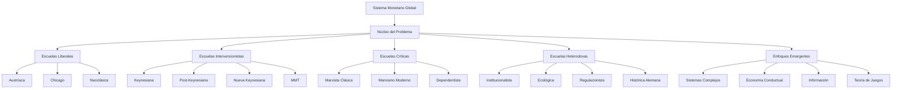

# Análisis Crítico del Sistema Monetario Global: Marco Teórico Comprehensivo

## Mapa Conceptual Expandido de las Escuelas Económicas

## I. El Problema Central: Desarticulación Sistémica

### Síntomas Empíricos Observables

1. **Desconexión valor-precio**: Los precios financieros han perdido correlación sistemática con fundamentos económicos reales
2. **Concentración extrema de riqueza**: El coeficiente Gini global se aproxima a niveles históricamente críticos
3. **Volatilidad sistémica creciente**: Las crisis financieras muestran mayor frecuencia y severidad desde 1971
4. **Capacidad productiva subutilizada**: Coexistencia de recursos ociosos con necesidades insatisfechas masivas
5. **Financiarización acelerada**: Los activos financieros han crecido exponencialmente respecto al PIB global

### Preguntas Teóricas Fundamentales

- ¿Es el sistema monetario causa o síntoma de desigualdades estructurales?
- ¿Qué grado de control consciente existe sobre las dinámicas monetarias globales?
- ¿Son las restricciones sistémicas técnicas, políticas o inherentes al diseño capitalista?
- ¿Existen alternativas viables dentro del marco institucional actual?

## II. Escuelas Liberales: El Mercado Como Mecanismo Óptimo

### Escuela Austríaca

**Exponentes Fundamentales:**
- **Carl Menger** (1840-1921): "Principios de Economía Política" - Teoría subjetiva del valor
- **Eugen von Böhm-Bawerk** (1851-1914): "Teoría Positiva del Capital" - Análisis del interés
- **Ludwig von Mises** (1881-1973): "Teoría del Dinero y el Crédito" - Crítica al dinero fiat
- **Friedrich Hayek** (1899-1992): "Desnacionalización del Dinero" - Competencia monetaria
- **Murray Rothbard** (1926-1995): "El Misterio de la Banca" - Crítica radical al banco central
- **Jesús Huerta de Soto** (1956-): "Dinero, Crédito Bancario y Ciclos Económicos"

**Diagnóstico:**
- El dinero fiat es intrínsecamente inflacionario y distorsiona el cálculo económico
- Los bancos centrales generan ciclos artificiales de auge y recesión
- La intervención estatal corrompe el orden espontáneo del mercado
- El problema es político (poder estatal), no técnico

**Solución:**
- Retorno al patrón oro o monedas competitivas
- Eliminación de bancos centrales
- Banca libre con reserva 100%
- Minimización del rol estatal

**Fortalezas Analíticas:**
- Explicación coherente de la inflación como fenómeno monetario
- Crítica sólida a las distorsiones del intervencionismo
- Enfoque en consecuencias no-intencionadas de políticas
- Metodología individualista consistente

**Limitaciones Críticas:**
- Ignora el rol constitutivo del Estado en la creación de mercados
- Subestima las fallas de mercado y asimetrías de poder
- El patrón oro históricamente amplificó crisis (1873, 1929)
- Asume racionalidad perfecta empíricamente refutada

### Escuela de Chicago

**Exponentes Fundamentales:**
- **Frank Knight** (1885-1972): "Riesgo, Incertidumbre y Beneficio" - Distinción riesgo/incertidumbre
- **Milton Friedman** (1912-2006): "Una Historia Monetaria de Estados Unidos" - Monetarismo
- **Gary Becker** (1930-2014): "Teoría Económica" - Aplicación del análisis económico
- **Robert Lucas Jr.** (1937-): "Expectativas Racionales" - Nueva Macroeconomía Clásica
- **Eugene Fama** (1939-): "Mercados Eficientes" - Hipótesis de mercados eficientes
- **Richard Posner** (1939-): "Análisis Económico del Derecho"

**Diagnóstico:**
- Los mercados procesan información eficientemente si no son distorsionados
- Los problemas monetarios surgen de políticas discrecionales errática
- La inflación es "siempre y en todas partes un fenómeno monetario"
- Las crisis reflejan rigideces institucionales, no fallas de mercado

**Solución:**
- Reglas monetarias fijas (regla k% de Friedman)
- Desregulación financiera
- Flexibilización de precios y salarios
- Independencia de bancos centrales

**Fortalezas Analíticas:**
- Rigor matemático y evidencia econométrica
- Integración de expectativas racionales en modelos
- Explicación de stagflación de los 70s
- Influencia práctica en política económica

**Limitaciones Críticas:**
- Hipótesis de mercados eficientes refutada empíricamente
- Subestima la inestabilidad inherente de mercados financieros
- Ignora el poder de mercado y concentración oligopólica
- Metodología excesivamente reduccionista

### Neoclásica Mainstream

**Exponentes Fundamentales:**
- **Léon Walras** (1834-1910): "Elementos de Economía Política Pura" - Equilibrio general
- **Alfred Marshall** (1842-1924): "Principios de Economía" - Síntesis neoclásica
- **Paul Samuelson** (1915-2009): "Fundamentos del Análisis Económico" - Formalización matemática
- **Kenneth Arrow** (1921-2017): "Equilibrio General y Bienestar" - Teoremas fundamentales
- **Gérard Debreu** (1921-2004): "Teoría del Valor" - Existencia del equilibrio
- **Robert Solow** (1924-): "Modelo de Crecimiento" - Teoría del crecimiento neoclásica

**Diagnóstico:**
- Los mercados tienden hacia equilibrios eficientes bajo condiciones ideales
- Las desviaciones reflejan fricciones temporales o fallas de información
- El dinero es neutral a largo plazo
- Las crisis son shocks exógenos o rigideces nominales

**Solución:**
- Eliminación de rigideces de precios
- Mejora en flujos de información
- Políticas contracíclicas limitadas
- Confianza en mecanismos de mercado

**Fortalezas Analíticas:**
- Coherencia lógica interna
- Tractabilidad matemática
- Predicciones testables
- Base teórica para política económica

**Limitaciones Críticas:**
- Supuestos irrealistas (racionalidad perfecta, información completa)
- Incapacidad para predecir crisis sistémicas
- Ignora instituciones y relaciones de poder
- Metodología excesivamente abstracta

## III. Escuelas Intervencionistas: El Estado Como Corrector

### Keynesianismo Clásico

**Exponentes Fundamentales:**
- **John Maynard Keynes** (1883-1946): "Teoría General del Empleo, el Interés y el Dinero"
- **John Hicks** (1904-1989): "Modelo IS-LM" - Formalización keynesiana
- **Alvin Hansen** (1887-1975): "Estancamiento Secular" - Síntesis neoclásica-keynesiana
- **Paul Samuelson** (1915-2009): "Síntesis Neoclásica"
- **Franco Modigliani** (1918-2003): "Teorema Modigliani-Miller"
- **James Tobin** (1918-2002): "Teoría de Carteras" - Q de Tobin

**Diagnóstico:**
- Los mercados pueden permanecer en equilibrios subóptimos indefinidamente
- La demanda agregada insuficiente genera desempleo persistente
- Los "animal spirits" causan volatilidad no-racional
- El dinero no es neutral ni siquiera a largo plazo

**Solución:**
- Política fiscal contracíclica
- Gestión de demanda agregada
- Regulación financiera
- Pleno empleo como objetivo de política

### Post-Keynesianismo

**Exponentes Fundamentales:**
- **Michał Kalecki** (1899-1970): "Teoría de la Dinámica Económica" - Precedió a Keynes
- **Joan Robinson** (1903-1983): "Acumulación de Capital" - Crítica al equilibrio
- **Nicholas Kaldor** (1908-1986): "Crecimiento y Distribución"
- **Hyman Minsky** (1919-1996): "Estabilizando una Economía Inestable"
- **Steve Keen** (1953-): "Debunking Economics" - Crítica mathematical al equilibrio
- **Randall Wray** (1953-): "Dinero y Crédito en Economías Capitalistas"

**Diagnóstico:**
- La inestabilidad es endógena al capitalismo financiarizado
- Los ciclos de deuda privada impulsan fluctuaciones económicas
- La incertidumbre fundamental hace imposible el cálculo probabilístico
- El tiempo y la historia importan - no hay tendencia al equilibrio

**Solución:**
- Regulación financiera estricta
- Política de ingresos
- Inversión pública directa
- Control de capitales

**Fortalezas Analíticas:**
- Predicción exitosa de la crisis de 2008
- Modelos dinámicos con retroalimentación
- Integración de instituciones financieras
- Realismo sobre comportamiento empresarial

**Limitaciones Críticas:**
- Subdesarrollo de alternativas sistémicas
- Foco excesivo en países desarrollados
- Minimiza dimensiones de poder de clase
- Soluciones reformistas dentro del capitalismo

### Nueva Economía Keynesiana

**Exponentes Fundamentales:**
- **Joseph Stiglitz** (1943-): "Información Asimétrica y Mercados"
- **Paul Krugman** (1953-): "Geografía Económica y Comercio Internacional"
- **Ben Bernanke** (1953-): "Acelerador Financiero"
- **Olivier Blanchard** (1948-): "Macroeconomía" - Libro de texto estándar
- **Greg Mankiw** (1958-): "Nueva Síntesis Keynesiana"
- **Janet Yellen** (1946-): "Teoría de Eficiencia Salarial"

**Diagnóstico:**
- Las rigideces nominales y reales impiden ajustes de mercado
- Las imperfecciones de información generan fallas de mercado
- Los shocks de demanda tienen efectos reales persistentes
- Los mercados financieros amplifican ciclos económicos

**Solución:**
- Política monetaria con objetivos de inflación
- Estabilización macroeconómica activa
- Regulación prudencial
- Redes de seguridad social

### Teoría Monetaria Moderna (MMT)

**Exponentes Fundamentales:**
- **Abba Lerner** (1903-1982): "Finanzas Funcionales" - Precursor teórico
- **Georg Friedrich Knapp** (1842-1926): "Teoría Estatal del Dinero" - Chartalismo
- **Warren Mosler** (1949-): "Soft Currency Economics"
- **Randall Wray** (1953-): "Comprensión del Dinero Moderno"
- **Stephanie Kelton** (1969-): "El Mito del Déficit"
- **Bill Mitchell** (1952-): "Macroeconomía" - Texto MMT
- **Pavlina Tcherneva** (1970-): "Garantía de Empleo"

**Diagnóstico:**
- El dinero es una criatura del Estado, no del mercado
- Los gobiernos con moneda soberana no enfrentan restricciones financieras
- El desempleo refleja déficit fiscal insuficiente
- La inflación es el único límite real al gasto público

**Solución:**
- Garantía de empleo público
- Déficits fiscales funcionales
- Coordinación fiscal-monetaria
- Inversión pública masiva

**Fortalezas Analíticas:**
- Descripción precisa de operaciones monetarias modernas
- Desmitifica conceptos de déficit y deuda
- Propone alternativas concretas de política
- Integra pleno empleo en marco teórico

**Limitaciones Críticas:**
- Subestima restricciones geopolíticas
- Minimiza capturas del Estado por élites
- Aplicabilidad limitada a países periféricos
- Ignora restricciones de clase y poder

## IV. Escuelas Críticas: Poder y Explotación

### Marxismo Clásico

**Exponentes Fundamentales:**
- **Karl Marx** (1818-1883): "El Capital" - Crítica de la economía política
- **Friedrich Engels** (1820-1895): "Anti-Dühring" - Economía política socialista
- **Vladimir Lenin** (1870-1924): "El Imperialismo, Fase Superior del Capitalismo"
- **Rosa Luxemburgo** (1871-1919): "La Acumulación del Capital"
- **Rudolf Hilferding** (1877-1941): "El Capital Financiero"
- **Nikolai Bukharin** (1888-1938): "Economía Mundial e Imperialismo"

**Diagnóstico:**
- El dinero es una relación social que oculta explotación
- El capital financiero es parasitario sobre la producción real
- Las crisis expresan contradicciones inherentes del capitalismo
- La concentración de capital es inevitable bajo la lógica de ganancia

**Solución:**
- Socialización de medios de producción
- Planificación económica consciente
- Abolición del sistema de salarios
- Revolución de la clase trabajadora

### Marxismo Moderno

**Exponentes Fundamentales:**
- **Paul Baran** (1910-1964): "Economía Política del Crecimiento"
- **Paul Sweezy** (1910-2004): "Capital Monopolista" - Coautor con Baran
- **Harry Magdoff** (1913-2006): "La Era del Imperialismo"
- **David Harvey** (1935-): "Los Límites del Capital" - Geografía marxista
- **Giovanni Arrighi** (1937-2009): "El Largo Siglo XX" - Análisis de sistemas-mundo
- **Michael Roberts** (1952-): "La Larga Depresión" - Marxismo contemporáneo
- **Anwar Shaikh** (1945-): "Capitalismo: Competencia, Conflicto, Crisis"

**Diagnóstico:**
- La financiarización refleja crisis de rentabilidad en producción real
- El imperialismo redistribuye plusvalía globalmente
- Las crisis son mecanismos de restauración de rentabilidad
- La desigualdad es funcional al mantenimiento de disciplina laboral

**Solución:**
- Transformación gradual de relaciones de producción
- Control democrático de inversión
- Reducción drástica de jornada laboral
- Planificación participativa

**Fortalezas Analíticas:**
- Marco histórico de largo plazo
- Análisis de clases sociales concretas
- Explicación de imperialismo y geopolítica
- Predicción de crisis de rentabilidad

**Limitaciones Críticas:**
- Dificultades para operacionalizar conceptos clave
- Subestima capacidades de adaptación del capitalismo
- Análisis insuficiente de países socialistas reales
- Alternativas sistémicas poco desarrolladas

### Escuela Dependentista

**Exponentes Fundamentales:**
- **Raúl Prebisch** (1901-1986): "El Desarrollo Económico de América Latina"
- **Celso Furtado** (1920-2004): "Desarrollo y Subdesarrollo"
- **Fernando Henrique Cardoso** (1931-): "Dependencia y Desarrollo"
- **André Gunder Frank** (1929-2005): "Capitalismo y Subdesarrollo en América Latina"
- **Theotonio Dos Santos** (1936-2018): "Teoría de la Dependencia"
- **Samir Amin** (1931-2018): "El Desarrollo Desigual"
- **Immanuel Wallerstein** (1930-2019): "El Sistema Mundial Moderno"

**Diagnóstico:**
- El sistema monetario internacional reproduce relaciones centro-periferia
- El dólar como moneda de reserva permite extracción de recursos
- Los términos de intercambio se deterioran sistemáticamente para la periferia
- El desarrollo y subdesarrollo son dos caras del mismo proceso

**Solución:**
- Desconexión selectiva del sistema mundial
- Moneda regional o canasta de monedas
- Industrialización por sustitución de importaciones
- Integración Sur-Sur

**Fortalezas Analíticas:**
- Análisis espacial del capitalismo mundial
- Explicación de persistencia del subdesarrollo
- Crítica al universalismo de teorías del Norte
- Marco para entender crisis de balanza de pagos

**Limitaciones Críticas:**
- Subestima dinámicas internas de países periféricos
- Análisis de clase insuficientemente desarrollado
- Soluciones nacionalistas problemáticas
- Dificultades para explicar industrialización asiática

## V. Escuelas Heterodoxas: Instituciones e Historia

### Institucionalismo Original

**Exponentes Fundamentales:**
- **Thorstein Veblen** (1857-1929): "Teoría de la Clase Ociosa"
- **John Commons** (1862-1945): "Economía Institucional"
- **Wesley Mitchell** (1874-1948): "Ciclos Económicos" - Análisis empírico
- **Clarence Ayres** (1891-1972): "Teoría del Progreso Económico"
- **Gunnar Myrdal** (1898-1987): "Teoría Económica y Regiones Subdesarrolladas"
- **John Kenneth Galbraith** (1908-2006): "El Nuevo Estado Industrial"
- **Karl Polanyi** (1886-1964): "La Gran Transformación"

**Diagnóstico:**
- Los mercados son construcciones institucionales históricamente específicas
- El poder corporativo distorsiona la competencia
- Las instituciones evolucionan más lentamente que la tecnología
- La economía está "incrustada" en relaciones sociales

**Solución:**
- Regulación de corporaciones
- Planificación democrática
- Instituciones que balanceen poder
- Coordinación tecnología-instituciones

### Neoinstitucionalismo

**Exponentes Fundamentales:**
- **Ronald Coase** (1910-2013): "La Naturaleza de la Empresa" - Costos de transacción
- **Douglas North** (1920-2015): "Instituciones, Cambio Institucional y Desarrollo"
- **Oliver Williamson** (1932-2020): "Economía de Costos de Transacción"
- **Elinor Ostrom** (1933-2012): "Gobierno de los Bienes Comunes"
- **Daron Acemoglu** (1967-): "Por Qué Fracasan las Naciones"
- **James Robinson** (1960-): "Instituciones Extractivas vs. Inclusivas"

**Diagnóstico:**
- Las instituciones determinan el desarrollo económico de largo plazo
- Los derechos de propiedad mal definidos generan ineficiencia
- El cambio institucional es lento y dependiente de la trayectoria
- Las élites pueden bloquear instituciones eficientes

**Solución:**
- Fortalecimiento de derechos de propiedad
- Reducción de costos de transacción
- Instituciones políticas inclusivas
- Gradualismo institucional

### Economía Ecológica

**Exponentes Fundamentales:**
- **Nicholas Georgescu-Roegen** (1906-1994): "La Ley de la Entropía y el Proceso Económico"
- **Herman Daly** (1938-): "Más Allá del Crecimiento" - Estado estacionario
- **Robert Costanza** (1950-): "Economía Ecológica: La Ciencia de la Sostenibilidad"
- **Tim Jackson** (1957-): "Prosperidad sin Crecimiento"
- **Kate Raworth** (1970-): "Economía Donut"
- **Giorgos Kallis** (1972-): "Decrecimiento: Un Vocabulario para una Nueva Era"
- **Joan Martínez-Alier** (1939-): "El Ecologismo de los Pobres"

**Diagnóstico:**
- El crecimiento exponencial infinito es físicamente imposible
- El sistema monetario basado en interés compuesto requiere crecimiento
- Los límites planetarios están siendo excedidos sistemáticamente
- La economía es un subsistema del ecosistema global

**Solución:**
- Economía de estado estacionario
- Dinero sin interés
- Presupuestos de carbono
- Indicadores de bienestar alternativos al PIB

**Fortalezas Analíticas:**
- Integra restricciones biofísicas reales
- Crítica fundamental al paradigma de crecimiento
- Métricas de sostenibilidad concretas
- Análisis de largo plazo

**Limitaciones Críticas:**
- Transición política subdesarrollada
- Análisis de poder insuficiente
- Soluciones técnicas vs. sistémicas
- Resistencia de intereses creados

### Escuela Regulacionista Francesa

**Exponentes Fundamentales:**
- **Michel Aglietta** (1938-): "Regulación y Crisis del Capitalismo"
- **Robert Boyer** (1943-): "Teoría de la Regulación"
- **Alain Lipietz** (1947-): "Miragens e Milagres"
- **Benjamin Coriat** (1942-): "El Taller y el Robot"
- **Gérard Duménil** (1944-): "Neoliberalismo: Crisis y Restauración del Capital"
- **Dominique Lévy** (1950-): "Costos Capitalistas y Crisis"

**Diagnóstico:**
- El capitalismo requiere "modos de regulación" para funcionar
- Las crisis reflejan agotamiento de modos de desarrollo
- El neoliberalismo es un proyecto de restauración del poder del capital
- Las transformaciones son sistémicas, no graduales

**Solución:**
- Nuevo modo de desarrollo post-fordista
- Regulación democrática de mercados
- Reducción de la jornada laboral
- Salario social ampliado

## VI. Enfoques Emergentes: Información y Complejidad

### Teoría de Sistemas Complejos

**Exponentes Fundamentales:**
- **Brian Arthur** (1945-): "Increasing Returns and Path Dependence in the Economy"
- **John Holland** (1929-2015): "Sistemas Adaptativos Complejos"
- **Stuart Kauffman** (1939-): "En Casa en el Universo" - Autoorganización
- **Doyne Farmer** (1952-): "Econofísica y Complejidad"
- **Alan Kirman** (1939-): "Economía Compleja"
- **Cars Hommes** (1960-): "Dinámicas Complejas en Macroeconomía"
- **Leigh Tesfatsion** (1948-): "Economía Computacional Basada en Agentes"

**Diagnóstico:**
- Los sistemas económicos exhiben propiedades emergentes impredecibles
- Pequeños cambios pueden tener efectos desproporcionados (efecto mariposa)
- No existe tendencia hacia el equilibrio - los sistemas son dinámicos
- La complejidad surge de interacciones locales simples

**Solución:**
- Modelos basados en agentes
- Políticas adaptativas
- Diversidad como fuente de estabilidad
- Experimentación e iteración

**Fortalezas Analíticas:**
- Explica crisis y volatilidad sistémica
- Modelos más realistas de comportamiento
- Integra retroalimentación no-lineal
- Métodos computacionales avanzados

**Limitaciones Críticas:**
- Dificultad para generar predicciones específicas
- Complejidad puede ocultar relaciones de poder
- Falta de guías claras para política
- Riesgo de relativismo teórico

### Economía Conductual

**Exponentes Fundamentales:**
- **Daniel Kahneman** (1934-): "Pensar Rápido, Pensar Despacio" - Psicología cognitiva
- **Amos Tversky** (1937-1996): "Teoría de Perspectivas"
- **Richard Thaler** (1945-): "Nudge" - Paternalismo libertario
- **Dan Ariely** (1967-): "Predictablemente Irracional"
- **Matthew Rabin** (1963-): "Psicología y Economía"
- **Ernst Fehr** (1956-): "Economía Experimental"
- **Colin Camerer** (1959-): "Neuroeconomía"

**Diagnóstico:**
- Los humanos son sistemáticamente irracionales de maneras predecibles
- Los sesgos cognitivos afectan decisiones económicas fundamentales
- Los mercados pueden amplificar sesgos individuales
- Las instituciones deben diseñarse considerando limitaciones cognitivas

**Solución:**
- Arquitectura de elección mejorada
- Regulación que considere sesgos
- Educación financiera realista
- Políticas "nudge" para mejores decisiones

### Economía de la Información

**Exponentes Fundamentales:**
- **George Akerlof** (1940-): "El Mercado de Limones" - Información asimétrica
- **Michael Spence** (1943-): "Señalización de Mercado"
- **Joseph Stiglitz** (1943-): "Información Imperfecta y Mercados"
- **Sanford Grossman** (1953-): "Eficiencia Informacional"
- **Jean Tirole** (1953-): "Teoría de Organización Industrial"
- **Eric Maskin** (1950-): "Teoría de Mecanismos"

**Diagnóstico:**
- La información imperfecta es la norma, no la excepción
- Las asimetrías informacionales generan fallas de mercado sistemáticas
- Los mercados financieros son particularmente susceptibles a problemas informativos
- La tecnología digital transforma la naturaleza de la información

**Solución:**
- Regulación que mejore transparencia
- Mecanismos de revelación de información
- Tecnologías que reduzcan asimetrías
- Diseño de contratos óptimos

### Teoría de Juegos Aplicada

**Exponentes Fundamentales:**
- **John Nash** (1928-2015): "Equilibrio de Nash" - Teoría de juegos no-cooperativos
- **Thomas Schelling** (1921-2016): "La Estrategia del Conflicto" - Juegos de coordinación
- **Lloyd Shapley** (1923-2016): "Valor de Shapley" - Teoría de juegos cooperativos
- **John Harsanyi** (1920-2000): "Juegos con Información Incompleta"
- **Roger Myerson** (1951-): "Teoría de Juegos: Análisis de Conflictos"
- **Ariel Rubinstein** (1951-): "Teoría de la Negociación"
- **Martin Shubik** (1926-2018): "Teoría de Juegos en Economía"

**Diagnóstico:**
- Las decisiones económicas son estratégicas e interdependientes
- Los equilibrios múltiples son comunes en sistemas monetarios
- La coordinación internacional requiere mecanismos de compromiso creíbles
- Las crisis pueden ser equilibrios sub-óptimos auto-reforzantes

**Solución:**
- Diseño de mecanismos que alineen incentivos
- Instituciones internacionales con poder de enforcement
- Estrategias mixtas para evitar equilibrios perversos
- Comunicación y transparencia para mejorar coordinación

**Fortalezas Analíticas:**
- Marco formal para analizar interacciones estratégicas
- Explicación de por qué persisten sistemas sub-óptimos
- Herramientas para diseño institucional
- Aplicación a negociaciones internacionales

**Limitaciones Críticas:**
- Supuestos de racionalidad problemáticos empíricamente
- Dificultad para seleccionar entre equilibrios múltiples
- Análisis estático vs. dinámicas evolutivas
- Complejidad computacional en juegos grandes

### Cibernética y Teoría de la Información Aplicada

**Exponentes Fundamentales:**
- **Norbert Wiener** (1894-1964): "Cibernética: Control y Comunicación"
- **Claude Shannon** (1916-2001): "Teoría Matemática de la Comunicación"
- **Stafford Beer** (1926-2002): "Cibernética y Management" - Modelo de Sistema Viable
- **Heinz von Foerster** (1911-2002): "Cibernética de Segundo Orden"
- **Ross Ashby** (1903-1972): "Introducción a la Cibernética"
- **Jay Forrester** (1918-2016): "Dinámica de Sistemas"
- **Peter Senge** (1947-): "La Quinta Disciplina" - Pensamiento sistémico

**Diagnóstico:**
- El sistema monetario es fundamentalmente un sistema de información
- Los precios son señales que han perdido fidelidad informacional
- La retroalimentación retardada genera oscilaciones sistémicas
- La complejidad excede la capacidad de procesamiento humano

**Solución:**
- Sistemas de información en tiempo real
- Algoritmos de optimización distribuida
- Interfaces humano-máquina mejoradas
- Arquitecturas de red más eficientes

**Fortalezas Analíticas:**
- Enfoque en flujos de información y control
- Métodos para manejar complejidad sistémica
- Aplicación práctica en diseño organizacional
- Integración de feedback loops

**Limitaciones Críticas:**
- Subestima dimensiones políticas del poder
- Sesgos tecnocráticos en soluciones
- Dificultades de implementación práctica
- Resistencia a cambios institucionales

## VII. Escuelas Económicas Periféricas y Alternativas

### Escuela Histórica Alemana

**Exponentes Fundamentales:**
- **Friedrich List** (1789-1846): "Sistema Nacional de Economía Política"
- **Wilhelm Roscher** (1817-1894): "Principios de Economía Política"
- **Gustav Schmoller** (1838-1917): "Metodología de las Ciencias Sociales"
- **Werner Sombart** (1863-1941): "El Capitalismo Moderno"
- **Max Weber** (1864-1920): "La Ética Protestante y el Espíritu del Capitalismo"
- **Adolf Wagner** (1835-1917): "Ley de Wagner" - Crecimiento del gasto público

**Diagnóstico:**
- La economía debe estudiarse históricamente, no mediante leyes universales
- Las instituciones nacionales determinan patrones de desarrollo
- Los mercados son construcciones culturales específicas
- El desarrollo tardío requiere estrategias diferentes

**Solución:**
- Políticas industriales específicas al contexto
- Proteccionismo educativo temporal
- Desarrollo de capacidades institucionales
- Integración gradual a mercados mundiales

### Economía del Desarrollo (Sur Global)

**Exponentes Fundamentales:**
- **Arthur Lewis** (1915-1991): "Desarrollo Económico con Oferta Ilimitada de Trabajo"
- **Gunnar Myrdal** (1898-1987): "Teoría Económica y Regiones Subdesarrolladas"
- **Albert Hirschman** (1915-2012): "Estrategia del Desarrollo Económico"
- **Amartya Sen** (1933-): "Desarrollo como Libertad"
- **Mahbub ul Haq** (1934-1998): "Desarrollo Humano"
- **Ha-Joon Chang** (1963-): "Patear la Escalera"
- **Dani Rodrik** (1957-): "La Paradoja de la Globalización"

**Diagnóstico:**
- Los países en desarrollo enfrentan restricciones estructurales específicas
- Los mercados internacionales perpetúan asimetrías
- El desarrollo requiere transformación estructural, no solo crecimiento
- Las instituciones del Norte no son transferibles automáticamente

**Solución:**
- Espacio fiscal para políticas contracíclicas
- Diversificación productiva
- Capacidades tecnológicas endógenas
- Integración selectiva a mercados globales

### Economía Solidaria y Social

**Exponentes Fundamentales:**
- **Karl Polanyi** (1886-1964): "La Gran Transformación" - Economía substantiva
- **E.F. Schumacher** (1911-1977): "Lo Pequeño es Hermoso"
- **Muhammad Yunus** (1940-): "Creando un Mundo sin Pobreza" - Microfinanzas
- **Elinor Ostrom** (1933-2012): "Gobierno de los Bienes Comunes"
- **Jean-Louis Laville** (1955-): "Economía Social y Solidaria"
- **Paul Singer** (1932-2018): "Introducción a la Economía Solidaria"
- **José Luis Coraggio** (1944-): "Economía Social, Acción Pública y Política"

**Diagnóstico:**
- Existen múltiples formas de organización económica más allá del mercado y Estado
- La reciprocidad y redistribución son principios económicos válidos
- Las comunidades pueden autoorganizarse para satisfacer necesidades
- La monetarización excesiva destruye vínculos sociales

**Solución:**
- Monedas comunitarias y bancos de tiempo
- Cooperativas de producción y consumo
- Redes de economía solidaria
- Presupuestos participativos

## VIII. Análisis Crítico Integrador

### Convergencias Inesperadas Entre Escuelas

#### Problema Informacional (Múltiples Escuelas):
- **Austríacos**: Precios distorsionados por intervención
- **Cibernéticos**: Señales con ruido y retroalimentación deficiente
- **Información**: Asimetrías y problemas de revelación
- **Conductual**: Sesgos en procesamiento de información
- **MMT**: Incomprensión de operaciones monetarias

#### Crisis de Coordinación (Múltiples Escuelas):
- **Post-Keynesianos**: Inestabilidad financiera endógena  
- **Sistemas Complejos**: Dinámicas emergentes no-controladas
- **Teoría de Juegos**: Equilibrios múltiples sub-óptimos
- **Marxistas**: Contradicciones inter-capitalistas
- **Regulacionistas**: Agotamiento de modos de desarrollo

#### Concentración de Poder (Múltiples Escuelas):
- **Marxistas**: Concentración de capital inevitable
- **Institucionalistas**: Captura regulatoria
- **Dependentistas**: Relaciones centro-periferia
- **Sistemas Complejos**: Redes scale-free con nodos dominantes

### Síntesis Empírica: Los Datos Duros

#### Concentración Financiera Global:
- **Top 1%** posee ~50% de riqueza global
- **Top 10%** posee ~85% de riqueza global  
- **6 bancos centrales** controlan ~80% de reservas mundiales
- **20 bancos globales** manejan ~70% de activos bancarios internacionales

#### Desconexión Financiero-Real:
- **Derivados financieros**: ~$600 trillones vs. PIB global ~$100 trillones
- **Transacciones forex diarias**: ~$7.5 trillones vs. comercio diario ~$50 billones
- **Capitalización bursátil vs. PIB**: Ratios históricamente extremos
- **Velocidad del dinero**: Declive consistente desde 1980s

#### Inestabilidad Sistémica Creciente:
- **Frecuencia de crisis bancarias**: Aumento post-1971
- **Volatilidad de tipos de cambio**: Incremento exponencial post-Bretton Woods
- **Burbujas de activos**: Ciclos cada vez más cortos e intensos
- **Correlaciones entre mercados**: Aumento durante crisis (contagio)

#### Límites Ecológicos:
- **Huella ecológica global**: 1.7 planetas requeridos al ritmo actual
- **Concentración CO2**: 421 ppm (mayor en 3 millones de años)
- **Pérdida de biodiversidad**: Tasa 1000x mayor que extinción natural
- **Agotamiento recursos**: Varios minerales críticos con reservas <50 años

### Marco Integrativo: Niveles de Análisis Simultáneos

#### Nivel I: Mecánica Operacional (MMT + Información)
**Cómo funciona técnicamente el sistema:**
- Creación de dinero por bancos centrales y comerciales
- Flujos de información via precios y mercados financieros  
- Operaciones de política monetaria y fiscal
- Arquitectura de pagos internacionales

**Fortalezas**: Precisión técnica, aplicabilidad práctica
**Limitaciones**: Ignora poder, asume neutralidad institucional

#### Nivel II: Dinámicas Sistémicas (Sistemas Complejos + Post-Keynesianos)
**Cómo emergen patrones agregados:**
- Ciclos de deuda y burbujas financieras
- Efectos de retroalimentación y amplificación
- Propiedades emergentes de redes financieras
- Transiciones de fase y puntos críticos

**Fortalezas**: Explica volatilidad e inestabilidad
**Limitaciones**: Dificultad predictiva, subestima agency

#### Nivel III: Relaciones de Poder (Marxismo + Dependentismo)
**Quién controla qué y cómo:**
- Concentración de propiedad y control corporativo
- Relaciones de clase, género y geopolíticas
- Captura regulatoria y diseño institucional
- Distribución de costes y beneficios sistémicos

**Fortalezas**: Análisis de dominación y explotación
**Limitaciones**: Subestima constraintes sistémicos, soluciones vagas

#### Nivel IV: Restricciones Biofísicas (Economía Ecológica)
**Qué es físicamente posible:**
- Límites energéticos y materiales planetarios
- Capacidad de carga ecosistémica
- Termodinámica aplicada a sistemas económicos
- Sustentabilidad de largo plazo

**Fortalezas**: Restricciones fundamentales
**Limitaciones**: Determinismo tecnológico, análisis social limitado

### Diagnóstico Integrado: El Sistema Actual

#### Es Simultáneamente:

1. **Un sistema de información** que procesa mal la información (precios desconectados de fundamentos)

2. **Un sistema complejo** con dinámicas emergentes que nadie controla completamente

3. **Un sistema de poder** que concentra recursos y capacidades de decisión

4. **Un sistema biofísico** que excede las capacidades regenerativas del planeta

#### Contradicciones Centrales:

1. **Información vs. Poder**: Los precios deberían reflejar escasez real, pero reflejan poder de mercado

2. **Estabilidad vs. Rentabilidad**: La estabilidad requiere regulación, la rentabilidad requiere riesgo

3. **Eficiencia vs. Equidad**: Los mercados pueden ser técnicamente eficientes pero socialmente destructivos

4. **Crecimiento vs. Sostenibilidad**: El sistema requiere crecimiento exponencial en un planeta finito

## IX. Escenarios de Evolución Sistémica

### Escenario A: Continuidad Reformista (Probabilidad: 40%)

**Características:**
- Regulación financiera incrementalmente más estricta
- Políticas fiscales y monetarias más coordinadas
- Tecnologías digitales mejoran eficiencia informacional
- Adaptación gradual a restricciones ecológicas

**Drivers:**
- Resistencia de intereses establecidos
- Complejidad de coordinación internacional
- Preferencia por estabilidad sobre cambio
- Innovación tecnológica incremental

**Limitaciones:**
- No resuelve contradicciones fundamentales
- Crisis recurrentes de mayor intensidad
- Deterioro ecológico continuo
- Desigualdad persistente

### Escenario B: Colapso y Fragmentación (Probabilidad: 30%)

**Características:**
- Crisis sistémica que excede capacidades de respuesta
- Fragmentación en bloques monetarios regionales
- Deglobalización y autarquía relativa
- Conflictos geopolíticos intensificados

**Drivers:**
- Acumulación de desequilibrios insostenibles
- Pérdida de legitimidad institucional
- Shocks ecológicos severos
- Falla de coordinación internacional

**Resultados:**
- Reducción forzada de complejidad sistémica
- Declive económico significativo pero desigual
- Reorganización de relaciones de poder
- Innovación institucional por necesidad

### Escenario C: Transformación Sistémica (Probabilidad: 25%)

**Características:**
- Rediseño consciente de arquitectura monetaria internacional
- Integración de restricciones ecológicas en diseño económico
- Tecnologías digitales permiten coordinación post-mercado
- Democratización de decisiones económicas fundamentales

**Drivers:**
- Crisis que crea ventana de oportunidad política
- Coaliciones amplias pro-transformación
- Avances tecnológicos que permiten alternativas
- Liderazgo político visionario

**Elementos posibles:**
- Monedas digitales de bancos centrales coordinadas
- Algoritmos de asignación de recursos
- Participación ciudadana en decisiones macro
- Contabilidad de flujos materiales y energéticos

### Escenario D: Tecno-Autoritarismo (Probabilidad: 5%)

**Características:**
- Control algorítmico de la economía por élites técnicas
- Monedas digitales con control total de transacciones
- Planificación centralizada con inteligencia artificial
- Supresión de alternativas políticas

**Drivers:**
- Crisis que justifica medidas excepcionales
- Capacidades tecnológicas de vigilancia
- Colapso de instituciones democráticas
- Concentración extrema de poder

## X. Implicaciones Metodológicas y Epistémicas

### Límites del Conocimiento Económico

#### Problema de la Reflexividad (Soros):
- Las teorías económicas influyen la realidad que pretenden explicar
- Los modelos se vuelven auto-reforzantes o auto-frustrantes
- No existe observador neutral en sistemas sociales
- La predictibilidad puede destruirse por predicción

#### Complejidad Computacional:
- Muchos problemas económicos son NP-completos
- La optimización global puede ser computacionalmente imposible
- Los agentes económicos tienen racionalidad limitada inevitable
- Los sistemas pueden ser demasiado complejos para cualquier teoría unificada

#### Contingencia Histórica:
- Los sistemas económicos dependen fuertemente de condiciones iniciales
- Los "accidentes" pueden tener consecuencias permanentes
- No existen leyes económicas universales comparables a leyes físicas
- La extrapolación histórica tiene límites fundamentales

### Estrategia Metodológica Robusta

#### Pluralismo Paradigmático:
- Triangular evidencia desde múltiples marcos teóricos
- Reconocer que cada escuela captura aspectos parciales de la realidad
- Mantener tensión productiva entre enfoques contradictorios
- Evitar síntesis prematuras que empobrezcan el análisis

#### Aproximación Bayesiana:
- Asignar probabilidades a diferentes escenarios
- Actualizar creencias con nueva evidencia
- Mantener incertidumbre sobre mecanismos causales
- Prepararse para múltiples contingencias

#### Monitoreo Multi-Nivel:
- Indicadores técnicos (Nivel I): Liquidez, solvencia, conectividad
- Indicadores sistémicos (Nivel II): Volatilidad, correlaciones, feedback loops
- Indicadores de poder (Nivel III): Concentración, captura, distribución
- Indicadores biofísicos (Nivel IV): Flujos energéticos, capacidad de carga

## XI. Conclusiones: Hacia una Economía Política del Sistema Monetario

### Síntesis Teórica Provisional

**El sistema monetario global es mejor entendido como:**

Un **sistema socio-técnico complejo** que:
- Procesa información sobre recursos y necesidades (función técnica)
- Coordina actividades económicas globales (función sistémica)  
- Distribuye poder sobre recursos reales (función política)
- Opera dentro de restricciones biofísicas planetarias (función ecológica)

**Ninguna escuela económica individual puede capturar completamente estas cuatro dimensiones simultáneas.**

### Tensiones Irreconciliables

1. **Eficiencia vs. Estabilidad**: Los mercados eficientes son intrínsecamente inestables
2. **Autonomía nacional vs. Coordinación global**: Los Estados quieren soberanía y coordinación simultáneamente
3. **Crecimiento vs. Sostenibilidad**: El crecimiento exponencial choca con límites planetarios
4. **Democracia vs. Expertise**: Las decisiones técnicas complejas vs. legitimidad democrática

**Estas tensiones no tienen solución técnica - requieren elecciones políticas explícitas.**

### Agenda de Investigación Crítica

#### Preguntas Empíricas Clave:
1. ¿Qué grado de coordinación consciente existe realmente entre élites financieras globales?
2. ¿Cuáles son los límites biofísicos efectivos para diferentes modelos de organización económica?
3. ¿Cómo afectan las tecnologías digitales las dinámicas de poder en sistemas monetarios?
4. ¿Qué alternativas institucionales han funcionado históricamente en diferentes contextos?

#### Desarrollos Teóricos Necesarios:
1. **Modelos de transición sistémica**: ¿Cómo pasan los sistemas económicos de un modo a otro?
2. **Economía política de la tecnología**: ¿Cómo co-evolucionan poder y tecnología?
3. **Teoría de la coordinación multi-escala**: ¿Cómo se coordinan decisiones desde lo local a lo global?
4. **Métricas de bienestar post-PIB**: ¿Cómo medir progreso sin crecimiento?

### Implicaciones Prácticas

#### Para Política Económica:
- Reconocer trade-offs explícitos en lugar de buscar óptimos inexistentes
- Diseñar instituciones adaptativas que puedan evolucionar
- Experimentar con alternativas a pequeña escala antes de implementación masiva
- Mantener diversidad institucional como fuente de resiliencia

#### Para Movimientos Sociales:
- Combinar crítica del sistema actual con propuestas constructivas específicas
- Operar simultáneamente en múltiples niveles (local, nacional, global)
- Desarrollar capacidades técnicas para propuestas creíbles
- Construir coaliciones amplias que trasciendan divisiones tradicionales

#### Para Academia:
- Promover diálogo entre escuelas económicas tradicionalmente hostiles
- Desarrollar métodos de investigación trans-disciplinarios
- Formar economistas con competencias técnicas y perspectiva crítica
- Reconocer límites del conocimiento económico sin caer en relativismo

### Reflexión Final: La Economía Como Sistema Abierto

**El sistema monetario global no es una máquina que puede ser "arreglada" mediante ajustes técnicos correctos.** Es un sistema social evolutivo que refleja relaciones de poder, limitaciones cognitivas, restricciones biofísicas y contingencias históricas.

**Su transformación requiere no solo nuevas ideas económicas, sino nuevas formas de organización social que integren:**
- Conocimiento técnico con participación democrática
- Eficiencia económica con justicia social  
- Autonomía local con coordinación global
- Prosperidad humana con sostenibilidad planetaria

**Esta integración no tiene precedente histórico - pero tampoco lo tuvo el capitalismo industrial antes de existir.**

La cuestión no es si el sistema actual es sostenible (claramente no lo es), sino qué sistema lo reemplazará y bajo qué condiciones. Las ideas económicas que desarrollemos hoy determinarán las opciones disponibles cuando llegue el momento inevitable de la transición.

**En este sentido, la economía es tanto una ciencia de lo que es como un arte de lo que podría ser.**
