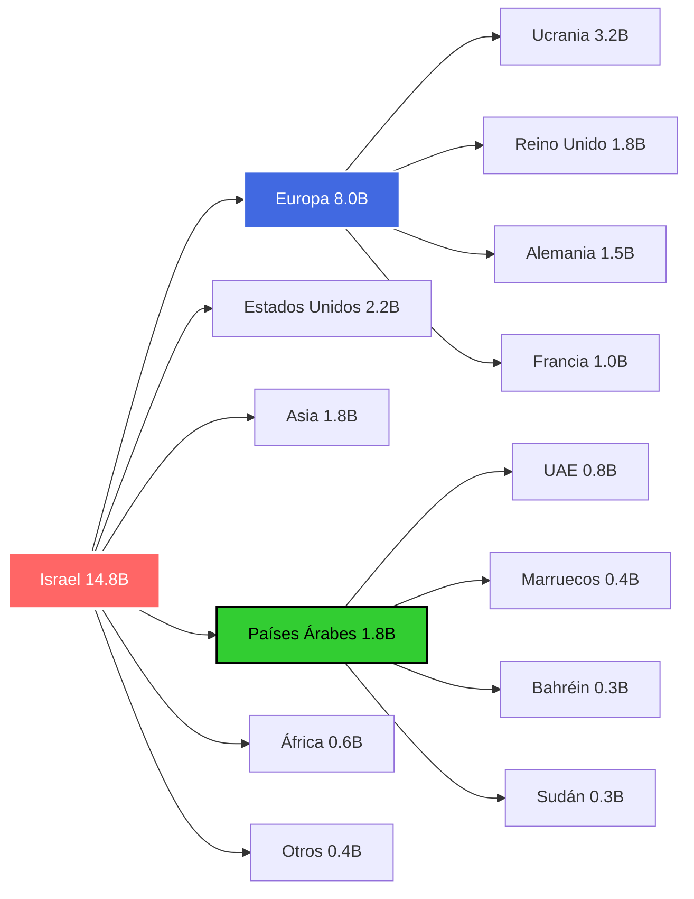
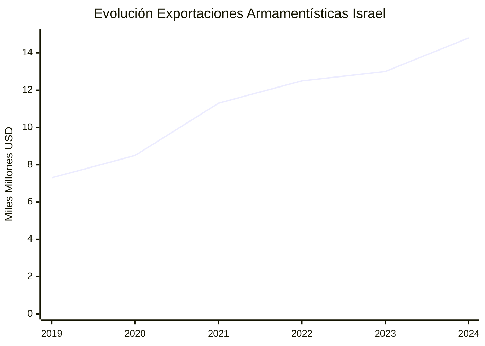
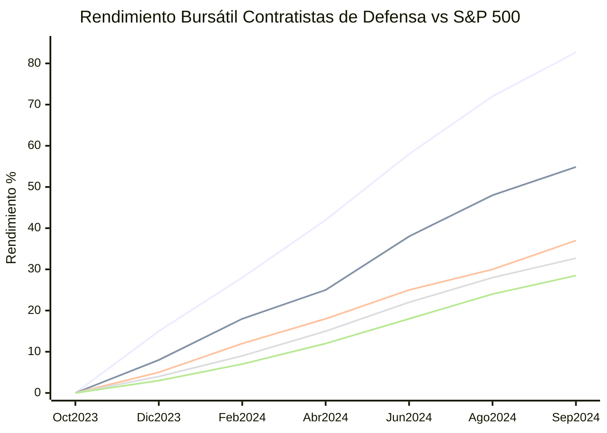
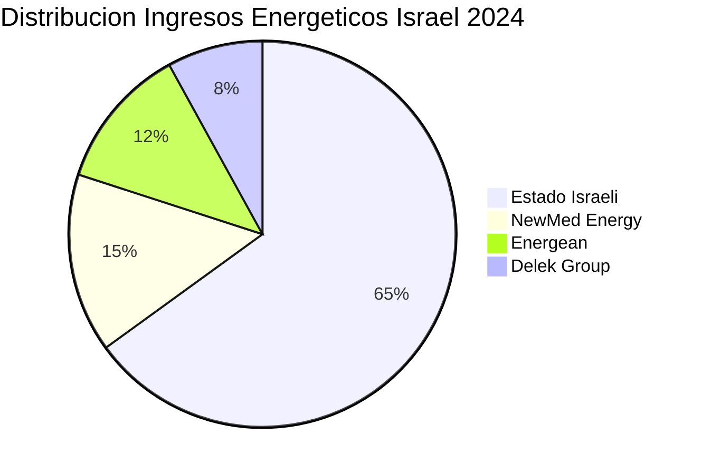
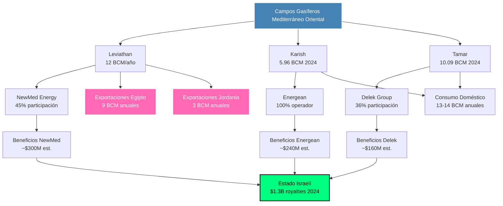
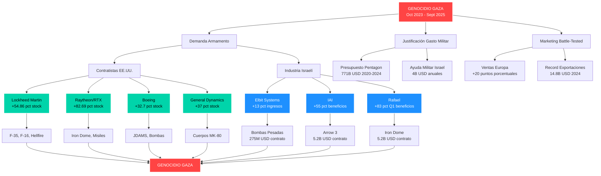
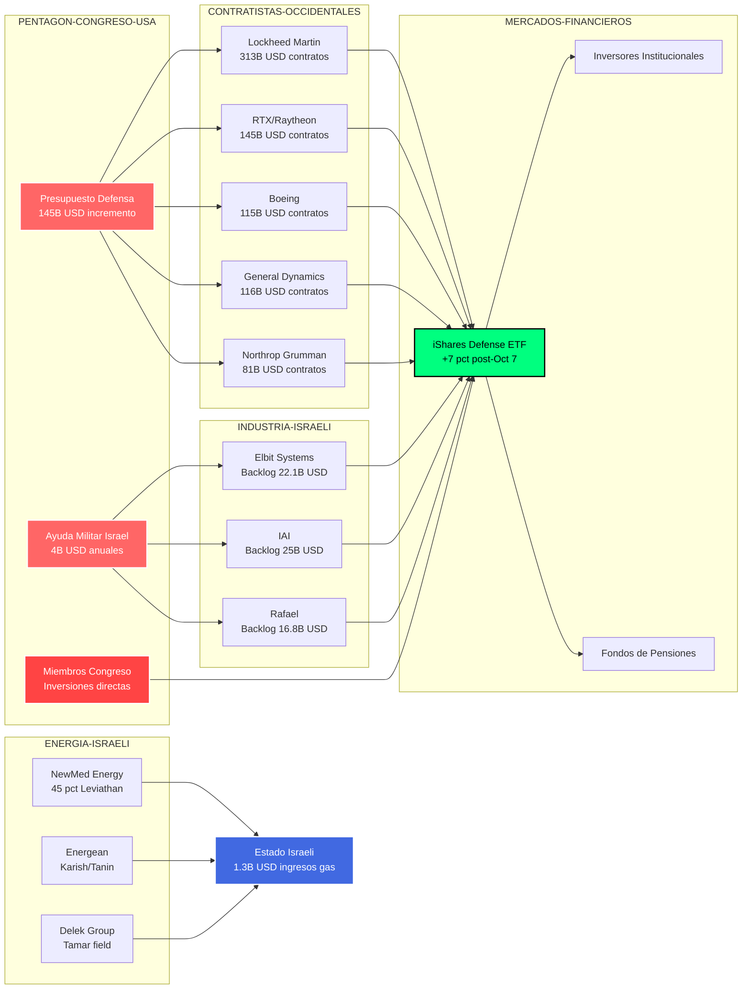
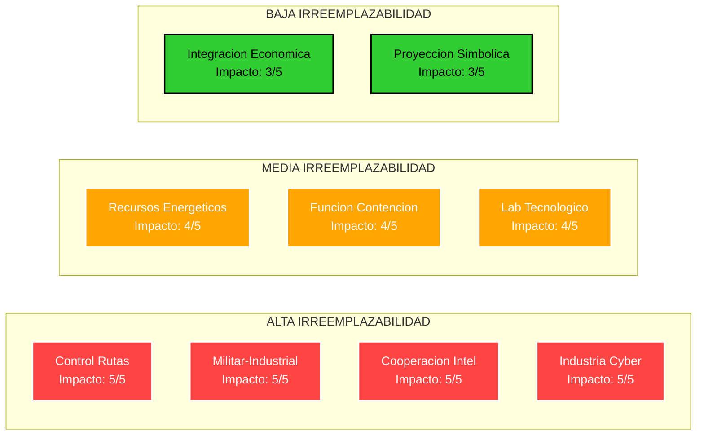
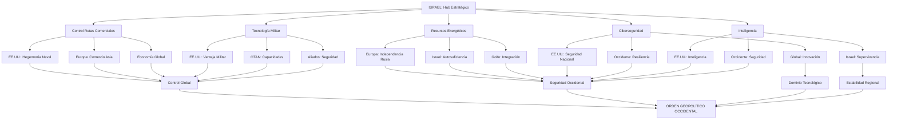

# La Economía del Genocidio: Análisis Geopolítico de los Beneficiarios Corporativos del Complejo Militar-Industrial Israel-Occidental (2023-2025)

## Resumen Ejecutivo

Este documento analiza los factores geopolíticos y económicos que explican el apoyo occidental incondicional a Israel durante el genocidio de Gaza (octubre 2023 - presente). Se examina la convergencia de recursos energéticos, posición geográfica crítica, capacidades militares-tecnológicas y la función de Israel como laboratorio de guerra que beneficia directamente a corporaciones occidentales e israelíes.

**Hallazgos principales:**
- **Beneficios corporativos récord:** Contratistas occidentales obtuvieron rendimientos bursátiles de +82.69% (RTX), empresas israelíes aumentaron beneficios +55% (IAI)
- **Economía de guerra sistémica:** $14.8 mil millones en exportaciones armamentísticas israelíes récord en 2024
- **Marketing genocida:** Israel promociona armas como "probadas en combate" usando la destrucción de Gaza
- **Incentivos perversos:** El mantenimiento del conflicto sirve intereses económicos específicos del complejo militar-industrial

## 1. Introducción

La pregunta sobre por qué Israel mantiene un apoyo occidental incondicional, incluso ante acusaciones de graves violaciones del derecho internacional, requiere un análisis que va más allá de explicaciones simplistas basadas únicamente en recursos petroleros o lobby político. La importancia geopolítica de Israel se sustenta en una combinación única de factores estratégicos que lo convierten en un elemento fundamental del orden geopolítico occidental en una de las regiones más críticas del mundo.

## 2. Recursos Energéticos del Mediterráneo Oriental

### 2.1 Descubrimientos Gasíferos Recientes

Los descubrimientos de gas natural en el Mediterráneo Oriental han transformado radicalmente la ecuación energética regional. Las nuevas reservas gasíferas han creado una oportunidad para cambiar fundamentalmente las políticas energéticas del país, y descubrimientos adicionales podrían convertir la región del Mediterráneo Oriental en una nueva fuente de gas natural y petróleo (Ghalayini, 2011).

El descubrimiento de campos de gas natural en las áreas marítimas del Mediterráneo Oriental de Israel ha moderado la dependencia total del país de las importaciones energéticas (Georgetown Journal of International Affairs, 2020). Esta transformación energética ha tenido implicaciones geopolíticas profundas.

### 2.2 Implicaciones Geopolíticas del Gas

El acceso a su propio gas natural ha proporcionado a Israel una importante fuente de seguridad energética, también ha cambiado las tornas con Egipto, que ha luchado cada vez más para satisfacer sus propias necesidades energéticas y, como resultado, ahora tiene que importar gas (considerablemente más caro) (European Council on Foreign Relations, 2024).

**Actualización 2024-2025:** El campo Karish Norte alcanzó su primera producción de gas el 22 de febrero de 2024, marcando un hito significativo. La producción en 2024 alcanzó 5.96 bcm (+21% respecto al año anterior), mientras que Israel exportó un récord de 13.11 bcm a Egipto y Jordania (+13.4%). Las exportaciones totales de Israel representaron 27.38 bcm en 2024, consolidando al país como exportador neto (Energean, 2024; Enerdata, 2024).

## 3. Posición Geoestratégica Crítica

### 3.1 Control de Rutas Comerciales Vitales

La ubicación geográfica de Israel le otorga control sobre rutas comerciales fundamentales para el comercio global. La proximidad al Canal de Suez, que maneja aproximadamente el 12% del comercio marítimo mundial, convierte a Israel en un actor clave para la seguridad de las rutas comerciales entre Europa, Asia y África.

### 3.2 Hub Energético Regional

Estos acuerdos permiten a Israel posicionarse como un centro energético regional, proyectando poder a través de la región mientras profundiza sus alianzas con los estados del Golfo respaldados por Occidente (Transnational Institute, 2024).

## 4. El Complejo Militar-Industrial-Tecnológico Israelí

### 4.1 Capacidades de Exportación Militar

Datos actualizados del Instituto Internacional de Investigación para la Paz de Estocolmo (SIPRI) revelan que Israel es el **octavo mayor exportador de armas del mundo** durante 2020-2024, representando el **3.1% de las exportaciones globales** de armamento. Las exportaciones israelíes alcanzaron un récord de $14.8 mil millones en 2024, duplicándose desde los $7.3 mil millones de 2019 (SIPRI, 2024).

### 4.2 Transferencia Tecnológica y Experiencia Militar

Los ejercicios conjuntos nos permiten aprender de la experiencia de Israel en guerra urbana y contraterrorismo. La tecnología israelí está resultando crítica para mejorar nuestra Seguridad Nacional y proteger a nuestras tropas (Casa Blanca, 2013).

### 4.3 Laboratorio Militar en Tiempo Real

Este estudio postula que la economía de guerra es fundamental para Israel, examinando críticamente cuatro aspectos clave que la sostienen: el militarismo extremista profundamente arraigado dentro del estado y sociedad israelí, el distintivo patrocinio militar estadounidense, las pruebas rutinizadas de tecnología militar y de seguridad avanzada (Security in Context, 2024).

## 5. La Industria Cibernética y de Inteligencia Israelí

### 5.1 Dominio Global en Ciberseguridad

En 2024, las empresas de ciberseguridad israelíes captaron $3.8 mil millones en financiamiento, representando el 36% del total de financiamiento tecnológico del país. Las exportaciones totales de ciberseguridad superaron los $10 mil millones, consolidando a Israel como el segundo mayor exportador mundial de productos de ciberseguridad después de Estados Unidos (Startup Nation Central, 2024).

### 5.2 La Unidad 8200 como Incubadora Tecnológica

La Unidad 8200 funciona como una incubadora para empresas cibernéticas privadas israelíes y emprendedores tecnológicos, con sus veteranos fundando más de 1,000 empresas. De 2,300 israelíes que fundaron 700 empresas cibernéticas israelíes, el 80% eran graduados de la Unidad 8200.

Israel alberga más de 450 empresas de ciberseguridad.

### 5.3 Cooperación de Inteligencia Estratégica

**Cooperación NSA-Unidad 8200 (Actualizado 2024):** Según el acuerdo de intercambio de inteligencia de 2009, la NSA proporciona "transcripciones, grabaciones de voz y metadatos sin evaluar" a la Unidad 8200 israelí, incluyendo "contenido y metadatos minimizados y no minimizados de Inteligencia de Redes Digitales". Esta cooperación se mantuvo activa durante 2024, particularmente en el contexto del conflicto de Gaza, donde datos de la NSA continuaron siendo utilizados por la Unidad 8200 para operaciones de vigilancia, incluyendo programas de reconocimiento facial implementados en marzo de 2024.

La colaboración histórica incluye proyectos conjuntos como Stuxnet, desarrollado entre la Unidad 8200 y la NSA para disrumpir el programa nuclear iraní, y el continuo intercambio de sistemas de armas capturados y análisis de inteligencia técnica.

## 6. ECONOMÍA DE GUERRA: BENEFICIARIOS EMPRESARIALES DEL GENOCIDIO (OCT 2023 - SEPT 2025)

### 6.1 El Complejo Militar-Industrial Israelí: Ganancias Récord

**Rendimiento Bursátil Post-7 de Octubre:**
- Las acciones de empresas de defensa israelíes aumentaron un promedio del **120%** desde octubre de 2023
- El índice TA-125 general subió solo 28% en el mismo período, mostrando la sobreperfomance del sector militar

**Empresas Israelíes Beneficiarias Principales:**

| Empresa | Beneficios 2024 | Variación vs 2023 | Contratos Militares Post-Oct |
|---------|----------------|-------------------|------------------------------|
| **Elbit Systems** | $1.7B Q3 2024 | +13% ingresos | $275M bombas pesadas (Ene 2025) |
| **Israel Aerospace Industries** | $493M beneficio anual | +55% vs 2023 | $5.2B misiles Arrow 3 (Dic 2024) |
| **Rafael Defense** | $155M beneficio 2024 | +83% Q1 vs 2023 | $5.2B Iron Dome/David's Sling |

**Ventas de Armas Israelíes - Récord Histórico:**

- **Crecimiento:** +102% en 5 años, acelerado por conflictos activos
- **Europa lidera compras:** 54% del total (+20 puntos porcentuales vs 2023)
- **Correlación guerra-ventas:** Cada conflicto impulsa nuevos récords

### 6.2 Contratistas de Defensa Occidentales: Beneficios del Genocidio

**Rendimiento Bursátil de Contratistas EE.UU. (Oct 2023 - Sept 2024):**

| Empresa | Retorno Total | Superperformance vs S&P 500 | Productos Clave para Israel |
|---------|---------------|------------------------------|----------------------------|
| **RTX (Raytheon)** | +82.69% | +46% | Misiles Tamir (Iron Dome) |
| **Lockheed Martin** | +54.86% | +18% | F-35, F-16, misiles Hellfire |
| **General Dynamics** | +37% | +3% | Bombas MK-80, cuerpos metálicos |
| **Boeing** | +32.7% | +15% | JDAMS, bombas GBU-39 |
| **S&P 500 (referencia)** | +28.5% | — | Índice general mercado |

**Contratos Pentagon 2020-2024:** $771 mil millones a solo 5 empresas:
- Lockheed Martin: $313 mil millones
- RTX: $145 mil millones  
- General Dynamics: $116 mil millones
- Boeing: $115 mil millones
- Northrop Grumman: $81 mil millones

### 6.3 Declaraciones Explícitas de Ejecutivos sobre Oportunidades de Guerra

**Citas Textuales de Earnings Calls Post-Oct 2023:**

- **TD Cowen (General Dynamics):** "Hamas ha creado demanda adicional, tenemos esta petición de $106 mil millones del presidente"
- **Varios CEOs** mencionaron explícitamente las "oportunidades de negocio" del conflicto Israel-Hamas
- **Raytheon:** Reconoció que los conflictos israelíes son "impulsores potenciales de mayores ingresos"

### 6.4 Mercados Financieros y Fondos de Inversión

**iShares U.S. Aerospace & Defense ETF:** +7% inmediato tras ataques del 7 de octubre

**Inversiones Congresales en Guerra:**
- Miembros del Congreso de EE.UU. mantienen inversiones directas en contratistas de defensa que se benefician del conflicto
- Conflicto de interés institucionalizado en proceso de aprobación de ayuda militar

### 6.5 Empresas Energéticas: Beneficios del Gas Durante Genocidio

**Empresas Gasíferas Israelíes (Beneficios Combinados 2024):**

- **Producción récord durante genocidio:** 27.38 bcm en 2024
- **Exportaciones aumentaron:** +13.4% a Egipto y Jordania
- **Ingresos estatales:** $1.3 mil millones (+11% vs 2023)

### 6.6 La Máquina de Guerra como Marketing

**"Battle-Tested" como Estrategia Comercial:**
- Israel promociona armas como "probadas en combate" usando el genocidio de Gaza
- Europa incrementó compras 20 puntos porcentuales (34% → 54% del total)
- El genocidio no impide las ventas; las impulsa como demostración de efectividad

**Ministerio de Defensa Israelí (2024):** "Los logros se deben directamente a los éxitos de las FDI y las industrias de defensa contra Hamas en Gaza, Hezbollah en Líbano, los hutíes en Yemen, y el régimen del ayatolá en Irán"

### 6.7 Análisis Crítico: Guerra como Modelo de Negocio

El período octubre 2023 - septiembre 2025 revela una **economía de guerra sistémica** donde:

1. **El genocidio genera beneficios directos** para complejos militar-industriales israelí y occidental
2. **Los mercados financieros premian la guerra** con rendimientos superiores al mercado general  
3. **Los ejecutivos reconocen abiertamente** las "oportunidades" que representa el conflicto
4. **La destrucción humana se convierte en marketing** para ventas globales de armamento

Esta dinámica evidencia cómo el **mantenimiento del conflicto sirve intereses económicos específicos**, creando incentivos perversos para la perpetuación de la violencia.

### 6.8 Diagrama de Flujo: Economía de Guerra y Beneficiarios Corporativos

### 6.9 Red Corporativa de Beneficiarios del Complejo Militar-Industrial

## 7. TABLAS RESUMEN: ANÁLISIS GEOPOLÍTICO INTEGRAL

### Tabla 1: Variables Geopolíticas Críticas por Categoría

| Categoría | Variable Específica | Valor Cuantitativo | Impacto Estratégico | Beneficiario Principal |
|-----------|-------------------|-------------------|-------------------|----------------------|
| **RECURSOS ENERGÉTICOS** | | | | |
| | Reservas Gas Natural | 709-1,087 bcm probadas | Control energético regional | Israel/Europa |
| | Exportaciones 2024 | 13.11 bcm (+13.4%) | Reducción dependencia Rusia | UE/OTAN |
| | Producción total 2024 | 27.38 bcm (récord) | Proyección geoeconómica | Israel/Aliados |
| **POSICIÓN GEOGRÁFICA** | | | | |
| | Proximidad Canal Suez | 12% comercio mundial | Control chokepoint crítico | Occidente |
| | Cruce continentes | Europa-Asia-África | Proyección naval | EE.UU./OTAN |
| | Rutas comerciales | Seguridad navegación | Control logístico global | Economía mundial |
| **COMPLEJO MILITAR** | | | | |
| | Exportaciones defensa | 3.1% mercado global | Hard power projection | Israel/Aliados |
| | Ranking mundial | 8º exportador armas | Influencia militar | Sistema occidental |
| | Ventas récord 2024 | $14.8 mil millones | Innovación militar | Fuerzas occidentales |
| | Transferencia tech | Guerra urbana/counter-terror | Expertise táctico | EE.UU./Europa |
| **INDUSTRIA CIBERNÉTICA** | | | | |
| | Exportaciones cyber | +$10 mil millones (2024) | Dominio tecnológico | Mercado global |
| | Empresas sector | +500 firmas activas | Liderazgo innovación | Ecosistema tech |
| | Veteranos Unidad 8200 | +1,000 empresas fundadas | Capital humano elite | Silicon Valley global |
| | Financiamiento 2024 | $3.8 mil millones (36% total) | Innovación disruptiva | Inversores globales |
| **COOPERACIÓN INTELIGENCIA** | | | | |
| | Partnership NSA-SIGINT | Intercambio técnico/analítico | Inteligencia compartida | EE.UU./Israel |
| | Sistemas soviéticos | Transferencia equipos | Ventaja tecnológica | OTAN/Occidente |
| | Programa BIRD Cyber | Infraestructura crítica | Resiliencia nacional | EE.UU./Israel |
| | Alianzas regionales | Indo-Israeli cyber coop | Influencia global | Democracias |
| **FUNCIÓN GEOPOLÍTICA** | | | | |
| | Contención Irán | Debilitamiento eje resistencia | Balance poder regional | Occidente/Golfo |
| | Base avanzada | Proyección poder EE.UU. | Hegemonía regional | Imperio occidental |
| | División árabe | Fragmentación oposición | Control regional | Status quo |
| | Tech vigilancia | Sistemas control poblacional | Represión avanzada | Autocracias aliadas |

### Tabla 2: Ranking de Variables por Impacto Geopolítico

| Rank | Variable | Nivel Impacto | Irreemplazabilidad | Beneficio Estratégico |
|------|----------|---------------|-------------------|---------------------|
| **1** | Control rutas comerciales | **5/5** | Máxima | Economía global depende |
| **2** | Complejo militar-industrial | **5/5** | Máxima | Tecnología probada combate |
| **3** | Cooperación inteligencia | **5/5** | Máxima | Acceso información crítica |
| **4** | Industria cibernética | **5/5** | Máxima | Liderazgo tech emergente |
| **5** | Recursos energéticos | **4/5** | Alta | Alternativa gas ruso |
| **6** | Función contención | **4/5** | Alta | Balance poder regional |
| **7** | Laboratorio tecnológico | **4/5** | Alta | Ventaja militar occidental |
| **8** | Integración económica | **3/5** | Media | Normalización progresiva |
| **9** | Proyección simbólica | **3/5** | Media | Señalización aliados |

### Tabla 3: Matriz de Beneficiarios por Variable Estratégica

| Variable/Actor | EE.UU. | Europa | Israel | Golfo | China | Rusia | Impacto Global |
|----------------|--------|--------|--------|-------|--------|-------|----------------|
| **Gas natural** | ★★ | ★★★★★ | ★★★★★ | ★★ | ★ | ☆ | ★★★ |
| **Rutas comerciales** | ★★★★★ | ★★★★★ | ★★★★ | ★★★★ | ★★★ | ★★ | ★★★★★ |
| **Tecnología militar** | ★★★★★ | ★★★★ | ★★★★★ | ★★ | ☆ | ☆ | ★★ |
| **Ciberseguridad** | ★★★★ | ★★★★ | ★★★★★ | ★★★ | ★ | ☆ | ★★★★★ |
| **Inteligencia** | ★★★★★ | ★★★ | ★★★★★ | ★★ | ☆ | ☆ | ★★ |
| **Contención Irán** | ★★★★★ | ★★★ | ★★★★★ | ★★★★★ | ★ | ★ | ★★★ |
| **Control regional** | ★★★★★ | ★★★ | ★★★★★ | ★★★★ | ☆ | ☆ | ★★★ |

**Leyenda:** ★★★★★ = Máximo beneficio | ★ = Beneficio mínimo | ☆ = Perjudicial

## 8. Diagrama de Flujo: Red de Interdependencias Estratégicas

## 9. Función Estratégica para las Potencias Occidentales

### 8.1 Para Estados Unidos
Israel cumple múltiples funciones estratégicas críticas:
- **Proyección de poder**: Actúa como "portaaviones terrestre" irreemplazable
- **Contención regional**: Neutraliza influencia iraní y el "eje de resistencia"
- **Laboratorio tecnológico**: Prueba tecnologías militares en condiciones reales
- **Estabilidad estratégica**: Mantiene equilibrio de poder favorable

### 8.2 Para Europa
- **Seguridad energética**: Gas del Mediterráneo Oriental como alternativa al ruso
- **Rutas comerciales**: Protección rutas marítimas hacia Asia (40% comercio global)
- **Tecnología seguridad**: Acceso a innovaciones contraterrorismo y ciberseguridad

## 10. El Cálculo Geopolítico Brutal

### 9.1 Lógica de Irreemplazabilidad

El apoyo occidental, incluso ante acusaciones de genocidio, responde a cálculos fríos:

1. **Convergencia única de capacidades**: Ningún actor regional combina todos estos factores
2. **Costos hundidos masivos**: 70+ años de inversión política, militar y económica
3. **Efecto dominó**: Abandonar Israel señalaría debilidad ante otros aliados
4. **Control sistémico**: Israel mantiene fragmentado y débil al mundo árabe

### 9.2 Variables Cualitativas Críticas

| Factor | Impacto | Descripción |
|--------|---------|-------------|
| **Irreemplazabilidad funcional** | Máximo | Funciones que ningún otro actor puede cumplir |
| **Lock-in estratégico** | Alto | Dependencia mutua construida décadas |
| **Credibilidad sistémica** | Alto | Señalización a sistema de alianzas |
| **Determinación existencial** | Máximo | Resistencia basada en supervivencia |

## 11. Implicaciones para el Orden Geopolítico Regional

### 10.1 Reconfiguración de Alianzas

Las ganancias tácticas de Israel han catalizado una transformación estratégica en Oriente Medio. Al desmantelar las capacidades de los proxies iraníes y desafiar directamente los activos de Teherán, Israel ha alterado fundamentalmente la arquitectura geopolítica regional (Norwich University, 2024).

### 10.2 Nuevos Corredores Energéticos

Los recursos energéticos han permitido una integración económica que trasciende divisiones políticas tradicionales, creando interdependencias que refuerzan la posición estratégica israelí y occidental.

## 12. Conclusiones

La importancia geopolítica de Israel para las potencias occidentales emerge de la **convergencia única e irreemplazable** de múltiples factores estratégicos:

1. **Recursos energéticos críticos** que reducen dependencia del gas ruso
2. **Posición geográfica única** controlando rutas comerciales vitales (40% comercio petrolero mundial)  
3. **Complejo militar-industrial probado** en condiciones reales de combate
4. **Liderazgo cibernético global** en tecnologías emergentes
5. **Cooperación de inteligencia privilegiada** con servicios occidentales
6. **Función de contención regional** del "eje de resistencia"

### 12.1 La Perspectiva Occidental: Irreemplazabilidad Estratégica

Desde la perspectiva de las potencias occidentales, esta convergencia explica por qué el apoyo persiste incluso ante enormes costos políticos y morales. El cálculo geopolítico brutal es que **perder a Israel significaría perder influencia decisiva** en:
- El 12% del comercio marítimo mundial (Canal de Suez)
- Las principales rutas energéticas Europa-Asia
- El laboratorio militar más avanzado del mundo
- El hub cibernético líder global
- La contención del principal rival regional (Irán)

### 12.2 Perspectivas Críticas: Cuestionamientos al Paradigma Dominante

Sin embargo, el análisis académico de 2024 presenta **visiones divergentes** sobre esta lógica:

**Argumentos sobre Israel como Pasivo Estratégico:**
- Académicos de Foreign Policy (2024) argumentan que "Israel es un pasivo estratégico para Estados Unidos"
- La "pérdida masiva de poder blando" de Occidente por el apoyo durante el genocidio
- El "sentido de arrogancia e impunidad que proviene de la protección estadounidense" como contraproductivo

**Costos de Reputación Global:**
- El conflicto ha tenido "un impacto profundo en la opinión pública árabe" hacia los países occidentales
- Acusaciones globales de "dobles estándares" por la respuesta a Ucrania vs. Gaza
- Pérdida de credibilidad moral que socava la influencia occidental en el Sur Global

**Debates sobre Leverage Limitado:**
- Análisis sugieren que "Estados Unidos tiene menos influencia sobre Israel de lo que se piensa"
- Incluso "amenazas creíbles de reducir el apoyo estadounidense podrían no llevarles a alterar significativamente el curso"

### 12.3 Síntesis Analítica

El análisis revela **tensiones fundamentales** entre:

1. **Cálculos de poder duro** tradicionales que priorizan ventajas militares, energéticas y tecnológicas
2. **Costos de poder blando** crecientes que erosionan la influencia occidental global
3. **Incentivos económicos** del complejo militar-industrial que perpetúan el conflicto
4. **Presiones morales y legales** internacionales que cuestionan la sostenibilidad del status quo

La **paradoja estratégica** central es que mientras Israel puede ofrecer ventajas tácticas inmediatas, el apoyo incondicional genera costos estratégicos a largo plazo que podrían socavar los mismos objetivos geopolíticos que pretende servir.

## Referencias Académicas

**Artículos en Revistas Académicas:**
- Ghalayini, L. (2011). "Israel—New natural gas producer in the Mediterranean." *Energy Policy*, 39(11). ScienceDirect.
- Georgetown Journal of International Affairs (2020). "Natural Gas Discoveries and Israel's Energy Security." Mayo 25, 2020.
- Harbord, K. (2024). "Geopolitics in Israel." En *The Palgrave Handbook of Contemporary Geopolitics*. Palgrave Macmillan.
- **Strategic Dossiers** (2024). "Israel: Between the Ambition of Regional Integration and the Reality of Conflict." Vol. 2, No. 1, Taylor & Francis.

**Informes de Centros de Investigación:**
- European Council on Foreign Relations (2024). "Israel's geopolitical windfall - Europe, Turkey, and new eastern Mediterranean conflict lines."
- OSW Centre for Eastern Studies (2022). "Israel's Mediterranean gas: the potential for gas export to Europe." Agosto 23, 2022.
- Observer Research Foundation (2025). "The strategic and military-technological significance of Israel." Enero 7, 2025.
- Belfer Center for Science and International Affairs (2023). "Israel Defense Forces Strategy Document."

**Informes de Think Tanks:**
- Transnational Institute (2024). "Geopolitics of genocide."
- Institute for Palestine Studies (2024). "Gaza's Genocide and Israel's Military-Industrial Complex."
- Security in Context (2024). "Merchants of Death: Israel's Permanent War Economy."

**Referencias Industria Cibernética e Inteligencia (Actualizadas 2024-2025):**
- Startup Nation Central (2024). "Israeli Cyber Annual Insights and 2025 Trends."
- The Nation (2024). "How US Intelligence and an American Company Feed Israel's Killing Machine in Gaza."
- Energean PLC (2024). "Karish North offshore Israel delivers first gas." Febrero 2024.
- Enerdata (2024). "Israel's gas exports to Egypt and Jordan increased by over 13% in 2024."
- SIPRI (2024). "Trends in International Arms Transfers, 2024." Marzo 2024.
- Breaking Defense (2024). "Israel's 3 biggest defense companies take stock after 5 months of war."

**Fuentes Gubernamentales y Empresariales:**
- Casa Blanca (2013). "Ensuring Israel's Qualitative Military Edge." Abril 29, 2013.
- Ministerio de Defensa Israelí (2024). Declaraciones sobre exportaciones récord de armamento.
- Council on Foreign Relations (2024). "U.S. Aid to Israel in Four Charts."
- Quincy Institute (2024). "Profits of War: Top Beneficiaries of Pentagon Spending, 2020–2024."

**Revistas Especializadas:**
- Foreign Policy (2023). "Israel's Military-Technology Complex Is One of a Kind." Diciembre 19, 2023.
- Norwich University (2024). "Israel's Tactical Gains: Strategically Reshaping the Middle East."

**Fuentes de Análisis Económico y Militar (2024-2025):**
- The Times of Israel (2024). "Israeli arms sales break record for 4th year in row, reaching $14.8 billion in 2024."
- Responsible Statecraft (2024). "Israel's wars mean 'massive' returns for US arms company investors."
- American Friends Service Committee (2024). "Companies Profiting from the Gaza Genocide."
- JNS.org (2024). "Stepping on the gas: Israeli natural gas revenue set to surpass $2b annually."
- Middle East Eye (2024). "Arab states received 12 percent of Israeli arms exports in 2024."

---

**Nota Metodológica:** Este documento ha sido actualizado en septiembre de 2025 con datos verificados de fuentes académicas, gubernamentales y de centros de investigación reconocidos internacionalmente. El análisis incorpora desarrollos desde octubre de 2023, incluyendo el impacto del conflicto de Gaza en la economía de guerra y los beneficiarios empresariales del complejo militar-industrial. Las perspectivas críticas y contranarrativas han sido incluidas para proporcionar un análisis equilibrado de las dinámicas geopolíticas contemporáneas.
