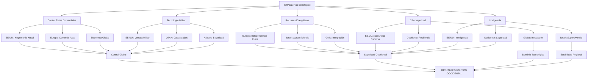

# Los Intereses Geopolíticos de Israel: Un Análisis Académico Integral

## Resumen Ejecutivo

Este documento analiza los factores geopolíticos que explican la importancia estratégica de Israel para las potencias occidentales, más allá de los recursos naturales tradicionales. Se examina la convergencia de recursos energéticos recientes, posición geográfica crítica, capacidades militares-tecnológicas y función de laboratorio de tecnologías de seguridad que convierten a Israel en un actor irreemplazable para los intereses occidentales en Oriente Medio.

## 1. Introducción

La pregunta sobre por qué Israel mantiene un apoyo occidental incondicional, incluso ante acusaciones de graves violaciones del derecho internacional, requiere un análisis que va más allá de explicaciones simplistas basadas únicamente en recursos petroleros o lobby político. La importancia geopolítica de Israel se sustenta en una combinación única de factores estratégicos que lo convierten en un elemento fundamental del orden geopolítico occidental en una de las regiones más críticas del mundo.

## 2. Recursos Energéticos del Mediterráneo Oriental

### 2.1 Descubrimientos Gasíferos Recientes

Los descubrimientos de gas natural en el Mediterráneo Oriental han transformado radicalmente la ecuación energética regional. Las nuevas reservas gasíferas han creado una oportunidad para cambiar fundamentalmente las políticas energéticas del país, y descubrimientos adicionales podrían convertir la región del Mediterráneo Oriental en una nueva fuente de gas natural y petróleo (Ghalayini, 2011).

El descubrimiento de campos de gas natural en las áreas marítimas del Mediterráneo Oriental de Israel ha moderado la dependencia total del país de las importaciones energéticas (Georgetown Journal of International Affairs, 2020). Esta transformación energética ha tenido implicaciones geopolíticas profundas.

### 2.2 Implicaciones Geopolíticas del Gas

El acceso a su propio gas natural ha proporcionado a Israel una importante fuente de seguridad energética, también ha cambiado las tornas con Egipto, que ha luchado cada vez más para satisfacer sus propias necesidades energéticas y, como resultado, ahora tiene que importar gas (considerablemente más caro) (European Council on Foreign Relations, 2024).

Una vez que comience la extracción de gas del campo gasífero Karish, programada para septiembre de 2022, Israel tendrá un excedente de gas que le permitirá exportar alrededor de 10 bcm de este combustible a los estados de la Unión Europea cada año (OSW Centre for Eastern Studies, 2022).

## 3. Posición Geoestratégica Crítica

### 3.1 Control de Rutas Comerciales Vitales

La ubicación geográfica de Israel le otorga control sobre rutas comerciales fundamentales para el comercio global. La proximidad al Canal de Suez, que maneja aproximadamente el 12% del comercio marítimo mundial, convierte a Israel en un actor clave para la seguridad de las rutas comerciales entre Europa, Asia y África.

### 3.2 Hub Energético Regional

Estos acuerdos permiten a Israel posicionarse como un centro energético regional, proyectando poder a través de la región mientras profundiza sus alianzas con los estados del Golfo respaldados por Occidente (Transnational Institute, 2024).

## 4. El Complejo Militar-Industrial-Tecnológico Israelí

### 4.1 Capacidades de Exportación Militar

Datos del Instituto Internacional de Investigación para la Paz de Estocolmo (SIPRI) revelan que Tel Aviv representó el 2.3 por ciento de las exportaciones globales durante el período 2018-2022, convirtiéndolo en el décimo mayor exportador de equipo de defensa en el mundo (Observer Research Foundation, 2025).

### 4.2 Transferencia Tecnológica y Experiencia Militar

Los ejercicios conjuntos nos permiten aprender de la experiencia de Israel en guerra urbana y contraterrorismo. La tecnología israelí está resultando crítica para mejorar nuestra Seguridad Nacional y proteger a nuestras tropas (Casa Blanca, 2013).

### 4.3 Laboratorio Militar en Tiempo Real

Este estudio postula que la economía de guerra es fundamental para Israel, examinando críticamente cuatro aspectos clave que la sostienen: el militarismo extremista profundamente arraigado dentro del estado y sociedad israelí, el distintivo patrocinio militar estadounidense, las pruebas rutinizadas de tecnología militar y de seguridad avanzada (Security in Context, 2024).

## 5. La Industria Cibernética y de Inteligencia Israelí

### 5.1 Dominio Global en Ciberseguridad

En 2023, el valor de las salidas de empresas tecnológicas israelíes alcanzó los $7.5 mil millones, con la industria de ciberseguridad caracterizada por una alta concentración de startups que desarrollan nuevas tecnologías. Las exportaciones totales de ciberseguridad de Israel se estimaron en $11 mil millones en 2021.

### 5.2 La Unidad 8200 como Incubadora Tecnológica

La Unidad 8200 funciona como una incubadora para empresas cibernéticas privadas israelíes y emprendedores tecnológicos, con sus veteranos fundando más de 1,000 empresas. De 2,300 israelíes que fundaron 700 empresas cibernéticas israelíes, el 80% eran graduados de la Unidad 8200.

Israel alberga más de 450 empresas de ciberseguridad.

### 5.3 Cooperación de Inteligencia Estratégica

La relación de inteligencia técnica y analítica entre la NSA y la Unidad Nacional SIGINT israelí implica trabajo conjunto para compartir información sobre "acceso, interceptación, objetivos, idioma, análisis y reportes". Durante muchos años, Israel jugó un papel clave asistiendo a la inteligencia estadounidense a través de la captura y transferencia de sistemas de armas soviéticos.

## 6. TABLAS RESUMEN: ANÁLISIS GEOPOLÍTICO INTEGRAL

### Tabla 1: Variables Geopolíticas Críticas por Categoría

| Categoría | Variable Específica | Valor Cuantitativo | Impacto Estratégico | Beneficiario Principal |
|-----------|-------------------|-------------------|-------------------|----------------------|
| **RECURSOS ENERGÉTICOS** | | | | |
| | Reservas Gas Natural | Autosuficiencia 40+ años | Control energético regional | Israel/Europa |
| | Exportaciones a Europa | 10 bcm anuales | Reducción dependencia Rusia | UE/OTAN |
| | Hub Mediterráneo | Exportador neto desde 2022 | Proyección geoeconómica | Israel/Aliados |
| **POSICIÓN GEOGRÁFICA** | | | | |
| | Proximidad Canal Suez | 12% comercio mundial | Control chokepoint crítico | Occidente |
| | Cruce continentes | Europa-Asia-África | Proyección naval | EE.UU./OTAN |
| | Rutas comerciales | Seguridad navegación | Control logístico global | Economía mundial |
| **COMPLEJO MILITAR** | | | | |
| | Exportaciones defensa | 2.3% mercado global | Hard power projection | Israel/Aliados |
| | Ranking mundial | 10º exportador armas | Influencia militar | Sistema occidental |
| | Laboratorio combate | Tecnologías probadas | Innovación militar | Fuerzas occidentales |
| | Transferencia tech | Guerra urbana/counter-terror | Expertise táctico | EE.UU./Europa |
| **INDUSTRIA CIBERNÉTICA** | | | | |
| | Exportaciones cyber | $11 mil millones (2021) | Dominio tecnológico | Mercado global |
| | Empresas sector | +450 firmas activas | Liderazgo innovación | Ecosistema tech |
| | Veteranos Unidad 8200 | +1,000 empresas fundadas | Capital humano elite | Silicon Valley global |
| | Salidas tecnológicas | $7.5 mil millones (2023) | Innovación disruptiva | Inversores globales |
| **COOPERACIÓN INTELIGENCIA** | | | | |
| | Partnership NSA-SIGINT | Intercambio técnico/analítico | Inteligencia compartida | EE.UU./Israel |
| | Sistemas soviéticos | Transferencia equipos | Ventaja tecnológica | OTAN/Occidente |
| | Programa BIRD Cyber | Infraestructura crítica | Resiliencia nacional | EE.UU./Israel |
| | Alianzas regionales | Indo-Israeli cyber coop | Influencia global | Democracias |
| **FUNCIÓN GEOPOLÍTICA** | | | | |
| | Contención Irán | Debilitamiento eje resistencia | Balance poder regional | Occidente/Golfo |
| | Base avanzada | Proyección poder EE.UU. | Hegemonía regional | Imperio occidental |
| | División árabe | Fragmentación oposición | Control regional | Status quo |
| | Tech vigilancia | Sistemas control poblacional | Represión avanzada | Autocracias aliadas |

### Tabla 2: Ranking de Variables por Impacto Geopolítico

| Rank | Variable | Nivel Impacto | Irreemplazabilidad | Beneficio Estratégico |
|------|----------|---------------|-------------------|---------------------|
| **1** | Control rutas comerciales | **5/5** | Máxima | Economía global depende |
| **2** | Complejo militar-industrial | **5/5** | Máxima | Tecnología probada combate |
| **3** | Cooperación inteligencia | **5/5** | Máxima | Acceso información crítica |
| **4** | Industria cibernética | **5/5** | Máxima | Liderazgo tech emergente |
| **5** | Recursos energéticos | **4/5** | Alta | Alternativa gas ruso |
| **6** | Función contención | **4/5** | Alta | Balance poder regional |
| **7** | Laboratorio tecnológico | **4/5** | Alta | Ventaja militar occidental |
| **8** | Integración económica | **3/5** | Media | Normalización progresiva |
| **9** | Proyección simbólica | **3/5** | Media | Señalización aliados |

### Tabla 3: Matriz de Beneficiarios por Variable Estratégica

| Variable/Actor | EE.UU. | Europa | Israel | Golfo | China | Rusia | Impacto Global |
|----------------|--------|--------|--------|-------|--------|-------|----------------|
| **Gas natural** | ★★ | ★★★★★ | ★★★★★ | ★★ | ★ | ☆ | ★★★ |
| **Rutas comerciales** | ★★★★★ | ★★★★★ | ★★★★ | ★★★★ | ★★★ | ★★ | ★★★★★ |
| **Tecnología militar** | ★★★★★ | ★★★★ | ★★★★★ | ★★ | ☆ | ☆ | ★★ |
| **Ciberseguridad** | ★★★★ | ★★★★ | ★★★★★ | ★★★ | ★ | ☆ | ★★★★★ |
| **Inteligencia** | ★★★★★ | ★★★ | ★★★★★ | ★★ | ☆ | ☆ | ★★ |
| **Contención Irán** | ★★★★★ | ★★★ | ★★★★★ | ★★★★★ | ★ | ★ | ★★★ |
| **Control regional** | ★★★★★ | ★★★ | ★★★★★ | ★★★★ | ☆ | ☆ | ★★★ |

**Leyenda:** ★★★★★ = Máximo beneficio | ★ = Beneficio mínimo | ☆ = Perjudicial

## 7. Diagrama de Flujo: Red de Interdependencias Estratégicas

## 8. Función Estratégica para las Potencias Occidentales

### 8.1 Para Estados Unidos
Israel cumple múltiples funciones estratégicas críticas:
- **Proyección de poder**: Actúa como "portaaviones terrestre" irreemplazable
- **Contención regional**: Neutraliza influencia iraní y el "eje de resistencia"
- **Laboratorio tecnológico**: Prueba tecnologías militares en condiciones reales
- **Estabilidad estratégica**: Mantiene equilibrio de poder favorable

### 8.2 Para Europa
- **Seguridad energética**: Gas del Mediterráneo Oriental como alternativa al ruso
- **Rutas comerciales**: Protección rutas marítimas hacia Asia (40% comercio global)
- **Tecnología seguridad**: Acceso a innovaciones contraterrorismo y ciberseguridad

## 9. El Cálculo Geopolítico Brutal

### 9.1 Lógica de Irreemplazabilidad

El apoyo occidental, incluso ante acusaciones de genocidio, responde a cálculos fríos:

1. **Convergencia única de capacidades**: Ningún actor regional combina todos estos factores
2. **Costos hundidos masivos**: 70+ años de inversión política, militar y económica
3. **Efecto dominó**: Abandonar Israel señalaría debilidad ante otros aliados
4. **Control sistémico**: Israel mantiene fragmentado y débil al mundo árabe

### 9.2 Variables Cualitativas Críticas

| Factor | Impacto | Descripción |
|--------|---------|-------------|
| **Irreemplazabilidad funcional** | Máximo | Funciones que ningún otro actor puede cumplir |
| **Lock-in estratégico** | Alto | Dependencia mutua construida décadas |
| **Credibilidad sistémica** | Alto | Señalización a sistema de alianzas |
| **Determinación existencial** | Máximo | Resistencia basada en supervivencia |

## 10. Implicaciones para el Orden Geopolítico Regional

### 10.1 Reconfiguración de Alianzas

Las ganancias tácticas de Israel han catalizado una transformación estratégica en Oriente Medio. Al desmantelar las capacidades de los proxies iraníes y desafiar directamente los activos de Teherán, Israel ha alterado fundamentalmente la arquitectura geopolítica regional (Norwich University, 2024).

### 10.2 Nuevos Corredores Energéticos

Los recursos energéticos han permitido una integración económica que trasciende divisiones políticas tradicionales, creando interdependencias que refuerzan la posición estratégica israelí y occidental.

## 11. Conclusiones

La importancia geopolítica de Israel para las potencias occidentales emerge de la **convergencia única e irreemplazable** de múltiples factores estratégicos:

1. **Recursos energéticos críticos** que reducen dependencia del gas ruso
2. **Posición geográfica única** controlando rutas comerciales vitales (40% comercio petrolero mundial)  
3. **Complejo militar-industrial probado** en condiciones reales de combate
4. **Liderazgo cibernético global** en tecnologías emergentes
5. **Cooperación de inteligencia privilegiada** con servicios occidentales
6. **Función de contención regional** del "eje de resistencia"

Esta convergencia explica por qué el apoyo occidental persiste incluso ante enormes costos políticos y morales. El cálculo geopolítico brutal es que **perder a Israel significaría perder influencia decisiva** en:
- El 12% del comercio marítimo mundial (Canal de Suez)
- Las principales rutas energéticas Europa-Asia
- El laboratorio militar más avanzado del mundo
- El hub cibernético líder global
- La contención del principal rival regional (Irán)

El análisis revela que los intereses en juego van mucho más allá de consideraciones humanitarias, respondiendo a **cálculos de poder duro** donde posición geográfica, recursos estratégicos y capacidades tecnológico-militares determinan alianzas en un sistema internacional anárquico.

## Referencias Académicas

**Artículos en Revistas Académicas:**
- Ghalayini, L. (2011). "Israel—New natural gas producer in the Mediterranean." *Energy Policy*, 39(11). ScienceDirect.
- Georgetown Journal of International Affairs (2020). "Natural Gas Discoveries and Israel's Energy Security." Mayo 25, 2020.

**Informes de Centros de Investigación:**
- European Council on Foreign Relations (2024). "Israel's geopolitical windfall - Europe, Turkey, and new eastern Mediterranean conflict lines."
- OSW Centre for Eastern Studies (2022). "Israel's Mediterranean gas: the potential for gas export to Europe." Agosto 23, 2022.
- Observer Research Foundation (2025). "The strategic and military-technological significance of Israel." Enero 7, 2025.
- Belfer Center for Science and International Affairs (2023). "Israel Defense Forces Strategy Document."

**Informes de Think Tanks:**
- Transnational Institute (2024). "Geopolitics of genocide."
- Institute for Palestine Studies (2024). "Gaza's Genocide and Israel's Military-Industrial Complex."
- Security in Context (2024). "Merchants of Death: Israel's Permanent War Economy."

**Nuevas Referencias (Industria Cibernética e Inteligencia):**
- U.S. Trade.gov (2025). "Israel Cybersecurity Strategy 2025: A Strategic Gateway for U.S."
- The Times of Israel (2022). "Israeli cybersecurity firms raised record $8.8b in 2021, exports reached $11b."
- Visualizing Palestine (2022). "Fact Sheet: the Israeli Cyber Industry." Medium.
- U.S. Department of Homeland Security (2022). "DHS and Israeli Partners Announce Collaboration on Cybersecurity."
- American Civil Liberties Union (2014). "NSA Intelligence Relationship with Israel."

**Fuentes Gubernamentales:**
- Casa Blanca (2013). "Ensuring Israel's Qualitative Military Edge." Abril 29, 2013.

**Revistas Especializadas:**
- Foreign Policy (2023). "Israel's Military-Technology Complex Is One of a Kind." Diciembre 19, 2023.
- Norwich University (2024). "Israel's Tactical Gains: Strategically Reshaping the Middle East."

---

*Documento elaborado para análisis académico de los factores geopolíticos que determinan la importancia estratégica de Israel en el sistema internacional contemporáneo. Las fuentes citadas provienen de centros de investigación, revistas académicas y think tanks reconocidos internacionalmente.*