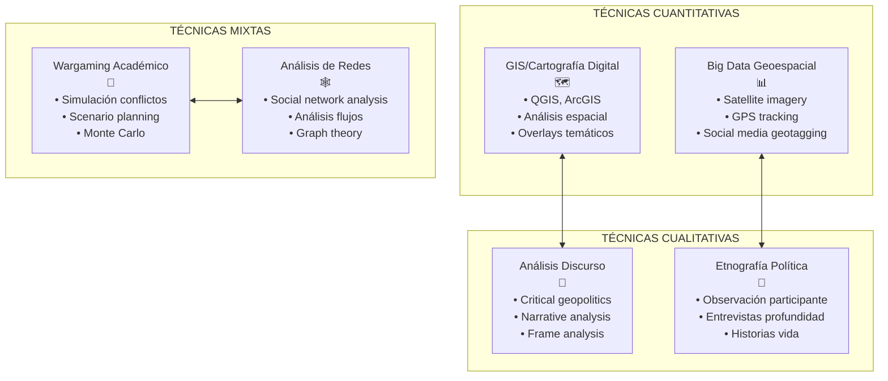
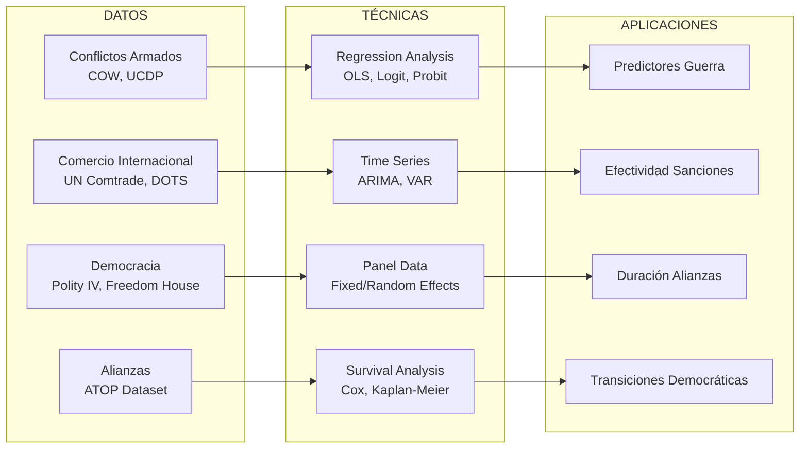
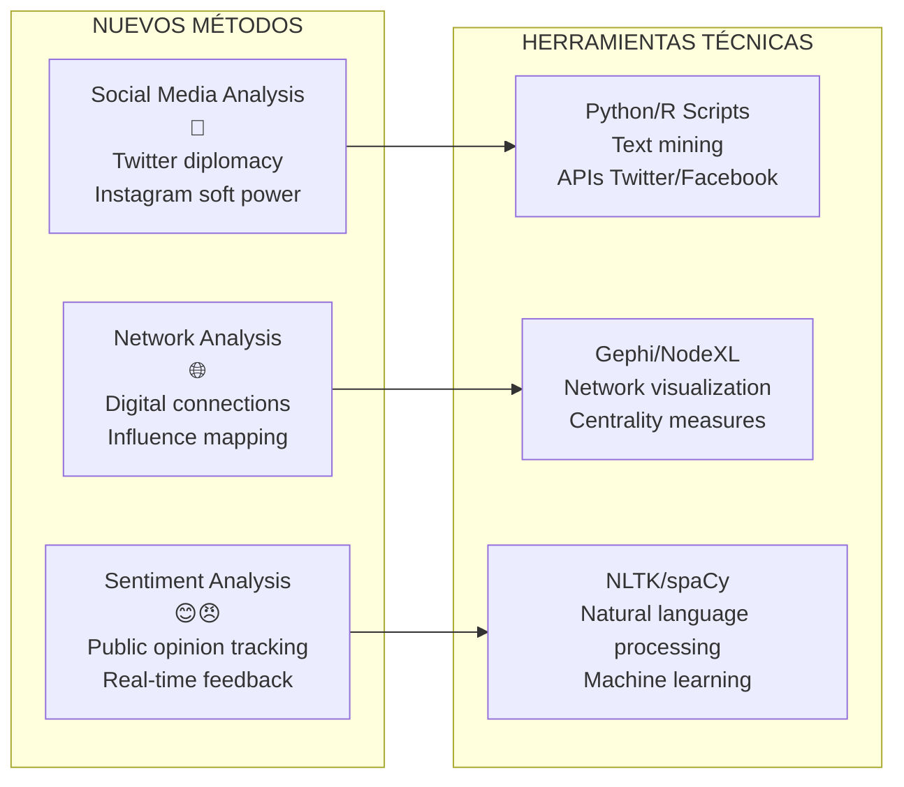
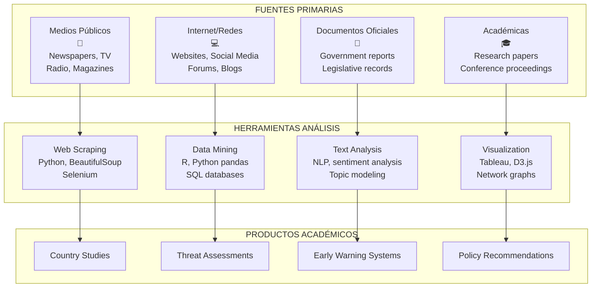
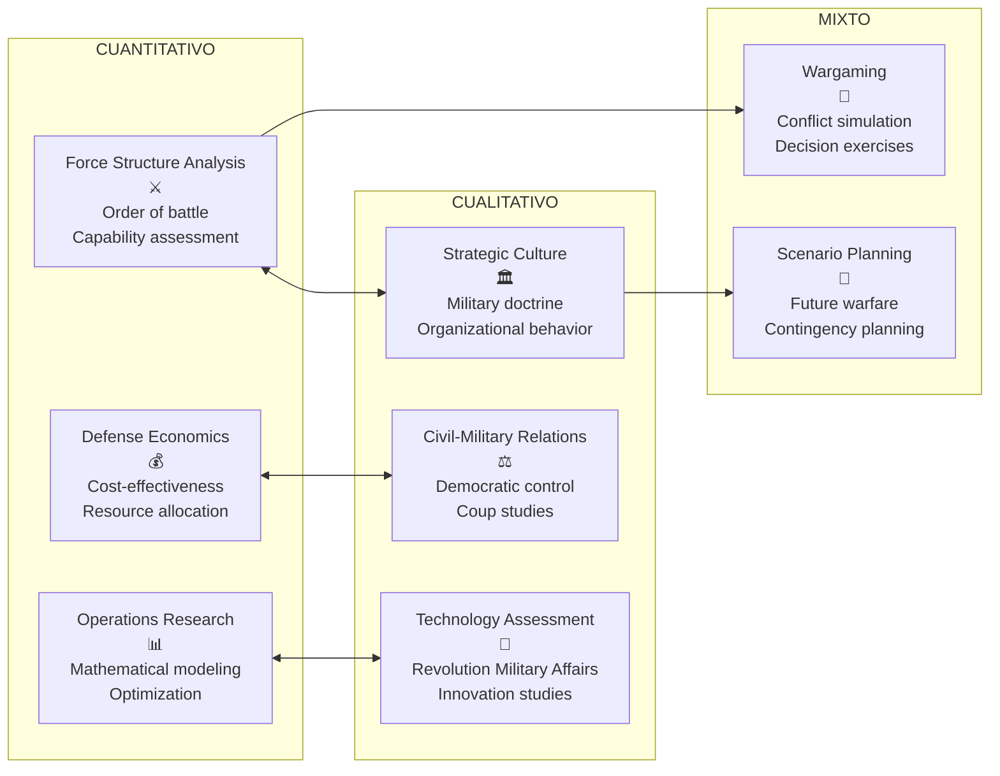
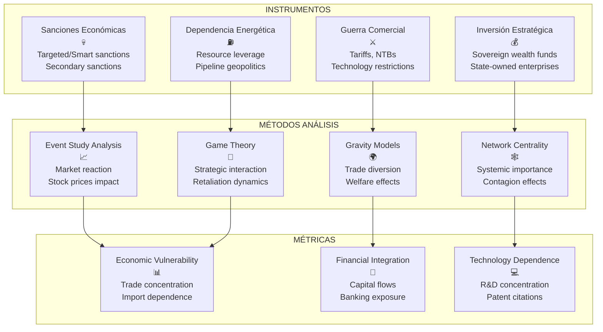
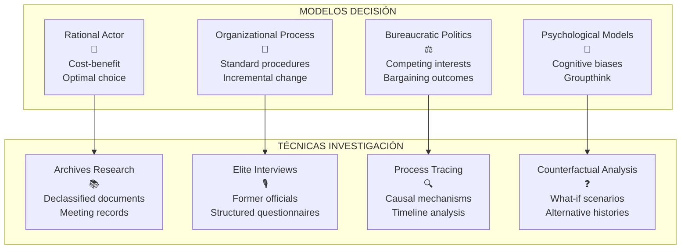
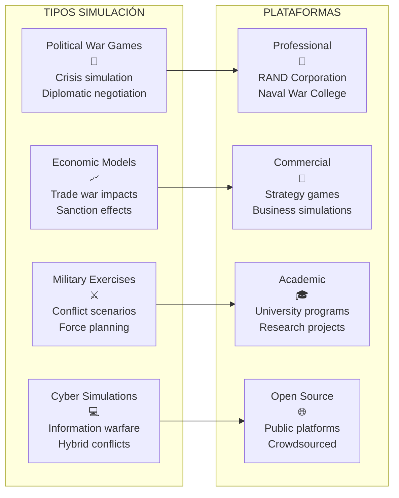
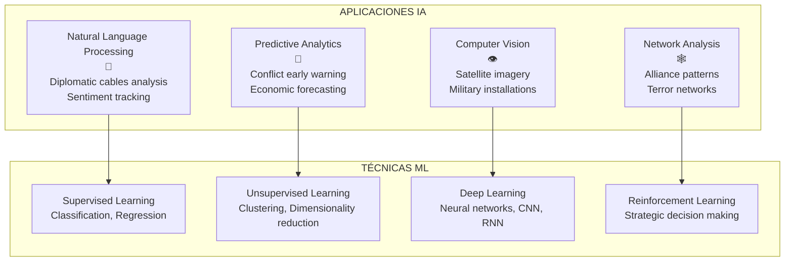

# TÉCNICAS ACADÉMICAS POR DISCIPLINA
## Metodologías de Investigación en Estudios Estratégicos

---

## 1. GEOPOLÍTICA - TÉCNICAS ACADÉMICAS

### Metodologías Centrales

| TÉCNICA | DESCRIPCIÓN | HERRAMIENTAS | EJEMPLO DE APLICACIÓN |
|---------|-------------|--------------|----------------------|
| **Análisis Espacial** | Estudio relaciones geográfico-políticas | GIS, cartografía temática, análisis morfométrico | Mapeo zonas influencia rusa en Asia Central |
| **Geohistoria** | Evolución temporal patrones espaciales | Análisis longitudinal, mapas históricos | Evolución fronteras balcánicas 1878-2008 |
| **Análisis Morfológico** | Características físicas territorio | Topografía, hidrografía, climatología | Influencia cordilleras en fronteras naturales |
| **Modelización Espacial** | Predicción comportamientos territoriales | Modelos gravitacionales, teoría grafos | Predicción flujos migratorios climáticos |

### Escuelas Metodológicas

#### **1. Escuela Determinista (Ratzel, Kjellén)**
- **Técnica principal**: Análisis morfológico del Estado
- **Método**: Comparación organicista Estado-organismo
- **Herramientas**: Estadística territorial, demografía
- **Crítica**: Sobredeterminismo geográfico

#### **2. Escuela Posibilista (Vidal de la Blache)**
- **Técnica principal**: Análisis genre de vie
- **Método**: Estudio adaptación humana al medio
- **Herramientas**: Etnografía, geografía humana
- **Ventaja**: Incorpora factor humano

#### **3. Escuela Crítica (Lacoste, Ó Tuathail)**
- **Técnica principal**: Deconstrucción discurso geopolítico
- **Método**: Análisis del discurso, genealogía
- **Herramientas**: Hermenéutica, análisis textual
- **Enfoque**: Geopolítica como construcción social

### Herramientas Contemporáneas

---

## 2. RELACIONES INTERNACIONALES - TÉCNICAS ACADÉMICAS

### Paradigmas Teóricos y sus Métodos

#### **REALISMO**
| TÉCNICA | MÉTODO | HERRAMIENTAS | EJEMPLO |
|---------|--------|--------------|---------|
| **Balance of Power Analysis** | Cuantificación capacidades | COW Project, SIPRI data | Análisis equilibrio USA-China |
| **Security Dilemma Modeling** | Teoría juegos | Dilema prisionero, juegos suma cero | Carrera armamentística India-Pakistán |
| **Análisis Sistémico** | Structural analysis | Polaridad, distribución poder | Transición unipolar → multipolar |

#### **LIBERALISMO**
| TÉCNICA | MÉTODO | HERRAMIENTAS | EJEMPLO |
|---------|--------|--------------|---------|
| **Interdependencia Compleja** | Análisis redes comerciales | Trade flow analysis, Gravity models | UE como comunidad seguridad |
| **Institucionalismo** | Análisis efectividad régimes | Game theory, collective action | Efectividad OMC en disputas |
| **Paz Democrática** | Análisis estadístico | Regression analysis, Polity IV | Democracias no luchan entre sí |

#### **CONSTRUCTIVISMO**
| TÉCNICA | MÉTODO | HERRAMIENTAS | EJEMPLO |
|---------|--------|--------------|---------|
| **Análisis Discurso** | Deconstrucción narrativas | Critical discourse analysis | Construcción "Eje del Mal" |
| **Process Tracing** | Causalidad mecanismos | Archival research, interviews | Expansión OTAN post-Guerra Fría |
| **Etnografía Diplomática** | Observación práctica diplomática | Participant observation | Negociaciones multilaterales |

### Métodos de Investigación Específicos

#### **1. Estudios de Caso**
- **Single-case studies**: Análisis profundo caso único
- **Comparative case studies**: Comparación casos múltiples  
- **Process tracing**: Secuencia causal detallada
- **Congruence testing**: Verificación predicciones teóricas

#### **2. Análisis Cuantitativo**

---

## 3. DIPLOMACIA - TÉCNICAS ACADÉMICAS

### Enfoques Metodológicos

#### **1. Historia Diplomática**
| TÉCNICA | DESCRIPCIÓN | FUENTES | EJEMPLO |
|---------|-------------|---------|---------|
| **Archival Research** | Análisis documentos diplomáticos | National Archives, diplomatic cables | Papers Pentagon, WikiLeaks |
| **Oral History** | Entrevistas protagonistas | Former diplomats, officials | Kissinger interviews sobre détente |
| **Biographical Method** | Vida diplomáticos influyentes | Memoirs, biographies | Estudio Metternich, Bismarck |

#### **2. Análisis de Negociación**
| TÉCNICA | MÉTODO | HERRAMIENTAS | APLICACIÓN |
|---------|--------|--------------|------------|
| **Game Theory** | Modelización interacciones | Nash equilibrium, bargaining | Camp David Accords analysis |
| **Behavioral Analysis** | Psicología decisión | Prospect theory, framing | Brexit negotiations study |
| **Protocol Analysis** | Procedimientos formales | Ceremonial, precedence | Vienna Convention impact |

#### **3. Diplomacia Digital**

---

## 4. INTELIGENCIA - TÉCNICAS ACADÉMICAS

### Disciplina Académica: Intelligence Studies

#### **1. Métodos de Análisis**
| TÉCNICA | DESCRIPCIÓN | HERRAMIENTAS | APLICACIÓN ACADÉMICA |
|---------|-------------|--------------|---------------------|
| **Structured Analytic Techniques (SATs)** | Reducción bias cognitivo | ACH, Devil's Advocacy, Red Teaming | Teaching intelligence analysis |
| **Link Analysis** | Mapeo redes relacionales | i2 Analyst Notebook, Palantir | Terrorist network studies |
| **Pattern Analysis** | Identificación tendencias | Statistical software, AI/ML | Predictive modeling conflicts |
| **Scenario Analysis** | Futuros alternativos | Cross-impact analysis, Delphi | Strategic warning systems |

#### **2. OSINT Académico**

#### **3. Epistemología de la Inteligencia**
- **Sherman Kent School**: Inteligencia como disciplina académica
- **Critical Intelligence Studies**: Análisis poder e inteligencia
- **Psychology of Intelligence**: Sesgos cognitivos, groupthink
- **Ethics of Intelligence**: Dilemas morales, oversight democrático

---

## 5. ESTUDIOS ESTRATÉGICOS MILITARES - TÉCNICAS ACADÉMICAS

### Enfoques Metodológicos

#### **1. Historia Militar**
| TÉCNICA | MÉTODO | FUENTES | EJEMPLO |
|---------|--------|---------|---------|
| **Battle Studies** | Análisis táctico-operacional | After Action Reports, memoirs | Normandy landings analysis |
| **Operational History** | Campañas militares | Official histories, archives | Desert Storm study |
| **Strategic History** | Grand strategy evolution | Policy documents, interviews | Cold War nuclear strategy |

#### **2. Strategic Studies Methods**

#### **3. Técnicas Específicas**

##### **A. Análisis de Capacidades**
- **DOTMLPF Framework**: Doctrine, Organization, Training, Materiel, Leadership, Personnel, Facilities
- **Net Assessment**: Comparación capacidades rivales
- **Threat Assessment**: Evaluación intenciones + capacidades

##### **B. Modelización y Simulación**
- **Monte Carlo Simulation**: Múltiples escenarios probabilísticos  
- **Agent-Based Modeling**: Comportamiento individual → emergente
- **System Dynamics**: Feedback loops en sistemas complejos

---

## 6. GEOECONOMÍA - TÉCNICAS ACADÉMICAS

### Metodologías Emergentes

#### **1. Análisis de Cadenas de Valor**
| TÉCNICA | DESCRIPCIÓN | HERRAMIENTAS | APLICACIÓN |
|---------|-------------|--------------|------------|
| **Global Value Chains (GVC)** | Mapeo producción fragmentada | Input-output tables, OECD TiVA | Dependencia semiconductores |
| **Supply Chain Analysis** | Vulnerabilidades logísticas | Network analysis, graph theory | Disrupciones COVID-19 |
| **Trade Network Analysis** | Flujos comerciales globales | Gravity models, complexity metrics | Belt and Road impact |

#### **2. Economic Statecraft Analysis**

#### **3. Nuevas Fronteras**
- **Digital Trade Analysis**: E-commerce, data flows, platform economics
- **Green Geopolitics**: Critical minerals, renewable energy supply chains
- **Financial Weaponization**: SWIFT, correspondent banking, cryptocurrency

---

## 7. POLÍTICA EXTERIOR/PÚBLICA - TÉCNICAS ACADÉMICAS

### Enfoques Analíticos

#### **1. Policy Analysis Framework**
| ETAPA | TÉCNICA | HERRAMIENTAS | EJEMPLO |
|-------|---------|--------------|---------|
| **Agenda Setting** | Multiple streams theory | Interviews, media analysis | How 9/11 shaped agenda |
| **Policy Formulation** | Bureaucratic politics | Organizational analysis | Iran nuclear negotiations |
| **Implementation** | Street-level bureaucracy | Ethnographic methods | Refugee resettlement programs |
| **Evaluation** | Cost-benefit analysis | Quantitative assessment | Foreign aid effectiveness |

#### **2. Decision-Making Analysis**

---

## 8. TÉCNICAS TRANSVERSALES E INTERDISCIPLINARIAS

### Métodos Compartidos

#### **1. Big Data & Computational Methods**
| DISCIPLINA | APLICACIÓN BIG DATA | TÉCNICAS ESPECÍFICAS |
|------------|---------------------|---------------------|
| **Geopolítica** | Satellite imagery analysis | Computer vision, remote sensing |
| **RRII** | Social media diplomatic analysis | Sentiment analysis, network analysis |
| **Inteligencia** | Open source intelligence | Web scraping, data mining |
| **Militar** | Predictive analytics | Machine learning, AI |
| **Económica** | Trade pattern analysis | Econometrics, time series |

#### **2. Simulation & Gaming**

---

## 9. HERRAMIENTAS SOFTWARE ACADÉMICAS POR DISCIPLINA

### Suite Tecnológica Especializada

| DISCIPLINA | SOFTWARE CUANTITATIVO | SOFTWARE CUALITATIVO | BASES DE DATOS | VISUALIZACIÓN |
|------------|----------------------|---------------------|----------------|---------------|
| **Geopolítica** | QGIS, ArcGIS, R spatial | Atlas.ti, MaxQDA | Natural Earth, OpenStreetMap | Carto, Leaflet |
| **RRII** | Stata, R, Python | NVivo, Dedoose | COW, Polity IV, UCDP | Gephi, Cytoscape |
| **Diplomacia** | - | Atlas.ti, CAQDAS | Diplomatic archives | Timeline JS |
| **Inteligencia** | Python, R, SPSS | Analyst Notebook | OSINT databases | Maltego, Gephi |
| **Militar** | MATLAB, Arena | - | SIPRI, Military Balance | Tableau, PowerBI |
| **Económica** | EViews, Python pandas | - | World Bank, IMF, OECD | D3.js, Plotly |

---

## 10. METODOLOGÍAS EMERGENTES

### Nuevas Fronteras Académicas

#### **1. Artificial Intelligence & Machine Learning**

#### **2. Digital Humanities & Computational Social Science**
- **Text Mining**: Análisis corpus diplomáticos masivos
- **Social Network Analysis**: Mapeo relaciones internacionales
- **Agent-Based Modeling**: Simulación comportamientos estatales
- **Digital Archives**: Acceso automatizado documentos históricos

#### **3. Citizen Science & Crowdsourcing**
- **Crisis Mapping**: Colaboración ciudadana en conflictos
- **Open Source Investigation**: Bellingcat model
- **Prediction Markets**: Sabiduría colectiva en pronósticos
- **Digital Ethnography**: Observación participante online

---

## 11. VALIDACIÓN Y RIGOR ACADÉMICO

### Criterios por Disciplina

| DISCIPLINA | CRITERIOS VALIDEZ | PEER REVIEW | REPLICABILIDAD |
|------------|------------------|-------------|----------------|
| **Geopolítica** | Coherencia teórica, evidencia empírica | Political Geography, Geopolitics | Datos abiertos, código reproducible |
| **RRII** | Significancia estadística, causalidad | International Organization, IO | Dataset públicos, replication files |
| **Diplomacia** | Archival evidence, triangulation | Diplomacy & Statecraft | Document availability |
| **Inteligencia** | Source reliability, analytical rigor | Intelligence & National Security | Limited by classification |
| **Militar** | Operational relevance, historical accuracy | Armed Forces & Society | Simulation parameters |
| **Económica** | Econometric robustness | Review of International Economics | Code and data sharing |

---

## 12. FUTURAS DIRECCIONES METODOLÓGICAS

### Tendencias Emergentes

1. **Interdisciplinariedad Radical**
   - Fusión metodologías cuanti-cuali
   - Teams multidisciplinarios
   - Hybrid approaches

2. **Democratización Herramientas**
   - Open source intelligence
   - Citizen journalism
   - Collaborative platforms

3. **Ética e IA**
   - Algorithmic bias
   - Privacy concerns
   - Democratic oversight

4. **Sostenibilidad Investigación**
   - Green computing
   - Collaborative infrastructure
   - Open access publishing

---

**CONCLUSIÓN**: Cada disciplina ha desarrollado **técnicas específicas** adaptadas a sus objetos de estudio, pero la **convergencia metodológica** y el **intercambio interdisciplinario** están generando nuevas aproximaciones híbridas que enriquecen el análisis académico de fenómenos estratégicos complejos.

---

*Documento de referencia metodológica*  
*Actualización: Septiembre 2025*
