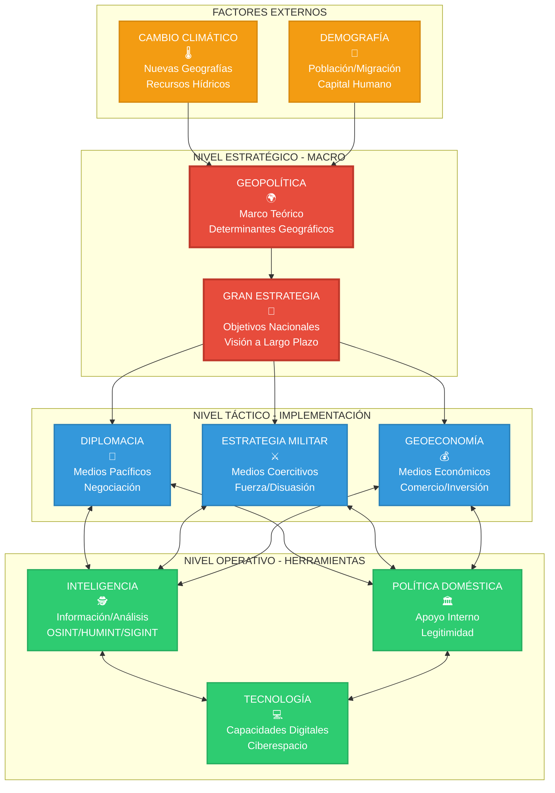
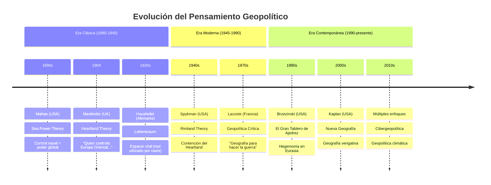
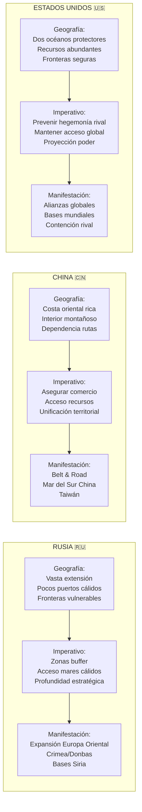
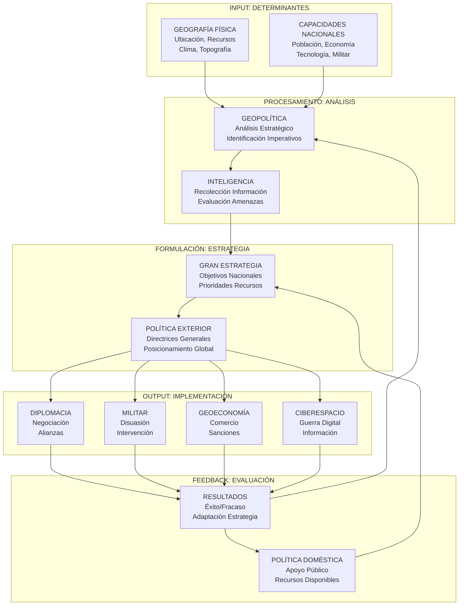
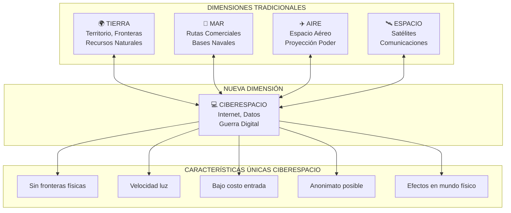
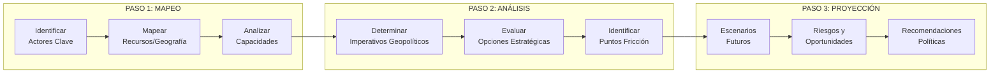

# GEOPOLÍTICA Y DISCIPLINAS RELACIONADAS
## Guía Comprensiva de Análisis Estratégico

---

## 1. DEFINICIÓN Y CONCEPTO CENTRAL

### ¿Qué es la Geopolítica?

La **geopolítica** es la disciplina que estudia cómo la **geografía física influye en la política y las relaciones de poder** entre Estados. Examina cómo factores como ubicación, recursos naturales, clima, topografía y acceso al mar determinan las estrategias y comportamientos de los países.

> **Concepto clave**: "La geografía es destino" - Napoleon Bonaparte

### Ecuación Fundamental
```
GEOGRAFÍA + PODER = GEOPOLÍTICA
(Factores físicos) + (Capacidades estatales) = (Comportamiento estratégico)
```

---

## 2. DIAGRAMA DE RELACIONES SISTÉMICAS



---

## 3. MATRIZ COMPARATIVA DE DISCIPLINAS

| DIMENSIÓN | GEOPOLÍTICA | POLÍTICA | DIPLOMACIA | INTELIGENCIA | MILITAR | GEOECONOMÍA |
|-----------|-------------|----------|------------|--------------|---------|-------------|
| **ENFOQUE** | Espacial/Geográfico | Procesos de Poder | Negociación | Información | Fuerza/Disuasión | Económico/Comercial |
| **TEMPORALIDAD** | Largo Plazo | Variable | Medio Plazo | Tiempo Real | Variable | Medio-Largo Plazo |
| **ALCANCE** | Global/Regional | Nacional/Internacional | Internacional | Específico | Operacional | Global/Sectorial |
| **PREGUNTA CLAVE** | **¿POR QUÉ?** | **¿QUIÉN?** | **¿CÓMO NEGOCIAR?** | **¿QUÉ PASA?** | **¿CÓMO GANAR?** | **¿CÓMO COMPETIR?** |
| **DETERMINISMO** | Geográfico | Ideológico/Social | Relacional | Informacional | Tecnológico | Económico |
| **NATURALEZA** | Académica/Teórica | Práctica | Arte/Ciencia | Técnica | Profesional | Técnica/Estratégica |
| **ACTORES** | Estados/Imperios | Múltiples | Estados | Gobiernos | Fuerzas Armadas | Corporaciones/Estados |
| **MÉTRICAS** | Territorio/Recursos | Votos/Legitimidad | Acuerdos/Tratados | Precisión/Oportunidad | Victoria/Derrota | PIB/Comercio/Inversión |

---

## 4. ESCUELAS GEOPOLÍTICAS CLÁSICAS Y MODERNAS

### Evolución Histórica



### Teorías Fundamentales

| TEORÍA | AUTOR | AÑO | CONCEPTO CENTRAL | APLICACIÓN ACTUAL |
|--------|-------|-----|------------------|-------------------|
| **Sea Power** | Alfred Mahan | 1890 | Control naval = poder global | Competencia USA-China en Indo-Pacífico |
| **Heartland** | Halford Mackinder | 1904 | Control Europa Oriental = poder mundial | Competencia por Ucrania/Asia Central |
| **Rimland** | Nicholas Spykman | 1942 | Contención del Heartland desde la periferia | Alianzas USA en Asia-Pacífico |
| **Chessboard** | Zbigniew Brzezinski | 1997 | Hegemonía estadounidense en Eurasia | Pivote asiático, contención China |

---

## 5. FACTORES GEOPOLÍTICOS: CLÁSICOS VS MODERNOS

### Comparación Evolutiva

| CATEGORÍA | FACTORES CLÁSICOS | NUEVOS FACTORES (S.XXI) |
|-----------|-------------------|-------------------------|
| **ESPACIALES** | • Territorio<br/>• Fronteras<br/>• Ubicación estratégica | • Ciberespacio<br/>• Espacio ultraterrestre<br/>• Rutas árticas |
| **RECURSOS** | • Petróleo/Gas<br/>• Minerales<br/>• Agua dulce | • Tierras raras<br/>• Semiconductores<br/>• Datos/Big Data |
| **POBLACIONALES** | • Tamaño población<br/>• Densidad demográfica | • Envejecimiento<br/>• Migración climática<br/>• Capital humano tecnológico |
| **CONECTIVIDAD** | • Puertos<br/>• Ferrocarriles | • Internet<br/>• Cables submarinos<br/>• Redes 5G |
| **AMBIENTALES** | • Clima<br/>• Topografía | • Cambio climático<br/>• Nivel del mar<br/>• Eventos extremos |

---

## 6. CASOS DE ESTUDIO: IMPERATIVO GEOPOLÍTICO EN ACCIÓN

### Análisis Comparativo de Potencias



---

## 7. INTERACCIONES ENTRE DISCIPLINAS

### Modelo de Flujo Sistémico



---

## 8. APLICACIONES PRÁCTICAS CONTEMPORÁNEAS

### Análisis de Crisis Actuales

| CRISIS/CONFLICTO | FACTOR GEOPOLÍTICO | MANIFESTACIÓN DIPLOMÁTICA | DIMENSIÓN MILITAR | ASPECTO ECONÓMICO | ELEMENTO TECNOLÓGICO |
|------------------|--------------------|-----------------------------|-------------------|-------------------|---------------------|
| **Guerra Ucrania** | Control Heartland europeo | Sanciones masivas UE/USA | Proxy war, armas occidentales | Guerra energética | Guerra cibernética, drones |
| **Tensiones Taiwán** | Dominio Primera Cadena Islas | Ambigüedad estratégica USA | Disuasión naval | Guerra comercial tech | Semiconductores, 5G |
| **Mar del Sur China** | Control rutas comerciales | Arbitraje internacional | Freedom of Navigation | Bloqueo comercial potencial | Islas artificiales, sensores |
| **Crisis Oriente Medio** | Control energía/chokepoints | Abraham Accords | Proxies, intervenciones | Petrodólares, reconstrucción | Drones, ciberataques |

---

## 9. NUEVOS PARADIGMAS GEOPOLÍTICOS

### La Quinta Dimensión: Ciberespacio



### Geopolítica del Cambio Climático

| EFECTO CLIMÁTICO | IMPLICACIÓN GEOPOLÍTICA | EJEMPLO CONCRETO |
|-------------------|-------------------------|-------------------|
| **Deshielo Ártico** | Nuevas rutas comerciales | Ruta del Norte (Rusia) vs Paso Noroeste (Canadá) |
| **Subida nivel mar** | Islas-Estado en peligro | Maldivas, Tuvalu - migración forzada |
| **Desertificación** | Migración masiva | Sahel → Europa, crisis refugiados |
| **Recursos hídricos** | Guerras del agua | Nilo (Egipto-Etiopía), Mekong (China-ASEAN) |
| **Eventos extremos** | Inestabilidad estatal | Huracanes Caribe, tifones Pacífico |

---

## 10. LIMITACIONES Y CRÍTICAS

### Problemas del Determinismo Geográfico

| LIMITACIÓN | EXPLICACIÓN | CONTRAEJEMPLO |
|------------|-------------|---------------|
| **Sobredeterminismo** | La geografía no explica todo | Singapur: pequeño sin recursos pero próspero |
| **Estatocentrismo** | Ignora actores no estatales | Corporaciones multinacionales, ONG, terrorismo |
| **Falta dinamismo** | Tecnología cambia limitaciones | Suez vs rutas aéreas, fibra óptica vs cables |
| **Sesgo occidental** | Teorías desde perspectiva occidental | Geopolítica china, islámica, africana diferentes |
| **Ignorar factores humanos** | Subestima ideas, cultura, liderazgo | Revolución iraní, caída URSS, primavera árabe |

---

## 11. METODOLOGÍA DE ANÁLISIS GEOPOLÍTICO

### Framework Analítico Integrado



### Herramientas de Análisis

1. **OSINT (Open Source Intelligence)**
   - Análisis medios públicos
   - Imágenes satelitales
   - Redes sociales

2. **Wargaming y Simulación**
   - Escenarios hipotéticos
   - Juegos de roles
   - Modelización computacional

3. **Análisis de Redes**
   - Mapeo alianzas
   - Flujos comerciales
   - Dependencias tecnológicas

---

## 12. CONCLUSIONES: LA GEOPOLÍTICA COMO CIENCIA INTEGRADORA

La geopolítica funciona como la **disciplina madre** que:

1. **Proporciona el marco conceptual** para entender comportamientos estatales
2. **Integra múltiples perspectivas** (militar, económica, tecnológica, diplomática)
3. **Ofrece continuidad analítica** a través de cambios políticos
4. **Predice tendencias** basadas en constantes geográficas
5. **Facilita planificación estratégica** a largo plazo

### Ecuación Final de Síntesis:

```
GEOPOLÍTICA = (Geografía × Poder) + (Tecnología × Tiempo) + (Cultura × Contexto)
```

**Donde:**
- **Geografía**: Factores físicos inmutables
- **Poder**: Capacidades nacionales variables  
- **Tecnología**: Factor multiplicador dinámico
- **Tiempo**: Dimensión evolutiva
- **Cultura**: Factor humano diferenciador
- **Contexto**: Circunstancias específicas

---

*Documento de referencia para análisis estratégico integral*  
*Actualización: Septiembre 2025*