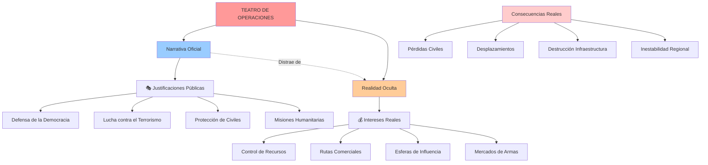
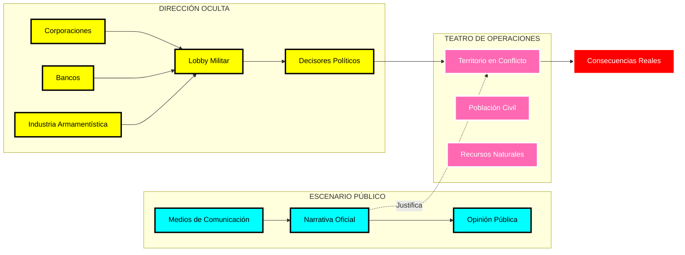

# El "Teatro de Operaciones": Entre Metáfora y Realidad Geopolítica

## Origen Etimológico

El término **"teatro de operaciones"** (del francés *théâtre d'opérations*) surgió en los siglos XVIII-XIX como una metáfora militar que comparaba las operaciones bélicas con una representación teatral.

### Elementos de la Analogía Original

La comparación teatral incluía:

- **Escenario**: El territorio geográfico donde ocurren las operaciones
- **Actores**: Las fuerzas militares y comandantes
- **Guión**: Los planes estratégicos y tácticos
- **Dirección**: El alto mando militar
- **Audiencia**: La población civil y la opinión pública

## La Ironía Geopolítica

## Ejemplos Históricos de la "Teatralidad"

### Era Colonial (Siglos XIX-XX)
- **Guión**: "La carga del hombre blanco" - civilizar pueblos "primitivos"
- **Realidad**: Extracción de recursos, mano de obra barata, mercados captivos

### Guerra Fría (1947-1991)
- **Guión**: Lucha entre "libertad vs. comunismo"
- **Realidad**: Competencia por zonas de influencia económica y militar

### Era Contemporánea
- **Guión**: "Guerra contra el terror", "Intervenciones humanitarias"
- **Realidad**: Control geopolítico, recursos energéticos, complejos militaro-industriales

## Estructura del "Teatro" Moderno

## La Paradoja del Término

### Lo que Revela Involuntariamente:

1. **Artificialidad**: Como en el teatro, hay elementos construidos y representados
2. **Audiencia**: Existe un público que consume la "representación"
3. **Roles Asignados**: Buenos, malos, víctimas, héroes predeterminados
4. **Espectáculo**: Los conflictos se presentan como entretenimiento mediático
5. **Distancia**: Los "espectadores" están separados de la acción real

### La Cruel Ironía:

Mientras los estrategas ven mapas y estadísticas como un "juego" teatral, las consecuencias son devastadoramente reales para quienes viven en estos "teatros":
- Familias destruidas
- Comunidades desplazadas  
- Economías colapsadas
- Traumas generacionales

## Reflexión Final

El término "teatro de operaciones" encapsula perfectamente la deshumanización inherente en la planificación militar moderna. Al convertir territorios y poblaciones en "escenarios" y "audiencias", se facilita psicológicamente la toma de decisiones que afectan millones de vidas.

La metáfora teatral, inicialmente inocente, se ha convertido en una revelación involuntaria de cómo las élites geopolíticas ven el mundo: como un gran escenario donde representar sus intereses, sin importar el costo humano real de la función.

---

*"Toda la historia del mundo es un teatro, pero las obras son mal dirigidas"* - Oscar Wilde (adaptado)
