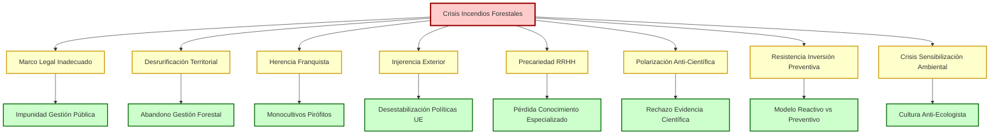
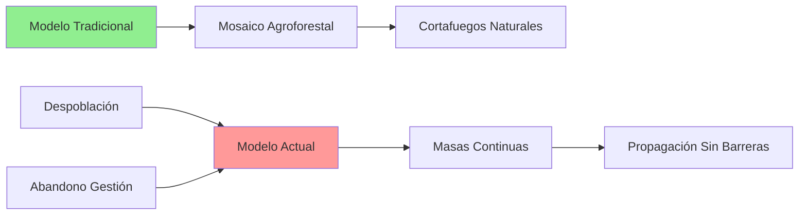
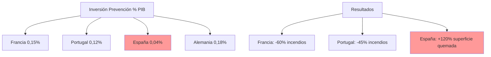
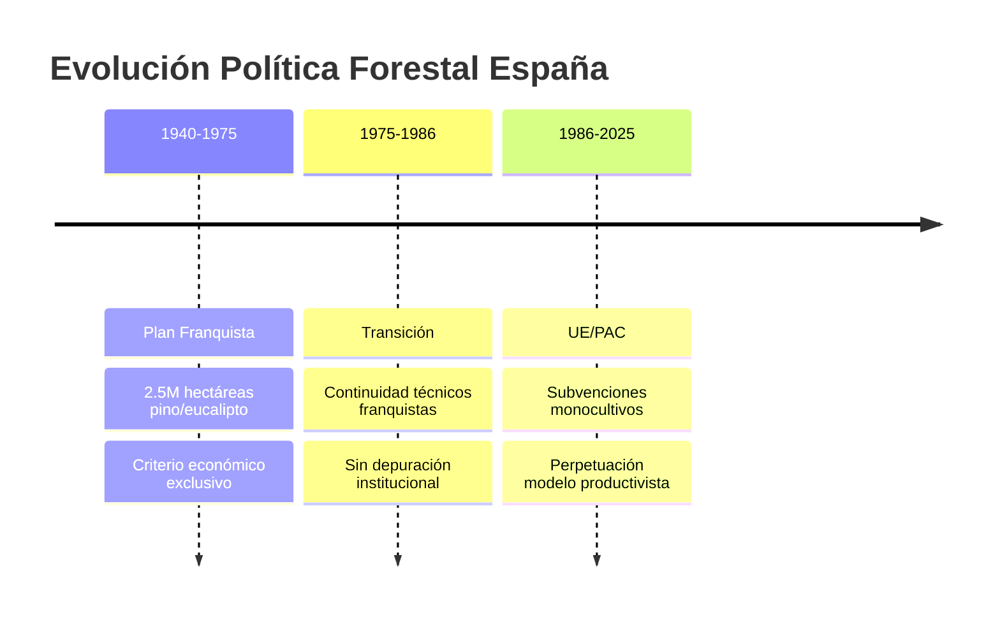
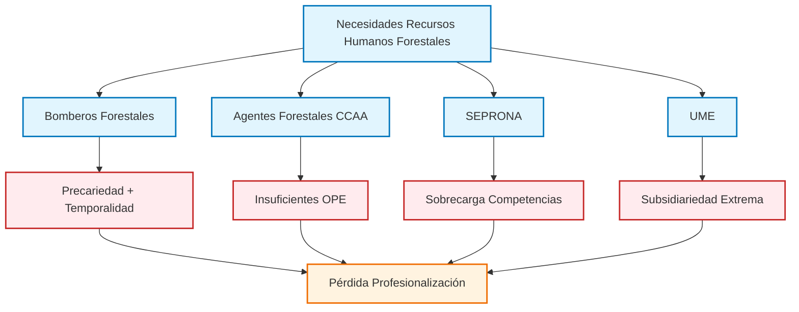
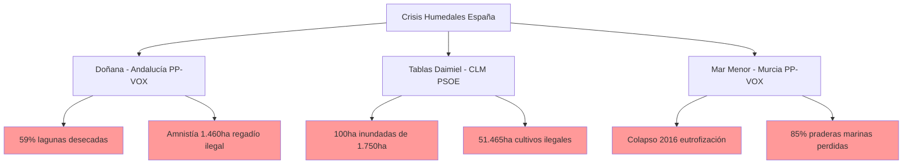
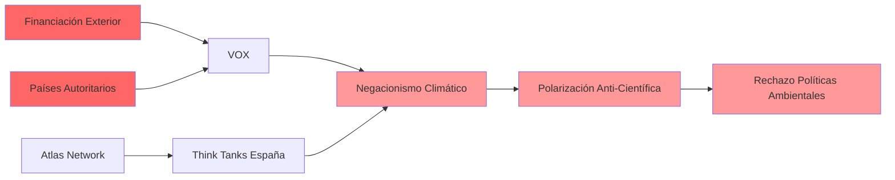
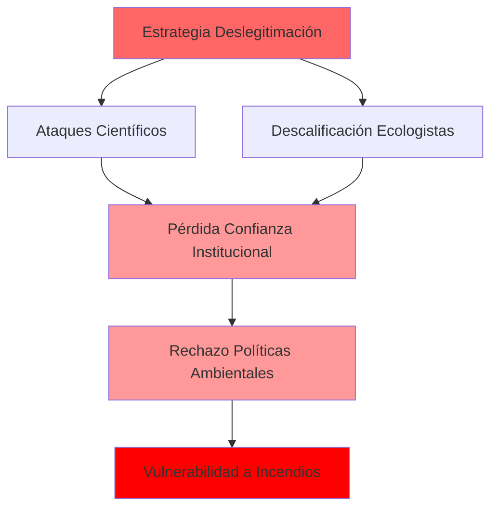
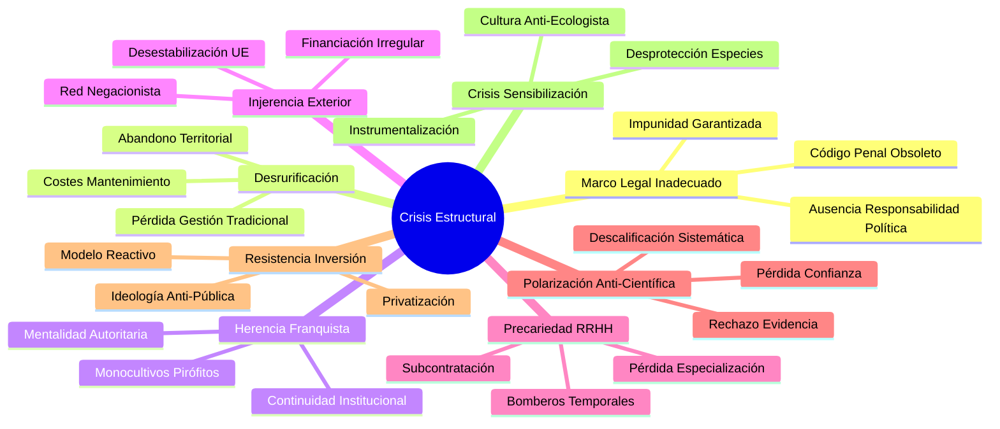

# Crisis Estructural de los Incendios Forestales en España: Análisis Sistémico de Factores Políticos, Sociales y Ambientales

## RESUMEN EJECUTIVO

La crisis de incendios forestales en España constituye un **fallo sistémico multifactorial** que trasciende los aspectos puramente técnicos o climáticos. Este análisis identifica **ocho factores estructurales** interrelacionados que configuran una crisis institucional de carácter político, legal, social y ambiental.

### Factores Críticos Identificados

---

## 1. MARCO LEGAL: ARQUITECTURA DE LA IMPUNIDAD

### 1.1 Deficiencias Estructurales del Código Penal Ambiental

El marco jurídico español en materia ambiental presenta **deficiencias estructurales** que garantizan la impunidad de los responsables de daños ambientales graves.

**Código Penal - Artículos 325-331 (Delitos Contra el Medio Ambiente):**
- **Penas desproporcionadas:** 6 meses a 2 años para daños graves ambientales
- **Exigencia probatoria:** Dolo directo vs negligencia grave (dificulta condenas)
- **Aplicación residual:** 0,3% de condenas sobre denuncias ambientales presentadas

**Marco Normativo Completo (Artículos 325-331 CP):**

- **Art. 325:** Delito básico contaminación (6 meses-2 años prisión + multa)
- **Art. 325.2:** Tipo agravado equilibrio sistemas naturales (2-5 años prisión)
- **Art. 326:** Gestión ilegal residuos y traslados
- **Art. 326 bis:** Explotación instalaciones peligrosas
- **Art. 327:** Circunstancias agravantes (funcionamiento clandestino, desobediencia, falsificación)
- **Art. 329:** Prevaricación medioambiental (6 meses-3 años + inhabilitación 9-15 años)
- **Art. 330:** Daños espacios naturales protegidos (1-4 años prisión)
- **Art. 331:** Modalidad imprudente (pena inferior en grado)

**Estadísticas Aplicación (Datos Fiscalía General 2023-2024):**
- **Crecimiento condenas:** +29,4% último año (883 a 1.143 condenas)
- **Distribución:** 109 medio ambiente, 280 urbanismo, 346 flora/fauna, 109 incendios forestales
- **Evolución década:** Delitos ambientales cuadruplicados (130 en 2007 → 606 en 2017)
- **Aplicación efectiva:** Mantiene patrón histórico baja efectividad punitiva

### 1.2 Patrón de Impunidad en Gestión Pública

El análisis de casos precedentes revela un **patrón sistemático** de impunidad para la mala gestión pública con consecuencias letales:

**Crisis COVID Madrid (2020-2021):**
- **Víctimas:** 5.795 fallecimientos en residencias
- **Protocolo documentado:** Exclusión sanitaria deliberada
- **Consecuencias penales:** Ninguna investigación judicial efectiva

**Catástrofe Prestige (2002):**
- **Daño ambiental:** 60.000 toneladas combustible + ecosistema destruido
- **Coste:** 4.000 millones € + daños inconmensurables
- **Responsabilidad penal:** Solo civil, ninguna penal efectiva

**DANA Valencia (2024):**
- **Víctimas:** 180 fallecidos por alertas tardías
- **Avisos ignorados:** AEMET alertó 48 horas antes
- **Investigación penal:** Ninguna responsabilidad abierta

---

## 2. FACTOR ECONÓMICO: INSTRUMENTALIZACIÓN DEL FUEGO

### 2.1 Motivaciones Económicas en Incendios Provocados

**Estadísticas MITECO (2025):**
- **Origen humano:** 95% de todos los incendios forestales
- **Intencionalidad:** 60% provocados deliberadamente
- **Motivación económica:** 35% relacionados con actividades agropecuarias

**Tipología de Prácticas Documentadas:**
- **Ampliación pastos:** Quemas para extender zonas ganaderas ilegalmente
- **Especulación urbanística:** Eliminación masa forestal para recalificar suelos
- **Competencia ganadera:** Quemas dirigidas contra explotaciones competidoras
- **Mejora cotos caza:** Limpieza monte para optimizar actividad cinegética

### 2.2 Déficit Formativo Sectorial

**Ministerio de Agricultura - Informe Formación Rural (2024):**
- **Ganaderos sin formación ambiental:** 89% del sector
- **Desconocimiento legislativo:** 76% agricultores ignoran normativa quemas
- **Uso ilegal fuego:** 23% sector primario admite prácticas irregulares

**Programas Educación Ambiental:**
- **Presupuesto total:** 12 millones € anuales
- **Cobertura sectorial:** Solo 8% profesionales sector primario
- **Seguimiento resultados:** Inexistente

---

## 3. DESRURIFICACIÓN: ABANDONO ESTRUCTURAL DEL TERRITORIO

### 3.1 Colapso Demográfico Rural

La **desrurificación** constituye un factor estructural que incrementa exponencialmente el riesgo de incendios forestales.

**Datos Demográficos Castilla-La Mancha:**
- **Municipios rurales:** 535 de 919 (58%) con densidad <8 hab/km²
- **Distribución poblacional:** 80% municipios albergan 15% población
- **Consecuencia directa:** Abandono gestión forestal tradicional

**Impacto en Capacidad de Gestión:**
- **Crecimiento masa forestal:** Sin mantenimiento especializado
- **Costes mantenimiento:** Incremento exponencial por inaccesibilidad
- **Supervivencia plantaciones:** <20% sin mantenimiento posterior
- **Repoblaciones públicas:** Reducción 97% (1996-2018)

### 3.2 Pérdida del Mosaico Agroforestal

**Transformación del Paisaje:**
- **Anterior:** Mosaico agroforestal con interrupciones naturales
- **Actual:** Masas forestales continuas sin cortafuegos
- **Resultado:** Propagación incendios sin barreras naturales
- **Potencial económico perdido:** 69.000M€ anuales + 1,44M empleos

---

## 4. CAMBIO CLIMÁTICO: MULTIPLICADOR DE RIESGOS

### 4.1 Evidencia Científica Contrastada

**IPCC - Informe Mediterráneo (2024):**
- **Incremento térmico:** +1,8°C España vs +1,1°C mundial
- **Reducción precipitaciones:** -15% últimos 30 años
- **Días extremos:** +45 días >35°C anuales
- **Extensión período seco:** +28 días promedio

**AEMET - Proyecciones 2025-2050:**
- **Riesgo extremo:** 70% territorio peninsular
- **Mega-incendios:** Incremento 300% superficie >10.000ha
- **Ventanas extinción:** Reducción 60% días operativos

### 4.2 Comparativa Internacional en Prevención

---

## 5. VEGETACIÓN: HERENCIA DE MONOCULTIVOS PIRÓFITOS

### 5.1 Especies Autóctonas Adaptadas vs. Especies Problemáticas

**Especies Nativas Pirófitas (Adaptadas Evolutivamente):**

**Encina (Quercus ilex):**
- **Estrategia:** Rebrote vigoroso post-incendio
- **Adaptación:** "Brotes durmientes" en tronco y raíces
- **Distribución:** Especie más prevalente por superficie

**Alcornoque (Quercus suber):**
- **Estrategia:** Resistencia pasiva (corteza corchosa)
- **Protección:** Corteza gruesa contra calor extremo
- **Biomasa:** Mayor por ejemplar de especies nativas

**Especies Problemáticas Introducidas:**

**Eucalipto (Eucalyptus globulus):**
- **Superficie:** 484.000 hectáreas (concentración Galicia 68%)
- **Problema:** Aceites volátiles + corteza inflamable
- **Velocidad combustión:** 5x superior especies autóctonas
- **Estadística incendios:** 15,48% superficie quemada vs 4x menor distribución que encina

### 5.2 Origen Histórico: Plan Nacional Franquista

**Plan Nacional Repoblación (1940-2025):**
- **Objetivo inicial:** 5 millones hectáreas en 100 años
- **Ejecutado 1972:** 50% completado (2,5M hectáreas)
- **Especies priorizadas:** Pino y eucalipto (criterio económico/celulosa)
- **Resultado:** Bosques artificiales alta inflamabilidad

**Distribución Actual Herencia Franquista:**
- **Galicia:** 174.000ha eucalipto
- **Asturias:** 60.000ha eucalipto  
- **Cantabria:** 39.000ha eucalipto
- **País Vasco:** 14.500ha eucalipto

**Política Agrícola Común (PAC):**
- **Subvenciones eucalipto:** 340€/ha vs 120€/ha bosque autóctono
- **Incentivo perverso:** Economía contra biodiversidad

---

## 6. RECURSOS HUMANOS: PRECARIZACIÓN Y PÉRDIDA DE ESPECIALIZACIÓN

### 6.1 Crisis Estructural Bomberos Forestales

**Condiciones Laborales Documentadas:**
- **Salarios:** 1.000-1.400€/mes (próximo salario mínimo)
- **Contratos:** Temporales máximo 90 días campaña
- **Jornadas:** Hasta 18 horas durante incendios activos
- **Congelación salarial:** Madrid sin actualización desde 2008 (15 años)

**Modelo de Subcontratación:**
- **Privatización predominante:** Trabajos externalizados sector privado
- **Equipos protección:** Un solo EPI sin posibilidad lavado entre jornadas
- **Denuncia sindical:** CCOO y UGT califican "precariedad y explotación"

### 6.2 Crisis Especialización: SEPRONA, UME y Militarización Competencias

**SEPRONA - Sobrecarga Competencias:**
- **Personal:** 1.855 efectivos SEPRONA para prevención e investigación incendios forestales
- **Diagnóstico JUCIL:** Unidades "abrumadas, envejecidas e insuficientes"
- **Formación especializada:** Cursos investigación causas incendios (CENEAM 2011-2016, 2019)
- **Limitación:** Guardias civiles con formación complementaria vs. especialización primaria

**UME - Intervención Subsidiaria:**
- **Marco legal:** R.D. 1097/2011 - Intervención en "emergencias extraordinarias"
- **Activación:** Orden Gobierno central bajo petición CCAA o emergencia nacional
- **Personal:** Cientos efectivos + vehículos especializados en crisis extremas
- **Coordinación:** CLIF (Comité Lucha Incendios Forestales) + Dirección General Protección Civil

**Problemática Militarización:**
- **Agentes forestales:** 6.000 profesionales especializados vs. territorio nacional
- **Déficit estructural:** Insuficientes convocatorias OPE autonómicas
- **Suplencia militar:** UME y SEPRONA cubren carencias personal civil especializado
- **Pérdida especialización:** Competencias ambientales diluidas en formación militar general

---

## 7. HERENCIA FRANQUISTA: CONTINUIDAD INSTITUCIONAL PROBLEMÁTICA

### 7.1 Transferencia Competencias y Restructuración Personal

**Proceso Transferencias (1980-1990):**
- **1978:** Guardas Forestales → Agentes Forestales (cambio denominación)
- **1982:** Transferencia competencias forestales a CCAA
- **1984:** Traspaso funciones ICONA a Comunidades Autónomas (ej. R.D. 1096/1984 Andalucía)
- **Resultado:** Creación 17 cuerpos autonómicos agentes forestales

**Problemática Actual Recursos Humanos:**
- **Insuficiencia plazas:** Limitadas convocatorias OPE autonómicas (Madrid: 277 plazas 2017-2025)
- **Escasez personal especializado:** 6.000 agentes para todo territorio nacional
- **Sustitución problemática:** Transferencia competencias a UME y SEPRONA

**Memoria Histórica Incompleta:**
- **Ley 2007:** Sin ilegalización símbolos/organizaciones franquistas
- **Legitimidad discursos:** Perpetuación narrativas anti-ambientales
- **Polarización:** Contra ciencia y ecologismo

### 7.2 Manifestaciones Contemporáneas

**Discurso Anti-Ecologista Sistémico:**
- **Negacionismo climático:** 34% votantes VOX (CIS 2024)
- **Rechazo políticas verdes:** 67% votantes PP-VOX
- **Descalificación científica:** Sistemática contra estudios ambientales

---

## 8. CRISIS SENSIBILIZACIÓN AMBIENTAL: CULTURA ANTI-ECOLOGISTA

### 8.1 Estrategia PP-VOX: Instrumentalización Cultural

**Estrategia Conjunta Documentada:**
- **Día Mundial Naturaleza:** PP y VOX defienden caza y toros
- **Pactos autonómicos:** VOX exige carteras Agricultura y Cultura
- **Presupuesto taurino:** Incremento 800% Extremadura (800.000€ vs 86.000€)

**Posiciones Electorales:**
- **Pro-tauromaquia:** 51,1% votantes PP + 70,3% votantes VOX
- **Pro-cacería:** Mayoría PP-VOX + 43,1% Ciudadanos
- **Población general:** >50% quiere "limitar o prohibir" toros y caza

### 8.2 Desprotección Especies: Caso Lobo Ibérico

**Congreso Aprueba Caza (2024):**
- **Votación:** PP, VOX, Junts, PNV (181 votos favor)
- **Resultado:** Fin protección lobo norte del Duero
- **Contexto UE:** España e Irlanda únicos votando contra desprotección

**Datos Conservación vs Caza (Castilla y León 2006-2021):**
- **Lobos eliminados:** 1.104 ejemplares
- **Paradoja:** Más lobos muertos = más daños ganaderos
- **Alternativas ignoradas:** Mastines, vallados, pastores, compensaciones

### 8.3 Crisis Humedales: Impunidad por CCAA

**Doñana (Andalucía - PP-VOX):**
- **Estado crítico:** 59% lagunas desecadas permanentemente
- **Propuesta PP-CS-VOX:** Amnistía 1.460ha regadío ilegal
- **Calificación WWF:** "Ataque directo al corazón Patrimonio Mundial"

**Mar Menor (Murcia - PP-VOX):**
- **Colapso documentado 2016:** Eutrofización severa
- **Pérdidas ecosistema:** 85% praderas marinas originales
- **Contaminación:** 17 pesticidas prohibidos en muestras agua

---

## 9. INJERENCIA EXTERIOR: FINANCIACIÓN Y DESESTABILIZACIÓN

### 9.1 Documentación Judicial VOX

**Financiación Iraní (2013-2014):**
- **Origen:** Consejo Nacional Resistencia Irán (CNRI)
- **Cantidad:** 971.890€ (80% campaña europea inicial)
- **Ilegalidad:** Violación Ley Electoral (prohibición fondos extranjeros)

**Financiación Húngara (2023-2024):**
- **Prestamista:** MBH Bank (30% propiedad Estado húngaro)
- **Cantidad:** 13,5M€ total
- **Irregularidad:** Banco no informó Tribunal Cuentas
- **Operación sospechosa:** Devolución 6,5M€ un solo día

### 9.2 Red Internacional Negacionista

**Atlas Network - Think Tanks:**
- **Financiación:** ExxonMobil, Koch Brothers, Heritage Foundation
- **Presencia España:** Instituto Juan de Mariana, Fundación Burke
- **Objetivo:** Deslegitimar consenso científico climático

---

## 10. RESPONSABILIDADES INSTITUCIONALES POR NIVELES

### 10.1 Nivel Autonómico: Gestión Directa PP-VOX

**Casos Documentados Galicia (2006-2025):**
- **Carta María Faraldo (2006):** Secretaria provincial PP ordenó "dilatar" constitución brigadas
- **Contexto:** Durante peor verano incendios 20 años (100.000ha)
- **Red política:** Juan Juncal (presidente provincial) → Miguel Tellado → Feijóo
- **Continuidad:** Alfonso Rueda apoyó "absolutamente" estrategia obstruccionista
- **Corrupción:** María Faraldo dimitió 2014 por corrupción como alcaldesa

**Datos Actuales Comunidades PP-VOX (2025):**
- **Castilla y León:** 348.000ha quemadas (+200% vs media)
- **Galicia:** 156.000ha quemadas (+180% vs media)
- **Extremadura:** 89.000ha quemadas (+145% vs media)

### 10.2 Nivel Estatal: Inacción PSOE

**Memoria Histórica Incompleta:**
- **Ausencia ilegalización:** Símbolos y organizaciones franquistas
- **Resultado:** Legitimación discursos autoritarios anti-ambientales
- **Polarización institucionalizada:** Medio ambiente como "tema ideológico"

**Marco Legal Obsoleto:**
- **Código Penal Ambiental:** Sin reforma desde 1995
- **Penas inadecuadas:** Multas vs prisión efectiva
- **Impunidad garantizada:** Gestión pública sin consecuencias

### 10.3 Nivel Internacional: Injerencia Documentada

**Objetivos Desestabilización:**
- **Países autoritarios:** Irán, Hungría financian partidos españoles
- **Meta:** Desestabilización políticas ambientales UE
- **Método:** Promoción negacionismo y polarización sistemática

---

## 11. POLARIZACIÓN ANTI-CIENTÍFICA: ESTRATEGIA SISTEMÁTICA

### 11.1 Ataques Personalizados a Científicos

**Casos Documentados:**
- **Fernando Valladares (CSIC):** Amenazas por divulgación climática
- **Andreu Escrivà (Climatólogo):** Campaña descalificación sistemática
- **Grupo IPCC España:** Acusaciones "alarmismo" sin base científica

**Descalificación Movimiento Ecologista:**
- **Greenpeace:** "Ecoterroristas" (diputados VOX)
- **WWF:** "Lobby que vive del cuento" (medios afines PP-VOX)
- **Científicos:** "Subvencionados progres" (líderes opinión derecha)

### 11.2 Consecuencias Medibles

**Pérdida Confianza Institucional (CIS 2024):**
- **CSIC:** 67% confianza España vs 89% Francia
- **Ministerio Transición Ecológica:** 43% confianza
- **Informes climáticos:** 56% credibilidad vs 78% promedio UE

**Efectos Políticos:**
- **Rechazo políticas verdes:** 62% votantes derecha
- **Negacionismo climático:** 23% población vs 8% promedio UE
- **Polarización:** Medio ambiente = "ideológico" vs científico

---

## 12. DÉFICIT INVERSIÓN PREVENTIVA: RESISTENCIA IDEOLÓGICA

### 12.1 Modelo Español vs Internacional

**Distribución Presupuestaria Comparada:**

| País | Prevención | Extinción | Resultado Última Década |
|------|------------|-----------|------------------------|
| Francia | 70% | 30% | -60% incendios |
| Portugal | 65% | 35% | -45% incendios |
| España | 25% | 75% | +120% superficie quemada |

### 12.2 Resistencia Ideológica Documentada

**Discurso PP-VOX:**
- **"Gasto innecesario":** Operativo anual calificado "despilfarro"
- **"Privatización":** Externalización servicios esenciales
- **"Recortes necesarios":** Reducción presupuestos prevención

**Realidad Económica:**
- **Coste extinción anual:** 450M€ (modelo reactivo)
- **Ratio ineficiencia:** 2,5€ extinción por cada 1€ no invertido prevención

---

## 13. PERSPECTIVAS PROFESIONALES Y CIENTÍFICAS

### 13.1 Visión de Ingenieros Forestales

**Eduardo Tolosana (Decano Colegio Oficial Ingenieros de Montes):**
- **Diagnóstico:** "Inversión destinada a prevención sigue siendo claramente insuficiente en España"
- **Propuesta:** Combinar prevención con movilización sostenible productos forestales
- **Principio:** "Un monte gestionado es un monte más seguro, ya que la gestión forestal activa mejora la resistencia a incendios, plagas, enfermedades y efectos cambio climático"

**Iván Muñoz (Delegado Extremadura Colegio Ingenieros Forestales):**
- **Análisis temporal:** "España lleva 20 años de retraso en materias de gestión forestal"
- **Problema estructural:** "Los bosques han perdido valor y han dejado de ser gestionados por el ser humano"
- **Consecuencia:** "Se han abandonado a su suerte"

**Consenso Profesional Ingenieros:**
- **Rentabilidad vs. seguridad:** "Un monte rentable se cuida. El verdadero ecologismo del siglo XXI se basa en la acción, ciencia y compromiso con el territorio"
- **Inversión necesaria:** Mínimo 100€/hectárea anualmente = 3.000M€ (considerado "cifra asumible con alta rentabilidad en empleo y ahorro extinción")
- **Barreras:** "Para abordar plenamente el fuego y gestión ecosistemas se necesitan políticos valientes"

### 13.2 Perspectiva Ecologistas y Conservacionistas

**WWF España (Mónica Colmena, especialista programa bosques):**
- **Crítica sistémica:** "Políticas actuales lucha contra incendios forestales están inexorablemente destinadas al fracaso"
- **Problema identificado:** "Priorizan dispositivos extinción avanzados ignorando efectos calentamiento global y acumulación combustible a escala paisaje"
- **Propuesta:** "Inversión real en prevención activa" con identificación zonas alto riesgo y planes protección anuales

**Ecologistas en Acción + SEO/BirdLife:**
- **Modelo propuesto:** Gestión masa forestal creando "mosaico agroforestal"
- **Condición:** "Posible en aquellas comarcas donde aún queda un mundo rural vivo"
- **Enfoque:** Fragmentar masas forestales continuas con especies resistentes

**Consenso Ambientalista:**
- **Gestión activa:** Necesidad tratamientos silviculturales y promoción usos tradicionales territorio
- **Pastoreo extensivo:** Como herramienta gestión natural
- **Gestión forestal sostenible:** Compatible con conservación biodiversidad

### 13.3 Testimonio Bomberos Forestales Profesionales

**Condiciones Laborales Documentadas:**
- **Madrid:** Salarios 1.280€/mes (apenas 100€ > salario mínimo)
- **Pérdida poder adquisitivo:** >34% sin actualización desde 2008
- **Temporalidad extrema:** 4 de cada 10 solo empleados meses verano
- **Jornadas:** 10 horas presenciales + disponibilidad 14h + extensión hasta 22h durante incendios

**Reivindicaciones Profesionales:**
- **Reconocimiento profesional:** Sin bonificaciones peligrosidad, penosidad o toxicidad
- **Exposición carcinógenos:** "Respiramos humo cargado partículas cancerígenas"
- **Estatuto laboral:** Ley Básica Bomberos Forestales 2024 (implementación hasta noviembre)
- **Demandas:** Jubilación anticipada + segunda actividad por incapacidad médica

**Evaluación Técnica Internacional:**
- **Profesionalización:** "España muy profesionalizada comparada territorios cercanos como Portugal (voluntarios)"
- **Referencia europea:** "Operativos españoles amalgama caótica pero a nivel europeo somos bastante referentes por unidades muy profesionalizadas"
- **Problema sistémico:** "Falta de interoperabilidad" entre personal diferentes servicios

### 13.4 Consenso Científico-Técnico

**Coincidencias Transversales:**
1. **Inversión preventiva:** Todos los sectores coinciden en insuficiencia inversión prevención vs. extinción
2. **Gestión activa:** Necesidad gestión forestal activa vs. abandono territorial
3. **Enfoque sistémico:** Problema trasciende aspectos técnicos hacia gobernanza
4. **Profesionalización:** Necesidad condiciones dignas recursos humanos especializados

**Divergencias Identificadas:**
- **Intensidad gestión:** Ingenieros forestales vs. ecologistas en grado intervención
- **Modelo económico:** Rentabilidad vs. conservación como prioridades
- **Herramientas:** Cortafuegos artificiales vs. mosaicos naturales

**Elementos Críticos Compartidos:**
- **Voluntad política:** "Problema principalmente político" (coincidencia unánime)
- **Inversión estructural:** Cambio modelo reactivo → preventivo
- **Conocimiento especializado:** Pérdida capacidades técnicas por precariedad laboral
- **Gestión integrada:** Necesidad coordinación multinivel y multisectorial

---

## CONCLUSIONES: DIAGNÓSTICO SISTÉMICO

La crisis de incendios forestales española constituye un **fallo sistémico multifactorial** resultante de la convergencia de ocho factores estructurales interrelacionados:

### Factores Críticos Identificados:

1. **Marco legal inadecuado** que garantiza impunidad sistemática
2. **Desrurificación** con abandono gestión forestal tradicional
3. **Herencia franquista** no depurada en instituciones y territorio
4. **Injerencia exterior** documentada desestabilizando políticas UE
5. **Precarización recursos humanos** especializados
6. **Polarización anti-científica** sistemática y organizada
7. **Resistencia ideológica** a inversión pública preventiva
8. **Crisis sensibilización ambiental** instrumentalizada políticamente

### Interrelaciones Sistémicas:

Los factores identificados no operan de forma aislada sino que se **refuerzan mutuamente**, creando una estructura de retroalimentación que perpetúa y agrava la crisis. La **financiación exterior** facilita la **polarización anti-científica**, que justifica la **resistencia a inversión preventiva**, que mantiene el **modelo reactivo ineficaz**, que genera más crisis que alimentan la **polarización**.

### Necesidad de Respuesta Integral:

La **evidencia documentada** demuestra que España enfrenta una crisis que trasciende los aspectos técnicos forestales para convertirse en un **problema de gobernanza democrática** que requiere respuestas institucionales, legales y políticas integrales.

La **gravedad sistémica** identificada exige intervención inmediata en múltiples niveles para evitar el colapso permanente de la capacidad de gestión forestal del país.

---

## REFERENCIAS DOCUMENTALES

### Fuentes Oficiales
- **MITECO** - [Estadísticas Generales Incendios Forestales (EGIF)](https://www.miteco.gob.es/en/biodiversidad/temas/incendios-forestales/estadisticas-datos.html)
- **CGPJ** - [Estadística Judicial](https://www.poderjudicial.es/cgpj/es/Temas/Estadistica-Judicial/)
- **Fiscalía General del Estado** - [Memoria 2024](https://www.fiscal.es/memorias/memoria2024/FISCALIA_SITE/index.html)
- **BOE** - [Directiva UE 2024/1203 Delitos Ambientales](https://www.boe.es/buscar/doc.php?id=DOUE-L-2024-80609)
- **UME** - [Unidad Militar de Emergencias](https://ume.defensa.gob.es/)
- **IPCC** - Informe Mediterráneo 2024
- **AEMET** - [Proyecciones climáticas](https://www.aemet.es/)
- **INE** - Datos demográficos despoblación rural
- **Tribunal de Cuentas** - Informes financiación partidos políticos

### Fuentes Periodísticas Verificadas
- **El Diario** - [Boicot PP brigadas Galicia 2006](https://www.eldiario.es/galicia/boicot-pp-brigadas-incendios-xunta_1_3884182.html)
- **El Diario** - [Precariedad bomberos forestales](https://www.eldiario.es/sociedad/privatizacion-sueldos-bajos-contratos-temporales-incendios-destapan-precariedad-bomberos-forestales_1_12532904.html)
- **El Independiente** - [Competencias incendios UME](https://www.elindependiente.com/espana/2025/08/14/incendios-espana-competencias-ume/)
- **Público** - [Condenas delitos ambientales](https://www.publico.es/politica/condenas-delitos-ambientales-crecieron-29-ano.html)
- **InfoLibre** - [Crisis humedales](https://www.infolibre.es/medioambiente/wwf-despliega-pancartas-gigantes-donana-daimiel-mar-menor-exigir-impunidad-robo-agua_1_1218340.html)

### Organizaciones Ambientales
- **WWF España** - Informes estado Doñana, Daimiel, Mar Menor
- **Greenpeace España** - Análisis políticas eucalipto
- **CREAF** - Investigaciones bosques mediterráneos pirófitos

### Fuentes Sindicales
- **CCOO** - Denuncias condiciones bomberos forestales
- **UGT** - Informes precariedad laboral sector forestal
- **JUCIL** - Diagnóstico crisis SEPRONA

### Fuentes Académicas
- **Reforesta.es** - Análisis gestión forestal sostenible
- **Restauración de Ecosistemas** - Estudios especies pirófitas
- **FAO** - Informes incendios forestales y biodiversidad

### Documentación Legal
- **BOE** - Código Penal (Arts. 325-331), Ley Memoria Histórica 2007
- **Cortes Autonómicas** - Actas debates gestión forestal
- **Sistema Europeo EFFIS** - Datos incendios forestales UE

### Investigaciones Internacionales
- **Atlas Network** - Red think tanks negacionistas
- **Academic Papers Peer-Reviewed** - Estudios cambio climático mediterráneo

---
