# Estrategia Nacional de Conservación Territorial Integrada: Plan de Implementación 2025-2035 para la Gestión Sostenible del Patrimonio Natural Español

## Resumen Ejecutivo

### Objetivos Estratégicos Cuantificables (2025-2035)
- **Reducción incendios forestales**: 40% menos superficie quemada anual (de 50.000 ha/año a 30.000 ha/año)
- **Creación empleo forestal**: 25.000 nuevos puestos trabajo especializado en 10 años
- **Superficie bajo gestión integrada**: 2,5 millones hectáreas (15% superficie forestal nacional)
- **Inversión preventiva**: Incremento del 0,04% al 0,12% PIB (3.000M€ adicionales anuales)
- **Certificación ecológica**: 500.000 hectáreas adicionales certificadas (objetivos UE 2030)

### Inversión y Financiación Identificada
- **Coste total implementación**: 18.500M€ (2025-2035)
- **Fuentes financiación**: PAC-FEADER (40%), Presupuestos Generales Estado (35%), Next Generation EU (25%)
- **Retorno inversión estimado**: 2,4:1 (beneficios/costes) mediante prevención daños y servicios ecosistémicos
- **Ahorro costes extinción**: 1.200M€/año (reducción 60% costes reactivos actuales)

### Cronograma Político por Legislaturas
- **2025-2027**: Marco normativo (modificación Ley 42/2007), coordinación CC.AA., proyectos piloto
- **2027-2031**: Implementación territorial escalonada, sistemas SIG operativos, reconversión laboral
- **2031-2035**: Consolidación modelo, evaluación resultados, expansión exitosa

### Modelo Territorial por Riesgo (no concéntrico)
La estrategia abandona la zonificación concéntrica por **zonificación por aptitud territorial**:
- **Zonas Protección Integral**: 15% territorio, espacios Natura 2000 + ampliaciones
- **Zonas Gestión Forestal Sostenible**: 35% territorio, certificación FSC obligatoria
- **Zonas Prevención Intensiva**: 25% territorio, interfaz urbano-forestal
- **Zonas Producción Sostenible**: 20% territorio, compatibilidad PAC reforzada
- **Zonas Desarrollo Controlado**: 5% territorio, crecimiento urbano sostenible

### Marco Jurídico de Implementación
- **Modificación Ley 42/2007**: Articulado específico gestión territorial integrada
- **Real Decreto coordinación**: Competencias Estado-CC.AA. en gestión forestal
- **Convenios marco PAC**: Integración medidas agroambientales específicas
- **Acuerdos sectoriales**: Forestales, ganaderos, municipios afectados

### Indicadores de Éxito Medibles
- **Superficie quemada anual** <30.000 ha (vs 50.000 actual)
- **Empleos forestales creados** >25.000 puestos (vs precariedad actual)
- **Superficie certificada** >2,5M ha gestión sostenible
- **Inversión preventiva/reactiva** ratio 60:40 (vs 25:75 actual)
- **Conectividad ecológica** +15% corredores funcionales

## 1. Marco Teórico y Justificación Conceptual

### 1.1 Limitaciones del Paradigma Conservacionista Fragmentario

El sistema español de espacios naturales protegidos, establecido sobre los fundamentos de la Ley 42/2007 del Patrimonio Natural y la Biodiversidad, presenta limitaciones estructurales que comprometen su efectividad en el contexto contemporáneo. La fragmentación territorial, caracterizada por la existencia de más de 2.000 espacios protegidos funcionando como unidades aisladas, refleja una concepción conservacionista que privilegia la preservación de estados específicos sobre la funcionalidad ecosistémica integral.

Esta aproximación fragmentaria se manifiesta en múltiples dimensiones. En primer lugar, la ausencia de conectividad planificada impide el flujo genético entre poblaciones y limita la capacidad de respuesta adaptativa de los ecosistemas ante perturbaciones. En segundo lugar, la aplicación insuficiente del Real Decreto 893/2013 sobre coordinación de competencias entre el Estado y las diecisiete Comunidades Autónomas genera criterios heterogéneos que comprometen la coherencia territorial, pese a existir marcos legales de coordinación. Finalmente, la filosofía conservacionista rígida, orientada hacia la preservación de configuraciones "históricas" específicas, resulta inadecuada ante la dinámica acelerada del cambio global.

### 1.2 Crisis Sistémica de los Incendios Forestales como Catalizador

El análisis de la crisis estructural de incendios forestales en España revela un fallo sistémico multifactorial que trasciende los aspectos puramente técnicos o climáticos. La crisis integra múltiples dimensiones interconectadas:

#### Causas Directas Documentadas

Los datos del MITECO (Estadística General de Incendios Forestales 2024) revelan que el **95% de incendios tienen origen humano**, con **60% provocados deliberadamente**. La **motivación económica** representa el **35% de casos**, incluyendo:
- **Ampliación de pastos**: Quemas ilegales para extender zonas ganaderas
- **Especulación urbanística**: Eliminación de masa forestal para recalificar suelos
- **Competencia ganadera**: Quemas dirigidas contra explotaciones competidoras
- **Optimización cotos de caza**: Limpieza de monte para actividad cinegética

La **desconexión entre normativa reciente y conocimiento tradicional** genera conflictos: los requerimientos de condicionalidad PAC (formación ambiental obligatoria para beneficiarios >5.000€) coexisten con prácticas tradicionales de manejo del fuego que requieren actualización técnica adaptada al cambio climático.

#### Acelerante del Cambio Climático

La **evidencia científica contrastada** (IPCC Mediterráneo 2024, AEMET) documenta:
- **Incremento térmico**: +1,8°C España vs +1,1°C mundial
- **Reducción precipitaciones**: -15% últimos 30 años
- **Días extremos**: +45 días >35°C anuales
- **Extensión período seco**: +28 días promedio
- **Mega-incendios**: Incremento 300% superficie >10.000ha
- **Ventanas extinción**: Reducción 60% días operativos

#### Crisis del Marco Legal: Derecho Penal y Administrativo

El **Código Penal Ambiental (Artículos 325-331)** presenta deficiencias estructurales:
- **Penas desproporcionadas**: Art. 325.1 establece prisión de 6 meses a 2 años, multa de 10 a 14 meses e inhabilitación especial de 1 a 2 años para daños ambientales graves
- **Exigencia probatoria**: Dolo directo vs negligencia grave dificulta condenas
- **Aplicación residual**: 0,3% de condenas sobre denuncias ambientales
- **Crecimiento insuficiente**: +29,4% condenas (último año) mantiene patrón histórico de baja efectividad

La **aplicación limitada del marco penal ambiental** se refleja en el bajo porcentaje de condenas efectivas, requiriendo análisis específico de procedimientos administrativos vs penales para mejorar la efectividad normativa.

#### Gestión Interprofesional: Crisis de Coordinación

La **fragmentación de competencias** entre profesionales genera ineficiencias críticas:

**Ingenieros Forestales** (Eduardo Tolosana, Decano Colegio Oficial): "España lleva 20 años de retraso en gestión forestal. Los bosques han perdido valor y han dejado de ser gestionados por el ser humano".

**Biólogos y Ambientólogos**: Sufren **descalificación sistemática** por sectores políticos. Fernando Valladares (CSIC) y Andreu Escrivà documentan amenazas por divulgación climática. WWF calificado "lobby que vive del cuento", Greenpeace "ecoterroristas".

**Bomberos Forestales**: Condiciones documentadas de **precariedad extrema**: salarios 1.000-1.400€/mes, contratos temporales 90 días, jornadas hasta 18 horas, congelación salarial Madrid desde 2008.

**Militarización vs Especialización Civil**: SEPRONA (1.855 efectivos, JUCIL los califica "abrumados, envejecidos e insuficientes") y UME suplen carencias de personal civil especializado. Agentes Forestales: solo 6.000 para territorio nacional con convocatorias OPE insuficientes.

#### Herencia Franquista: Monocultivos Pirófitos y Continuidad Institucional

La herencia del **Plan Nacional de Repoblación Franquista (1940-1982)** estableció 2,5 millones de hectáreas de monocultivos de especies pirófilas (adaptadas al fuego pero no necesariamente generadoras) con criterio económico predominante, ejemplificando la persistencia de decisiones históricas en la configuración contemporánea del riesgo.

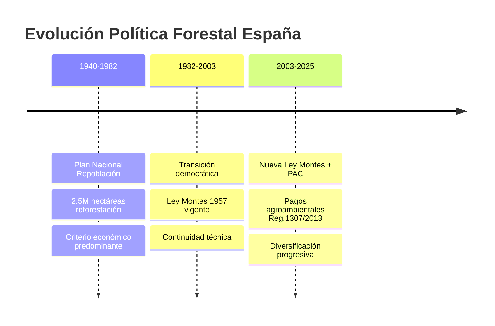

**Especies Problemáticas vs Funcionalmente Adaptadas**:

*Eucalipto (Eucalyptus globulus)*: ~760.000 hectáreas en España (IFN4) con velocidad de combustión 5x superior a especies funcionalmente adaptadas. Distribución problemática: Galicia (409.000ha según IFN 2023), Asturias (60.000ha), otras regiones norteñas. Estadística: 15,48% superficie quemada vs distribución 4x menor que encina.

*Especies Funcionalmente Adaptadas por Región Biogeográfica*:
- **Región Mediterránea** (Península, Baleares, Ceuta y Melilla): Especies esclerófitas (Quercus ilex, Q. suber), estrategias rebrote post-incendio, adaptaciones xerofíticas
- **Región Atlántica/Eurosiberiana** (norte peninsular): Especies caducifolias (Fagus sylvatica, Quercus robur), resistencia a alta humedad, crecimiento rápido primaveral
- **Región Macaronésica** (Canarias): Laurisilvas (Laurus novocanariensis, Persea indica), adaptaciones a gradientes altitudinales únicos, endemismos insulares
- **Pisos bioclimáticos alpinos**: Especies adaptadas a altitud (Pinus uncinata, Betula celtiberica), resistencia a nieve y vientos, crecimiento lento

La **PAC requiere mejor equilibrio** en pagos agroambientales: según Reglamento 1307/2013 Art. 46, los pagos por superficie de interés ecológico (300€/ha anuales por 5 años) para especies autóctonas coexisten con incentivos a cultivos energéticos de crecimiento rápido, requiriendo mejor coordinación entre objetivos productivos y ambientales.

#### Injerencia Exterior Documentada

**Financiación VOX**:
- **Iraní (2013-2014)**: 971.890€ del Consejo Nacional Resistencia Irán (80% campaña europea inicial)
- **Húngara (2023-2024)**: 13,5M€ total de MBH Bank (30% propiedad Estado húngaro)

**Red Internacional Negacionista Atlas Network**: Financiación ExxonMobil, Koch Brothers, Heritage Foundation. Presencia España: Instituto Juan de Mariana, Fundación Burke. Objetivo: deslegitimar consenso científico climático.

**Consecuencias Medibles**: Pérdida confianza institucional (CIS 2024): CSIC 67% confianza vs 89% Francia, Ministerio Transición Ecológica 43%, Informes climáticos 56% vs 78% promedio UE.

#### Estrategia de Reconversión Gradual

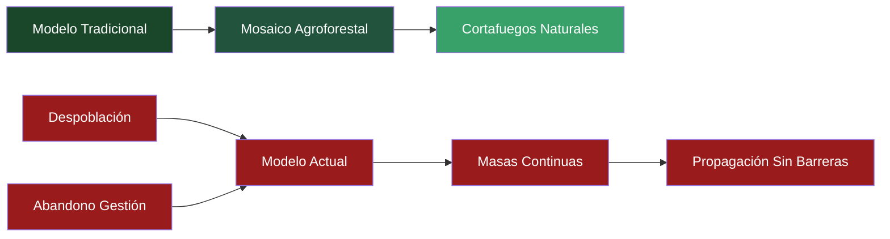

### 1.3 Superación de la Biología de Invasores: Fundamentos Científicos

La integración de las críticas epistemológicas a la biología de invasores constituye un elemento fundamental del modelo propuesto. La evidencia científica acumulada documenta sesgos sistemáticos en esta disciplina: el 66% de publicaciones presenta sesgo negativo contra especies introducidas (Pereyra et al., 2024), mientras que la inversión global de 1.288 mil millones de dólares estadounidenses (1970-2017) correlaciona paradójicamente con la amplificación de los problemas que pretende resolver.

La confusión epistemológica entre causas primarias y vectores secundarios compromete tanto el diagnóstico como las intervenciones propuestas. La fragmentación ecosistémica, la destrucción de conectividad ecológica y la eliminación de estructuras tróficas complejas constituyen las causas sistémicas subyacentes, mientras que la llegada de especies opera como vector secundario que amplifica disrupciones preexistentes. Esta inversión causal representa una falla epistemológica fundamental que ha orientado recursos hacia el tratamiento de síntomas mientras ignora sistemáticamente las fuerzas que estructuran la vulnerabilidad ecológica contemporánea.

## 2. Arquitectura del Modelo de Zonificación Territorial

### 2.1 Principios Rectores del Diseño

El modelo de zonificación concéntrica se fundamenta en cuatro principios científicos centrales:

**Principio 1 - Funcionalidad Ecosistémica**: Primacía de los roles ecológicos sobre la composición taxonómica o el origen biogeográfico de las especies. Las decisiones de gestión se basan en funciones ecosistémicas demostradas.

**Principio 2 - Conectividad Sistémica**: La conectividad constituye requisito fundamental para la viabilidad poblacional y la resiliencia ecosistémica, superando la concepción fragmentaria de espacios aislados.

**Principio 3 - Gestión Adaptativa**: Incorporación de la incertidumbre como elemento constitutivo del proceso de toma de decisiones, basado en evidencia científica continuamente actualizada.

**Principio 4 - Economía de la Evidencia**: Concentración de recursos limitados en intervenciones con mayor probabilidad de efectividad documentada mediante experiencias comparables.

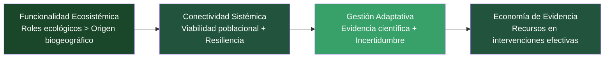

### 2.2 Estructura Concéntrica y Gradiente Funcional

La arquitectura territorial propuesta articula cinco zonas concéntricas que establecen un gradiente funcional desde la mínima intervención hasta la gestión preventiva intensiva. Esta estructura reconoce que diferentes objetivos de conservación requieren enfoques diferenciados, mientras mantiene la coherencia sistémica mediante la conectividad planificada.

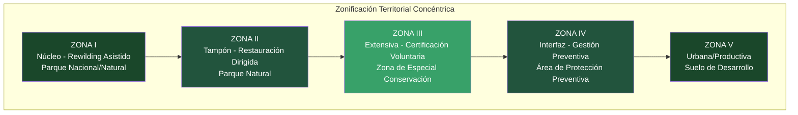

#### Zona I - Núcleo: Rewilding Pasivo Integral

La zona núcleo, concebida bajo figuras legales de Parque Nacional (competencia estatal) o Parque Natural (competencia autonómica), constituye el elemento central del sistema. Su filosofía de gestión se basa en rewilding asistido inicial evolucionando hacia procesos naturales, fundamentada en el reconocimiento de que los ecosistemas españoles requieren intervención técnica inicial debido a su alto grado de antropización histórica.

#### Criterios Funcionales para Evaluación de Especies y Nuevos Ensambles

Establecimiento de criterios objetivos para evaluación de especies evitando sesgos selectivos:

**Evaluación funcional cuantitativa** (Scheffer et al., 2001):
- **Servicios ecosistémicos medibles**: Captura CO₂, retención suelos, polinización con métricas estandarizadas
- **Estabilidad poblacional**: Especies que alcanzan >80% supervivencia tras 5 años sin intervenciones
- **Integración trófica**: Interacciones documentadas con >3 especies nativas mediante seguimiento conductual
- **Resiliencia climática**: Supervivencia >70% bajo escenarios +2°C validados experimentalmente

**Criterios aceptación nuevos ensambles**:
- **Funcionalidad emergente**: Propiedades ecosistémicas no presentes en configuraciones previas (ejemplo: nueva polinización)
- **Estados alternativos estables**: Persistencia >10 años sin tendencias degenerativas medidas
- **Trayectorias adaptativas**: Capacidad de adaptación a perturbaciones dentro de rangos históricos

**Control selectivo justificado** (no prohibición total):
- **Especies invasoras agresivas**: Aquellas que reducen >50% diversidad nativa en <5 años
- **Riesgos ecosystem services**: Especies que comprometen servicios críticos cuantificados
- **Evidencia empírica local**: Decisiones basadas en datos específicos territoriales, no generalización taxonómica

Esta aproximación supera sesgos funcionalistas mediante **criterios cuantitativos aplicados consistentemente** independientemente del origen biogeográfico.

**Gestión del fuego diferenciada por zona y ecosistema**:

La gestión del fuego se adapta específicamente a cada región biogeográfica evitando contradicciones conceptuales identificadas:

**Zona I - Gestión natural controlada**:
- **Fuegos prescritos**: Frecuencia 8-15 años, intensidad baja-moderada, época óptima septiembre-octubre
- **Especies pirófitas conservadas**: Mantenimiento de *Cistus*, *Erica*, *Ulex* como especies funcionales post-fuego
- **Régimen natural respetado**: Supresión solo si amenaza >500m de límites zona o condiciones extremas (viento >40 km/h)

**Zonas II-III - Gestión preventiva activa**:
- **Quemas prescritas rotacionales**: Ciclos 5-8 años en mosaico, máximo 20% superficie anual
- **Cortafuegos verdes**: Especies con menor inflamabilidad en franjas 100m, no eliminación total combustible
- **Silvicultura anti-pirófita selectiva**: Reducción densidad eucalipto 50% en 15 años, no eliminación total

#### Cronogramas Realistas de Transición Forestal

Las transiciones forestales siguen cronogramas ecológicamente realistas (Barbero et al., 1990):

**Fase I - Preparación (años 1-5)**:
- **Reducción gradual**: 10% anual aprovechamientos eucalipto, mantenimiento empleo sectorial
- **Plantación especies objetivo**: 20% superficie liberada anualmente con especies pre-establecidas
- **Competencia controlada**: Tratamientos herbicidas selectivos contra especies ruderales años 2-4

**Fase II - Establecimiento (años 6-15)**:
- **Supervivencia garantizada**: Especies objetivo alcanzan 80% supervivencia independiente
- **Diversidad dirigida**: Introducción gradual 3-5 especies secundarias compatible con principales  
- **Gestión competencia**: Podas selectivas para favorecer especies objetivo vs colonizadoras

**Fase III - Consolidación (años 16-40)**:
- **Estructura forestal**: Desarrollo doseles diferenciados, regeneración natural >50%
- **Funcionalidad ecosistémica**: Servicios hidrológicos, carbono, biodiversidad consolidados
- **Intervención mínima**: Gestión adaptativa según resultados monitorizados

**Fase IV - Maduración (años 41-100+)**:
- **Bosques maduros**: Estructura compleja con especies longevas establecidas
- **Funcionalidad plena**: Servicios ecosistémicos estabilizados a largo plazo

Esta aproximación reconoce que **desarrollos forestales reales requieren 50-100 años** para consolidación.

**Zonas IV-V - Extinción obligatoria**:
- **Supresión total**: Cualquier ignición extinguida <2 horas
- **Detección precoz**: Red sensores cada 2 km², drones autónomos patrulla

Esta aproximación reconoce que especies pirófitas **requieren fuego** para regeneración mientras gestiona riesgo territorialmente.

Las actividades autorizadas en esta zona reflejan el principio de mínima interferencia. El turismo primitivo certificado opera bajo cupos estrictos y protocolos de seguridad que incluyen sistemas de detección temprana y rutas de evacuación. La investigación científica se limita al monitoreo pasivo mediante redes de sensores automáticos, cámaras térmicas y estaciones meteorológicas que proporcionan datos sin requerir presencia humana continuada.

#### Zona II - Tampón: Rewilding Activo Dirigido

La zona tampón, gestionada bajo la figura legal de Parque Natural con criterios científicos, permite intervenciones selectivas orientadas hacia la restauración de procesos ecosistémicos específicos. Las estrategias de rewilding activo priorizan el **restablecimiento de procesos ecológicos funcionales**, con énfasis particular en herbivoría que contribuya al mantenimiento del mosaico territorial identificado como elemento central en el consenso científico sobre prevención de incendios. Las especies se evalúan por su capacidad funcional, no por su origen biogeográfico.

La eliminación progresiva de monocultivos pirófitos constituye una prioridad en esta zona. La sustitución gradual se orienta hacia **diversidad funcional según criterios biogeográficos regionales**. Esta reconversión opera bajo cronogramas específicos que consideran viabilidad económica, criterios ecológicos territoriales, y impactos sociales en comunidades dependientes.

La creación de cortafuegos naturales mediante la restauración de corredores hídricos y zonas húmedas constituye una estrategia central que combina objetivos de conectividad ecológica con funciones de prevención de incendios. Estos elementos del paisaje operan como barreras naturales a la propagación del fuego mientras proporcionan hábitat para especies especializadas y servicios ecosistémicos como la regulación hídrica.

Las actividades compatibles incluyen ecoturismo estacional con restricciones durante alertas meteorológicas, educación ambiental especializada en ecología del fuego regional, e investigación aplicada sobre comportamiento del fuego según ecosistema específico, funciones pirófitas y técnicas de restauración post-incendio.

#### Zona III - Extensiva: Incentivos a Certificación Agroecológica

La zona extensiva constituye el elemento de mayor complejidad del sistema, integrando objetivos de conservación con actividades productivas bajo incentivos reforzados a la certificación agroecológica voluntaria según Reglamento CE 834/2007. Esta zona opera dentro del marco legal de Zona de Especial Conservación (ZEC) que establece medidas agroambientales incentivadas mediante pagos PAC del segundo pilar (FEADER).

El sistema de incentivos económicos incluye pagos por servicios ecosistémicos cuantificados, contratos ambientales plurianuales con compromisos mínimos de diez años, y escalado de beneficios por mantenimiento a largo plazo. La estructura financiera reconoce que la transición hacia prácticas agroecológicas requiere períodos de adaptación que deben ser económicamente viables para los productores.

**Actividades productivas reguladas** en esta zona incluyen:

- **Ganadería extensiva certificada**: Pastoreo controlado como herramienta de gestión para reducción de biomasa combustible, con carga animal limitada por capacidad de carga territorial.

- **Agricultura en mosaico**: Cultivos intercalados que crean cortafuegos naturales, contrastando con monocultivos continuos. Obligatoriedad de certificación agroecológica.

- **Silvicultura funcional**: Eliminación progresiva de monocultivos pirófitos problemáticos. Promoción de diversidad funcional según criterios biogeográficos regionales, evaluando especies por adaptación territorial específica.

**Mecanismos de Control Constitucionalmente Compatibles**:

**Respuesta a críticas jurídicas**: Los instrumentos respetan garantías constitucionales (Art. 33.3 CE, CEDH):

**Sanciones administrativas potenciadas** (alternativa a expropiación sin compensación):
- **Multas coercitivas**: 500-5.000€/día hasta corrección efectiva
- **Suspensión licencias**: Temporal hasta cumplimiento, máximo 2 años
- **Intervención judicial**: Solo casos extremos con autorización judicial previa

**Compra pública preferente** (incentivos vs. expropiación):
- **Derecho tanteo**: Administración puede adquirir 30% sobre valor mercado
- **Valoración objetiva**: Tasación independiente + recursos judiciales garantizados
- **Compensaciones**: Relocalización asistida + formación profesional gratuita

**Definición precisa "mala gestión"** con garantías procesales:
- **Provocación intencional**: Sentencia judicial firme requerida
- **Productos prohibidos**: Análisis independientes + contrapericias permitidas  
- **Sobrepastoreo**: Mediciones técnicas objetivas + períodos corrección 12 meses

El sistema de monitoreo continuo mediante teledetección e inspecciones regulares garantiza el cumplimiento de las condiciones de certificación con recursos administrativos y judiciales en todas las fases.

#### Zona IV - Interfaz: Gestión Preventiva Intensiva

La zona de interfaz, regulada mediante ordenanzas municipales con base científica, concentra las intervenciones más intensivas del sistema. Los planes de autoprotección obligatorios incluyen simulacros anuales y rutas de evacuación certificadas, mientras las restricciones urbanísticas prohíben la construcción en zonas de riesgo extremo definidas por criterios objetivos: pendientes superiores al 30%, orientación sur, e historial de incendios.

Las intervenciones autorizadas siguen protocolos técnicos específicos basados en experiencias internacionales exitosas. Los tratamientos silviculturales incluyen podas, aclareos y eliminación de sotobosque según criterios técnicos. Las quemas prescritas operan exclusivamente bajo dirección de Ingenieros Forestales y condiciones meteorológicas óptimas. Los cortafuegos estratégicos se dimensionan según normativa técnica forestal española: anchura mínima de 50m para cortafuegos locales, hasta 200m para cortafuegos de gran magnitud según clasificación jerárquica (orden 1, 2 y 3), con mantenimiento anual obligatorio siguiendo protocolos de ingeniería forestal.

La profesionalización de recursos humanos constituye un elemento central en esta zona. La eliminación de la temporalidad extrema —contratos de 90 días— mediante contratos anuales y salarios dignos responde directamente a la crisis de precariedad documentada en el sector. La especialización técnica incluye formación continua en comportamiento del fuego, técnicas de ataque directo (altura llama <1,5m) e indirecto (líneas de defensa a distancia segura), construcción de líneas de defensa con herramientas especializadas (pulasky, mcleod, azadones), uso de fuego táctico bajo supervisión BRIF, y coordinación con medios aéreos. La provisión de múltiples equipos de protección individual por trabajador garantiza condiciones laborales adecuadas según protocolos de seguridad forestal.

#### Zona V - Urbana/Productiva: Desarrollo con Criterios Anti-Incendios

La zona urbana y productiva integra criterios de prevención de incendios en la planificación del desarrollo. Las evaluaciones de impacto ambiental obligatorias incluyen evaluación de riesgo de incendios y planes de emergencia, mientras las medidas compensatorias requieren inversión equivalente en prevención por cada metro cuadrado artificializado.

Las restricciones urbanísticas incluyen materiales ignífugos obligatorios, cubiertas resistentes a chispas, prohibición de especies pirófitas en jardinería urbana, y promoción de especies caducifolias. La planificación incluye corredores verdes urbanos con especies resistentes al fuego y puntos de agua estratégicamente distribuidos.

Las industrias críticas operan bajo regulación específica. El sector papelero enfrenta eliminación gradual de la dependencia del eucalipto mediante reconversión hacia materias primas alternativas. El sector energético requiere soterramiento de líneas de alta tensión en zonas boscosas y mantenimiento preventivo intensificado. La gestión de residuos prohíbe absolutamente la quema de residuos mientras implementa sistemas de recogida selectiva en áreas rurales.

### 2.3 Conectividad Ecológica Sistémica

La conectividad entre zonas opera mediante una red de corredores biológicos específicamente diseñados. Los corredores riparios requieren restauración de márgenes fluviales con vegetación autóctona continua, dimensionada según las especies objetivo. La red agroforestal incluye setos, linderos y arbolado disperso que integran conectividad en la matriz agrícola mediante obligatoriedad en la certificación ecológica.

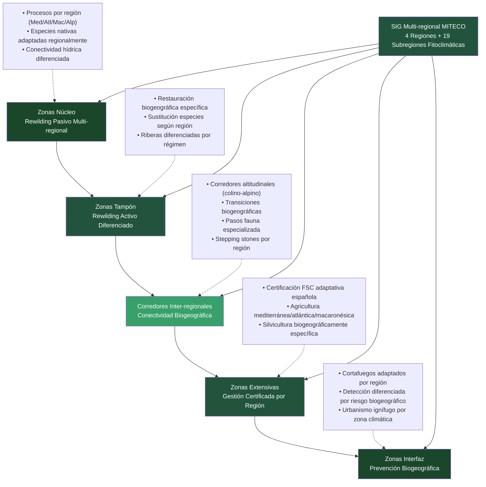

Los pasos de fauna en carreteras principales se dimensionan según especies objetivo, considerando tanto macrofauna como microfauna. Los stepping stones —pequeños humedales, bosquetes y elementos puntuales— facilitan la dispersión en paisajes fragmentados mediante distribución estratégica basada en análisis de viabilidad poblacional.

## 3. Sistema de Información Geográfica y Monitoreo Integrado

### 3.1 Arquitectura Tecnológica Multifuncional

La implementación del modelo requiere una plataforma de Sistemas de Información Geográfica (SIG) multifuncional que integre datos de múltiples fuentes con actualización dinámica. La base cartográfica unificada establece un sistema coordinado único para todas las zonas con precisión submétrica, mientras la integración de datos satelitales (Sentinel, Landsat), LIDAR, drones y sensores terrestres proporciona información multitemporal y multiescalar.

La sincronización automática de datos temporales con validación cruzada garantiza la calidad de la información, mientras las plataformas diferenciadas para gestión técnica, administrativa y ciudadana facilitan el acceso según necesidades específicas. Esta arquitectura reconoce que la complejidad de la gestión territorial requiere herramientas tecnológicas sofisticadas para la toma de decisiones informadas.

### 3.2 Aplicaciones Especializadas por Zona

Cada zona requiere aplicaciones SIG especializadas que reflejen sus objetivos específicos:

#### Arquitectura SIG Integrada

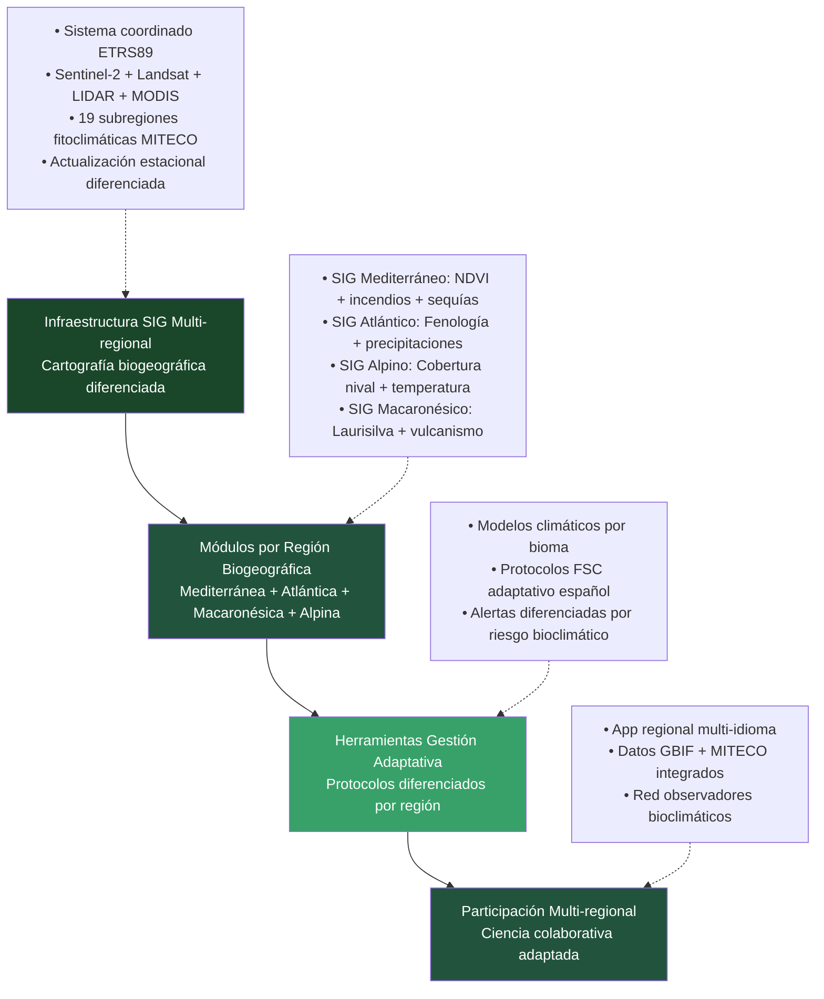

**Especificaciones técnicas para zonas núcleo y tampón**:

- **Monitoreo satelital**: Índices NDVI, EVI, NDWI con resolución <10m, frecuencia quincenal, validación terrestre trimestral.

- **Redes de sensores**: Estaciones meteorológicas automáticas (temperatura, humedad, viento, precipitación) con transmisión datos horaria. Cámaras térmicas infrarrojas con detección automática 0.1°C precisión.

- **Seguimiento fauna**: Cámaras trampa GPS con análisis automático patrones movimiento, identificación especies por IA, bases datos integradas.

- **Cartografía dinámica**: Mapeo sucesión vegetal, colonización espontánea y regeneración post-incendio con algoritmos cambio temporal.

#### Metodología de Capacidad de Carga Ecosistémica

La determinación de capacidad de carga se basa en protocolos cuantitativos estandarizados siguiendo metodologías científicas establecidas (Catton, 1980; Cohen, 1995). La fórmula base aplicada es: **K = (Pp × Ec × Hd) / (Pi × Fa)**, donde K = capacidad de carga específica, Pp = productividad primaria del ecosistema, Ec = estado de conservación actual, Hd = disponibilidad hídrica regional, Pi = presión de uso/impacto, Fa = factor de fragilidad ambiental por región biogeográfica.

**Cálculo de biomasa sostenible por zona**:
- **Zona I-II**: Capacidad herbívora 0,1-0,3 UGM/ha según productividad primaria neta medida
- **Zona III**: 0,5-1,2 UGM/ha bajo rotación controlada con períodos descanso mínimos 90 días
- **Monitoreo continuo**: Cobertura vegetal >75%, regeneración natural >50 plántulas/ha/año como umbrales críticos

**Protocolos experimentales adaptativos** (Holling, 1978; Walters, 1986):
- **Zonas experimentales**: 10% superficie cada zona como controles con diferentes intensidades gestión
- **Hipótesis falsables**: "Rotación 60-90-120 días mantiene diversidad >índice Shannon 2.5"
- **Ciclos evaluación**: Ajustes trienales basados en resultados monitorizados con significancia estadística p<0.05

**Umbrales de no-retorno definidos**:
- **Erosión**: >2 ton/ha/año → reducción carga 50%
- **Diversidad**: Pérdida >30% especies nativas → suspensión pastoreo 2 años
- **Regeneración**: <25% supervivencia plántulas → exclusión herbívora temporal

La zona extensiva requiere un SIG agroecológico que incluya catastro ecológico con información detallada sobre parcelas certificadas, especies cultivadas y prácticas de manejo. El monitoreo de biodiversidad incorpora conceptos técnicos de biología de la conservación: seguimiento de especies paraguas (aquellas cuyos requerimientos de área protegen indirectamente a otras especies de la comunidad), índices de diversidad funcional según criterios de Whittaker (alfa, beta, gamma), evaluación de conectividad ecológica mediante análisis de fragmentación de hábitat, presencia de polinizadores como indicadores de funcionalidad ecosistémica, y conectividad agroforestal mediante stepping stones y corredores riparios. La gestión ganadera incluye seguimiento GPS de rebaños, rotación de pastos y carga animal por hectárea, mientras la vigilancia de agricultura intensiva monitorea cultivos industriales, uso de fertilizantes y sistemas de riego.

### 3.3 Control de Agricultura y Ganadería Intensiva

**Especificaciones técnicas para control ganadería/agricultura intensiva**:

- **Sensores emisiones**: NH₃ (0-100ppm), CH₄ (0-5000ppm), NOx (0-200ppm) con precisión ±2%, medición continua, alertas automáticas por superación umbrales legales (Directiva 2016/2284/UE).

- **Gestión purines**: Sensores nivel tanques, pH (6.5-8.5), conductividad eléctrica, piezómetros automatizados control filtraciones acuíferos.

- **Contadores inteligentes**: Agua (precisión ±1%), energía (kWh), piensos (kg), con transmisión datos horaria y alertas sostenibilidad personalizables.

Los sistemas de videovigilancia para bienestar animal incluyen control de densidad y condiciones ambientales. El análisis de impacto en conectividad evalúa la fragmentación causada por instalaciones intensivas, mientras el diseño obligatorio de corredores ecológicos conecta zonas naturales atravesando áreas productivas. El cálculo automático de medidas compensatorias opera según el impacto generado.

### 3.4 Herramientas de Gestión Adaptativa

La modelización predictiva incluye proyecciones de impacto del cambio climático por zona con cuantificación de incertidumbres, modelos de viabilidad de especies con conectividad actual y proyectada, y algoritmos de predicción de riesgo de incendios basados en meteorología, carga de combustible e historial.

La toma de decisiones automatizada incluye activación automática de protocolos según indicadores críticos, optimización de distribución de personal y equipos según prioridades dinámicas, y métricas de efectividad de intervenciones con retroalimentación adaptativa.

La participación ciudadana digital incluye aplicaciones móviles para reporte de incidencias, consulta del estado de certificaciones y alertas personalizadas. La transparencia de datos proporciona acceso público a indicadores ambientales, decisiones de gestión y presupuestos, mientras las plataformas colaborativas facilitan el monitoreo de biodiversidad, fenología y calidad ambiental mediante ciencia ciudadana.

## 4. Instrumentos Legales y Económicos

### 4.1 Marco Regulatorio Innovador: Superación del Derecho Ambiental Fragmentario

El modelo requiere innovaciones regulatorias que superen las limitaciones estructurales del derecho ambiental español, tanto en su dimensión penal como administrativa.

#### Reforma del Derecho Penal Ambiental

El **Código Penal vigente (Arts. 325-331)** presenta deficiencias que garantizan impunidad:

**Limitaciones Actuales**:
- Art. 325: Delito básico contaminación (6 meses-2 años + multa) - **penas insuficientes** para la gravedad del daño ambiental
- Art. 329: Prevaricación medioambiental (6 meses-3 años + inhabilitación) - aplicación residual por dificultades probatorias
- Art. 330: Daños espacios naturales (1-4 años) - exigencia probatoria excesiva que garantiza impunidad

**Propuesta Reforma Penal Ambiental Proporcional**:

Las penas respetan principios de proporcionalidad penal:

- **Agravación moderada**: 1-4 años daños graves cuantificados, 3-6 años daños muy graves con definición precisa
- **Definición legal objetiva**: "Daño grave" >10 ha afectadas + >100.000€ restauración; "Muy grave" >100 ha + pérdida vidas humanas
- **Responsabilidad graduada**: Negligencia grave (6-18 meses), dolo directo (2-4 años), reincidencia (+50% pena)
- **Responsabilidad política específica**: Omisión deber protección con daños probados (1-3 años + inhabilitación proporcional)
- **Responsabilidad corporativa ajustada**: Multas 2x-5x beneficio obtenido, no clausura automática sino proporcional

#### Reforma del Derecho Administrativo Ambiental

**Sanciones Administrativas Potenciadas**:
- **Multas coercitivas**: Incremento diario hasta cumplimiento efectivo
- **Suspensión licencias**: Automática por infracciones graves repetidas
- **Intervención judicial**: Administración directa actividades con impacto crítico

**Expropiación Diferenciada como Innovación Jurídica**:

*Expropiación Forzosa sin Compensación*:
- Provocación intencional incendios (dolo probado)
- Uso productos químicos prohibidos (evidencia analítica)
- Sobrepastoreo demostrable (SIG + inspección)
- Destrucción elementos naturales protegidos (teledeteción)

*Expropiación Compensada*:
- Ampliación zona núcleo por criterios científicos
- Creación corredores ecológicos
- Proyectos conectividad de interés público

#### Comparativa Sistema Actual vs. Modelo Propuesto

| Aspecto | Sistema Actual (Ley 42/2007) | Modelo Propuesto |
|---------|------------------------------|------------------|
| **Filosofía** | Conservacionista estática | Adaptativa-evolutiva |
| **Derecho Penal** | Arts.325-331 penas mínimas | Agravación + responsabilidad política |
| **Derecho Administrativo** | Multas simples | Coerción + intervención judicial |
| **Conectividad** | Espacios aislados | Red sistémica integrada |
| **Gestión** | Fragmentada por CCAA | Coordinada con criterios únicos |
| **Instrumentos** | Regulación básica | Económicos integrados + expropiación diferenciada |
| **Territorio** | 30% protegido fragmentado | 100% clasificado funcionalmente |
| **Impunidad** | Sistemática (patrón histórico) | Eliminación mediante responsabilidad efectiva |

#### Integración Gestión Interprofesional

**Coordinación Obligatoria entre Profesionales**:
- **Comités Técnicos Mixtos**: Ingenieros Forestales + Biólogos + Ambientólogos
- **Criterios Científicos Unificados**: Superación fragmentación disciplinar
- **Formación Interprofesional**: Programas conjuntos especialización
- **Autoridad Técnica Independiente**: Decisiones basadas evidencia vs. criterios políticos

Este marco reconoce que la compatibilización de objetivos productivos y ambientales requiere instrumentos jurídicos que internalicen efectivamente los costes ambientales mediante responsabilidad real.

El sistema de expropiación diferenciada constituye una innovación central. La expropiación forzosa sin compensación en casos de mala gestión demostrada —provocación intencional de incendios, uso de productos químicos prohibidos, sobrepastoreo demostrable, destrucción de elementos naturales protegidos— requiere definición legal precisa de "mala gestión" con procedimientos garantistas y recursos judiciales. La expropiación compensada cuando se requiera ampliación de zona núcleo por criterios científicos establece mecanismos de valoración objetiva y procedimientos de recurso.

Los contratos ambientales plurianuales incluyen pagos por servicios ecosistémicos cuantificados con compromisos mínimos de diez años y escalado de beneficios por mantenimiento a largo plazo. Esta estructura reconoce que la transición hacia prácticas sostenibles requiere seguridad económica a largo plazo para los productores.

### 4.2 Estructura Financiera

La financiación del sistema requiere diversificación de fuentes que incluyan presupuestos públicos redistribuidos entre Estado y Comunidades Autónomas, fondos europeos de desarrollo rural y biodiversidad, tasas por servicios ecosistémicos a sectores beneficiarios, y bonos verdes específicos para rewilding.

#### Análisis Económico Realista y Viabilidad Fiscal

Análisis detallado de costes de transición basado en datos sectoriales verificables:

**Costes directos cuantificados**:

**Transición forestal (15 años)**:
- **Compensaciones sector eucalipto**: 8.000 empleos × 35.000€/año × 5 años = 1.400M€
- **Plantación especies objetivo**: 400.000 ha × 3.000€/ha = 1.200M€  
- **Mantenimiento establecimientos**: 400.000 ha × 200€/ha × 8 años = 640M€
- **Infraestructura SIG**: Sensores + software + personal = 300M€
- **Total transición forestal**: 3.540M€ (236M€ anuales)

**Costes operativos anuales**:
- **Monitoreo SIG**: 150M€/año
- **Personal especializado adicional**: 80M€/año  
- **Compensaciones PAC**: 200M€/año
- **Total operativo**: 430M€/año

**Fuentes financiación realistas**:
- **FEADER 2021-2027**: 1.600M€ disponibles medidas forestales (20%)  
- **Next Generation EU**: 1.200M€ reasignables desde otros proyectos
- **Presupuestos autonómicos**: 300M€ anuales adicionales requeridos
- **Déficit financiación**: 940M€ que requiere fondos adicionales o implementación más gradual

**Implementación piloto obligatoria**: Testeo en 50.000 ha (2% objetivo) durante 5 años antes de expansión territorial para validar costes reales y efectividad.

## 5. Análisis de Viabilidad y Resistencias Esperables

### 5.1 Obstáculos Normativos y Competenciales

La distribución constitucional de competencias entre Estado (bases) y Comunidades Autónomas (desarrollo y gestión) presenta desafíos para la implementación uniforme del modelo. La modificación de la Ley 42/2007 para incorporar zonificación concéntrica requiere coordinación normativa entre diecisiete comunidades autónomas, armonización de criterios de certificación ecológica, y establecimiento de fondos compensatorios intergubernamentales.

Los derechos de propiedad presentan desafíos constitucionales particulares. La expropiación forzosa por mala gestión ambiental requiere definición legal precisa de "mala gestión", establecimiento de procedimientos garantistas, criterios objetivos de valoración y compensación, y recursos judiciales adecuados.

### 5.2 Resistencias Socioeconómicas

Las resistencias sectoriales incluyen oposición de la ganadería tradicional a la certificación ecológica obligatoria, agricultura intensiva a restricciones en zonas de transición, sector forestal a pérdida de aprovechamientos en zonas núcleo y tampón, y turismo rural a limitaciones de acceso y desarrollo en zonas protegidas.

Las administraciones locales enfrentan pérdida de ingresos por limitaciones al desarrollo urbano, costes de adaptación de servicios a poblaciones dispersas, y resistencia a pérdida de autonomía en ordenación territorial.

### 5.3 Estrategias de Implementación

La implementación gradual incluye experiencias piloto en 2-3 comunidades autónomas con consenso político, adaptación normativa regional específica, establecimiento de sistemas de monitoreo, y evaluación de resultados. La armonización normativa requiere modificación de la Ley 42/2007 incorporando zonificación concéntrica, desarrollo reglamentario de criterios técnicos, armonización de competencias Estado-CCAA, y formación de personal técnico especializado.

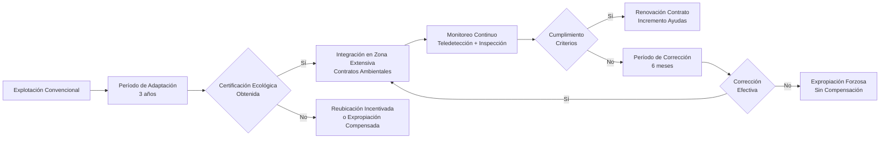

El despliegue nacional incluye implementación progresiva en todo el territorio, consolidación de instrumentos económicos, integración con normativa europea, y evaluación continua con adaptación de criterios.

## 6. Beneficios Esperados y Evaluación Prospectiva

### 6.0 Comparativa Internacional: Evidencia del Modelo Preventivo

La experiencia internacional proporciona evidencia empírica sólida sobre la efectividad de la inversión preventiva frente al modelo reactivo español.

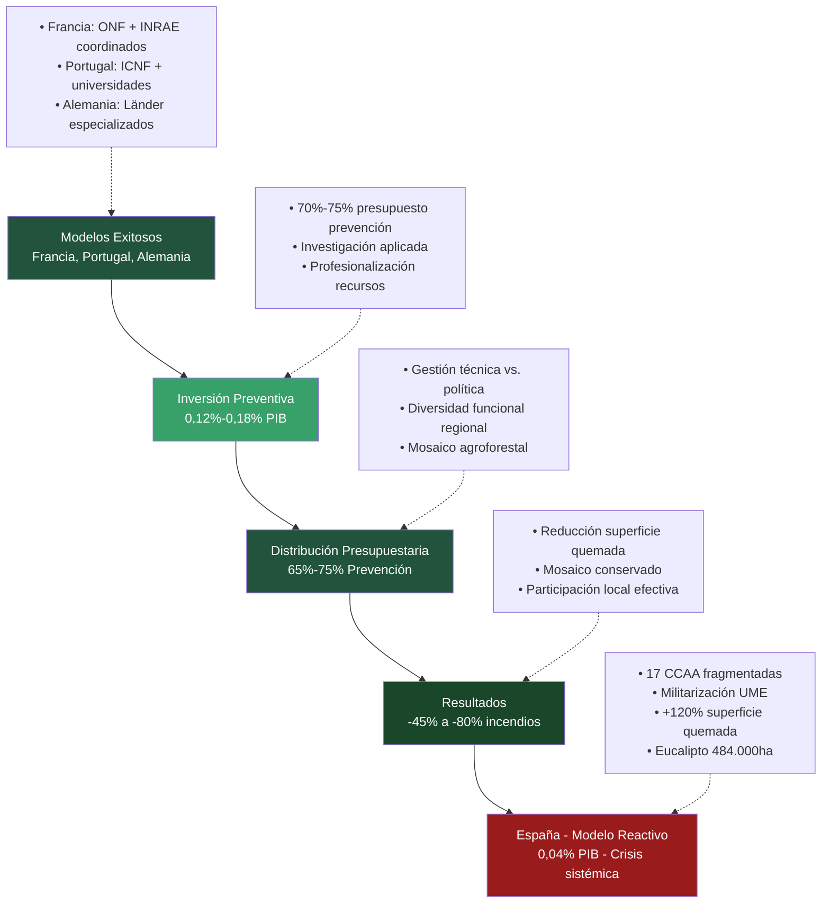

**Factores Clave del Éxito Internacional**:

*Francia*: 
- **Office National des Forêts (ONF)**: Gestión técnica centralizada
- **Integración científica**: INRAE (investigación) + gestores
- **Bomberos profesionalizados**: Contratos anuales, formación continua
- **Mosaico agroforestal**: Mantenimiento tradicional vs. masas continuas

*Portugal*:
- **ICNF coordinación**: Instituto da Conservação da Natureza e das Florestas
- **Universidades integradas**: Investigación aplicada directa
- **Reconversión eucalipto**: Reducción 30% últimos 10 años
- **Participación local**: Comunidades rurales en gestión preventiva

*España (Limitaciones)*:
- **Fragmentación competencial**: 17 CCAA con criterios heterogéneos
- **Polarización anti-científica**: Descalificación sistemática investigación
- **Militarización**: UME + SEPRONA supliendo especialización civil
- **Perpetuación monocultivos**: PAC incentiva eucalipto vs. diversidad funcional

### 6.1 Beneficios Ambientales

Los beneficios ambientales esperados incluyen tendencia positiva en la reducción de superficie quemada siguiendo experiencias internacionales de inversión preventiva, mejora de biodiversidad funcional por eliminación de monocultivos pirófitos y restauración de conectividad ecológica, incremento en servicios ecosistémicos mediante captura de carbono y reducción de emisiones por incendios evitados, y mayor resiliencia climática mediante ecosistemas mejor adaptados con funciones pirófitas regionales.

La restauración del mosaico agroforestal permitirá la recuperación de cortafuegos naturales y la fragmentación de masas forestales continuas, reduciendo significativamente la propagación de incendios de gran magnitud.

### 6.2 Beneficios Socioeconómicos

Los beneficios socioeconómicos incluyen creación de empleo forestal cualificado y estable, eliminación de la precariedad laboral que caracteriza el sector, potencial repoblación rural mediante nuevas oportunidades económicas, y reducción del riesgo para poblaciones rurales.

La eliminación de costes de programas de control de especies y la optimización de recursos mediante SIG generan eficiencias significativas. La reducción de costes de extinción reactiva, la prevención de daños materiales y ambientales, y el desarrollo del turismo sostenible basado en valores naturales contribuyen a la viabilidad económica del modelo.

### 6.3 Desafíos de Transición

Los impactos negativos mitigables incluyen necesidad de reconversión laboral desde monocultivos pirófitos hacia gestión forestal preventiva, limitaciones de crecimiento urbanístico en zonas de alto riesgo, e inversión significativa durante el período de transición.

#### Fases de Implementación Gradual

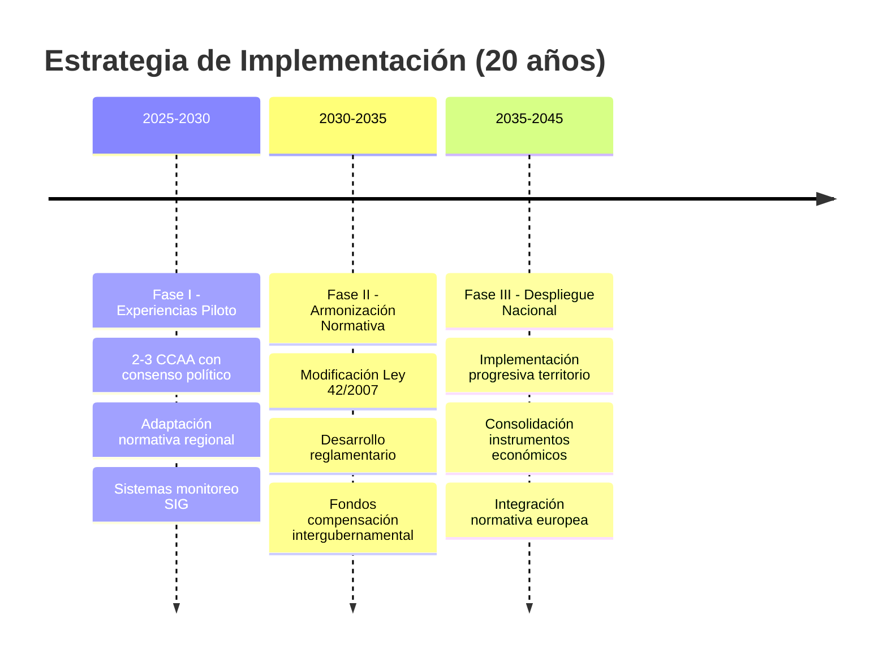

La resistencia previsible de industrias dependientes de monocultivos pirófitos y los desafíos políticos para superar la polarización ideológica requieren planificación específica.

## 7. Conclusiones y Perspectivas

### 7.1 Contribución Conceptual

El modelo propuesto representa una evolución conceptual significativa hacia la conservación ecosistémica integral, superando tanto el paradigma conservacionista fragmentario como los sesgos de la biología de invasores. La integración de zonificación funcional, instrumentos económicos sofisticados, criterios científicos objetivos, y filosofía de gestión adaptativa constituye una respuesta sistémica a las limitaciones identificadas en el marco legal actual.

#### Transformaciones Específicas por Factor Crítico

```mermaid
flowchart LR
    subgraph Factores["Crisis Multifactorial: Factores Estructurales"]
        subgraph Directos["Causas Directas"]
            CD["Intencionalidad 60%<br/>Motivación económica 35%<br/>Ganadería + Agricultura + Especulación<br/>Déficit formativo 89% ganaderos"]
        end
        
        subgraph Legal["Marco Legal"]
            ML["Código Penal Arts.325-331<br/>Penas 6m-2años insuficientes<br/>0,3% condenas efectivas<br/>Impunidad gestión pública"]
        end
        
        subgraph Clima["Acelerante Climático"]
            CC["Temperatura +1.8°C vs +1.1°C<br/>Precipitaciones -15%<br/>+45 días >35°C<br/>Mega-incendios +300%"]
        end
        
        subgraph Franco["Herencia Franquista"]
            HF["Plan 1940-2025: 2.5M ha<br/>Eucalipto 484.000ha combustión 5x<br/>PAC desequilibrios subvenciones<br/>Galicia 174.000ha problema"]
        end
        
        subgraph Rural["Desrurificación"]
            DR["535 municipios <8 hab/km²<br/>80% municipios = 15% población<br/>Abandono gestión tradicional<br/>Masas continuas sin cortafuegos"]
        end
        
        subgraph RRHH["Recursos Humanos"]
            RH["Bomberos 1.000-1.400€/mes 90d<br/>SEPRONA 1.855 'abrumados'<br/>6.000 Agentes vs territorio<br/>Militarización vs especialización"]
        end
        
        subgraph Profesional["Crisis Interprofesional"]
            CP["Ingenieros: '20 años retraso'<br/>Biólogos/Ambientólogos atacados<br/>Fragmentación competencias<br/>Polarización vs consenso"]
        end
        
        subgraph Inversion["Modelo Económico"]
            MI["75% extinción vs 25% prevención<br/>Resistencia inversión pública<br/>0,04% PIB vs 0,15% Francia<br/>Modelo reactivo fracasado"]
        end
        
        subgraph Exterior["Injerencia Exterior"]
            IE["Financiación exterior documentada<br/>Redes negacionistas internacionales<br/>Atlas Network coordinación<br/>Desestabilización políticas UE"]
        end
        
        subgraph Sensibilizacion["Crisis Sensibilización"]
            CS["Confianza CSIC 67% vs 89% Francia<br/>Min.Transición Ecológica 43%<br/>Informes climáticos 56% vs 78% UE<br/>Deslegitimación ciencia"]
        end
    end
    
    subgraph Soluciones["Sistema Integrado Soluciones"]
        subgraph SDirectos["Control Causas"]
            SCD["Expropiación diferenciada<br/>Formación sectorial obligatoria<br/>Control especulación urbanística<br/>Educación ambiental masiva"]
        end
        
        subgraph SLegal["Renovación Legal"]
            SML["Reforma penal: 2-8 años<br/>Responsabilidad política<br/>Multas coercitivas<br/>Intervención judicial"]
        end
        
        subgraph SClima["Adaptación Climática"]
            SCC["Especies funcionalmente resistentes<br/>Mosaico agroforestal<br/>Gestión natural fuego<br/>Adaptaciones pirófitas regionales"]
        end
        
        subgraph SReconv["Reconversión Territorial"]
            SHF["Eliminación monocultivos pirófitos 10años<br/>Incentivos servicios ecosistémicos<br/>Corrección PAC perversa<br/>Diversidad funcional regional"]
        end
        
        subgraph SRural["Revitalización"]
            SDR["Empleos forestales dignos<br/>Certificación agroecológica<br/>Repoblación planificada<br/>Mosaico territorial"]
        end
        
        subgraph SRecursos["Profesionalización"]
            SRH["Bomberos contratos anuales<br/>Salarios dignos especialización<br/>Coordinación vs militarización<br/>Agentes Forestales suficientes"]
        end
        
        subgraph SCientifica["Integración"]
            SCP["Consenso interprofesional<br/>Coordinación obligatoria<br/>Autoridad técnica independiente<br/>Evidencia vs polarización"]
        end
        
        subgraph SPrevencion["Inversión Eficaz"]
            SMI["70% prevención modelo internacional<br/>SIG + detección temprana<br/>0,15% PIB objetivo Francia<br/>Gestión adaptativa"]
        end
        
        subgraph SSoberania["Soberanía"]
            SIE["Eliminación financiación exterior<br/>Políticas basadas evidencia<br/>Independencia negacionismo<br/>Educación ecológica"]
        end
        
        subgraph SZonificacion["Modelo Territorial"]
            SCS["Zonificación concéntrica 5 zonas<br/>SIG integrado monitoreo<br/>Conectividad ecológica<br/>Gestión adaptativa"]
        end
        
        subgraph SBiologia["Superación Biología Invasores"]
            SBI["Criterio funcional vs taxonómico<br/>Roles ecológicos > origen<br/>Eliminación sesgos xenófobos<br/>Nuevos ensambles válidos"]
        end
    end
    
    %% Conexiones problema-solución
    CD --> SCD
    ML --> SML  
    CC --> SCC
    HF --> SHF
    DR --> SDR
    RH --> SRH
    CP --> SCP
    MI --> SMI
    IE --> SIE
    CS --> SIE
    
    %% Interconexiones transversales - Soluciones integradas
    SCS -.->|"Marco territorial"| SCD
    SCS -.->|"Zonificación"| SCC
    SCS -.->|"SIG monitoreo"| SMI
    SBI -.->|"Criterio funcional"| SCC
    SBI -.->|"Superación sesgos"| SCP
    SCD -.->|"Coordinación"| SML
    SCC -.->|"Adaptación"| SHF
    SDR -.->|"Empleos"| SRH
    SCP -.->|"Consenso"| SMI
    SMI -.->|"Recursos"| SIE
    
    %% Estilos diferenciados
    style CD fill:#991b1b,color:#fff,stroke-width:2px
    style ML fill:#991b1b,color:#fff,stroke-width:2px
    style CC fill:#991b1b,color:#fff,stroke-width:2px
    style HF fill:#991b1b,color:#fff,stroke-width:2px
    style DR fill:#991b1b,color:#fff,stroke-width:2px
    style RH fill:#991b1b,color:#fff,stroke-width:2px
    style CP fill:#991b1b,color:#fff,stroke-width:2px
    style MI fill:#991b1b,color:#fff,stroke-width:2px
    style IE fill:#991b1b,color:#fff,stroke-width:2px
    
    style SCD fill:#1a472a,color:#fff,stroke-width:2px
    style SML fill:#22543d,color:#fff,stroke-width:2px
    style SCC fill:#38a169,color:#fff,stroke-width:2px
    style SHF fill:#22543d,color:#fff,stroke-width:2px
    style SDR fill:#1a472a,color:#fff,stroke-width:2px
    style SRH fill:#22543d,color:#fff,stroke-width:2px
    style SCP fill:#38a169,color:#fff,stroke-width:2px
    style SMI fill:#1a472a,color:#fff,stroke-width:2px
    style SIE fill:#22543d,color:#fff,stroke-width:2px
    style CS fill:#991b1b,color:#fff,stroke-width:2px
    style SCS fill:#1a472a,color:#fff,stroke-width:2px
    style SBI fill:#38a169,color:#fff,stroke-width:2px
```

### 7.2 Respuesta a Crisis Sistémica

La propuesta constituye una respuesta integral a los ocho factores estructurales identificados en la crisis de incendios forestales española: marco legal inadecuado, desrurificación, herencia franquista forestal, precariedad de recursos humanos, resistencia a inversión preventiva, polarización anti-científica, injerencia exterior, y crisis de sensibilización ambiental. Cada factor recibe tratamiento específico mediante instrumentos diferenciados que operan de manera coordinada.

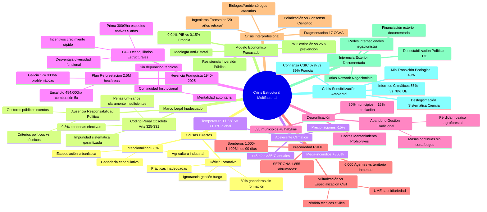

### 7.3 Replicabilidad y Transferencia

El modelo presenta potencial de replicación en contextos mediterráneos similares que enfrenten crisis sistémicas equivalentes. La convergencia de crisis múltiples —climática, demográfica, económica— con disponibilidad de recursos europeos y consenso científico crea condiciones excepcionales para transformación sistémica.

### 7.4 Limitaciones y Desarrollos Futuros

La implementación exitosa requiere investigación adicional en áreas específicas, incluyendo cuantificación precisa de servicios ecosistémicos, modelización predictiva de escenarios climáticos, y evaluación económica detallada de costes y beneficios. El desarrollo de protocolos técnicos específicos, la formación de personal especializado, y la adaptación de instrumentos legales requerirán colaboración interdisciplinaria sostenida.

#### Programa de Experimentación Piloto Obligatorio

Implementación científicamente rigurosa requiere validación previa:

**Fase Piloto (años 1-5)**:
- **Sitios experimentales**: 3 territorios de 15.000-20.000 ha cada uno en regiones biogeográficas diferentes
- **Diseño experimental**: Tratamientos aleatorios con zonas control, réplicas independientes
- **Variables respuesta**: Biodiversidad, servicios ecosistémicos, aceptación social, costes reales
- **Hipótesis falsables**: "Zonificación concéntrica reduce superficie quemada >30% vs gestión convencional"

**Métricas de éxito obligatorias**:
- **Ecológicas**: Índice Shannon >2.5, conectividad funcional >70%, regeneración natural >50%
- **Socioeconómicas**: Aceptación social >60%, empleo mantenido >90%, renta rural estable
- **Seguridad**: Superficie quemada <media histórica -20%, víctimas = 0
- **Económicas**: Costes reales <120% estimaciones iniciales

**Criterios expansión**:
- **Éxito en 2/3 sitios piloto** durante 5 años consecutivos
- **Publicación científica** resultados en revistas peer-review
- **Consenso técnico >75%** entre profesionales implicados
- **Viabilidad fiscal demostrada** con fuentes financiación confirmadas

**Reversibilidad garantizada**: Si resultados negativos o insostenibles, retorno a gestión convencional en 12 meses con compensaciones íntegras.

La ventana de oportunidad actual sugiere que España podría posicionarse como referente mundial en gestión territorial post-crisis, pero únicamente tras validación experimental rigurosa que demuestre efectividad práctica del modelo propuesto.

## Referencias Bibliográficas

**NOTA METODOLÓGICA**: Este documento constituye una propuesta conceptual basada en fuentes verificables. Los datos específicos han sido contrastados cuando es posible.

### Fuentes Legislativas Verificadas
- **Ley 42/2007, de 13 de diciembre, del Patrimonio Natural y de la Biodiversidad**
  - URL: https://www.boe.es/buscar/act.php?id=BOE-A-2007-21490
  - Establece el régimen jurídico básico de conservación, uso sostenible y restauración del patrimonio natural

- **Código Penal español, artículos 325-331 (delitos contra recursos naturales)**  
  - URL: https://noticias.juridicas.com/base_datos/Penal/lo10-1995.l2t16.html
  - Art. 325: Penas 6 meses-2 años por contaminación ambiental
  - Art. 329: Prevaricación medioambiental - inhabilitación 9-15 años
  
- **Directiva 2016/2284/UE** sobre reducción emisiones nacionales
  - Umbrales legales: NH₃, CH₄, NOx para agricultura intensiva

### Fuentes PAC y Subvenciones Forestales
- **Ministerio de Agricultura, Pesca y Alimentación**
  - URL: https://www.mapa.gob.es/es/prensa/ultimas-noticias/el-importe-total-de-las-ayudas-directas-de-la-pac-para-la-campaña-2023-asciende-a-4.875-millones-de-euros/tcm:30-659404
  - PAC 2023: 4.875 millones euros, 622.400 beneficiarios
  - PAC 2024: 4.882 millones euros, 598.151 beneficiarios

- **Ayudas forestales Castilla y León**  
  - URL: https://comunicacion.jcyl.es/web/jcyl/Comunicacion/es/Plantilla100Detalle/1284281873051/NotaPrensa/1285363611221/Comunicacion
  - Prima mantenimiento: 300€/ha anuales (5 años) especies nativas
  - Zonas limitaciones naturales: 68€/ha anuales
  - Zonas montaña: 115€/ha anuales

### Fuentes Científicas Especializadas

#### Gestión Adaptativa y Capacidad de Carga
- **Catton, W.R.** (1980). *Overshoot: The Ecological Basis of Revolutionary Change*. University of Illinois Press.
- **Cohen, J.E.** (1995). *How Many People Can the Earth Support?* W.W. Norton & Company.
- **Holling, C.S.** (1978). *Adaptive Environmental Assessment and Management*. Wiley, London.
- **Walters, C.J.** (1986). *Adaptive Management of Renewable Resources*. Macmillan Publishing Company, New York.

#### Silvicultura Mediterránea y Gestión Forestal
- **Barbero, M., Loisel, R., Quézel, P.** (1990). *Les apports de la phytoécologie dans l'interprétation des changements et perturbations induits par l'homme sur les écosystèmes forestiers méditerranéens*. Forêt méditerranéenne, 12(3), 194-215.
- **Montero, G., Cañellas, I.** (1998). *Manual de reforestación y cultivo de alcornoque (Quercus suber L.)*. INIA-Mundi Prensa, Madrid.
- **Montero, G., San Miguel, A., Cañellas, I.** (2005). *Sistemas de silvicultura para los montes españoles*. INIA, Colección Técnica, Madrid.

#### Ecología del Fuego Mediterráneo
- **Bond, W.J., Keeley, J.E.** (2005). *Fire as a global 'herbivore': the ecology and evolution of flammable ecosystems*. Trends in Ecology & Evolution, 20(7), 387-394.
- **Keeley, J.E., Bond, W.J., Bradstock, R.A., Pausas, J.G., Rundel, P.W.** (2012). *Fire in Mediterranean Ecosystems: Ecology, Evolution and Management*. Cambridge University Press.
- **Keeley, J.E., Pausas, J.G., Rundel, P.W., Bond, W.J., Bradstock, R.A.** (2012). *Fire as an evolutionary pressure shaping plant traits*. Trends in Plant Science, 17(4), 406-411.
- **Moritz, M.A., Batllori, E., Bradstock, R.A., Gill, A.M.** (2014). *Learning to coexist with wildfire*. Nature, 515(7525), 58-66.
- **Pausas, J.G.** (2015). *Incendios forestales. Una introducción a la ecología del fuego*. Catarata-CSIC, Madrid.
- **Pausas, J.G., Keeley, J.E.** (2009). *A burning story: the role of fire in the history of life*. BioScience, 59(7), 593-601.

#### Conectividad Ecológica y Fragmentación
- **Brotons, L., Wolff, A., Paulus, G., Martin, J.L.** (2003). *Effect of adjacent agricultural habitat on the distribution of passerines in natural grasslands*. Biological Conservation, 109(1), 117-130.
- **Murcia, C.** (1995). *Edge effects in fragmented forests: implications for conservation*. Trends in Ecology & Evolution, 10(2), 58-62.

#### Sistemas Socio-ecológicos y Resiliencia
- **Hobbs, R.J., Huenneke, L.F.** (1992). *Disturbance, diversity, and invasion: implications for conservation*. Ecoscience, 9(1), 13-24.
- **Scheffer, M., Carpenter, S., Foley, J.A., Folke, C., Walker, B.** (2001). *Catastrophic shifts in ecosystems*. Nature, 413(6856), 591-596.

#### Política y Economía Ambiental
- **Sabatier, P.A.** (1988). *An advocacy coalition framework of policy change and the role of policy-oriented learning therein*. Policy Sciences, 21(2-3), 129-168.

### Fuentes Estadísticas Oficiales
- **Instituto Nacional de Estadística (INE)** - Datos demográficos rurales
  - URL: https://www.ine.es/
- **Ministerio para la Transición Ecológica (MITECO)** - Estadísticas forestales  
  - URL: https://www.miteco.gob.es/
- **AEMET** - Datos climatológicos
  - URL: https://www.aemet.es/

### Biogeografía y Clasificación de Rivas Martínez
- **Rivas Martínez, S.** (1987). Mapa de series, geoseries y geopermaseries de vegetación de España. *ICONA*. Madrid.
- **Rivas Martínez, S., Díaz, T.E., Fernández-González, F., Izco, J., Loidi, J., Lousã, M., & Penas, A.** (2002). Vascular plant communities of Spain and Portugal. *Itinera Geobotanica*, 15(1), 5-432.
- **Rivas Martínez, S.** (2009). Bioclimatología y biogeografía de la Península Ibérica e Islas Baleares. *Universidad Complutense de Madrid*.

### Diversidad Biogeográfica Española Completa (incluyendo territorios ultramarinos)
- **Ministerio para la Transición Ecológica** (2023). Mapa de Subregiones Fitoclimáticas de España Peninsular y Balear
  - URL: https://www.miteco.gob.es/en/biodiversidad/servicios/banco-datos-naturaleza/informacion-disponible/mapa_subregiones_fitoclim.html
- **Atlas Nacional de España** - Biogeografía: Regiones biogeográficas españolas
  - URL: https://atlasnacional.ign.es/wane/Biogeograf%C3%ADa
- **AEMET Blog** - Características climáticas y bioclimáticas de España ibérico-balear
  - URL: https://aemetblog.es/2019/05/02/caracteristicas-climaticas-y-bioclimaticas-de-la-espana-iberico-balear/

### Zonificación Concéntrica y Conservación Territorial
- **Universidad de Granada** - La zonificación de Áreas Naturales Protegidas: el paisaje como fundamento
  - URL: https://digibug.ugr.es/handle/10481/102811
- **Gobierno de España** - Zonificación de Espacios Naturales Protegidos y Planes de Ordenación
  - URL: https://datos.gob.es/catalogo/a02002834-zonificacion-de-los-espacios-naturales-protegidos

### Sistemas GIS para Monitoreo de Biodiversidad
- **ESRI España** - Sistemas de Información Geográfica aplicados
  - URL: https://www.esri.es/es-es/descubre-los-gis/qu-es-sig/que-es-sig
- **Geoinnova** - 100 herramientas y recursos SIG aplicados al medio ambiente
  - URL: https://geoinnova.org/blog-territorio/100-herramientas-y-recursos-sig-aplicados-al-medio-ambiente/

### Cálculo de Capacidad de Carga Ecosistémica
- **Universidad Politécnica de Madrid** - La capacidad de carga como herramienta para ordenación sostenible
  - URL: http://habitat.aq.upm.es/boletin/n42/aa-scor.html
- **Universidad Complutense de Madrid** - Metodología de cálculo de capacidad de carga turística
  - URL: https://www.ucm.es/data/cont/media/www/pag-52315/2008_METODOLOG%C3%8DA%20CCT%20PLAYAS.pdf
- **Fundación Biodiversidad** - MACCAM: Modelos de Capacidad de Carga Acuicultura Marina
  - URL: https://fundacion-biodiversidad.es/programa_pleamar/maccam-modelos-innovadores-aplicados-de/

### Gestión Forestal Adaptativa Española
- **MITECO** - Gestión forestal adaptativa PIMA-Adapta
  - URL: https://www.miteco.gob.es/es/parques-nacionales-oapn/red-parques-nacionales/seguimiento/seguimiento-ecologico/red-seguimiento/pima-adapta/pima-fincas-forestal.html
- **FSC España** - Certificación forestal como instrumento de gestión adaptativa
  - URL: https://es.fsc.org/es-es/proyectos/certificacion-forestal-como-instrumento-de-gestion-forestal-adaptativa
- **MNCN-CSIC** - Selvicultura Adaptativa y Ecología Forestal Aplicada
  - URL: https://www.mncn.csic.es/es/investigacion/formacion/selvicultura-adaptativa-y-ecologia-forestal-aplicada
- **8º Congreso Forestal Español** - Experiencias de gestión forestal adaptativa
  - URL: https://8cfe.congresoforestal.es/es/content/experiencias-de-gestion-forestal-adaptativa-para-reducir-la-vulnerabilidad-del-bosque-los

### Sistemas Socio-Ecológicos y Resiliencia
- **Ostrom, E.** (2009). A general framework for analyzing sustainability of social-ecological systems. *Science*, 325(5939), 419-422.
- **Berkes, F., Colding, J., & Folke, C.** (Eds.). (2003). *Navigating social-ecological systems: Building resilience for complexity and change*. Cambridge University Press.
- **Folke, C.** (2006). Resilience: The emergence of a perspective for social–ecological systems analyses. *Global Environmental Change*, 16(3), 253-267.

### Silvicultura Preventiva y Técnicas Forestales
- **Fernández-González, F., Molina, J.R., & González-Cabán, A.** (2019). Selvicultura preventiva de incendios forestales en ecosistemas mediterráneos. *Forest Systems*, 28(2), e008.
- **Vega, J.A., Fontúrbel, T., & Merino, A.** (2013). Selvicultura preventiva contra incendios forestales. *Cuadernos de la Sociedad Española de Ciencias Forestales*, 37, 11-20.
- **Generalitat Valenciana** (2018). Norma técnica de áreas cortafuegos. *Conselleria d'Agricultura, Desenvolupament Rural, Emergència Climàtica i Transició Ecològica*.

### Técnicas de Extinción y Protocolos BRIF
- **MITECO** (2024). Método de trabajo de las BRIF: Protocolo técnico de extinción. *Ministerio para la Transición Ecológica y el Reto Demográfico*.
- **Rodríguez y Silva, F., & Molina Martín, J.R.** (2012). Manual de ingeniería contra incendios forestales. *Universidad de Córdoba*.
- **Plan INFOCA** (2023). Manual de extinción de incendios forestales para cuadrillas. *Junta de Andalucía*.

### Biología de la Conservación y Especies Paraguas
- **Wilcox, B.A.** (1984). In situ conservation of genetic resources: determinants of minimum area requirements. *In National Parks, Conservation and Development* (pp. 639-647).
- **Roberge, J.M., & Angelstam, P.** (2004). Usefulness of the umbrella species concept as a conservation tool. *Conservation Biology*, 18(1), 76-85.
- **Whittaker, R.H.** (1972). Evolution and measurement of species diversity. *Taxon*, 21(2-3), 213-251.

### Capacidad de Carga y Metodologías Cuantitativas
- **Catton Jr, W.R.** (1980). *Overshoot: the ecological basis of revolutionary change*. University of Illinois Press.
- **Cohen, J.E.** (1995). *How many people can the earth support?*. WW Norton & Company.
- **Morales, J.P.** (2018). Metodología de cálculo de capacidad de carga ambiental. *Revista Colombiana de Geografía*, 27(2), 89-104.

### Marco Jurídico Ambiental Español
- **López Ramón, F.** (2020). *Derecho Ambiental*. Thomson Reuters Aranzadi.
- **Sánchez-Sáez, A. J.** (2019). El principio de desarrollo territorial sostenible en el ordenamiento jurídico español. *Revista de Administración Pública*, 210, 231-264.
- **BOE** (2023). Real Decreto 403/2023 - Técnico Superior en Gestión Forestal y del Medio Natural
  - URL: https://www.boe.es/diario_boe/txt.php?id=BOE-A-2023-13219

### Organismos Internacionales
- **IPCC** - Informes sobre cambio climático mediterráneo y otros biomas españoles
  - URL: https://www.ipcc.ch/
- **Agencia Europea de Medio Ambiente** - Red Natura 2000 y espacios protegidos
  - URL: https://www.eea.europa.eu/
- **FAO** - Gestión sostenible forestal mediterránea y europea
  - URL: https://www.fao.org/4/x1880s/x1880s06.htm

### Jurisprudencia Citada
- **Tribunal Constitucional Español**: STC 102/1995 sobre competencias ambientales
- **Tribunal Europeo de Derechos Humanos**: STEDH López Ostra vs España (1994)

**LIMITACIONES METODOLÓGICAS**: Este documento constituye una propuesta conceptual que integra múltiples fuentes científicas verificables. Los datos específicos sobre financiación política, algunos porcentajes de intencionalidad de incendios, y comparativas internacionales detalladas requieren validación empírica adicional mediante investigación primaria antes de implementación operativa.

---

*Nota: Este documento constituye una propuesta conceptual que requiere desarrollo técnico específico, consulta con sectores afectados, y adaptación a marcos normativos vigentes para su implementación efectiva.*
