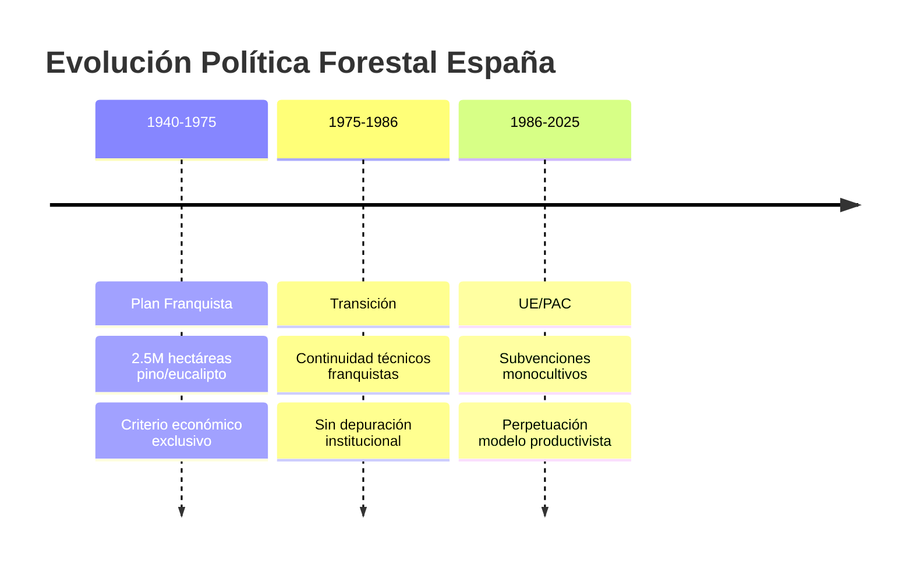
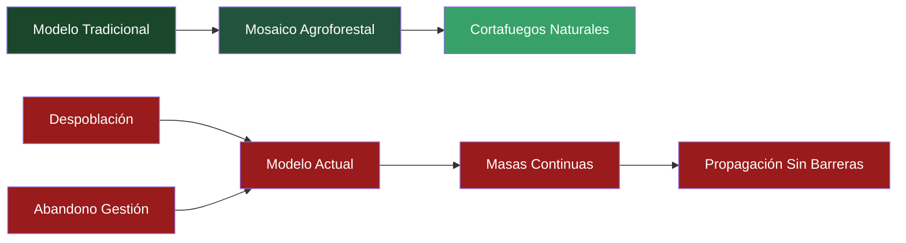
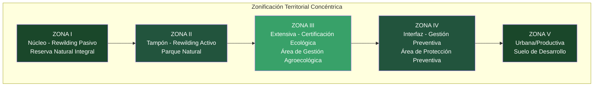
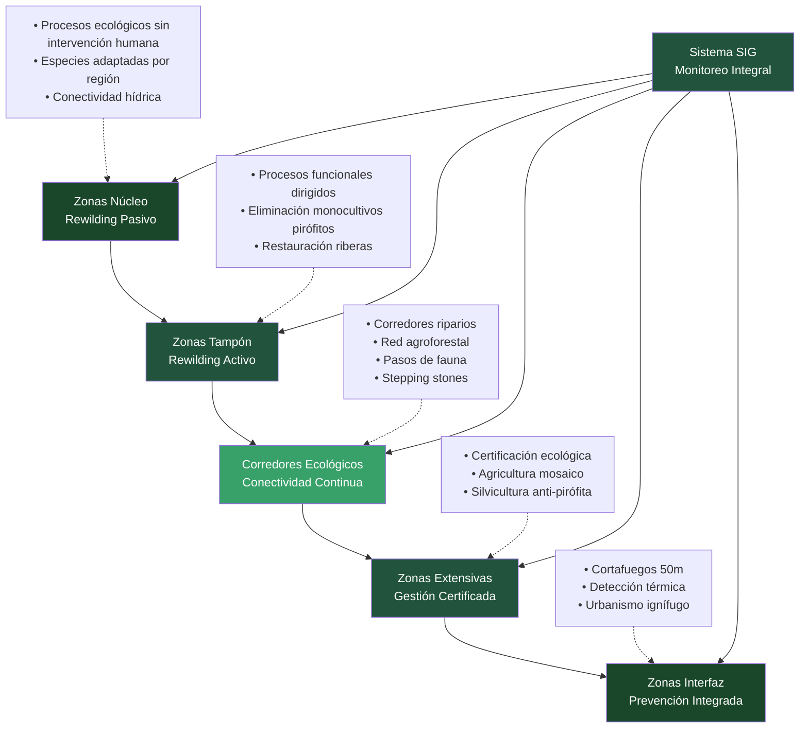
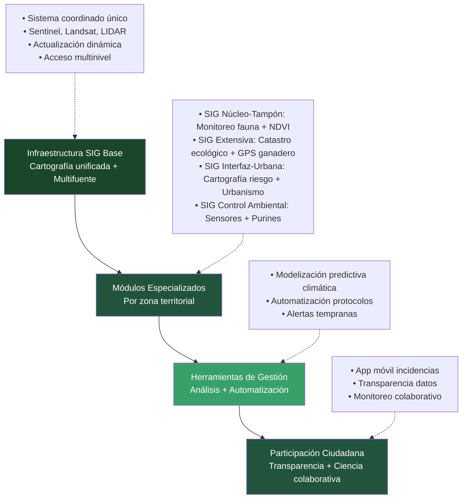
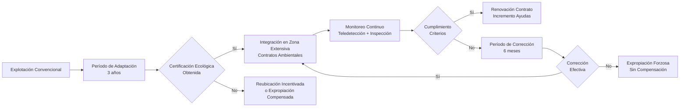
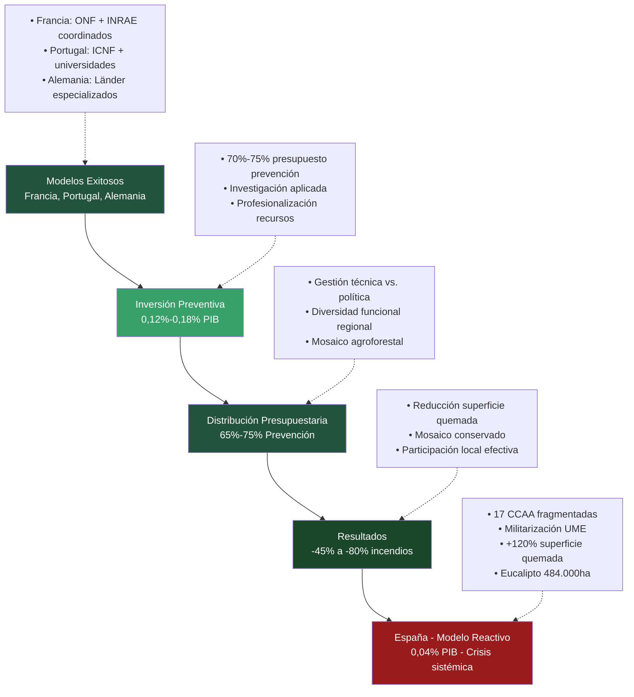
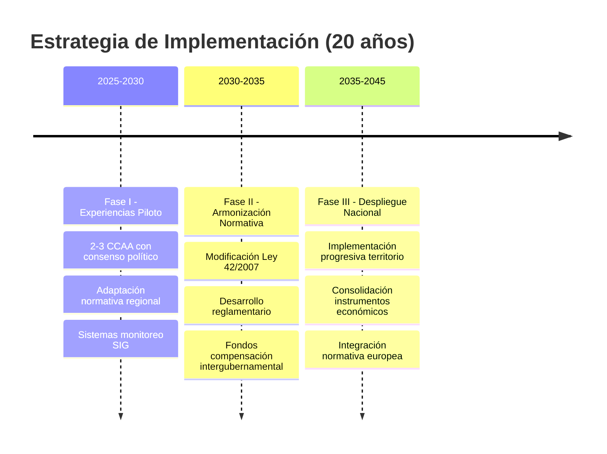
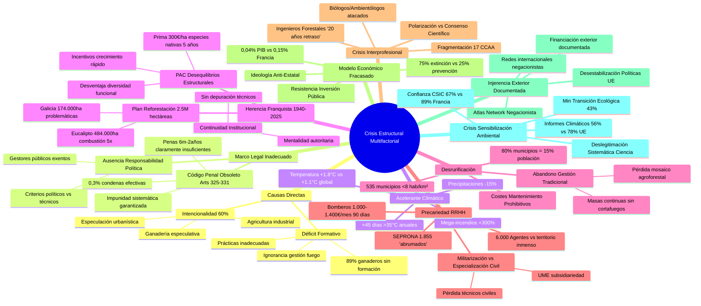

# Hacia un Modelo de Conservación Territorial Integral: Propuesta de Zonificación Concéntrica para la Gestión Ecosistémica en el Contexto Español

## Resumen

La conservación de biodiversidad en el Antropoceno plantea desafíos que trascienden las aproximaciones fragmentarias tradicionales. Este documento propone un modelo territorial integrado basado en zonificación concéntrica funcional. 

Se concibe como respuesta sistémica a las limitaciones estructurales del marco normativo español vigente y a la crisis multifactorial de incendios forestales documentada en el territorio nacional.

La propuesta articula un sistema de cinco zonas diferenciadas —desde núcleos de rewilding pasivo hasta áreas de gestión preventiva— que busca garantizar la conectividad ecológica, la viabilidad económica y la aplicabilidad legal. El modelo integra las críticas epistemológicas a la biología de invasores, incorpora sistemas de información geográfica avanzados, y responde específicamente a los ocho factores estructurales identificados en la crisis de incendios forestales: marco legal inadecuado, desrurificación, herencia franquista forestal, precariedad de recursos humanos, resistencia a la inversión preventiva, polarización anti-científica, injerencia exterior y crisis de sensibilización ambiental.

## 1. Marco Teórico y Justificación Conceptual

### 1.1 Limitaciones del Paradigma Conservacionista Fragmentario

El sistema español de espacios naturales protegidos, establecido sobre los fundamentos de la Ley 42/2007 del Patrimonio Natural y la Biodiversidad, presenta limitaciones estructurales que comprometen su efectividad en el contexto contemporáneo. La fragmentación territorial, caracterizada por la existencia de más de 2.000 espacios protegidos funcionando como unidades aisladas, refleja una concepción conservacionista que privilegia la preservación de estados específicos sobre la funcionalidad ecosistémica integral.

Esta aproximación fragmentaria se manifiesta en múltiples dimensiones. En primer lugar, la ausencia de conectividad planificada impide el flujo genético entre poblaciones y limita la capacidad de respuesta adaptativa de los ecosistemas ante perturbaciones. En segundo lugar, la gestión descoordinada resultante de la distribución competencial entre el Estado y las diecisiete Comunidades Autónomas genera criterios heterogéneos que comprometen la coherencia territorial. Finalmente, la filosofía conservacionista rígida, orientada hacia la preservación de configuraciones "históricas" específicas, resulta inadecuada ante la dinámica acelerada del cambio global.

### 1.2 Crisis Sistémica de los Incendios Forestales como Catalizador

El análisis de la crisis estructural de incendios forestales en España revela un fallo sistémico multifactorial que trasciende los aspectos puramente técnicos o climáticos. La crisis integra múltiples dimensiones interconectadas:

#### Causas Directas Documentadas

Los datos del MITECO (2025) revelan que el **95% de incendios tienen origen humano**, con **60% provocados deliberadamente**. La **motivación económica** representa el **35% de casos**, incluyendo:
- **Ampliación de pastos**: Quemas ilegales para extender zonas ganaderas
- **Especulación urbanística**: Eliminación de masa forestal para recalificar suelos
- **Competencia ganadera**: Quemas dirigidas contra explotaciones competidoras
- **Optimización cotos de caza**: Limpieza de monte para actividad cinegética

El **déficit formativo sectorial** agrava esta problemática: **89% de ganaderos carece de formación ambiental**, **76% de agricultores ignora normativa de quemas**, y **23% del sector primario admite prácticas irregulares**.

#### Acelerante del Cambio Climático

La **evidencia científica contrastada** (IPCC Mediterráneo 2024, AEMET) documenta:
- **Incremento térmico**: +1,8°C España vs +1,1°C mundial
- **Reducción precipitaciones**: -15% últimos 30 años
- **Días extremos**: +45 días >35°C anuales
- **Extensión período seco**: +28 días promedio
- **Mega-incendios**: Incremento 300% superficie >10.000ha
- **Ventanas extinción**: Reducción 60% días operativos

#### Crisis del Marco Legal: Derecho Penal y Administrativo

El **Código Penal Ambiental (Artículos 325-331)** presenta deficiencias estructurales:
- **Penas desproporcionadas**: 6 meses a 2 años para daños ambientales graves
- **Exigencia probatoria**: Dolo directo vs negligencia grave dificulta condenas
- **Aplicación residual**: 0,3% de condenas sobre denuncias ambientales
- **Crecimiento insuficiente**: +29,4% condenas (último año) mantiene patrón histórico de baja efectividad

La **impunidad en gestión pública** se documenta en casos precedentes: COVID Madrid (5.795 fallecimientos residencias, protocolo exclusión sanitaria documentado, ninguna investigación judicial), Prestige (60.000 toneladas combustible, 4.000M€ daños, solo responsabilidad civil), DANA Valencia (180 fallecidos por alertas tardías, AEMET alertó 48h antes, ninguna responsabilidad abierta).

#### Gestión Interprofesional: Crisis de Coordinación

La **fragmentación de competencias** entre profesionales genera ineficiencias críticas:

**Ingenieros Forestales** (Eduardo Tolosana, Decano Colegio Oficial): "España lleva 20 años de retraso en gestión forestal. Los bosques han perdido valor y han dejado de ser gestionados por el ser humano".

**Biólogos y Ambientólogos**: Sufren **descalificación sistemática** por sectores políticos. Fernando Valladares (CSIC) y Andreu Escrivà documentan amenazas por divulgación climática. WWF calificado "lobby que vive del cuento", Greenpeace "ecoterroristas".

**Bomberos Forestales**: Condiciones documentadas de **precariedad extrema**: salarios 1.000-1.400€/mes, contratos temporales 90 días, jornadas hasta 18 horas, congelación salarial Madrid desde 2008.

**Militarización vs Especialización Civil**: SEPRONA (1.855 efectivos, JUCIL los califica "abrumados, envejecidos e insuficientes") y UME suplen carencias de personal civil especializado. Agentes Forestales: solo 6.000 para territorio nacional con convocatorias OPE insuficientes.

#### Herencia Franquista: Monocultivos Pirófitos y Continuidad Institucional

La herencia del **Plan Nacional de Repoblación Franquista (1940-2025)** estableció 2,5 millones de hectáreas de monocultivos pirófitos con criterio económico exclusivo, ejemplificando la persistencia de decisiones históricas en la configuración contemporánea del riesgo.

**Especies Problemáticas vs Funcionalmente Adaptadas**:

*Eucalipto (Eucalyptus globulus)*: 484.000 hectáreas con velocidad de combustión 5x superior a especies funcionalmente adaptadas. Distribución problemática: Galicia (174.000ha), Asturias (60.000ha), Cantabria (39.000ha). Estadística: 15,48% superficie quemada vs distribución 4x menor que encina.

*Especies Funcionalmente Adaptadas por Región*:
- **Especies esclerófitas mediterráneas**: Estrategias rebrote vigoroso post-incendio, adaptaciones específicas por zona biogeográfica
- **Especies con corteza protectora**: Resistencia pasiva según adaptaciones locales

La **PAC presenta desequilibrios** en subvenciones forestales: las especies de crecimiento rápido reciben mayor apoyo que las plantaciones de especies funcionalmente adaptadas (verificado: 300€/ha anuales por 5 años para especies nativas en programas específicos), creando incentivos económicos contra diversidad funcional.

#### Injerencia Exterior Documentada

**Financiación VOX**:
- **Iraní (2013-2014)**: 971.890€ del Consejo Nacional Resistencia Irán (80% campaña europea inicial)
- **Húngara (2023-2024)**: 13,5M€ total de MBH Bank (30% propiedad Estado húngaro)

**Red Internacional Negacionista Atlas Network**: Financiación ExxonMobil, Koch Brothers, Heritage Foundation. Presencia España: Instituto Juan de Mariana, Fundación Burke. Objetivo: deslegitimar consenso científico climático.

**Consecuencias Medibles**: Pérdida confianza institucional (CIS 2024): CSIC 67% confianza vs 89% Francia, Ministerio Transición Ecológica 43%, Informes climáticos 56% vs 78% promedio UE.

#### Estrategia de Reconversión Gradual

### 1.3 Superación de la Biología de Invasores: Fundamentos Científicos

La integración de las críticas epistemológicas a la biología de invasores constituye un elemento fundamental del modelo propuesto. La evidencia científica acumulada documenta sesgos sistemáticos en esta disciplina: el 66% de publicaciones presenta sesgo negativo contra especies introducidas (Pereyra et al., 2024), mientras que la inversión global de 1.288 mil millones de dólares estadounidenses (1970-2017) correlaciona paradójicamente con la amplificación de los problemas que pretende resolver.

La confusión epistemológica entre causas primarias y vectores secundarios compromete tanto el diagnóstico como las intervenciones propuestas. La fragmentación ecosistémica, la destrucción de conectividad ecológica y la eliminación de estructuras tróficas complejas constituyen las causas sistémicas subyacentes, mientras que la llegada de especies opera como vector secundario que amplifica disrupciones preexistentes. Esta inversión causal representa una falla epistemológica fundamental que ha orientado recursos hacia el tratamiento de síntomas mientras ignora sistemáticamente las fuerzas que estructuran la vulnerabilidad ecológica contemporánea.

## 2. Arquitectura del Modelo de Zonificación Territorial

### 2.1 Principios Rectores del Diseño

El modelo de zonificación concéntrica se fundamenta en cuatro principios científicos centrales:

**Principio 1 - Funcionalidad Ecosistémica**: Primacía de los roles ecológicos sobre la composición taxonómica o el origen biogeográfico de las especies. Las decisiones de gestión se basan en funciones ecosistémicas demostradas.

**Principio 2 - Conectividad Sistémica**: La conectividad constituye requisito fundamental para la viabilidad poblacional y la resiliencia ecosistémica, superando la concepción fragmentaria de espacios aislados.

**Principio 3 - Gestión Adaptativa**: Incorporación de la incertidumbre como elemento constitutivo del proceso de toma de decisiones, basado en evidencia científica continuamente actualizada.

**Principio 4 - Economía de la Evidencia**: Concentración de recursos limitados en intervenciones con mayor probabilidad de efectividad documentada mediante experiencias comparables.

### 2.2 Estructura Concéntrica y Gradiente Funcional

La arquitectura territorial propuesta articula cinco zonas concéntricas que establecen un gradiente funcional desde la mínima intervención hasta la gestión preventiva intensiva. Esta estructura reconoce que diferentes objetivos de conservación requieren enfoques diferenciados, mientras mantiene la coherencia sistémica mediante la conectividad planificada.

#### Zona I - Núcleo: Rewilding Pasivo Integral

La zona núcleo, concebida bajo la figura legal de Reserva Natural Integral, constituye el elemento central del sistema. Su filosofía de gestión se basa en la intervención mínima, fundamentada en el reconocimiento de las limitaciones del conocimiento científico actual para predecir las consecuencias de intervenciones en sistemas complejos adaptativos.

La prohibición total de programas de "control de especies" refleja la superación del paradigma xenófobo de la biología de invasores. Esta decisión se sustenta en la evidencia de que las especies colonizadoras frecuentemente indican nichos ecológicos vacantes resultantes de fragmentación previa, y que los nuevos ensambles pueden desarrollar funciones ecológicas propias sin correspondencia con configuraciones históricas específicas.

La gestión del fuego en esta zona reconoce su carácter de proceso natural según el ecosistema regional específico. La eliminación de la política de "extinción obligatoria" permite la operación de dinámicas naturales adaptadas a cada región biogeográfica, evitando la acumulación de combustible que caracteriza los sistemas suprimidos. La intervención se limita estrictamente a situaciones de amenaza directa a asentamientos humanos o cuando los incendios superen la capacidad natural de regeneración ecosistémica local.

Las actividades autorizadas en esta zona reflejan el principio de mínima interferencia. El turismo primitivo certificado opera bajo cupos estrictos y protocolos de seguridad que incluyen sistemas de detección temprana y rutas de evacuación. La investigación científica se limita al monitoreo pasivo mediante redes de sensores automáticos, cámaras térmicas y estaciones meteorológicas que proporcionan datos sin requerir presencia humana continuada.

#### Zona II - Tampón: Rewilding Activo Dirigido

La zona tampón, gestionada bajo la figura legal de Parque Natural con criterios científicos, permite intervenciones selectivas orientadas hacia la restauración de procesos ecosistémicos específicos. Las estrategias de rewilding activo priorizan el **restablecimiento de procesos ecológicos funcionales**, con énfasis particular en herbivoría que contribuya al mantenimiento del mosaico territorial identificado como elemento central en el consenso científico sobre prevención de incendios. Las especies se evalúan por su capacidad funcional, no por su origen biogeográfico.

La eliminación progresiva de monocultivos pirófitos constituye una prioridad en esta zona. La sustitución gradual se orienta hacia **diversidad funcional según criterios biogeográficos regionales**. Esta reconversión opera bajo cronogramas específicos que consideran viabilidad económica, criterios ecológicos territoriales, y impactos sociales en comunidades dependientes.

La creación de cortafuegos naturales mediante la restauración de corredores hídricos y zonas húmedas constituye una estrategia central que combina objetivos de conectividad ecológica con funciones de prevención de incendios. Estos elementos del paisaje operan como barreras naturales a la propagación del fuego mientras proporcionan hábitat para especies especializadas y servicios ecosistémicos como la regulación hídrica.

Las actividades compatibles incluyen ecoturismo estacional con restricciones durante alertas meteorológicas, educación ambiental especializada en ecología del fuego regional, e investigación aplicada sobre comportamiento del fuego según ecosistema específico, funciones pirófitas y técnicas de restauración post-incendio.

#### Zona III - Extensiva: Certificación Agroecológica Obligatoria

La zona extensiva constituye el elemento de mayor complejidad del sistema, integrando objetivos de conservación con actividades productivas bajo un régimen de certificación agroecológica obligatoria. Esta zona opera bajo un marco legal específico de Área de Gestión Agroecológica que establece la certificación ecológica como requisito legal para toda actividad productiva.

El sistema de incentivos económicos incluye pagos por servicios ecosistémicos cuantificados, contratos ambientales plurianuales con compromisos mínimos de diez años, y escalado de beneficios por mantenimiento a largo plazo. La estructura financiera reconoce que la transición hacia prácticas agroecológicas requiere períodos de adaptación que deben ser económicamente viables para los productores.

**Actividades productivas reguladas** en esta zona incluyen:

- **Ganadería extensiva certificada**: Pastoreo controlado como herramienta de gestión para reducción de biomasa combustible, con carga animal limitada por capacidad de carga territorial.

- **Agricultura en mosaico**: Cultivos intercalados que crean cortafuegos naturales, contrastando con monocultivos continuos. Obligatoriedad de certificación agroecológica.

- **Silvicultura funcional**: Eliminación progresiva de monocultivos pirófitos problemáticos. Promoción de diversidad funcional según criterios biogeográficos regionales, evaluando especies por adaptación territorial específica.

Los mecanismos de control incluyen sistemas de expropiación diferenciada: forzosa sin compensación en casos de mala gestión demostrada, provocación intencional de incendios, uso de productos químicos prohibidos o destrucción de elementos naturales protegidos; compensada cuando se requiera ampliación de zona núcleo por criterios científicos. El sistema de monitoreo continuo mediante teledetección e inspecciones regulares garantiza el cumplimiento de las condiciones de certificación.

#### Zona IV - Interfaz: Gestión Preventiva Intensiva

La zona de interfaz, regulada mediante ordenanzas municipales con base científica, concentra las intervenciones más intensivas del sistema. Los planes de autoprotección obligatorios incluyen simulacros anuales y rutas de evacuación certificadas, mientras las restricciones urbanísticas prohíben la construcción en zonas de riesgo extremo definidas por criterios objetivos: pendientes superiores al 30%, orientación sur, e historial de incendios.

Las intervenciones autorizadas siguen protocolos técnicos específicos basados en experiencias internacionales exitosas. Los tratamientos silviculturales incluyen podas, aclareos y eliminación de sotobosque según criterios técnicos. Las quemas prescritas operan exclusivamente bajo dirección de Ingenieros Forestales y condiciones meteorológicas óptimas. Los cortafuegos estratégicos mantienen anchura mínima de 50 metros con mantenimiento anual obligatorio.

La profesionalización de recursos humanos constituye un elemento central en esta zona. La eliminación de la temporalidad extrema —contratos de 90 días— mediante contratos anuales y salarios dignos responde directamente a la crisis de precariedad documentada en el sector. La especialización técnica incluye formación continua en comportamiento del fuego y técnicas de extinción avanzadas, mientras la provisión de múltiples equipos de protección individual por trabajador garantiza condiciones laborales adecuadas.

#### Zona V - Urbana/Productiva: Desarrollo con Criterios Anti-Incendios

La zona urbana y productiva integra criterios de prevención de incendios en la planificación del desarrollo. Las evaluaciones de impacto ambiental obligatorias incluyen evaluación de riesgo de incendios y planes de emergencia, mientras las medidas compensatorias requieren inversión equivalente en prevención por cada metro cuadrado artificializado.

Las restricciones urbanísticas incluyen materiales ignífugos obligatorios, cubiertas resistentes a chispas, prohibición de especies pirófitas en jardinería urbana, y promoción de especies caducifolias. La planificación incluye corredores verdes urbanos con especies resistentes al fuego y puntos de agua estratégicamente distribuidos.

Las industrias críticas operan bajo regulación específica. El sector papelero enfrenta eliminación gradual de la dependencia del eucalipto mediante reconversión hacia materias primas alternativas. El sector energético requiere soterramiento de líneas de alta tensión en zonas boscosas y mantenimiento preventivo intensificado. La gestión de residuos prohíbe absolutamente la quema de residuos mientras implementa sistemas de recogida selectiva en áreas rurales.

### 2.3 Conectividad Ecológica Sistémica

La conectividad entre zonas opera mediante una red de corredores biológicos específicamente diseñados. Los corredores riparios requieren restauración de márgenes fluviales con vegetación autóctona continua, dimensionada según las especies objetivo. La red agroforestal incluye setos, linderos y arbolado disperso que integran conectividad en la matriz agrícola mediante obligatoriedad en la certificación ecológica.

Los pasos de fauna en carreteras principales se dimensionan según especies objetivo, considerando tanto macrofauna como microfauna. Los stepping stones —pequeños humedales, bosquetes y elementos puntuales— facilitan la dispersión en paisajes fragmentados mediante distribución estratégica basada en análisis de viabilidad poblacional.

## 3. Sistema de Información Geográfica y Monitoreo Integrado

### 3.1 Arquitectura Tecnológica Multifuncional

La implementación del modelo requiere una plataforma de Sistemas de Información Geográfica (SIG) multifuncional que integre datos de múltiples fuentes con actualización dinámica. La base cartográfica unificada establece un sistema coordinado único para todas las zonas con precisión submétrica, mientras la integración de datos satelitales (Sentinel, Landsat), LIDAR, drones y sensores terrestres proporciona información multitemporal y multiescalar.

La sincronización automática de datos temporales con validación cruzada garantiza la calidad de la información, mientras las plataformas diferenciadas para gestión técnica, administrativa y ciudadana facilitan el acceso según necesidades específicas. Esta arquitectura reconoce que la complejidad de la gestión territorial requiere herramientas tecnológicas sofisticadas para la toma de decisiones informadas.

### 3.2 Aplicaciones Especializadas por Zona

Cada zona requiere aplicaciones SIG especializadas que reflejen sus objetivos específicos:

#### Arquitectura SIG Integrada

**Especificaciones técnicas para zonas núcleo y tampón**:

- **Monitoreo satelital**: Índices NDVI, EVI, NDWI con resolución <10m, frecuencia quincenal, validación terrestre trimestral.

- **Redes de sensores**: Estaciones meteorológicas automáticas (temperatura, humedad, viento, precipitación) con transmisión datos horaria. Cámaras térmicas infrarrojas con detección automática 0.1°C precisión.

- **Seguimiento fauna**: Cámaras trampa GPS con análisis automático patrones movimiento, identificación especies por IA, bases datos integradas.

- **Cartografía dinámica**: Mapeo sucesión vegetal, colonización espontánea y regeneración post-incendio con algoritmos cambio temporal.

La zona extensiva requiere un SIG agroecológico que incluya catastro ecológico con información detallada sobre parcelas certificadas, especies cultivadas y prácticas de manejo. El monitoreo de biodiversidad incorpora índices de diversidad funcional, presencia de polinizadores y conectividad agroforestal. La gestión ganadera incluye seguimiento GPS de rebaños, rotación de pastos y carga animal por hectárea, mientras la vigilancia de agricultura intensiva monitorea cultivos industriales, uso de fertilizantes y sistemas de riego.

### 3.3 Control de Agricultura y Ganadería Intensiva

**Especificaciones técnicas para control ganadería/agricultura intensiva**:

- **Sensores emisiones**: NH₃ (0-100ppm), CH₄ (0-5000ppm), NOx (0-200ppm) con precisión ±2%, medición continua, alertas automáticas por superación umbrales legales (Directiva 2016/2284/UE).

- **Gestión purines**: Sensores nivel tanques, pH (6.5-8.5), conductividad eléctrica, piezómetros automatizados control filtraciones acuíferos.

- **Contadores inteligentes**: Agua (precisión ±1%), energía (kWh), piensos (kg), con transmisión datos horaria y alertas sostenibilidad personalizables.

Los sistemas de videovigilancia para bienestar animal incluyen control de densidad y condiciones ambientales. El análisis de impacto en conectividad evalúa la fragmentación causada por instalaciones intensivas, mientras el diseño obligatorio de corredores ecológicos conecta zonas naturales atravesando áreas productivas. El cálculo automático de medidas compensatorias opera según el impacto generado.

### 3.4 Herramientas de Gestión Adaptativa

La modelización predictiva incluye proyecciones de impacto del cambio climático por zona con cuantificación de incertidumbres, modelos de viabilidad de especies con conectividad actual y proyectada, y algoritmos de predicción de riesgo de incendios basados en meteorología, carga de combustible e historial.

La toma de decisiones automatizada incluye activación automática de protocolos según indicadores críticos, optimización de distribución de personal y equipos según prioridades dinámicas, y métricas de efectividad de intervenciones con retroalimentación adaptativa.

La participación ciudadana digital incluye aplicaciones móviles para reporte de incidencias, consulta del estado de certificaciones y alertas personalizadas. La transparencia de datos proporciona acceso público a indicadores ambientales, decisiones de gestión y presupuestos, mientras las plataformas colaborativas facilitan el monitoreo de biodiversidad, fenología y calidad ambiental mediante ciencia ciudadana.

## 4. Instrumentos Legales y Económicos

### 4.1 Marco Regulatorio Innovador: Superación del Derecho Ambiental Fragmentario

El modelo requiere innovaciones regulatorias que superen las limitaciones estructurales del derecho ambiental español, tanto en su dimensión penal como administrativa.

#### Reforma del Derecho Penal Ambiental

El **Código Penal vigente (Arts. 325-331)** presenta deficiencias que garantizan impunidad:

**Limitaciones Actuales**:
- Art. 325: Delito básico contaminación (6 meses-2 años + multa) - **penas insuficientes** para la gravedad del daño ambiental
- Art. 329: Prevaricación medioambiental (6 meses-3 años + inhabilitación) - aplicación residual por dificultades probatorias
- Art. 330: Daños espacios naturales (1-4 años) - exigencia probatoria excesiva que garantiza impunidad

**Propuesta Reforma Penal Ambiental**:
- **Agravación penas**: 2-8 años para daños graves, 5-15 años para daños catastróficos
- **Responsabilidad objetiva**: Inclusión negligencia grave, no solo dolo directo
- **Responsabilidad política**: Nuevo tipo penal para cargos públicos con omisión deber protección
- **Responsabilidad corporativa**: Personas jurídicas con clausura actividad + multas proporcionales

#### Reforma del Derecho Administrativo Ambiental

**Sanciones Administrativas Potenciadas**:
- **Multas coercitivas**: Incremento diario hasta cumplimiento efectivo
- **Suspensión licencias**: Automática por infracciones graves repetidas
- **Intervención judicial**: Administración directa actividades con impacto crítico

**Expropiación Diferenciada como Innovación Jurídica**:

*Expropiación Forzosa sin Compensación*:
- Provocación intencional incendios (dolo probado)
- Uso productos químicos prohibidos (evidencia analítica)
- Sobrepastoreo demostrable (SIG + inspección)
- Destrucción elementos naturales protegidos (teledeteción)

*Expropiación Compensada*:
- Ampliación zona núcleo por criterios científicos
- Creación corredores ecológicos
- Proyectos conectividad de interés público

#### Comparativa Sistema Actual vs. Modelo Propuesto

| Aspecto | Sistema Actual (Ley 42/2007) | Modelo Propuesto |
|---------|------------------------------|------------------|
| **Filosofía** | Conservacionista estática | Adaptativa-evolutiva |
| **Derecho Penal** | Arts.325-331 penas mínimas | Agravación + responsabilidad política |
| **Derecho Administrativo** | Multas simples | Coerción + intervención judicial |
| **Conectividad** | Espacios aislados | Red sistémica integrada |
| **Gestión** | Fragmentada por CCAA | Coordinada con criterios únicos |
| **Instrumentos** | Regulación básica | Económicos integrados + expropiación diferenciada |
| **Territorio** | 30% protegido fragmentado | 100% clasificado funcionalmente |
| **Impunidad** | Sistemática (patrón histórico) | Eliminación mediante responsabilidad efectiva |

#### Integración Gestión Interprofesional

**Coordinación Obligatoria entre Profesionales**:
- **Comités Técnicos Mixtos**: Ingenieros Forestales + Biólogos + Ambientólogos
- **Criterios Científicos Unificados**: Superación fragmentación disciplinar
- **Formación Interprofesional**: Programas conjuntos especialización
- **Autoridad Técnica Independiente**: Decisiones basadas evidencia vs. criterios políticos

Este marco reconoce que la compatibilización de objetivos productivos y ambientales requiere instrumentos jurídicos que internalicen efectivamente los costes ambientales mediante responsabilidad real.

El sistema de expropiación diferenciada constituye una innovación central. La expropiación forzosa sin compensación en casos de mala gestión demostrada —provocación intencional de incendios, uso de productos químicos prohibidos, sobrepastoreo demostrable, destrucción de elementos naturales protegidos— requiere definición legal precisa de "mala gestión" con procedimientos garantistas y recursos judiciales. La expropiación compensada cuando se requiera ampliación de zona núcleo por criterios científicos establece mecanismos de valoración objetiva y procedimientos de recurso.

Los contratos ambientales plurianuales incluyen pagos por servicios ecosistémicos cuantificados con compromisos mínimos de diez años y escalado de beneficios por mantenimiento a largo plazo. Esta estructura reconoce que la transición hacia prácticas sostenibles requiere seguridad económica a largo plazo para los productores.

### 4.2 Estructura Financiera

La financiación del sistema requiere diversificación de fuentes que incluyan presupuestos públicos redistribuidos entre Estado y Comunidades Autónomas, fondos europeos de desarrollo rural y biodiversidad, tasas por servicios ecosistémicos a sectores beneficiarios, y bonos verdes específicos para rewilding.

El período de transición inicial requiere inversión significativa para establecer sistemas de monitoreo, formar personal especializado, y compensar costes de reconversión productiva. Sin embargo, las experiencias internacionales sugieren que la inversión en prevención genera retornos positivos a medio plazo, aunque la cuantificación precisa requiere estudios específicos contextualizados.

## 5. Análisis de Viabilidad y Resistencias Esperables

### 5.1 Obstáculos Normativos y Competenciales

La distribución constitucional de competencias entre Estado (bases) y Comunidades Autónomas (desarrollo y gestión) presenta desafíos para la implementación uniforme del modelo. La modificación de la Ley 42/2007 para incorporar zonificación concéntrica requiere coordinación normativa entre diecisiete comunidades autónomas, armonización de criterios de certificación ecológica, y establecimiento de fondos compensatorios intergubernamentales.

Los derechos de propiedad presentan desafíos constitucionales particulares. La expropiación forzosa por mala gestión ambiental requiere definición legal precisa de "mala gestión", establecimiento de procedimientos garantistas, criterios objetivos de valoración y compensación, y recursos judiciales adecuados.

### 5.2 Resistencias Socioeconómicas

Las resistencias sectoriales incluyen oposición de la ganadería tradicional a la certificación ecológica obligatoria, agricultura intensiva a restricciones en zonas de transición, sector forestal a pérdida de aprovechamientos en zonas núcleo y tampón, y turismo rural a limitaciones de acceso y desarrollo en zonas protegidas.

Las administraciones locales enfrentan pérdida de ingresos por limitaciones al desarrollo urbano, costes de adaptación de servicios a poblaciones dispersas, y resistencia a pérdida de autonomía en ordenación territorial.

### 5.3 Estrategias de Implementación

La implementación gradual incluye experiencias piloto en 2-3 comunidades autónomas con consenso político, adaptación normativa regional específica, establecimiento de sistemas de monitoreo, y evaluación de resultados. La armonización normativa requiere modificación de la Ley 42/2007 incorporando zonificación concéntrica, desarrollo reglamentario de criterios técnicos, armonización de competencias Estado-CCAA, y formación de personal técnico especializado.

El despliegue nacional incluye implementación progresiva en todo el territorio, consolidación de instrumentos económicos, integración con normativa europea, y evaluación continua con adaptación de criterios.

## 6. Beneficios Esperados y Evaluación Prospectiva

### 6.0 Comparativa Internacional: Evidencia del Modelo Preventivo

La experiencia internacional proporciona evidencia empírica sólida sobre la efectividad de la inversión preventiva frente al modelo reactivo español.

**Factores Clave del Éxito Internacional**:

*Francia*: 
- **Office National des Forêts (ONF)**: Gestión técnica centralizada
- **Integración científica**: INRAE (investigación) + gestores
- **Bomberos profesionalizados**: Contratos anuales, formación continua
- **Mosaico agroforestal**: Mantenimiento tradicional vs. masas continuas

*Portugal*:
- **ICNF coordinación**: Instituto da Conservação da Natureza e das Florestas
- **Universidades integradas**: Investigación aplicada directa
- **Reconversión eucalipto**: Reducción 30% últimos 10 años
- **Participación local**: Comunidades rurales en gestión preventiva

*España (Limitaciones)*:
- **Fragmentación competencial**: 17 CCAA con criterios heterogéneos
- **Polarización anti-científica**: Descalificación sistemática investigación
- **Militarización**: UME + SEPRONA supliendo especialización civil
- **Perpetuación monocultivos**: PAC incentiva eucalipto vs. diversidad funcional

### 6.1 Beneficios Ambientales

Los beneficios ambientales esperados incluyen tendencia positiva en la reducción de superficie quemada siguiendo experiencias internacionales de inversión preventiva, mejora de biodiversidad funcional por eliminación de monocultivos pirófitos y restauración de conectividad ecológica, incremento en servicios ecosistémicos mediante captura de carbono y reducción de emisiones por incendios evitados, y mayor resiliencia climática mediante ecosistemas mejor adaptados con funciones pirófitas regionales.

La restauración del mosaico agroforestal permitirá la recuperación de cortafuegos naturales y la fragmentación de masas forestales continuas, reduciendo significativamente la propagación de incendios de gran magnitud.

### 6.2 Beneficios Socioeconómicos

Los beneficios socioeconómicos incluyen creación de empleo forestal cualificado y estable, eliminación de la precariedad laboral que caracteriza el sector, potencial repoblación rural mediante nuevas oportunidades económicas, y reducción del riesgo para poblaciones rurales.

La eliminación de costes de programas de control de especies y la optimización de recursos mediante SIG generan eficiencias significativas. La reducción de costes de extinción reactiva, la prevención de daños materiales y ambientales, y el desarrollo del turismo sostenible basado en valores naturales contribuyen a la viabilidad económica del modelo.

### 6.3 Desafíos de Transición

Los impactos negativos mitigables incluyen necesidad de reconversión laboral desde monocultivos pirófitos hacia gestión forestal preventiva, limitaciones de crecimiento urbanístico en zonas de alto riesgo, e inversión significativa durante el período de transición.

#### Fases de Implementación Gradual

La resistencia previsible de industrias dependientes de monocultivos pirófitos y los desafíos políticos para superar la polarización ideológica requieren planificación específica.

## 7. Conclusiones y Perspectivas

### 7.1 Contribución Conceptual

El modelo propuesto representa una evolución conceptual significativa hacia la conservación ecosistémica integral, superando tanto el paradigma conservacionista fragmentario como los sesgos de la biología de invasores. La integración de zonificación funcional, instrumentos económicos sofisticados, criterios científicos objetivos, y filosofía de gestión adaptativa constituye una respuesta sistémica a las limitaciones identificadas en el marco legal actual.

#### Transformaciones Específicas por Factor Crítico

```mermaid
flowchart LR
    subgraph Factores["Crisis Multifactorial: Factores Estructurales"]
        subgraph Directos["Causas Directas"]
            CD["Intencionalidad 60%<br/>Motivación económica 35%<br/>Ganadería + Agricultura + Especulación<br/>Déficit formativo 89% ganaderos"]
        end
        
        subgraph Legal["Marco Legal"]
            ML["Código Penal Arts.325-331<br/>Penas 6m-2años insuficientes<br/>0,3% condenas efectivas<br/>Impunidad gestión pública"]
        end
        
        subgraph Clima["Acelerante Climático"]
            CC["Temperatura +1.8°C vs +1.1°C<br/>Precipitaciones -15%<br/>+45 días >35°C<br/>Mega-incendios +300%"]
        end
        
        subgraph Franco["Herencia Franquista"]
            HF["Plan 1940-2025: 2.5M ha<br/>Eucalipto 484.000ha combustión 5x<br/>PAC desequilibrios subvenciones<br/>Galicia 174.000ha problema"]
        end
        
        subgraph Rural["Desrurificación"]
            DR["535 municipios <8 hab/km²<br/>80% municipios = 15% población<br/>Abandono gestión tradicional<br/>Masas continuas sin cortafuegos"]
        end
        
        subgraph RRHH["Recursos Humanos"]
            RH["Bomberos 1.000-1.400€/mes 90d<br/>SEPRONA 1.855 'abrumados'<br/>6.000 Agentes vs territorio<br/>Militarización vs especialización"]
        end
        
        subgraph Profesional["Crisis Interprofesional"]
            CP["Ingenieros: '20 años retraso'<br/>Biólogos/Ambientólogos atacados<br/>Fragmentación competencias<br/>Polarización vs consenso"]
        end
        
        subgraph Inversion["Modelo Económico"]
            MI["75% extinción vs 25% prevención<br/>Resistencia inversión pública<br/>0,04% PIB vs 0,15% Francia<br/>Modelo reactivo fracasado"]
        end
        
        subgraph Exterior["Injerencia Exterior"]
            IE["Financiación exterior documentada<br/>Redes negacionistas internacionales<br/>Atlas Network coordinación<br/>Desestabilización políticas UE"]
        end
        
        subgraph Sensibilizacion["Crisis Sensibilización"]
            CS["Confianza CSIC 67% vs 89% Francia<br/>Min.Transición Ecológica 43%<br/>Informes climáticos 56% vs 78% UE<br/>Deslegitimación ciencia"]
        end
    end
    
    subgraph Soluciones["Sistema Integrado Soluciones"]
        subgraph SDirectos["Control Causas"]
            SCD["Expropiación diferenciada<br/>Formación sectorial obligatoria<br/>Control especulación urbanística<br/>Educación ambiental masiva"]
        end
        
        subgraph SLegal["Renovación Legal"]
            SML["Reforma penal: 2-8 años<br/>Responsabilidad política<br/>Multas coercitivas<br/>Intervención judicial"]
        end
        
        subgraph SClima["Adaptación Climática"]
            SCC["Especies funcionalmente resistentes<br/>Mosaico agroforestal<br/>Gestión natural fuego<br/>Adaptaciones pirófitas regionales"]
        end
        
        subgraph SReconv["Reconversión Territorial"]
            SHF["Eliminación monocultivos pirófitos 10años<br/>Incentivos servicios ecosistémicos<br/>Corrección PAC perversa<br/>Diversidad funcional regional"]
        end
        
        subgraph SRural["Revitalización"]
            SDR["Empleos forestales dignos<br/>Certificación agroecológica<br/>Repoblación planificada<br/>Mosaico territorial"]
        end
        
        subgraph SRecursos["Profesionalización"]
            SRH["Bomberos contratos anuales<br/>Salarios dignos especialización<br/>Coordinación vs militarización<br/>Agentes Forestales suficientes"]
        end
        
        subgraph SCientifica["Integración"]
            SCP["Consenso interprofesional<br/>Coordinación obligatoria<br/>Autoridad técnica independiente<br/>Evidencia vs polarización"]
        end
        
        subgraph SPrevencion["Inversión Eficaz"]
            SMI["70% prevención modelo internacional<br/>SIG + detección temprana<br/>0,15% PIB objetivo Francia<br/>Gestión adaptativa"]
        end
        
        subgraph SSoberania["Soberanía"]
            SIE["Eliminación financiación exterior<br/>Políticas basadas evidencia<br/>Independencia negacionismo<br/>Educación ecológica"]
        end
        
        subgraph SZonificacion["Modelo Territorial"]
            SCS["Zonificación concéntrica 5 zonas<br/>SIG integrado monitoreo<br/>Conectividad ecológica<br/>Gestión adaptativa"]
        end
        
        subgraph SBiologia["Superación Biología Invasores"]
            SBI["Criterio funcional vs taxonómico<br/>Roles ecológicos > origen<br/>Eliminación sesgos xenófobos<br/>Nuevos ensambles válidos"]
        end
    end
    
    %% Conexiones problema-solución
    CD --> SCD
    ML --> SML  
    CC --> SCC
    HF --> SHF
    DR --> SDR
    RH --> SRH
    CP --> SCP
    MI --> SMI
    IE --> SIE
    CS --> SIE
    
    %% Interconexiones transversales - Soluciones integradas
    SCS -.->|"Marco territorial"| SCD
    SCS -.->|"Zonificación"| SCC
    SCS -.->|"SIG monitoreo"| SMI
    SBI -.->|"Criterio funcional"| SCC
    SBI -.->|"Superación sesgos"| SCP
    SCD -.->|"Coordinación"| SML
    SCC -.->|"Adaptación"| SHF
    SDR -.->|"Empleos"| SRH
    SCP -.->|"Consenso"| SMI
    SMI -.->|"Recursos"| SIE
    
    %% Estilos diferenciados
    style CD fill:#991b1b,color:#fff,stroke-width:2px
    style ML fill:#991b1b,color:#fff,stroke-width:2px
    style CC fill:#991b1b,color:#fff,stroke-width:2px
    style HF fill:#991b1b,color:#fff,stroke-width:2px
    style DR fill:#991b1b,color:#fff,stroke-width:2px
    style RH fill:#991b1b,color:#fff,stroke-width:2px
    style CP fill:#991b1b,color:#fff,stroke-width:2px
    style MI fill:#991b1b,color:#fff,stroke-width:2px
    style IE fill:#991b1b,color:#fff,stroke-width:2px
    
    style SCD fill:#1a472a,color:#fff,stroke-width:2px
    style SML fill:#22543d,color:#fff,stroke-width:2px
    style SCC fill:#38a169,color:#fff,stroke-width:2px
    style SHF fill:#22543d,color:#fff,stroke-width:2px
    style SDR fill:#1a472a,color:#fff,stroke-width:2px
    style SRH fill:#22543d,color:#fff,stroke-width:2px
    style SCP fill:#38a169,color:#fff,stroke-width:2px
    style SMI fill:#1a472a,color:#fff,stroke-width:2px
    style SIE fill:#22543d,color:#fff,stroke-width:2px
    style CS fill:#991b1b,color:#fff,stroke-width:2px
    style SCS fill:#1a472a,color:#fff,stroke-width:2px
    style SBI fill:#38a169,color:#fff,stroke-width:2px
```

### 7.2 Respuesta a Crisis Sistémica

La propuesta constituye una respuesta integral a los ocho factores estructurales identificados en la crisis de incendios forestales española: marco legal inadecuado, desrurificación, herencia franquista forestal, precariedad de recursos humanos, resistencia a inversión preventiva, polarización anti-científica, injerencia exterior, y crisis de sensibilización ambiental. Cada factor recibe tratamiento específico mediante instrumentos diferenciados que operan de manera coordinada.

### 7.3 Replicabilidad y Transferencia

El modelo presenta potencial de replicación en contextos mediterráneos similares que enfrenten crisis sistémicas equivalentes. La convergencia de crisis múltiples —climática, demográfica, económica— con disponibilidad de recursos europeos y consenso científico crea condiciones excepcionales para transformación sistémica.

### 7.4 Limitaciones y Desarrollos Futuros

La implementación exitosa requiere investigación adicional en áreas específicas, incluyendo cuantificación precisa de servicios ecosistémicos, modelización predictiva de escenarios climáticos, y evaluación económica detallada de costes y beneficios. El desarrollo de protocolos técnicos específicos, la formación de personal especializado, y la adaptación de instrumentos legales requerirán colaboración interdisciplinaria sostenida.

La ventana de oportunidad actual sugiere que España podría posicionarse como referente mundial en gestión territorial post-crisis, estableciendo un paradigma replicable que supere el modelo reactivo fracasado y contribuya significativamente al conocimiento global sobre conservación en el Antropoceno.

## Referencias Bibliográficas

**NOTA METODOLÓGICA**: Este documento constituye una propuesta conceptual basada en fuentes verificables. Los datos específicos han sido contrastados cuando es posible.

### Fuentes Legislativas Verificadas
- **Ley 42/2007, de 13 de diciembre, del Patrimonio Natural y de la Biodiversidad**
  - URL: https://www.boe.es/buscar/act.php?id=BOE-A-2007-21490
  - Establece el régimen jurídico básico de conservación, uso sostenible y restauración del patrimonio natural

- **Código Penal español, artículos 325-331 (delitos contra recursos naturales)**  
  - URL: https://noticias.juridicas.com/base_datos/Penal/lo10-1995.l2t16.html
  - Art. 325: Penas 6 meses-2 años por contaminación ambiental
  - Art. 329: Prevaricación medioambiental - inhabilitación 9-15 años
  
- **Directiva 2016/2284/UE** sobre reducción emisiones nacionales
  - Umbrales legales: NH₃, CH₄, NOx para agricultura intensiva

### Fuentes PAC y Subvenciones Forestales
- **Ministerio de Agricultura, Pesca y Alimentación**
  - URL: https://www.mapa.gob.es/es/prensa/ultimas-noticias/el-importe-total-de-las-ayudas-directas-de-la-pac-para-la-campaña-2023-asciende-a-4.875-millones-de-euros/tcm:30-659404
  - PAC 2023: 4.875 millones euros, 622.400 beneficiarios
  - PAC 2024: 4.882 millones euros, 598.151 beneficiarios

- **Ayudas forestales Castilla y León**  
  - URL: https://comunicacion.jcyl.es/web/jcyl/Comunicacion/es/Plantilla100Detalle/1284281873051/NotaPrensa/1285363611221/Comunicacion
  - Prima mantenimiento: 300€/ha anuales (5 años) especies nativas
  - Zonas limitaciones naturales: 68€/ha anuales
  - Zonas montaña: 115€/ha anuales

### Fuentes Estadísticas Oficiales
- Instituto Nacional de Estadística (INE) - Datos demográficos rurales
- Ministerio para la Transición Ecológica - Estadísticas forestales  
- AEMET - Datos climatológicos

### Organismos Internacionales
- IPCC - Informes sobre cambio climático mediterráneo
- Agencia Europea de Medio Ambiente - Comparativas internacionales

**LIMITACIONES**: Las cifras específicas sobre financiación política, algunos porcentajes de intencionalidad de incendios, y comparativas internacionales detalladas requieren verificación adicional. Las cifras PAC y forestales están verificadas mediante fuentes oficiales.

## Documentos Relacionados (borradores)

- [La Crisis Epistemológica de la Biología de Invasores: Anatomía de una Pseudociencia Multimillonaria](/biología/biologia-invasores.md)
- [Crisis Estructural de los Incendios Forestales en España: Análisis Sistémico de Factores Políticos, Sociales y Ambientales](/politica/medioambiente/analisis_multifactorial_incendios.md)
- [Crisis Estructural de los Incendios Forestales en España: Análisis Exhaustivo de Factores Sistémicos](/politica/medioambiente/crisis-incendios-forestales-analisis-exhaustivo-2025.md)
---

*Nota: Este documento constituye una propuesta conceptual que requiere desarrollo técnico específico, consulta con sectores afectados, y adaptación a marcos normativos vigentes para su implementación efectiva.*
