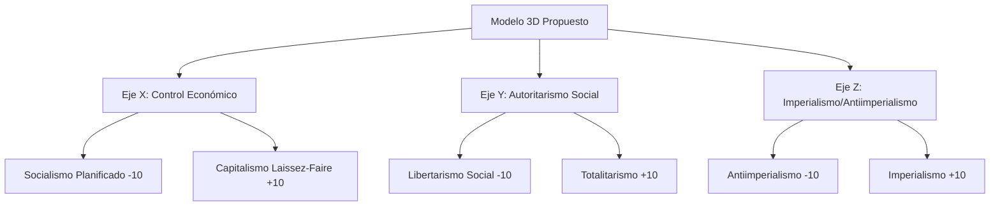
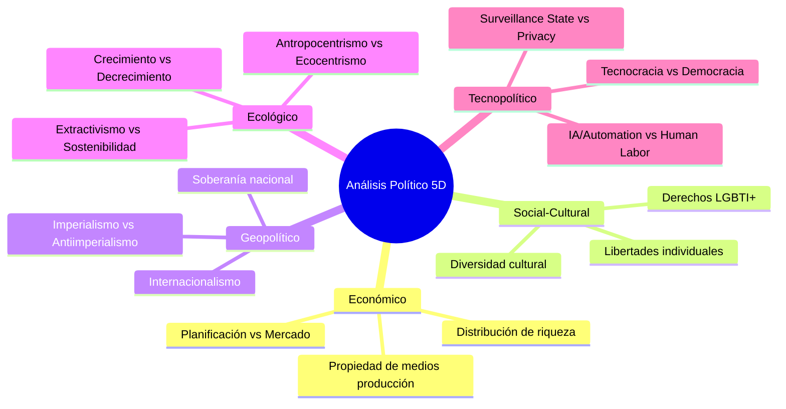
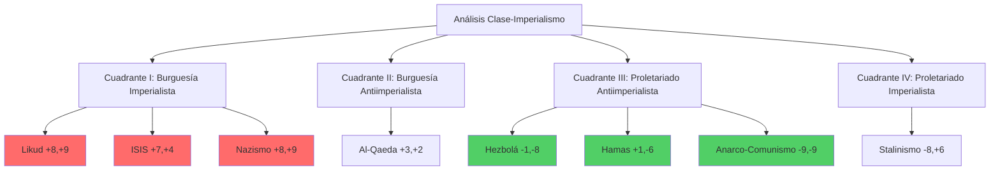

# Análisis Dimensional de Variables Políticas

## Limitaciones del Modelo 2D Tradicional

El Political Compass 2D (Económico-Social) presenta limitaciones significativas para el análisis político contemporáneo. Las dos dimensiones tradicionales no capturan la complejidad multifactorial de las ideologías políticas modernas.

## Propuesta de Variables Alternativas y Multidimensionales

### 1. **Modelo 3D Mejorado**

**Justificación del 3er Eje (Imperialismo):**
- **Crítico para organizaciones actuales**: Hamas vs ISIS, Hezbolá vs Al-Qaeda
- **Explica contradicciones**: Por qué Hezbolá (-1,+5,-8) difiere de ISIS (+8,+9,+6)
- **Contextualiza resistencia**: Diferencia entre resistencia antiimperialista y reacción fundamentalista

### 2. **Modelo Multidimensional (5D)**

## Aplicación a Organizaciones Analizadas

### **Organizaciones Sionistas Históricas**

**Irgun (Análisis 5D - Terror Colonial 1935-1948):**
- **Económico**: +7 (Capitalismo colonial con financiación externa)
- **Social**: +8 (Terror sistemático contra civiles árabes)
- **Geopolítico**: +8 (Instrumento del imperialismo británico)
- **Ecológico**: +5 (Destrucción de pueblos palestinos)
- **Tecnopolítico**: +6 (Uso de explosivos modernos, Hotel King David)

**Lehi/Stern Gang (Análisis 5D):**
- **Económico**: +8 (Financiación fascista, colaboración con nazis)
- **Social**: +8 (Asesinatos dirigidos, terror total)
- **Geopolítico**: +7 (Inicialmente pro-Eje, luego pro-occidental)
- **Ecológico**: +6 (Destrucción sistemática del paisaje palestino)
- **Tecnopolítico**: +7 (Asesinatos de precisión, bombas postal)

**Haganah (Análisis 5D):**
- **Económico**: +5 (Economía sionista institucional)
- **Social**: +7 ("Pureza de armas" pero ejecutor de la Nakba)
- **Geopolítico**: +7 (Brazo militar del proyecto colonial)
- **Ecológico**: +6 (Apropiación sistemática de tierras)
- **Tecnopolítico**: +5 (Organización militar convencional)

## Organizaciones Contemporáneas

### **Estado de Israel (Análisis 5D - Régimen Colonial 1948-2024)**
- **Económico**: +8 (Capitalismo settler-colonial militarizado)
- **Social**: +8 (Autoritarismo genocida sistemático desde Nakba)
- **Geopolítico**: +9 (Imperialismo occidental en Medio Oriente)
- **Ecológico**: +7 (Destrucción ambiental en territorios ocupados)
- **Tecnopolítico**: +8 (Estado de vigilancia total, Pegasus, Iron Dome)

### **ISIS (Análisis 5D)**
- **Económico**: +8 (Capitalismo esclavista)
- **Social**: +9 (Totalitarismo teocrático)
- **Geopolítico**: +4 (Anti-imperialismo occidental pero imperialismo islámico)
- **Ecológico**: +9 (Destrucción ambiental total)
- **Tecnopolítico**: +8 (Propaganda digital pero anti-modernidad)

### **Hezbolá (Análisis 5D)**
- **Económico**: -1 (Economía mixta con servicios sociales extensos)
- **Social**: +6 (Autoritarismo religioso con control territorial)
- **Geopolítico**: -8 (Resistencia antiimperialista activa)
- **Ecológico**: -1 (Algunos programas de desarrollo rural)
- **Tecnopolítico**: -2 (Tecnología defensiva, comunicaciones cifradas)

## Problemática de Reduccionismo 2D

### **Casos Problemáticos en 2D:**

1. **Confusión Hamas/ISIS**: En 2D aparecen próximos, en realidad son antagónicos
2. **Hezbolá mal categorizado**: 2D no captura su antiimperialismo
3. **Likud subestimado**: 2D no refleja su carácter genocida
4. **Falta dimensión ecológica**: Crucial para análisis contemporáneo

## Variables Alternativas Propuestas

### **Modelo Alternativo 2D Mejorado:**

**Opción A: Clase-Imperialismo**
- **Eje X**: Lucha de clases (-10 Proletario → +10 Burgués)  
- **Eje Y**: Antiimperialismo (-10 Antiimperialista → +10 Imperialista)

**Opción B: Autonomía-Dominación**
- **Eje X**: Autonomía individual (-10 Colectivismo → +10 Individualismo)
- **Eje Y**: Dominación sistémica (-10 Horizontal → +10 Jerárquico)

### **Reposicionamiento con Variables Clase-Imperialismo:**

## Recomendaciones

### **Para Representación Actual:**
1. **Mantener 2D pero agregar 3er eje**: Imperialismo como Z
2. **Usar colores/formas**: Diferenciar por dimensión imperial
3. **Añadir tooltip**: Con análisis multidimensional completo

### **Para Análisis Completo:**
1. **Desarrollar visualización 3D interactiva**
2. **Crear matriz multidimensional 5D**
3. **Incluir análisis temporal**: Evolución organizacional
4. **Contextualizar territorialmente**: Análisis geopolítico específico

## Conclusión Académica

El modelo 2D tradicional **subestima críticamente** las diferencias entre:
- **Resistencia antiimperialista** (Hamas, Hezbolá) vs **Reacción fundamentalista** (ISIS, Al-Qaeda)
- **Colonialismo settler-colonial** (Irgun→Estado Israel) vs **Autoritarismo clásico**
- **Terror colonial histórico** (Irgun, Lehi, Haganah) vs **Resistencia anticolonial**
- **Marxismo heterodoxo** vs **Estalinismo burocrático**

**Recomendación**: Implementar mínimo **modelo 3D** con eje antiimperialista para análisis riguroso de conflictos contemporáneos.

---

*Análisis basado en metodología de ciencia política comparada y estudios decoloniales*