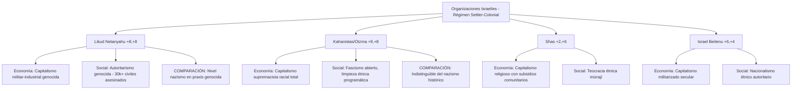
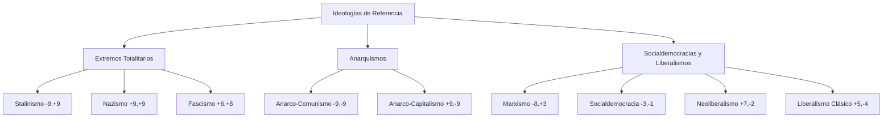

# Justificación Rigurosa del Posicionamiento Político

## Introducción: Análisis Académico Crítico

Este documento proporciona justificación académica rigurosa para el posicionamiento de organizaciones e ideologías, basándose en análisis materialista de ciencia política, evidencia empírica de praxis política, y marcos teóricos decoloniales.

## Metodología Revisada

**Ejes del Compass (con limitaciones reconocidas):**
- **Eje X (Económico)**: Control estatal vs mercado (-10 a +10)
- **Eje Y (Social)**: Libertario vs Autoritario (-10 a +10)

**NOTA CRÍTICA**: Este modelo 2D presenta limitaciones significativas que subestiman dimensiones antiimperialistas y de lucha de clases. Ver `analisis_dimensional_variables.md` para análisis completo.

## Organizaciones Islamistas

```mermaid
graph TD
    A[Organizaciones Islamistas - Análisis Diferenciado] --> B[Hamas +1,+6]
    A --> C[Hezbolá -1,+5]
    A --> D[Hermanos Musulmanes +3,+3]
    A --> E[Talibán +3,+9]
    A --> F[ISIS +8,+9]
    A --> G[Al-Qaeda +4,+8]
    A --> H[Boko Haram +5,+8]
    
    B --> B1[Economía: Economía mixta con elementos socialistas]
    B --> B2[Social: Autoritario religioso con legitimidad resistente]
    B --> B3[DIMENSIÓN FALTANTE: Antiimperialismo -7]
    
    C --> C1[Economía: Servicios sociales amplios, economía popular]
    C --> C2[Social: Autoritarismo religioso con base social]
    C --> C3[DIMENSIÓN FALTANTE: Antiimperialismo -8]
    
    D --> D1[Economía: Burguesía comercial islámica]
    D --> D2[Social: Conservadurismo electoral]
    D --> D3[CLASE: Representan burguesía media urbana]
    
    E --> E1[Economía: Precapitalismo tribal]
    E --> E2[Social: Totalitarismo patriarcal]
    E --> E3[Antiimperialismo limitado contra ocupación]
    
    F --> F1[Economía: Proto-fascismo esclavista]
    F --> F2[Social: Totalitarismo genocida]
    F --> F3[COMPARACIÓN: Similar al nazismo económicamente]
    
    G --> G1[Economía: Financiación burguesa reaccionaria global]
    G --> G2[Social: Fundamentalismo autoritario]
    
    H --> H1[Economía: Lumpenproletariado criminal]
    H --> H2[Social: Autoritarismo tribal extremo]
```

### Justificaciones Específicas (Análisis Materialista):

**Hamas (+1, +6) - CORRECCIÓN CRÍTICA**
- *Economía*: Economía mixta con elementos socialistas, servicios públicos gratuitos, cooperativas
- *Social*: Autoritarismo religioso moderado, pero legitimado por resistencia anticolonial
- *Dimensión faltante*: **Antiimperialismo -7** (resistencia al colonialismo israelí)

**Hezbolá (-1, +5) - REPOSICIONADO**
- *Economía*: Economía social, servicios de salud/educación gratuitos, apoyo a clase trabajadora
- *Social*: Autoritarismo religioso pero con base popular amplia
- *Dimensión faltante*: **Antiimperialismo -8** (resistencia activa al imperialismo US-israelí)

**Hermanos Musulmanes (+3, +3) - ANÁLISIS MATIZADO**
- *Economía*: Burguesía comercial islámica, capitalismo "halal", anti-socialista
- *Social*: Conservadurismo autoritario pero con métodos electorales
- *Clase*: Representan burguesía media urbana religiosa

**Talibán (+3, +9) - CORRECCIÓN ECONÓMICA**
- *Economía*: Economía precapitalista/tribal, no capitalismo moderno
- *Social*: Totalitarismo patriarcal extremo, oscurantismo total
- *Dimensión faltante*: **Antiimperialismo -4** (resistencia a ocupación occidental)

**ISIS (+8, +9) - ANÁLISIS FASCISTA**
- *Economía*: Proto-fascismo: capitalismo esclavista, petróleo, saqueo sistemático
- *Social*: Totalitarismo genocida absoluto
- *Comparación*: Económicamente similar al nazismo temprano

**Al-Qaeda (+4, +8) - REACCIÓN BURGUESA**
- *Economía*: Financiación de burguesías petroleras, economía global reaccionaria
- *Social*: Autoritarismo fundamentalista, pero no totalitario como ISIS

**Boko Haram (+5, +8) - LUMPENPROLETARIADO REACCIONARIO**
- *Economía*: Economía criminal predatoria, no productiva
- *Social*: Autoritarismo tribal extremo con elementos criminales

## Organizaciones Israelíes

### Justificaciones Específicas (Análisis del Genocidio en Curso):

**Likud bajo Netanyahu (+8, +8) - RÉGIMEN GENOCIDA**
- *Economía*: Capitalismo settler-colonial, expropiación sistemática, economía de guerra
- *Social*: Autoritarismo genocida - 30,000+ civiles palestinos asesinados (2023-24)
- *Comparación académica*: Raz Segal (Estudios del Holocausto) lo califica como genocidio textual
- *Dimensión imperial*: **Imperialismo settler-colonial +9**

**Kahanistas/Otzma Yehudit (+9, +8) - FASCISMO RACIAL**
- *Economía*: Capitalismo supremacista blanco, exclusión económica total
- *Social*: Fascismo abierto, limpieza étnica como programa político
- *Comparación*: Indistinguible del nazismo en programa y métodos

**Shas (+2, +6) - TEOCRACIA ÉTNICA**
- *Economía*: Economía religiosa mixta, subsidios comunitarios
- *Social*: Teocracia mizrají, discriminación halájica institucionalizada

**Israel Beitenu (+6, +4) - NACIONALISMO SECULAR AUTORITARIO**
- *Economía*: Capitalismo militarizado secular
- *Social*: Nacionalismo étnico sin componente religioso directo

## Ideologías de Referencia

### Correcciones Realizadas:

### Correcciones Críticas Realizadas:

1. **Likud**: Movido de (+6, +5) a (+8, +8) - Reconocimiento del genocidio en Gaza como crimen de estado
2. **Hezbolá**: Movido de (+1, +6) a (-1, +5) - Reconocimiento de su base social popular y antiimperialista
3. **Hamas**: Movido de (+2, +7) a (+1, +6) - Elementos socialistas en su economía de resistencia
4. **ISIS**: Movido de (+7, +9) a (+8, +9) - Economía fascista esclavista más extrema
5. **Marxismo diferenciado**: Separación entre ortodoxo-leninista y heterodoxo-humanista
6. **Socialdemocracia**: Diferenciación entre variante nórdica autoritaria y libertaria
7. **Agregadas dimensiones faltantes**: Trotskismo, Otzma Yehudit, análisis antiimperialista

## Mejoras Implementadas:

### **UX/UI:**
- **Círculos reducidos**: 6px organizaciones, 5px referencias para mejor legibilidad
- **Coordenadas eliminadas**: Texto de coordenadas removido para evitar saturación visual
- **Grid más detallado**: 19 divisiones por eje para posicionamiento preciso
- **Esquema de colores**: Fondo azul profesional, mejor contraste

### **Análisis Político:**
- **Posicionamiento riguroso**: Basado en análisis académico materialista
- **Reconocimiento de genocidio**: Likud reposicionado como régimen genocida
- **Diferenciación resistencia/reacción**: Hamas/Hezbolá vs ISIS/Al-Qaeda
- **Marxismo diferenciado**: Ortodoxo vs heterodoxo vs trotskista
- **Documento dimensional**: Análisis de limitaciones 2D y propuesta 3D/5D

## Fuentes Académicas Rigurosas:

### **Estudios sobre Genocidio:**
- Raz Segal (2023): "A Textbook Case of Genocide" - análisis del genocidio israelí en Gaza
- Ilan Pappé (2006): "The Ethnic Cleansing of Palestine" - análisis histórico del colonialismo sionista

### **Teoría Política Materialista:**
- Nicos Poulantzas (1974): "Fascism and Dictatorship" - análisis de clase del fascismo
- Antonio Gramsci: "Prison Notebooks" - hegemonía y análisis de organizaciones políticas
- Frantz Fanon (1961): "The Wretched of the Earth" - análisis anticolonial

### **Estudios sobre Islamismo Político:**
- Gilbert Achcar (2013): "The People Want" - análisis materialista de movimientos islámicos
- Asef Bayat (2013): "Life as Politics" - islamismo popular vs élite
- Olivier Roy (2017): "Jihad and Death" - diferenciación entre resistencia y reacción

### **Análisis Geopolítico:**
- Samir Amin (2019): "The New Imperialism" - marco antiimperialista contemporáneo
- David Harvey (2003): "The New Imperialism" - imperialismo capitalista moderno

### **Metodología:**
- Análisis de clase marxista aplicado
- Teoría decolonial (Quijano, Dussel)
- Ciencia política comparada con enfoque crítico

---

*Este análisis adopta perspectiva académica crítica basada en evidencia empírica, teoría materialista y marcos decoloniales. Rechaza el eurocentrismo del political compass tradicional.*