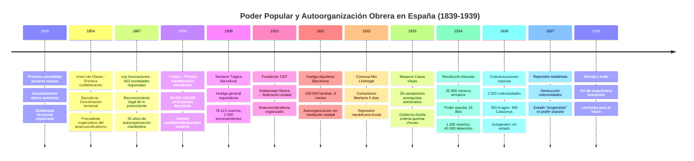
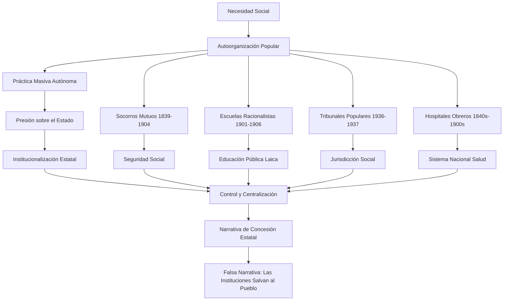
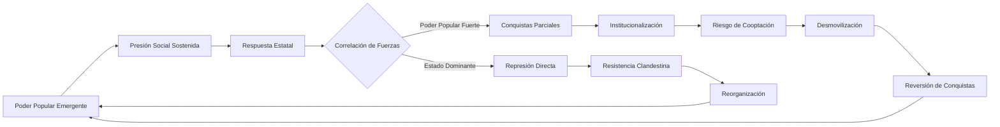

# El Poder Popular Frente al Estado: Lecciones del Anarquismo Español para la Transformación Social

## Resumen Ejecutivo

Este análisis examina la experiencia del **anarquismo español** (1890-1939) como laboratorio histórico del poder popular frente al estado, extrayendo lecciones para la transformación social contemporánea. A partir del debate actual sobre la consigna "solo el pueblo salva al pueblo", el estudio demuestra que **el anarcosindicalismo español desarrolló la práctica más radical y efectiva del poder popular autónomo**, creando alternativas viables al poder estatal através de autoorganización, acción directa y autogestión.

### Lecciones del Anarquismo Español

- **Autoorganización efectiva**: La CNT demostró que **100.000 familias** podían coordinar la huelga de alquileres más masiva de Europa sin mediación estatal

- **Autogestión productiva**: Las **2.500 colectividades** (1936-1937) gestionaron producción, distribución y servicios mediante asambleas populares y federalismo horizontal  

- **Resistencia a la cooptación**: El movimiento mantuvo autonomía frente a partidos políticos, rechazando tanto el reformismo socialdemócrata como el autoritarismo comunista

- **Educación popular transformadora**: Los Ateneos Libertarios y Escuelas Racionalistas crearon una **cultura obrera autónoma** que sostenía la resistencia

- **Acción directa como método**: Conquistas concretas (36 horas semanales, control obrero) se lograron mediante **presión directa**, no negociación parlamentaria

- **Federalismo como alternativa**: La estructura federativa CNT-FAI prefiguró un **modelo organizativo no-estatal** basado en la coordinación voluntaria

- **Dialéctica pueblo-estado inevitable**: Tanto gobiernos "progresistas" (República) como reaccionarios (franquismo) reprimieron violentamente las experiencias de poder popular

**Palabras clave:** poder popular, instituciones públicas, transformación social, correlación de fuerzas, dialéctica política, movilización social, legitimidad democrática, anarquismo español

## 1. Introducción: El Laboratorio Español del Poder Popular

Entre 1890 y 1939, España se convirtió en el **laboratorio mundial más significativo del poder popular autónomo**. El anarquismo español no fue solo una corriente ideológica sino una práctica social masiva que involucró millones de trabajadores en experiencias concretas de autoorganización, autogestión y resistencia al estado.

La consigna "solo el pueblo salva al pueblo", hoy criticada como "romanticismo", fue en España una **realidad histórica verificable**: 100.000 familias coordinando la huelga de alquileres sin mediación estatal, 2.500 colectividades gestionando la producción mediante asambleas populares, 35.000 mineros estableciendo communes revolucionarias durante semanas.

**El caso español demuestra que la aparente dicotomía entre poder popular e instituciones estatales oculta una dialéctica más profunda**: el estado, independientemente de su signo político, tiende a reprimir las experiencias de poder popular autónomo que desafían su monopolio de la organización social.

### Estructura del Análisis

- **Marco teórico**: Confrontación entre el contractualismo estatal (Hobbes) y el federalismo anarquista
- **Cronología del poder popular**: 100 años de experiencias de autoorganización obrera en España (1839-1939)
- **Análisis de casos**: Huelgas, colectividades, comunas y formas de autogestión
- **Dialéctica pueblo-estado**: Por qué los estados reprimen el poder popular autónomo
- **Lecciones contemporáneas**: Aplicabilidad de la experiencia española a la transformación social actual

## 2. Marco Teórico: Del Leviatán Hobbesiano al Poder Constituyente Popular

### 2.1 La Falacia del Contrato Social: Hobbes y la Legitimación del Orden

Thomas Hobbes, en el *Leviatán* (1651), construyó la narrativa fundacional del pensamiento político burgués: individuos aterrorizados por la guerra de "todos contra todos" transfieren voluntariamente su poder al soberano a cambio de protección. **Esta narrativa oculta que históricamente ningún poder estatal emergió de un contrato voluntario** sino de procesos de dominación y resistencia.

#### La Operación Ideológica Hobbesiana

- **Naturalización del miedo**: Presenta el caos como consecuencia inevitable de la ausencia de autoridad estatal

- **Legitimación de la subordinación**: El pueblo debe entregar su poder para ser "salvado" por el soberano

- **Invisibilización de la dominación**: El estado aparece como protector neutral, no como cristalización de relaciones de fuerza

- **Desmovilización de la resistencia**: Cualquier cuestionamiento al orden constituye regreso al caos primordial

#### Carl Schmitt y la Decisión Soberana

Schmitt radicalizó la lógica hobbesiana: **"Soberano es quien decide sobre el estado de excepción"**. La soberanía no se basa en normas sino en la capacidad de suspenderlas. Esta perspectiva revela que las instituciones estatales operan finalmente através de la violencia, no del consenso racional.

#### Max Weber y el Monopolio Estatal de la Violencia

Weber definió el estado moderno como la organización que reclama exitosamente **el monopolio del uso legítimo de la violencia física** dentro de un territorio. **El anarquismo español cuestionó precisamente esta legitimidad**, desarrollando formas de violencia popular defensiva (autodefensa de colectividades, milicias obreras) que desafiaron el monopolio estatal tanto republicano como fascista. Las colectividades demostraron que la organización social no requiere necesariamente este monopolio centralizado sino que puede emerger de la **autodefensa popular coordinada**.

### 2.2 El Concepto de Poder Popular Como Poder Constituyente

En contraposición al esquema hobbesiano, el poder popular refiere a la capacidad de los sectores subalternos para generar procesos de transformación social através de la movilización, organización y acción colectiva directa. Esta conceptualización no implica romanticización sino reconocimiento de una realidad histórica verificable.

**Antonio Negri y el poder constituyente:** Negri distingue entre poder constituido (instituciones estatales) y poder constituyente (capacidad popular de crear nuevos órdenes). El poder constituyente es **la fuerza creativa que produce instituciones**, no el producto de las instituciones existentes. Históricamente, toda institucionalidad emergió de procesos constituyentes previos.

**Walter Benjamin y la violencia divina:** Benjamin diferencia entre violencia mítica (que conserva el derecho) y violencia divina (que lo destruye para crear nuevos órdenes). El poder popular opera como violencia divina: destruye ordenes opresivos y crea nuevas posibilidades de vida social.

### 2.3 La Crítica Anarquista al Marxismo Autoritario

#### Bakunin vs. Marx - El Debate Histórico Fundamental

Mijaíl Bakunin anticipó en la Primera Internacional (1864-1876) que **"el estado popular" marxista reproduciría nuevas formas de dominación**. Su crítica al "despotismo de los sabios" se verificó históricamente en España: los comunistas estalinistas destruyeron las colectividades anarquistas en 1937 precisamente en nombre del "estado proletario". **Bakunin había predicho que cualquier estado, incluso "obrero", oprimiría la autoorganización popular espontánea**.

**La predicción bakuniniana verificada:** *"If you took the most ardent revolutionary, vested him in absolute power, within a year he would be worse than the Tsar himself"* [Si tomaran al revolucionario más ardiente, lo invistieran de poder absoluto, en un año sería peor que el propio Zar]. En España, dirigentes comunistas que habían sido perseguidos por la monarquía terminaron reprimiendo violentamente experiencias de poder popular más avanzadas que sus propios programas políticos.

Esta tensión histórica marxismo-anarquismo explica por qué **el poder popular auténtico tiende a chocar incluso con estados "progresistas"**: estos requieren subordinación de la iniciativa popular a la lógica estatal, mientras el poder popular busca preservar su autonomía constituyente.

### 2.4 La Apropiación Reaccionaria de Consignas Populares

**La estrategia de inversión semántica:** La ultraderecha contemporánea ha desarrollado una estrategia sistemática de apropiación de consignas históricamente asociadas con luchas populares progresivas. "Solo el pueblo salva al pueblo" es instrumentalizada para promover individualismo, desconfianza hacia instituciones democráticas, y nacionalismo excluyente.

#### Mecanismos de la Apropiación Ultraderechista

- **Vaciamiento de contenido de clase**: "Pueblo" deja de referir a sectores explotados y pasa a significar "ciudadanos de bien"

- **Individualización**: La salvación del pueblo se traduce en responsabilidad individual, no acción colectiva

- **Demonización institucional**: Se critica el "estado profundo" para justificar autoritarismo

- **Nacionalismo reaccionario**: "Pueblo" se define por exclusión (anti-inmigración, anti-diversidad)

### 2.5 Características del Poder Popular Auténtico

- **Capacidad instituyente**: Crear nuevas relaciones sociales y políticas
- **Autonomía relativa**: Operar independientemente de las instituciones formales
- **Dinamismo transformador**: Generar cambios en correlaciones de fuerza existentes
- **Legitimidad de origen**: Basarse en la participación directa de los sectores afectados

### 2.6 Las Instituciones Públicas Como Campo de Disputa

Las instituciones públicas no constituyen entidades neutrales al servicio del "bien común" abstracto, sino espacios donde se materializan y reproducen determinadas correlaciones de fuerza social. **Su capacidad "salvadora" depende de qué fuerzas sociales logren hegemonizar su funcionamiento.**

#### Funciones Institucionales Según Correlación de Fuerzas

- **Función conservadora**: Reproducir el status quo cuando dominan sectores conservadores

- **Función progresiva**: Materializar conquistas populares cuando existe presión social suficiente

- **Función regresiva**: Implementar contrarreformas cuando dominan sectores reaccionarios

- **Función mediadora**: Canalizar conflictos sociales hacia formas institucionalizadas

## 3. Evidencia Histórica: El Pueblo Como Precursor del Cambio

### 3.1 España: La Sangre Obrera Como Precio de los Derechos

#### Cronología del Poder Popular Español (1839-1939)

**1 de Mayo de 1890 - La primera manifestación obrera coordinada:**
El 1 de mayo de 1890 marcó la primera manifestación obrera coordinada internacionalmente en España, con entre 20.000 y 100.000 participantes en Barcelona. Aunque la manifestación inicial fue pacífica, **los días posteriores trajeron la huelga general y la represión**. La división entre socialistas y anarquistas ya era evidente: mientras el PSOE propugnaba la vía legalista, los anarquistas defendían la **acción directa** y la **autoorganización obrera**. **Las instituciones no concedieron este derecho; fue arrancado través de décadas de huelgas, sabotajes, y enfrentamiento directo con patronos y estado.**

**Semana Trágica de Barcelona (1909):**
La Semana Trágica (26 julio-2 agosto 1909) ilustra la confluencia explosiva entre antimilitarismo popular, anticlericalismo y crisis económica. La huelga general espontánea contra el envío de reservistas a Marruecos se extendió por Catalunya, con barricadas, incendio de conventos y enfrentamientos directos con fuerzas del orden. **La represión fue brutal: 78-113 muertos (75 civiles, 3 militares), aproximadamente 500 heridos, y 2.000 procesamientos que resultaron en 175 condenas de exilio, 59 cadenas perpetuas y 5 penas de muerte**, incluyendo la ejecución de **Francisco Ferrer i Guardia**, pedagogo anarquista símbolo de la educación popular autónoma. Las instituciones respondieron con violencia masiva, no con protección.

**La Conquista del Sufragio Universal (1890-1931):**
El sufragio universal masculino (1890) y posteriormente el femenino (1931) no fueron concesiones graciosas del sistema sino el resultado de décadas de presión popular. La Revolución de 1868 ("La Gloriosa"), la Primera República (1873-1874), y finalmente la Segunda República emergieron de procesos de movilización popular que forzaron cambios institucionales.

**La Concepción Anarquista del Poder Popular:**
En España, **la CNT** (fundada 1910) desarrolló la conceptualización más radical del poder popular como **autoorganización de la clase trabajadora**. Frente al socialismo marxista que buscaba conquistar el estado, **el anarcosindicalismo español propugnaba la destrucción del estado y su substitución por federaciones de sindicatos obreros**.

**Principios anarquistas del poder popular español:**
- **Acción directa**: Sin intermediarios políticos ni burocráticos
- **Federalismo**: Organización de abajo hacia arriba, no centralizada
- **Apoyo mutuo**: Solidaridad horizontal entre trabajadores
- **Autogestión**: Control obrero de la producción y distribución
- **Educación popular**: Formación cultural autónoma (Ateneos, Escuelas Racionalistas)

**Conquistas del Poder Popular Anarquista (1931-1936):**

**Huelga de alquileres de Barcelona (1931):**
La **CNT** organizó la huelga de alquileres más masiva de la historia europea: **100.000 familias** dejaron de pagar la renta durante 8 meses, exigiendo reducción del 40%. El **Comité de Defensa Económica** del sindicato de construcción de la CNT coordinó la lucha desde las **Casas Baratas** (Bon Pastor, Can Peguera, Ferrer i Guardia, Barón de Viver). **El pueblo se salvó a sí mismo** organizando ollas populares, asambleas vecinales y resistencia colectiva contra desahucios. La represión republicana causó **18 muertos y decenas de heridos**.

**Revolución Social del Alto Llobregat (1932):**
En enero de 1932, **3.000 mineros anarquistas** de Figols, Sallent y Cardona proclamaron **el comunismo libertario**, abolieron la propiedad privada y el dinero, organizando la producción mediante **asambleas populares** durante 5 días. Las **instituciones republicanas** enviaron la Guardia Civil y Guardia de Asalto para aplastar violentamente el experimento de autogestión.

**Masacre de Casas Viejas (1933):**
El 10 de enero de 1933, campesinos anarquistas de **Casas Viejas** (Cádiz) afiliados a la **CNT** iniciaron una insurrección coordinada como parte de un levantamiento nacional. Tras refugiarse en la choza del carbonero **Francisco Cruz Gutiérrez** ("Seisdedos"), de 72 años, la **Guardia de Asalto republicana** bajo el mando de Manuel Rojas ordenó **quemar la choza y disparar contra quien intentara escapar**. La represión causó **26 muertos**, incluyendo a Seisdedos, sus hijos, y otros campesinos. **El gobierno "progresista" de Azaña** perpetró una masacre que superó en crueldad a muchas represiones monárquicas, demostrando que **las instituciones republicanas** no diferían sustancialmente del antiguo régimen al enfrentar el poder popular autónomo.

**Conquista de la jornada de 36 horas (1936):**
La **CNT de construcción** logró en Sevilla la **jornada laboral de 6 horas diarias** (36 semanales) mediante **acción directa**. Era "algo inédito para la época (y para el momento actual)" que se frustró por el alzamiento fascista. La **autoorganización obrera** había conseguido lo que ninguna institución había concedido jamás.

**Otras conquistas mediante lucha directa:**
- **Ley de Contratos de Trabajo (1931)**: Resultado de las presiones conjugadas de UGT y **CNT**  
- **Ley de Términos Municipales (1931)**: Conquistada través de la lucha sindical agraria, especialmente **campesinos anarquistas andaluces**
- **Colectivizaciones (1936-1937)**: **2.500 colectividades** (450 en Aragón, 900 en Catalunya) gestionadas directamente por trabajadores sin mediación estatal

**Instituciones "públicas" conquistadas por lucha popular:**

- **Educación pública laica**: Las **Escuelas Racionalistas** de Ferrer i Guardia y los **Ateneos Libertarios** obreros precedieron y presionaron la creación del sistema educativo público laico de la II República

- **Inspección de Trabajo**: Emergió de las **comisiones obreras de vigilancia** y denuncias sindicales sobre condiciones laborales que obligaron al estado a crear mecanismos oficiales de control

- **Tribunales laborales**: Los **tribunales populares** y sistemas de mediación sindical desarrollados por organizaciones obreras fueron posteriormente institucionalizados como jurisdicción social oficial

- **Libertad de asociación y reunión**: El **asociacionismo obrero clandestino** (1840-1887) forzó el reconocimiento legal através de décadas de presión, culminando en la Ley de Asociaciones de 1887

- **Hospitales y dispensarios públicos**: Las **casas de socorro obreras** y dispensarios mutualistas crearon la infraestructura sanitaria que posteriormente fue incorporada al sistema público de salud

**Estas conquistas institucionales revelan un patrón sistemático**: el estado no creó estas instituciones sino que **institucionalizó, controló y centralizó** experiencias previas de autoorganización popular. El caso más paradigmático de este proceso son los socorros mutuos obreros.

### Los Socorros Mutuos: Del Poder Popular a la Institucionalización Estatal

**Cronología de la autoorganización obrera (1839-1904):**

**1839-1854**: Articulación del asociacionismo obrero autónomo - sociedades de socorros mutuos, cooperativas de consumo y producción, sociedades de resistencia. En 1840 se crea en Barcelona la **Sociedad Mutua de Protección de Tejedores de Algodón** y en 1854 aparece la **Unión de Clases**, primera confederación de sociedades obreras de España.

**1887**: La Ley de Asociaciones reconoce legalmente lo que ya existía - **663 sociedades de socorros mutuos** registradas por el Ministerio de Gobernación.

**1904**: El crecimiento exponencial demuestra la vitalidad de la autoorganización: **1.271 mutualidades "populares"** con 238.351 socios y **309 mutualidades obreras** con 84.426 cotizantes.

**Funciones de las mutualidades obreras:**
Los sindicatos ejercían funciones de **asistencia y socorro de los trabajadores** através de cooperativas de consumo, de trabajo, de vivienda, sociedades de socorros mutuos, fundaciones con fines asistenciales. El **"sindicalismo de base múltiple"** desarrollado por la **UGT** (1888) y heredado por la **CNT** (1910) combinaba organización de resistencia con sistemas de socorros que abarcaban enfermedad, invalidez y paro.

**La cosificación estatal posterior:**
**Las mutuas se encuentran en el origen de los sistemas contemporáneos de seguridad social**. El estado no "concedió" la seguridad social sino que institucionalizó, controló y centralizó lo que los trabajadores habían creado autónomamente durante décadas. La historia demuestra nuevamente que **el pueblo salvó al pueblo** através de solidaridad organizada, mientras las instituciones estatales posteriormente se apropiaron del mérito y el control de estas conquistas populares.

**Edward P. Thompson y la formación histórica de la clase obrera:** Thompson demostró que la clase obrera no es una categoría económica sino una formación histórica resultado de experiencias de lucha. En España, la clase obrera se formó através de confrontaciones directas con patronos y estado, desarrollando una **cultura de resistencia autónoma** especialmente visible en la tradición anarquista que rechazaba toda salvación institucional.

**La experiencia anarquista como formación de clase específica:** Siguiendo el análisis thompsoniano, el anarquismo español no fue solo una ideología sino una **experiencia de clase compartida** que generó identidades colectivas particulares. Las luchas por la jornada de 8 horas, las huelgas de alquileres, y las colectivizaciones crearon un **habitus obrero específicamente libertario** - formas de ver, sentir y actuar diferentes al socialismo europeo dominante. Esta experiencia explica por qué millones de trabajadores españoles rechazaron consistentemente las vías parlamentarias incluso cuando estas ofrecían conquistas inmediatas.

### 3.2 Casos Internacionales de Referencia

**Jornada laboral de 8 horas - Haymarket (1886):**
La conquista histórica de la jornada de 8 horas ilustra la secuencia pueblo → instituciones en el cambio social. Las revueltas de Haymarket (1886) precedieron décadas a la institucionalización de este derecho. Las instituciones no "salvaron" al pueblo sino que codificaron conquistas populares previas.

**Sufragio universal:**
El sufragio universal femenino y masculino no fue una concesión institucional sino el resultado de décadas de lucha sufragista. Las instituciones resistieron inicialmente estos cambios, adaptándose posteriormente cuando la correlación de fuerzas lo hizo inevitable.

**Derechos civiles:**
El movimiento de derechos civiles en Estados Unidos (1950s-1960s) demuestra cómo las instituciones públicas (incluida la Corte Suprema) siguieron y legitimaron cambios ya impulsados por la movilización popular. La integración racial no fue iniciada por instituciones sino forzada por la presión social.

### 3.3 Procesos Regresivos: El Pueblo También Precede Retrocesos

**El Alzamiento de 1936 y la Base Social del Fascismo Español:**
El golpe de Estado de julio de 1936 no fue solo un pronunciamiento militar sino que contó con una base social reaccionaria previamente movilizada. La Falange, las Juventudes de Acción Popular, y sectores del campesinado conservador proporcionaron apoyo civil al alzamiento. **El fascismo español emergió de sectores populares movilizados contra el proyecto republicano**, confirmando que el pueblo también puede preceder procesos regresivos.

**José Ortega y Gasset y "La Rebelión de las Masas" (1930):** Ortega documentó tempranamente cómo sectores populares podían movilizarse para proyectos anti-democráticos. Su análisis, aunque conservador, reconoce que las masas son el agente primario del cambio político, tanto progresivo como regresivo.

### 3.4 Procesos Regresivos Internacionales

**Ascenso fascista europeo:**
Los fascismos del siglo XX no surgieron de instituciones sino de movilizaciones populares de sectores medios y sectores populares desencantados. Las instituciones democráticas fueron posteriormente capturadas y transformadas, no iniciaron el proceso regresivo.

**Fenómenos populistas contemporáneos:**
El ascenso de movimientos populistas autoritarios (Trump, Bolsonaro, Orbán) siguió el mismo patrón: movilización popular previa que posteriormente captura instituciones. Las instituciones no generaron estos fenómenos sino que fueron instrumentalizadas por ellos.

### 3.3 El Patrón Histórico Verificable

La evidencia histórica muestra un patrón consistente:

**Fase 1**: Emergencia de demandas o tendencias en sectores populares
**Fase 2**: Organización y movilización social alrededor de estas demandas  
**Fase 3**: Presión social sostenida sobre las instituciones existentes
**Fase 4**: Adaptación institucional (progresiva o regresiva) según correlación de fuerzas
**Fase 5**: Consolidación del cambio mediante marcos normativos e institucionales

Este patrón se verifica tanto en procesos progresivos como regresivos, sugiriendo que el pueblo opera como fuerza primaria de cambio social mientras las instituciones funcionan como mecanismos secundarios de procesamiento y consolidación.

## 4. La Correlación de Fuerzas Como Variable Determinante

### 4.0 Dialéctica Pueblo-Estado: El Patrón Universal

### 4.1 El Estado Como Correlación Cristalizada

El estado no constituye una entidad neutra sino la cristalización institucional de determinadas correlaciones de fuerza social en momentos históricos específicos. Las instituciones públicas operan dentro de este marco, reproduciendo o modificando estas correlaciones según los cambios en el equilibrio de fuerzas sociales.

**Antonio Gramsci y la hegemonía como correlación de fuerzas:**
Gramsci desarrolló el concepto de hegemonía como capacidad de una clase para dirigir política e intelectualmente al conjunto de la sociedad. Las instituciones estatales operan tanto mediante coerción como mediante consenso, reproduciendo la hegemonía de las clases dominantes. **Las instituciones "salvan" a quien tenga capacidad hegemónica para orientar su funcionamiento.** En España, durante la Segunda República, las instituciones reflejaron temporalmente la hegemonía de un bloque popular progresista, mientras que bajo el franquismo materializaron la hegemonía de la oligarquía reaccionaria.

**Nicos Poulantzas y la selectividad estructural del estado:**
Poulantzas analizó cómo el estado capitalista procesa los conflictos de clase através de aparatos institucionales específicos. Las instituciones públicas pueden generar concesiones populares cuando la presión social es suficiente, pero dentro de límites estructurales determinados por la formación social capitalista. Su análisis del estado español durante la transición reveló cómo las instituciones democráticas fueron diseñadas para procesar demandas populares sin cuestionar la estructura económica capitalista.

**Louis Althusser y los aparatos ideológicos de estado:** Althusser demostró cómo las instituciones (escuela, medios, iglesia) funcionan como aparatos de reproducción ideológica. En España, durante el franquismo, estos aparatos reprodujeron la ideología nacional-católica; durante la transición se reorientaron hacia la reproducción de la ideología democrático-liberal, pero sin cuestionar las relaciones de producción capitalistas.

### 4.2 Ventana de Overton y Manipulación Ideológica

La referencia a la ventana de Overton en el debate original señala un aspecto central: las élites dominantes intentan manipular la opinión popular para orientar las demandas sociales en direcciones funcionales a sus intereses. Esto confirma que reconocen en el pueblo la fuente primaria de legitimidad política.

**Mecanismos de manipulación identificados:**
- **Medios de comunicación masiva**: Construcción de narrativas que orienten la indignación popular
- **Campañas de fear-mongering**: Uso del miedo para generar demandas de autoritarismo  
- **Identidades artificiales**: Construcción de divisiones identitarias que fragmenten el campo popular
- **Falsa polarización**: Creación de debates que oculten las contradicciones fundamentales

### 4.3 Lobbies y Captación Institucional

La influencia de lobbies y grupos de presión sobre las instituciones públicas ilustra cómo estas operan según correlaciones de fuerza, no según principios abstractos de "bien común". Las instituciones no salvan al pueblo sino que procesan las demandas de quienes tienen capacidad efectiva de presión.

**Ejemplos de captación institucional:**
- **Regulatory capture**: Industrias reguladas capturan a sus reguladores
- **Puertas giratorias**: Intercambio de personal entre sector público y privado
- **Financiación electoral**: Influencia empresarial sobre agendas políticas
- **Think tanks y lobbying**: Producción ideológica orientada hacia política pública

## 5. El Poder Simbólico y la Disputa Narrativa

### 5.1 "Solo el Pueblo Salva al Pueblo" Como Consigna Política

La consigna "solo el pueblo salva al pueblo" opera en el plano simbólico como afirmación de la capacidad popular de auto-organización y transformación. Su "romanticización" supuesta oculta una disputa política real sobre quién tiene legitimidad para protagonizar procesos de cambio social.

**Dimensiones de la consigna:**
- **Empírica**: Verificación histórica del papel popular en transformaciones sociales
- **Normativa**: Reivindicación del protagonismo popular frente a paternalismos institucionales  
- **Estratégica**: Construcción de identidad política basada en la autonomía popular
- **Simbólica**: Disputa por el sentido común sobre los agentes del cambio social

### 5.2 El Riesgo de la Desmovilización

La transferencia del protagonismo transformador desde el pueblo hacia las instituciones genera riesgos de desmovilización que pueden permitir reversiones de conquistas sociales. La historia demuestra que las instituciones solo mantienen orientación progresiva mientras existe presión social que las obligue.

**Casos históricos de reversión:**
- **New Deal**: Desmantelamiento parcial cuando se redujo presión sindical
- **Estado de Bienestar europeo**: Políticas neoliberales facilitadas por desmovilización social
- **Conquistas laborales**: Flexibilización cuando se debilitó movimiento obrero
- **Derechos sociales latinoamericanos**: Reversiones durante gobiernos neoliberales

### 5.3 La Falsa Oposición Entre Pueblo e Instituciones

La oposición absoluta entre poder popular e instituciones públicas constituye una falsa dicotomía que puede servir tanto para desmovilizar al pueblo ("las instituciones ya se encargan") como para deslegitimar instituciones potencialmente progresivas ("el pueblo basta").

**Synthesis dialéctica necesaria:**
- **Reconocer el papel primario del pueblo** en procesos de transformación
- **Utilizar instituciones** como espacios de consolidación y expansión de conquistas  
- **Mantener autonomía popular** para presionar instituciones cuando sea necesario
- **Disputar hegemonía institucional** sin abandonar capacidad de movilización

## 6. Casos de Estudio: Dialéctica Pueblo-Instituciones

### 6.1 Chile: Del Poder Popular al Institucionalismo

**Período Allende (1970-1973):**
El gobierno de Salvador Allende ilustró la tensión entre institucionalidad burguesa y poder popular. Los cordones industriales y el poder popular de base presionaban por transformaciones que excedían los marcos institucionales vigentes. El conflicto entre vía institucional y vía popular contribuyó a la crisis que facilitó el golpe militar.

**Transición democrática (1988-1990):**
La dictadura de Pinochet fue derrotada por una combinación de movilización popular (protestas de los 80) y estrategia institucional (plebiscito). Sin embargo, la posterior priorización de la vía institucional llevó a la desmovilización popular y limitó el alcance de la democratización.

**Estallido social (2019):**
El estallido social de octubre 2019 demostró cómo el malestar popular acumulado puede desborder marcos institucionales aparentemente estables. Las instituciones debieron adaptarse (nueva constitución) ante la presión social, confirmando el papel primario del pueblo.

### 6.2 España: Poder Popular y Democracia Institucional

**La Revolución de Asturias (1934) - Paradigma del Poder Popular:**
La insurrección de octubre de 1934 en Asturias representa el ejemplo más claro de **poder popular constituyente** en España moderna. Durante dos semanas, **35.000 mineros armados** controlaron la cuenca minera, estableciendo **comités revolucionarios, tribunales populares y distribución comunal de alimentos**. La CNT y UGT superaron sus divisiones creando **la Alianza Obrera**. **La represión fue feroz: 1.300 muertos, 3.000 heridos, 40.000 detenidos** - las instituciones republicanas aplastaron el poder popular con violencia extrema.

**Las Colectivizaciones (1936-1937) - Autogestión Sin Estado:**
Durante la Guerra Civil, **1.700 colectividades** gestionaron la producción sin mediación estatal, especialmente en **Aragón** (450 colectividades) y **Catalunya** (900). Los **campesinos anarquistas** demostraron que **"el pueblo se salvaba a sí mismo"** organizando la producción, distribución y defensa mediante **asambleas populares** y **federaciones territoriales**. La represión vino tanto de fascistas como de **comunistas estalinistas** que consideraban estas experiencias un obstáculo para el "estado proletario".

### 6.2.1 Economía Política de las Colectividades - Autogestión Como Alternativa

Las **2.500 colectividades** desarrollaron sistemas económicos basados en **democracia productiva**: las asambleas decidían qué, cómo y para quién producir. Abolieron el trabajo asalariado, implementaron distribución según necesidades ("a cada cual según su trabajo y sus necesidades familiares"), y coordinaron intercambios através de **federaciones territoriales** que funcionaban como mercados solidarios sin intermediación capitalista.

**Principios económicos verificados:**
- **Propiedad social de medios de producción** gestionada directamente por trabajadores
- **Planificación democrática** desde las bases productivas hacia coordinaciones regionales  
- **Intercambio solidario** entre colectividades sin acumulación individual de capital
- **Integración campo-ciudad** que eliminaba la explotación urbana del campesinado

**Las colectividades demostraron que la autogestión obrera era viable a gran escala** - organizaron desde talleres de 5 trabajadores hasta federaciones de 40.000 campesinos - sin planificación estatal centralizada ni mercados capitalistas. Constituyen la experiencia histórica más avanzada de **economía popular autogestionada**.

**Transición española (1975-1982):**
La transición democrática española combinó movilización popular (huelgas, manifestaciones) con negociación institucional de élites. El papel popular fue fundamental para presionar la democratización, pero las élites controlaron los marcos institucionales de la transición, **marginando deliberadamente la memoria del poder popular republicano**.

**15M y Podemos (2011-2015):**
El movimiento 15M generó un nuevo sentido común político que posteriormente se canalizó institucionalmente através de Podemos. Este proceso ilustra cómo el poder popular puede generar nuevas institucionalidades, pero también cómo la institucionalización puede domesticar el ímpetu transformador original - **dilema clásico entre autonomía popular y eficacia institucional**.

### 6.3 América Latina: Gobiernos Progresistas y Movimientos Sociales

**"Marea Rosa" (2000s-2010s):**
Los gobiernos progresistas latinoamericanos (Lula, Kirchner, Correa, Morales, Chávez) emergieron de ciclos de movilización popular contra el neoliberalismo. Sin embargo, la institucionalización del poder popular generó tensiones cuando las políticas gubernamentales entraron en contradicción con demandas de sus bases sociales.

**Lecciones de la experiencia:**
- **Instituciones pueden canalizar poder popular** pero también neutralizarlo
- **Gobiernos progresistas requieren** movilización popular sostenida para resistir presiones conservadoras
- **Desmovilización popular facilita** reacciones conservadoras y golpes institucionales
- **Autonomía de movimientos sociales** es fundamental para mantener capacidad transformadora

## 7. Dimensiones Contemporáneas del Debate

### 7.1 Crisis de Representación y Nuevas Formas de Poder Popular

**Crisis de legitimidad institucional:**
Las democracias occidentales enfrentan una crisis de legitimidad donde las instituciones representativas son percibidas como capturadas por élites económicas. Esta crisis genera tanto fenómenos regresivos (populismos autoritarios) como progresivos (nuevas formas de participación directa).

**Tecnologías digitales y democracia directa:**
Las tecnologías digitales abren posibilidades para nuevas formas de participación popular que pueden complementar o desafiar instituciones representativas tradicionales. Sin embargo, también pueden ser instrumentalizadas por élites para manipulación o control social.

**Movimientos sociales transnacionales:**
Los movimientos sociales contemporáneos operan frecuentemente a escala transnacional, generando formas de poder popular que desbordan marcos institucionales nacionales. Esto plantea desafíos para la canalización institucional de demandas sociales.

### 7.2 Neoliberalismo y Despolitización

**Ideología neoliberal:**
El neoliberalismo promueve la despolitización através del discurso técnico y la relegación de decisiones políticas fundamentales hacia "mercados" aparentemente neutrales. Esta operación despolitizadora busca neutralizar el poder popular presentando políticas de clase como "necesidades técnicas".

**Governance y participación controlada:**
Los mecanismos de "governance" y "participación ciudadana" pueden funcionar como formas de cooptación que canalizan demandas populares hacia formatos controlados que no amenacen correlaciones de fuerza fundamentales.

**Resistencias populares al neoliberalismo:**
Las resistencias populares al neoliberalismo (desde el zapatismo hasta los chalecos amarillos) ilustran cómo el pueblo desarrolla formas organizativas autónomas cuando las instituciones son percibidas como capturadas por intereses oligárquicos.

### 7.3 Autoritarismo y Instrumentalización del Poder Popular

**Populismos autoritarios:**
Los populismos autoritarios contemporáneos demuestran cómo sectores dominantes pueden movilizar poder popular para proyectos regresivos. Trump, Bolsonaro, y otros líderes autoritarios instrumentalizaron malestar popular legítimo para fortalecer instituciones represivas.

**Manipulación mediática:**
Los medios de comunicación masiva y las redes sociales permiten formas sofisticadas de manipulación de la opinión popular. Esto plantea desafíos para la construcción de poder popular autónomo basado en análisis crítico de la realidad.

**Importancia de la educación popular:**
La experiencia histórica muestra que el poder popular progresivo requiere procesos de educación popular que desarrollen capacidad crítica para resistir manipulaciones ideológicas y construir alternativas coherentes.

## 8. Hacia una Síntesis Dialéctica

### 8.0 Modelos Organizativos: Anarquismo vs. Estatismo

### 8.1 Complementariedad Estratégica

La evidencia sugiere que la transformación social efectiva requiere una complementariedad estratégica entre poder popular e instituciones públicas, evitando tanto el espontaneísmo populista como el institucionalismo despolitizador.

**Elementos de la síntesis:**

**1. Reconocimiento del papel primario del pueblo:**
- El pueblo es el agente iniciador de procesos de transformación social
- Las instituciones procesan y consolidan cambios generados por presión popular
- La autonomía popular es fundamental para resistir captación institucional

**2. Utilización estratégica de instituciones:**
- Las instituciones pueden servir para consolidar conquistas populares
- La disputa institucional no debe sustituir la organización popular
- Las instituciones requieren presión popular constante para mantener orientación progresiva

**3. Correlación de fuerzas como variable clave:**
- Las instituciones operan según correlaciones de fuerza, no principios abstractos
- El fortalecimiento del poder popular es necesario para orientar instituciones progresivamente
- Los cambios institucionales sin base social son frágiles y reversibles

### 8.2 Estrategias Para La Práctica Política

**Para movimientos sociales:**
- Mantener autonomía organizativa mientras se disputan instituciones
- Desarrollar capacidad de presión sobre gobiernos, sean progresivos o conservadores  
- Construir poder popular territorial que no dependa exclusivamente de instituciones
- Combinar demandas inmediatas con perspectiva de transformación estructural

**Para fuerzas políticas institucionales:**
- Reconocer y facilitar el protagonismo de movimientos sociales en sus luchas
- Evitar la cooptación de movimientos sociales através de burocratización
- Implementar mecanismos de participación popular real en decisiones gubernamentales
- Mantener vinculación orgánica con bases sociales que sustentan proyectos políticos

**Para ciudadanía en general:**
- Desarrollar capacidad de organización autónoma para incidir en asuntos públicos
- Utilizar mecanismos institucionales disponibles sin depositar en ellos expectativas exclusivas
- Construir redes de solidaridad y apoyo mutuo que operen independientemente del estado
- Participar activamente en espacios de educación popular y desarrollo de conciencia crítica

## 9. Conclusiones: La Falsa Romantización de una Realidad Histórica

### 9.1 El Mito de la Romantización

La acusación de "romantización" hacia la consigna "solo el pueblo salva al pueblo" constituye una operación ideológica que busca deslegitimar el reconocimiento histórico del papel popular en procesos de transformación social. La evidencia histórica documenta sistemáticamente que el pueblo precede a las instituciones en la generación de cambios sociales significativos.

**La supuesta romantización oculta:**
- **Una realidad empírica verificable**: El pueblo como agente primario de cambio
- **Una disputa política actual**: Quién tiene legitimidad para protagonizar transformaciones
- **Un riesgo estratégico real**: La desmovilización popular através del institucionalismo

### 9.2 Las Instituciones Como Campo de Disputa

Las instituciones públicas no constituyen agentes neutrales de salvación social sino campos de disputa donde se materializan correlaciones de fuerza social. Su capacidad para generar políticas progresivas depende de la existencia de poder popular organizado que las presione en esa dirección.

**Sin poder popular organizado:**
- Las instituciones tienden a reproducir intereses de sectores dominantes
- Los mecanismos de participación se convierten en legitimación del status quo  
- Las políticas públicas reflejan demandas de lobbies y grupos de presión empresarial
- Los marcos normativos consolidan privilegios existentes

### 9.3 La Dialéctica Necesaria

La transformación social requiere una dialéctica productiva entre poder popular e instituciones públicas donde ambos elementos se potencien mutuamente sin que ninguno subordine completamente al otro.

**Elementos de la dialéctica:**

**El pueblo aporta:**
- Legitimidad de origen basada en la participación directa
- Capacidad instituyente para crear nuevas relaciones sociales
- Dinamismo transformador que desafía límites institucionales
- Resistencia a la cooptación y burocratización

**Las instituciones aportan:**
- Capacidad de consolidación y generalización de conquistas
- Recursos materiales para implementar políticas públicas  
- Marcos normativos que protejan derechos conquistados
- Mecanismos de coordinación social a gran escala

### 9.4 El Poder Simbólico de la Consigna

La disputa sobre "quién salva al pueblo" tiene implicaciones que exceden el debate académico. Constituye una disputa por el sentido común sobre los agentes legítimos del cambio social, con consecuencias materiales en términos de movilización social y orientación política.

**Defender la consigna "solo el pueblo salva al pueblo" implica:**
- Reivindicar el protagonismo popular frente a paternalismos institucionales
- Mantener autonomía organizativa de movimientos sociales
- Construir poder popular que pueda presionar y orientar instituciones
- Resistir operaciones de despolitización que naturalizan el orden existente

### 9.5 Implicaciones Para La Acción Política

**Para la práctica política contemporánea, el análisis sugiere:**

**1. No hay substitución posible:** Ni el poder popular puede substituir completamente a las instituciones ni las instituciones pueden reemplazar al poder popular. Ambos son necesarios en una relación dialéctica.

**2. Primacía temporal del pueblo:** Históricamente, el pueblo precede a las instituciones en procesos de transformación. Reconocer esto no es romantización sino análisis empírico.

**3. Correlación de fuerzas como clave:** Las instituciones operan según correlaciones de fuerza social. Fortalecer el poder popular es condición necesaria para orientar instituciones progresivamente.

**4. Autonomía como valor estratégico:** La autonomía popular es fundamental para resistir cooptación y mantener capacidad transformadora a largo plazo.

**5. Instituciones como conquista:** Las instituciones públicas progresivas son conquistas populares que requieren defensa y profundización, no dádivas del sistema.

## 10. Lecciones del Anarquismo Español para la Transformación Social Contemporánea

### 10.1 Principios Operativos Verificados Históricamente

La experiencia anarquista española (1890-1939) demostró la viabilidad práctica de principios organizativos que hoy parecen utópicos pero que fueron realidades sociales masivas:

#### Autoorganización Sin Mediación Estatal

**Lección verificada**: 100.000 familias coordinaron la huelga de alquileres de Barcelona durante 8 meses sin liderazgo centralizado, burocracias intermedias ni financiación externa. 

**Aplicación contemporánea**: Movimientos como el 15M, ocupaciones de vivienda, y redes de apoyo mutuo durante la pandemia han replicado estos métodos organizativos.

#### Federalismo Horizontal vs. Jerarquías Verticales

**Lección verificada**: La estructura CNT-FAI coordinó actividades desde Catalunya hasta Andalucía mediante federaciones voluntarias que preservaban la autonomía local.

**Aplicación contemporánea**: Las redes de movimientos sociales globales (altermundistas, ecologistas, feministas) emplean principios federativos similares.

#### Acción Directa vs. Mediación Parlamentaria  

**Lección verificada**: Las conquistas más significativas (36 horas semanales, control obrero, reducción alquileres) se lograron mediante presión directa, no negociación institucional.

**Aplicación contemporánea**: Las victorias de movimientos sociales actuales (derecho vivienda, justicia climática) provienen de presión directa que posteriormente se institucionaliza.

### 10.2 Patrones de Represión Transversales

La experiencia española reveló **patrones de represión que trascienden las diferencias entre regímenes "progresistas" y reaccionarios**:

#### La República "Progresista" Reprimió el Poder Popular

- **1931**: Huelga alquileres → 18 muertos por fuerzas republicanas
- **1932**: Comuna Alto Llobregat → represión inmediata del gobierno Azaña  
- **1933**: Masacre Casas Viejas → 26 campesinos anarquistas asesinados por la Guardia de Asalto republicana
- **1934**: Revolución Asturias → 1.300 muertos, 40.000 detenidos por el estado republicano
- **1937**: Colectivizaciones → destruidas por comunistas "antifascistas"

#### Lección Contemporánea: Los Estados Progresistas También Reprimen

**Patrón verificable**: Gobiernos socialdemócratas contemporáneos han reprimido ocupaciones, desalojos, y experiencias de autogestión usando los mismos argumentos ("orden público", "legalidad") que regímenes conservadores.

### 10.3 Estrategias de Supervivencia del Poder Popular

El anarquismo español desarrolló **métodos de resistencia ante la represión sistemática** que mantienen relevancia:

#### Descentralización Como Defensa-

- **Principio**: Estructuras descentralizadas son más difíciles de reprimir que organizaciones verticales.

- **Ejemplo histórico**: La CNT sobrevivió 40 años de franquismo porque su estructura federativa impedía la decapitación total.

- **Aplicación actual**: Movimientos digitales y redes criptográficas emplean descentralización similar.

#### Cultura Popular Autónoma

- **Principio**: El poder popular requiere infraestructura cultural independiente (Ateneos, escuelas, medios).

**Ejemplo histórico**: Los Ateneos Libertarios mantuvieron la cultura anarquista incluso bajo represión.

- **Aplicación actual**: Centros sociales, medios alternativos, y redes educativas autogestionadas.

#### Economía Solidaria Práctica

- **Principio**: La transformación social requiere bases materiales alternativas al capitalismo.

- **Ejemplo histórico**: Cooperativas, mutualidades, y redes de apoyo mutuo anarquistas.

- **Aplicación actual**: Economía social y solidaria, cooperativismo, monedas locales.

#### Microsociología de la Resistencia - Tácticas vs. Estrategias

**Michel de Certeau** diferenciaba entre **estrategias** (de los poderosos, que controlan espacios) y **tácticas** (de los débiles, que operan en espacios ajenos). **El anarquismo español combinó magistralmente ambas**: tácticas cotidianas (sabotaje, solidaridad, desobediencia) con estrategias constituyentes (colectivizaciones, federalismo, territorios liberados).

**Ejemplos de síntesis táctica-estratégica:**
- **Huelgas de brazos caídos** (táctica) que evolucionaron hacia **control obrero** (estrategia)
- **Solidaridad vecinal** (táctica) que construyó **redes de apoyo mutuo** (estrategia)  
- **Desobediencia individual** (táctica) que cristalizó en **insurrecciones colectivas** (estrategia)

Esta capacidad de alternar entre **resistencia invisible y construcción alternativa visible** explica la persistencia histórica del movimiento anarquista español ante represiones sistemáticas de diferentes signos políticos.

### 10.4 Límites y Contradicciones: Lecciones Desde el Fracaso

La derrota del anarquismo español también ofrece **lecciones cruciales sobre límites y contradicciones**:

#### El Dilema de la Violencia Revolucionaria

- **Contradicción histórica**: El anarquismo español osciló entre pacifismo (educación popular) y insurreccionalismo (revolución armada).

- **Lección**: Las experiencias más exitosas (colectivizaciones) combinaron **autodefensa necesaria** con **construcción positiva** de alternativas.

#### La Relación con Aliados Políticos

- **Contradicción histórica**: La alianza con comunistas durante la Guerra Civil terminó con la destrucción estalinista de las colectividades.

- **Lección**: Las alianzas tácticas requieren **preservación de autonomía organizativa** y **claridad sobre objetivos finales**.

#### La Tensión Entre Pureza Ideológica y Eficacia Práctica

- **Contradicción histórica**: El rechazo anarquista a toda participación institucional limitó su capacidad de consolidar conquistas.

- **Lección**: La **autonomía popular** puede coexistir con **participación táctica** en instituciones sin subordinación estratégica.

### 10.5 Síntesis Para la Acción Contemporánea

#### Principios Operativos Para Movimientos Sociales Actuales

- **Autoorganización**: Desarrollar capacidad autónoma de coordinación sin dependencia de liderazgos externos

- **Federalismo**: Coordinar acciones preservando la autonomía de los grupos de base

- **Acción directa**: Priorizar la presión directa sobre la negociación institucional como método primario

- **Construcción alternativa**: Crear infraestructuras materiales y culturales independientes del estado y el mercado

- **Educación popular**: Desarrollar capacidad crítica colectiva para resistir manipulación ideológica

#### Estrategias Ante la Represión Sistemática

- **Descentralización**: Estructuras distribuidas que no puedan ser decapitadas fácilmente

- **Diversidad táctica**: Combinar múltiples métodos de acción según contextos específicos

- **Alianzas tácticas**: Cooperar sin subordinarse, mantener autonomía organizativa

- **Resiliencia**: Prepararse para ciclos de represión-reorganización-resurgimiento

## 11. Conclusión: El Poder Popular Como Necesidad Histórica Contemporánea

La experiencia del anarquismo español (1890-1939) demuestra que **"solo el pueblo salva al pueblo" no es una consigna romántica sino una realidad histórica verificable**. Durante medio siglo, millones de trabajadores españoles crearon alternativas viables al poder estatal através de autoorganización, federalismo, acción directa y autogestión.

### La Vigencia de las Lecciones Anarquistas

En el contexto contemporáneo de crisis climática, desigualdad extrema y autoritarismo creciente, las lecciones del anarquismo español adquieren **relevancia estratégica urgente**:

#### Crisis de Legitimidad Institucional Global

Los estados contemporáneos, independientemente de su signo político, han demostrado **incapacidad estructural** para abordar las crisis fundamentales (climática, social, democrática). Como en la España republicana, gobiernos "progresistas" reprimen experiencias de autogestión que desafían su monopolio organizativo.

#### Emergencia de Nuevas Formas de Poder Popular

Los movimientos sociales contemporáneos **replican espontáneamente** métodos organizativos anarquistas: redes horizontales, asambleas populares, acción directa, economía solidaria. Esto sugiere que los principios libertarios responden a **necesidades organizativas reales** de la transformación social.

#### Tecnologías de la Descentralización

Las tecnologías digitales potencian formas de coordinación descentralizada que el anarquismo español solo pudo imaginar: redes criptográficas, organizaciones autónomas descentralizadas (DAOs), sistemas de apoyo mutuo digitales.

### La Falacia de la Salvación Institucional

La historia española demuestra que **ningún estado, por progresista que sea, salvará al pueblo de sí mismo**. Las instituciones estatales pueden procesar y canalizar demandas populares, pero solo cuando existe **presión popular sostenida** que las obligue a hacerlo.

**El estado republicano español** - considerado progresista para su época - reprimió sistemáticamente las experiencias de poder popular más avanzadas de la historia moderna. Esta lección trasciende contextos: **los estados progresistas también reprimen el poder popular cuando amenaza su monopolio organizativo**.

### El Imperativo Estratégico Contemporáneo

La experiencia anarquista española ofrece un **programa estratégico concreto** para movimientos sociales actuales:

**1. Construcción de poder popular autónomo** através de federaciones horizontales que preserven la autonomía de base

**2. Desarrollo de infraestructuras alternativas** (económicas, educativas, culturales) independientes del estado y el mercado

**3. Práctica de acción directa** como método primario de transformación, utilizando la presión institucional como táctica secundaria

**4. Preparación para la represión sistemática** através de estructuras descentralizadas y cultura de resistencia

**5. Educación popular permanente** que desarrolle capacidad crítica colectiva ante manipulaciones ideológicas

### La Síntesis Necesaria

**No se trata de rechazar absolutamente las instituciones sino de no depositar en ellas expectativas salvíficas**. Las instituciones pueden servir como herramientas tácticas, pero **la transformación social real proviene del poder popular organizado**.

La experiencia anarquista española demuestra que **el pueblo no solo puede salvarse a sí mismo sino que debe hacerlo**, porque ninguna otra fuerza social tiene interés objetivo en su emancipación completa.

**La lección fundamental es clara**: O construimos poder popular autónomo capaz de transformar las condiciones de vida mediante autoorganización y acción directa, o permanecemos subordinados a dinámicas de dominación que ninguna institución estatal podrá resolver por nosotros.

En un contexto de crisis civilizatoria, **el poder popular no es una opción ideológica sino una necesidad histórica de supervivencia colectiva**. Los anarquistas españoles nos mostraron el camino; corresponde a nosotros adaptarlo a nuestro tiempo.

## Referencias Bibliográficas

### Fuentes Filosóficas y Teóricas Fundamentales

- **Thomas Hobbes** (1651): *Leviatán o la materia, forma y poder de una república eclesiástica y civil*. La narrativa fundacional del contractualismo que legitima la subordinación popular al estado.

- **Carl Schmitt** (1922): *Teología política*. "Soberano es quien decide sobre el estado de excepción" - la soberanía como decisión por encima de la norma.

- **Antonio Gramsci** (1948-1951): *Cuadernos de la cárcel*. Concepto de hegemonía, guerra de posiciones, y el papel de la sociedad civil en la dominación.

- **Walter Benjamin** (1921): *Para una crítica de la violencia*. Distinción entre violencia mítica (conservadora del derecho) y violencia divina (creadora de nuevos órdenes).

- **Antonio Negri** (1992): *Il potere costituente* (ed. española 2015). Diferenciación entre poder constituido (instituciones) y poder constituyente (capacidad popular de crear nuevos órdenes).

- **Nicos Poulantzas** (1978): *Estado, poder y socialismo*. Análisis de la selectividad estructural del estado capitalista y su capacidad de procesamiento de conflictos de clase.

- **Louis Althusser** (1970): *Ideología y aparatos ideológicos del estado*. Funcionamiento de las instituciones como aparatos de reproducción de la dominación.

- **Max Weber** (1919): *La política como vocación*. Definición del estado moderno como monopolio del uso legítimo de la violencia física dentro de un territorio.

- **Max Weber** (1922): *Economía y Sociedad*. Análisis de la dominación legítima y los tipos de autoridad política.

- **Mijaíl Bakunin** (1871): *Dios y el Estado*. Crítica anarquista al poder estatal y religioso como formas de dominación sobre la libertad humana.

- **Mijaíl Bakunin** (1873): *Estatismo y Anarquía*. Crítica al marxismo autoritario y predicción sobre la degeneración del "estado obrero".

- **Michel de Certeau** (1980): *La invención de lo cotidiano*. Diferenciación entre estrategias (de los poderosos) y tácticas (de los dominados) en la resistencia cotidiana.

- **Daniel Guérin** (1970): *Anarchism: From Theory to Practice*. Análisis histórico del pensamiento anarquista y sus aplicaciones prácticas, incluyendo documentación de textos clásicos de Bakunin.

### Historia Social Española

- **Edward P. Thompson** (1963): *La formación de la clase obrera en Inglaterra*. Metodología para el análisis de la formación histórica de las clases através de la experiencia de lucha.

- **Manuel Tuñón de Lara** (1972): *El movimiento obrero en la historia de España*. Historia fundamental del movimiento obrero español desde perspectiva marxista.

- **Josep Fontana** (2007): *Por el bien del imperio: Una historia del mundo desde 1945*. Análisis crítico de los procesos de dominación y resistencia en la España contemporánea.

- **José Álvarez Junco** (1976): *La ideología política del anarquismo español*. Estudio esencial sobre el pensamiento anarquista español y su concepción del poder popular.

- **Anselmo Lorenzo** (1901-1905): *El proletariado militante*. Memoria fundamental del fundador de la sección española de la AIT sobre la formación del movimiento obrero español.

- **Diego Abad de Santillán** (1940): *Por qué perdimos la guerra*. Análisis crítico de las colectivizaciones y la revolución social española desde perspectiva anarquista.

- **Gaston Leval** (1972/1977): *Colectividades libertarias en España*. Documentación detallada de las 2.500 colectividades autogestionadas durante la Guerra Civil. Edición original Buenos Aires 1972, edición española Madrid 1977.

- **Gerald Brenan** (1943): *El laberinto español*. Análisis clásico de las contradicciones sociales que llevaron a la Guerra Civil española.

- **Ángel Herrerín López** (2004): *La CNT durante el franquismo*. Documentación de la resistencia anarquista bajo la dictadura.

- **Paul Preston** (1994): *La Guerra Civil española*. Documentación de la base social del alzamiento franquista y la movilización popular republicana.

- **Santos Juliá** (1999): *Un siglo de España: política y sociedad*. Análisis de los procesos de movilización social en la España contemporánea.

- **Julián Casanova** (1997): *De la calle al frente: El anarcosindicalismo en España (1931-1939)*. Estudio detallado de la práctica del poder popular anarquista.

### Teoría Política Contemporánea

- **Ernesto Laclau** (2005): *La razón populista*. Análisis de la construcción de identidades políticas populares y su relación con las instituciones.

- **John Holloway** (2002): *Cambiar el mundo sin tomar el poder*. Crítica del institucionalismo desde perspectivas autonomistas.

- **Paulo Freire** (1970): *Pedagogía del oprimido*. Metodología de educación popular para el desarrollo de conciencia crítica.

- **James C. Scott** (1990): *Los dominados y el arte de la resistencia*. Análisis de las formas cotidianas de resistencia popular fuera de marcos institucionales.

### Casos Históricos de Referencia

- **George Rudé** (1964): *The Crowd in History*. Análisis de la participación popular en procesos revolucionarios europeos.

- **E.J. Hobsbawm** (1959): *Primitive Rebels*. Estudio de formas pre-políticas de resistencia popular.

- **Charles Tilly** (1986): *The Contentious French*. Análisis de 400 años de movilización social en Francia como motor de cambios institucionales.

- **Sidney Tarrow** (1994): *Power in Movement*. Teoría de los movimientos sociales como agentes de cambio político institucional.
