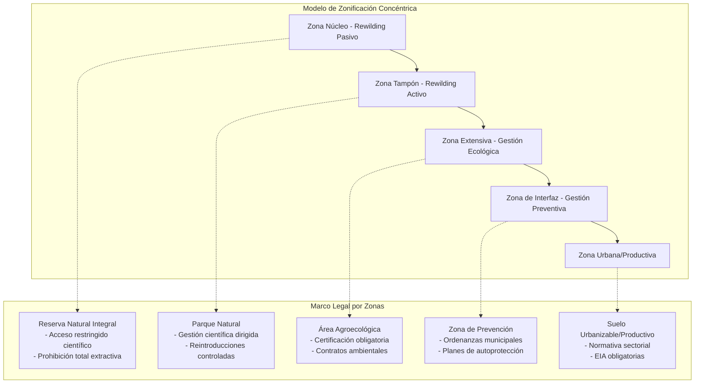
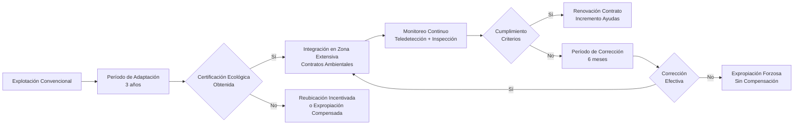

# Enfoques Contemporáneos en Conservación: Entre la Gestión Activa y la Mínima Intervención

## Introducción

El debate sobre las estrategias óptimas de conservación ambiental ha cobrado nueva relevancia en el contexto del Antropoceno, donde la influencia humana sobre los ecosistemas es omnipresente e irreversible. Dos paradigmas principales emergen en este diálogo: la gestión activa de ecosistemas, que incluye prácticas como la ganadería extensiva y el rewilding, y el enfoque de mínima intervención, que aboga por la creación de espacios donde los procesos naturales operen con limitada interferencia humana. Este artículo examina críticamente ambas aproximaciones, analizando sus fundamentos teóricos, implicaciones prácticas y las tensiones inherentes a cada modelo.

## La Gestión Activa: Ganadería Extensiva como Herramienta de Conservación

### Fundamentos Teóricos

La gestión activa de ecosistemas se basa en el reconocimiento de que los paisajes contemporáneos son productos de una larga coevolución entre actividades humanas y procesos naturales. Desde esta perspectiva, ciertas prácticas tradicionales, como la ganadería extensiva, han generado mosaicos paisajísticos con alta biodiversidad y valor ecológico. La expresión anglosajona "It's not the cow, it's the how" encapsula esta filosofía: no es la presencia del ganado per se lo que determina el impacto ambiental, sino la modalidad de su gestión.

### Mecanismos Ecológicos

La ganadería extensiva opera a través de varios mecanismos que pueden favorecer la conservación:

**Heterogeneidad espacial**: El pastoreo controlado genera un mosaico de diferentes intensidades de uso, creando microhábitats diversos que benefician a especies con requerimientos ecológicos variados.

**Control de la biomasa vegetal**: En ecosistemas mediterráneos, donde el fuego es un factor natural, el pastoreo puede reducir la acumulación de combustible vegetal, disminuyendo la intensidad y frecuencia de incendios catastróficos.

**Dispersión de semillas**: El ganado actúa como vector de dispersión, facilitando el movimiento de propágulos entre fragmentos de hábitat.

**Perturbación moderada**: La teoría de la perturbación intermedia sugiere que niveles moderados de disturbio pueden maximizar la diversidad biológica al prevenir la dominancia competitiva.

### Limitaciones y Críticas

No obstante, este enfoque presenta limitaciones significativas. La ganadería extensiva requiere una gestión altamente especializada y adaptada localmente, conocimientos que pueden haberse perdido en muchas regiones. Además, la presión económica sobre los sistemas ganaderos puede llevar a intensificaciones que comprometan los beneficios ecológicos. La introducción de especies domésticas en ecosistemas donde no han evolucionado puede generar impactos impredecibles sobre la fauna y flora nativas.

## El Rewilding: Restauración de Procesos Ecológicos

### Conceptualización y Objetivos

El rewilding representa un paradigma de conservación que busca restaurar la integridad ecológica mediante la reintroducción de especies clave y la minimización de la gestión humana directa. Este enfoque se fundamenta en la ecología de la restauración y la biología de la conservación, priorizando la recuperación de procesos ecosistémicos sobre la preservación de estados particulares.

### Modalidades del Rewilding

**Rewilding pasivo**: Consistente en el abandono de tierras y la sucesión natural, permitiendo que los ecosistemas evolucionen sin intervención directa.

**Rewilding activo**: Incluye la reintroducción de especies extintas localmente, especialmente grandes herbívoros y carnívoros que actúan como ingenieros de ecosistemas.

**Pleistocene rewilding**: Propuesta más controvertida que sugiere la introducción de análogos ecológicos de la megafauna extinta del Pleistoceno.

### Críticas al Rewilding

Las críticas al rewilding se centran en varios aspectos fundamentales. La complejidad de los sistemas ecológicos hace que las predicciones sobre los resultados de las reintroducciones sean altamente inciertas. La metáfora del "aprendiz de brujo" resulta particularmente relevante: las intervenciones bien intencionadas pueden desencadenar cascadas de efectos no deseados. En Europa, la ausencia de megafauna clave, como los proboscídeos, plantea interrogantes sobre la viabilidad de restaurar dinámicas ecosistémicas pleistocénicas con especies sustituto.

## La Mínima Intervención: Hacia una Conservación Pasiva

### Fundamentos Filosóficos y Científicos

El enfoque de mínima intervención surge de una perspectiva más humilde respecto a la capacidad humana para comprender y gestionar sistemas ecológicos complejos. Esta aproximación reconoce las limitaciones del conocimiento científico actual y aboga por estrategias conservadoras que minimicen el riesgo de consecuencias no deseadas.

### Estrategias Implementativas

**Segregación espacial**: Creación de grandes áreas núcleo donde los procesos naturales operen libremente, complementadas por zonas de amortiguamiento donde se permita cierto nivel de actividad humana compatible.

**Intervención selectiva**: Limitación de las actuaciones humanas a casos donde: (a) la causa del problema sea claramente antropogénica; (b) exista riesgo para asentamientos humanos; (c) se prevean impactos de gran magnitud.

**Aceptación de la incertidumbre**: Reconocimiento de que ciertos procesos, incluidas las extinciones naturales, forman parte de la dinámica ecosistémica y no requieren intervención humana.

### El Caso de la España Vaciada

La despoblación rural en España presenta una oportunidad única para implementar estrategias de mínima intervención. Las áreas abandonadas pueden convertirse en laboratorios naturales donde estudiar la sucesión ecológica y la colonización espontánea por parte de especies nativas e introducidas. Esta aproximación implica aceptar que los ecosistemas resultantes pueden no corresponder a estados "históricos" particulares, pero pueden desarrollar nuevas configuraciones con valor ecológico propio.

## Gestión del Fuego: Un Caso de Estudio

La gestión del fuego ilustra las tensiones entre diferentes enfoques conservacionistas. En ecosistemas mediterráneos, donde muchas especies vegetales han evolucionado con el fuego (flora pirófita), la supresión total puede generar acumulaciones de combustible que resulten en incendios más intensos y destructivos.

### Enfoques Diferenciados

**Gestión activa**: Incluye quemas prescritas, cortafuegos, pastoreo preventivo y silvicultura orientada a la reducción de combustible.

**Mínima intervención**: Permite que los incendios naturales operen libremente en áreas alejadas de asentamientos humanos, interviniendo solo cuando amenacen infraestructuras o poblaciones.

**Enfoque mixto**: Combina ambas estrategias según la zonificación territorial, con gestión intensiva cerca de núcleos urbanos y mínima intervención en áreas remotas.

## Crítica a los Modelos Agroecológicos Extensivos

Los modelos agroecológicos que proponen la dispersión de la población humana por el territorio enfrentan críticas tanto ambientales como económicas. La extensión de asentamientos humanos, aunque sea bajo paradigmas "sostenibles", implica fragmentación del hábitat, aumento de la infraestructura y mayor presión sobre los recursos naturales. Desde una perspectiva económica, la provisión de servicios básicos (sanidad, educación, comunicaciones) a poblaciones dispersas resulta considerablemente más costosa que en asentamientos concentrados.

### Paradojas de la Vida "Natural"

La aspiración a estilos de vida "integrados en la naturaleza" presenta paradojas fundamentales en el contexto de las sociedades contemporáneas. El acceso a servicios modernos (electricidad, telecomunicaciones, atención médica) requiere infraestructuras que inevitablemente alteran los ecosistemas naturales. La pregunta no es si es posible vivir "en armonía con la naturaleza", sino qué nivel de impacto estamos dispuestos a aceptar y cómo podemos minimizarlo.

## Síntesis: Hacia un Pragmatismo Conservacionista

### Limitaciones del Conocimiento Actual

Un denominador común en las críticas a los enfoques intervencionistas es el reconocimiento de las limitaciones del conocimiento científico actual. Los ecosistemas son sistemas complejos adaptativos cuyo comportamiento emergente es difícil de predecir. Esta realidad sugiere que las estrategias conservacionistas deberían incorporar principios de gestión adaptativa y precaución.

### Zonificación Funcional y Marco Regulatorio

Una síntesis pragmática podría involucrar la zonificación funcional del territorio según gradientes de intervención, con marcos legales específicos para cada zona:

#### Zona Núcleo - Reserva Natural Integral
**Protección Legal**: Máxima protección bajo figura de Reserva Natural Integral o equivalente.
- Prohibición absoluta de actividades extractivas
- Acceso científico y turístico altamente restringido
- Gestión basada en rewilding pasivo estricto
- Régimen sancionador severo por infracciones

**Turismo de Mínimo Impacto**:
- **Refugios primitivos**: Cabañas básicas sin electricidad ni agua corriente
- Densidad muy baja de refugios distribuidos según criterios de capacidad de carga
- Acceso mediante permisos limitados (cupos anuales estrictos)
- Estancias máximas de 3-5 días
- Obligación de portar todo el equipamiento y retirar todos los residuos
- Prohibición de fogatas y uso de combustibles fósiles

**Intervenciones Estrictamente Prohibidas**:
- **Control de especies exóticas invasoras**: La naturaleza debe encontrar su propio equilibrio
- Cualquier tipo de manejo de fauna o flora
- Infraestructura permanente más allá de refugios primitivos
- Senderos marcados o señalización

**Únicas Excepciones para Intervención**:
- Rescate de personas en emergencias
- Monitoreo científico completamente pasivo (cámaras trampa, estaciones meteorológicas automáticas)
- Control perimetral de incendios **solo** cuando amenacen directamente zonas habitadas

#### Zona Tampón - Parque Natural
**Protección Legal**: Parque Natural con plan de gestión científica.
- Gestión dirigida por criterios científicos
- Rewilding activo con especies nativas
- Prohibición de actividades productivas no compatibles

**Actividades Turísticas y Educativas**:
- **Ecoturismo regulado**: Similar a parques nacionales actuales
- Red de senderos señalizados y mantenidos
- Centros de visitantes e interpretación ambiental
- Refugios con servicios básicos (agua, electricidad renovable)
- Actividades de educación ambiental y turismo científico
- Observación de fauna desde observatorios fijos
- Campamentos organizados con cupos limitados

**Intervenciones Autorizadas para Rewilding Activo**:
- Reintroducción de especies nativas extintas localmente
- Restauración de hábitats degradados
- Quemas prescritas para restauración ecológica
- Construcción de infraestructuras para fauna (pasos de fauna, bebederos naturales)
- **Corredores ecológicos**: Construcción y mantenimiento de conexiones con zona núcleo

#### Zona Extensiva - Certificación Agroecológica Obligatoria
**Marco Legal Específico**: Área de Gestión Agroecológica con certificación obligatoria.
- **Requisito legal**: Toda actividad agroganadera debe mantener certificación ecológica vigente
- Contratos ambientales con administración pública
- Régimen de ayudas condicionado al cumplimiento ambiental
- **Cláusulas de expropiación por mala gestión**

**Turismo Rural Sostenible**:
- Agroturismo certificado ecológico
- Turismo gastronómico basado en productos locales
- Actividades tradicionales (trashumancia, oficios rurales)
- Rutas ecuestres y senderismo de baja intensidad
- Turismo ornitológico y de observación de fauna
- Talleres de educación ambiental en explotaciones modelo

**Mecanismos de Control y Sanción**:
- **Expropiación forzosa sin compensación** en casos de:
  - Provocación intencional de incendios
  - Uso de productos químicos prohibidos
  - Sobrepastoreo demostrable
  - Destrucción de elementos naturales protegidos
- **Expropiación compensada** cuando se requiera ampliación de zona núcleo por criterios científicos
- Sistema de monitoreo continuo mediante teledetección y inspecciones

**Actividades Permitidas bajo Certificación**:
- Ganadería extensiva ecológica certificada
- Agricultura ecológica de bajo impacto
- Silvicultura de baja intensidad
- Recolección tradicional regulada (hongos, frutos silvestres)
- **Corredores biológicos**: Mantenimiento de setos, riberas y elementos conectores

#### Zona de Interfaz - Prevención de Riesgos
**Regulación**: Ordenanzas municipales de prevención de incendios.
- Planes de autoprotección obligatorios
- Mantenimiento de cortafuegos
- Restricciones urbanísticas específicas

**Intervenciones Intensivas Autorizadas**:
- Tratamientos silvícolas preventivos
- Quemas prescritas programadas
- Construcción y mantenimiento de cortafuegos
- Redes de detección temprana de incendios
- Infraestructuras de extinción (puntos de agua, pistas forestales)

## Gestión de la Fragmentación y Conectividad Ecológica

### Problema de la Fragmentación en Paisajes Antropizados

La fragmentación de hábitats constituye una de las principales amenazas para la biodiversidad en paisajes mediterráneos. El modelo de zonificación propuesto debe abordar específicamente la conectividad entre fragmentos para asegurar el flujo genético, la dispersión de especies y la resiliencia ecosistémica.

```mermaid
graph TB
    subgraph "Red de Conectividad Ecológica"
        N1[Zona Núcleo A] 
        N2[Zona Núcleo B]
        N3[Zona Núcleo C]
        
        T1[Zona Tampón A<br/>Rewilding Activo]
        T2[Zona Tampón B<br/>Rewilding Activo]
        T3[Zona Tampón C<br/>Rewilding Activo]
        
        C1[Corredor Principal<br/>Ribera + Setos]
        C2[Corredor Secundario<br/>Monte Bajo]
        C3[Paso de Fauna<br/>Infraestructura Verde]
        
        E1[Zona Extensiva<br/>Elementos Conectores]
        E2[Zona Extensiva<br/>Elementos Conectores]
    end
    
    N1 -.-> T1
    N2 -.-> T2  
    N3 -.-> T3
    T1 --> C1
    T2 --> C2
    T3 --> C3
    C1 --> E1
    C2 --> E2
    E1 --> E2
    
    style N1 fill:#1f4e3d
    style N2 fill:#1f4e3d  
    style N3 fill:#1f4e3d
    style T1 fill:#2d5a3d
    style T2 fill:#2d5a3d
    style T3 fill:#2d5a3d
    style C1 fill:#8fbc8f
    style C2 fill:#8fbc8f
    style C3 fill:#8fbc8f
```

### Estrategias de Conectividad por Zona

#### En Zona Núcleo
- **Conectividad pasiva**: Sin intervención para crear corredores
- Los procesos naturales determinan la expansión hacia zonas adyacentes
- Aceptación de que algunos fragmentos puedan permanecer aislados

#### En Zona Tampón  
- **Corredores activos**: Restauración dirigida de conexiones naturales
- Plantaciones de especies nativas para crear continuidad
- Eliminación de barreras artificiales (vallados, infraestructuras menores)
- Pasos de fauna en carreteras principales

#### En Zona Extensiva
- **Infraestructura verde obligatoria**: Mantenimiento de setos, riberas, linderos
- **Stepping stones**: Pequeños bosquetes y humedales como puntos de conexión
- Rotación de cultivos que mantenga siempre corredores verdes
- Certificación ecológica que incluya criterios de conectividad

### Elementos Conectores Específicos

**Corredores Riparios**: Restauración y protección de márgenes fluviales con vegetación autóctona continua de anchura ecológicamente funcional.

**Setos y Linderos**: Red de elementos lineales woody con especies autóctonas, conectando fragmentos de hábitat dentro de la matriz agrícola.

**Pasos de Fauna**: Infraestructuras específicas en carreteras principales, dimensionadas según las especies objetivo (grandes mamíferos, pequeños vertebrados, invertebrados).

**Mosaicos Agroforestales**: Sistemas que integren arbolado disperso, cultivos y pastizales, creando gradientes de hábitat que faciliten el movimiento de fauna.

#### Incentivos y Desincentivos Económicos
**Zona Extensiva - Sistema de Contratos Ambientales**:
- Pagos por servicios ecosistémicos (captura de carbono, conservación de biodiversidad, prevención de erosión)
- Primas por certificación ecológica mantenida durante períodos superiores a 10 años
- Bonificaciones fiscales por adopción voluntaria de prácticas de rewilding pasivo
- Seguros agrarios preferenciales para explotaciones certificadas

**Mecanismo de Transición Progresiva**:

#### Criterios Científicos para Transición de Zonas
**De Zona Extensiva a Zona Tampón**:
- Recuperación demostrable de especies indicadoras
- Ausencia de actividad agroganadera durante mínimo 5 años
- Colonización espontánea por fauna nativa
- Viabilidad ecológica para reintroducciones

**De Zona Tampón a Zona Núcleo**:
- Funcionamiento autónomo de procesos ecológicos durante mínimo 10 años
- Presencia de especies clave reintroducidas exitosamente
- Conectividad efectiva con otras zonas núcleo
- Ausencia de amenazas antrópicas significativas
# Análisis Comparativo: Marco Legal Actual de Protección Ambiental en España vs. Modelo Propuesto de Zonificación

## Introducción

El sistema español de espacios protegidos ha evolucionado desde la primera Ley de Parques Nacionales de 1916 hasta el actual marco normativo establecido por la Ley 42/2007 del Patrimonio Natural y la Biodiversidad, y la Ley 30/2014 de Parques Nacionales. Este análisis examina las diferencias fundamentales entre el modelo legal vigente y la propuesta de zonificación concéntrica presentada, identificando limitaciones del sistema actual y oportunidades de mejora.

## Marco Legal Vigente en España

### Legislación Fundamental

**Ley 42/2007 del Patrimonio Natural y la Biodiversidad**: Establece el régimen jurídico básico de la conservación, uso sostenible, mejora y restauración del patrimonio natural y de la biodiversidad, definiendo los espacios naturales protegidos como aquellos del territorio nacional que contienen sistemas o elementos naturales representativos, singulares, frágiles, amenazados o de especial interés ecológico, científico, paisajístico, geológico o educativo.

**Ley 30/2014 de Parques Nacionales**: Refuerza la protección de estos espacios a través de un modelo de mayor coordinación y apoyo por el Estado, donde únicamente el 0,76% del territorio nacional (15 parques nacionales) tiene este reconocimiento otorgado por las Cortes mediante leyes declarativas.

### Categorías Actuales de Espacios Protegidos

La Ley 42/2007 establece cinco categorías básicas de espacios naturales protegidos de ámbito estatal:

1. **Parques Nacionales**
2. **Parques Naturales** 
3. **Reservas Naturales**
4. **Monumentos Naturales**
5. **Paisajes Protegidos**

### Distribución Territorial Actual

De los más de 2.000 espacios protegidos en España (30% de la superficie nacional), solo 15 parques nacionales representan el máximo nivel de protección, evidenciando una estructura fragmentada sin conectividad sistemática.

## Diferencias Fundamentales con el Modelo Propuesto

### 1. Filosofía de Gestión

#### Sistema Actual
- **Enfoque conservacionista tradicional**: Preservación de estados "naturales" predefinidos
- **Gestión activa generalizada**: Intervención humana como norma en la mayoría de categorías
- **Fragmentación conceptual**: Cada espacio se gestiona independientemente
- **Criterios estéticos y paisajísticos**: Herencia de la ley de 1916 que priorizaba valores escénicos

#### Modelo Propuesto
- **Filosofía de mínima intervención**: Aceptación de dinámicas naturales emergentes
- **Gradiente de intervención**: Desde rewilding pasivo hasta gestión preventiva según zonificación
- **Conectividad sistémica**: Red integrada de espacios conectados funcionalmente
- **Criterios ecológicos funcionales**: Priorización de procesos ecosistémicos sobre estados específicos

### 2. Estructura Territorial

```mermaid
graph LR
    subgraph "Sistema Actual"
        A1[Parques Nacionales<br/>Aislados]
        A2[Parques Naturales<br/>Dispersos]
        A3[Reservas<br/>Fragmentadas]
        A4[Monumentos<br/>Puntuales]
        A5[Paisajes<br/>Protegidos]
    end
    
    subgraph "Modelo Propuesto"
        B1[Zona Núcleo<br/>Rewilding Pasivo]
        B2[Zona Tampón<br/>Rewilding Activo]
        B3[Zona Extensiva<br/>Certificación Ecológica]
        B4[Zona Interfaz<br/>Gestión Preventiva]
        
        B1 --> B2
        B2 --> B3
        B3 --> B4
    end
    
    style A1 fill:#ff9999
    style A2 fill:#ffcc99
    style A3 fill:#ffff99
    style A4 fill:#ccffcc
    style A5 fill:#ccccff
    
    style B1 fill:#1f4e3d
    style B2 fill:#2d5a3d
    style B3 fill:#8fbc8f
    style B4 fill:#deb887
```

#### Limitaciones del Sistema Actual

**Ausencia de Conectividad Planificada**: Los espacios protegidos funcionan como "islas" sin corredores ecológicos sistemáticos, limitando el flujo genético y la dispersión de especies.

**Gestión Fragmentada por Competencias**: La distribución de competencias entre Estado y Comunidades Autónomas genera descoordinación y criterios heterogéneos de gestión.

**Indefinición en Zonas Matriz**: El territorio entre espacios protegidos carece de regulación específica para su función conectiva, permitiendo intensificaciones que comprometen la funcionalidad del conjunto.

### 3. Instrumentos Legales y Económicos

#### Sistema Actual

**Limitaciones Regulatorias**:
- Declaraciones caso por caso sin criterios sistemáticos
- Planes de gestión independientes para cada espacio
- Ausencia de mecanismos de expropiación por mala gestión
- Instrumentos económicos limitados y no coordinados

**Gestión de Actividades Productivas**:
- Coexistencia no regulada entre conservación y producción
- Ausencia de certificación ecológica obligatoria en zonas sensibles
- Compensaciones puntuales sin criterios ecosistémicos

#### Modelo Propuesto

**Innovaciones Regulatorias**:
- **Certificación ecológica obligatoria** en Zona Extensiva
- **Expropiación diferenciada**: Forzosa por mala gestión, compensada por ampliación científica
- **Contratos ambientales** con pagos por servicios ecosistémicos
- **Monitoreo tecnológico** mediante teledetección y criterios objetivos

### 4. Gestión de Especies y Procesos

#### Paradigma Actual
- Control activo de especies "invasoras" en todos los espacios
- Reintroducciones basadas en criterios históricos
- Supresión de perturbaciones naturales (especialmente fuego)
- Mantenimiento de estados ecosistémicos "deseables"

#### Paradigma Propuesto
- **Zona Núcleo**: Prohibición total de control de invasoras, aceptación de nuevos equilibrios
- **Zona Tampón**: Rewilding activo con especies nativas, gestión de invasoras solo si afectan objetivos de reintroducción
- **Aceptación de extinciones locales** como proceso natural
- **Gestión diferenciada del fuego** según zonificación

## Análisis de Viabilidad Legal y Política

### Obstáculos Normativos

#### Competenciales
La distribución constitucional de competencias (Estado: bases, CCAA: desarrollo y gestión) dificultaría la implementación uniforme del modelo propuesto, requiriendo:

- Modificación de la Ley 42/2007 para incorporar la zonificación concéntrica
- Coordinación normativa entre 17 comunidades autónomas
- Armonización de criterios de certificación ecológica
- Establecimiento de fondos compensatorios intergubernamentales

#### Derechos Propietarios
La expropiación forzosa por mala gestión ambiental presenta desafíos constitucionales:

- Necesidad de definición legal precisa de "mala gestión"
- Establecimiento de procedimientos garantistas
- Criterios objetivos de valoración y compensación
- Recursos judiciales y procedimientos de recurso

### Resistencias Socioeconómicas

#### Sectores Productivos
- **Ganadería tradicional**: Resistencia a certificación ecológica obligatoria
- **Agricultura intensiva**: Oposición a restricciones en zonas de transición
- **Sector forestal**: Pérdida de aprovechamientos en zonas núcleo y tampón
- **Turismo rural**: Limitaciones de acceso y desarrollo en zonas protegidas

#### Administraciones Locales
- Pérdida de ingresos por limitaciones al desarrollo urbano
- Costes de adaptación de servicios a poblaciones dispersas
- Resistencia a pérdida de autonomía en ordenación territorial

## Ventajas del Modelo Propuesto

### Coherencia Ecológica

**Conectividad Funcional**: El modelo concéntrico asegura continuidad de hábitats y procesos ecológicos a escala de paisaje, superando la fragmentación actual.

**Gestión Adaptativa**: Los criterios científicos para transición entre zonas permiten evolución del sistema según resultados de monitoreo.

**Resiliencia Climática**: Las zonas núcleo extensas proporcionan refugios climáticos y espacios para migración asistida de especies.

### Eficiencia Económica

**Optimización de Recursos**: Concentración de inversiones según prioridades ecológicas y gradiente de intervención.

**Servicios Ecosistémicos**: Monetización explícita de beneficios ambientales mediante contratos ambientales.

**Desarrollo Rural Sostenible**: Certificación ecológica como ventaja competitiva para productos de calidad.

## Propuestas de Implementación Gradual

### Fase I: Piloto Autonómico (5 años)
- Selección de 2-3 comunidades autónomas con consenso político
- Adaptación normativa regional específica
- Establecimiento de fondos piloto de transición
- Monitoreo y evaluación de resultados

### Fase II: Armonización Normativa (5 años)
- Modificación de Ley 42/2007 incorporando zonificación concéntrica
- Desarrollo reglamentario de criterios técnicos
- Establecimiento de fondos estatales de compensación
- Formación técnica especializada

### Fase III: Implementación Nacional (10 años)
- Despliegue progresivo en todo el territorio
- Consolidación de sistemas de monitoreo
- Evaluación y adaptación de criterios
- Integración con normativa europea

## Conclusiones

El modelo propuesto representa una evolución conceptual significativa respecto al marco legal actual español, transitando desde una visión fragmentaria y conservacionista hacia un enfoque sistémico y adaptativo. Las principales innovaciones incluyen:

1. **Zonificación funcional concéntrica** que supera la fragmentación espacial actual
2. **Instrumentos económicos integrados** que internalizan costes y beneficios ambientales
3. **Criterios científicos objetivos** para gestión adaptativa
4. **Filosofía de mínima intervención** que acepta la evolución natural de ecosistemas

Sin embargo, la implementación requiere superación de obstáculos normativos, competenciales y socioeconómicos significativos. La viabilidad del modelo depende de:

- **Consenso político** a nivel estatal y autonómico
- **Aceptación social** de limitaciones a derechos tradicionales
- **Financiación adecuada** para compensaciones y transiciones
- **Capacidad técnica** para monitoreo y gestión adaptativa

El modelo ofrece un marco conceptual sólido para evolucionar hacia una conservación más eficaz y sistémica, pero requiere implementación gradual y adaptada a las especificidades del contexto español.
