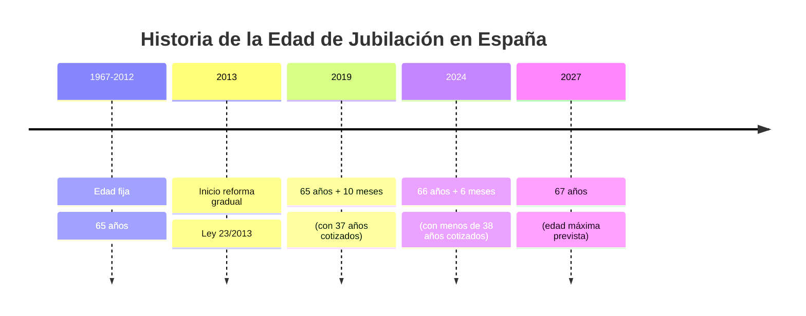
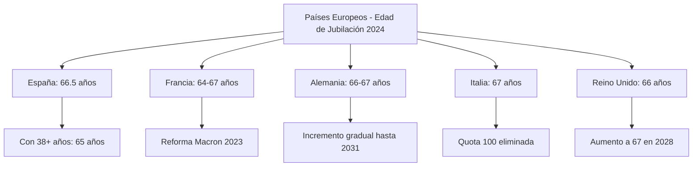
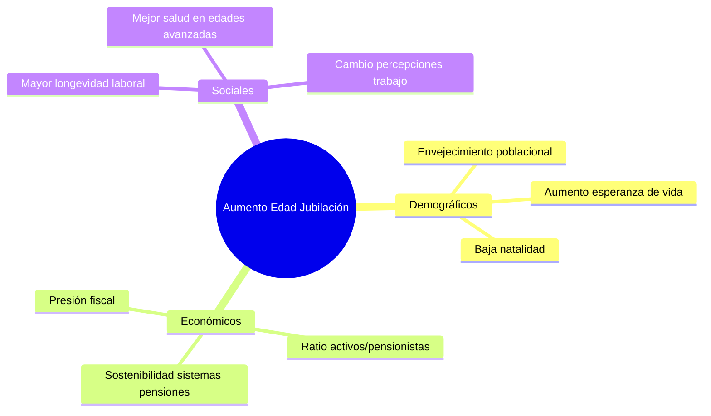
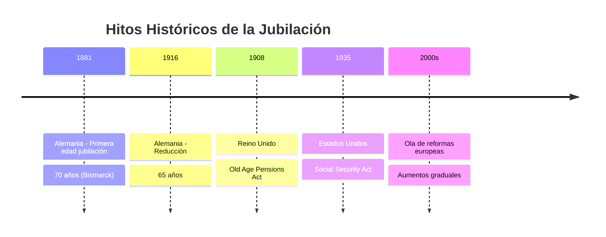

# Evolución de la Edad de Jubilación por Países (1980-2030)

## Análisis de Tendencias Globales

La edad de jubilación ha experimentado un aumento significativo en las últimas décadas debido al envejecimiento poblacional y la sostenibilidad de los sistemas de pensiones.

## España - Evolución Detallada

### Cronología de Reformas

### Tabla de Evolución España (Datos Oficiales)

| Año | Edad Ordinaria | Edad con 38+ años cotizados | Normativa |
|-----|----------------|------------------------------|-----------|
| 1980-2012 | 65 años | 65 años | Estable |
| 2013 | 65 años + 1 mes | 65 años | Ley 23/2013 |
| 2020 | 65 años + 10 meses | 65 años | Transición |
| 2024 | 66 años + 6 meses | 65 años | Para poder acceder al 100% de la pensión en 2024, se debe cumplir con uno de los siguientes requisitos: tener 65 años y haber cotizado un total de 38 años, o bien alcanzar los 66 años y medio si el período de cotización es inferior a 38 años |
| 2025 | 66 años + 8 meses | 65 años | Para quienes hayan cotizado menos de 38 años y 3 meses, la edad ordinaria de jubilación será de 66 años y 8 meses |
| 2027 | 67 años | 65 años | para 2027 la edad ordinaria de jubilación será de 67 años, cifra límite que contempla la normativa |

## Comparación Internacional

### Edad Actual de Jubilación por País (2024)

### Tabla Comparativa Internacional

| País | 1980 | 2000 | 2020 | 2024 | 2030 (Proyección) | Reforma Clave |
|------|------|------|------|------|-------------------|---------------|
| **España** | 65 | 65 | 65.8 | 66.5 | 67.0 | Ley 23/2013 |
| **Francia** | 60/65* | 60/65* | 62 | 64 | 67.0 | Reforma Macron 2023 |
| **Alemania** | 65 | 65 | 65.5 | 66.2 | 67.0 | "Rente mit 67" (2007) |
| **Italia** | 55/60** | 57/62** | 66.7 | 67.0 | 67.0 | Reforma Fornero (2011) |
| **Reino Unido*** | 60/65 | 60/65 | 66 | 66 | 67.0 | Pensions Act 2007 |
| **Países Bajos** | 65 | 65 | 66.3 | 67.0 | 67.0 | AOW Act (2012) |
| **Suecia**** | 65 | 65 | 62-67 | 62-67 | 62-67 | Sistema flexible |

*Francia: Sistema complejo con diferentes edades según contribuciones
**Italia: Históricamente diferentes por género
***Reino Unido: Equalización de género completada en 2020
****Suecia: Sistema de pensiones flexible

## Tendencias y Proyecciones Futuras

### Factores Impulsores del Cambio

### Países con Mayor Incremento Previsto (2024-2060)

Estonia, Slovakia, Italy, Sweden, and Cyprus are also expected to raise retirement ages by 5 years or more by 2060

| País | Incremento Previsto 2024-2060 |
|------|-------------------------------|
| Estonia | +5+ años |
| Eslovaquia | +5+ años |
| Italia | +5+ años |
| Suecia | +5+ años |
| Chipre | +5+ años |

## Contexto Histórico

### Origen de la Edad de Jubilación

The first retirement age was set in Germany by Otto von Bismarck in 1881, originally at 70, before being reduced to 65 in 1916

### Evolución Histórica Mundial

## Datos Específicos por Regiones

### Unión Europea - Tendencias Actuales

The OECD projects that the average effective retirement age will increase by two years by the mid-2060s

**Países con edad más alta actualmente (2024):**
Israel, Iceland, and Norway had the highest current retirement ages worldwide of the 45 countries included at 67 years

### Edad Efectiva vs. Edad Legal

Existe una diferencia importante entre la edad legal de jubilación y la edad efectiva (real) de retiro del mercado laboral, que suele ser menor debido a:
- Jubilaciones anticipadas
- Prejubilaciones
- Programas de transición
- Incapacidades laborales

## Conclusiones

1. **Convergencia europea** hacia los 67 años como edad estándar
2. **Reformas post-crisis 2008** aceleraron los cambios
3. **Sistemas de transición** graduales para minimizar impacto social
4. **Diferenciación por años cotizados** se mantiene en muchos países
5. **Tendencia global** al alza continuará hasta 2060 según proyecciones OCDE

La evolución muestra un claro patrón de aumento gradual, con España siguiendo la tendencia europea general, aunque con cierta flexibilidad para trabajadores con largas carreras de cotización.