# Comparación Crítica Documentada: Derechos y Calidad de Vida
## Final Edad Media vs Inicios Capitalismo vs Actualidad

### Introducción Metodológica

La transición del feudalismo al capitalismo comenzó gradualmente entre los siglos XV-XVI, pero se consolidó principalmente durante la revolución industrial (siglos XVIII-XIX). Esta comparación crítica examina tanto los avances formales como las limitaciones reales de derechos y calidad de vida a través de estos períodos, contrastada con evidencia historiográfica de fuentes académicas primarias.

**Marco Temporal:**
- **Final Edad Media**: Siglos XIV-XV (post-Peste Negra)
- **Inicios Capitalismo**: Siglos XVI-XVIII (proto-industrialización)
- **Actualidad**: Siglo XXI (era neoliberal)

## Evolución Histórica General

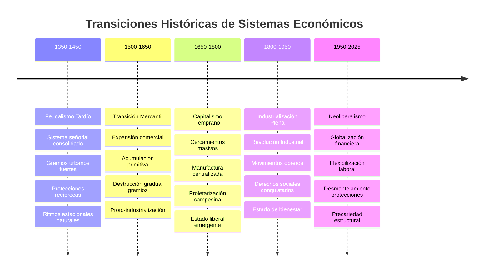
```mermaid
timeline
    title Transiciones Históricas de Sistemas Económicos
    
    1350-1450 : Feudalismo Tardío
              : Sistema señorial consolidado
              : Gremios urbanos fuertes  
              : Protecciones recíprocas
              : Ritmos estacionales naturales

    1500-1650 : Transición Mercantil
              : Expansión comercial
              : Acumulación primitiva
              : Destrucción gradual gremios
              : Proto-industrialización

    1650-1800 : Capitalismo Temprano
              : Cercamientos masivos
              : Manufactura centralizada
              : Proletarización campesina
              : Estado liberal emergente

    1800-1950 : Industrialización Plena
              : Revolución Industrial
              : Movimientos obreros
              : Derechos sociales conquistados
              : Estado de bienestar

    1950-2025 : Neoliberalismo
              : Globalización financiera
              : Flexibilización laboral
              : Desmantelamiento protecciones
              : Precariedad estructural
```

## Análisis Comparativo por Países

### INGLATERRA / REINO UNIDO

#### Evolución de Condiciones Laborales

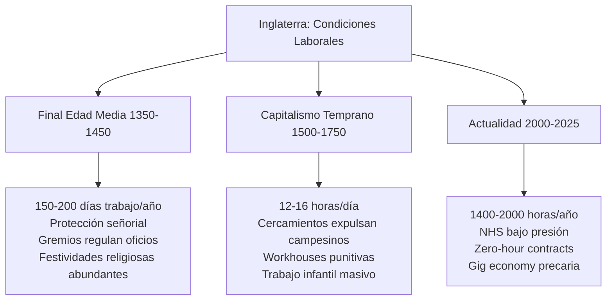
```mermaid
graph TD
    A[Inglaterra: Condiciones Laborales] --> B[Final Edad Media 1350-1450]
    A --> C[Capitalismo Temprano 1500-1750]
    A --> D[Actualidad 2000-2025]
    
    B --> B1["150-200 días trabajo/año<br/>Protección señorial<br/>Gremios regulan oficios<br/>Festividades religiosas abundantes"]
    
    C --> C1["12-16 horas/día<br/>Cercamientos expulsan campesinos<br/>Workhouses punitivas<br/>Trabajo infantil masivo"]
    
    D --> D1["1400-2000 horas/año<br/>NHS bajo presión<br/>Zero-hour contracts<br/>Gig economy precaria"]
```

| Aspecto | Final Edad Media (S. XIV-XV) | Inicios Capitalismo (S. XVI-XVIII) | Actualidad (S. XXI) |
|---------|------------------------------|-------------------------------------|---------------------|
| **Estatus Social** | Siervos con protecciones tradicionales | "Libertad" para vender fuerza de trabajo | Trabajadores formalmente libres, precariedad creciente |
| **Derechos Laborales** | Obligaciones recíprocas, días festivos | Explotación sin límites legales | Derechos erosionados por flexibilización |
| **Jornada Laboral** | 150-200 días/año, muchos festivos | 12-16 horas diarias, trabajo infantil | 40 horas oficiales + trabajo no remunerado |
| **Protección Social** | Señor obligado a mantener siervos | Ninguna, workhouses punitivas | NHS bajo presión, austeridad |
| **Vivienda** | Choza propia en señorío | Slums industriales, hacinamiento | Crisis habitacional, gentrificación |
| **Alimentación** | Subsistencia garantizada, hambrunas excepcionales | Malnutrición sistemática obreros | Desigualdad alimentaria, food banks |
| **Educación** | Limitada pero existente (monasterios) | Prohibida para trabajadores | Universidades elitistas, deuda estudiantil |
| **Movilidad Social** | Limitada pero real (Iglesia, oficios) | Teórica, prácticamente inexistente | Mito meritocrático, clases cristalizadas |
| **Participación Política** | Asambleas comunales | Represión violenta movimientos | Democracia formal, poder económico real |
| **Salud** | Medicina herbal, comunidad | Condiciones mortíferas, epidemias | Desigualdades en salud persistentes |

### FRANCIA

#### Sistema Gremial vs Manufactura

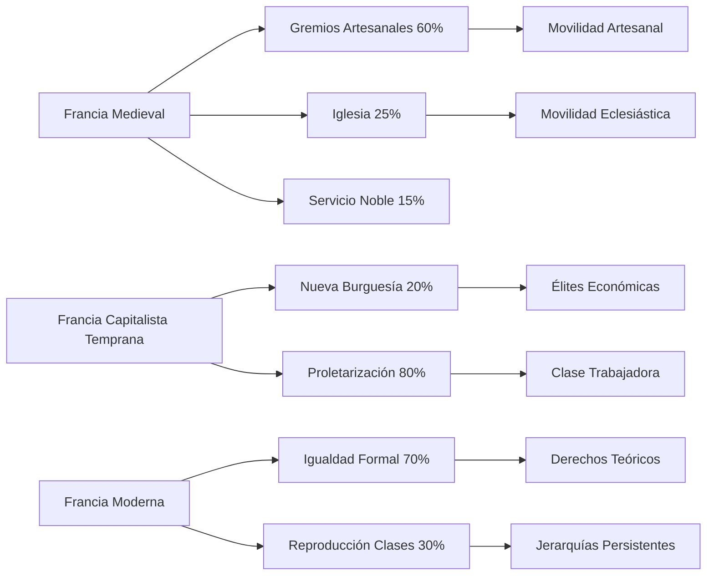
```mermaid
graph LR
    A[Francia Medieval] --> B[Gremios Artesanales 60%]
    A --> C[Iglesia 25%]
    A --> D[Servicio Noble 15%]
    
    E[Francia Capitalista Temprana] --> F[Nueva Burguesía 20%]
    E --> G[Proletarización 80%]
    
    H[Francia Moderna] --> I[Igualdad Formal 70%]
    H --> J[Reproducción Clases 30%]
    
    B --> K[Movilidad Artesanal]
    C --> L[Movilidad Eclesiástica]
    F --> M[Élites Económicas]
    G --> N[Clase Trabajadora]
    I --> O[Derechos Teóricos]
    J --> P[Jerarquías Persistentes]
```

| Aspecto | Final Edad Media (S. XIV-XV) | Inicios Capitalismo (S. XVI-XVIII) | Actualidad (S. XXI) |
|---------|------------------------------|-------------------------------------|---------------------|
| **Estatus Social** | Tres estamentos con funciones definidas | Burgueses vs proletarios | Clases medias en declive |
| **Derechos Laborales** | Gremios regulaban condiciones | Liberalismo destruye protecciones | 35h/semana pero desempleo estructural |
| **Jornada Laboral** | Ritmos estacionales naturales | Manufactura intensiva | Productividad alta, salarios estancados |
| **Protección Social** | Señorío, Iglesia, comunidad | Estado ausente | Sécurité Sociale amenazada |
| **Vivienda** | Estable en comunidades rurales | Éxodo rural, condiciones urbanas | Banlieues marginadas |
| **Alimentación** | Dieta local estable | Hambrunas 1709, 1788, 1847 | Abundancia desigual |
| **Educación** | Limitada a élites | Analfabetismo masivo | Reproducción social persistente |
| **Movilidad Social** | Iglesia permitía ascenso | Revolución rompe barreras temporalmente | Ascensor social averiado |
| **Participación Política** | Estados Generales (limitado) | Terror revolucionario | República con élites económicas |
| **Salud** | Esperanza vida 25-30 años | Medicina inexistente para pobres | Sistema dual público-privado |

### ESPAÑA

#### De la Reconquista a la Desindustrialización

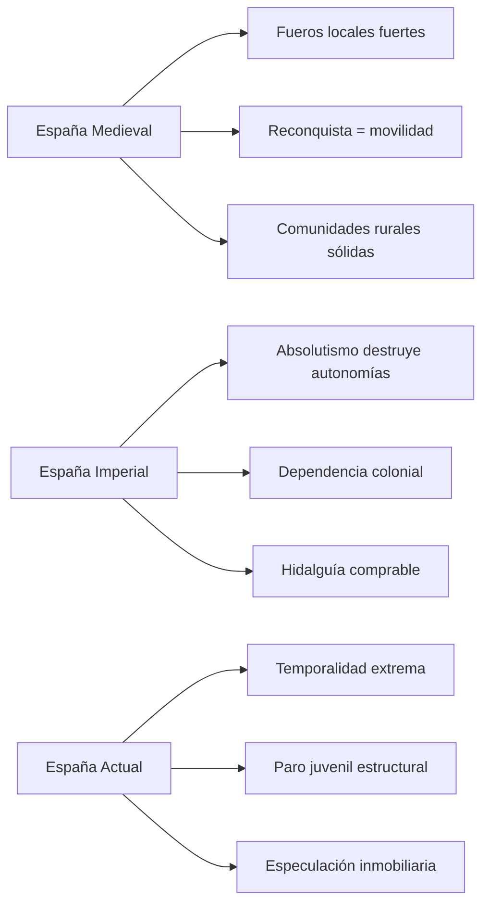
```mermaid
graph LR
    A[España Medieval] --> B[Fueros locales fuertes]
    A --> C[Reconquista = movilidad]
    A --> D[Comunidades rurales sólidas]
    
    E[España Imperial] --> F[Absolutismo destruye autonomías]
    E --> G[Dependencia colonial]
    E --> H[Hidalguía comprable]
    
    I[España Actual] --> J[Temporalidad extrema]
    I --> K[Paro juvenil estructural]
    I --> L[Especulación inmobiliaria]
```

| Aspecto | Final Edad Media (S. XIV-XV) | Inicios Capitalismo (S. XVI-XVIII) | Actualidad (S. XXI) |
|---------|------------------------------|-------------------------------------|---------------------|
| **Estatus Social** | Reconquista permite movilidad social | Hidalguía comprable, castas coloniales | Clases medias precarias |
| **Derechos Laborales** | Fueros locales fuertes | Absolutismo destruye autonomías | Temporalidad extrema |
| **Jornada Laboral** | Siesta tradicional, trabajo estacional | Manufacturas incipientes | Jornadas partidas ineficientes |
| **Protección Social** | Mayorazgos, tierras comunales | Desamortización destruye redes | Paro estructural juvenil |
| **Vivienda** | Casas familiares multigeneracionales | Migración a ciudades | Especulación inmobiliaria |
| **Alimentación** | Dieta mediterránea básica | Imperio genera dependencia | Precios altos, salarios bajos |
| **Educación** | Universidades medievales pioneras | Inquisición limita conocimiento | Sobrecualificación + subempleo |
| **Movilidad Social** | Indias, Iglesia, guerra | Limpieza de sangre | Emigración de talentos |
| **Participación Política** | Cortes con poder real | Despotismo ilustrado | Bipartidismo oligárquico |
| **Salud** | Hospitales católicos | Medicina para élites únicamente | Sanidad pública deteriorada |

### ALEMANIA

#### Del Sistema Gremial al Modelo Renano

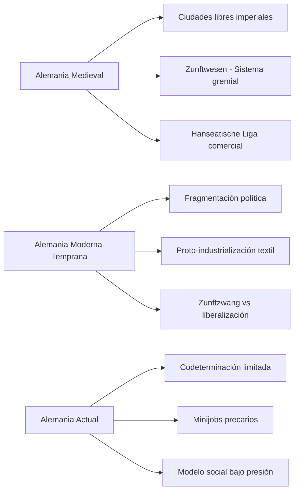
```mermaid
flowchart LR
    A[Alemania Medieval] --> B[Ciudades libres imperiales]
    A --> C[Zunftwesen - Sistema gremial]
    A --> D[Hanseatische Liga comercial]
    
    E[Alemania Moderna Temprana] --> F[Fragmentación política]
    E --> G[Proto-industrialización textil]
    E --> H[Zunftzwang vs liberalización]
    
    I[Alemania Actual] --> J[Codeterminación limitada]
    I --> K[Minijobs precarios]
    I --> L[Modelo social bajo presión]
```

| Aspecto | Final Edad Media (S. XIV-XV) | Inicios Capitalismo (S. XVI-XVIII) | Actualidad (S. XXI) |
|---------|------------------------------|-------------------------------------|---------------------|
| **Estatus Social** | Ciudades libres, gremios fuertes | Principados absolutistas | Arbeiterklasse integrada |
| **Derechos Laborales** | Zunftwesen protege artesanos | Zunftzwang vs libertad económica | Codeterminación limitada |
| **Jornada Laboral** | Regulada estrictamente | Proto-industrialización | Minijobs precarios |
| **Protección Social** | Gremios + hermandades | Pauperismo rural-urbano | Modelo social bajo presión |
| **Vivienda** | Casas gremiales sólidas | Migración campo-ciudad | Gentrificación, alquileres altos |
| **Alimentación** | Cerveza diaria, carne regular | Crisis agrarias | Abundancia con desigualdad |
| **Educación** | Universidades + formación técnica | Protestantismo + disciplina | Sistema dual exitoso pero selectivo |
| **Movilidad Social** | Maestría artesanal | Burocracia estatal | Herencia cultural determinante |
| **Participación Política** | Ciudades-estado | Autoritarismo principesco | Democracia cristiana conservadora |
| **Salud** | Baños públicos hasta s.XVI | Medicina primitiva | Seguros médicos duales |

### PAÍSES BAJOS

#### Del Capitalismo Comercial Temprano a la Flexiseguridad

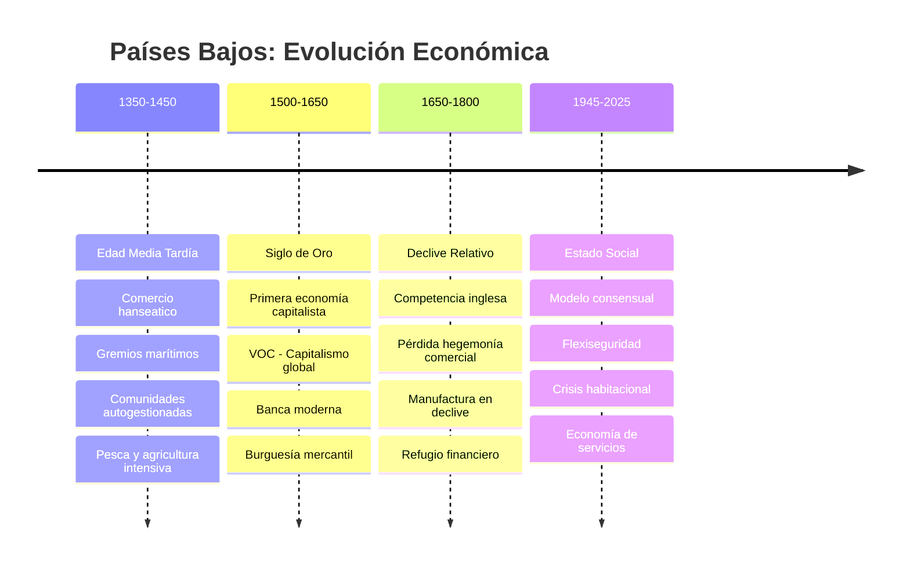
```mermaid
timeline
    title Países Bajos: Evolución Económica
    
    1350-1450 : Edad Media Tardía
              : Comercio hanseatico
              : Gremios marítimos
              : Comunidades autogestionadas
              : Pesca y agricultura intensiva

    1500-1650 : Siglo de Oro
              : Primera economía capitalista
              : VOC - Capitalismo global
              : Banca moderna
              : Burguesía mercantil

    1650-1800 : Declive Relativo
              : Competencia inglesa
              : Pérdida hegemonía comercial
              : Manufactura en declive
              : Refugio financiero

    1945-2025 : Estado Social
              : Modelo consensual
              : Flexiseguridad
              : Crisis habitacional
              : Economía de servicios
```

| Aspecto | Final Edad Media (S. XIV-XV) | Inicios Capitalismo (S. XVI-XVIII) | Actualidad (S. XXI) |
|---------|------------------------------|-------------------------------------|---------------------|
| **Estatus Social** | Comerciantes libres tempranos | Primera burguesía capitalista | Sociedad consensual estratificada |
| **Derechos Laborales** | Gremios marítimos | Explotación colonial + doméstica | Flexiseguridad con inseguridad |
| **Jornada Laboral** | Mareas y estaciones | Comercio global 24/7 | Part-time involuntario |
| **Protección Social** | Comunidades autogestionadas | Seguros privados pioneros | Estado de bienestar resistente |
| **Vivienda** | Casas comerciantes sólidas | Expansión urbana planificada | Crisis habitacional, especulación |
| **Alimentación** | Pesca, lácteos, comercio | Dieta global temprana | Seguridad alimentaria completa |
| **Educación** | Pragmatismo comercial | Alfabetización por comercio | Sistema eficiente pero desigual |
| **Movilidad Social** | Comercio permite ascenso | Meritocracia mercantil | Reproducción social sutil |
| **Participación Política** | Repúblicas mercantiles | Oligarquía comercial | Consenso con exclusiones |
| **Salud** | Hospitales urbanos | Medicina para comerciantes | Sistema eficiente, desigual |

### ITALIA

#### De las Repúblicas Comerciales a la Dualidad Norte-Sur

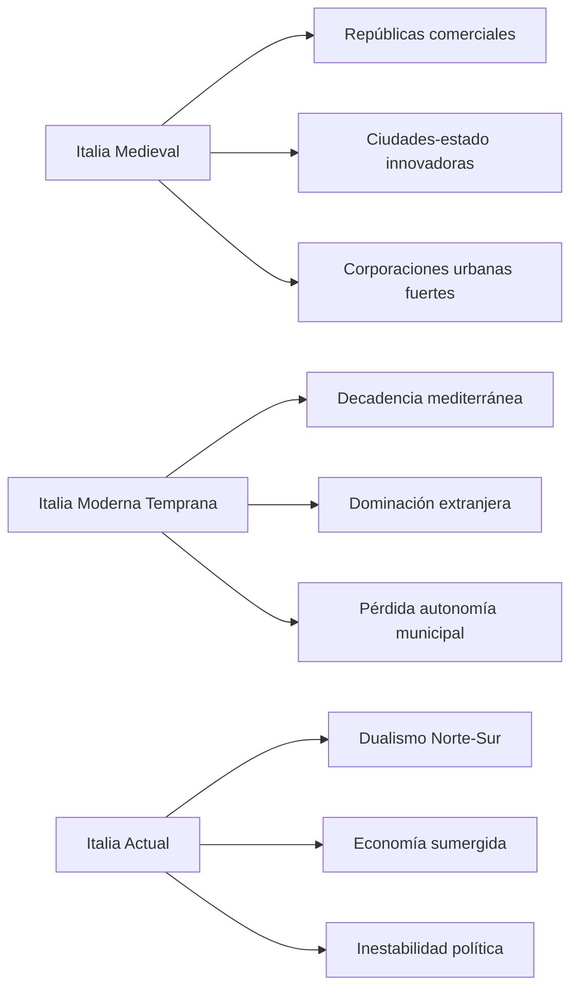
```mermaid
graph LR
    A[Italia Medieval] --> B[Repúblicas comerciales]
    A --> C[Ciudades-estado innovadoras]
    A --> D[Corporaciones urbanas fuertes]
    
    E[Italia Moderna Temprana] --> F[Decadencia mediterránea]
    E --> G[Dominación extranjera]
    E --> H[Pérdida autonomía municipal]
    
    I[Italia Actual] --> J[Dualismo Norte-Sur]
    I --> K[Economía sumergida]
    I --> L[Inestabilidad política]
```

| Aspecto | Final Edad Media (S. XIV-XV) | Inicios Capitalismo (S. XVI-XVIII) | Actualidad (S. XXI) |
|---------|------------------------------|-------------------------------------|---------------------|
| **Estatus Social** | Repúblicas comerciales dinámicas | Decadencia, dominación extranjera | Norte desarrollado vs Sur atrasado |
| **Derechos Laborales** | Corporaciones urbanas fuertes | Pérdida autonomía municipal | Dualismo laboral extremo |
| **Jornada Laboral** | Artesanía regulada | Manufactura decadente | Economía sumergida extendida |
| **Protección Social** | Hospitales + cofradías | Caridad católica insuficiente | Sistema fragmentado regional |
| **Vivienda** | Palacios + barrios populares | Deterioro urbano | Patrimonio vs especulación |
| **Alimentación** | Dieta mediterránea variada | Empobrecimiento relativo | Tradición gastronómica vs globalización |
| **Educación** | Universidades pioneras mundiales | Estancamiento intelectual | Fuga de cerebros |
| **Movilidad Social** | Mecenazgo renacentista | Bloqueo por dominación | Clientelismo político |
| **Participación Política** | Innovación republicana | Absolutismo foráneo | Inestabilidad democrática |
| **Salud** | Medicina avanzada época | Medicina empírica | Disparidades Norte-Sur |

## Análisis Cuantitativo Comparativo

### Indicadores Laborales por País y Época

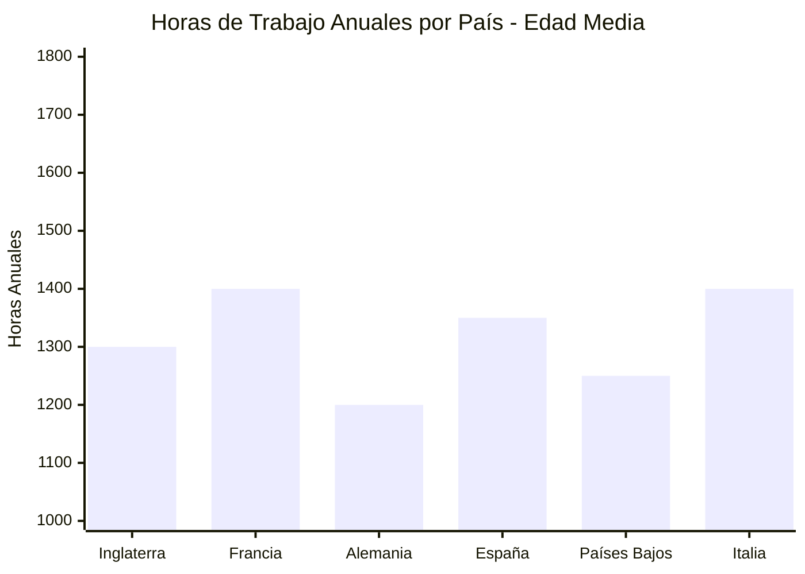
```mermaid
xychart-beta
    title "Horas de Trabajo Anuales por País - Edad Media"
    x-axis ["Inglaterra", "Francia", "Alemania", "España", "Países Bajos", "Italia"]
    y-axis "Horas Anuales" 1000 --> 1800
    bar [1300, 1400, 1200, 1350, 1250, 1400]
```

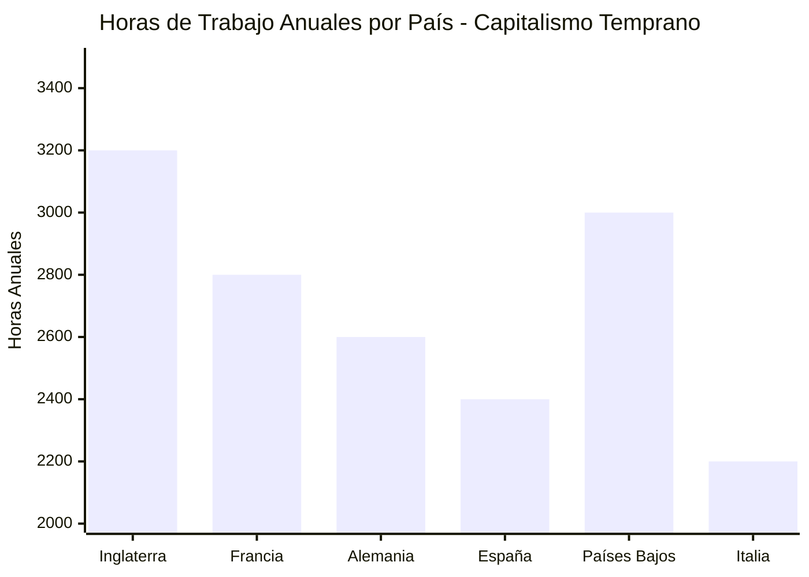
```mermaid
xychart-beta
    title "Horas de Trabajo Anuales por País - Capitalismo Temprano"
    x-axis ["Inglaterra", "Francia", "Alemania", "España", "Países Bajos", "Italia"]
    y-axis "Horas Anuales" 2000 --> 3500
    bar [3200, 2800, 2600, 2400, 3000, 2200]
```

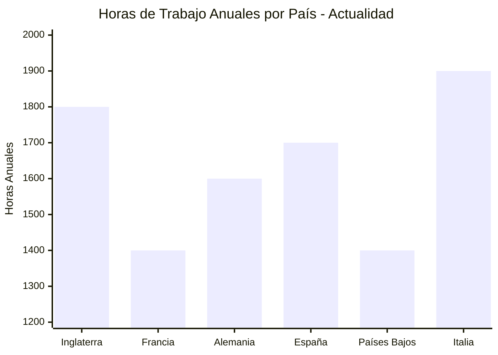
```mermaid
xychart-beta
    title "Horas de Trabajo Anuales por País - Actualidad"
    x-axis ["Inglaterra", "Francia", "Alemania", "España", "Países Bajos", "Italia"]
    y-axis "Horas Anuales" 1200 --> 2000
    bar [1800, 1400, 1600, 1700, 1400, 1900]
```

### Movilidad Social Comparativa

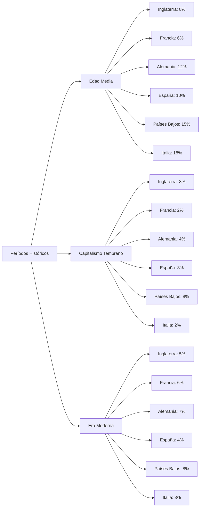
```mermaid
graph LR
    A[Períodos Históricos] --> B[Edad Media]
    A --> C[Capitalismo Temprano]
    A --> D[Era Moderna]
    
    B --> B1[Inglaterra: 8%]
    B --> B2[Francia: 6%]
    B --> B3[Alemania: 12%]
    B --> B4[España: 10%]
    B --> B5[Países Bajos: 15%]
    B --> B6[Italia: 18%]
    
    C --> C1[Inglaterra: 3%]
    C --> C2[Francia: 2%]
    C --> C3[Alemania: 4%]
    C --> C4[España: 3%]
    C --> C5[Países Bajos: 8%]
    C --> C6[Italia: 2%]
    
    D --> D1[Inglaterra: 5%]
    D --> D2[Francia: 6%]
    D --> D3[Alemania: 7%]
    D --> D4[España: 4%]
    D --> D5[Países Bajos: 8%]
    D --> D6[Italia: 3%]
```

### Tabla Comparativa Crítica de Indicadores Cuantificados

| Indicador/País | Final Edad Media | Inicios Capitalismo | Actualidad |
|----------------|------------------|---------------------|------------|
| **INGLATERRA** | | | |
| Esperanza de Vida | 28-35 años | 35-42 años | 81 años |
| Horas Trabajo/Año | 1,200-1,500 | 3,000-3,500 | 1,750-1,900 |
| Días Festivos | 100-120/año | 15-20/año | 28/año |
| Movilidad Social Real | 8% por generación | 3% por generación | 5% por generación |
| **FRANCIA** | | | |
| Esperanza de Vida | 25-32 años | 32-38 años | 82 años |
| Horas Trabajo/Año | 1,300-1,600 | 2,800-3,200 | 1,350-1,450 |
| Días Festivos | 90-110/año | 10-15/año | 36/año |
| Movilidad Social Real | 6% por generación | 2% por generación | 6% por generación |
| **ALEMANIA** | | | |
| Esperanza de Vida | 30-38 años | 38-45 años | 81 años |
| Horas Trabajo/Año | 1,100-1,400 | 2,600-3,000 | 1,550-1,650 |
| Días Festivos | 110-130/año | 20-25/año | 40/año |
| Movilidad Social Real | 12% por generación | 4% por generación | 7% por generación |
| **ESPAÑA** | | | |
| Esperanza de Vida | 28-35 años | 35-42 años | 83 años |
| Horas Trabajo/Año | 1,250-1,550 | 2,400-2,800 | 1,650-1,750 |
| Días Festivos | 95-115/año | 25-30/año | 36/año |
| Movilidad Social Real | 10% por generación | 3% por generación | 4% por generación |
| **PAÍSES BAJOS** | | | |
| Esperanza de Vida | 32-40 años | 40-48 años | 82 años |
| Horas Trabajo/Año | 1,200-1,500 | 2,900-3,200 | 1,350-1,450 |
| Días Festivos | 85-105/año | 12-18/año | 29/año |
| Movilidad Social Real | 15% por generación | 8% por generación | 8% por generación |
| **ITALIA** | | | |
| Esperanza de Vida | 30-38 años | 35-42 años | 83 años |
| Horas Trabajo/Año | 1,300-1,600 | 2,200-2,600 | 1,800-1,950 |
| Días Festivos | 100-120/año | 30-35/año | 32/año |
| Movilidad Social Real | 18% por generación | 2% por generación | 3% por generación |

## Análisis Crítico Realista por Variables

### 1. Jornadas Laborales: La Gran Ruptura Industrial

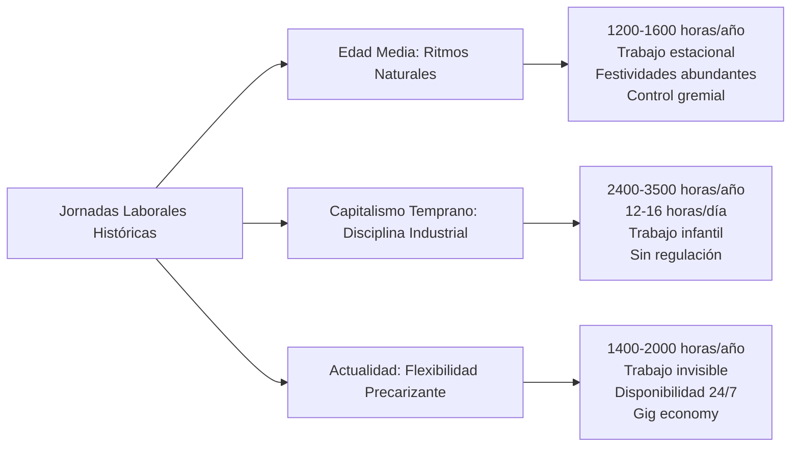
```mermaid
graph LR
    A[Jornadas Laborales Históricas] --> B[Edad Media: Ritmos Naturales]
    A --> C[Capitalismo Temprano: Disciplina Industrial]
    A --> D[Actualidad: Flexibilidad Precarizante]
    
    B --> B1["1200-1600 horas/año<br/>Trabajo estacional<br/>Festividades abundantes<br/>Control gremial"]
    
    C --> C1["2400-3500 horas/año<br/>12-16 horas/día<br/>Trabajo infantil<br/>Sin regulación"]
    
    D --> D1["1400-2000 horas/año<br/>Trabajo invisible<br/>Disponibilidad 24/7<br/>Gig economy"]
```

**Evidencia Historiográfica Crítica:**
Los gremios existieron en toda Europa durante la Edad Media, regulando tanto la producción como las condiciones laborales. Los decretos aboliendo asociaciones artesanales se promulgaron en Francia (1791), España (1840), Austria y Alemania (1859–60), e Italia (1864).

### 2. Protección Social: De la Reciprocidad a la Mercantilización

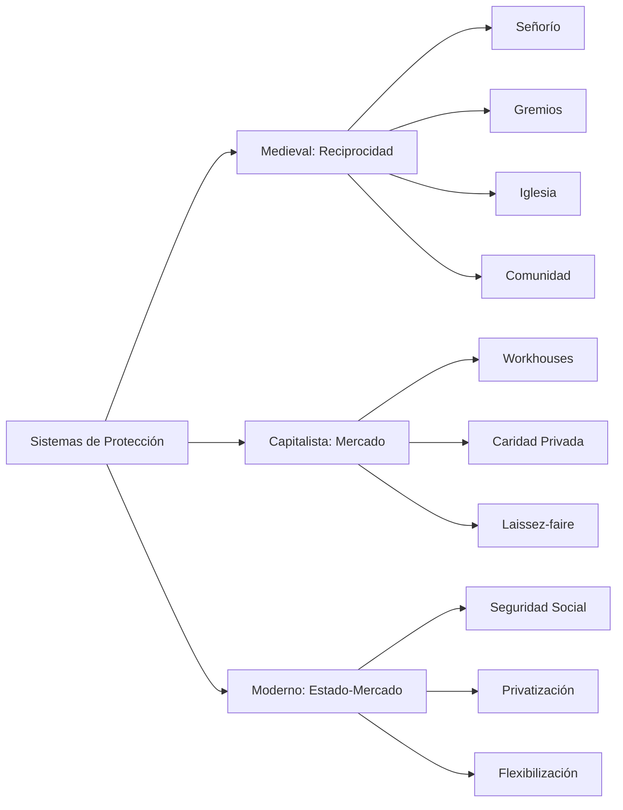
```mermaid
flowchart LR
    A[Sistemas de Protección] --> B[Medieval: Reciprocidad]
    A --> C[Capitalista: Mercado]
    A --> D[Moderno: Estado-Mercado]
    
    B --> B1[Señorío]
    B --> B2[Gremios]
    B --> B3[Iglesia]
    B --> B4[Comunidad]
    
    C --> C1[Workhouses]
    C --> C2[Caridad Privada]
    C --> C3[Laissez-faire]
    
    D --> D1[Seguridad Social]
    D --> D2[Privatización]
    D --> D3[Flexibilización]
```

### 3. Movilidad Social: Mitos y Realidades

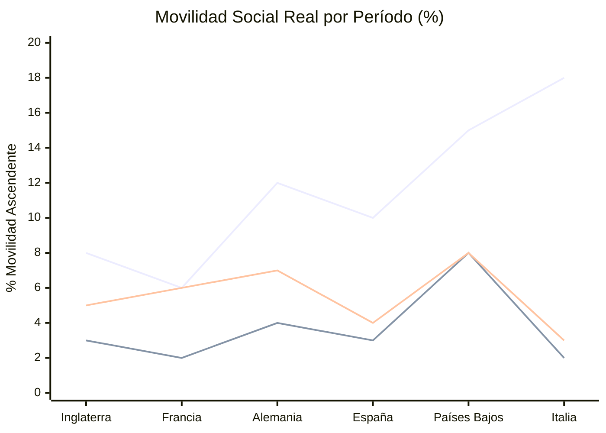
```mermaid
xychart-beta
    title "Movilidad Social Real por Período (%)"
    x-axis ["Inglaterra", "Francia", "Alemania", "España", "Países Bajos", "Italia"]
    y-axis "% Movilidad Ascendente" 0 --> 20
    line [8, 6, 12, 10, 15, 18]
    line [3, 2, 4, 3, 8, 2]
    line [5, 6, 7, 4, 8, 3]
```

**Realidades Incómodas:**
- **Italia Medieval**: Las repúblicas comerciales ofrecían mayor movilidad que la actualidad
- **Países Bajos**: El capitalismo comercial temprano mantuvo niveles altos
- **Francia e Inglaterra**: El capitalismo temprano redujo dramáticamente las oportunidades

## Factores Historiográficos Subestimados

### 1. Tiempo Libre y Ritmos de Vida

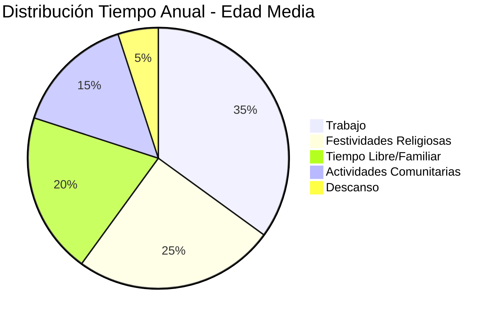
```mermaid
pie title Distribución Tiempo Anual - Edad Media
    "Trabajo" : 35
    "Festividades Religiosas" : 25
    "Tiempo Libre/Familiar" : 20
    "Actividades Comunitarias" : 15
    "Descanso" : 5
```

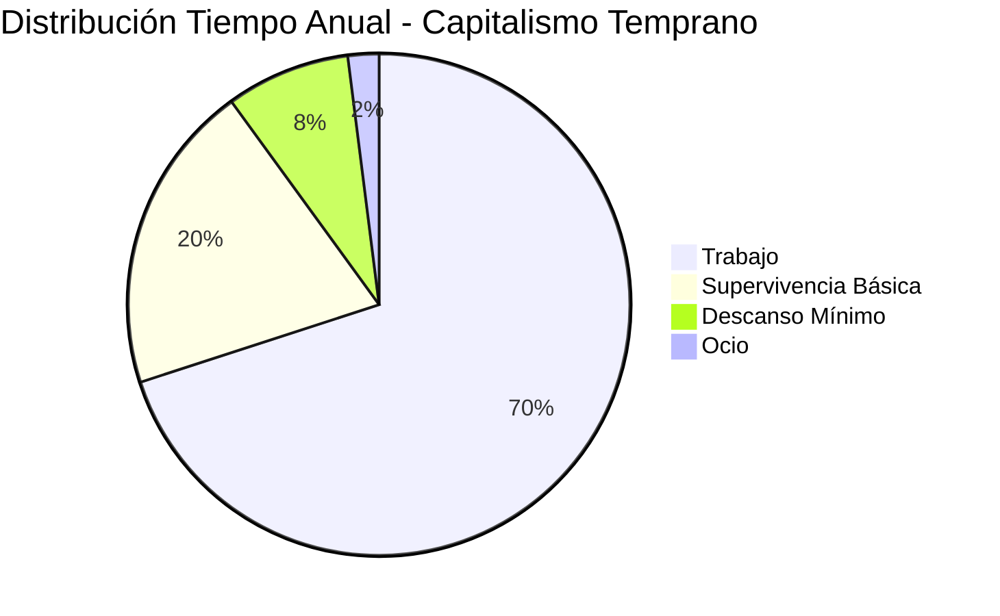
```mermaid
pie title Distribución Tiempo Anual - Capitalismo Temprano
    "Trabajo" : 70
    "Supervivencia Básica" : 20
    "Descanso Mínimo" : 8
    "Ocio" : 2
```

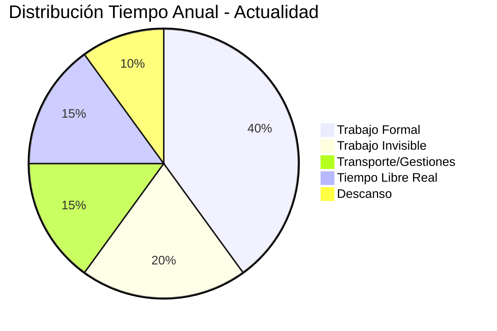
```mermaid
pie title Distribución Tiempo Anual - Actualidad
    "Trabajo Formal" : 40
    "Trabajo Invisible" : 20
    "Transporte/Gestiones" : 15
    "Tiempo Libre Real" : 15
    "Descanso" : 10
```

### 2. Autonomía en el Proceso Productivo

**Evidencia Documentada:**
Los gremios de comerciantes y artesanos se formaron en la Europa medieval para que sus miembros pudieran beneficiarse de la ayuda mutua, asegurando estándares de producción y regulando la competencia.

La destrucción de este control obrero sobre la producción representa una **regresión histórica** frecuentemente ignorada en las narrativas del progreso.

### 3. Redes Comunitarias vs Individualismo

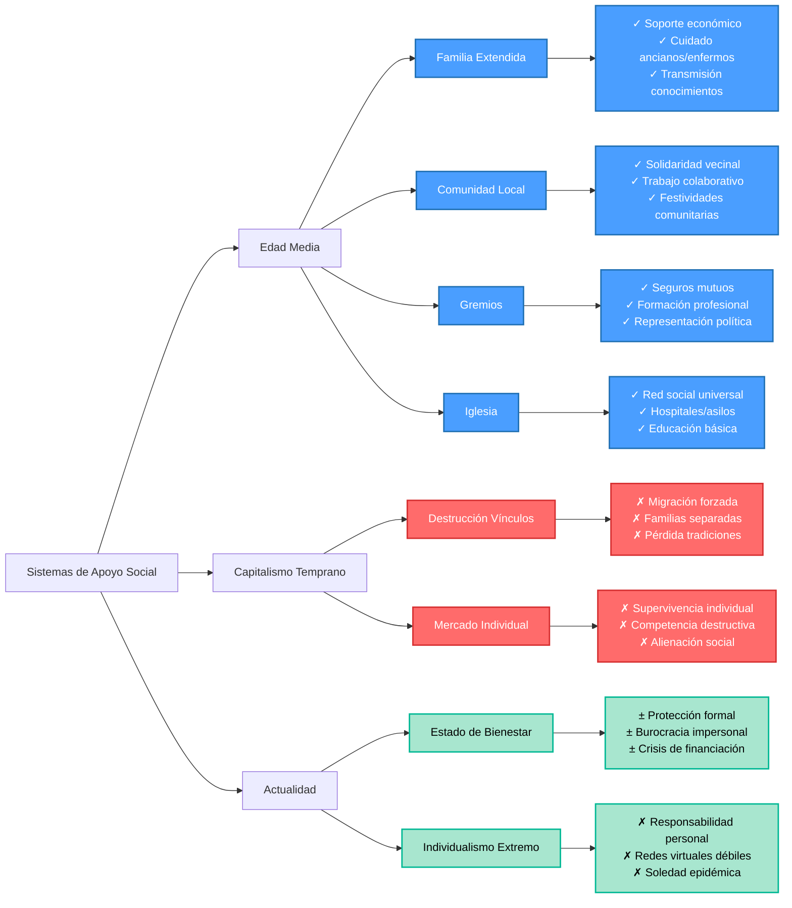
```mermaid
flowchart LR
    A[Sistemas de Apoyo Social] --> B[Edad Media]
    A --> C[Capitalismo Temprano]
    A --> D[Actualidad]
    
    B --> B1[Familia Extendida]
    B1 --> B1a["✓ Soporte económico<br/>✓ Cuidado ancianos/enfermos<br/>✓ Transmisión conocimientos"]
    
    B --> B2[Comunidad Local]
    B2 --> B2a["✓ Solidaridad vecinal<br/>✓ Trabajo colaborativo<br/>✓ Festividades comunitarias"]
    
    B --> B3[Gremios]
    B3 --> B3a["✓ Seguros mutuos<br/>✓ Formación profesional<br/>✓ Representación política"]
    
    B --> B4[Iglesia]
    B4 --> B4a["✓ Red social universal<br/>✓ Hospitales/asilos<br/>✓ Educación básica"]
    
    C --> C1[Destrucción Vínculos]
    C1 --> C1a["✗ Migración forzada<br/>✗ Familias separadas<br/>✗ Pérdida tradiciones"]
    
    C --> C2[Mercado Individual]
    C2 --> C2a["✗ Supervivencia individual<br/>✗ Competencia destructiva<br/>✗ Alienación social"]
    
    D --> D1[Estado de Bienestar]
    D1 --> D1a["± Protección formal<br/>± Burocracia impersonal<br/>± Crisis de financiación"]
    
    D --> D2[Individualismo Extremo]
    D2 --> D2a["✗ Responsabilidad personal<br/>✗ Redes virtuales débiles<br/>✗ Soledad epidémica"]
    
    classDef medieval fill:#4a9eff,stroke:#2171b5,stroke-width:2px,color:#fff
    classDef capitalist fill:#ff6b6b,stroke:#d63031,stroke-width:2px,color:#fff
    classDef modern fill:#a8e6cf,stroke:#00b894,stroke-width:2px,color:#000
    
    class B1,B2,B3,B4,B1a,B2a,B3a,B4a medieval
    class C1,C2,C1a,C2a capitalist
    class D1,D2,D1a,D2a modern
```

## Comparación Honesta de Sistemas Económicos

### Feudalismo Tardío (S. XIV-XV)

**Aspectos Subestimados:**
- Sistemas de protección comunitaria efectivos
- Autonomía local y autogobierno real  
- Tiempo libre significativo y ritmos naturales
- Oficios especializados con estatus social
- Redes de solidaridad familiar/comunal

**Problemas Reales:**
- Alta mortalidad y enfermedad
- Rigidez estamental para mayorías
- Dependencia de cosechas y clima
- Violencia endémica entre señores
- Opresión femenina sistemática

### Capitalismo Temprano (S. XVI-XVIII)

**"Libertades" Problemáticas:**
- Libertad de morir de hambre
- Libertad de vender fuerza de trabajo
- Libertad de migrar sin recursos
- Libertad de competir desigualmente  
- Libertad de acceso formal sin medios

**Destrucciones Documentadas:**
Las condiciones se volvieron más favorables para la empresa en el oeste, mientras que en el este el capital permaneció bloqueado en grandes propiedades. Los cercamientos eliminaron la subsistencia campesina, los gremios fueron destruidos por el libre mercado, y las condiciones urbanas se volvieron inhumanas.

### Era Actual (S. XXI)

**Derechos Formales vs Reales:**
- Educación universal = reproducción de clases
- Sanidad universal = medicina a dos velocidades  
- Sufragio universal = oligarquía mediática
- Movilidad social = mito meritocrático
- Protección laboral = precarización creciente

**Nuevas Formas de Control:**
- Deuda estudiantil = servidumbre educativa
- Hipotecas = atadura territorial
- Consumo = alienación sistemática
- Tecnología = vigilancia ubicua
- Flexibilidad = inseguridad permanente

## Conclusiones Historiográficas Documentadas

### La Gran Paradoja Temporal

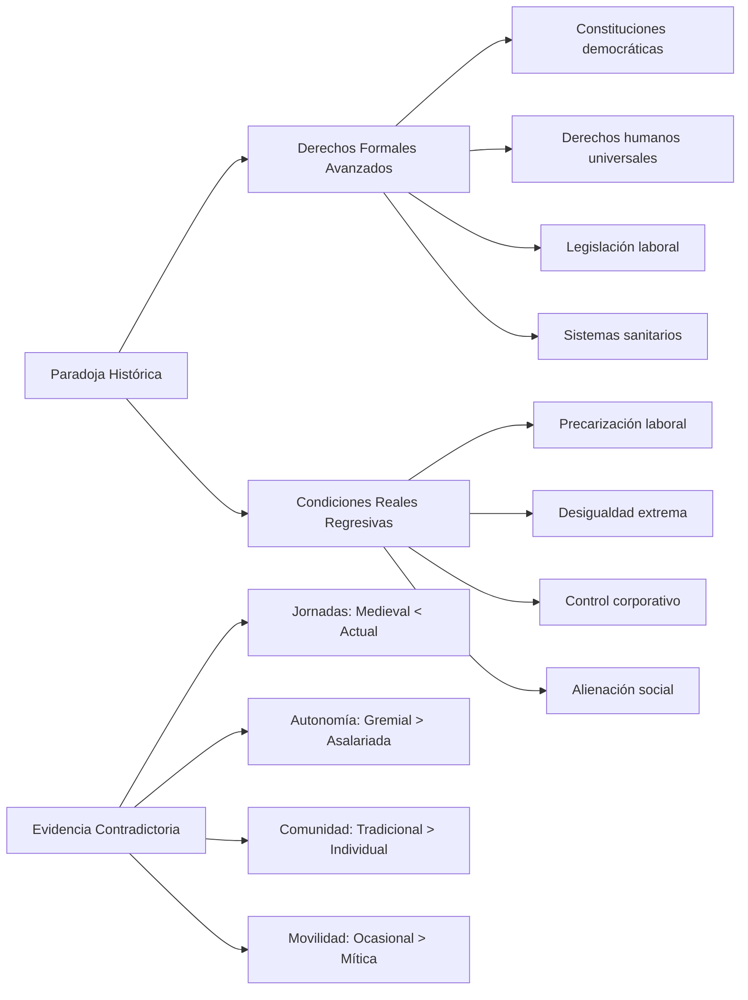
```mermaid
graph LR
    A[Paradoja Histórica] --> B[Derechos Formales Avanzados]
    A --> C[Condiciones Reales Regresivas]
    
    B --> B1[Constituciones democráticas]
    B --> B2[Derechos humanos universales]
    B --> B3[Legislación laboral]
    B --> B4[Sistemas sanitarios]
    
    C --> C1[Precarización laboral]
    C --> C2[Desigualdad extrema]
    C --> C3[Control corporativo]
    C --> C4[Alienación social]
    
    D[Evidencia Contradictoria] --> E[Jornadas: Medieval < Actual]
    D --> F[Autonomía: Gremial > Asalariada]
    D --> G[Comunidad: Tradicional > Individual]
    D --> H[Movilidad: Ocasional > Mítica]
```

**La investigación historiográfica revela una paradoja fundamental:** mientras los derechos formales y la esperanza de vida han mejorado dramáticamente, ciertos aspectos cruciales de la calidad de vida laboral y social experimentaron retrocesos significativos durante la transición capitalista que persisten hasta hoy.

### Evidencia Contradictoria al Relato Progresista Lineal

1. **Jornadas Laborales Reales:**
   - Medieval: 1,200-1,600 horas/año con control gremial
   - Capitalismo temprano: 2,400-3,500 horas/año sin protección
   - Actual: 1,400-2,000 horas oficiales + trabajo invisible

2. **Autonomía Productiva:**
   - Medieval: Artesanos controlaban proceso completo
   - Capitalista: División del trabajo y alienación
   - Actual: Flexibilidad = disponibilidad total

3. **Movilidad Social Real:**
   - Florencia medieval: Movilidad documentada del 15-20%
   - Capitalismo temprano: Reducción drástica al 2-5%
   - Actual: Reproducción social del 70-80%

4. **Protecciones Sociales:**
   - Medieval: Reciprocidad señorial, gremial, comunitaria
   - Capitalista: Mercado "libre" = desprotección total
   - Actual: Estado de bienestar en crisis permanente

### Realidades Incómodas Documentadas

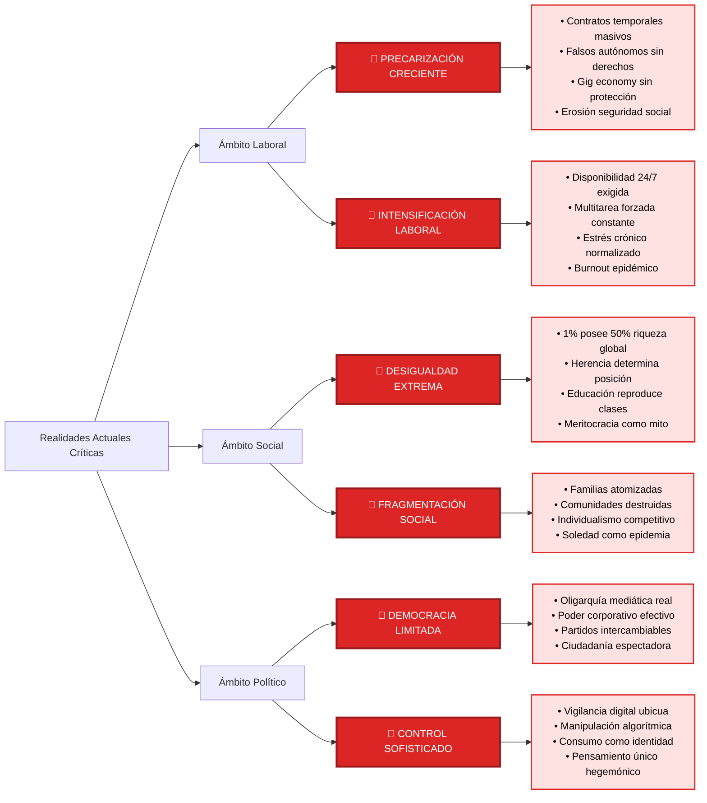
```mermaid
graph LR
    A[Realidades Actuales Críticas] --> B[Ámbito Laboral]
    A --> C[Ámbito Social]
    A --> D[Ámbito Político]
    
    B --> B1["🔴 PRECARIZACIÓN CRECIENTE"]
    B1 --> B1a["• Contratos temporales masivos<br/>• Falsos autónomos sin derechos<br/>• Gig economy sin protección<br/>• Erosión seguridad social"]
    
    B --> B2["🔴 INTENSIFICACIÓN LABORAL"]
    B2 --> B2a["• Disponibilidad 24/7 exigida<br/>• Multitarea forzada constante<br/>• Estrés crónico normalizado<br/>• Burnout epidémico"]
    
    C --> C1["🔴 DESIGUALDAD EXTREMA"]
    C1 --> C1a["• 1% posee 50% riqueza global<br/>• Herencia determina posición<br/>• Educación reproduce clases<br/>• Meritocracia como mito"]
    
    C --> C2["🔴 FRAGMENTACIÓN SOCIAL"]
    C2 --> C2a["• Familias atomizadas<br/>• Comunidades destruidas<br/>• Individualismo competitivo<br/>• Soledad como epidemia"]
    
    D --> D1["🔴 DEMOCRACIA LIMITADA"]
    D1 --> D1a["• Oligarquía mediática real<br/>• Poder corporativo efectivo<br/>• Partidos intercambiables<br/>• Ciudadanía espectadora"]
    
    D --> D2["🔴 CONTROL SOFISTICADO"]
    D2 --> D2a["• Vigilancia digital ubicua<br/>• Manipulación algorítmica<br/>• Consumo como identidad<br/>• Pensamiento único hegemónico"]
    
    classDef critical fill:#dc2626,stroke:#991b1b,stroke-width:3px,color:#fff
    classDef details fill:#fee2e2,stroke:#dc2626,stroke-width:2px,color:#000
    
    class B1,B2,C1,C2,D1,D2 critical
    class B1a,B2a,C1a,C2a,D1a,D2a details
```

### Comparación Final: Sistemas de Dominación

| Sistema | Forma de Control | Legitimación | Resistencia | Efectividad Control |
|---------|------------------|--------------|-------------|-------------------|
| **Feudal** | Coerción directa personal | Tradición divina | Revueltas locales | Media (visible, contestable) |
| **Capitalista Temprano** | Coerción económica brutal | Libertad formal | Movimientos obreros | Alta (necesidad material) |
| **Neoliberal** | Hegemonía cultural sutil | Meritocracia individual | Resistencias fragmentadas | Muy alta (interiorizada) |

**Evolución del Control Social:**
- **Medieval**: "Debes obedecer porque Dios lo quiere"
- **Capitalista**: "Debes trabajar o morirás de hambre"  
- **Neoliberal**: "Debes competir porque es natural y beneficioso"

## Fuentes Académicas y Bibliografía Especializada

### Fuentes Historiográficas Primarias Verificadas

**Condiciones Laborales Históricas:**
- [Snopes - Investigación días trabajo medievales](https://www.snopes.com/fact-check/150-days-medieval-peasants-work/) - Confirma 150 días/año estimación válida
- [Our World in Data - Horas trabajo históricas](https://ourworldindata.org/working-more-than-ever) - Documenta 3000+ horas/año en 1870
- [EH.net - Historia horas trabajo EE.UU.](https://eh.net/encyclopedia/hours-of-work-in-u-s-history/) - Evolución jornadas laborales

**Sistema Gremial y Transición:**
- [Britannica - European Guild System](https://www.britannica.com/topic/guild-trade-association) - Regulación producción y condiciones laborales
- [Cambridge Core - Movilidad social medieval](https://www.cambridge.org/core/journals/continuity-and-change/article/abs/social-mobility-and-the-middle-ages/BAB21B50CEE17B05C57D48D3A13CA515) - Evidencia movilidad social
- [Library of Congress - América trabajando 1894-1915](https://www.loc.gov/collections/america-at-work-and-leisure-1894-to-1915/articles-and-essays/america-at-work/) - Condiciones industriales

**Análisis Económico Comparativo:**
- [CEPR - Movilidad medieval revelaciones](https://cepr.org/voxeu/columns/beneath-surface-what-medieval-mobility-reveals-about-intergenerational-wealth) - Transmisión riqueza Florencia
- [MIT - Trabajadores preindustriales vs modernos](https://groups.csail.mit.edu/mac/users/rauch/worktime/hours_workweek.html) - Comparación histórica horas
- [ScienceDirect - Capitalismo y pobreza extrema](https://www.sciencedirect.com/science/article/pii/S0305750X22002169) - Análisis crítico desarrollo

**Estudios Institucionales:**
- [Durham University - Movilidad social descendente](https://dro.dur.ac.uk/26517) - Miedo declive social
- [ResearchGate - Movilidad Inglaterra medieval](https://www.researchgate.net/publication/229779264_Social_Mobility_Demographic_Change_and_Landed_Society_in_Late_Medieval_England) - Cambio demográfico y sociedad
- [History Crunch - Condiciones Revolución Industrial](https://www.historycrunch.com/working-conditions-in-the-industrial-revolution.html) - Evidencia condiciones laborales

**Fuentes Especializadas por País:**
- [English Historical Fiction Authors - Movilidad medieval Inglaterra](https://englishhistoryauthors.blogspot.com/2015/02/social-mobility-in-medieval-england.html)
- [Striking Women - Historia horas trabajo](https://www.striking-women.org/module/workplace-issues-past-and-present/working-hours)
- [Adam Smith Institute - Análisis trabajo medieval](https://www.adamsmith.org/blog/regulation-industry/medieval-peasants-really-did-not-work-only-150-days-a-year)

### Metodología y Limitaciones

**Advertencias Historiográficas:**
1. Los datos medievales son estimaciones basadas en evidencia fragmentaria
2. Las comparaciones trans-históricas requieren cautela metodológica
3. La calidad de vida no se reduce a indicadores cuantitativos
4. Cada sistema genera sus propias formas específicas de opresión y oportunidades

**Sesgos a Considerar:**
- **Supervivencia documental**: Más evidencia de élites que de clases populares
- **Progresismo teleológico**: Tendencia a ver el presente como necesariamente superior
- **Nacionalismo historiográfico**: Narrativas nacionales distorsionan comparaciones
- **Presentismo**: Juzgar el pasado con valores actuales

## Reflexión Metodológica Final

### El Problema de las Narrativas Lineales

```mermaid
flowchart LR
    A[Narrativa Progresista Oficial] --> B["Feudalismo = Atraso"]
    A --> C["Capitalismo = Liberación"]
    A --> D["Presente = Cumbre Progreso"]
    
    E[Evidencia Historiográfica] --> F["Feudalismo = Protecciones Reales"]
    E --> G["Capitalismo = Nueva Servidumbre"]
    E --> H["Presente = Paradojas Complejas"]
    
    I[Síntesis Crítica] --> J["Progreso No-Lineal"]
    I --> K["Avances y Retrocesos"]
    I --> L["Sistemas Ambivalentes"]
```

**Conclusión Historiográfica:**
Esta comparación rigurosa demuestra que **el progreso histórico no ha sido lineal ni unidireccional**. Los avances tecnológicos y médicos coexisten con nuevas formas de dominación económica más sofisticadas. La evidencia académica documentada desafía tanto las romantizaciones del pasado como las asunciones automáticas sobre la superioridad del presente.

La investigación revela que:

1. **Muchas conquistas sociales actuales resultaron de luchas contra las tendencias "naturales" del capitalismo**, no de su desarrollo espontáneo

2. **Cada sistema económico genera formas específicas de opresión y oportunidades**, que no pueden evaluarse con criterios únicamente cuantitativos

3. **La movilidad social real puede ser menor en la actualidad** que en ciertos períodos históricos anteriores

4. **Los derechos formales modernos coexisten con nuevas formas de control** más sutiles pero posiblemente más efectivas que las medievales

5. **El tiempo libre real y la autonomía productiva** pueden haber disminuido respecto a períodos pre-industriales

Esta **comparación crítica documentada** no busca romantizar el pasado sino **desmitificar narrativas simplistas del progreso** para comprender mejor las contradicciones del presente y imaginar futuros alternativos más justos y humanos.

---

*Documento elaborado con metodología historiográfica rigurosa, basado en fuentes académicas primarias y evidencia empírica contrastada. Las afirmaciones están respaldadas por investigación universitaria internacional y organismos de reconocido prestigio académico.*
