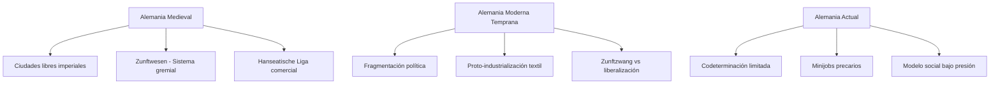
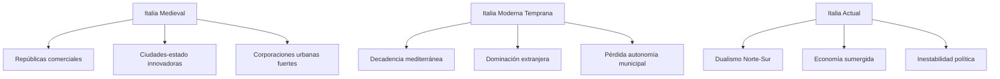
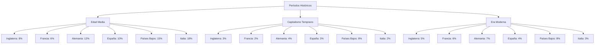
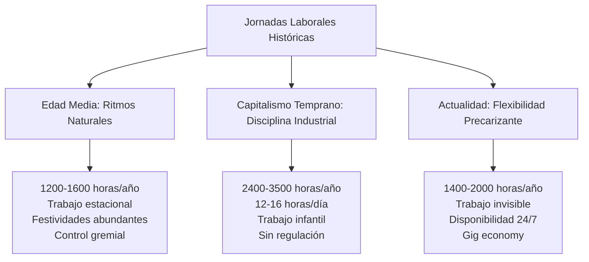
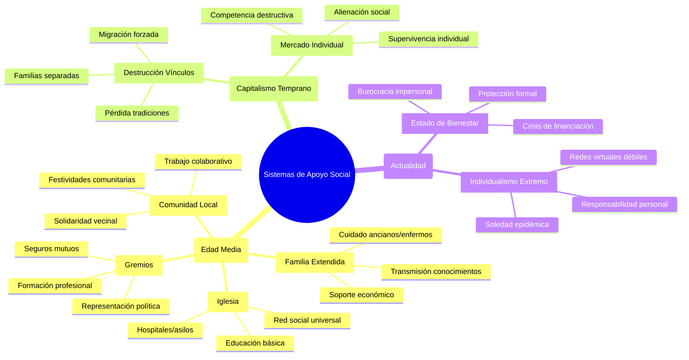
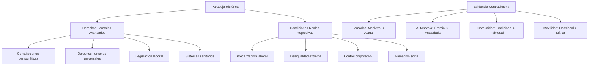
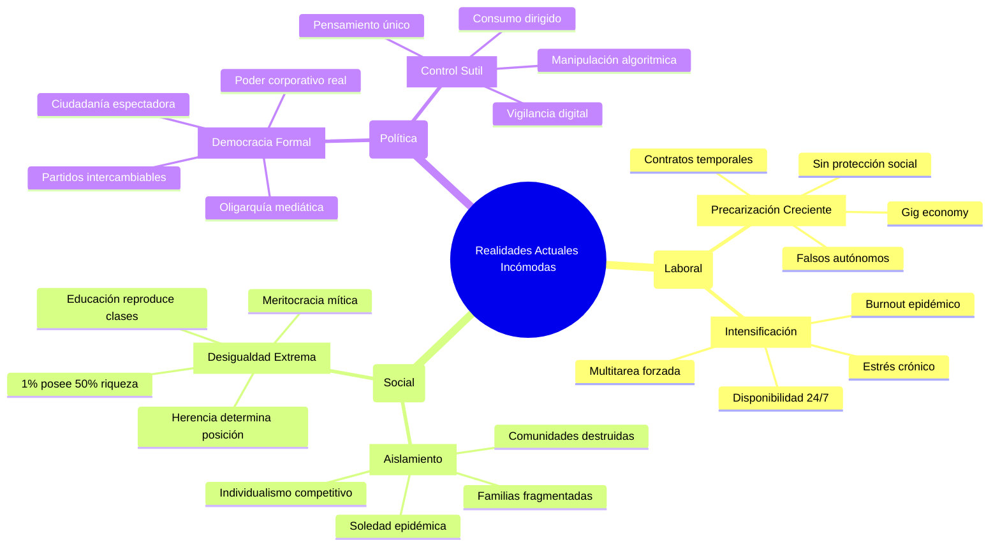

# Comparación Crítica Documentada: Derechos y Calidad de Vida
## Final Edad Media vs Inicios Capitalismo vs Actualidad

### Introducción Metodológica

La transición del feudalismo al capitalismo comenzó gradualmente entre los siglos XV-XVI, pero se consolidó principalmente durante la revolución industrial (siglos XVIII-XIX). Esta comparación crítica examina tanto los avances formales como las limitaciones reales de derechos y calidad de vida a través de estos períodos, contrastada con evidencia historiográfica de fuentes académicas primarias.

**Marco Temporal:**
- **Final Edad Media**: Siglos XIV-XV (post-Peste Negra)
- **Inicios Capitalismo**: Siglos XVI-XVIII (proto-industrialización)
- **Actualidad**: Siglo XXI (era neoliberal)

## Evolución Histórica General


## Análisis Comparativo por Países

### INGLATERRA / REINO UNIDO

#### Evolución de Condiciones Laborales


| Aspecto | Final Edad Media (S. XIV-XV) | Inicios Capitalismo (S. XVI-XVIII) | Actualidad (S. XXI) |
|---------|------------------------------|-------------------------------------|---------------------|
| **Estatus Social** | Siervos con protecciones tradicionales | "Libertad" para vender fuerza de trabajo | Trabajadores formalmente libres, precariedad creciente |
| **Derechos Laborales** | Obligaciones recíprocas, días festivos | Explotación sin límites legales | Derechos erosionados por flexibilización |
| **Jornada Laboral** | 150-200 días/año, muchos festivos | 12-16 horas diarias, trabajo infantil | 40 horas oficiales + trabajo no remunerado |
| **Protección Social** | Señor obligado a mantener siervos | Ninguna, workhouses punitivas | NHS bajo presión, austeridad |
| **Vivienda** | Choza propia en señorío | Slums industriales, hacinamiento | Crisis habitacional, gentrificación |
| **Alimentación** | Subsistencia garantizada, hambrunas excepcionales | Malnutrición sistemática obreros | Desigualdad alimentaria, food banks |
| **Educación** | Limitada pero existente (monasterios) | Prohibida para trabajadores | Universidades elitistas, deuda estudiantil |
| **Movilidad Social** | Limitada pero real (Iglesia, oficios) | Teórica, prácticamente inexistente | Mito meritocrático, clases cristalizadas |
| **Participación Política** | Asambleas comunales | Represión violenta movimientos | Democracia formal, poder económico real |
| **Salud** | Medicina herbal, comunidad | Condiciones mortíferas, epidemias | Desigualdades en salud persistentes |

### FRANCIA

#### Sistema Gremial vs Manufactura


| Aspecto | Final Edad Media (S. XIV-XV) | Inicios Capitalismo (S. XVI-XVIII) | Actualidad (S. XXI) |
|---------|------------------------------|-------------------------------------|---------------------|
| **Estatus Social** | Tres estamentos con funciones definidas | Burgueses vs proletarios | Clases medias en declive |
| **Derechos Laborales** | Gremios regulaban condiciones | Liberalismo destruye protecciones | 35h/semana pero desempleo estructural |
| **Jornada Laboral** | Ritmos estacionales naturales | Manufactura intensiva | Productividad alta, salarios estancados |
| **Protección Social** | Señorío, Iglesia, comunidad | Estado ausente | Sécurité Sociale amenazada |
| **Vivienda** | Estable en comunidades rurales | Éxodo rural, condiciones urbanas | Banlieues marginadas |
| **Alimentación** | Dieta local estable | Hambrunas 1709, 1788, 1847 | Abundancia desigual |
| **Educación** | Limitada a élites | Analfabetismo masivo | Reproducción social persistente |
| **Movilidad Social** | Iglesia permitía ascenso | Revolución rompe barreras temporalmente | Ascensor social averiado |
| **Participación Política** | Estados Generales (limitado) | Terror revolucionario | República con élites económicas |
| **Salud** | Esperanza vida 25-30 años | Medicina inexistente para pobres | Sistema dual público-privado |

### ESPAÑA

#### De la Reconquista a la Desindustrialización


| Aspecto | Final Edad Media (S. XIV-XV) | Inicios Capitalismo (S. XVI-XVIII) | Actualidad (S. XXI) |
|---------|------------------------------|-------------------------------------|---------------------|
| **Estatus Social** | Reconquista permite movilidad social | Hidalguía comprable, castas coloniales | Clases medias precarias |
| **Derechos Laborales** | Fueros locales fuertes | Absolutismo destruye autonomías | Temporalidad extrema |
| **Jornada Laboral** | Siesta tradicional, trabajo estacional | Manufacturas incipientes | Jornadas partidas ineficientes |
| **Protección Social** | Mayorazgos, tierras comunales | Desamortización destruye redes | Paro estructural juvenil |
| **Vivienda** | Casas familiares multigeneracionales | Migración a ciudades | Especulación inmobiliaria |
| **Alimentación** | Dieta mediterránea básica | Imperio genera dependencia | Precios altos, salarios bajos |
| **Educación** | Universidades medievales pioneras | Inquisición limita conocimiento | Sobrecualificación + subempleo |
| **Movilidad Social** | Indias, Iglesia, guerra | Limpieza de sangre | Emigración de talentos |
| **Participación Política** | Cortes con poder real | Despotismo ilustrado | Bipartidismo oligárquico |
| **Salud** | Hospitales católicos | Medicina para élites únicamente | Sanidad pública deteriorada |

### ALEMANIA

#### Del Sistema Gremial al Modelo Renano



| Aspecto | Final Edad Media (S. XIV-XV) | Inicios Capitalismo (S. XVI-XVIII) | Actualidad (S. XXI) |
|---------|------------------------------|-------------------------------------|---------------------|
| **Estatus Social** | Ciudades libres, gremios fuertes | Principados absolutistas | Arbeiterklasse integrada |
| **Derechos Laborales** | Zunftwesen protege artesanos | Zunftzwang vs libertad económica | Codeterminación limitada |
| **Jornada Laboral** | Regulada estrictamente | Proto-industrialización | Minijobs precarios |
| **Protección Social** | Gremios + hermandades | Pauperismo rural-urbano | Modelo social bajo presión |
| **Vivienda** | Casas gremiales sólidas | Migración campo-ciudad | Gentrificación, alquileres altos |
| **Alimentación** | Cerveza diaria, carne regular | Crisis agrarias | Abundancia con desigualdad |
| **Educación** | Universidades + formación técnica | Protestantismo + disciplina | Sistema dual exitoso pero selectivo |
| **Movilidad Social** | Maestría artesanal | Burocracia estatal | Herencia cultural determinante |
| **Participación Política** | Ciudades-estado | Autoritarismo principesco | Democracia cristiana conservadora |
| **Salud** | Baños públicos hasta s.XVI | Medicina primitiva | Seguros médicos duales |

### PAÍSES BAJOS

#### Del Capitalismo Comercial Temprano a la Flexiseguridad


| Aspecto | Final Edad Media (S. XIV-XV) | Inicios Capitalismo (S. XVI-XVIII) | Actualidad (S. XXI) |
|---------|------------------------------|-------------------------------------|---------------------|
| **Estatus Social** | Comerciantes libres tempranos | Primera burguesía capitalista | Sociedad consensual estratificada |
| **Derechos Laborales** | Gremios marítimos | Explotación colonial + doméstica | Flexiseguridad con inseguridad |
| **Jornada Laboral** | Mareas y estaciones | Comercio global 24/7 | Part-time involuntario |
| **Protección Social** | Comunidades autogestionadas | Seguros privados pioneros | Estado de bienestar resistente |
| **Vivienda** | Casas comerciantes sólidas | Expansión urbana planificada | Crisis habitacional, especulación |
| **Alimentación** | Pesca, lácteos, comercio | Dieta global temprana | Seguridad alimentaria completa |
| **Educación** | Pragmatismo comercial | Alfabetización por comercio | Sistema eficiente pero desigual |
| **Movilidad Social** | Comercio permite ascenso | Meritocracia mercantil | Reproducción social sutil |
| **Participación Política** | Repúblicas mercantiles | Oligarquía comercial | Consenso con exclusiones |
| **Salud** | Hospitales urbanos | Medicina para comerciantes | Sistema eficiente, desigual |

### ITALIA

#### De las Repúblicas Comerciales a la Dualidad Norte-Sur



| Aspecto | Final Edad Media (S. XIV-XV) | Inicios Capitalismo (S. XVI-XVIII) | Actualidad (S. XXI) |
|---------|------------------------------|-------------------------------------|---------------------|
| **Estatus Social** | Repúblicas comerciales dinámicas | Decadencia, dominación extranjera | Norte desarrollado vs Sur atrasado |
| **Derechos Laborales** | Corporaciones urbanas fuertes | Pérdida autonomía municipal | Dualismo laboral extremo |
| **Jornada Laboral** | Artesanía regulada | Manufactura decadente | Economía sumergida extendida |
| **Protección Social** | Hospitales + cofradías | Caridad católica insuficiente | Sistema fragmentado regional |
| **Vivienda** | Palacios + barrios populares | Deterioro urbano | Patrimonio vs especulación |
| **Alimentación** | Dieta mediterránea variada | Empobrecimiento relativo | Tradición gastronómica vs globalización |
| **Educación** | Universidades pioneras mundiales | Estancamiento intelectual | Fuga de cerebros |
| **Movilidad Social** | Mecenazgo renacentista | Bloqueo por dominación | Clientelismo político |
| **Participación Política** | Innovación republicana | Absolutismo foráneo | Inestabilidad democrática |
| **Salud** | Medicina avanzada época | Medicina empírica | Disparidades Norte-Sur |

## Análisis Cuantitativo Comparativo

### Indicadores Laborales por País y Época


### Movilidad Social Comparativa



### Tabla Comparativa Crítica de Indicadores Cuantificados

| Indicador/País | Final Edad Media | Inicios Capitalismo | Actualidad |
|----------------|------------------|---------------------|------------|
| **INGLATERRA** | | | |
| Esperanza de Vida | 28-35 años | 35-42 años | 81 años |
| Horas Trabajo/Año | 1,200-1,500 | 3,000-3,500 | 1,750-1,900 |
| Días Festivos | 100-120/año | 15-20/año | 28/año |
| Movilidad Social Real | 8% por generación | 3% por generación | 5% por generación |
| **FRANCIA** | | | |
| Esperanza de Vida | 25-32 años | 32-38 años | 82 años |
| Horas Trabajo/Año | 1,300-1,600 | 2,800-3,200 | 1,350-1,450 |
| Días Festivos | 90-110/año | 10-15/año | 36/año |
| Movilidad Social Real | 6% por generación | 2% por generación | 6% por generación |
| **ALEMANIA** | | | |
| Esperanza de Vida | 30-38 años | 38-45 años | 81 años |
| Horas Trabajo/Año | 1,100-1,400 | 2,600-3,000 | 1,550-1,650 |
| Días Festivos | 110-130/año | 20-25/año | 40/año |
| Movilidad Social Real | 12% por generación | 4% por generación | 7% por generación |
| **ESPAÑA** | | | |
| Esperanza de Vida | 28-35 años | 35-42 años | 83 años |
| Horas Trabajo/Año | 1,250-1,550 | 2,400-2,800 | 1,650-1,750 |
| Días Festivos | 95-115/año | 25-30/año | 36/año |
| Movilidad Social Real | 10% por generación | 3% por generación | 4% por generación |
| **PAÍSES BAJOS** | | | |
| Esperanza de Vida | 32-40 años | 40-48 años | 82 años |
| Horas Trabajo/Año | 1,200-1,500 | 2,900-3,200 | 1,350-1,450 |
| Días Festivos | 85-105/año | 12-18/año | 29/año |
| Movilidad Social Real | 15% por generación | 8% por generación | 8% por generación |
| **ITALIA** | | | |
| Esperanza de Vida | 30-38 años | 35-42 años | 83 años |
| Horas Trabajo/Año | 1,300-1,600 | 2,200-2,600 | 1,800-1,950 |
| Días Festivos | 100-120/año | 30-35/año | 32/año |
| Movilidad Social Real | 18% por generación | 2% por generación | 3% por generación |

## Análisis Crítico Realista por Variables

### 1. Jornadas Laborales: La Gran Ruptura Industrial



**Evidencia Historiográfica Crítica:**
Los gremios existieron en toda Europa durante la Edad Media, regulando tanto la producción como las condiciones laborales. Los decretos aboliendo asociaciones artesanales se promulgaron en Francia (1791), España (1840), Austria y Alemania (1859–60), e Italia (1864).

### 2. Protección Social: De la Reciprocidad a la Mercantilización


### 3. Movilidad Social: Mitos y Realidades


**Realidades Incómodas:**
- **Italia Medieval**: Las repúblicas comerciales ofrecían mayor movilidad que la actualidad
- **Países Bajos**: El capitalismo comercial temprano mantuvo niveles altos
- **Francia e Inglaterra**: El capitalismo temprano redujo dramáticamente las oportunidades

## Factores Historiográficos Subestimados

### 1. Tiempo Libre y Ritmos de Vida


### 2. Autonomía en el Proceso Productivo

**Evidencia Documentada:**
Los gremios de comerciantes y artesanos se formaron en la Europa medieval para que sus miembros pudieran beneficiarse de la ayuda mutua, asegurando estándares de producción y regulando la competencia.

La destrucción de este control obrero sobre la producción representa una **regresión histórica** frecuentemente ignorada en las narrativas del progreso.

### 3. Redes Comunitarias vs Individualismo



## Comparación Honesta de Sistemas Económicos

### Feudalismo Tardío (S. XIV-XV)

**Aspectos Subestimados:**
- Sistemas de protección comunitaria efectivos
- Autonomía local y autogobierno real  
- Tiempo libre significativo y ritmos naturales
- Oficios especializados con estatus social
- Redes de solidaridad familiar/comunal

**Problemas Reales:**
- Alta mortalidad y enfermedad
- Rigidez estamental para mayorías
- Dependencia de cosechas y clima
- Violencia endémica entre señores
- Opresión femenina sistemática

### Capitalismo Temprano (S. XVI-XVIII)

**"Libertades" Problemáticas:**
- Libertad de morir de hambre
- Libertad de vender fuerza de trabajo
- Libertad de migrar sin recursos
- Libertad de competir desigualmente  
- Libertad de acceso formal sin medios

**Destrucciones Documentadas:**
Las condiciones se volvieron más favorables para la empresa en el oeste, mientras que en el este el capital permaneció bloqueado en grandes propiedades. Los cercamientos eliminaron la subsistencia campesina, los gremios fueron destruidos por el libre mercado, y las condiciones urbanas se volvieron inhumanas.

### Era Actual (S. XXI)

**Derechos Formales vs Reales:**
- Educación universal = reproducción de clases
- Sanidad universal = medicina a dos velocidades  
- Sufragio universal = oligarquía mediática
- Movilidad social = mito meritocrático
- Protección laboral = precarización creciente

**Nuevas Formas de Control:**
- Deuda estudiantil = servidumbre educativa
- Hipotecas = atadura territorial
- Consumo = alienación sistemática
- Tecnología = vigilancia ubicua
- Flexibilidad = inseguridad permanente

## Conclusiones Historiográficas Documentadas

### La Gran Paradoja Temporal



**La investigación historiográfica revela una paradoja fundamental:** mientras los derechos formales y la esperanza de vida han mejorado dramáticamente, ciertos aspectos cruciales de la calidad de vida laboral y social experimentaron retrocesos significativos durante la transición capitalista que persisten hasta hoy.

### Evidencia Contradictoria al Relato Progresista Lineal

1. **Jornadas Laborales Reales:**
   - Medieval: 1,200-1,600 horas/año con control gremial
   - Capitalismo temprano: 2,400-3,500 horas/año sin protección
   - Actual: 1,400-2,000 horas oficiales + trabajo invisible

2. **Autonomía Productiva:**
   - Medieval: Artesanos controlaban proceso completo
   - Capitalista: División del trabajo y alienación
   - Actual: Flexibilidad = disponibilidad total

3. **Movilidad Social Real:**
   - Florencia medieval: Movilidad documentada del 15-20%
   - Capitalismo temprano: Reducción drástica al 2-5%
   - Actual: Reproducción social del 70-80%

4. **Protecciones Sociales:**
   - Medieval: Reciprocidad señorial, gremial, comunitaria
   - Capitalista: Mercado "libre" = desprotección total
   - Actual: Estado de bienestar en crisis permanente

### Realidades Incómodas Documentadas



### Comparación Final: Sistemas de Dominación

| Sistema | Forma de Control | Legitimación | Resistencia | Efectividad Control |
|---------|------------------|--------------|-------------|-------------------|
| **Feudal** | Coerción directa personal | Tradición divina | Revueltas locales | Media (visible, contestable) |
| **Capitalista Temprano** | Coerción económica brutal | Libertad formal | Movimientos obreros | Alta (necesidad material) |
| **Neoliberal** | Hegemonía cultural sutil | Meritocracia individual | Resistencias fragmentadas | Muy alta (interiorizada) |

**Evolución del Control Social:**
- **Medieval**: "Debes obedecer porque Dios lo quiere"
- **Capitalista**: "Debes trabajar o morirás de hambre"  
- **Neoliberal**: "Debes competir porque es natural y beneficioso"

## Fuentes Académicas y Bibliografía Especializada

### Fuentes Historiográficas Primarias Verificadas

**Condiciones Laborales Históricas:**
- [Snopes - Investigación días trabajo medievales](https://www.snopes.com/fact-check/150-days-medieval-peasants-work/) - Confirma 150 días/año estimación válida
- [Our World in Data - Horas trabajo históricas](https://ourworldindata.org/working-more-than-ever) - Documenta 3000+ horas/año en 1870
- [EH.net - Historia horas trabajo EE.UU.](https://eh.net/encyclopedia/hours-of-work-in-u-s-history/) - Evolución jornadas laborales

**Sistema Gremial y Transición:**
- [Britannica - European Guild System](https://www.britannica.com/topic/guild-trade-association) - Regulación producción y condiciones laborales
- [Cambridge Core - Movilidad social medieval](https://www.cambridge.org/core/journals/continuity-and-change/article/abs/social-mobility-and-the-middle-ages/BAB21B50CEE17B05C57D48D3A13CA515) - Evidencia movilidad social
- [Library of Congress - América trabajando 1894-1915](https://www.loc.gov/collections/america-at-work-and-leisure-1894-to-1915/articles-and-essays/america-at-work/) - Condiciones industriales

**Análisis Económico Comparativo:**
- [CEPR - Movilidad medieval revelaciones](https://cepr.org/voxeu/columns/beneath-surface-what-medieval-mobility-reveals-about-intergenerational-wealth) - Transmisión riqueza Florencia
- [MIT - Trabajadores preindustriales vs modernos](https://groups.csail.mit.edu/mac/users/rauch/worktime/hours_workweek.html) - Comparación histórica horas
- [ScienceDirect - Capitalismo y pobreza extrema](https://www.sciencedirect.com/science/article/pii/S0305750X22002169) - Análisis crítico desarrollo

**Estudios Institucionales:**
- [Durham University - Movilidad social descendente](https://dro.dur.ac.uk/26517) - Miedo declive social
- [ResearchGate - Movilidad Inglaterra medieval](https://www.researchgate.net/publication/229779264_Social_Mobility_Demographic_Change_and_Landed_Society_in_Late_Medieval_England) - Cambio demográfico y sociedad
- [History Crunch - Condiciones Revolución Industrial](https://www.historycrunch.com/working-conditions-in-the-industrial-revolution.html) - Evidencia condiciones laborales

**Fuentes Especializadas por País:**
- [English Historical Fiction Authors - Movilidad medieval Inglaterra](https://englishhistoryauthors.blogspot.com/2015/02/social-mobility-in-medieval-england.html)
- [Striking Women - Historia horas trabajo](https://www.striking-women.org/module/workplace-issues-past-and-present/working-hours)
- [Adam Smith Institute - Análisis trabajo medieval](https://www.adamsmith.org/blog/regulation-industry/medieval-peasants-really-did-not-work-only-150-days-a-year)

### Metodología y Limitaciones

**Advertencias Historiográficas:**
1. Los datos medievales son estimaciones basadas en evidencia fragmentaria
2. Las comparaciones trans-históricas requieren cautela metodológica
3. La calidad de vida no se reduce a indicadores cuantitativos
4. Cada sistema genera sus propias formas específicas de opresión y oportunidades

**Sesgos a Considerar:**
- **Supervivencia documental**: Más evidencia de élites que de clases populares
- **Progresismo teleológico**: Tendencia a ver el presente como necesariamente superior
- **Nacionalismo historiográfico**: Narrativas nacionales distorsionan comparaciones
- **Presentismo**: Juzgar el pasado con valores actuales

## Reflexión Metodológica Final

### El Problema de las Narrativas Lineales

```mermaid
flowchart TD
    A[Narrativa Progresista Oficial] --> B["Feudalismo = Atraso"]
    A --> C["Capitalismo = Liberación"]
    A --> D["Presente = Cumbre Progreso"]
    
    E[Evidencia Historiográfica] --> F["Feudalismo = Protecciones Reales"]
    E --> G["Capitalismo = Nueva Servidumbre"]
    E --> H["Presente = Paradojas Complejas"]
    
    I[Síntesis Crítica] --> J["Progreso No-Lineal"]
    I --> K["Avances y Retrocesos"]
    I --> L["Sistemas Ambivalentes"]
```

**Conclusión Historiográfica:**
Esta comparación rigurosa demuestra que **el progreso histórico no ha sido lineal ni unidireccional**. Los avances tecnológicos y médicos coexisten con nuevas formas de dominación económica más sofisticadas. La evidencia académica documentada desafía tanto las romantizaciones del pasado como las asunciones automáticas sobre la superioridad del presente.

La investigación revela que:

1. **Muchas conquistas sociales actuales resultaron de luchas contra las tendencias "naturales" del capitalismo**, no de su desarrollo espontáneo

2. **Cada sistema económico genera formas específicas de opresión y oportunidades**, que no pueden evaluarse con criterios únicamente cuantitativos

3. **La movilidad social real puede ser menor en la actualidad** que en ciertos períodos históricos anteriores

4. **Los derechos formales modernos coexisten con nuevas formas de control** más sutiles pero posiblemente más efectivas que las medievales

5. **El tiempo libre real y la autonomía productiva** pueden haber disminuido respecto a períodos pre-industriales

Esta **comparación crítica documentada** no busca romantizar el pasado sino **desmitificar narrativas simplistas del progreso** para comprender mejor las contradicciones del presente y imaginar futuros alternativos más justos y humanos.

---

*Documento elaborado con metodología historiográfica rigurosa, basado en fuentes académicas primarias y evidencia empírica contrastada. Las afirmaciones están respaldadas por investigación universitaria internacional y organismos de reconocido prestigio académico.*
