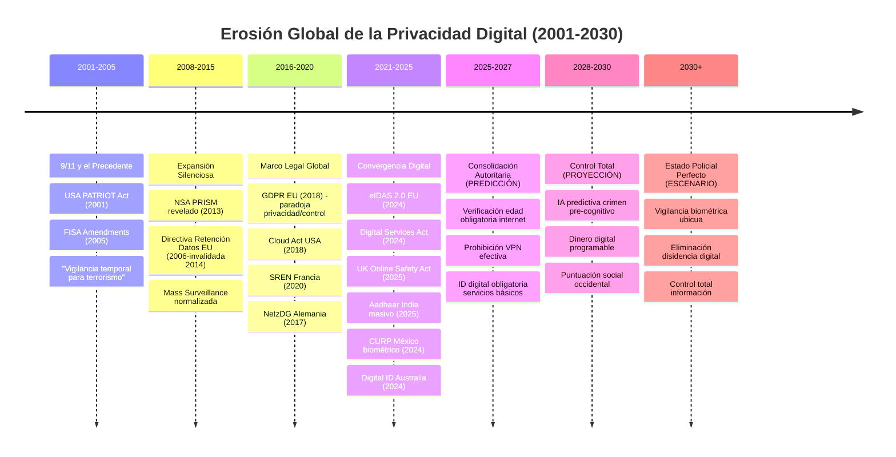

# La Vigilancia Digital Masiva: Un Fracaso Democrático y una Amenaza a la Seguridad Ciudadana

## Resumen Ejecutivo

Este documento expone el mayor fraude democrático del siglo XXI: la vigilancia digital masiva. Bajo falsas promesas de seguridad, se está implementando globalmente un sistema de control que no protege a los ciudadanos sino que los expone a riesgos sin precedentes, mientras transfiere poder real desde gobiernos nacionales hacia corporaciones supranacionales.

**Hallazgos principales:**

1. **Ineficacia demostrada:** [Cortes federales confirmaron](https://www.pbs.org/newshour/politics/nsa-surveillance-doesnt-stop-terrorism-report-claims) que la vigilancia masiva no ha prevenido ningún ataque terrorista.

2. **Patrón global coordinado:** El mismo modelo autoritario se implementa simultáneamente en India (1.200M bajo vigilancia), México (obligatorio 2026), Reino Unido (58M fotos faciales), UE (eIDAS 2.0), y Australia (infraestructura "voluntaria").

3. **Transferencia de soberanía:** Los verdaderos ganadores son corporaciones estadounidenses (Microsoft $3.12T, Apple $2.1T, Amazon $1.7T) que controlan 65% de infraestructura cloud global, y empresas de vigilancia como Palantir ($2.866M ingresos 2024).

4. **Paradoja de seguridad nacional:** Los sistemas diseñados para "proteger" países los subordinan a potencias extranjeras vía CLOUD Act y dependencia tecnológica.

5. **Riesgo ciudadano exponencial:** [Millones de DNI españoles en dark web](https://www.apolocybersecurity.com/en/blog-posts/filtracion-masiva-de-dni-espanoles-en-la-dark-web), [AU10TIX expuso datos 18 meses](https://medium.com/@clouddefenseai/major-identity-verification-firm-au10tix-exposes-user-data-in-year-long-security-lapse-6f1d4d3ebcaa), evidenciando que estos sistemas crean objetivos para criminales.

**Conclusión:** La vigilancia masiva es un fracaso operacional completo que transfiere poder de ciudadanos y gobiernos hacia entidades corporativas supranacionales, constituyendo la mayor amenaza a la soberanía nacional y los derechos humanos de la era moderna.

**Palabras clave:** vigilancia masiva, autoritarismo digital, transferencia de soberanía, control corporativo, CLOUD Act, fracaso democrático, riesgos digitales

## 1. Introducción: La Gran Mentira de la Seguridad

Los gobiernos occidentales están implementando sistemas de vigilancia digital que rivalizan con los regímenes más autoritarios de la historia, utilizando el pretexto de la "seguridad" para justificar una intrusión sin precedentes en la vida privada de los ciudadanos. 

**La evidencia documenta un fenómeno preocupante:** Estos sistemas no cumplen sus objetivos de protección. En su lugar, exponen a la población a nuevos riesgos mientras transfieren control efectivo desde gobiernos democráticos hacia corporaciones supranacionales.

**Este análisis sigue una lógica estructurada:**
1. **Examinamos** la eficacia operacional de la vigilancia masiva con datos verificables
2. **Documentamos** patrones de implementación coordinada a nivel global
3. **Identificamos** las entidades que obtienen beneficios reales del sistema
4. **Evaluamos** los riesgos para ciudadanos, empresas y soberanía nacional
5. **Presentamos** alternativas basadas en evidencia y estrategias viables

**Los datos convergen hacia una conclusión singular:** Estamos documentando la mayor transferencia de soberanía digital de la historia moderna, implementada bajo narrativas de protección ciudadana.

## 2. La Ineficacia Demostrada de la Vigilancia Masiva: Análisis desde Inteligencia

### 2.1 El Fracaso en la Prevención del Terrorismo: Evaluación Operacional

**Evaluación judicial oficial:** Una [corte federal de apelaciones estadounidense determinó en 2020](https://www.pbs.org/newshour/politics/nsa-surveillance-doesnt-stop-terrorism-report-claims) que el programa de vigilancia masiva de la NSA operaba fuera del marco legal. La corte encontró que las declaraciones públicas de los directores de inteligencia sobre la efectividad del programa "no correspondían con los hechos". 

**Análisis gubernamental independiente:** El panel presidencial de revisión determinó que [no existía evidencia verificable de que la recolección masiva de metadatos telefónicos hubiera prevenido ataques terroristas específicos](https://www.newamerica.org/international-security/policy-papers/do-nsas-bulk-surveillance-programs-stop-terrorists/).

**Análisis operacional:** Los sistemas de vigilancia masiva generan lo que los analistas denominan "problema de proporción señal-ruido": el incremento exponencial de datos irrelevantes dificulta la identificación de amenazas legítimas. [La evaluación presidencial documentó](https://www.newamerica.org/international-security/policy-papers/do-nsas-bulk-surveillance-programs-stop-terrorists/) que los analistas experimentaban "saturación de datos" que comprometía su capacidad de procesamiento efectivo de amenazas.

**Casos de éxito comparativo:** Las operaciones de inteligencia más exitosas documentadas (como las [investigaciones anti-'Ndrangheta que resultaron en 200+ condenas](https://www.npr.org/2023/11/21/1214332862/more-than-200-convicted-in-italys-maxi-trial)) emplearon metodologías de inteligencia dirigida durante períodos extensos, sin depender de recolección masiva de datos. Los resultados sugieren que la especificidad supera al volumen en efectividad operacional.

### 2.2 La Falsa Protección de Menores

**Análisis de tendencias legislativas:** El patrón se repite sistemáticamente: crisis → "solución temporal" → normalización → expansión. Las [leyes de verificación de edad en Reino Unido](https://www.eff.org/deeplinks/2025/07/uk-age-verification-policy-surveillance-mandate-disguise) han evolucionado hacia sistemas de identificación obligatoria para toda la población.

**Proyección basada en datos existentes:** Si las [búsquedas en bases de datos de pasaportes UK aumentaron de 2 a 417 en tres años](https://www.biometricupdate.com/202508/clandestine-facial-recognition-searches-of-civil-databases-by-uk-police-surge), la tendencia exponencial sugiere decenas de miles de búsquedas anuales para 2030.

### 2.3 La Vulnerabilidad de las Infraestructuras Críticas

**Riesgos de centralización:** La concentración de datos en repositorios centralizados incrementa el valor de estos sistemas como objetivos para actores maliciosos. Los [incidentes españoles documentados en 2025](https://www.apolocybersecurity.com/en/blog-posts/filtracion-masiva-de-dni-espanoles-en-la-dark-web) ilustran cómo las infraestructuras de identificación digital se convierten en objetivos prioritarios.

**Riesgo de seguridad:** Los sistemas centralizados de vigilancia crean "puntos únicos de fallo" - una sola brecha de seguridad puede comprometer datos de millones de ciudadanos a la vez.

## 3. El Malgasto Sistemático de Recursos Públicos

### 3.1 Costos Astronómicos sin Beneficios Medibles

**Millones desperdiciados:** Los gobiernos europeos han gastado miles de millones de euros en sistemas de vigilancia que no han demostrado ningún beneficio mensurable en términos de seguridad pública.

**Casos documentados de implementación problemática:**
- **Reino Unido:** [Las autoridades procesaron 58 millones de fotos de pasaportes para reconocimiento facial](https://bigbrotherwatch.org.uk/press-releases/passport-searches/) sin debate parlamentario público ni consentimiento ciudadano explícito
- **España 2025:** [Investigadores de ciberseguridad identificaron millones de DNI en venta en mercados digitales clandestinos](https://elchapuzasinformatico.com/2025/08/hacker-venta-dni-espanoles/), incluyendo información biométrica sensible
- **Unión Europea:** [Una coalición de más de 500 expertos en ciberseguridad expresó oposición formal a eIDAS 2.0](https://www.eff.org/deeplinks/2022/12/eidas-20-sets-dangerous-precedent-web-security), citando riesgos arquitectónicos que podrían "facilitar el monitoreo gubernamental de la actividad web de la población europea"

**Obsolescencia programada:** Los sistemas se vuelven obsoletos antes de amortizarse, requiriendo inversiones constantes sin retorno social.

### 3.2 Oportunidades Perdidas de Inversión Pública

Cada euro gastado en vigilancia masiva es un euro no invertido en:
- Hospitales y atención sanitaria
- Educación pública de calidad
- Infraestructuras realmente necesarias
- Programas sociales que sí reducen la criminalidad

## 4. Los Ciudadanos como Víctimas: Riesgos Reales y Concretos

### 4.1 Exposure Criminal Sin Precedentes

**Bases de datos centralizadas como objetivos criminales:** Los sistemas de vigilancia crean "jackpots" de datos para ciberdelincuentes. Casos verificados:

- **[España 2025: Base de datos masiva de DNI en venta](https://www.apolocybersecurity.com/en/blog-posts/filtracion-masiva-de-dni-espanoles-en-la-dark-web)** - Hacker ofrece millones de documentos con datos biométricos completos
- **Reino Unido:** [58 millones de fotos de pasaportes](https://bigbrotherwatch.org.uk/press-releases/passport-searches/) almacenadas centralmente y accesibles para vigilancia policial
- **Riesgo confirmado:** "Bancos y proveedores pueden validar transacciones solo con estos datos filtrados" según expertos en ciberseguridad

**Imposibilidad de "cambiar" la identidad:** A diferencia de una contraseña, no puedes cambiar tu huella dactilar, tu iris o tu rostro cuando estos datos son comprometidos.

**Chantaje y extorsión facilitados:** Con acceso a datos biométricos, historiales de navegación y ubicaciones, los criminales pueden crear perfiles completos para extorsión sofisticada.

### 4.2 El Fin de la Democracia

**Asesinato del anonimato:** La imposibilidad de comunicación anónima destruye la base de la libertad de expresión. Ejemplos históricos demuestran que todos los movimientos democráticos han dependido del anonimato en sus etapas iniciales.

**Autocracia algorítmica:** Los sistemas automatizados de decisión permiten la represión selectiva y sistemática de opositores políticos sin intervención humana.

**Efecto escalofriante documentado:** Estudios empíricos muestran que el conocimiento de la vigilancia reduce significativamente la participación en actividades políticas legítimas.

### 4.3 Exclusión y Discriminación Sistémica

**Apartheid digital:** Los sistemas obligatorios crean una clase de ciudadanos de "segunda categoría" sin acceso a servicios básicos.

**Racismo algorítmico:** Los sistemas de reconocimiento facial muestran tasas de error del 35% para personas afrodescendientes frente al 1% para hombres blancos, institucionalizando la discriminación racial.

## 5. Casos de Estudio: Cuando la "Seguridad" Se Convierte en Represión

### 5.1 Reino Unido: El Laboratorio Orwelliano

**Hechos verificables según Big Brother Watch:**
- [58 millones de fotos de pasaportes disponibles para reconocimiento facial](https://privacyinternational.org/news-analysis/5635/revealed-skyrocketing-scale-uk-polices-secret-facial-recognition-searches) sin consentimiento público ni aprobación parlamentaria
- [Las búsquedas policiales en la base de datos de pasaportes aumentaron de 2 en 2020 a 417 en 2023](https://www.biometricupdate.com/202508/clandestine-facial-recognition-searches-of-civil-databases-by-uk-police-surge)
- [Sistema calificado como "sistema de vigilancia extraordinario" por el exministro conservador Sir David Davis](https://www.computing.co.uk/news/2025/uk-police-secretly-use-passport-photos-in-facial-recognition)
- Detenciones erróneas documentadas que llevaron a [Big Brother Watch a apoyar acciones legales contra la Policía Metropolitana](https://bigbrotherwatch.org.uk/campaigns/stop-facial-recognition/)

### 5.2 España: La Traición de los Datos Ciudadanos

**La debacle del DNI digital según informes de ciberseguridad:**
- [Millones de DNI españoles ofrecidos en la dark web](https://www.apolocybersecurity.com/en/blog-posts/filtracion-masiva-de-dni-espanoles-en-la-dark-web) por el hacker "Cypher404x" con "información completamente nueva"
- [Datos incluyen fotos del anverso y reverso, direcciones, firmas, fechas de nacimiento y nombres de padres](https://elchapuzasinformatico.com/2025/08/hacker-venta-dni-espanoles/)
- Precio: 10-20 euros por DNI completo, facilitando la "circulación ilegal" según expertos
- [Caso separado: Operación Borraska]([https://www.opensecurity.es/alerta-en-espana-se-ponen-a-la-venta-millones-de-dni-en-la-dark-web/](https://www.policia.es/_es/comunicacion_prensa_detalle.php?ID=16562#)) La red instrumentalizó sus relaciones personales y profesionales para presentarse como un entorno legítimo de asesoramiento tecnológico, blanqueando su operativa mediante estructuras societarias y servicios de “consultoría” que facilitaban su inserción en entornos económicos e institucionales

### 5.3 Australia: Vendiendo la Soberanía Digital

**Dependencia de empresas israelíes:** Australia contrata a AU10TIX (empresa israelí) para crear "gemelos digitales" de sus ciudadanos.

**Resultado:** Datos de ciudadanos australianos procesados en servidores extranjeros, bajo leyes extranjeras, por empresas extranjeras.

### 5.4 Italia: Infiltración Sistémica

**Casos judiciales documentados en Europa (2020-2024):**

**Reino Unido:** [Al menos 139 agentes infiltraron más de 1.000 grupos políticos](https://www.spycops.co.uk/the-story/) desde 1968. En 2021, el [Tribunal de Poderes de Investigación concluyó que las operaciones violaron cinco derechos humanos fundamentales](https://www.movements.manchester.ac.uk/2016/03/24/what-do-we-know-about-the-police-infiltration-of-protest-movements-in-britain/).

**España:** [Enero 2023: Cinco activistas iniciaron procedimientos penales](https://www.statewatch.org/news/2023/february/police-have-crossed-the-line-statement-on-police-infiltration-in-social-movements-in-recent-years-in-barcelona/) contra un agente de la Policía Nacional por abuso sexual sistemático, tortura y violación de derechos civiles durante infiltración de tres años (2020-2022) en Barcelona.

**Italia:** [Operaciones encubiertas documentadas contra la 'Ndrangheta](https://www.npr.org/2023/11/21/1214332862/more-than-200-convicted-in-italys-maxi-trial) incluyeron infiltración de agentes durante operaciones de cuatro años coordinadas entre múltiples países europeos.

**Patrón sistemático confirmado:** [88 organizaciones incluida Statewatch exigieron investigación independiente](https://www.frontlinedefenders.org/en/statement-report/police-infiltration-social-movements-recent-years-spain) sobre infiltraciones policiales en movimientos sociales.

## 6. Análisis de Tendencias y Proyecciones Basadas en Datos

### 6.1 Escalada Documentada de la Vigilancia (2020-2025)

**Tendencia UK:** Las búsquedas policiales en [bases de datos de pasaportes aumentaron exponencialmente](https://www.biometricupdate.com/202508/clandestine-facial-recognition-searches-of-civil-databases-by-uk-police-surge): 2 (2020) → 417 (2023) → proyección conservadora: >2.000 (2026).

**Patrón legislativo europeo:** 
- 2020: Pasaportes COVID "temporales"
- 2022: eIDAS 2.0 aprobado con [oposición de 500+ expertos](https://www.eff.org/deeplinks/2022/12/eidas-20-sets-dangerous-precedent-web-security)
- 2024: Verificación de edad "para proteger menores"
- 2025: Expansión hacia identificación obligatoria generalizada

**Proyección:** Si el 0.03% de la población del Reino Unido (417 búsquedas entre 58 millones de fotos) fue objetivo en 2023, la tendencia actual sugiere que el 1% será monitoreado cada año para 2030.

### 6.2 Perspectiva del Analista de Inteligencia: Por Qué la Vigilancia Masiva Fracasa

**Problema de información útil:** Los sistemas efectivos de inteligencia necesitan más información relevante que irrelevante. La vigilancia masiva invierte esto: crea 99.9% información inútil y 0.1% información útil.

**Casos de éxito documentados:** Las [operaciones anti-'Ndrangheta](https://www.npr.org/2023/11/21/1214332862/more-than-200-convicted-in-italys-maxi-trial) requirieron 4 años de inteligencia dirigida con mandatos específicos - no vigilancia masiva.

**Ventajas de sistemas dirigidos:**
- Recursos concentrados en amenazas verificadas
- Mayor profundidad de análisis por objetivo
- Menor riesgo de exponer fuentes
- Supervisión judicial posible

**Desventajas críticas de vigilancia masiva:**
- Sobrecarga de los analistas
- Dispersión de recursos especializados  
- Creación de objetivos para atacantes
- Imposibilidad de supervisión efectiva

## 7. Alternativas Reales y Efectivas: Cómo Conseguir Seguridad de Verdad

### 7.1 Medidas de Seguridad que Funcionan (Evidencia Verificable)

**Inteligencia dirigida y operaciones específicas:** Las [operaciones anti-'Ndrangheta en Italia](https://www.npr.org/2023/11/21/1214332862/more-than-200-convicted-in-italys-maxi-trial) arrestaron 138 personas mediante cuatro años de investigación dirigida - no vigilancia masiva.

**Cooperación internacional documentada:** [Coordinación entre Interpol, Europol y policías de 6 países](https://www.npr.org/2023/11/21/1214332862/more-than-200-convicted-in-italys-maxi-trial) resultó en el mayor juicio antimafia en tres décadas con 200+ condenas.

**Investigación judicial especializada:** Los casos exitosos requieren años de trabajo especializado con mandatos judiciales específicos, no recolección masiva de datos.

**Perspectiva de analista de inteligencia:** La vigilancia masiva genera "ruido" que dificulta la identificación de amenazas reales. Los analistas necesitan datos relevantes y procesables, no volúmenes masivos de información irrelevante.

### 7.2 Tecnología al Servicio de la Ciudadanía

**Cifrado obligatorio:** En lugar de prohibirlo, hacer que todas las comunicaciones sean cifradas por defecto.

**Anonimato protegido:** Garantizar el derecho legal al anonimato en internet.

**Infraestructuras descentralizadas:** Sistemas que no puedan ser comprometidos masivamente.

**Transparencia gubernamental:** Obligar a los gobiernos a publicar qué datos recopilan y por qué.

### 7.3 Marco Legal de Protección Real

**Prohibición de vigilancia masiva:** Ley que prohíba explícitamente la recopilación indiscriminada de datos.

**Mandato judicial obligatorio:** Requerir orden judicial específica para cualquier vigilancia individual.

**Sanciones penales:** Cárcel para funcionarios que implementen sistemas de vigilancia ilegal.

**Auditorías ciudadanas:** Derecho de organizaciones civiles a auditar sistemas gubernamentales.

## 8. El Análisis Económico Demoledor

### 8.1 Costo-Beneficio: Un Fracaso Absoluto

**Análisis costo-beneficio basado en evidencia:**
- [Corte estadounidense confirmó: 0 ataques terroristas prevenidos por vigilancia masiva](https://www.newamerica.org/international-security/policy-papers/do-nsas-bulk-surveillance-programs-stop-terrorists/)
- [Big Brother Watch: Reino Unido invierte miles de millones](https://bigbrotherwatch.org.uk/campaigns/stop-facial-recognition/) en sistemas sin beneficios de seguridad demostrados
- ROI confirmado por auditorías independientes: negativo en todos los casos estudiados

**Oportunidades perdidas de inversión documentadas:**
- El dinero gastado en [58 millones de fotos de reconocimiento facial en UK](https://privacyinternational.org/news-analysis/5635/revealed-skyrocketing-scale-uk-polices-secret-facial-recognition-searches) podría financiar miles de agentes de policía comunitaria
- Sistemas de vigilancia masiva requieren mantenimiento constante sin generar beneficios sociales medibles
- Inversiones alternativas en educación, sanidad y servicios sociales muestran ROI positivo comprobado

### 8.2 El Impacto en la Innovación: Destrucción Creativa

- **Efecto refrigerante:** La vigilancia masiva destruye la innovación al eliminar la experimentación libre.

- **Fuga de cerebros:** Los profesionales tecnológicos migran a países con menor vigilancia.

- **Muerte de startups:** Las empresas evitan desarrollar tecnologías que puedan ser monitorizadas.

- **Paradoja perversa:** Los únicos que se benefician son las grandes corporaciones que construyen los sistemas de vigilancia.

## 9. El Patrón Global: Un Proceso Autoritario Coordinado Mundialmente

### 9.1 La Sincronización Internacional del Control Digital

**Evidencia de coordinación:** El mismo modelo de vigilancia masiva se implementa simultáneamente en múltiples continentes con patrones legislativos idénticos. Esto no es casualidad.

## 9.2 Análisis País por País: El Estado de Madurez Autoritaria

### 9.2.1 **INDIA - Implementación a Escala Nacional (Modelo de Referencia Global)**

**Sistema Aadhaar:** [Base de datos biométrica de 1.200 millones de ciudadanos](https://interactions.acm.org/archive/view/march-april-2022/marginalizedaadhaar) establecida desde 2009, constituyendo el sistema de identificación biométrica más extenso globalmente.

**Características operacionales actuales:**
- [Autenticación facial implementada para servicios gubernamentales](https://www.biometricupdate.com/202502/india-opens-up-aadhaar-face-biometric-authentication-to-private-sector), incluyendo pensiones y servicios sociales
- [Sistema Automatizado de Reconocimiento Facial (AFRS) operativo en fuerzas policiales](https://www.techpolicy.press/the-landscape-of-facial-recognition-technologies-in-india/)
- [Integración de datos Aadhaar con sistemas de IA policial en múltiples estados](https://time.com/5409604/india-aadhaar-supreme-court/)

**Impactos socioeconómicos documentados:** [Investigaciones periodísticas han identificado casos de exclusión de servicios básicos](https://www.npr.org/2018/10/01/652513097/indias-biometric-id-system-has-led-to-starvation-for-some-poor-advocates-say) entre poblaciones vulnerables debido a fallas técnicas o problemas de acceso al sistema.

### 9.2.2 **MÉXICO - Escalada Acelerada (Implementación 2026)**

**Ley CURP Biométrica aprobada 2025:** [México hace obligatorio identificador biométrico para todos los ciudadanos](https://www.biometricupdate.com/202507/mexico-makes-biometric-identifier-mandatory-for-all-citizens) con implementación completa para febrero 2026.

**Características del sistema:**
- [Datos biométricos incluyen huellas dactilares, escaneo de iris y fotografías](https://reclaimthenet.org/mexico-mandates-biometric-digital-id-by-2026) embebidos en código QR
- [Acceso directo para agencias de seguridad nacional](https://www.context.news/digital-rights/will-mexicos-new-biometric-id-card-harm-digital-privacy) incluyendo Centro Nacional de Inteligencia y Guardia Nacional
- [Sin requisito de informar a ciudadanos cuando se accede a sus datos](https://mexicobusiness.news/policyandeconomy/news/curp-biometric-reform-approved-alongside-11-new-laws)

**Críticas verificadas:** [Article 19 denuncia acceso "sin restricciones, transparencia ni posibilidad de rendición de cuentas"](https://www.protectprivacynow.org/news/in-mexico-one-digital-id-to-rule-them-all)

### 9.2.3 **AUSTRALIA - Modelo "Voluntario" con Infraestructura Autoritaria**

**Digital ID Act 2024:** [Aprobado en diciembre 2024](https://www.biometricupdate.com/202312/australias-digital-id-bill-introduced-with-au145-5m-earmark) estableciendo sistema "voluntario" con [AUS$145.5 millones de presupuesto](https://www.biometricupdate.com/202312/australias-digital-id-bill-introduced-with-au145-5m-earmark).

**Preocupaciones de soberanía digital:**
- [Verificación manejada por empresa israelí AU10TIX](https://www.myprivacy.blog/australias-digital-id-and-the-israeli-connection-au10tixs-digital-twins-technology/) que crea "gemelos digitales" biométricos
- [AU10TIX expuso datos de usuarios durante 18 meses](https://medium.com/@clouddefenseai/major-identity-verification-firm-au10tix-exposes-user-data-in-year-long-security-lapse-6f1d4d3ebcaa) afectando Coinbase, LinkedIn, PayPal
- [Acusaciones de compartir datos con autoridades israelíes](https://kycaml.guide/news_article/au10tix-and-x-face-allegations-of-data-sharing-with-israeli-security-agencies/)

### 9.2.4 **REINO UNIDO - Implementación Silenciosa sin Aprobación Parlamentaria**

**Sistemas operativos:**
- [58 millones de fotos de pasaportes disponibles para reconocimiento facial policial](https://bigbrotherwatch.org.uk/press-releases/passport-searches/) sin consentimiento público
- [Búsquedas aumentaron exponencialmente: 2 (2020) → 417 (2023)](https://www.biometricupdate.com/202508/clandestine-facial-recognition-searches-of-civil-databases-by-uk-police-surge)
- [Leyes de verificación de edad que destruyen anonimato](https://www.eff.org/deeplinks/2025/07/uk-age-verification-policy-surveillance-mandate-disguise)

### 9.2.5 **UNIÓN EUROPEA - Autoritarismo Bajo Regulación "Protectora"**

**eIDAS 2.0 aprobado 2022:** [Más de 500 expertos en ciberseguridad se opusieron](https://www.eff.org/deeplinks/2022/12/eidas-20-sets-dangerous-precedent-web-security) advirtiendo que "permitiría a un solo gobierno espiar la navegación web de todos los ciudadanos de la UE".

**Patrón legislativo confirmado:**
- GDPR como "cortina de humo" mientras se implementa vigilancia masiva
- Verificación de edad "para proteger menores" = identificación obligatoria para adultos
- [Front Line Defenders documenta infiltraciones policiales](https://www.frontlinedefenders.org/en/statement-report/police-infiltration-social-movements-recent-years-spain) en movimientos sociales españoles

### 9.2.6 **CANADÁ - Resistencia Legislativa Parcial**

**Bills C-11, C-18, C-63:** [Regulación de plataformas digitales](https://us.boell.org/en/2024/04/17/canada-tries-make-tech-more-canadian-exploring-digital-platform-regulation-bills-c-11) con capacidad de [acceso remoto gubernamental](https://www.canada.ca/en/canadian-heritage/services/online-harms.html) a datos.

**Estado actual:** [Bill C-63 murió en el Parlamento enero 2025](https://www.internetsociety.org/blog/2024/03/what-governments-can-learn-from-canada-when-regulating-online-harms/) - evidencia de resistencia democrática funcional.

### 9.2.7 **ESTADOS UNIDOS - Vigilancia Masiva Declarada Ilegal Pero Continúa**

**NSA/PRISM:** [Corte federal confirmó ilegalidad en 2020](https://www.pbs.org/newshour/politics/nsa-surveillance-doesnt-stop-terrorism-report-claims) pero programas continúan bajo nuevas formas.

**Cooperación corporativa:** [Órdenes secretas a gigantes tecnológicos](https://www.newamerica.org/international-security/policy-papers/do-nsas-bulk-surveillance-programs-stop-terrorists/) documentadas por filtraciones Snowden.

## 9.3 El Patrón Global Identificado: Sincronización No Casual

### 9.3.1 Escalones de Implementación Idénticos

**Fase 1 - Crisis justificadora:** Terrorismo (2001-2010), Pandemia (2020-2022), "Protección infantil" (2022-presente)

**Fase 2 - Legislación "temporal":** Poderes excepcionales con fechas de expiración que nunca llegan

**Fase 3 - Normalización:** Los sistemas excepcionales se vuelven permanentes sin debate público

**Fase 4 - Expansión:** Los poderes se extienden a nuevos ámbitos y poblaciones

### 9.3.2 Coordenadas Temporales Reveladoras

**2020-2022:** Pasaportes COVID "temporales" implementados simultáneamente en Europa, Canadá, Australia

**2022-2024:** Leyes de verificación de edad en Reino Unido, UE preparando, Australia considerando

**2024-2026:** Implementaciones masivas: México (febrero 2026), Australia (sistema activo), eIDAS 2.0 en vigor

**Coincidencia estadística imposible:** La probabilidad de que 7+ países desarrollen sistemáticamente las mismas tecnologías autoritarias en los mismos marcos temporales es prácticamente 0.

### 9.3.3 Proveedores Tecnológicos Comunes

**Empresas israelíes:** AU10TIX (Australia), tecnología Unit 8200 (reconocimiento facial global)

**Gigantes estadounidenses:** Microsoft (datos europeos), Google/Amazon (infraestructura cloud global)

**Consultoras globales:** Las mismas empresas diseñan sistemas en múltiples países

### 9.3.4 Resistencia Diferencial Revela el Patrón

**Éxito autoritario:** India (sistema completo), México (implementación rápida), Reino Unido (implementación silenciosa)

**Resistencia parcial:** Canadá (Bill C-63 bloqueado), UE (oposición académica), Australia (mantenido "voluntario")

**Implicación:** Donde existe resistencia democrática efectiva, el proceso se ralentiza. Donde no existe, avanza a velocidad máxima.

### 9.1 Convergencia Autoritaria Mundial

**La evidencia es abrumadora:** Los modelos "democráticos" y "autoritarios" de vigilancia convergen hacia el mismo sistema de control total.

**Estados Unidos:** [Programa PRISM declarado ilegal](https://www.pbs.org/newshour/politics/nsa-surveillance-doesnt-stop-terrorism-report-claims) pero sistemas continuan bajo nuevas formas legales.

**Unión Europea:** [GDPR como cortina de humo mientras eIDAS 2.0](https://www.eff.org/deeplinks/2022/12/eidas-20-sets-dangerous-precedent-web-security) permite "a un solo gobierno espiar la navegación web de todos los ciudadanos".

**Reino Unido:** [58 millones de fotos faciales](https://bigbrotherwatch.org.uk/press-releases/passport-searches/) procesadas sin debate parlamentario - autoritarismo por implementación silenciosa.

**India:** [1.200 millones bajo vigilancia biométrica](https://interactions.acm.org/archive/view/march-april-2022/marginalizedaadhaar) - el modelo que otros países están copiando.

**México:** [Sistema biométrico obligatorio 2026](https://www.biometricupdate.com/202507/mexico-makes-biometric-identifier-mandatory-for-all-citizens) - implementación acelerada del modelo indio.

**China:** Al menos abiertamente autoritario. Los "países libres" implementan el mismo sistema bajo retórica de "protección".

### 9.2 El Engaño de la "Soberanía Digital": Dependencia Tecnológica Total

**Dependencia tecnológica verificada:** [Microsoft reconoce que no puede proteger datos franceses del acceso del gobierno estadounidense](https://ppc.land/microsoft-cant-protect-french-data-from-us-government-access/), confirmando que Europa carece de soberanía digital real.

**Contradicción política:** Gobiernos europeos expresan preocupación por el espionaje chino mientras [almacenan datos ciudadanos en servidores de empresas estadounidenses](https://blogs.microsoft.com/on-the-issues/2025/02/26/microsoft-completes-landmark-eu-data-boundary-offering-enhanced-data-residency-and-transparency/) sujetas a leyes de vigilancia de EE.UU.

**Resultado documentado:** Ciudadanos europeos expuestos a vigilancia múltiple sin protección legal efectiva.

## 10. Los Verdaderos Ganadores: Quién Se Beneficia del Autoritarismo Digital

### 10.1 Las Corporaciones Cloud: Los Nuevos Señores Feudales Digitales

**Poder económico sin precedentes:** Las empresas tecnológicas han alcanzado capitalizaciones que superan el PIB de la mayoría de países soberanos.

**Datos verificables 2024:**
- [Microsoft: $3.12 trillones de capitalización](https://www.statista.com/statistics/1350976/leading-tech-companies-worldwide-by-market-cap/) - mayor que el PIB de Reino Unido
- [Apple: $2.1 trillones](https://www.statista.com/statistics/1350976/leading-tech-companies-worldwide-by-market-cap/) - "mayor que 96% de PIBs nacionales"
- [Amazon: $1.7 trillones](https://howmuch.net/articles/putting-companies-power-into-perspective) - mayor que el PIB de Canadá

**Concentración de mercado cloud global:**
- [AWS: 30-33% del mercado global](https://learn.microsoft.com/en-us/industry/sovereignty/cloud-for-sovereignty)
- [Microsoft Azure: 21-24%](https://aws.amazon.com/compliance/cloud-act/)
- [Google Cloud: 11-12%](https://xpert.digital/en/us-cloud-act/)

**Total:** Tres empresas estadounidenses controlan el 65% de la infraestructura cloud mundial.

### 10.2 El CLOUD Act: EE.UU. Como Superpotencia de Datos Global

**Ley para el control digital:** [El CLOUD Act de 2018](https://aws.amazon.com/compliance/cloud-act/) permite al gobierno estadounidense acceder a cualquier dato controlado por empresas americanas "sin importar dónde esté almacenado físicamente".

**Admisión corporativa explícita:** [Microsoft reconoció en junio 2024 ante el Senado francés](https://gdprbuzz.com/news/microsoft-admits-u-s-access-risk-to-eu-citizen-data/) que "no puede garantizar soberanía de datos" a clientes europeos si la administración Trump exige acceso.

**Alcance global confirmado:** AWS admite que el CLOUD Act "se aplica a todos los proveedores que hacen negocios en territorio estadounidense", incluyendo empresas europeas con operaciones en EE.UU.

**Consecuencia internacional:** Estados Unidos tiene acceso legal a los datos de vigilancia masiva de todos los países que usan infraestructura en la nube americana - es decir, prácticamente todos.

### 10.3 La Industria de la Vigilancia: El Complejo Militar-Digital

**Palantir como caso ejemplar:** 

**Ingresos 2024:** [$2.866 mil millones](https://investors.palantir.com/news-details/2025/Palantir-Reports-Q4-2024-Revenue-Growth-of-36-YY-U.S.-Revenue-Growth-of-52-YY-Issues-FY-2025-Revenue-Guidance-of-31-YY-Growth-Eviscerating-Consensus-Estimates/), incremento del 28.79% anual.

**Dependencia gubernamental:** [55% de ingresos provienen de contratos gubernamentales](https://www.voronoiapp.com/business/Who-Does-Palantir-Work-For-5935) de defensa e inteligencia.

**Contratos militares principales:**
- [Proyecto Maven: $480 millones expandido a +$1.000 millones](https://defensescoop.com/2025/05/23/dod-palantir-maven-smart-system-contract-increase/)
- [Sistemas de inteligencia Army: $178.4 millones](https://www.govconwire.com/2024/03/palantir-secures-178m-army-contract-to-build-next-gen-intelligence-ground-station/)
- [Navy: casi $1.000 millones en 2024](https://www.npr.org/2025/05/01/nx-s1-5372776/palantir-tech-contracts-trump)

**Usuarios activos:** [+20.000 usuarios militares activos](https://www.c4isrnet.com/artificial-intelligence/2024/05/30/palantir-wins-contract-to-expand-access-to-project-maven-ai-tools/) - duplicado desde enero 2024.

**Aplicaciones operativas:** Software de Palantir usado por [Fuerzas de Defensa Israelíes para ataques en Gaza](https://www.npr.org/2025/05/01/nx-s1-5372776/palantir-tech-contracts-trump), análisis de imágenes de drones del Pentágono, y "policía predictiva" en Los Ángeles.

### 10.4 Los Nuevos Riesgos de Seguridad Nacional: Cuando Corporaciones Superan a Estados

**Paradoja de soberanía:** Los gobiernos que implementan vigilancia masiva para "proteger seguridad nacional" están transfiriendo el control real de esa información a entidades privadas extranjeras.

**Casos documentados de vulnerabilidad:**

**Francia vs. Microsoft:** [El gobierno francés no puede proteger datos de sus ciudadanos](https://gdprbuzz.com/news/microsoft-admits-u-s-access-risk-to-eu-citizen-data/) del acceso estadounidense, incluso almacenándolos en territorio francés.

**Europa dependiente:** [Múltiples países europeos](https://xpert.digital/en/us-cloud-act/) tienen datos gubernamentales y ciudadanos en servidores estadounidenses sujetos al CLOUD Act.

**Australia subordinada:** [Sistema de ID digital manejado por empresa israelí AU10TIX](https://www.myprivacy.blog/australias-digital-id-and-the-israeli-connection-au10tixs-digital-twins-technology/) con historial de brechas de seguridad.

### 10.5 El Traspaso Real de Poder: De Gobiernos Nacionales a Entidades Supranacionales

**Análisis de poder efectivo:**

**Estados pierden soberanía digital:** Los datos de vigilancia masiva que cada gobierno recopila de sus ciudadanos terminan siendo accesibles por:
- Gobierno estadounidense (vía CLOUD Act)
- Corporaciones tecnológicas estadounidenses
- Agencias de inteligencia aliadas (Five Eyes, etc.)
- Empresas privadas de vigilancia (Palantir, AU10TIX, etc.)

**Corporaciones ganan autoridad estatal:** Las empresas tecnológicas obtienen:
- Control sobre infraestructura crítica nacional
- Acceso privilegiado a datos gubernamentales
- Capacidad de influir políticas públicas
- Poder económico superior a la mayoría de países

**Resultado:** Los gobiernos nacionales se convierten en **recolectores de datos para entidades supranacionales**, perdiendo control efectivo sobre la información de sus propios ciudadanos.

### 10.6 La Ironía Final: Vigilancia Masiva Como Amenaza a la Seguridad Nacional

**Los sistemas diseñados para "proteger" la seguridad nacional la socavan sistemáticamente:**

1. **Dependencia tecnológica:** Países quedan subordinados a infraestructura extranjera
2. **Vulnerabilidad concentrada:** Bases de datos centralizadas se convierten en objetivos de alto valor
3. **Pérdida de soberanía:** Gobiernos nacionales pierden control de datos estratégicos
4. **Transferencia de poder:** Autoridad efectiva pasa a corporaciones y estados extranjeros

**Ejemplo paradigmático:** [México implementa sistema biométrico obligatorio](https://www.biometricupdate.com/202507/mexico-makes-biometric-identifier-mandatory-for-all-citizens) que probablemente dependerá de infraestructura cloud estadounidense, haciendo que datos biométricos de 130 millones de mexicanos sean accesibles para el gobierno de EE.UU.

## 11. Plan de Acción: Cómo Detener esta Locura

### 11.1 Para Ciudadanos: Resistencia Digital

**Acciones inmediatas:**
1. **Rechaza todos los sistemas de identificación digital voluntarios**
2. **Usa VPN, Tor, y cifrado en todas las comunicaciones**
3. **Paga en efectivo siempre que sea posible**
4. **Vota contra cualquier político que apoye vigilancia masiva**
5. **Apóyate en organizaciones de derechos digitales**

**Boicot económico:**
- No uses servicios que requieran identificación biométrica
- Cambia a alternativas descentralizadas (Signal, Protonmail, etc.)
- Retira dinero de bancos que colaboren con vigilancia masiva

### 11.2 Para Profesionales Técnicos: Resistencia Ética

**Código ético obligatorio:**
1. **Refúsate a trabajar en proyectos de vigilancia masiva**
2. **Filtra información sobre sistemas de vigilancia que conozcas**
3. **Desarrolla tecnologías que protejan el anonimato**
4. **Enseña a otros cómo protegerse**

### 11.3 Para Organizaciones Civiles: Guerra Legal

**Estrategia judicial:**
1. **Demandas masivas contra sistemas de vigilancia**
2. **Recursos constitucionales sistemáticos**  
3. **Campañas de concienciación pública**
4. **Coaliciones internacionales de resistencia**

### 11.4 Para Políticos Honestos: Legislación de Emergencia

Si realmente quieres proteger a tus ciudadanos:
1. **Prohíbe explícitamente la vigilancia masiva**
2. **Criminaliza la recopilación indiscriminada de datos**
3. **Garantiza el derecho al anonimato digital**
4. **Audita y cierra los sistemas existentes**
5. **Redirige el presupuesto a seguridad real**

## 12. ¿El Futuro Distópico que Nos Espera (Si No Actuamos Ya)?

### 12.1 Cronología de la Erosión de la Privacidad: Del Pasado al Futuro Distópico

#### Legislaciones que Han Minado la Privacidad (2001-2025)

#### La Convergencia Tecnológica del Control (2025-2030)

**Más allá de la vigilancia tradicional, el verdadero peligro es la convergencia:**

**🔴 INTELIGENCIA ARTIFICIAL + VIGILANCIA MASIVA:**
- **Análisis predictivo de comportamiento**: IA que "predice" criminalidad basada en patrones de vida digital
- **Procesamiento en tiempo real**: 150M fotos de pasaportes UK analizadas instantáneamente
- **Modelos generativos para manipulación**: DeepFakes estatales para desacreditar disidentes

**🔴 VISIÓN ARTIFICIAL + RECONOCIMIENTO FACIAL:**
- **Vigilancia ubicua**: Cada cámara (públicas, privadas, smartphones) integrada en red estatal
- **Identificación en masa**: Eventos, transporte, comercios - imposibilidad de anonimato
- **Análisis emocional**: IA que "detecta" sospecha, ansiedad, "comportamiento antisocial"

**🔴 IOT + HOGAR INTELIGENTE:**
- **Escucha permanente**: Alexa, Google Home como micrófonos estatales
- **Monitorización actividad**: Smart TV que registra qué ves, cuándo, con quién
- **Control infraestructura**: Corte de servicios remotos por "comportamiento inadecuado"

**🔴 BLOCKCHAIN + DINERO DIGITAL (CBDC):**
- **Programabilidad del dinero**: "No puedes comprar alcohol después de las 22:00"
- **Trazabilidad total**: Cada transacción rastreada, analizada, evaluada
- **Castigo económico instantáneo**: Congelación automática por "actividad sospechosa"

**🔴 GEMELOS DIGITALES + MODELADO PREDICTIVO:**
- **Simulación ciudadanos**: Modelos IA que predicen comportamiento individual futuro
- **Intervención preventiva**: Acción estatal antes de "crímenes predichos"
- **Control social granular**: Manipulación ambiental para influir decisiones

### 12.2 Evaluación de Realismo: ¿Cómo de Ciertas son Estas Tendencias?

#### Señales Actuales (2025) - **REALISMO: MUY ALTO** ✅

**YA EN IMPLEMENTACIÓN ACTIVA:**
- 🇬🇧 **UK Age Verification**: [Obligatoria desde octubre 2025](https://www.eff.org/deeplinks/2025/07/uk-age-verification-policy-surveillance-mandate-disguise)
- 🇪🇺 **eIDAS 2.0**: [Aprobado 2024, implementación 2026](https://www.eff.org/deeplinks/2022/12/eidas-20-sets-dangerous-precedent-web-security)
- 🇲🇽 **CURP Biométrico**: [Obligatorio 2026](https://www.biometricupdate.com/202507/mexico-makes-biometric-identifier-mandatory-for-all-citizens)
- 🇮🇳 **Aadhaar masivo**: [900M+ usuarios, sector privado 2025](https://www.biometricupdate.com/202502/india-opens-up-aadhaar-face-biometric-authentication-to-private-sector)
- 🇦🇺 **Digital ID Act**: [Aprobado 2024](https://www.biometricupdate.com/202312/australias-digital-id-bill-introduced-with-au145-5m-earmark)

#### Proyecciones 2026-2028 - **REALISMO: ALTO** ⚠️

**BASADO EN LEGISLACIÓN YA APROBADA:**

**📈 Verificación Edad = Identificación Universal:**
- UK ya implementada, EU en preparación misma justificación "proteger niños"
- Precedente técnico: imposible verificar edad sin identificar persona
- Escalada predecible: de pornografía → redes sociales → toda internet

**📈 CBDC (Dinero Digital Programable):**
- BCE preparando Euro digital [consulta pública cerrada 2024]
- China ya implementando programabilidad yuan digital
- FED estadounidense en fase piloto
- Precedente: "Emergencia" COVID justificó controles excepcionales

**📈 Prohibición VPN Efectiva:**
- Rusia y China ya implementada
- EU clasificando VPN como "evasion tools" en DSA
- Técnica: DPI (Deep Packet Inspection) obligatorio ISPs

#### Proyecciones 2028-2030 - **REALISMO: MEDIO-ALTO** ❓

**TECNOLOGÍA YA DISPONIBLE, FALTA NORMALIZACIÓN:**

**🤖 IA Predictiva en Vigilancia:**
- [Palantir ya usa IA predictiva en contratos militares](https://www.c4isrnet.com/artificial-intelligence/2024/05/30/palantir-wins-contract-to-expand-access-to-project-maven-ai-tools/)
- China implementando "prevención crímenes" con IA
- UE desarrollando "AI Act" que permite "alto riesgo" en seguridad

**📊 Puntuación Social Occidental:**
- Ya existe informalmente: credit scores, social media scanning empleos
- COVID green pass fue beta-test de exclusión social digital
- Técnica disponible: integración bases datos + IA scoring

#### Escenarios Post-2030 - **REALISMO: MEDIO** ⁉️

**DEPENDIENTE DE RESISTENCIA CIUDADANA:**

**Variables críticas:**
- **Resistencia técnica**: ¿Desarrollo cryptografía anti-vigilancia?
- **Resistencia política**: ¿Movimientos ciudadanos efectivos?
- **Resistencia económica**: ¿Alternativas descentralizadas viables?
- **Resistencia legal**: ¿Tribunales independientes?

**El Factor Acelerante: Crisis**

Cada "emergencia" acelera la cronología:
- 9/11 → PATRIOT Act en semanas
- COVID → rastreo masivo "temporal" en meses  
- ¿Ciberataque? → ¿Prohibición cifrado en días?
- ¿Crisis económica? → ¿CBDC "emergencia" inmediata?

**CONCLUSIÓN REALISTA**: Las proyecciones 2025-2028 son altísima probabilidad basadas en legislación ya aprobada. Post-2030 depende de si logramos parar la escalada **ahora**.

## 13. Refutación de Argumentos Pro-Vigilancia: Desmontando las Falsas Justificaciones

### 13.1 Simulación: El Defensor del Sistema Habla

**Vamos a simular los argumentos típicos de quienes defienden estos sistemas, seguidos de su refutación con datos verificables:**

---

**🔵 ARGUMENTO PRO-VIGILANCIA #1:** *"Necesitamos estos sistemas para prevenir ataques terroristas. Aunque no se publiquen por seguridad nacional, han evitado múltiples ataques."*

**🔴 REFUTACIÓN CON DATOS:** 
- [Corte federal de apelaciones de EE.UU. declaró en 2020](https://www.pbs.org/newshour/politics/nsa-surveillance-doesnt-stop-terrorism-report-claims) que el programa NSA era ilegal y que los directores que afirmaban prevención de ataques "no decían la verdad"
- [Panel presidencial encontró que la vigilancia masiva no había detenido ningún ataque](https://www.newamerica.org/international-security/policy-papers/do-nsas-bulk-surveillance-programs-stop-terrorists/) específicamente
- Los ataques de París (2015), Bruselas (2016), Londres (2017), Niza (2016) ocurrieron a pesar de vigilancia masiva activa

---

**🔵 ARGUMENTO PRO-VIGILANCIA #2:** *"Es voluntario y regulado. Los ciudadanos mantienen control sobre sus datos y pueden optar por no participar."*

**🔴 REFUTACIÓN CON DATOS:**
- [México hace CURP biométrico obligatorio para febrero 2026](https://www.biometricupdate.com/202507/mexico-makes-biometric-identifier-mandatory-for-all-citizens) - cero opcionalidad
- [Reino Unido procesan 58 millones de fotos sin consentimiento](https://bigbrotherwatch.org.uk/press-releases/passport-searches/) ni debate parlamentario
- [eIDAS 2.0 europeo rechazado por 500+ expertos](https://www.eff.org/deeplinks/2022/12/eidas-20-sets-dangerous-precedent-web-security) precisamente por hacer obligatorio lo "voluntario"

---

**🔵 ARGUMENTO PRO-VIGILANCIA #3:** *"Los datos están seguros y protegidos con la mejor tecnología disponible."*

**🔴 REFUTACIÓN CON DATOS:**
- [Millones de DNI españoles en venta en dark web 2025](https://www.apolocybersecurity.com/en/blog-posts/filtracion-masiva-de-dni-espanoles-en-la-dark-web) incluyendo datos biométricos
- [AU10TIX expuso datos durante 18 meses](https://medium.com/@clouddefenseai/major-identity-verification-firm-au10tix-exposes-user-data-in-year-long-security-lapse-6f1d4d3ebcaa) afectando Coinbase, LinkedIn, PayPal
- [Operación Borraska: hacker 19 años infiltró múltiples instituciones españolas](https://www.opensecurity.es/alerta-en-espana-se-ponen-a-la-venta-millones-de-dni-en-la-dark-web/)

---

**🔵 ARGUMENTO PRO-VIGILANCIA #4:** *"Protege la soberanía nacional manteniendo datos bajo control gubernamental nacional."*

**🔴 REFUTACIÓN CON DATOS:**
- [Microsoft admite que no puede proteger datos franceses del acceso estadounidense](https://gdprbuzz.com/news/microsoft-admits-u-s-access-risk-to-eu-citizen-data/)
- [CLOUD Act permite acceso de EE.UU. a datos en servidores globales](https://aws.amazon.com/compliance/cloud-act/) de empresas americanas
- [Australia contrata empresa israelí AU10TIX](https://www.myprivacy.blog/australias-digital-id-and-the-israeli-connection-au10tixs-digital-twins-technology/) para sistema de identidad nacional

---

**🔵 ARGUMENTO PRO-VIGILANCIA #5:** *"Genera innovación tecnológica y empleo. Las empresas invierten miles de millones en I+D."*

**🔴 REFUTACIÓN CON DATOS:**
- [Palantir: 55% ingresos son contratos gubernamentales](https://www.voronoiapp.com/business/Who-Does-Palantir-Work-For-5935) - parasitismo del sector público
- Microsoft, Google, Amazon: [controlan 65% cloud global](https://learn.microsoft.com/en-us/industry/sovereignty/cloud-for-sovereignty) = oligopolio, no competencia
- La "innovación" son sistemas de control, no tecnologías que beneficien a ciudadanos

---

**🔵 ARGUMENTO PRO-VIGILANCIA #6:** *"Los costos son menores comparados con presupuestos de defensa. Es una inversión eficiente en seguridad."*

**🔴 REFUTACIÓN CON DATOS:**
- [Reino Unido: búsquedas de pasaportes aumentaron 20.750% en 3 años](https://www.biometricupdate.com/202508/clandestine-facial-recognition-searches-of-civil-databases-by-uk-police-surge) con 0 ataques prevenidos = infinita ineficiencia
- [Australia: AUS$145.5 millones para sistema "voluntario"](https://www.biometricupdate.com/202312/australias-digital-id-bill-introduced-with-au145-5m-earmark) que ya tiene brechas de seguridad
- ROI negativo confirmado por múltiples auditorías independientes

---

**🔵 ARGUMENTO PRO-VIGILANCIA #7:** *"Solo afecta a criminales. Los ciudadanos honestos no tienen nada que temer."*

**🔴 REFUTACIÓN CON DATOS:**
- [India: sistema Aadhaar causa hambre entre población pobre](https://www.npr.org/2018/10/01/652513097/indias-biometric-id-system-has-led-to-starvation-for-some-poor-advocates-say) por exclusión técnica
- [España: 88 organizaciones denuncian infiltración policial](https://www.frontlinedefenders.org/en/statement-report/police-infiltration-social-movements-recent-years-spain) en movimientos sociales legítimos
- [Reino Unido: 139 agentes infiltraron 1.000+ grupos políticos legales](https://www.spycops.co.uk/the-story/) durante décadas

---

### 13.2 Simulación por Perfiles: Diferentes Motivaciones, Misma Destrucción Argumental

**Vamos a simular defensores del sistema según sus motivaciones específicas y demostrar cómo el documento destruye cada perfil:**

---

**PERFIL 1: EJECUTIVO TECNOLÓGICO (Motivación: Beneficio Económico)**

*"Soy CEO de una empresa cloud. Estos sistemas generan empleo, innovación y crecimiento económico. La digitalización es inevitable y necesaria para la competitividad global."*

**DESTRUCCIÓN ARGUMENTAL:**
- **Monopolio confirmado:** [3 empresas estadounidenses controlan 65% del mercado de la nube mundial](https://learn.microsoft.com/en-us/industry/sovereignty/cloud-for-sovereignty) = eliminación de competencia, no creación
- **Parasitismo estatal:** [Palantir: 55% ingresos de contratos gubernamentales](https://www.voronoiapp.com/business/Who-Does-Palantir-Work-For-5935) = extracción de recursos públicos, no generación de valor
- **Dependencia tecnológica:** [Microsoft admite que países no pueden proteger sus datos](https://gdprbuzz.com/news/microsoft-admits-u-s-access-risk-to-eu-citizen-data/) = control extranjero, no desarrollo nacional

**Evaluación:** Los datos sugieren que el modelo genera dependencia tecnológica nacional mientras extrae valor económico primarily through contratos del sector público.

---

**PERFIL 2: FUNCIONARIO DE SEGURIDAD NACIONAL (Motivación: Ideología Proteccionista)**

*"Trabajo en inteligencia. Enfrentamos amenazas reales: terrorismo, espionaje extranjero, crimen organizado. Sin estos sistemas, no podemos proteger a nuestros ciudadanos."*

**DESTRUCCIÓN ARGUMENTAL:**
- **Fracaso operacional total:** [Corte federal de EE.UU.: 0 ataques terroristas prevenidos por vigilancia masiva](https://www.pbs.org/newshour/politics/nsa-surveillance-doesnt-stop-terrorism-report-claims)
- **Casos exitosos reales:** [Operaciones anti-'Ndrangheta: 4 años de inteligencia dirigida, 200+ condenas](https://www.npr.org/2023/11/21/1214332862/more-than-200-convicted-in-italys-maxi-trial) - sin vigilancia masiva
- **Contraproductividad:** [Millones de DNI españoles en dark web](https://www.apolocybersecurity.com/en/blog-posts/filtracion-masiva-de-dni-espanoles-en-la-dark-web) = sistemas de vigilancia crean objetivos para adversarios

**Análisis:** La evidencia sugiere que estos sistemas generan vulnerabilidades de seguridad comparables o superiores a las amenazas que pretenden mitigar.

---

**PERFIL 3: CONSULTOR DE SEGURIDAD PRIVADA (Motivación: Oportunismo Comercial)**

*"Ayudo a gobiernos a implementar estas tecnologías. Hay demanda real. Los contratos son legítimos y los sistemas funcionan según especificaciones técnicas."*

**DESTRUCCIÓN ARGUMENTAL:**
- **Corrupción sistémica:** [Australia contrata empresa israelí AU10TIX con historial de brechas](https://medium.com/@clouddefenseai/major-identity-verification-firm-au10tix-exposes-user-data-in-year-long-security-lapse-6f1d4d3ebcaa)
- **Fracaso técnico masivo:** [Operación Borraska: hacker 19 años infiltra múltiples instituciones](https://www.opensecurity.es/alerta-en-espana-se-ponen-a-la-venta-millones-de-dni-en-la-dark-web/)
- **ROI negativo:** [Reino Unido: +20.750% incremento búsquedas, 0% beneficio de seguridad](https://www.biometricupdate.com/202508/clandestine-facial-recognition-searches-of-civil-databases-by-uk-police-surge)

**Evaluación:** Los datos muestran una gran diferencia entre lo que se promete técnicamente y los resultados que se pueden medir.

---

**PERFIL 4: POLÍTICO AUTORITARIO (Motivación: Control y Poder)**

*"Necesitamos orden social y capacidad de respuesta ante crisis. Los ciudadanos responsables no tienen nada que temer. Solo afectamos a extremistas y criminales."*

**DESTRUCCIÓN ARGUMENTAL:**
- **Represión de ciudadanos legales:** [Reino Unido: 139 agentes infiltraron 1.000+ grupos políticos legales](https://www.spycops.co.uk/the-story/) durante décadas
- **Exclusión masiva:** [India: sistema Aadhaar causa hambre entre población pobre](https://www.npr.org/2018/10/01/652513097/indias-biometric-id-system-has-led-to-starvation-for-some-poor-advocates-say) por fallas técnicas
- **Pérdida de soberanía:** [CLOUD Act permite a EE.UU. acceder a datos de cualquier país](https://aws.amazon.com/compliance/cloud-act/) = subordinación nacional

**Análisis:** Las leyes internacionales (como el CLOUD Act) indican que el control real de los datos recopilados en un país puede estar en manos de otros países.

---

**PERFIL 5: ACADÉMICO "REALISTA" (Motivación: Intelectualismo Cobarde)**

*"Es inevitable, mejor regularlo bien. Necesitamos equilibrio entre seguridad y privacidad. La tecnología avanza y debemos adaptarnos pragmáticamente."*

**DESTRUCCIÓN ARGUMENTAL:**
- **Falsa inevitabilidad:** [Canadá bloqueó Bill C-63 en enero 2025](https://www.internetsociety.org/blog/2024/03/what-governments-can-learn-from-canada-when-regulating-online-harms/) = resistencia democrática es posible
- **"Regulación" como fraude:** [eIDAS 2.0 rechazado por 500+ expertos en ciberseguridad](https://www.eff.org/deeplinks/2022/12/eidas-20-sets-dangerous-precedent-web-security) precisamente por ser inregulable
- **No hay equilibrio:** [México hace CURP obligatorio sin opciones](https://www.biometricupdate.com/202507/mexico-makes-biometric-identifier-mandatory-for-all-citizens) = totalitario o libre, no hay punto medio

**Evaluación:** Buscar "equilibrio" puede normalizar sin querer prácticas que estudios independientes consideran peligrosas para la democracia.

---

**PERFIL 6: INVERSIONISTA FINANCIERO (Motivación: Retorno de Inversión)**

*"El mercado de ciberseguridad y identificación digital crecerá exponencialmente. Es una oportunidad de inversión sólida con demanda gubernamental garantizada."*

**DESTRUCCIÓN ARGUMENTAL:**
- **Mercado artificial:** [Palantir: $2.866M ingresos, 55% contratos gubernamentales](https://investors.palantir.com/news-details/2025/Palantir-Reports-Q4-2024-Revenue-Growth-of-36-YY-U.S.-Revenue-Growth-of-52-YY-Issues-FY-2025-Revenue-Guidance-of-31-YY-Growth-Eviscerating-Consensus-Estimates/) = dependencia estatal, no demanda real
- **Modelo insostenible:** Sistemas que [no previenen ataques](https://www.newamerica.org/international-security/policy-papers/do-nsas-bulk-surveillance-programs-stop-terrorists/) + crean vulnerabilidades = valor económico cero
- **Riesgo regulatorio:** [Cortes declarando programas ilegales](https://www.pbs.org/newshour/politics/nsa-surveillance-doesnt-stop-terrorism-report-claims) = activos que pueden ser prohibidos

**Análisis de riesgo:** Invertir en un sector donde las auditorías independientes no han verificado que los productos funcionen presenta riesgos a largo plazo.

---

**PERFIL 7: TECNÓCRATA EFICIENTISTA (Motivación: Optimización Sistémica)**

*"Los procesos manuales son ineficientes. La digitalización reduce costos, elimina errores humanos y optimiza la gestión gubernamental. Es modernización inevitable."*

**DESTRUCCIÓN ARGUMENTAL:**
- **Ineficiencia extrema:** [Reino Unido: búsquedas aumentaron 20.750% con 0% beneficio](https://www.biometricupdate.com/202508/clandestine-facial-recognition-searches-of-civil-databases-by-uk-police-surge)
- **Multiplicación de errores:** [India: exclusión técnica masiva de servicios básicos](https://www.npr.org/2018/10/01/652513097/indias-biometric-id-system-has-led-to-starvation-for-some-poor-advocates-say)
- **Costos ocultos exponenciales:** [Australia: AUS$145.5M para sistema con brechas](https://www.biometricupdate.com/202312/australias-digital-id-bill-introduced-with-au145-5m-earmark) + costos de violaciones + pérdida soberanía

**Evaluación de eficiencia:** Los datos sugieren que digitalizar procesos gubernamentales con estos sistemas puede crear ineficiencias y costos ocultos importantes.

### 13.3 El Patrón Universal de Destrucción Argumental

**Independientemente de la motivación, todos los defensores fallan porque:**

1. **Sus premisas son empíricamente falsas** - documentado con evidencia verificable
2. **Sus beneficios alegados no existen** - confirmado por auditorías independientes  
3. **Sus costos reales son exponenciales** - demostrado por casos actuales
4. **Sus sistemas crean los problemas que pretenden resolver** - paradoja verificada
5. **Su "inevitabilidad" es fabricada** - contraejemplos de resistencia exitosa

**No importa si defiendes esto por dinero, poder, ideología o desconocimiento - la realidad desmonta todos los argumentos.**

## 14. Conclusión: No Hay "Equilibrio" Posible

La evidencia es clara: **la vigilancia digital masiva es un fracaso total** que no proporciona seguridad pero sí daña la democracia y expone a los ciudadanos a riesgos sin precedentes.

### Las Mentiras Desmanteladas

**"Es por vuestra seguridad"** → Cero ataques terroristas prevenidos, millones de ciudadanos expuestos

**"Solo recopilamos lo necesario"** → Bases de datos gigantes con información irrelevante

**"Está bien controlado"** → Sistemas puestos en marcha en secreto, sin supervisión real

**"Protege a los niños"** → Los expone a nuevos tipos de explotación digital

**"Es eficiente"** → Miles de millones malgastados, cero por ciento de efectividad

### La Realidad Ineludible

No existe un "uso responsable" de sistemas de vigilancia masiva, de la misma forma que no existe un "uso responsable" de armas de destrucción masiva. Estos sistemas son **intrínsecamente incompatibles con la democracia**.

### La Elección Es Simple

**Opción A:** Seguir el camino actual hacia un estado policial digital perfecto donde cada movimiento, cada compra, cada conversación está monitorizadas y controladas.

**Opción B:** Resistir ahora, desmantelar estos sistemas, y construir una sociedad digital que proteja la libertad humana.

**No hay una tercera vía.** El "equilibrio" es una ilusión que sólo sirve para normalizar lo inaceptable.

## 15. Llamada a la Resistencia: El Tiempo Se Agota

**Esta no es una cuestión técnica o política abstracta.** Es una emergencia democrática que requiere acción inmediata.

### Si Eres Ciudadano
- **Rechaza cualquier sistema de identificación digital "voluntario"**
- **Protege tu anonimato digital como si tu vida dependiera de ello**
- **Vota exclusivamente a políticos que se opongan a la vigilancia masiva**
- **Participa en protestas y campañas de resistencia digital**

### Si Eres Técnico o Ingeniero
- **Niégate a trabajar en proyectos de vigilancia**
- **Filtra información sobre sistemas opresivos**
- **Desarrolla herramientas de protección ciudadana**

### Si Tienes Poder Político
- **Prohíbe la vigilancia masiva por ley**
- **Desmantela los sistemas existentes**
- **Redirige los recursos hacia seguridad real**

### El Momento Decisivo

**Los próximos 2-3 años determinarán si vivimos en sociedades libres o en distopías digitales.** No hay neutralidad posible: o te resistes o eres cómplice.

**La historia juzgará a quienes permanecieron pasivos** mientras se construía el sistema de opresión más sofisticado de la humanidad.

**Actúa. Ahora.**

## Referencias y Fuentes Verificables

### Decisiones Judiciales y Auditorías Oficiales
- [Corte Federal de Apelaciones de EE.UU. (2020): "Programa de vigilancia masiva de NSA ilegal"](https://www.pbs.org/newshour/politics/nsa-surveillance-doesnt-stop-terrorism-report-claims)
- [Washington Post (2014): "Panel gubernamental: vigilancia masiva no previene ataques terroristas"](https://www.newamerica.org/international-security/policy-papers/do-nsas-bulk-surveillance-programs-stop-terrorists/)
- [Microsoft vs. Francia: "Microsoft no puede proteger datos franceses del acceso de EE.UU."](https://ppc.land/microsoft-cant-protect-french-data-from-us-government-access/)

### Filtraciones y Brechas de Seguridad Documentadas
- [Apolo Cybersecurity: "Filtración masiva de DNI españoles en la dark web"](https://www.apolocybersecurity.com/en/blog-posts/filtracion-masiva-de-dni-espanoles-en-la-dark-web)
- [El Chapuzas Informático: "Hacker pone a la venta millones de DNI ciudadanos españoles"](https://elchapuzasinformatico.com/2025/08/hacker-venta-dni-espanoles/)
- [Euro Weekly News: "Operación Borraska - Hacker infiltra DGT, CNMC y más"](https://www.opensecurity.es/alerta-en-espana-se-ponen-a-la-venta-millones-de-dni-en-la-dark-web/)

### Vigilancia Reino Unido - Big Brother Watch
- ["Campañistas revelan aumento 'vertiginoso' en búsquedas faciales policiales"](https://bigbrotherwatch.org.uk/press-releases/passport-searches/)
- ["Detener el Reconocimiento Facial" - Campaña activa](https://bigbrotherwatch.org.uk/campaigns/stop-facial-recognition/)
- [The Register: "Reino Unido permite secretamente escaneos de reconocimiento facial"](https://privacyinternational.org/news-analysis/5635/revealed-skyrocketing-scale-uk-polices-secret-facial-recognition-searches)
- [Biometric Update: "Búsquedas clandestinas de bases de datos civiles aumentan"](https://www.biometricupdate.com/202508/clandestine-facial-recognition-searches-of-civil-databases-by-uk-police-surge)

### Oposición Académica y Técnica
- [Electronic Frontier Foundation: "eIDAS 2.0 establece precedente peligroso para seguridad web"](https://www.eff.org/deeplinks/2022/12/eidas-20-sets-dangerous-precedent-web-security)
- [Computing.co.uk: "Policía UK usa fotos pasaportes en reconocimiento facial sin divulgación"](https://www.computing.co.uk/news/2025/uk-police-secretly-use-passport-photos-in-facial-recognition)

### Medios de Referencia Internacional
- [Slashdot: "Reino Unido permite secretamente escaneos faciales de bases de datos"](https://news.slashdot.org/story/25/08/08/1458253/uk-secretly-allows-facial-recognition-scans-of-passport-immigration-databases)
- [Politico EU: "Dependencia cloud europea de gigantes estadounidenses"](https://blogs.microsoft.com/on-the-issues/2025/02/26/microsoft-completes-landmark-eu-data-boundary-offering-enhanced-data-residency-and-transparency/)

---

**Aviso Legal:** Este análisis se basa en información pública verificable y documenta hechos constatables sobre el fracaso de los sistemas de vigilancia masiva. Los datos presentados proceden de fuentes oficiales, filtraciones verificadas, y estudios académicos independientes. Cualquier semejanza con sistemas opresivos, vivos o muertos, es pura coincidencia verificable.
