# Business-Driven Software Engine: Automated Enterprise Software Generation Architecture

## 1. The Enterprise Software Engine: Automated Custom Software Generation

The proposed architecture defines a comprehensive **Software Generation Engine** that creates custom enterprise applications directly from business process models, transforming business requirements into production-ready software automatically.

### 1.1 Static Code: Existing Deterministic Processes

For already implemented deterministic processes, static code remains optimal:


**When to keep static code:**
- Logic already implemented and tested
- Deterministic business rules with no changes
- Performance-critical operations
- Well-understood mathematical transformations

**When business defines NEW deterministic process:**
- No existing implementation → Move to Code Generation Pipeline
- Business rules change → Regenerate static code
- New integrations required → Generate new code modules

### 1.2 The Software Generation Engine: Business Model to Custom Application

The core innovation of the Enterprise Software Engine: Company defines business model, engine generates custom application, business validates, result becomes company-specific software:


**Complete Software Generation Strategy:**

**What the Engine Generates:**
1. **Custom Application Code**: Business logic, APIs, user interfaces
2. **Infrastructure as Code (IaC)**: Terraform, CloudFormation, Kubernetes manifests
3. **CI/CD Pipelines**: Automated testing, deployment, monitoring configurations
4. **Security Policies**: Access controls, encryption standards, compliance rules
5. **FinOps Controls**: Cost optimization, resource governance, budget monitoring
6. **Documentation**: Technical specs, user guides, operational runbooks

**Generation Strategy by Determinism Level:**

**Fully Deterministic Processes:**
- Generate COMPLETE solution: Application + Infrastructure + CI/CD + Security + FinOps
- Business rules → Full implementation stack
- No runtime LLM needed after generation

**Partially Deterministic Processes:**
- Generate static parts: Deterministic application code + Infrastructure + CI/CD + Security + FinOps
- Variable parts remain as runtime LLM calls within the deployed application
- Hybrid: Generated static foundation + Runtime dynamic components

**Example - Invoice Processing System:**
- Generated application code: OCR services, validation rules, database operations
- Generated infrastructure: Database instances, compute resources, networking
- Generated CI/CD: Testing pipelines, deployment automation, monitoring
- Generated security: Data encryption, access controls, audit logging
- Generated FinOps: Resource optimization, cost monitoring, auto-scaling policies
- Runtime LLM: Field interpretation, format recognition within the deployed system
- Result: Complete enterprise solution with optimal efficiency and necessary flexibility

### 1.3 Runtime LLM: True Non-Deterministic Processes

When processes are genuinely variable and cannot be pre-generated, runtime LLM with orchestration:


**Runtime LLM with Orchestration Benefits:**
- Process sequencer handles multi-step flows
- Smart routing between static and dynamic execution  
- Analytics identify patterns for future code generation
- Continuous evolution from runtime to static

**When runtime LLM is justified:**
- Truly unpredictable business scenarios
- Complex multi-step sequences requiring context
- Learning patterns for future static generation
- Human-like reasoning in business processes

### 1.4 Architecture Decision Framework

The fundamental framework for determining implementation strategy:


**Golden rule**: Business-defined deterministic processes should ALWAYS be converted to static code through generation pipeline.


## 2. Request Processing Architecture: Multi-State Validation Flow

The complete flow must validate multiple states before execution:

- **Request Classification**: Identify what business process is needed
- **Process Definition Status**: Is the business flow defined?
- **Implementation Status**: Is code generated and validated?
- **Production Readiness**: Is it human-approved and deployed?
- **Execution Strategy**: Route to appropriate execution path

```mermaid
---
title: Complete Request Processing with Multi-State Validation
---
graph TD
    %% Initial Request Processing
    USER[User Request] --> WAF[Web Application Firewall]
    WAF --> AUTH[Authentication Service]
    AUTH --> AUTHZ[Authorization Service]
    AUTHZ --> LB[Load Balancer]
    LB --> API[API Gateway Cluster]
    API --> RATE[Rate Limiter]
    RATE --> CLASSIFIER[Request Classifier Service]
    
    %% Process Definition Check
    CLASSIFIER --> CHECK1{Business Process Defined?}
    
    CHECK1 -->|NO| UNDEFINED[Undefined Process]
    CHECK1 -->|YES| CHECK2{Code Generated?}
    
    %% Code Generation Check
    CHECK2 -->|NO| GENERATE[Trigger Code Generation]
    CHECK2 -->|YES| CHECK3{Human Validated?}
    
    %% Human Validation Check  
    CHECK3 -->|NO| PENDING[Pending Human Review]
    CHECK3 -->|YES| CHECK4{Production Ready?}
    
    %% Production Readiness Check
    CHECK4 -->|NO| DEPLOY[Deploy to Production]
    CHECK4 -->|YES| EXECUTE[Execute Static Code]
    
    %% Exception Paths
    UNDEFINED --> FALLBACK1[Business Definition Required]
    GENERATE --> QUEUE1[Queue for Generation Pipeline]
    PENDING --> QUEUE2[Queue for Human Review] 
    DEPLOY --> QUEUE3[Queue for Deployment]
    
    %% Immediate Temporary Processing (parallel to queueing)
    GENERATE --> TEMP1[Circuit Breaker: Runtime LLM Processing]
    PENDING --> TEMP2[Version Registry: Previous Validated Version]
    DEPLOY --> TEMP3[Blue-Green: Staged Version Available]
    
    %% Success Path
    EXECUTE --> RESULT[Deterministic Result]
    RESULT --> RESPONSE[Response to User]
    
    %% Temporary Processing Results
    TEMP1 --> TEMP_RESULT1[Temporary Processing Result]
    TEMP2 --> TEMP_RESULT2[Partial Processing Result]
    TEMP3 --> TEMP_RESULT3[Staging Environment Result]
    
    TEMP_RESULT1 --> RESPONSE
    TEMP_RESULT2 --> RESPONSE
    TEMP_RESULT3 --> RESPONSE
    
    %% Fallback for Undefined Processes
    FALLBACK1 --> RUNTIME_LLM[Runtime LLM Processing]
    RUNTIME_LLM --> VARIABLE_RESULT[Variable Result]
    VARIABLE_RESULT --> ANALYTICS[Process Analytics]
    ANALYTICS --> PATTERN{Pattern Detected?}
    PATTERN -->|YES| NEW_DEFINITION[Create Business Definition]
    PATTERN -->|NO| RUNTIME_RESPONSE[Runtime Response]
    
    NEW_DEFINITION --> QUEUE4[Queue for Process Definition]
    RUNTIME_RESPONSE --> RESPONSE
    
    %% Queue Management
    QUEUE1 --> GENERATION_PIPELINE[→ Code Generation Pipeline]
    QUEUE2 --> HUMAN_REVIEW[→ Human Review Process]
    QUEUE3 --> DEPLOYMENT_PIPELINE[→ Deployment Pipeline] 
    QUEUE4 --> BUSINESS_PROCESS[→ Business Model Definition → Software Generation Engine]
    
    %% Styling
    style USER fill:#4682B4,color:#fff
    style WAF fill:#DC143C,color:#fff
    style AUTH fill:#8B0000,color:#fff
    style AUTHZ fill:#8B0000,color:#fff
    style LB fill:#228B22,color:#fff
    style API fill:#4682B4,color:#fff
    style RATE fill:#FF8C00,color:#fff
    style CLASSIFIER fill:#FF8C00,color:#fff
    
    style CHECK1 fill:#FF8C00,color:#fff
    style CHECK2 fill:#FF8C00,color:#fff
    style CHECK3 fill:#FF8C00,color:#fff
    style CHECK4 fill:#FF8C00,color:#fff
    
    style EXECUTE fill:#228B22,color:#fff
    style RESULT fill:#2E8B57,color:#fff
    style RESPONSE fill:#4682B4,color:#fff
    
    style UNDEFINED fill:#DC143C,color:#fff
    style GENERATE fill:#8B0000,color:#fff
    style PENDING fill:#8B0000,color:#fff
    style DEPLOY fill:#8B0000,color:#fff
    
    style RUNTIME_LLM fill:#4682B4,color:#fff
    style VARIABLE_RESULT fill:#4682B4,color:#fff
    style ANALYTICS fill:#8B0000,color:#fff
    
    style QUEUE1 fill:#666666,color:#fff
    style QUEUE2 fill:#666666,color:#fff
    style QUEUE3 fill:#666666,color:#fff
    style QUEUE4 fill:#666666,color:#fff
    
    style TEMP1 fill:#FF8C00,color:#fff
    style TEMP2 fill:#FF8C00,color:#fff
    style TEMP3 fill:#FF8C00,color:#fff
    
    style TEMP_RESULT1 fill:#4682B4,color:#fff
    style TEMP_RESULT2 fill:#4682B4,color:#fff
    style TEMP_RESULT3 fill:#4682B4,color:#fff
```



**Multi-State Validation Benefits:**

**State 1: Process Definition Check**
- Ensures business logic is formally defined
- Prevents ad-hoc runtime decisions
- Routes undefined processes to runtime LLM with analytics

**State 2: Code Generation Status**
- Validates if business logic has been translated to code
- Queues missing implementations for generation
- Maintains separation between business and technical layers

**State 3: Human Validation Status**
- Ensures code quality and business alignment
- Prevents unvalidated code from reaching production
- Maintains human oversight in automated generation

**State 4: Production Readiness**
- Confirms deployment and configuration status
- Routes to appropriate execution environment
- Ensures operational stability

**Fallback Strategy:**
- Undefined processes → Runtime LLM → Pattern detection → Queue for definition
- Incomplete implementations → Immediate temporary processing while queuing for appropriate pipeline
- Code generation queued → Immediate Runtime LLM processing in parallel to generation pipeline
- Human validation pending → Use previous version if available, otherwise temporary processing
- Deployment queued → Use validated code in staging environment
- Maintains continuous service availability during all transition states

**Version Management:**
- Previous static code versions maintained during transitions
- Gradual rollout of regenerated code with rollback capability
- In-flight processes complete on previous version unless business approves migration


## 3. Implementation Strategy Decision Tree

Strategic guide for choosing between code generation, runtime LLM, or existing static code:

- **Existing Static Code = Keep and Reuse**: Maximum efficiency when implementation already exists and tested.
- **New Deterministic Business Process = Code Generation**: Business defines → LLM generates → Human validates → Deploy static.
- **Partially Deterministic Process = Hybrid Generation**: Generate static parts, runtime LLM for variable parts.
- **True Non-Deterministic Process = Runtime LLM**: With analytics to detect patterns for future static generation.

**Anti-patterns**: Runtime LLM for deterministic processes, generating code without human validation, ignoring business process definition.


## 4. Implementation Guidelines

### How to Build Software Generation Engine

**Step 1: Assessment and Classification**
```
1. Business Process Status → Is it defined, undefined, or partially defined?
2. Implementation Status → Does static code exist, need generation, or require runtime LLM?
3. Determinism Level → Fully deterministic, partial, or non-deterministic?
4. Human Validation Status → Generated code approved for production?
```

**Step 2: Architecture Components**
```
✅ Request Classifier: Route requests to appropriate processing path
✅ Multi-State Validator: Check definition → generation → validation → deployment status  
✅ Enterprise Software Generation Engine: Business definition → Software generation → human review
✅ Runtime LLM System: Process undefined requests with pattern analytics
✅ Process Orchestrator: Handle multi-step sequences and routing decisions
```

**Step 3: Implementation Strategy by Type**
```
Existing Static Code:
→ Use directly for maximum efficiency

New Deterministic Process:
→ Business defines process → Software Generation Engine → Human validates → Deploy static

Partial Deterministic Process:
→ Generate static code for deterministic parts
→ Runtime LLM for variable parts
→ Hybrid execution with orchestration

Non-Deterministic Process:
→ Runtime LLM processing
→ Analytics detect patterns
→ Queue successful patterns for business process definition
```

**Step 4: Implementation Matrix**
| Process Type | Business Definition | Code Generation | Runtime LLM | Human Validation | Disaster Recovery | Security Review | Data Governance | Compliance Audit | Result |
|--------------|-------------------|-----------------|-------------|-----------------|------------------|-----------------|----------------|-----------------|--------|
| Existing deterministic | ✅ Exists | ❌ Not needed | ❌ No | ✅ Previously done | ✅ Version backup | ✅ Security validated | ✅ Data classified | ✅ SOX/GDPR compliant | Static execution |
| New deterministic | ✅ Required | ✅ Generate full | ⚖️ Temp during generation | ✅ Required | ✅ Multi-region backup | 🔴 Security board required | 🔴 Gov board required | 🔴 Compliance validation | Generated static |
| Partial deterministic | ✅ Required | ⚖️ Generate parts | ⚖️ For variables | ✅ Required | ⚖️ Hybrid backup strategy | 🔴 Hybrid security review | 🔴 Data lineage tracking | ⚖️ Partial compliance | Hybrid execution |
| Non-deterministic | ⚖️ TBD | ❌ Not yet | ✅ Yes | ❌ Not applicable | ❌ Runtime recovery only | ❌ Runtime security only | ❌ No data governance | ❌ No compliance | Runtime + Learning |

## Key Principles Summary

### Core Philosophy: Business-Driven Code Evolution

1. **Enterprise Software Generation Engine**: Business defines processes → Engine generates static code → Human validates → Deploy deterministic execution.

2. **Multi-State Validation**: Every request validates business definition → code generation → human approval → production readiness before execution.

3. **Strategic LLM Usage**: Runtime LLM only for truly non-deterministic processes, with analytics to evolve toward static generation.

4. **Continuous Evolution**: Systems learn from runtime patterns and continuously evolve non-deterministic processes into deterministic, generated static code.

5. **Human-Centric Validation**: All generated code requires human review and approval before production deployment.

### Architecture Benefits:

- **Efficiency**: Static generated code runs with maximum performance
- **Reliability**: Human-validated code ensures business alignment  
- **Adaptability**: New business processes automatically become executable code
- **Evolution**: Runtime learning converts variable processes into static implementations
- **Control**: Business drives technical implementation through formal process definition

### The Enterprise Software Engine Vision:

This architecture creates a **Custom Software Generation Engine** for enterprises:

**What it does:**
- Takes company business process models (BPMN, flowcharts, business rules)
- Automatically generates custom software applications tailored to the company
- Creates production-ready code specific to the organization's workflows
- Maintains and evolves software as business processes change

**The Result:**
- Each enterprise gets **software built specifically for their business model**
- No generic one-size-fits-all solutions
- **True custom enterprise software** generated automatically
- Business-driven development where companies define processes and get working software

**The Engine Components:**
1. **Business Process Analyzer**: Understands company workflows and rules
2. **Software Generation Engine**: Creates complete solutions from business models
3. **Application Code Generator**: Creates custom business logic, APIs, user interfaces
4. **Infrastructure as Code Generator**: Creates cloud infrastructure, networking, databases
5. **CI/CD Pipeline Generator**: Creates automated testing, deployment, monitoring pipelines
6. **Human Validation Layer**: Ensures generated solutions meet business requirements
7. **Legacy Integration System**: Connects with existing enterprise systems
8. **Change Management System**: Handles organizational transformation and user adoption
9. **Training and Documentation Generator**: Creates user guides and training materials
10. **Automated Deployment System**: Provisions infrastructure and deploys applications
11. **Evolution System**: Updates entire technology stack when business processes change

**From manual programming to automated custom software generation for each enterprise.**

## 5. Technical Risk Assessment & Mitigation

### Critical Implementation Risks

**🔴 HIGH RISK: Code Generation Quality**
- **Risk**: Generated code may not meet enterprise quality standards
- **Mitigation**: Multi-tier validation (automated testing + human review + security scanning)
- **Fallback**: Manual code review for critical components

**🔴 HIGH RISK: Legacy System Integration Failures**  
- **Risk**: Generated integrations may break existing systems
- **Mitigation**: Sandbox testing environments + gradual rollout + rollback capabilities
- **Fallback**: Manual integration bridges

**🔴 HIGH RISK: Security Policy Generation Errors**
- **Risk**: Automated security policies may create vulnerabilities
- **Mitigation**: Security Review Board mandatory approval + penetration testing
- **Fallback**: Default to most restrictive security policies

**⚠️ MEDIUM RISK: Performance at Scale**
- **Risk**: Generation orchestrator may become bottleneck under enterprise load
- **Mitigation**: Distributed architecture with queue-based processing
- **Fallback**: Manual processing prioritization

**⚠️ MEDIUM RISK: Compliance Violations**
- **Risk**: Generated solutions may not meet regulatory requirements
- **Mitigation**: Compliance validation in every generation cycle
- **Fallback**: Compliance officer manual review

### Success Dependencies

**Critical Success Factors:**
1. **Business Process Maturity**: Organizations must have well-defined, documented processes
2. **Change Management Readiness**: Staff must be prepared for workflow transformation
3. **Technical Infrastructure**: Sufficient cloud/compute resources for generation workloads
4. **Security Team Engagement**: Active participation in security review boards
5. **Legacy System Documentation**: Existing systems must be properly documented for integration

## Conclusions: Technical Viability vs. Political Reality

### Technical Assessment

The Business-Driven Software Engine represents a conceptual advance towards eliminating the traditional barriers between business requirements and technical implementation. By automating the complete software development lifecycle—from business process definition to production deployment—this framework addresses fundamental inefficiencies in contemporary enterprise software development.

The proposed architecture's emphasis on deterministic process identification and automated code generation, combined with strategic use of runtime AI for truly non-deterministic processes, provides a comprehensive approach to enterprise automation that maintains both efficiency and flexibility.

However, successful implementation requires significant organizational maturity in business process documentation, substantial technical infrastructure investment, and comprehensive change management strategies. The framework's viability depends critically on advances in automated code generation technologies, business process modeling standards, and enterprise integration patterns.

### Implementation Viability Assessment

**Technical Assessment:**

The Business-Driven Software Engine represents a technical advance towards eliminating traditional barriers between business requirements and technical implementation. By automating the complete software development lifecycle—from business process definition to production deployment—this framework addresses fundamental inefficiencies in contemporary enterprise software development.

The proposed architecture's emphasis on deterministic process identification and automated code generation, combined with strategic use of runtime AI for non-deterministic processes, provides a comprehensive approach to enterprise automation that maintains both efficiency and flexibility.

**Implementation Requirements:**

Successful implementation requires significant organizational maturity in business process documentation, substantial technical infrastructure investment, and comprehensive change management strategies. The framework's viability depends critically on advances in automated code generation technologies, business process modeling standards, and enterprise integration patterns.
