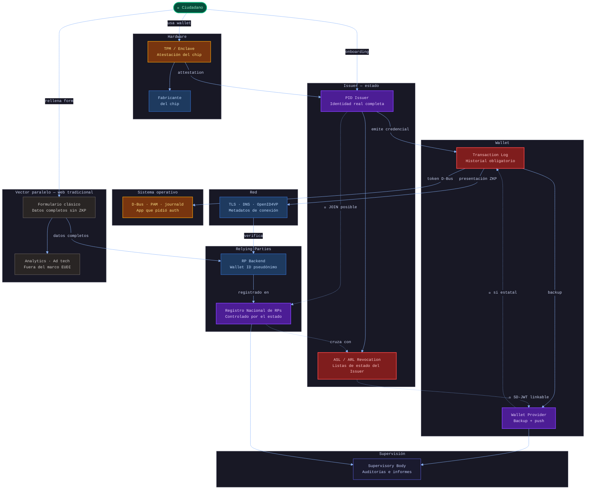
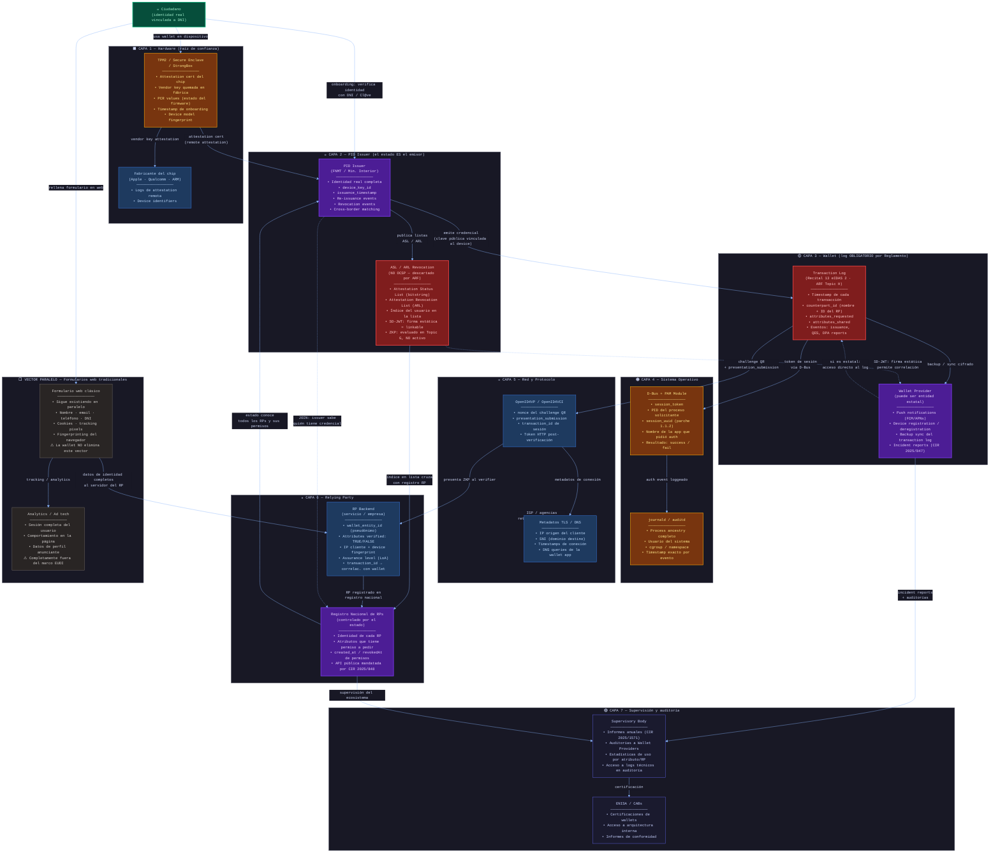

# EUDI Wallet — Vectores de logging gubernamental

> **Análisis técnico** basado en el ARF v2.5.0 (GitHub `eu-digital-identity-wallet`), Discussion Topic H,
> CIRs 2024/2977–2982 y 2025/846–1571, y la especificación de la Mini Wallet liberada en abril de 2025.

---

## Contexto: la promesa y la realidad

La EUDI Wallet presenta la divulgación selectiva como su escudo de privacidad, y en los materiales
de comunicación oficial (incluyendo el vídeo analizado) se usa el término "Zero-Knowledge Proof".
Es necesario precisar esto técnicamente: el ARF actual **no usa ZKP verdadero**. Usa principalmente
**SD-JWT** (Selective Disclosure JSON Web Token) e **ISO 18013-5** (mDL), que permiten revelar
selectivamente atributos, pero cuya firma subyacente es la misma en cada presentación. Esto
significa que distintos Verifiers que compartan datos (o el propio Issuer si recibe la presentación)
pueden correlacionar presentaciones de la misma credencial. Los criptógrafos que asesoraron al equipo
de la Comisión Europea en junio de 2024 señalaron explícitamente en el repositorio GitHub que SD-JWT
"cannot structurally support unlinkability". ZKP está siendo evaluado como Topic G del ARF para
versiones futuras, pero no forma parte de la implementación actual.

Lo que sí es correcto: el **Relying Party** (el portal administrativo) recibe solo
un "OK, cumple el requisito". No recibe nombre, fecha de nacimiento ni dirección. La privacidad
frente al RP es real. Pero hay vectores de correlación en otros nodos del ecosistema.

Pero ese diseño tiene una capa inferior que el discurso oficial omite: **el ecosistema entero está construido
sobre actores que sí acumulan información completa**. El estado como Issuer, el estado como Wallet Provider,
el estado como Registrar de Relying Parties. Cada uno de esos nodos tiene visibilidad parcial o total.
Combinados, reconstruyen el historial completo del ciudadano sin que el Relying Party haya tenido que
guardar un solo dato de identidad.

A esto se añade un punto crítico que a menudo se ignora: **que técnicamente la web no necesite pedir más
datos no impide que lo siga haciendo exactamente como hasta ahora**. Nada en la arquitectura EUDI
prohíbe que un formulario siga recogiendo nombre, email, teléfono y DNI en paralelo a la verificación
via wallet. El sistema ofrece una alternativa de privacidad; no elimina los vectores de recogida
tradicionales. La adopción real dependerá de regulación coercitiva sobre los RPs, no del diseño técnico.

---

## Diagrama simplificado — visión general

Vista de alto nivel con todos los actores y su nivel de acceso, sin detalle de campos.
Útil como referencia rápida o para compartir con audiencias no técnicas.



**Leyenda de colores:**
- 🟣 Violeta — nodo controlado directamente por el estado
- 🔴 Rojo oscuro — alta visibilidad, log obligatorio por reglamento
- 🟠 Naranja — visibilidad media, acceso via OS o metadatos
- 🔵 Azul oscuro — acceso vía orden judicial o ISP
- ⬛ Gris — vector paralelo fuera del marco EUDI
- 🟢 Verde — el ciudadano
- ➡ Líneas sólidas — flujo normal de datos
- ⤏ Líneas punteadas — correlaciones gubernamentales posibles

---

## Diagrama de vectores — detalle técnico completo

El siguiente diagrama incluye los campos específicos registrados en cada nodo
y las referencias normativas del ARF.



---

## Capas detalladas

### Capa 1 — Hardware (TPM2 / Secure Enclave / StrongBox)

**Riesgo: medio-alto · Actor: Issuer + fabricante del chip**

Durante el onboarding, el PID Issuer realiza una **remote attestation**: interroga el chip del dispositivo
para verificar que es hardware auténtico y no un emulador. Este proceso genera y registra en el Issuer:

- El attestation certificate del chip (incluye vendor key quemada en fábrica)
- El informe del estado actual del sistema (PCR values, estado del secure boot, versión del firmware)
- Timestamp exacto del onboarding y fingerprint del modelo de dispositivo
- La clave pública generada en el chip, vinculada matemáticamente al hardware físico

**Lo que esto implica**: el estado sabe exactamente qué dispositivo físico emitió cada credencial.
Si un ciudadano cambia de teléfono, el re-onboarding genera un nuevo evento. Si el dispositivo es
confiscado, el serial del chip ya está en los logs del Issuer vinculado al DNI del titular.

Las actualizaciones de enero de 2026 (parche 1.1.2) añadieron validación obligatoria mediante APIs
de attestation de hardware (Play Integrity API de Google / DeviceCheck de Apple), lo que extiende
los logs de attestation a las plataformas de Google y Apple.

---

### Capa 2 — PID Issuer (el estado ES el emisor)

**Riesgo: alto · Actor: estado directamente**

Este es el nodo más crítico del sistema y el que el discurso de privacidad de la wallet tiende a
minimizar. El Issuer no es un tercero neutral: **es el propio estado** (en España, la FNMT o el
ministerio competente). Tiene acceso completo a:

- Identidad real verificada completa (nombre, fecha de nacimiento, dirección, número de documento)
- `device_key_id`: el identificador de la clave del dispositivo vinculada a esa identidad
- `issuance_timestamp`: cuándo se emitió la credencial
- Historial de re-issuances y revocaciones con motivos
- Cross-border identity matching (CIR 2025/846): correlación con registros de otros estados miembro

**Poder de revocación**: el Reglamento establece que la revocación solo puede hacerse por orden judicial.
Pero la infraestructura técnica es un botón. La garantía es jurídica, no técnica.

---

### Capa 3 — Transaction Log de la Wallet (OBLIGATORIO por Reglamento)

**Riesgo: alto · Actor: Wallet Provider + confiscación del dispositivo**

El ARF Discussion Topic H y el Recital 13 del Reglamento eIDAS 2 exigen que la wallet guarde
un log completo de **cada transacción ejecutada**, con los siguientes campos mínimos:

| Campo | Descripción |
|-------|-------------|
| `timestamp` | Fecha y hora exacta de la transacción |
| `counterpart_id` | Nombre, datos de contacto e ID único del RP, incluyendo estado miembro |
| `attributes_requested` | Lista de atributos que el RP solicitó |
| `attributes_shared` | Lista de atributos efectivamente revelados |

El ARF amplía esto a: eventos de issuance/re-issuance, presentaciones, creación de QES, solicitudes
de borrado de atributos (DASH_02-05), y reportes enviados a la autoridad de protección de datos.

**La tensión central**: la justificación de este log es legítima — que el ciudadano pueda ejercer sus
derechos GDPR (art. 17, derecho de supresión). Pero ese mismo log es la ficha de actividad digital
completa del ciudadano. Si el Wallet Provider es una entidad estatal (como prevé el mandato de 2026),
el estado que emite credenciales y el que tiene acceso al log de uso son la misma entidad.

---

### Capa 4 — Mecanismo de revocación: ASL / ARL (no OCSP)

**Riesgo: medio · Actor: Issuer (publica las listas)**

> ⚠️ **Corrección respecto a descripciones habituales**: el ARF ha descartado explícitamente el OCSP
> clásico como mecanismo de revocación. La propia documentación del Discussion Topic A afirma que
> *"implementing a solution similar to an OCSP Responder is definitely not accepted"* porque permite
> al Issuer conocer cuándo y ante qué Verifier se usa cada credencial, rompiendo la unlinkability.

El ARF especifica **tres mecanismos de revocación** alternativos:

1. **Attestations de vida corta** (≤24 horas): no requieren revocación. El Wallet Unit solicita
   re-issuance cuando caduca. Es el mecanismo más privado.
2. **Attestation Status List (ASL)**: un bitstring publicado por el Issuer donde cada credencial
   ocupa un índice aleatorio. El Verifier descarga la lista completa y comprueba el bit localmente.
   El Issuer no sabe qué índice verificó el Verifier en ese momento.
3. **Attestation Revocation List (ARL)**: basada en ISO 18013-5, similar a una CRL tradicional
   pero con índices aleatorizados para reducir la correlabilidad.

**El riesgo residual real con ASL/ARL**:
- El índice del usuario es estático dentro de la misma credencial. Si distintos Verifiers comparten
  ese índice con el Issuer (por ejemplo, indirectamente via la propia lista), la correlación es posible.
- La AEPD y la comunidad criptográfica han señalado que SD-JWT (el formato principal del ARF) no
  garantiza unlinkability real: la firma subyacente es la misma en cada presentación, permitiendo
  tracking entre Verifiers si éstos coludieran o compartieran datos con el Issuer.
- El ARF evalúa ZKP (Topic G) como mitigación futura, pero **no está implementado en el ARF actual**.

**Acceso gubernamental**: el Issuer controla la publicación de las listas. Puede, en teoría, construir
listas con granularidad suficiente para inferir patrones de uso, o retener el historial de emisión
de cada índice vinculado a la identidad real del ciudadano.

---

### Capa 5 — Sistema Operativo (D-Bus · PAM · journald)

**Riesgo: medio · Actor: acceso local root / confiscación**

El vídeo analiza en detalle el flujo para Linux. El navegador envía el token de sesión via D-Bus,
donde el módulo PAM actúa como portero. Los parches de seguridad (1.04 y 1.1.2) añadieron controles
que, como efecto secundario, crean un trail forense:

**En journald / auditd quedan registrados**:
- `session_token` transmitido via D-Bus
- `PID` del proceso que solicitó autenticación (el navegador, la app)
- `session_uuid` y `start_time` del proceso (añadidos en parche 1.1.2 contra PID spoofing)
- Nombre del proceso y usuario del sistema
- Timestamp de cada evento PAM_AUTH

En una confiscación del dispositivo o con acceso root, este log vincula **qué app específica solicitó
verificación de edad, cuándo y con qué resultado**. En Windows y macOS el flujo es similar pero
con menor visibilidad para el usuario (Event Log / Unified Log).

> **Nota**: los parches descritos en esta sección proceden de la transcripción del vídeo analizado.
> Las vulnerabilidades son arquitecturalmente coherentes, pero los números de versión exactos no
> han sido verificados contra el historial de commits del repositorio GitHub oficial.

---

### Capa 6 — Red y Protocolo (OpenID4VP · TLS · DNS)

**Riesgo: medio · Actor: ISP / agencias de inteligencia**

Aunque el payload de la ZKP viaja cifrado, los **metadatos de red** no lo están:

- IP de origen del cliente → identifica al usuario (con resolución del ISP)
- SNI en el handshake TLS → puede revelar el dominio del RP visitado. **Matización importante**:
  el Encrypted Client Hello (ECH), ya estandarizado como RFC 9849 y soportado por iOS, Android,
  Firefox y Chromium, cifra el SNI. Su adopción en el lado servidor avanza pero no es universal
  todavía (principalmente en CDNs como Cloudflare). Donde ECH no está desplegado, el SNI es
  visible en claro para el ISP o cualquier observador de la red.
- Timestamp de conexión → cuándo ocurrió
- DNS queries de la wallet app → qué endpoints del Issuer y Verifier contactó

**Nota legal importante**: la Directiva 2006/24 sobre retención de datos fue declarada **nula por el
TJUE en abril de 2014** (asuntos C-293/12 y C-594/12, *Digital Rights Ireland*) por vulnerar los
derechos fundamentales a la privacidad y protección de datos. No existe una directiva europea de
retención de metadatos de comunicaciones en vigor. Las leyes nacionales de transposición subsisten
en algunos estados mientras no se derogan expresamente — en España, la Ley 25/2007 permanece
vigente aunque su compatibilidad con el Derecho de la UE es jurídicamente cuestionable. El riesgo
de correlación mediante metadatos de red existe, pero su alcance legal varía por país y no puede
afirmarse de forma uniforme para toda la UE.

---

### Capa 7 — Registro Nacional de Relying Parties

**Riesgo: alto · Actor: estado directamente**

Todo Relying Party debe registrarse en el registro nacional indicando:
- Su identidad completa (nombre, contacto, certificados RPAC y RPRC)
- Para qué servicio específico solicita datos (**intended use**)
- Qué atributos tiene permiso a solicitar
- Fechas de validez de cada permiso (`created_at` / `revokedAt`, según TS5)

El estado gestiona este registro y tiene visibilidad directa de **qué servicios están autorizados
a solicitar qué datos**. Cruzando el registro con los logs de OCSP y con los informes del Supervisory
Body, el estado puede reconstruir patrones de uso sin acceso directo al transaction log del ciudadano.

---

### Vector paralelo — Formularios web tradicionales (fuera del marco EUDI)

**Este es el punto más ignorado del debate.**

Que la arquitectura EUDI permita verificar mayoría de edad sin revelar datos de identidad **no impide
que la web siga usando formularios tradicionales exactamente como hasta ahora**. Nada en el Reglamento
prohíbe que un servicio solicite, en paralelo o en lugar de la wallet:

- Nombre y apellidos, email, teléfono
- Número de documento (DNI, NIE, pasaporte)
- Copia del documento via upload (método actual más extendido)
- Consentimiento de cookies + tracking pixels + fingerprinting del navegador

**La diferencia es coercitiva, no técnica**: la wallet ofrece una alternativa de privacidad, pero
el estado tendría que obligar activamente a los RPs a usarla exclusivamente — con multas y mecanismos
de cumplimiento reales — para que los formularios tradicionales desaparezcan. De momento, la Comisión
ha dado el código y ha dicho que ya no habrá excusa técnica para no implementarlo. La presión
regulatoria sobre los RPs para abandonar los formularios es una batalla política separada.

Además, incluso si un RP usa la wallet correctamente para la verificación, **nada le impide seguir
recogiendo datos de comportamiento** (analytics, sesiones, compras, patrones de uso) a través de
los mecanismos de tracking habituales: Google Analytics, Meta Pixel, sistemas de CRM propios.
La wallet solo protege el momento de la verificación de identidad, no el resto de la sesión.

---

### Capa 8 — Supervisory Body e informes anuales

**Riesgo: arquitectural · Actor: Supervisory Body (designado por el estado)**

El CIR 2025/1571 obliga a los Supervisory Bodies (designados por cada estado miembro) a elaborar
informes anuales con estadísticas del ecosistema. En el contexto de una auditoría de conformidad,
el Supervisory Body tiene acceso a los logs técnicos internos del Wallet Provider. Esto crea un
vector de acceso indirecto: el estado accede a datos de uso del sistema bajo el paraguas de la
supervisión regulatoria.

---

## La correlación gubernamental: el join que lo une todo

El diseño de la EUDI Wallet garantiza que **ningún actor individual** vea el cuadro completo.
El RP no sabe quién eres. El Issuer no sabe a qué RP fuiste. La wallet es pseudónima.

Pero el estado tiene acceso a **varios nodos simultáneamente**:

```
PID Issuer (sabe quién eres)
    +
Registro Nacional de RPs (sabe a qué servicios fuiste)
    +
ASL/ARL + SD-JWT firma estática (correlación entre presentaciones)
    +
Wallet Provider si es estatal (sabe el log completo)
    =
Historial completo de actividad digital del ciudadano
```

Esta correlación no requiere vulnerar la criptografía. No requiere hackear nada. Requiere únicamente
que el estado **ejerza los derechos de acceso que el propio Reglamento le otorga** sobre los nodos
que él mismo controla.

---

## Superficie de ataque técnico identificada en el código

| Vulnerabilidad | Parche (según vídeo) | Descripción |
|----------------|----------------------|-------------|
| DBus Reflector bypass | 1.04 | Módulo PAM confiaba en mensajes de autorización sin verificar al emisor |
| PID Spoofing | 1.1.2 | Suplantación de proceso mediante manipulación del PID; resuelto con `start_time` + `session_uuid` |
| Device emulation en onboarding | Ene 2026 | Emuladores podían pasar la attestación; resuelto con validación obligatoria via Secure Enclave / StrongBox APIs |

> ⚠️ Los números de versión de parche (1.04, 1.1.2) proceden de la transcripción del vídeo analizado
> y no han sido verificados directamente contra el historial de commits del repositorio GitHub. Las
> vulnerabilidades descritas son técnicamente coherentes con la arquitectura, pero los identificadores
> exactos de versión deben tomarse con cautela.

---

## Conclusión

La EUDI Wallet es un avance técnico real sobre el modelo actual (formularios + foto del DNI).
Reduce el riesgo para el ciudadano frente a los Relying Parties privados. Pero no reduce —
y en algunos aspectos amplía mediante mandato legal — la visibilidad del estado sobre la actividad
digital de sus ciudadanos. La paradoja es que el mismo Reglamento que exige privacidad frente a
las bigtech crea una infraestructura de logging obligatoria que consolida información en nodos
controlados estatalmente.

La pregunta relevante no es si el sistema es criptográficamente sólido (lo es). Es quién controla
los nodos de confianza y bajo qué condiciones políticas operan.

---

*Fuentes: ARF v2.5.0 · Discussion Topic H · Discussion Topic A (Privacy risks) · CIR 2024/2977-2982 · CIR 2025/846-1571 · ETSI TS 119 411-8 / 119 475 · OpenID4VP draft · RFC 9849 (ECH) · TJUE C-293/12 (anulación Directiva 2006/24) · AEPD blog "eIDAS2, the EUDI wallet and the GDPR (II)" · Cryptographers' Feedback on the EUDI ARF (GitHub Discussion #211) · transcripción del vídeo analizado*
