# Guía Completa de Diagramas Mermaid con Fondo Negro
*Explorando todos los tipos de diagramas con las mejores paletas de colores*

## Índice de Contenidos

1. [Configuración Base Universal](#configuración-base-universal)
2. [Flowchart - Diagramas de Flujo](#1-flowchart---diagramas-de-flujo)
3. [Sequence - Diagramas de Secuencia](#2-sequence---diagramas-de-secuencia)
4. [Class - Diagramas de Clase](#3-class---diagramas-de-clase)
5. [State - Diagramas de Estado](#4-state---diagramas-de-estado)
6. [Entity Relationship - Diagramas ER](#5-entity-relationship---diagramas-er)
7. [User Journey - Mapas de Experiencia](#6-user-journey---mapas-de-experiencia)
8. [Gantt - Cronogramas](#7-gantt---cronogramas)
9. [Pie - Gráficos Circulares](#8-pie---gráficos-circulares)
10. [Requirement - Diagramas de Requisitos](#9-requirement---diagramas-de-requisitos)
11. [Gitgraph - Flujos de Git](#10-gitgraph---flujos-de-git)
12. [C4Context - Arquitectura de Software](#11-c4context---arquitectura-de-software)
13. [Mindmaps - Mapas Mentales](#12-mindmaps---mapas-mentales)
14. [Timeline - Líneas de Tiempo](#13-timeline---líneas-de-tiempo)
15. [Sankey - Diagramas de Flujo](#14-sankey---diagramas-de-flujo)
16. [XYChart - Gráficos XY](#15-xychart---gráficos-xy)
17. [Block - Diagramas de Bloques](#16-block---diagramas-de-bloques)

---

## Configuración Base Universal

**Fondo Negro Standard**: `#000000`  
**Tema Base**: `dark` con `darkMode: true`

```javascript
%%{init: {
  'theme': 'dark',
  'themeVariables': {
    'darkMode': true,
    'background': '#000000',
    'primaryColor': '[PRIMARIO]',
    'primaryTextColor': '[TEXTO]',
    'primaryBorderColor': '[BORDE]',
    'lineColor': '[LINEA]',
    'secondaryColor': '[SECUNDARIO]',
    'tertiaryColor': '[TERCIARIO]',
    'fontSize': '12px'
  }
}}%%
```

---

## 1. FLOWCHART - Diagramas de Flujo

**Paleta Recomendada**: **Cyber Blue** - Para lógica clara y flujos de proceso

### Configuración Cyber Blue
```javascript
'background': '#000000',
'primaryColor': '#00d4ff',
'primaryTextColor': '#ffffff',
'primaryBorderColor': '#0099cc',
'lineColor': '#00ffff',
'secondaryColor': '#0066ff',
'tertiaryColor': '#3366ff'
```

### Ejemplo: Proceso de Toma de Decisiones

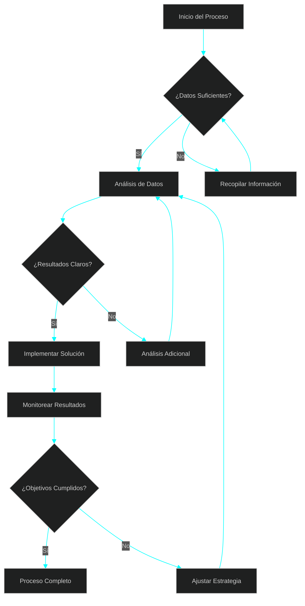

**Casos de Uso**: Procesos empresariales, algoritmos, workflows, diagramas de decisión

---

## 2. SEQUENCE - Diagramas de Secuencia

**Paleta Recomendada**: **Matrix Green** - Para interacciones temporales claras

### Configuración Matrix Green
```javascript
'background': '#000000',
'primaryColor': '#00ff41',
'primaryTextColor': '#00ff41',
'primaryBorderColor': '#00cc33',
'lineColor': '#00ff88',
'secondaryColor': '#66ff66',
'tertiaryColor': '#99ff99',
'sequenceActorBorder': '#00ff41',
'sequenceActorBkg': '#003300',
'sequenceNoteBkg': '#004400'
```

### Ejemplo: Sistema de Autenticación

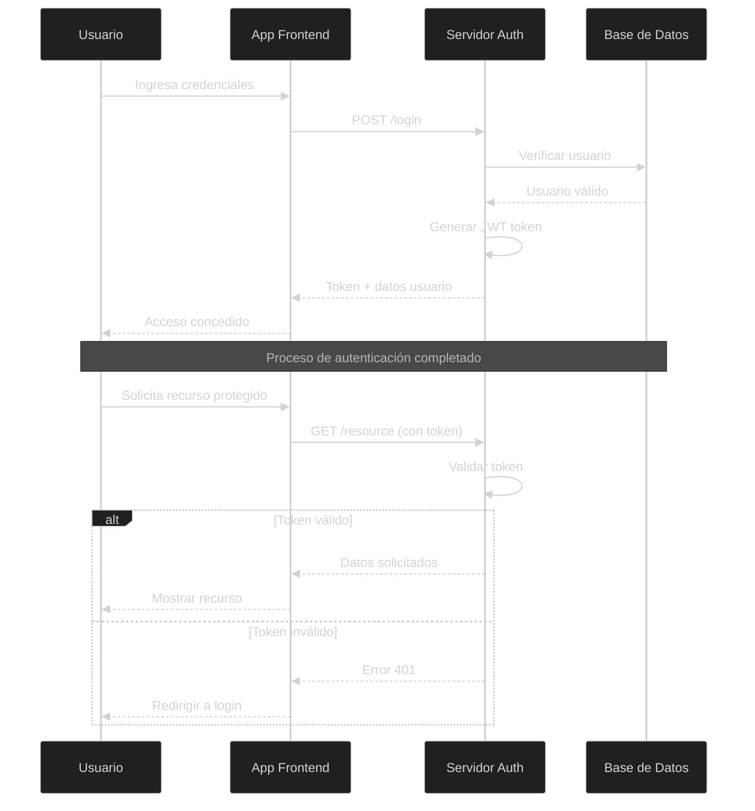

**Casos de Uso**: APIs, comunicación entre sistemas, protocolos de red, interacciones usuario-sistema

---

## 3. CLASS - Diagramas de Clase

**Paleta Recomendada**: **Purple Haze** - Para estructuras y relaciones complejas

### Configuración Purple Haze
```javascript
'background': '#000000',
'primaryColor': '#9966ff',
'primaryTextColor': '#ffffff',
'primaryBorderColor': '#7744cc',
'lineColor': '#bb88ff',
'secondaryColor': '#cc99ff',
'tertiaryColor': '#6633cc'
```

### Ejemplo: Sistema de Gestión de Biblioteca

```mermaid
%%{init: {
  'theme': 'dark',
  'themeVariables': {
    'darkMode': true,
    'background': '#000000',
    'primaryColor': '#9966ff',
    'primaryTextColor': '#ffffff',
    'primaryBorderColor': '#7744cc',
    'lineColor': '#bb88ff',
    'secondaryColor': '#cc99ff',
    'tertiaryColor': '#6633cc',
    'fontSize': '11px'
  }
}}%%

classDiagram
    class Usuario {
        +String nombre
        +String email
        +String telefono
        +Date fechaRegistro
        +prestarLibro(libro)
        +devolverLibro(libro)
        +consultarHistorial()
    }
    
    class Libro {
        +String titulo
        +String autor
        +String isbn
        +Boolean disponible
        +Date fechaPublicacion
        +marcarPrestado()
        +marcarDisponible()
        +obtenerInfo()
    }
    
    class Prestamo {
        +Date fechaPrestamo
        +Date fechaVencimiento
        +Date fechaDevolucion
        +Estado estado
        +calcularMulta()
        +renovar()
        +finalizar()
    }
    
    class Biblioteca {
        +String nombre
        +String direccion
        +List~Libro~ catalogo
        +List~Usuario~ usuarios
        +agregarLibro(libro)
        +registrarUsuario(usuario)
        +procesarPrestamo(usuario, libro)
    }
    
    Usuario ||--o{ Prestamo : "realiza"
    Libro ||--o{ Prestamo : "se presta en"
    Biblioteca ||--o{ Libro : "contiene"
    Biblioteca ||--o{ Usuario : "tiene registrado"
    
    class Estado {
        <<enumeration>>
        ACTIVO
        VENCIDO
        DEVUELTO
        RENOVADO
    }
    
    Prestamo --> Estado
```

**Casos de Uso**: Diseño de software OOP, arquitectura de sistemas, modelado de datos, documentación técnica

---

## 4. STATE - Diagramas de Estado

**Paleta Recomendada**: **Fire Orange** - Para transiciones dinámicas y estados activos

### Configuración Fire Orange
```javascript
'background': '#000000',
'primaryColor': '#ff6600',
'primaryTextColor': '#ffffff',
'primaryBorderColor': '#cc5500',
'lineColor': '#ff9944',
'secondaryColor': '#ffaa66',
'tertiaryColor': '#ff8833'
```

### Ejemplo: Estados de un Pedido E-commerce

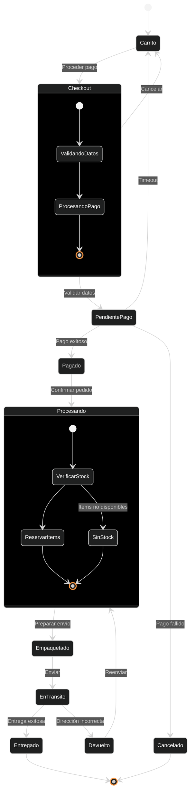

**Casos de Uso**: Máquinas de estado, flujos de trabajo, ciclos de vida de objetos, procesos de negocio

---

## 5. ENTITY RELATIONSHIP - Diagramas ER

**Paleta Recomendada**: **Electric Blue** - Para relaciones de datos claras

### Configuración Electric Blue
```javascript
'background': '#000000',
'primaryColor': '#0099ff',
'primaryTextColor': '#ffffff',
'primaryBorderColor': '#0077cc',
'lineColor': '#33aaff',
'secondaryColor': '#66bbff',
'tertiaryColor': '#0055aa'
```

### Ejemplo: Base de Datos de Red Social

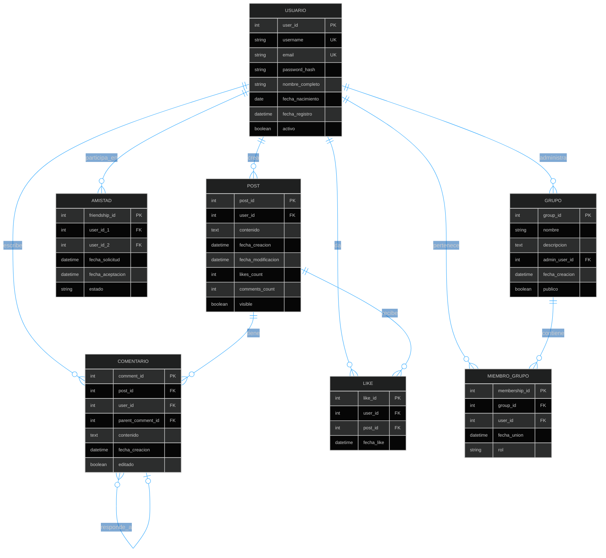

**Casos de Uso**: Diseño de bases de datos, modelado de datos, documentación de esquemas, arquitectura de información

---

## 6. USER JOURNEY - Mapas de Experiencia

**Paleta Recomendada**: **Sunset Gradient** - Para experiencias emocionales

### Configuración Sunset Gradient
```javascript
'background': '#000000',
'primaryColor': '#ff7f50',
'primaryTextColor': '#ffffff',
'primaryBorderColor': '#ff6347',
'lineColor': '#ffa07a',
'secondaryColor': '#ffb347',
'tertiaryColor': '#ff8c69'
```

### Ejemplo: Experiencia de Compra Online

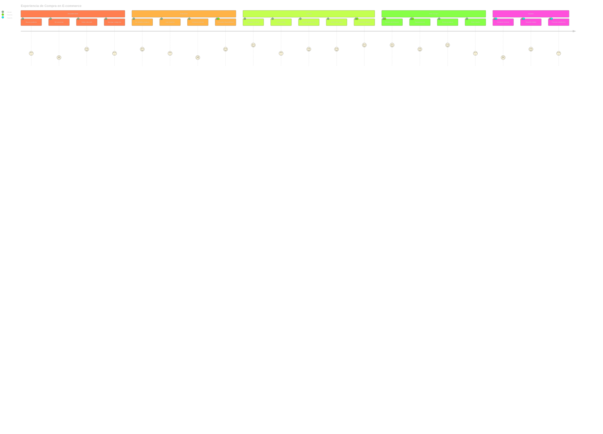

**Casos de Uso**: UX Design, análisis de experiencia cliente, mapas de touchpoints, diseño de servicios

---

## 7. GANTT - Cronogramas

**Paleta Recomendada**: **Professional Green** - Para planificación temporal clara

### Configuración Professional Green
```javascript
'background': '#000000',
'primaryColor': '#28a745',
'primaryTextColor': '#ffffff',
'primaryBorderColor': '#1e7e34',
'lineColor': '#40c057',
'cScale0': '#28a745',
'cScale1': '#20c997',
'cScale2': '#6f42c1',
'gridColor': '#495057'
```

### Ejemplo: Desarrollo de Aplicación Web

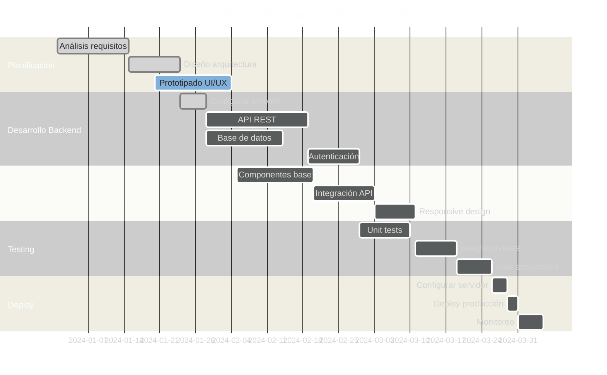

**Casos de Uso**: Gestión de proyectos, planificación temporal, seguimiento de tareas, cronogramas empresariales

---

## 8. PIE - Gráficos Circulares

**Paleta Recomendada**: **Rainbow Spectrum** - Para datos categóricos diversos

### Configuración Rainbow Spectrum
```javascript
'background': '#000000',
'primaryColor': '#ff0080',
'primaryTextColor': '#ffffff',
'pie1': '#ff0080',
'pie2': '#ff8000',
'pie3': '#ffff00',
'pie4': '#80ff00',
'pie5': '#00ff80',
'pie6': '#00ffff',
'pie7': '#0080ff',
'pie8': '#8000ff',
'pie9': '#ff0040',
'pie10': '#ff4000',
'pie11': '#ff8040',
'pie12': '#ffff80'
```

### Ejemplo: Distribución de Tráfico Web

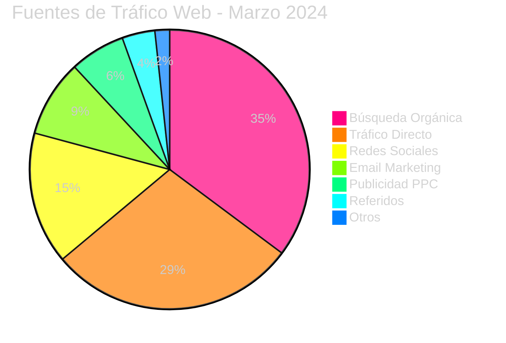

### Ejemplo: Análisis de Ventas por Categoría

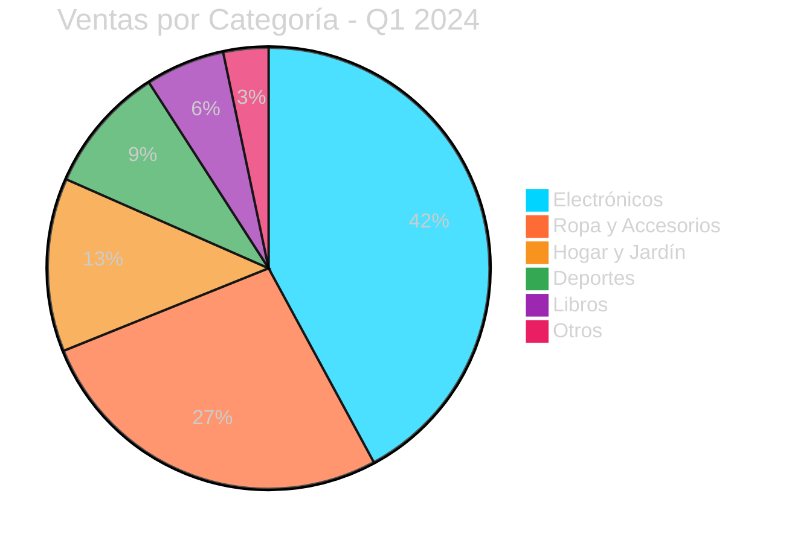

**Casos de Uso**: Análisis estadístico, reportes empresariales, visualización de proporciones, dashboards

---

## 9. REQUIREMENT - Diagramas de Requisitos

**Paleta Recomendada**: **Corporate Blue** - Para documentación formal

### Configuración Corporate Blue
```javascript
'background': '#000000',
'primaryColor': '#1e3a8a',
'primaryTextColor': '#ffffff',
'primaryBorderColor': '#1e40af',
'lineColor': '#3b82f6',
'secondaryColor': '#60a5fa',
'tertiaryColor': '#93c5fd'
```

### Ejemplo: Sistema de Gestión de Inventarios

```mermaid
%%{init: {
  'theme': 'dark',
  'themeVariables': {
    'darkMode': true,
    'background': '#000000',
    'primaryColor': '#1e3a8a',
    'primaryTextColor': '#ffffff',
    'primaryBorderColor': '#1e40af',
    'lineColor': '#3b82f6',
    'secondaryColor': '#60a5fa',
    'tertiaryColor': '#93c5fd',
    'fontSize': '11px'
  }
}}%%

requirementDiagram

    requirement Gestión_Inventario {
        id: 1
        text: El sistema debe permitir gestión completa de inventarios
        risk: Medium
        verifymethod: Test
    }

    element Sistema_Inventario {
        type: System
    }

    functionalRequirement Registro_Productos {
        id: 1.1
        text: Registrar nuevos productos con código único
        risk: Low
        verifymethod: Test
    }

    functionalRequirement Control_Stock {
        id: 1.2
        text: Monitorear niveles de stock en tiempo real
        risk: High
        verifymethod: Analysis
    }

    functionalRequirement Alertas_Stock {
        id: 1.3
        text: Generar alertas automáticas de stock mínimo
        risk: Medium
        verifymethod: Test
    }

    performanceRequirement Tiempo_Respuesta {
        id: 2.1
        text: Tiempo de respuesta menor a 2 segundos
        risk: Medium
        verifymethod: Test
    }

    interfaceRequirement API_Externa {
        id: 3.1
        text: Integración con sistemas de facturación externos
        risk: High
        verifymethod: Integration
    }

    Gestión_Inventario - contains -> Registro_Productos
    Gestión_Inventario - contains -> Control_Stock
    Gestión_Inventario - contains -> Alertas_Stock
    Gestión_Inventario - satisfies -> Tiempo_Respuesta
    Sistema_Inventario - implements -> Gestión_Inventario
    Sistema_Inventario - implements -> API_Externa
```

**Casos de Uso**: Ingeniería de software, documentación de proyectos, análisis de sistemas, especificaciones técnicas

---

## 10. GITGRAPH - Flujos de Git

**Paleta Recomendada**: **Developer Dark** - Para workflows de desarrollo

### Configuración Developer Dark
```javascript
'background': '#000000',
'primaryColor': '#f78166',
'primaryTextColor': '#ffffff',
'primaryBorderColor': '#f25022',
'lineColor': '#7fb069',
'git0': '#f78166',
'git1': '#7fb069',
'git2': '#4c956c',
'git3': '#2f9599',
'git4': '#61a5c2',
'git5': '#a9c9dd',
'git6': '#c9ada7',
'git7': '#f2cc8f'
```

### Ejemplo: Flujo de Trabajo Feature Branch

```mermaid
%%{init: {
  'theme': 'dark',
  'themeVariables': {
    'darkMode': true,
    'background': '#000000',
    'primaryColor': '#f78166',
    'primaryTextColor': '#ffffff',
    'git0': '#f78166',
    'git1': '#7fb069',
    'git2': '#4c956c',
    'git3': '#2f9599',
    'git4': '#61a5c2',
    'fontSize': '11px'
  }
}}%%

gitgraph
    commit id: "Initial commit"
    commit id: "Setup project structure"
    
    branch develop
    checkout develop
    commit id: "Add base configuration"
    commit id: "Setup testing framework"
    
    branch feature/user-auth
    checkout feature/user-auth
    commit id: "Add login component"
    commit id: "Implement authentication"
    commit id: "Add password reset"
    
    checkout develop
    merge feature/user-auth
    commit id: "Update documentation"
    
    branch feature/dashboard
    checkout feature/dashboard
    commit id: "Create dashboard layout"
    commit id: "Add charts component"
    
    checkout develop
    branch hotfix/security-patch
    checkout hotfix/security-patch
    commit id: "Fix security vulnerability"
    
    checkout main
    merge hotfix/security-patch
    commit id: "v1.0.1 - Security patch"
    
    checkout develop
    merge hotfix/security-patch
    merge feature/dashboard
    
    checkout main
    merge develop
    commit id: "v1.1.0 - Dashboard release"
```

**Casos de Uso**: Control de versiones, workflows de desarrollo, documentación de releases, gestión de branches

---

## 11. C4CONTEXT - Arquitectura de Software

**Paleta Recomendada**: **Architecture Gray** - Para diagramas técnicos profesionales

### Configuración Architecture Gray
```javascript
'background': '#000000',
'primaryColor': '#6c757d',
'primaryTextColor': '#ffffff',
'primaryBorderColor': '#495057',
'lineColor': '#adb5bd',
'secondaryColor': '#74b9ff',
'tertiaryColor': '#00b894'
```

### Ejemplo: Contexto de Sistema E-commerce

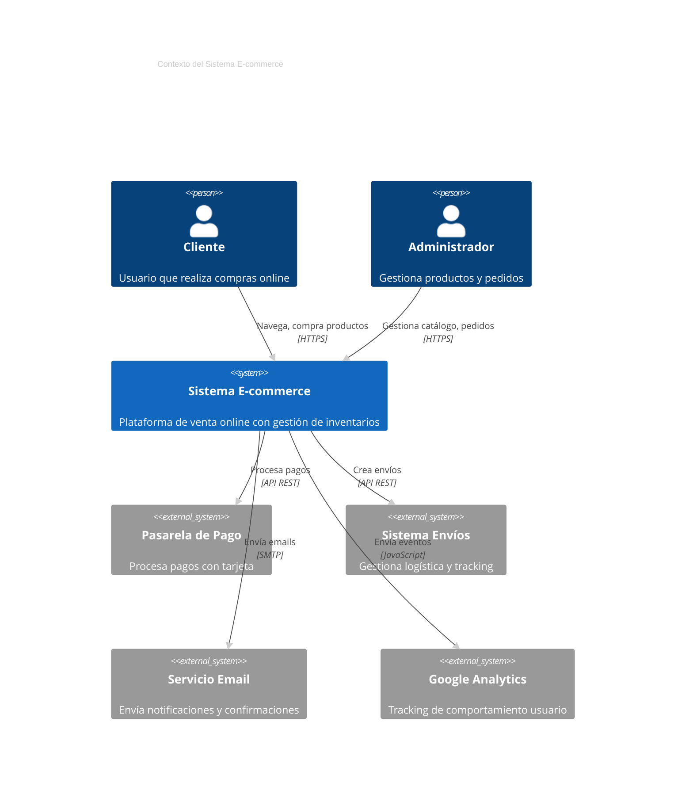

**Casos de Uso**: Arquitectura de sistemas, documentación técnica, diseño de microservicios, diagramas de contexto

---

## 12. MINDMAPS - Mapas Mentales

**Paleta Recomendada**: **Creative Rainbow** - Para brainstorming y creatividad

### Configuración Creative Rainbow
```javascript
'background': '#000000',
'primaryColor': '#ff6b6b',
'primaryTextColor': '#ffffff',
'primaryBorderColor': '#ee5a52',
'lineColor': '#4ecdc4',
'secondaryColor': '#45b7d1',
'tertiaryColor': '#f9ca24',
'quaternaryColor': '#6c5ce7',
'primaryColorLight': '#ffeaa7'
```

### Ejemplo: Estrategia de Marketing Digital

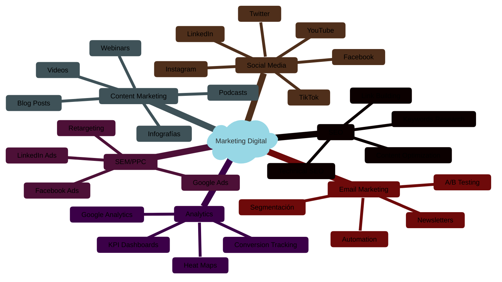

### Ejemplo: Planificación de Proyecto de Software

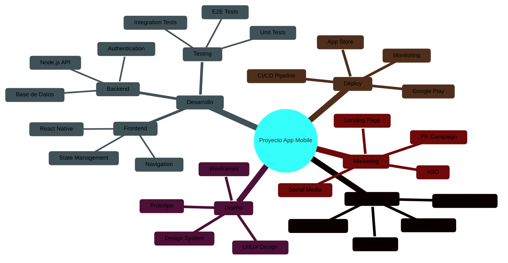

**Casos de Uso**: Brainstorming, planificación estratégica, organización de ideas, mapas conceptuales

---

## 13. TIMELINE - Líneas de Tiempo

**Paleta Recomendada**: **Chronos Gold** - Para eventos temporales elegantes

### Configuración Chronos Gold
```javascript
'background': '#000000',
'primaryColor': '#ffd700',
'primaryTextColor': '#000000',
'primaryBorderColor': '#ffcc00',
'lineColor': '#ffa500',
'secondaryColor': '#ff8c00',
'tertiaryColor': '#ffb347'
```

### Ejemplo: Evolución de la Web

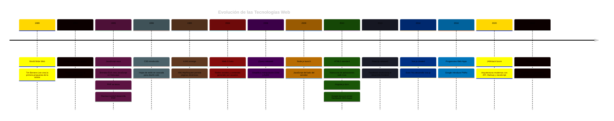

### Ejemplo: Roadmap de Producto

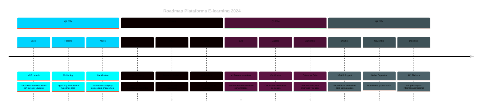

**Casos de Uso**: Historias corporativas, roadmaps de producto, cronologías históricas, planificación temporal

---

## 14. SANKEY - Diagramas de Flujo

**Paleta Recomendada**: **Flow Spectrum** - Para visualizar flujos de datos/energía

### Configuración Flow Spectrum
```javascript
'background': '#000000',
'primaryColor': '#00ffff',
'primaryTextColor': '#ffffff',
'primaryBorderColor': '#00cccc',
'lineColor': '#40e0d0',
'secondaryColor': '#48d1cc',
'tertiaryColor': '#20b2aa'
```

### Ejemplo: Flujo de Energía en Empresa

```mermaid
%%{init: {
  'theme': 'dark',
  'themeVariables': {
    'darkMode': true,
    'background': '#000000',
    'primaryColor': '#00ffff',
    'primaryTextColor': '#ffffff',
    'primaryBorderColor': '#00cccc',
    'lineColor': '#40e0d0',
    'secondaryColor': '#48d1cc',
    'tertiaryColor': '#20b2aa',
    'fontSize': '11px'
  }
}}%%

sankey-beta
    Energía Total,Electricidad,150
    Energía Total,Gas Natural,80
    Energía Total,Renovables,70
    
    Electricidad,Oficinas,60
    Electricidad,Producción,70
    Electricidad,Servidores,20
    
    Gas Natural,Calefacción,50
    Gas Natural,Producción,30
    
    Renovables,Oficinas,20
    Renovables,Producción,35
    Renovables,Venta Red,15
    
    Oficinas,CO2 Oficinas,40
    Oficinas,Eficiencia,40
    
    Producción,CO2 Industrial,60
    Producción,Productos,75
    
    Servidores,CO2 IT,15
    Servidores,Servicios Digital,5
```

### Ejemplo: Flujo de Usuarios en Aplicación

```mermaid
%%{init: {
  'theme': 'dark',
  'themeVariables': {
    'darkMode': true,
    'background': '#000000',
    'primaryColor': '#ff6b35',
    'primaryTextColor': '#ffffff',
    'primaryBorderColor': '#e55a2b',
    'lineColor': '#ff8c42',
    'secondaryColor': '#ffa62b',
    'fontSize': '11px'
  }
}}%%

sankey-beta
    Visitantes,Landing Page,10000
    Visitantes,Búsqueda Orgánica,8000
    Visitantes,Redes Sociales,5000
    Visitantes,Email Marketing,3000
    
    Landing Page,Registro,2500
    Landing Page,Abandono,7500
    
    Búsqueda Orgánica,Artículos Blog,4000
    Búsqueda Orgánica,Productos,3000
    Búsqueda Orgánica,Registro,1000
    
    Redes Sociales,Compartir,2000
    Redes Sociales,Registro,1500
    Redes Sociales,Abandono,1500
    
    Email Marketing,Conversión,1800
    Email Marketing,Unsuscribe,200
    Email Marketing,Abandono,1000
    
    Registro,Usuario Activo,3500
    Registro,Usuario Inactivo,1500
    
    Usuario Activo,Compra,1400
    Usuario Activo,Trial,2100
    
    Compra,Cliente Recurrente,1000
    Compra,Cliente Único,400
```

**Casos de Uso**: Análisis de flujos, visualización de procesos, análisis de conversión, diagramas energéticos

---

## 15. XYCHART - Gráficos XY

**Paleta Recomendada**: **Data Viz Blue** - Para análisis estadístico claro

### Configuración Data Viz Blue
```javascript
'background': '#000000',
'primaryColor': '#1f77b4',
'primaryTextColor': '#ffffff',
'primaryBorderColor': '#1a6ba8',
'lineColor': '#aec7e8',
'secondaryColor': '#ff7f0e',
'tertiaryColor': '#2ca02c'
```

### Ejemplo: Análisis de Rendimiento Web

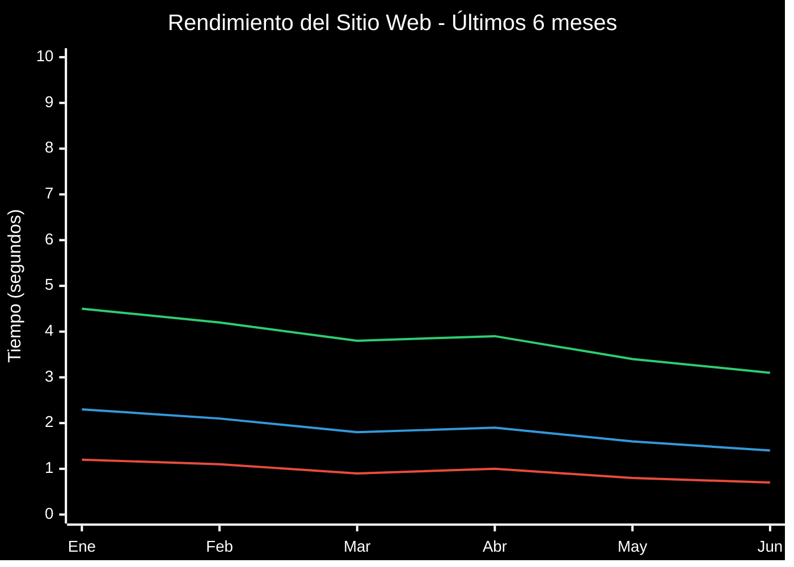

### Ejemplo: Crecimiento de Usuarios

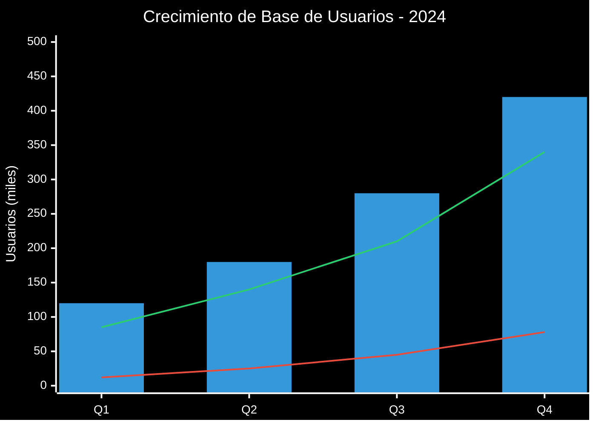

**Casos de Uso**: Análisis de datos, reportes de KPIs, gráficos estadísticos, dashboards de métricas

---

## 16. BLOCK - Diagramas de Bloques

**Paleta Recomendada**: **System Architecture** - Para diagramas técnicos modulares

### Configuración System Architecture
```javascript
'background': '#000000',
'primaryColor': '#4a90e2',
'primaryTextColor': '#ffffff',
'primaryBorderColor': '#357abd',
'lineColor': '#7bb3f0',
'secondaryColor': '#f5a623',
'tertiaryColor': '#bd10e0'
```

### Ejemplo: Arquitectura de Microservicios

```mermaid
%%{init: {
  'theme': 'dark',
  'themeVariables': {
    'darkMode': true,
    'background': '#000000',
    'primaryColor': '#4a90e2',
    'primaryTextColor': '#ffffff',
    'primaryBorderColor': '#357abd',
    'lineColor': '#7bb3f0',
    'secondaryColor': '#f5a623',
    'tertiaryColor': '#bd10e0',
    'fontSize': '10px'
  }
}}%%

block-beta
columns 3

  block:frontend:2
    A["Web Frontend<br/>React.js"]
    B["Mobile App<br/>React Native"]
  end
  
  C["Load Balancer<br/>NGINX"]

  block:gateway:3
    D["API Gateway<br/>Kong"]
  end

  block:services:3
    E["User Service<br/>Node.js"]
    F["Product Service<br/>Java"]
    G["Order Service<br/>Python"]
  end

  block:databases:3
    H["Users DB<br/>PostgreSQL"]
    I["Products DB<br/>MongoDB"]
    J["Orders DB<br/>MySQL"]
  end

  block:infrastructure:3
    K["Message Queue<br/>RabbitMQ"]
    L["Cache<br/>Redis"]
    M["File Storage<br/>AWS S3"]
  end

  A --> C
  B --> C
  C --> D
  D --> E
  D --> F
  D --> G
  E --> H
  F --> I
  G --> J
  E --> L
  F --> L
  G --> K
  F --> M
```

### Ejemplo: Sistema de Procesamiento de Datos

```mermaid
%%{init: {
  'theme': 'dark',
  'themeVariables': {
    'darkMode': true,
    'background': '#000000',
    'primaryColor': '#bd10e0',
    'primaryTextColor': '#ffffff',
    'primaryBorderColor': '#9a0fb0',
    'lineColor': '#d63af0',
    'secondaryColor': '#00d4aa',
    'tertiaryColor': '#ffa500',
    'fontSize': '11px'
  }
}}%%

block-beta
columns 4

  block:input:4
    A["Data Sources"]
    B["APIs"]
    C["Files"]
    D["Streams"]
  end

  block:ingestion:2
    E["Data Ingestion<br/>Apache Kafka"]
    F["ETL Pipeline<br/>Apache Airflow"]
  end
  
  block:processing:2
    G["Stream Processing<br/>Apache Spark"]
    H["Batch Processing<br/>Hadoop"]
  end

  block:storage:4
    I["Data Lake<br/>AWS S3"]
    J["Data Warehouse<br/>Snowflake"]
    K["Real-time DB<br/>Cassandra"]
    L["Cache Layer<br/>Redis"]
  end

  block:analytics:4
    M["BI Tools<br/>Tableau"]
    N["ML Platform<br/>SageMaker"]
    O["Monitoring<br/>Grafana"]
    P["APIs<br/>FastAPI"]
  end

  A --> E
  B --> E
  C --> F
  D --> E
  E --> G
  F --> H
  G --> I
  G --> K
  H --> J
  I --> M
  J --> M
  K --> N
  L --> O
  J --> P
```

**Casos de Uso**: Arquitecturas de sistema, diagramas de infraestructura, modelos de datos, diseño de redes

---

## Guía de Selección de Paletas por Contexto

### 🔧 **Desarrollo y Tecnología**
- **Flowchart**: Cyber Blue - Lógica y procesos claros
- **Sequence**: Matrix Green - Comunicación entre sistemas
- **Class**: Purple Haze - Estructuras complejas
- **Gitgraph**: Developer Dark - Workflows de código

### 📊 **Análisis y Datos**
- **Pie**: Rainbow Spectrum - Datos categóricos diversos
- **XYChart**: Data Viz Blue - Análisis estadístico
- **Sankey**: Flow Spectrum - Flujos de información
- **Gantt**: Professional Green - Gestión temporal

### 🏢 **Empresa y Negocios**
- **User Journey**: Sunset Gradient - Experiencias emocionales
- **Requirement**: Corporate Blue - Documentación formal
- **Timeline**: Chronos Gold - Eventos importantes
- **C4Context**: Architecture Gray - Sistemas empresariales

### 🎨 **Creatividad y Estrategia**
- **Mindmap**: Creative Rainbow - Brainstorming libre
- **State**: Fire Orange - Transiciones dinámicas
- **Block**: System Architecture - Módulos técnicos
- **ER**: Electric Blue - Relaciones de datos

## Tips Finales de Implementación

### 1. **Consistencia Visual**
```javascript
// Usar la misma paleta para diagramas relacionados
const paletaProyecto = {
  'background': '#000000',
  'primaryColor': '#00d4ff',
  'primaryTextColor': '#ffffff',
  // ... resto de configuración
};
```

### 2. **Adaptación Contextual**
- **Presentaciones ejecutivas**: Colores corporativos suaves
- **Documentación técnica**: Paletas contrastantes y claras  
- **Workshops creativos**: Colores vibrantes y energéticos

### 3. **Accesibilidad**
- Mantener contraste mínimo 4.5:1 para texto
- No depender solo del color para información crítica
- Probar con simuladores de daltonismo

### 4. **Exportación y Compartir**
- Los diagramas mantienen el fondo negro al exportar a SVG
- Para presentaciones, considerar versión con fondo adaptable
- Documentar la paleta usada para futura referencia

---

**¿Qué tipo de diagrama necesitas crear?** Esta guía te ayudará a elegir tanto el formato como la paleta más adecuada para tu contexto específico, manteniendo siempre el elegante fondo negro como base visual consistente.