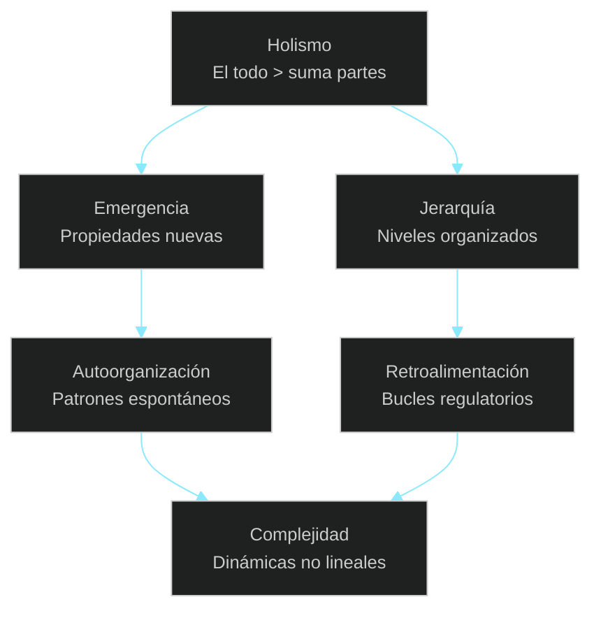
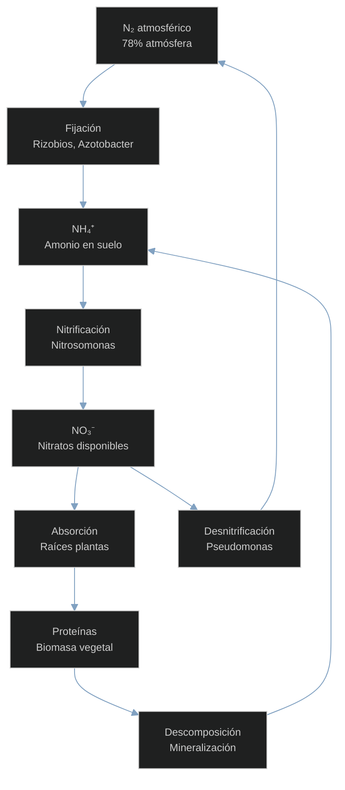
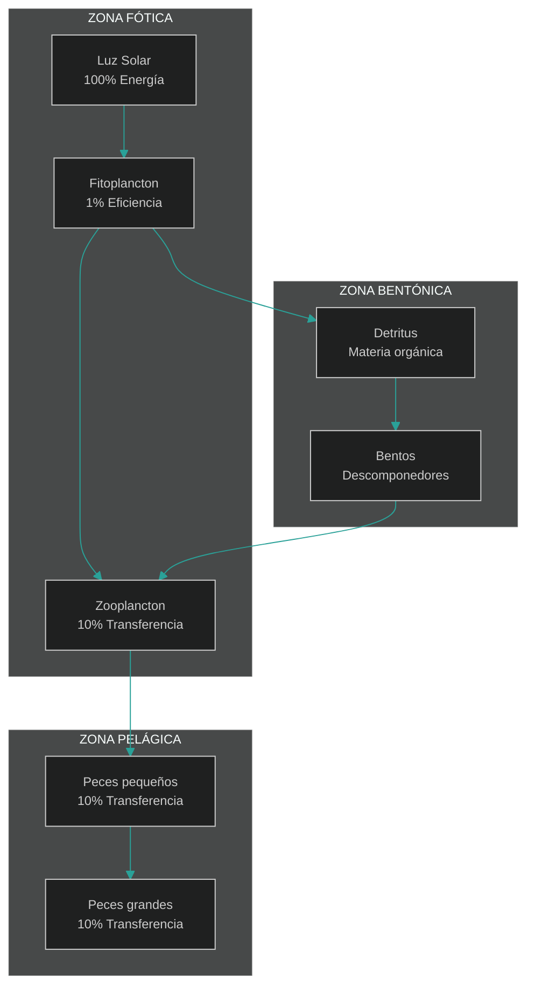
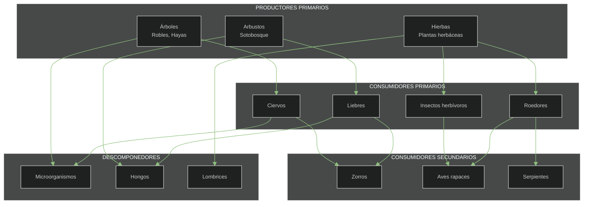
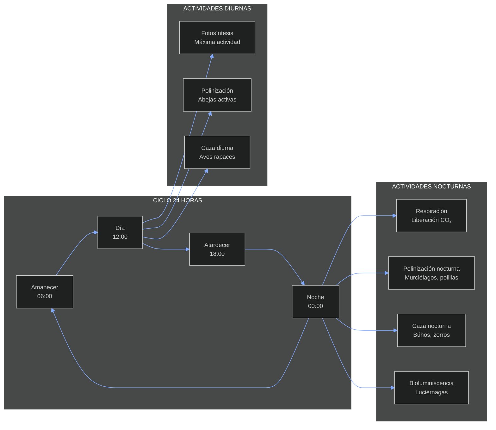
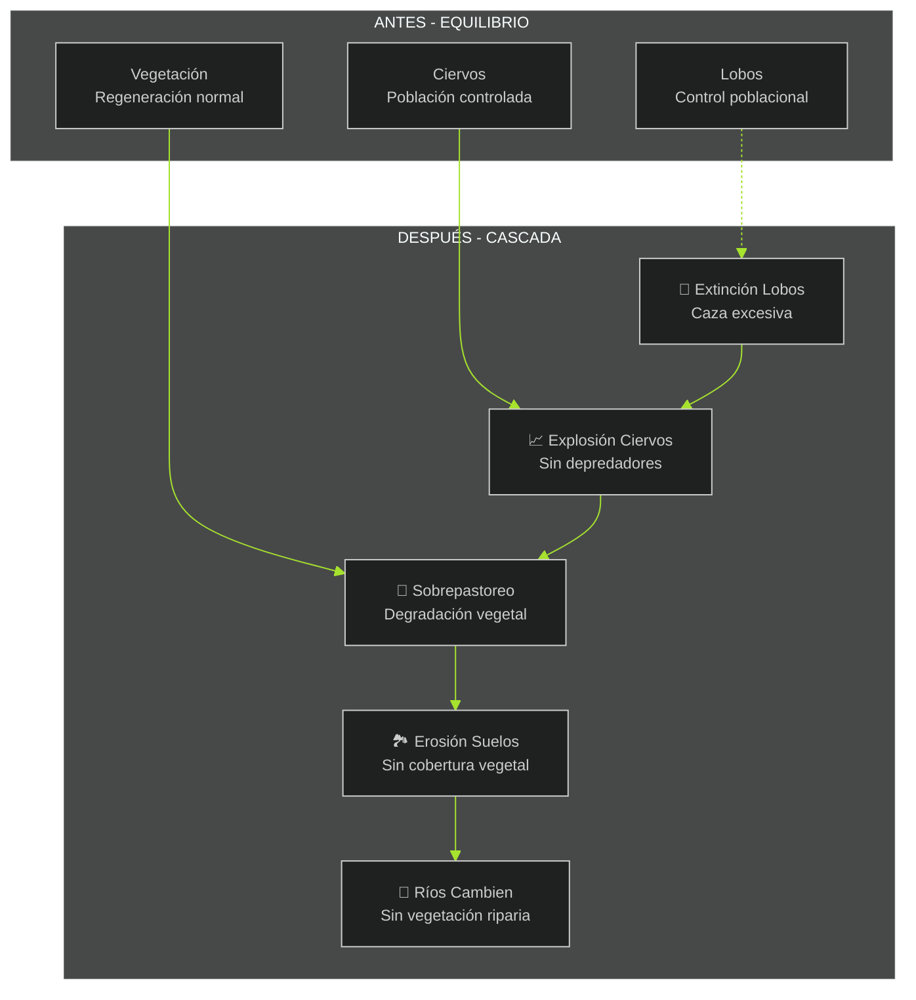
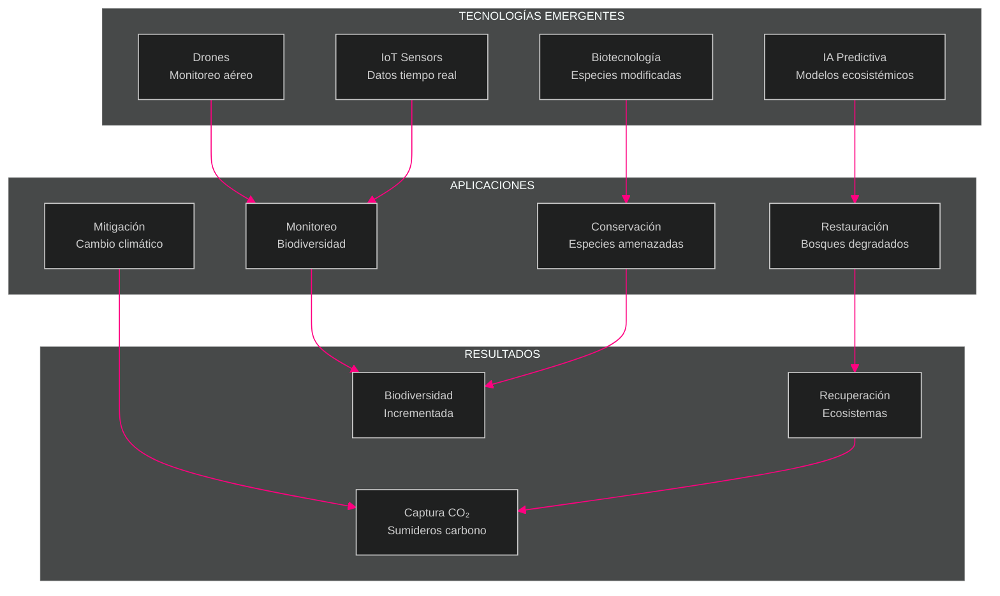

# Guía de Paletas de Colores para Diagramas Mermaid - Ecología de Sistemas

## Paletas Disponibles y sus Características

| Nombre Paleta | Descripción | Color Fondo Componente | Color Fuente | Contexto Ideal |
|---------------|-------------|------------------------|--------------|----------------|
| **Dracula** | Clásico oscuro con tonos morados y verdes | `#44475a` | `#f8f8f2` | Diagramas generales, conceptos abstractos |
| **Nord Dark** | Inspirado en paisajes árticos | `#3b4252` | `#d8dee9` | Ecosistemas terrestres, ciclos naturales |
| **Solarized Dark** | Gama cálida equilibrada con azules suaves | `#073642` | `#839496` | Sistemas acuáticos, flujos energéticos |
| **Gruvbox Dark** | Paleta terrosa con acentos naranjas y verdes | `#3c3836` | `#ebdbb2` | Sistemas edáficos, cadenas tróficas |
| **Night Owl** | Colores intensos tipo "editor nocturno" | `#0d1821` | `#a3be8c` | Procesos nocturnos, bioluminiscencia |
| **Monokai** | Contrastes fuertes con amarillo y rosa | `#272822` | `#f8f8f2` | Alertas, perturbaciones, estados críticos |
| **Neon Pulse** | Tonos neón brillantes para máxima energía | `#000000` | `#39ff14` | Dinámicas rápidas, sistemas high-tech |

## Configuración Base para Todas las Paletas

```javascript
%%{init: {
  'theme': 'dark',
  'themeVariables': {
    'darkMode': true,
    'background': '[COLOR_FONDO]',
    'primaryColor': '[COLOR_PRIMARIO]',
    'primaryTextColor': '[COLOR_FUENTE]',
    'primaryBorderColor': '[COLOR_BORDE]',
    'lineColor': '[COLOR_LINEA]',
    'secondaryColor': '[COLOR_SECUNDARIO]',
    'tertiaryColor': '[COLOR_TERCIARIO]',
    'fontSize': '12px'
  }
}}%%
```

---

## 1. DRACULA PALETTE
**Mejor para**: Diagramas conceptuales generales, marcos teóricos, relaciones abstractas

### Configuración Dracula
```javascript
'background': '#44475a',
'primaryColor': '#bd93f9',
'primaryTextColor': '#f8f8f2',
'primaryBorderColor': '#6272a4',
'lineColor': '#8be9fd',
'secondaryColor': '#ff79c6',
'tertiaryColor': '#50fa7b'
```

### Ejemplo: Diagrama Conceptual - Principios de Ecología de Sistemas



**Cuándo usar Dracula**: Marcos teóricos, principios fundamentales, conceptos abstractos, introducciones generales

---

## 2. NORD DARK PALETTE
**Mejor para**: Ecosistemas terrestres, ciclos biogeoquímicos, procesos naturales

### Configuración Nord Dark
```javascript
'background': '#3b4252',
'primaryColor': '#88c0d0',
'primaryTextColor': '#d8dee9',
'primaryBorderColor': '#5e81ac',
'lineColor': '#81a1c1',
'secondaryColor': '#bf616a',
'tertiaryColor': '#a3be8c'
```

### Ejemplo: Ciclo del Nitrógeno



**Cuándo usar Nord Dark**: Ciclos biogeoquímicos, ecosistemas boreales/templados, procesos del suelo, sucesión ecológica

---

## 3. SOLARIZED DARK PALETTE
**Mejor para**: Sistemas acuáticos, flujos energéticos, procesos hídricos

### Configuración Solarized Dark
```javascript
'background': '#073642',
'primaryColor': '#268bd2',
'primaryTextColor': '#839496',
'primaryBorderColor': '#586e75',
'lineColor': '#2aa198',
'secondaryColor': '#cb4b16',
'tertiaryColor': '#859900'
```

### Ejemplo: Flujo Energético en Ecosistema Acuático



**Cuándo usar Solarized Dark**: Ecosistemas marinos/lacustres, cadenas tróficas acuáticas, ciclos de nutrientes en agua

---

## 4. GRUVBOX DARK PALETTE
**Mejor para**: Sistemas edáficos, cadenas tróficas terrestres, redes alimentarias

### Configuración Gruvbox Dark
```javascript
'background': '#3c3836',
'primaryColor': '#fabd2f',
'primaryTextColor': '#ebdbb2',
'primaryBorderColor': '#665c54',
'lineColor': '#8ec07c',
'secondaryColor': '#fb4934',
'tertiaryColor': '#83a598'
```

### Ejemplo: Red Trófica del Bosque Templado



**Cuándo usar Gruvbox Dark**: Ecosistemas forestales, redes tróficas complejas, sistemas edáficos, interacciones planta-animal

---

## 5. NIGHT OWL PALETTE
**Mejor para**: Procesos nocturnos, bioluminiscencia, ritmos circadianos

### Configuración Night Owl
```javascript
'background': '#0d1821',
'primaryColor': '#7fdbca',
'primaryTextColor': '#a3be8c',
'primaryBorderColor': '#2d3748',
'lineColor': '#82aaff',
'secondaryColor': '#ff6b6b',
'tertiaryColor': '#ffc947'
```

### Ejemplo: Ritmos Circadianos en Ecosistemas



**Cuándo usar Night Owl**: Ecología nocturna, ritmos biológicos, migración, comportamiento animal nocturno

---

## 6. MONOKAI PALETTE
**Mejor para**: Alertas, perturbaciones, estados críticos, sistemas bajo estrés

### Configuración Monokai
```javascript
'background': '#272822',
'primaryColor': '#f92672',
'primaryTextColor': '#f8f8f2',
'primaryBorderColor': '#49483e',
'lineColor': '#a6e22e',
'secondaryColor': '#fd971f',
'tertiaryColor': '#66d9ef'
```

### Ejemplo: Cascada Trófica por Extinción de Depredador



**Cuándo usar Monokai**: Perturbaciones, extinción de especies, cambio climático, invasión de especies, colapso ecosistémico

---

## 7. NEON PULSE PALETTE
**Mejor para**: Dinámicas rápidas, tecnología, sistemas urbanos, biotecnología

### Configuración Neon Pulse
```javascript
'background': '#000000',
'primaryColor': '#39ff14',
'primaryTextColor': '#39ff14',
'primaryBorderColor': '#00ffff',
'lineColor': '#ff0080',
'secondaryColor': '#ffff00',
'tertiaryColor': '#ff6600'
```

### Ejemplo: Biotecnología en Restauración Ecológica



**Cuándo usar Neon Pulse**: Biotecnología, ecología urbana, sistemas artificiales, tecnología de conservación, biología sintética

---

## Consejos de Uso y Mejores Prácticas

### 1. Selección de Paleta según Contexto
- **Procesos naturales lentos**: Nord Dark, Gruvbox Dark
- **Sistemas acuáticos**: Solarized Dark
- **Conceptos abstractos**: Dracula
- **Situaciones críticas**: Monokai
- **Procesos nocturnos**: Night Owl
- **Tecnología aplicada**: Neon Pulse

### 2. Combinaciones Efectivas
- Usar máximo 3-4 colores diferentes por diagrama
- Mantener consistencia en series de diagramas relacionados
- Alternar paletas entre secciones para crear variedad visual

### 3. Adaptaciones Personalizadas
Puedes modificar cualquier color específico añadiendo variables adicionales:

```javascript
'nodeTextColor': '#ffffff',
'edgeLabelBackground': '#000000',
'clusterBkg': 'rgba(255,255,255,0.1)',
'clusterBorder': '#ffffff'
```

### 4. Consideraciones de Accesibilidad
- Todas las paletas mantienen contraste suficiente para legibilidad
- Evitar depender únicamente del color para transmitir información
- Usar formas y patrones como complemento

---

## Plantillas Rápidas de Configuración

### Plantilla Básica (Copiar y Pegar)
```javascript
%%{init: {
  'theme': 'dark',
  'themeVariables': {
    'darkMode': true,
    'background': '#CAMBIAR_AQUÍ',
    'primaryColor': '#CAMBIAR_AQUÍ',
    'primaryTextColor': '#CAMBIAR_AQUÍ',
    'primaryBorderColor': '#CAMBIAR_AQUÍ',
    'lineColor': '#CAMBIAR_AQUÍ',
    'secondaryColor': '#CAMBIAR_AQUÍ',
    'tertiaryColor': '#CAMBIAR_AQUÍ',
    'fontSize': '12px'
  }
}}%%
```

### Para Diagramas de Flujo Complejos
```javascript
'sequenceActorBorder': '#PRIMARIO',
'sequenceActorBkg': '#SECUNDARIO',
'sequenceNoteBkg': '#TERCIARIO',
'loopTextColor': '#TEXTO'
```

### Para Diagramas de Gantt
```javascript
'cScale0': '#COLOR1',
'cScale1': '#COLOR2',
'cScale2': '#COLOR3',
'gridColor': '#LINEA'
```

Esta guía te permitirá crear diagramas visualmente consistentes y apropiados para cada tipo de contenido ecológico que desees representar.